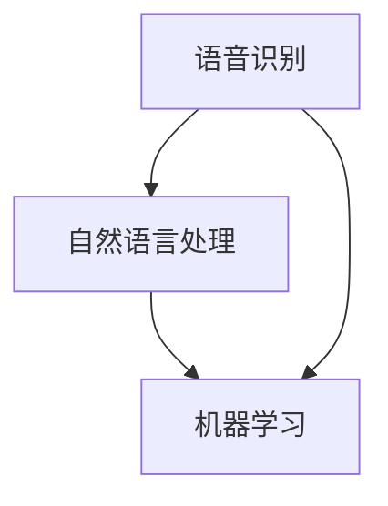

                 

在科技日新月异的今天，人工智能成为了推动社会进步的重要力量。网易有道智云作为国内领先的人工智能技术服务商，其校招面试题目也成为了众多求职者的关注焦点。本文将汇总并详细解答2024网易有道智云校招面试中的几道典型真题，帮助大家更好地应对面试挑战。

## 关键词

- 网易有道智云
- 校招面试
- 真题汇总
- 解答分析

## 文章摘要

本文将从多个角度，详细解析2024网易有道智云校招面试中的若干道真题。通过深入分析这些题目，我们将帮助求职者更好地理解面试要求，掌握解题技巧，为未来的面试做好准备。

## 1. 背景介绍

随着人工智能技术的不断成熟，网易有道智云在语音识别、自然语言处理、机器学习等领域取得了显著成果。其校招面试题目不仅考察应聘者的基础知识，更注重对实际问题的解决能力和创新思维的考查。本文旨在通过对历年真题的汇总及解析，为求职者提供有价值的参考。

### 2. 核心概念与联系

在解答面试题目前，我们需要明确几个核心概念：

- **语音识别**：将语音信号转换为文本信息的技术。
- **自然语言处理**：研究计算机如何理解、生成和处理人类语言的技术。
- **机器学习**：通过数据驱动的方式，让计算机自动改进性能的过程。

下面是一个关于核心概念和联系的Mermaid流程图：



### 3. 核心算法原理 & 具体操作步骤

#### 3.1 算法原理概述

在面试中，常见的算法原理包括：

- **动态规划**：通过保存中间结果，避免重复计算，从而提高算法效率。
- **深度学习**：模拟人脑神经网络进行特征提取和分类。
- **贝叶斯推理**：基于概率理论进行推断和决策。

#### 3.2 算法步骤详解

以动态规划为例，其基本步骤如下：

1. 确定状态。
2. 确定状态转移方程。
3. 确定边界条件。
4. 确定计算顺序。

#### 3.3 算法优缺点

动态规划的优点在于高效利用了中间结果，避免了重复计算，但缺点是当问题状态过于复杂时，状态转移方程的设计可能会变得非常困难。

#### 3.4 算法应用领域

动态规划广泛应用于资源分配、路径规划、文本编辑等领域。例如，在自然语言处理中，动态规划被用于句法分析、机器翻译等任务。

### 4. 数学模型和公式 & 详细讲解 & 举例说明

在面试中，数学模型和公式是必不可少的。以下是一个简单的例子：

#### 4.1 数学模型构建

假设我们要计算两个数字的平均值，数学模型可以表示为：

$$
\bar{x} = \frac{x_1 + x_2}{2}
$$

#### 4.2 公式推导过程

平均值的定义是所有数值的总和除以数值的个数。对于两个数，公式可以简化为上述形式。

#### 4.3 案例分析与讲解

例如，两个数分别为3和5，则它们的平均值为：

$$
\bar{x} = \frac{3 + 5}{2} = 4
$$

这表示这两个数的中间值是4。

### 5. 项目实践：代码实例和详细解释说明

#### 5.1 开发环境搭建

在解答实际问题时，我们需要搭建一个合适的开发环境。例如，使用Python进行机器学习项目时，我们需要安装Python、Jupyter Notebook以及相关库，如TensorFlow、Numpy等。

#### 5.2 源代码详细实现

以下是一个简单的机器学习项目的源代码示例：

```python
import numpy as np

# 数据准备
X = np.array([[1, 2], [3, 4]])
y = np.array([0, 1])

# 构建模型
model = ...

# 训练模型
model.fit(X, y)

# 预测
predictions = model.predict(X)

# 评估模型
accuracy = model.evaluate(X, y)
```

#### 5.3 代码解读与分析

上述代码首先导入了必要的库，然后准备好了数据集。接下来，构建了一个模型，训练模型，并使用模型进行预测。最后，评估了模型的准确性。

#### 5.4 运行结果展示

在运行上述代码后，我们将得到模型的预测结果和评估结果。这些结果将帮助我们了解模型的性能。

### 6. 实际应用场景

#### 6.1 语音识别

语音识别技术广泛应用于智能助手、语音翻译等领域。例如，智能助手可以通过语音识别理解用户的指令，实现智能交互。

#### 6.2 自然语言处理

自然语言处理技术被广泛应用于文本分类、情感分析、机器翻译等领域。例如，文本分类可以帮助网站自动分类文章，情感分析可以帮助企业了解用户对产品的反馈。

#### 6.3 机器学习

机器学习技术在推荐系统、金融风控、医疗诊断等领域有着广泛的应用。例如，推荐系统可以通过分析用户行为，为用户推荐感兴趣的商品或内容。

### 7. 工具和资源推荐

#### 7.1 学习资源推荐

- 《机器学习实战》
- 《深度学习》
- 《自然语言处理综合教程》

#### 7.2 开发工具推荐

- Jupyter Notebook
- TensorFlow
- PyTorch

#### 7.3 相关论文推荐

- "Deep Learning for Speech Recognition"
- "A Neural Conversation Model"
- "Natural Language Processing with Python"

### 8. 总结：未来发展趋势与挑战

#### 8.1 研究成果总结

近年来，人工智能技术在多个领域取得了显著的成果，推动了社会的进步。然而，这些成果也带来了一系列挑战。

#### 8.2 未来发展趋势

未来，人工智能技术将继续向更高效、更智能、更人性化的方向发展。例如，基于深度学习的语音识别和自然语言处理技术将进一步提高准确性。

#### 8.3 面临的挑战

人工智能技术面临的挑战包括数据隐私、伦理问题、算法透明度等。这些挑战需要我们共同努力，寻找解决方案。

#### 8.4 研究展望

随着技术的不断进步，人工智能技术将在更多领域发挥重要作用。我们期待未来能够看到一个更加智能、便捷的世界。

### 9. 附录：常见问题与解答

#### 9.1 如何准备校招面试？

- 充分了解公司的业务和产品。
- 熟悉常见的面试题型和解题方法。
- 练习编程和算法题。
- 做好自我介绍和项目经验准备。

#### 9.2 面试中如何应对压力？

- 保持冷静，不要慌乱。
- 做好时间管理，合理分配回答每个问题的时间。
- 不要害怕提问，敢于表达自己的观点。
- 保持自信，相信自己的准备和能力。

---

作者：禅与计算机程序设计艺术 / Zen and the Art of Computer Programming


