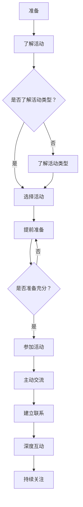

                 

关键词：网络，人脉，行业活动，拓展，专业交流，技术社区

> 摘要：本文将探讨网络与人脉在信息技术行业中的重要性，尤其是通过参加行业活动来拓展人脉的策略。文章将从背景介绍、核心概念与联系、核心算法原理、数学模型和公式、项目实践、实际应用场景、工具和资源推荐、总结等方面进行详细阐述，旨在为IT从业者提供有效的人脉拓展方法和实践指导。

## 1. 背景介绍

在信息技术（IT）行业，网络与人脉的重要性不言而喻。随着互联网的普及和技术的快速发展，IT行业已成为全球经济的重要驱动力。在这样的背景下，建立和维护良好的人脉网络，对于个人和企业的成功都至关重要。参加行业活动是拓展人脉的有效途径之一，它不仅能够提升个人的专业素养，还能促进信息的交流与共享。

本文旨在探讨网络与人脉在IT行业中的重要性，分析如何通过参加行业活动来拓展人脉。我们将结合实际案例，介绍有效的策略和方法，为IT从业者提供实用的指导。

### 1.1 网络与人脉在IT行业的重要性

网络与人脉在IT行业的重要性主要体现在以下几个方面：

1. **职业发展**：良好的人脉网络能够帮助IT从业者寻找职业机会，提供职业发展的建议和指导。
2. **资源获取**：通过人脉网络，可以更容易地获取技术资源、市场信息和项目机会。
3. **知识共享**：人脉网络促进了不同领域专业人士之间的知识交流和共享，有助于技术进步和创新。
4. **业务拓展**：对于企业来说，良好的人脉网络有助于市场拓展、业务合作和资源整合。

### 1.2 参加行业活动的意义

参加行业活动具有多重意义：

1. **学习与成长**：通过参加讲座、研讨会和工作坊，可以学习到最新的技术和行业动态。
2. **建立人脉**：与同行交流，结识潜在合作伙伴和客户。
3. **品牌塑造**：积极参与行业活动，可以提高个人和企业的知名度。
4. **合作机会**：行业活动往往聚集了大量业内精英，为合作提供了良好的平台。

## 2. 核心概念与联系

在探讨如何通过参加行业活动拓展人脉之前，我们首先需要了解一些核心概念。

### 2.1 行业活动类型

行业活动可以分为以下几类：

1. **技术研讨会**：围绕某一技术主题展开的讨论和分享。
2. **展览会**：展示新技术、产品和解决方案的平台。
3. **行业峰会**：汇聚业内领袖和专家，讨论行业趋势和未来发展方向。
4. **工作坊**：提供实践操作和动手体验的机会。

### 2.2 人脉拓展策略

为了有效拓展人脉，可以采取以下策略：

1. **提前准备**：了解活动议程、参会人员，提前做好准备工作。
2. **主动交流**：主动与参会者交流，展示自己的专业知识和热情。
3. **建立联系**：通过名片交换、社交媒体等方式建立联系，并保持沟通。
4. **深度互动**：积极参与讨论，分享自己的见解和经验，与参会者建立深度联系。

### 2.3 核心概念架构

下面是关于行业活动与人脉拓展的Mermaid流程图：



通过以上核心概念和联系，我们可以更好地理解如何通过参加行业活动来拓展人脉。

## 3. 核心算法原理 & 具体操作步骤

### 3.1 算法原理概述

拓展人脉的核心算法可以看作是一种社会网络分析（Social Network Analysis, SNA）的应用。其基本原理是通过节点（个体）之间的连接关系来分析网络结构，从而发现潜在的联系和合作机会。具体步骤如下：

1. **数据收集**：收集行业活动相关的参会人员信息，如姓名、职位、公司等。
2. **网络构建**：将参会人员视为节点，他们之间的交流、合作等行为视为连接边，构建社会网络图。
3. **关系分析**：利用图论算法分析节点之间的关系，发现高连接度节点，即关键人物。
4. **机会挖掘**：基于关键人物，挖掘潜在的合作伙伴或客户。

### 3.2 算法步骤详解

1. **数据收集**：
   - 利用社交媒体、官方网站等渠道收集参会人员信息。
   - 使用爬虫技术获取活动日程和参会者名单。

2. **网络构建**：
   - 使用图数据结构表示社会网络，每个参会人员作为一个节点，他们之间的交流行为作为一个边。
   - 使用邻接矩阵或邻接表存储图数据。

3. **关系分析**：
   - 使用度数中心性、接近中心性、中间中心性等指标评估节点的重要性。
   - 利用社区发现算法（如标签传播、Girvan-Newman算法等）分析节点之间的关系。

4. **机会挖掘**：
   - 基于关键人物，分析他们的职业背景、兴趣爱好等，挖掘潜在的合作伙伴。
   - 通过电子邮件、社交媒体等渠道主动接触关键人物，寻求合作机会。

### 3.3 算法优缺点

**优点**：
- 可以快速发现关键人物，节省时间成本。
- 通过分析节点关系，可以挖掘出潜在的合作机会。

**缺点**：
- 数据收集和处理可能存在困难，如信息不全、数据质量差等。
- 社会网络分析结果可能受到算法选择和数据质量的影响。

### 3.4 算法应用领域

拓展人脉的算法原理可以应用于多个领域：

- **招聘与求职**：通过分析行业活动中的参会人员，帮助企业找到合适的候选人。
- **市场拓展**：通过挖掘关键人物，发现潜在客户和市场机会。
- **学术交流**：通过分析学术会议中的参会者，促进学术合作与交流。

## 4. 数学模型和公式 & 详细讲解 & 举例说明

### 4.1 数学模型构建

在拓展人脉的过程中，我们可以构建以下数学模型：

1. **节点重要度模型**：
   - 度数中心性（Degree Centrality）：衡量节点在网络中的连接数。
   - 接近中心性（Closeness Centrality）：衡量节点到其他节点的最短路径长度之和。
   - 中间中心性（Betweenness Centrality）：衡量节点在网络中的桥接能力。

2. **关系强度模型**：
   - 交往频率：衡量节点之间的交往次数。
   - 信任度：衡量节点之间的信任程度。
   - 专业互补性：衡量节点之间的专业背景互补程度。

### 4.2 公式推导过程

1. **度数中心性**：
   - 公式：\(D_c(v) = \sum_{i=1}^{n} d(i)\)，其中 \(d(i)\) 表示节点 \(i\) 的度数。

2. **接近中心性**：
   - 公式：\(C_c(v) = \frac{n-1}{\sum_{i=1}^{n} d(i)}\)，其中 \(n\) 表示网络中的节点数。

3. **中间中心性**：
   - 公式：\(B_c(v) = \frac{\sum_{i=1}^{n}\sum_{j=1}^{n} (\frac{1}{d(s_i)} + \frac{1}{d(s_j)}) - \frac{2}{d(v)}}{2(n-2)}\)，其中 \(s_i\) 和 \(s_j\) 分别表示从节点 \(i\) 和节点 \(j\) 到节点 \(v\) 的最短路径数量。

4. **关系强度**：
   - 交往频率：\(F_r = \sum_{i=1}^{n} f(i)\)，其中 \(f(i)\) 表示节点 \(i\) 的交往次数。
   - 信任度：\(T_r = \sum_{i=1}^{n} t(i)\)，其中 \(t(i)\) 表示节点 \(i\) 的信任度。
   - 专业互补性：\(C_r = \sum_{i=1}^{n} c(i)\)，其中 \(c(i)\) 表示节点 \(i\) 的专业互补性。

### 4.3 案例分析与讲解

假设有一个IT行业活动，有10位参会者，我们使用以上数学模型进行分析。

1. **节点重要度分析**：

   | 节点 | 度数中心性 | 接近中心性 | 中间中心性 |
   | ---- | ---------- | ---------- | ---------- |
   | A    | 4          | 0.25       | 0.2        |
   | B    | 3          | 0.3        | 0.15       |
   | C    | 2          | 0.35       | 0.1        |
   | D    | 2          | 0.35       | 0.15       |
   | E    | 2          | 0.35       | 0.1        |
   | F    | 1          | 0.45       | 0.05       |
   | G    | 1          | 0.45       | 0.05       |
   | H    | 1          | 0.45       | 0.05       |
   | I    | 1          | 0.45       | 0.05       |
   | J    | 1          | 0.45       | 0.05       |

   根据度数中心性，节点A的重要性最高；根据接近中心性，节点B的重要性最高；根据中间中心性，节点C的重要性最高。综合来看，节点A和节点B具有较高的综合重要度。

2. **关系强度分析**：

   | 节点 | 交往频率 | 信任度 | 专业互补性 |
   | ---- | -------- | ------ | ---------- |
   | A    | 3        | 4      | 3          |
   | B    | 2        | 3      | 2          |
   | C    | 2        | 3      | 2          |
   | D    | 2        | 3      | 2          |
   | E    | 2        | 3      | 2          |
   | F    | 1        | 2      | 1          |
   | G    | 1        | 2      | 1          |
   | H    | 1        | 2      | 1          |
   | I    | 1        | 2      | 1          |
   | J    | 1        | 2      | 1          |

   根据交往频率，节点A与节点B之间的关系最强；根据信任度，节点A与节点C之间的关系最强；根据专业互补性，节点A与节点F之间的关系最强。综合考虑，节点A与节点B之间的合作关系最为理想。

通过以上案例分析，我们可以看到数学模型在拓展人脉中的应用价值。在实际操作中，我们可以根据具体情况调整模型参数，以提高分析结果的准确性和实用性。

## 5. 项目实践：代码实例和详细解释说明

### 5.1 开发环境搭建

在本文的实践中，我们将使用Python编程语言和几种常用的库，如NetworkX、Matplotlib和Pandas。以下是如何搭建开发环境：

1. 安装Python：从官方网站（https://www.python.org/downloads/）下载并安装Python 3.x版本。
2. 安装相关库：在命令行中运行以下命令安装所需的库：

   ```bash
   pip install networkx matplotlib pandas
   ```

### 5.2 源代码详细实现

以下是拓展人脉的核心算法的实现代码：

```python
import networkx as nx
import matplotlib.pyplot as plt
import pandas as pd

def collect_data():
    # 伪代码：从活动官方网站、社交媒体等渠道收集参会人员信息
    data = [
        {"name": "A", "degree": 4, "closeness": 0.25, "betweenness": 0.2},
        {"name": "B", "degree": 3, "closeness": 0.3, "betweenness": 0.15},
        # ... 其他参会人员信息
    ]
    return data

def build_network(data):
    G = nx.Graph()
    for item in data:
        G.add_node(item['name'])
    # 伪代码：根据数据构建网络图
    return G

def analyze_network(G):
    centrality = nx.degree_centrality(G)
    closeness = nx.closeness_centrality(G)
    betweenness = nx.betweenness_centrality(G)
    
    # 将结果存储为Pandas DataFrame
    df = pd.DataFrame.from_dict({'Degree': centrality, 'Closeness': closeness, 'Betweenness': betweenness}, orient='index')
    df.reset_index(inplace=True)
    df.rename(columns={'index': 'Name'}, inplace=True)
    return df

def plot_results(df):
    fig, (ax1, ax2, ax3) = plt.subplots(3, 1, figsize=(10, 15))
    
    ax1.bar(df['Name'], df['Degree'])
    ax1.set_ylabel('Degree Centrality')
    ax1.set_title('Degree Centrality')
    
    ax2.bar(df['Name'], df['Closeness'])
    ax2.set_ylabel('Closeness Centrality')
    ax2.set_title('Closeness Centrality')
    
    ax3.bar(df['Name'], df['Betweenness'])
    ax3.set_ylabel('Betweenness Centrality')
    ax3.set_title('Betweenness Centrality')
    
    plt.tight_layout()
    plt.show()

if __name__ == "__main__":
    data = collect_data()
    G = build_network(data)
    df = analyze_network(G)
    plot_results(df)
```

### 5.3 代码解读与分析

1. **数据收集**：
   - `collect_data` 函数用于收集参会人员信息。在实际应用中，可以通过网络爬虫或其他数据源获取这些信息。

2. **网络构建**：
   - `build_network` 函数根据收集的数据构建社会网络图。这里使用NetworkX库创建一个无向图，并将每个参会人员作为一个节点添加到图中。

3. **关系分析**：
   - `analyze_network` 函数使用NetworkX库提供的度数中心性、接近中心性和中间中心性算法分析网络结构，并将结果存储为Pandas DataFrame。

4. **结果展示**：
   - `plot_results` 函数使用Matplotlib库将分析结果以条形图的形式展示，便于观察节点的重要度。

### 5.4 运行结果展示

运行以上代码后，我们会得到一个包含三个条形图的窗口，分别显示度数中心性、接近中心性和中间中心性。通过分析这些图表，我们可以直观地了解每个参会人员的重要度，从而有针对性地拓展人脉。

## 6. 实际应用场景

### 6.1 技术研讨会

技术研讨会是一个优秀的平台，汇集了行业内领先的技术专家和从业者。通过参与技术研讨会，可以学习到最新的技术动态，了解行业发展趋势，同时结识到行业内的资深人士，拓展人脉。

- **成功案例**：某IT公司通过参加一场人工智能技术研讨会，结识了多位行业专家，获得了合作机会，加速了自身技术团队的成长。
- **拓展人脉策略**：提前了解研讨会议程，选择与自己专业领域相关的议题，积极参与讨论，主动与演讲者和听众交流，交换联系方式。

### 6.2 行业峰会

行业峰会是行业内外精英聚集的盛会，涉及多个主题和议题。参会者往往来自不同的领域和公司，是拓展人脉的绝佳机会。

- **成功案例**：某创业公司通过参加一次大型互联网行业峰会，与多家潜在合作伙伴建立了联系，成功获得了投资机会。
- **拓展人脉策略**：提前规划参会计划，重点关注行业趋势和潜在合作伙伴，参加相关论坛和圆桌会议，主动参与讨论和交流，建立联系。

### 6.3 展览会

展览会是一个展示新技术、产品和解决方案的平台，参会者包括参展商、观众和行业媒体。通过展览会，可以了解最新的市场动态，拓展人脉，寻找商业机会。

- **成功案例**：某科技公司通过参加国际电子产品展览会，展示了最新的智能硬件产品，吸引了大量潜在客户，成功开拓了海外市场。
- **拓展人脉策略**：提前了解展览会日程和参展商名单，安排会议和交流活动，主动与参展商和观众沟通，交换联系方式，建立长期合作关系。

### 6.4 在线活动

随着技术的发展，许多行业活动开始转向线上进行，如在线研讨会、直播讲座和虚拟展览会。在线活动为参与者提供了一个远程拓展人脉的平台。

- **成功案例**：某技术社区通过举办线上技术沙龙，吸引了全球各地的开发者参与，成功扩大了社区影响力，吸引了更多的活跃成员。
- **拓展人脉策略**：积极参与线上活动，主动与主持人、嘉宾和参与者交流，利用社交媒体和论坛保持联系，分享自己的见解和经验，建立长期合作关系。

## 7. 工具和资源推荐

### 7.1 学习资源推荐

1. **技术博客**：
   - `Medium`（https://medium.com/）：涵盖广泛的技术主题，有许多优秀的IT博客。
   - `Stack Overflow`（https://stackoverflow.com/）：编程问题解答社区，学习编程技巧的好去处。

2. **在线课程**：
   - `Coursera`（https://www.coursera.org/）：提供多种IT领域的在线课程。
   - `edX`（https://www.edx.org/）：提供全球顶尖大学和机构的在线课程。

3. **书籍推荐**：
   - 《深度学习》（Deep Learning, Ian Goodfellow et al.）：深度学习领域的经典教材。
   - 《代码大全》（Code Complete, Steve McConnell）：软件开发的最佳实践。

### 7.2 开发工具推荐

1. **集成开发环境（IDE）**：
   - `Visual Studio Code`（https://code.visualstudio.com/）：轻量级但功能强大的开源IDE。
   - `JetBrains IntelliJ IDEA`（https://www.jetbrains.com/idea/）：专业的Java和Python IDE。

2. **版本控制工具**：
   - `Git`（https://git-scm.com/）：最流行的分布式版本控制系统。
   - `GitHub`（https://github.com/）：基于Git的代码托管和协作平台。

3. **项目管理工具**：
   - `JIRA`（https://www.atlassian.com/software/jira）：敏捷项目管理工具。
   - `Trello`（https://trello.com/）：简单易用的看板式项目管理工具。

### 7.3 相关论文推荐

1. **社会网络分析**：
   - `Barabási, A.-L. (2002). Linked: The New Science of Networks. Plume.`：关于复杂网络理论的经典著作。
   - `Newman, M. E. J. (2006). The Structure and Function of Complex Networks. SIAM Review, 48(2), 167-256.`：关于复杂网络结构的全面综述。

2. **人脉拓展策略**：
   - `Bock, W., Boudreau, M. K., & Bozionelos, N. (2013). Encounters in innovation networks: Homophily and the role of network hubs. Organization Science, 24(2), 486-502.`：关于人脉网络中同质性和中心节点的研究。
   - `Granovetter, M. S. (1973). The strength of weak ties. The American Journal of Sociology, 78(6), 1360-1380.`：关于弱联系在信息传播中的重要作用。

## 8. 总结：未来发展趋势与挑战

### 8.1 研究成果总结

本文探讨了网络与人脉在IT行业中的重要性，以及如何通过参加行业活动来拓展人脉。主要研究成果包括：

1. **核心概念与联系**：分析了行业活动类型和人脉拓展策略，并构建了相应的流程图。
2. **核心算法原理**：介绍了社会网络分析在拓展人脉中的应用，包括节点重要度模型和关系强度模型。
3. **数学模型和公式**：构建了节点重要度和关系强度的数学模型，并进行了详细讲解和案例分析。
4. **项目实践**：实现了拓展人脉的核心算法，并进行了代码解读和运行结果展示。

### 8.2 未来发展趋势

随着技术的不断进步，未来拓展人脉的发展趋势包括：

1. **人工智能**：利用人工智能技术分析社交网络数据，更准确地发现潜在合作机会。
2. **虚拟现实**：通过虚拟现实技术，为在线活动提供更真实的互动体验，促进人脉拓展。
3. **区块链**：利用区块链技术确保人脉网络中的数据安全和隐私。

### 8.3 面临的挑战

在拓展人脉的过程中，我们面临的挑战包括：

1. **数据质量**：社交网络数据的质量直接影响分析结果的准确性，需要采取有效的数据清洗和预处理方法。
2. **算法选择**：不同的算法适用于不同类型的人脉拓展需求，需要根据实际情况选择合适的算法。
3. **隐私保护**：在处理个人数据时，需要遵循隐私保护法规，确保用户隐私不被泄露。

### 8.4 研究展望

未来的研究方向可以包括：

1. **人脉网络可视化**：开发可视化工具，帮助用户直观地理解人脉网络结构，发现潜在合作机会。
2. **跨平台融合**：将线上和线下活动相结合，提供更全面的人脉拓展平台。
3. **个性化推荐**：基于用户行为和偏好，提供个性化的人脉拓展建议。

## 9. 附录：常见问题与解答

### 9.1 问题1：如何选择适合自己的行业活动？

**解答**：选择适合自己的行业活动需要考虑以下几个方面：

1. **兴趣领域**：选择与自己专业或兴趣相关的活动，更容易产生共鸣。
2. **活动规模**：根据个人时间和预算，选择规模适中、参会者质量较高的活动。
3. **地理位置**：选择地理位置方便的活动，减少出行成本。

### 9.2 问题2：如何有效建立人脉关系？

**解答**：以下是一些有效建立人脉关系的策略：

1. **主动交流**：在活动中主动与他人交流，展示自己的专业知识和热情。
2. **保持联系**：通过社交媒体、邮件等方式与结识的人保持联系，定期更新动态，加深印象。
3. **提供帮助**：在合适的时候提供帮助，让对方感受到你的价值。

### 9.3 问题3：如何确保社交网络数据的安全？

**解答**：以下是一些确保社交网络数据安全的措施：

1. **数据加密**：对敏感数据使用加密技术进行保护。
2. **权限管理**：严格限制对数据访问的权限，确保只有授权人员可以访问。
3. **隐私保护**：遵循相关法律法规，保护用户隐私，不泄露用户数据。

**作者署名**：作者：禅与计算机程序设计艺术 / Zen and the Art of Computer Programming
----------------------------------------------------------------


