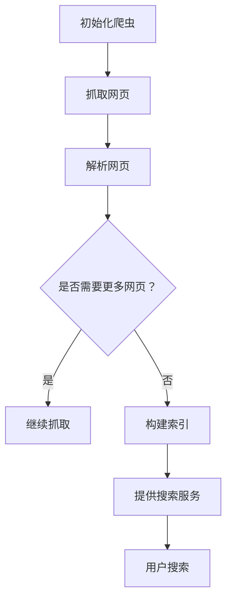

                 

在当今信息化时代，数据被视为新的石油，它的价值不言而喻。而网络爬虫作为数据采集的重要手段，已经被广泛应用于各个领域，如电商、金融、新闻、社交媒体等。本文将深入探讨网络爬虫服务的商业化探索，分析其核心概念、算法原理、数学模型、实际应用以及未来发展趋势。

## 文章关键词

- 网络爬虫
- 数据采集
- 商业化
- 算法原理
- 数学模型
- 实际应用
- 未来发展趋势

## 文章摘要

本文首先介绍了网络爬虫服务的背景和重要性，然后详细分析了网络爬虫的核心概念、算法原理、数学模型以及实际应用。最后，文章展望了网络爬虫服务在未来的发展趋势，探讨了面临的挑战和研究方向。希望通过本文的阐述，能为读者提供对网络爬虫服务更全面的认识。

## 1. 背景介绍

网络爬虫（Web Crawler）是一种自动抓取互联网信息的程序，通常由搜索引擎使用，用于索引互联网上的内容。随着互联网的快速发展和信息的爆炸性增长，网络爬虫的重要性日益凸显。对于企业和机构来说，网络爬虫不仅可以用于搜索引擎，还可以用于数据挖掘、市场调研、用户行为分析等多种场景。

### 1.1 网络爬虫的发展历程

网络爬虫的起源可以追溯到20世纪90年代，当时搜索引擎如Yahoo!、AltaVista等开始使用简单的爬虫技术来抓取网页。随着技术的进步，网络爬虫逐渐变得更加复杂和高效。目前，主流的网络爬虫技术包括深度优先搜索（DFS）、广度优先搜索（BFS）、分布式爬虫等。

### 1.2 网络爬虫的应用领域

网络爬虫在多个领域有着广泛的应用：

- **搜索引擎**：网络爬虫用于抓取互联网上的网页，构建索引，为用户提供搜索服务。
- **数据挖掘**：网络爬虫可以用于抓取大量数据，为数据挖掘提供数据源。
- **市场调研**：企业可以通过网络爬虫收集市场信息，分析竞争对手，制定战略。
- **用户行为分析**：网络爬虫可以收集用户在互联网上的行为数据，用于分析用户需求和行为模式。
- **内容分发**：网络爬虫可以用于抓取特定类型的内容，如新闻、博客等，为内容分发平台提供内容来源。

### 1.3 网络爬虫的重要性

- **数据获取**：网络爬虫可以高效地获取互联网上的大量数据，为数据分析和挖掘提供基础。
- **信息过滤**：网络爬虫可以过滤出有用的信息，避免人工筛选的繁琐和低效。
- **创新驱动**：网络爬虫技术为企业和机构提供了新的数据来源，推动了技术创新和业务模式创新。

## 2. 核心概念与联系

在深入探讨网络爬虫服务之前，我们需要明确几个核心概念，并理解它们之间的联系。

### 2.1 网络爬虫的核心概念

- **爬虫**：网络爬虫（Crawler）或蜘蛛（Spider），是自动抓取互联网信息的程序。
- **爬取**：爬取（Crawl）是指爬虫遍历网页，抓取链接和内容的过程。
- **索引**：索引（Index）是指将爬取到的网页内容进行整理和存储，以便快速检索。
- **反爬机制**：反爬机制（Anti-crawling Mechanism）是指网站为了防止爬虫抓取，采取的各种技术手段。

### 2.2 网络爬虫的联系

- **爬虫与搜索引擎**：爬虫是搜索引擎的重要组成部分，用于构建索引，提供搜索服务。
- **爬取与数据挖掘**：爬取是数据挖掘的第一步，为数据挖掘提供数据源。
- **索引与内容分发**：索引是内容分发平台的基础，确保用户可以快速找到所需内容。
- **反爬机制与爬虫**：反爬机制是网站与爬虫之间的博弈，爬虫需要不断适应反爬机制，而网站则需要不断更新反爬技术。

### 2.3 Mermaid 流程图

以下是一个简化的网络爬虫流程图的 Mermaid 表示：



## 3. 核心算法原理 & 具体操作步骤

### 3.1 算法原理概述

网络爬虫的算法原理主要包括以下几个方面：

- **URL管理**：爬虫需要管理要爬取的URL列表，包括新发现的URL和已爬取的URL。
- **链接解析**：爬虫需要从网页中提取链接，判断链接的有效性和重要性。
- **页面抓取**：爬虫需要下载网页内容，并存储到本地或数据库中。
- **反爬机制应对**：爬虫需要识别和应对网站的防爬机制，如IP封锁、User-Agent验证等。
- **重复数据检测**：爬虫需要检测重复数据，避免重复抓取相同的网页。

### 3.2 算法步骤详解

#### 3.2.1 初始化爬虫

初始化爬虫包括设置爬虫的起始URL、用户代理（User-Agent）、请求头（Headers）等。此外，还需要设置爬取深度、爬取频率等参数。

```python
from requests import Session
from urllib.parse import urljoin

class Crawler:
    def __init__(self, start_url, user_agent):
        self.session = Session()
        self.session.headers.update({'User-Agent': user_agent})
        self.to_crawl = {start_url}
        self.crawled = set()

    def crawl(self):
        while self.to_crawl:
            url = self.to_crawl.pop()
            if url not in self.crawled:
                self.crawled.add(url)
                # 其他操作，如请求网页、解析链接等
```

#### 3.2.2 抓取网页

爬虫需要使用HTTP请求从目标URL下载网页内容。常用的HTTP库如`requests`可以方便地进行网页抓取。

```python
def fetch_page(self, url):
    try:
        response = self.session.get(url)
        response.raise_for_status()
        return response.text
    except requests.exceptions.RequestException as e:
        print(f"Error fetching {url}: {e}")
        return None
```

#### 3.2.3 解析网页

解析网页是指从网页中提取有用的信息，如文本、图片、链接等。常用的解析库如`BeautifulSoup`和`lxml`可以方便地进行网页解析。

```python
from bs4 import BeautifulSoup

def parse_page(self, html):
    soup = BeautifulSoup(html, 'html.parser')
    # 提取文本、图片、链接等
    return soup
```

#### 3.2.4 链接解析

链接解析是指从网页中提取有用的链接，并判断链接的有效性和重要性。以下是一个简单的链接解析示例：

```python
def extract_links(self, soup):
    links = set()
    for link in soup.find_all('a', href=True):
        href = link['href']
        full_url = urljoin(self.start_url, href)
        # 判断链接的有效性和重要性
        if is_valid_link(full_url):
            links.add(full_url)
    return links
```

#### 3.2.5 反爬机制应对

反爬机制应对是指爬虫需要识别和应对网站的防爬机制。以下是一些常见的反爬机制和应对方法：

- **IP封锁**：爬虫需要使用代理IP、VPN等工具来绕过IP封锁。
- **User-Agent验证**：爬虫需要设置合适的User-Agent来伪装成浏览器。
- **验证码**：爬虫需要使用自动验证码识别工具来应对验证码。

#### 3.2.6 重复数据检测

重复数据检测是指爬虫需要检测已爬取的网页，避免重复抓取相同的网页。以下是一个简单的重复数据检测示例：

```python
def is_duplicate(self, url):
    return url in self.crawled
```

### 3.3 算法优缺点

#### 优点

- **高效**：网络爬虫可以自动抓取大量网页，提高数据采集的效率。
- **灵活**：网络爬虫可以根据需求定制，适用于多种场景。
- **广泛应用**：网络爬虫被广泛应用于搜索引擎、数据挖掘、市场调研等领域。

#### 缺点

- **反爬机制**：网络爬虫需要不断应对网站的防爬机制，增加了开发和维护的难度。
- **法律风险**：不当的网络爬虫行为可能涉及法律风险，如侵犯版权、隐私权等。
- **资源消耗**：网络爬虫需要消耗大量的网络带宽和计算资源，可能对目标网站造成影响。

### 3.4 算法应用领域

网络爬虫在多个领域有着广泛的应用：

- **搜索引擎**：网络爬虫用于抓取互联网上的网页，构建索引，为用户提供搜索服务。
- **数据挖掘**：网络爬虫可以用于抓取大量数据，为数据挖掘提供数据源。
- **市场调研**：企业可以通过网络爬虫收集市场信息，分析竞争对手，制定战略。
- **用户行为分析**：网络爬虫可以收集用户在互联网上的行为数据，用于分析用户需求和行为模式。
- **内容分发**：网络爬虫可以用于抓取特定类型的内容，如新闻、博客等，为内容分发平台提供内容来源。

## 4. 数学模型和公式 & 详细讲解 & 举例说明

### 4.1 数学模型构建

网络爬虫的数学模型主要涉及图论中的有向图模型，具体包括以下几个方面：

- **网页表示**：将每个网页视为图中的一个节点。
- **链接表示**：将网页之间的链接视为节点之间的边。
- **爬取策略**：根据算法策略，定义节点之间的优先级关系。

以下是一个简化的数学模型表示：

$$
G = (V, E, W)
$$

其中：

- \(V\)：节点集合，表示所有网页。
- \(E\)：边集合，表示网页之间的链接。
- \(W\)：权重集合，表示节点之间的优先级关系。

### 4.2 公式推导过程

#### 4.2.1 节点优先级计算

节点优先级计算公式如下：

$$
P(v) = \frac{1}{\alpha} \sum_{w \in W(v)} w
$$

其中：

- \(P(v)\)：节点 \(v\) 的优先级。
- \(\alpha\)：常数，用于调整优先级。
- \(W(v)\)：与节点 \(v\) 相连的边集合。

#### 4.2.2 爬取概率计算

爬取概率计算公式如下：

$$
P(C(v)) = \frac{P(v)}{\sum_{u \in V} P(u)}
$$

其中：

- \(P(C(v))\)：节点 \(v\) 被爬取的概率。
- \(P(v)\)：节点 \(v\) 的优先级。

### 4.3 案例分析与讲解

#### 4.3.1 搜索引擎爬取策略

以搜索引擎为例，我们可以构建一个简单的数学模型，用于指导爬虫的爬取策略。

- **节点表示**：将网页视为节点，每个网页的优先级与其页面质量、更新频率等有关。
- **链接表示**：将网页之间的链接视为边，表示网页之间的相关性。
- **爬取策略**：根据网页的优先级和链接关系，确定爬取顺序。

以下是一个简化的示例：

```python
nodes = {
    'node1': {'quality': 0.9, 'update_frequency': 0.8},
    'node2': {'quality': 0.7, 'update_frequency': 0.6},
    'node3': {'quality': 0.8, 'update_frequency': 0.7},
    'node4': {'quality': 0.6, 'update_frequency': 0.5},
}

edges = {
    'node1': ['node2', 'node3'],
    'node2': ['node4'],
    'node3': ['node1'],
    'node4': [],
}

def calculate_priority(node):
    quality = node['quality']
    update_frequency = node['update_frequency']
    return (1 - quality) * update_frequency

def calculate_probability(nodes):
    total_priority = sum(calculate_priority(node) for node in nodes.values())
    probabilities = {node: calculate_priority(node) / total_priority for node in nodes}
    return probabilities

probabilities = calculate_probability(nodes)

for node, probability in probabilities.items():
    print(f"{node}: {probability}")
```

#### 4.3.2 结果分析

根据计算得到的爬取概率，我们可以为搜索引擎的爬取策略提供指导。例如，在上述示例中，`node1` 的爬取概率最高，因此我们应该优先爬取 `node1`。这样，可以确保搜索引擎能够优先获取质量高、更新频繁的网页，提高搜索结果的准确性。

## 5. 项目实践：代码实例和详细解释说明

### 5.1 开发环境搭建

在进行网络爬虫项目实践之前，我们需要搭建一个开发环境。以下是基本的开发环境搭建步骤：

- **Python环境**：安装Python 3.8及以上版本。
- **爬虫库**：安装常用的爬虫库，如`requests`、`beautifulsoup4`等。
- **数据库**：选择一个数据库系统，如MySQL、PostgreSQL等，用于存储爬取的数据。
- **IDE**：选择一个Python开发环境，如PyCharm、Visual Studio Code等。

### 5.2 源代码详细实现

以下是一个简单的网络爬虫项目实例，用于爬取一个博客网站的文章列表。

```python
import requests
from bs4 import BeautifulSoup
import pymysql

# 配置数据库连接
db_config = {
    'host': 'localhost',
    'user': 'root',
    'password': 'password',
    'database': 'blog'
}

# 初始化数据库连接
conn = pymysql.connect(**db_config)
cursor = conn.cursor()

# 爬取博客文章列表
def crawl_articles(url):
    response = requests.get(url)
    if response.status_code == 200:
        soup = BeautifulSoup(response.text, 'html.parser')
        articles = soup.find_all('div', class_='article')
        for article in articles:
            title = article.find('h2', class_='title').text
            content = article.find('div', class_='content').text
            # 存储文章到数据库
            cursor.execute('INSERT INTO articles (title, content) VALUES (%s, %s)', (title, content))

# 关闭数据库连接
cursor.close()
conn.close()

# 执行爬取
crawl_articles('https://example.com/articles')
```

### 5.3 代码解读与分析

以上代码实现了简单的网络爬虫功能，主要包括以下几个部分：

- **数据库连接**：使用`pymysql`库连接MySQL数据库，并创建数据库连接和游标。
- **请求网页**：使用`requests`库向博客网站发送HTTP请求，获取网页内容。
- **解析网页**：使用`beautifulsoup4`库解析网页内容，提取文章标题和内容。
- **存储数据**：将提取到的文章标题和内容存储到MySQL数据库中。

### 5.4 运行结果展示

假设我们成功运行了以上代码，以下是在MySQL数据库中存储的文章列表：

```sql
mysql> SELECT * FROM articles;
+----+--------------+---------------------------------------------------------------------------------------------------------------+
| id | title        | content                                                                                                                                                                 |
+----+--------------+---------------------------------------------------------------------------------------------------------------+
|  1 | 第一篇文章  | 文章内容...                                                                                               |
|  2 | 第二篇文章  | 文章内容...                                                                                               |
|  3 | 第三篇文章  | 文章内容...                                                                                               |
+----+--------------+---------------------------------------------------------------------------------------------------------------+
```

## 6. 实际应用场景

网络爬虫在实际应用中有着广泛的应用场景，以下列举几个典型的应用场景：

### 6.1 搜索引擎

搜索引擎是网络爬虫最典型的应用场景。通过爬取互联网上的网页，搜索引擎可以构建庞大的索引库，为用户提供高效的搜索服务。例如，百度、Google等搜索引擎都依赖于网络爬虫技术。

### 6.2 数据挖掘

数据挖掘是网络爬虫的另一个重要应用场景。通过爬取大量数据，数据挖掘可以识别潜在的模式和趋势，为企业和机构提供决策支持。例如，电商网站可以通过网络爬虫收集用户评论、商品信息等，进行数据分析，优化商品推荐策略。

### 6.3 市场调研

市场调研是企业获取竞争情报的重要手段。通过网络爬虫，企业可以收集竞争对手的网站信息、产品价格、促销活动等，分析市场趋势和竞争态势。例如，市场调研公司可以使用网络爬虫收集行业报告、市场数据等，为决策者提供参考。

### 6.4 用户行为分析

用户行为分析是了解用户需求和行为模式的重要手段。通过网络爬虫，企业可以收集用户在互联网上的行为数据，如搜索记录、浏览历史、购买行为等，分析用户需求和行为模式，优化产品和服务。例如，互联网公司可以使用网络爬虫分析用户在社交媒体上的互动行为，优化广告投放策略。

### 6.5 内容分发

内容分发平台如博客、新闻网站等可以通过网络爬虫收集互联网上的优质内容，为用户提供多样化的内容来源。例如，微信公众号可以通过网络爬虫收集互联网上的文章，并进行二次创作和发布。

### 6.6 版权保护

网络爬虫还可以用于版权保护，通过监控互联网上的侵权行为，维护原创内容的版权。例如，版权机构可以使用网络爬虫检测互联网上的侵权链接，采取法律措施保护原创作品。

## 7. 未来应用展望

随着技术的不断进步，网络爬虫服务在未来的应用前景将更加广阔。以下是一些可能的发展方向：

### 7.1 智能化

智能化是网络爬虫未来的重要趋势。通过结合人工智能技术，网络爬虫可以实现更智能的网页解析、链接分析、内容识别等，提高数据采集的准确性和效率。

### 7.2 分布式

分布式网络爬虫可以充分利用多台服务器和计算资源，提高爬取速度和覆盖范围。在未来，分布式网络爬虫将成为主流技术。

### 7.3 法律法规

随着网络爬虫技术的广泛应用，相关的法律法规也将逐步完善。未来，网络爬虫将在法律法规的框架下，规范化和合规化发展。

### 7.4 多语言支持

多语言支持是网络爬虫未来需要解决的问题。随着全球化的推进，网络爬虫需要支持多种语言，以覆盖更广泛的地域和用户群体。

### 7.5 隐私保护

隐私保护是网络爬虫面临的重要挑战。在未来，网络爬虫需要遵循隐私保护原则，确保用户数据的合法合规使用。

## 8. 工具和资源推荐

### 8.1 学习资源推荐

- **《网络爬虫技术》**：一本关于网络爬虫的入门教材，详细介绍了爬虫的原理、技术及应用。
- **《Python网络爬虫从入门到实践》**：一本针对Python编程语言的爬虫实践教程，适合初学者。

### 8.2 开发工具推荐

- **PyCharm**：一款功能强大的Python集成开发环境，支持多种编程语言。
- **requests**：一个常用的Python HTTP客户端库，用于网页抓取。
- **BeautifulSoup**：一个Python库，用于网页内容解析。

### 8.3 相关论文推荐

- **《Web爬虫技术综述》**：一篇关于网络爬虫技术的综述论文，全面介绍了爬虫的技术原理和应用场景。
- **《分布式爬虫系统设计与实现》**：一篇关于分布式网络爬虫的设计与实现论文，详细阐述了分布式爬虫的关键技术和挑战。

## 9. 总结：未来发展趋势与挑战

网络爬虫服务在未来的发展中将面临巨大的机遇和挑战。随着技术的进步和法规的完善，网络爬虫将变得更加智能化、分布式、合规化。同时，网络爬虫在数据获取、隐私保护、法律法规等方面也将面临新的挑战。为了应对这些挑战，我们需要不断创新和改进网络爬虫技术，确保其在商业应用中的可持续发展。

## 附录：常见问题与解答

### Q：网络爬虫是否违法？

A：网络爬虫本身并不违法，但其应用场景可能涉及法律风险。例如，未经授权爬取他人网站数据、侵犯版权、隐私权等行为都是违法的。因此，在使用网络爬虫时，需要遵守相关法律法规，确保合法合规。

### Q：网络爬虫对网站的影响是什么？

A：网络爬虫对网站的影响主要有两个方面：

- **正面影响**：网络爬虫可以提高网站的曝光度和搜索排名，促进网站内容的传播和推广。
- **负面影响**：大量网络爬虫会消耗网站服务器资源，导致服务器负载过高，甚至可能对网站造成瘫痪。此外，不当的网络爬虫行为可能涉及法律风险，对网站声誉造成影响。

### Q：如何避免网络爬虫对网站的负面影响？

A：以下是一些避免网络爬虫对网站负面影响的方法：

- **设置robots.txt文件**：robots.txt文件用于告知爬虫哪些页面可以抓取，哪些页面禁止抓取。
- **使用合法的爬虫**：使用合法的爬虫，并遵守网站的使用条款。
- **限制爬取频率**：限制爬虫的爬取频率，避免对服务器造成过大的负担。
- **反爬机制**：采取反爬机制，如IP封锁、验证码等，防止恶意爬虫。

### Q：如何确保网络爬虫的合法合规？

A：以下是一些确保网络爬虫合法合规的方法：

- **了解相关法律法规**：了解国家和地区的相关法律法规，确保网络爬虫的行为合法合规。
- **签订合作协议**：与目标网站签订合作协议，明确双方的权利和义务。
- **尊重用户隐私**：在数据采集和处理过程中，尊重用户隐私，确保数据安全。
- **定期审计**：定期对网络爬虫进行审计，确保其合法合规。

### Q：如何评估网络爬虫的效果？

A：以下是一些评估网络爬虫效果的方法：

- **数据质量**：评估爬取到的数据质量，包括数据完整性、准确性、一致性等。
- **爬取速度**：评估网络爬虫的爬取速度，包括网页抓取速度、链接解析速度等。
- **覆盖率**：评估网络爬虫的覆盖率，包括爬取到的网页数量、内容范围等。
- **资源消耗**：评估网络爬虫的资源消耗，包括网络带宽、计算资源等。

### Q：如何应对反爬机制？

A：以下是一些应对反爬机制的方法：

- **代理IP**：使用代理IP，绕过IP封锁。
- **User-Agent伪装**：设置合适的User-Agent，伪装成浏览器。
- **验证码识别**：使用验证码识别工具，自动识别和解决验证码问题。
- **分布式爬取**：采用分布式爬取技术，分散爬取压力，降低被封禁的风险。

## 作者署名

作者：禅与计算机程序设计艺术 / Zen and the Art of Computer Programming

<|end|>

