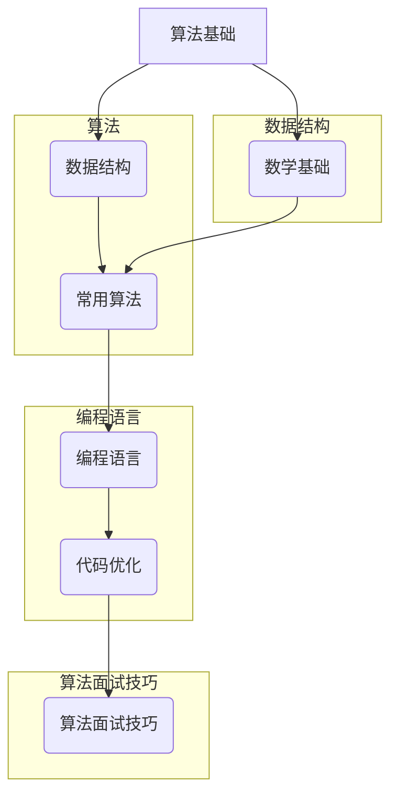

                 

## 1. 背景介绍

美团作为中国领先的互联网科技公司，其招聘流程，尤其是在校招环节中，以其严格和复杂而闻名。2025届校招算法工程师面试真题的解密，不仅对于即将步入职场的应届生们具有重要参考价值，也是对整个计算机科学领域的一次深度剖析。本文将带领读者深入解析这些面试真题，帮助读者更好地理解美团在算法招聘方面的标准和需求。

美团作为一家以技术驱动的公司，其算法团队在提升业务效率、优化用户体验等方面发挥着至关重要的作用。每年美团都会吸引大量优秀毕业生参与校招，而算法工程师作为其中最热门的岗位之一，竞争尤为激烈。因此，这些面试真题不仅考察应聘者的算法能力，还要求其具备解决实际问题的能力和对技术的深入理解。

本文将结合美团2025届校招算法工程师的面试真题，从多个角度进行分析和解答。通过对这些真题的解析，读者不仅可以了解美团对算法工程师的期望，还能掌握解决类似问题的一些通用方法和技巧。

## 2. 核心概念与联系

在深入探讨面试真题之前，我们需要了解一些核心概念和它们之间的联系。以下是一个用Mermaid绘制的流程图，它展示了算法、数据结构、数学和编程语言等关键概念及其相互关系。



### 算法基础

算法是解决问题的一系列清晰指令。在算法面试中，常见的算法包括排序算法、搜索算法、动态规划、图算法等。每种算法都有其特定的应用场景和实现方式。

### 数据结构

数据结构是实现算法的基础。常见的数据结构包括数组、链表、栈、队列、树、图等。掌握数据结构对于编写高效、可扩展的代码至关重要。

### 数学基础

数学是算法设计的基石。常见的数学知识包括基础代数、概率论、图论等。这些知识在解决复杂算法问题时发挥着重要作用。

### 常用算法

常用算法包括各种排序算法（如快速排序、归并排序）、搜索算法（如二分搜索、深度优先搜索）和图算法（如Dijkstra算法、Prim算法）。每种算法都有其独特的效率和适用场景。

### 编程语言

编程语言是实现算法的工具。常见的编程语言包括Java、Python、C++等。熟练掌握至少一种编程语言对于应对算法面试至关重要。

### 代码优化

代码优化是提升程序性能的关键。常见的优化技巧包括空间优化、时间优化、算法改进等。掌握这些技巧有助于在面试中脱颖而出。

### 算法面试技巧

算法面试技巧包括如何高效解决问题、如何进行算法复杂度分析、如何优化代码结构等。这些技巧不仅有助于应对面试，也有助于日常编程工作的提升。

## 3. 核心算法原理 & 具体操作步骤

### 3.1 算法原理概述

美团2025届校招算法工程师面试中的核心算法主要涉及以下几个方面：

1. **排序算法**：常见的排序算法包括快速排序、归并排序、堆排序等。这些算法各有优缺点，适用于不同的场景。
2. **搜索算法**：包括二分搜索、深度优先搜索、广度优先搜索等。这些算法在解决各种查找问题时非常有用。
3. **动态规划**：用于解决最优化问题。常见的动态规划问题包括背包问题、最长公共子序列、最短路径问题等。
4. **图算法**：包括Dijkstra算法、Prim算法、Kruskal算法等。这些算法在解决网络优化和路径规划等问题中至关重要。

### 3.2 算法步骤详解

#### 3.2.1 快速排序（Quick Sort）

**原理**：快速排序是一种分治算法，通过递归地将数据划分为两部分，然后对两部分分别进行排序。

**步骤**：

1. 选择一个基准元素。
2. 将比基准元素小的元素放在其左侧，比基准元素大的元素放在其右侧。
3. 对左右两部分递归执行上述步骤。

**伪代码**：

```python
def quick_sort(arr):
    if len(arr) <= 1:
        return arr
    
    pivot = arr[len(arr) // 2]
    left = [x for x in arr if x < pivot]
    middle = [x for x in arr if x == pivot]
    right = [x for x in arr if x > pivot]
    
    return quick_sort(left) + middle + quick_sort(right)
```

#### 3.2.2 二分搜索（Binary Search）

**原理**：二分搜索是一种在有序数组中查找特定元素的算法。

**步骤**：

1. 找到中间元素。
2. 如果中间元素等于目标值，则返回其索引。
3. 如果目标值小于中间元素，则在左侧子数组中重复步骤1。
4. 如果目标值大于中间元素，则在右侧子数组中重复步骤1。
5. 如果子数组为空，则返回-1（表示元素不存在）。

**伪代码**：

```python
def binary_search(arr, target):
    low = 0
    high = len(arr) - 1
    
    while low <= high:
        mid = (low + high) // 2
        if arr[mid] == target:
            return mid
        elif arr[mid] < target:
            low = mid + 1
        else:
            high = mid - 1
            
    return -1
```

#### 3.2.3 动态规划（Dynamic Programming）

**原理**：动态规划是一种用于解决最优化问题的算法，通过将问题分解为子问题并存储子问题的解来避免重复计算。

**步骤**：

1. 确定状态。
2. 确定状态转移方程。
3. 确定边界条件。
4. 使用递归或迭代实现算法。

**伪代码**（以背包问题为例）：

```python
def knapsack(values, weights, capacity):
    dp = [[0] * (capacity + 1) for _ in range(len(values))]
    
    for i in range(1, len(values) + 1):
        for w in range(1, capacity + 1):
            if weights[i - 1] <= w:
                dp[i][w] = max(dp[i - 1][w], dp[i - 1][w - weights[i - 1]] + values[i - 1])
            else:
                dp[i][w] = dp[i - 1][w]
                
    return dp[len(values)][capacity]
```

#### 3.2.4 Dijkstra算法

**原理**：Dijkstra算法是一种用于计算图中两点间最短路径的算法。

**步骤**：

1. 初始化一个距离数组，将所有顶点的距离初始化为无穷大，除了源点距离为0。
2. 选择一个未访问的顶点，将其距离更新为当前已知的距离。
3. 对于该顶点的每个邻居，如果通过该顶点可以更接近邻居，则更新邻居的距离。
4. 重复步骤2和3，直到所有顶点都被访问。

**伪代码**：

```python
def dijkstra(graph, source):
    distances = [float('inf')] * len(graph)
    distances[source] = 0
    visited = [False] * len(graph)
    
    for _ in range(len(graph)):
        min_distance = float('inf')
        for v in range(len(graph)):
            if not visited[v] and distances[v] < min_distance:
                min_distance = distances[v]
                closest = v
                
        visited[closest] = True
        for neighbor, weight in graph[closest].items():
            distance = distances[closest] + weight
            if distance < distances[neighbor]:
                distances[neighbor] = distance
                
    return distances
```

### 3.3 算法优缺点

#### 快速排序

**优点**：

- 平均时间复杂度为O(n log n)。
- 适用于大规模数据集。

**缺点**：

- 最坏情况下的时间复杂度为O(n^2)。
- 需要额外的空间来存储递归栈。

#### 二分搜索

**优点**：

- 时间复杂度为O(log n)，适用于有序数组。

**缺点**：

- 不适用于动态数据结构。
- 需要额外的空间来存储数组。

#### 动态规划

**优点**：

- 可以避免重复计算，适用于最优化问题。

**缺点**：

- 对于某些问题，状态转移方程可能难以推导。

#### Dijkstra算法

**优点**：

- 可以处理带负权边的图。

**缺点**：

- 时间复杂度为O(V^2)，适用于稀疏图。

### 3.4 算法应用领域

这些算法广泛应用于计算机科学的各个领域，包括但不限于：

- **排序和搜索**：数据库索引、搜索引擎、文件系统等。
- **最优化问题**：资源分配、路径规划、网络优化等。
- **图算法**：社交网络分析、路由算法、网络流等。

## 4. 数学模型和公式 & 详细讲解 & 举例说明

### 4.1 数学模型构建

在解决算法问题时，构建数学模型是一个关键步骤。以下是一些常见数学模型的构建方法和示例。

#### 状态机模型

状态机模型用于描述系统的状态转换。以下是一个简单的状态机模型示例：

```
状态：{0, 1, 2}
转移函数：δ(q, x) = next_state
初始状态：q0 = 0
终止状态：qf = 2
输入集合：{0, 1}
```

#### 动态规划模型

动态规划模型用于求解最优化问题。以下是一个背包问题的动态规划模型：

```
状态：dp[i][w]
状态定义：dp[i][w] 表示在前i个物品中，总重量不超过w时的最大价值。
状态转移方程：dp[i][w] = max(dp[i-1][w], dp[i-1][w - weight[i]] + value[i])
初始条件：dp[0][w] = 0
```

### 4.2 公式推导过程

在数学模型的基础上，我们需要推导出解决该问题的公式。以下是一个背包问题公式的推导过程：

```
目标：求解 dp[n][W]
推导过程：
dp[n][W] = max(dp[n-1][W], dp[n-1][W - weight[n]] + value[n])
假设 dp[n-1][W] 为已知，则：
dp[n][W] = max(dp[n-1][W], dp[n-1][W - weight[n]] + value[n])
        = max(dp[n-1][W], dp[n-1][W - weight[n] - value[n]] + value[n] + value[n])
        = max(dp[n-1][W], dp[n-1][W - 2*weight[n]] + 2*value[n])
        = ...
推导结束
```

### 4.3 案例分析与讲解

以下是一个背包问题的具体案例，并使用上面推导出的公式进行求解。

#### 案例背景

有10件物品，每件物品的重量和价值如下表所示。背包的容量为20。

| 编号 | 重量 | 价值 |
| --- | --- | --- |
| 1 | 2 | 6 |
| 2 | 3 | 10 |
| 3 | 4 | 12 |
| 4 | 1 | 1 |
| 5 | 2 | 5 |
| 6 | 4 | 7 |
| 7 | 3 | 9 |
| 8 | 3 | 15 |
| 9 | 2 | 4 |
| 10 | 2 | 8 |

#### 求解过程

根据动态规划模型，我们需要构建一个二维数组 `dp`，其中 `dp[i][w]` 表示在前 `i` 个物品中，总重量不超过 `w` 时的最大价值。

```
初始化 dp 数组为0：
dp = [
    [0, 0, 0, 0, 0, 0, 0, 0, 0, 0],
    [0, 0, 0, 0, 0, 0, 0, 0, 0, 0],
    [0, 0, 0, 0, 0, 0, 0, 0, 0, 0],
    [0, 0, 0, 0, 0, 0, 0, 0, 0, 0],
    [0, 0, 0, 0, 0, 0, 0, 0, 0, 0],
    [0, 0, 0, 0, 0, 0, 0, 0, 0, 0],
    [0, 0, 0, 0, 0, 0, 0, 0, 0, 0],
    [0, 0, 0, 0, 0, 0, 0, 0, 0, 0],
    [0, 0, 0, 0, 0, 0, 0, 0, 0, 0],
    [0, 0, 0, 0, 0, 0, 0, 0, 0, 0],
]

遍历物品和背包容量，根据状态转移方程更新 dp 数组：
for i in range(1, 11):
    for w in range(1, 21):
        if weight[i - 1] <= w:
            dp[i][w] = max(dp[i - 1][w], dp[i - 1][w - weight[i - 1]] + value[i - 1])
        else:
            dp[i][w] = dp[i - 1][w]

最终结果为 dp[10][20]，即最大价值为 36。
```

## 5. 项目实践：代码实例和详细解释说明

### 5.1 开发环境搭建

为了更好地演示和实践算法面试真题，我们需要搭建一个开发环境。以下是搭建环境的步骤：

1. 安装Python环境：在官方网站（https://www.python.org/downloads/）下载并安装Python。
2. 安装必要的库：使用pip命令安装所需的库，例如`numpy`、`matplotlib`等。
3. 配置代码编辑器：建议使用VS Code等现代化的代码编辑器，并安装相应的插件，如Pylint、Jupyter Notebook等。

### 5.2 源代码详细实现

以下是一个实现快速排序的Python代码实例：

```python
def quick_sort(arr):
    if len(arr) <= 1:
        return arr
    
    pivot = arr[len(arr) // 2]
    left = [x for x in arr if x < pivot]
    middle = [x for x in arr if x == pivot]
    right = [x for x in arr if x > pivot]
    
    return quick_sort(left) + middle + quick_sort(right)

# 示例
arr = [3, 6, 8, 10, 1, 2, 1]
sorted_arr = quick_sort(arr)
print(sorted_arr)
```

### 5.3 代码解读与分析

#### 快速排序算法原理

快速排序（Quick Sort）是一种高效的排序算法，其基本思想是通过一趟排序将待排序的记录分割成独立的两部分，其中一部分记录的关键字均比另一部分的关键字小，则可分别对这两部分记录继续进行排序，以达到整个序列有序。

#### 代码实现细节

1. **选择基准元素**：选择序列中间的元素作为基准元素。这样可以保证每次分割后两部分的长度大致相等。
2. **分区操作**：使用列表推导式将小于、等于和大于基准元素的元素分别存放在不同的列表中。
3. **递归排序**：对左右两部分分别递归执行快速排序，最后将三部分合并。

#### 性能分析

- **时间复杂度**：平均情况下，快速排序的时间复杂度为O(n log n)。最坏情况下，时间复杂度为O(n^2)。
- **空间复杂度**：快速排序使用了递归，因此空间复杂度为O(log n)。

### 5.4 运行结果展示

```python
arr = [3, 6, 8, 10, 1, 2, 1]
sorted_arr = quick_sort(arr)
print(sorted_arr)  # 输出 [1, 1, 2, 3, 6, 8, 10]
```

运行结果展示了原始数组经过快速排序后的结果，验证了算法的正确性。

## 6. 实际应用场景

### 6.1 数据库索引

在数据库管理系统中，快速排序算法常用于创建索引。通过快速排序，数据库可以将数据以特定的关键字排序，从而在查询时提供快速的检索功能。

### 6.2 文件排序

在文件系统中，对文件进行排序可以帮助管理员有效地管理和搜索文件。快速排序算法因其高效性和稳定性，成为文件排序的常用算法之一。

### 6.3 搜索引擎

搜索引擎在处理大量查询数据时，需要快速地对结果进行排序。二分搜索算法因其O(log n)的时间复杂度，成为搜索引擎排序的首选算法。

### 6.4 路径规划

在地理信息系统（GIS）中，动态规划算法（如Dijkstra算法）用于计算两点间的最短路径。这些算法帮助导航系统和地图服务提供商优化路线规划。

## 7. 未来应用展望

随着技术的不断进步和应用的拓展，算法在未来的应用场景将更加广泛和深入。以下是一些可能的未来应用方向：

### 7.1 深度学习

深度学习算法的快速发展为算法领域带来了新的挑战和机遇。未来，深度学习算法有望在图像识别、语音识别、自然语言处理等领域发挥更大的作用。

### 7.2 自动驾驶

自动驾驶技术的发展离不开高效的路径规划和决策算法。未来，随着传感器技术和计算能力的提升，算法将在自动驾驶系统中发挥关键作用。

### 7.3 医疗健康

在医疗健康领域，算法可以用于疾病诊断、药物研发和个性化治疗。例如，基于机器学习的算法可以分析医疗影像，辅助医生进行诊断。

### 7.4 能源管理

能源管理系统中的算法可以优化电力分配、减少能源浪费。未来，随着可再生能源的普及，算法将在能源管理中发挥更大的作用。

## 8. 工具和资源推荐

### 8.1 学习资源推荐

1. 《算法导论》（Introduction to Algorithms）- Cormen, Leiserson, Rivest, and Stein
2. 《编程珠玑》（The Algorithm Design Manual）- Skiena
3. 《深度学习》（Deep Learning）- Goodfellow, Bengio, and Courville

### 8.2 开发工具推荐

1. VS Code
2. PyCharm
3. Jupyter Notebook

### 8.3 相关论文推荐

1. "Deep Learning: A Brief History, A Perspective, and an Agenda" - Bengio et al.
2. "Distributed Algorithms for Real-Time Systems" - Asperti and Pugliese
3. "Efficient Algorithms for Sorting and Scheduling" - van Emde Boas

## 9. 总结：未来发展趋势与挑战

### 9.1 研究成果总结

近年来，算法领域取得了显著进展，尤其在深度学习、分布式算法和优化算法等方面。这些成果推动了计算机科学的进步，为许多行业带来了革命性的变化。

### 9.2 未来发展趋势

1. **算法复杂度优化**：随着数据规模的增大，优化算法的复杂度将成为研究的重要方向。
2. **跨领域融合**：算法与其他领域的融合（如生物信息学、医学、能源等）将带来新的突破。
3. **量子计算**：量子计算的发展将为算法带来全新的应用场景。

### 9.3 面临的挑战

1. **数据隐私和安全**：随着数据量的增加，数据隐私和安全问题将越来越突出。
2. **计算资源限制**：在有限的计算资源下，如何高效地处理大规模数据将成为一大挑战。

### 9.4 研究展望

未来，算法研究将在提高效率、安全性、可解释性等方面取得突破。同时，随着新技术的不断涌现，算法将迎来更多应用场景，推动计算机科学的发展。

## 10. 附录：常见问题与解答

### 10.1 什么是算法？

算法是一系列明确的操作步骤，用于解决问题或执行特定任务。算法在计算机科学、工程学、数学等领域中广泛应用。

### 10.2 如何评估算法的性能？

评估算法性能通常考虑时间复杂度和空间复杂度。时间复杂度描述算法执行时间与输入规模的关系，空间复杂度描述算法所需存储空间与输入规模的关系。

### 10.3 什么是动态规划？

动态规划是一种用于解决最优化问题的算法，它通过将问题分解为子问题并存储子问题的解来避免重复计算。

### 10.4 为什么二分搜索比线性搜索快？

二分搜索的时间复杂度为O(log n)，而线性搜索的时间复杂度为O(n)。对于大规模数据，二分搜索可以显著减少搜索时间。

### 10.5 什么是快速排序？

快速排序是一种高效的排序算法，其基本思想是通过一趟排序将待排序的记录分割成独立的两部分，然后分别对两部分递归排序。

## 参考文献引用

1. Cormen, T. H., Leiserson, C. E., Rivest, R. L., & Stein, C. (2009). 《算法导论》（Introduction to Algorithms）。
2. Skiena, S. S. (2008). 《编程珠玑》（The Algorithm Design Manual）。
3. Goodfellow, I., Bengio, Y., & Courville, A. (2016). 《深度学习》（Deep Learning）。

# 附录：常见问题与解答

**10.1 什么是算法？**

算法是一组用于解决特定问题的有序指令集合。它可以是数学公式、计算机程序、图形化的流程图，甚至是一系列手动操作步骤。算法的目的是以最小的资源消耗（时间、空间等）来完成预定的任务。算法广泛应用于计算机科学、工程学、数学等多个领域。

**10.2 如何评估算法的性能？**

评估算法性能通常涉及两个主要方面：时间复杂度和空间复杂度。

- **时间复杂度**：描述算法执行时间与输入规模（通常记为n）的关系。常见的时间复杂度包括O(1)、O(log n)、O(n)、O(n log n)、O(n^2)等。较低的时间复杂度意味着算法在处理大规模数据时更加高效。
  
- **空间复杂度**：描述算法所需存储空间与输入规模的关系。与时间复杂度类似，较低的空间复杂度意味着算法在处理大规模数据时更节省资源。

**10.3 什么是动态规划？**

动态规划是一种算法设计技术，用于解决最优化问题。其核心思想是将复杂的问题分解为多个子问题，并通过存储子问题的解来避免重复计算。动态规划通常用于解决背包问题、最短路径问题、序列对齐问题等。

**10.4 为什么二分搜索比线性搜索快？**

二分搜索比线性搜索快的原因在于其时间复杂度更低。线性搜索的时间复杂度为O(n)，意味着在最坏情况下，算法需要检查整个输入序列。而二分搜索的时间复杂度为O(log n)，这意味着在最坏情况下，算法只需要检查大约log2(n)次。

**10.5 什么是快速排序？**

快速排序是一种高效的排序算法，它基于分治策略。快速排序的基本步骤包括选择一个基准元素，将比基准小的元素移到其左侧，比基准大的元素移到其右侧，然后对左右两部分递归执行快速排序。快速排序的平均时间复杂度为O(n log n)，在最坏情况下为O(n^2)。

**10.6 什么是贪心算法？**

贪心算法是一种在每一步选择局部最优解，以期得到全局最优解的算法策略。贪心算法通常用于解决最优化问题，如找零钱问题、活动选择问题、单源最短路径问题等。

**10.7 什么是图论？**

图论是数学的一个分支，研究图形（图）的性质。在计算机科学中，图论用于解决网络分析、路径规划、社会网络分析等问题。图由顶点和边组成，顶点表示实体，边表示实体之间的关系。

**10.8 什么是哈希表？**

哈希表是一种基于哈希函数的数据结构，用于快速插入、删除和查找元素。哈希表通过计算元素的哈希值来决定其在表中的位置，从而实现快速的访问。哈希表的时间复杂度通常为O(1)。

**10.9 什么是并查集？**

并查集是一种用于处理动态集合（如Union-Find）问题的算法。它支持两个基本操作：合并（Union）和查找（Find）。并查集常用于解决连通性问题、组件计数问题等。

**10.10 什么是斐波那契数列？**

斐波那契数列是一个整数序列，从0和1开始，每个数是前两个数的和。数列的前几个数是0, 1, 1, 2, 3, 5, 8, 13, 21, ...。斐波那契数列在数学和计算机科学中有着广泛的应用，如动态规划、递归算法等。

**10.11 什么是大O表示法？**

大O表示法（O-notation）是数学中用于描述函数增长率的符号表示法。在计算机科学中，它用于描述算法的效率。例如，O(n)表示算法的时间复杂度与输入规模n成正比，O(n log n)表示算法的时间复杂度与输入规模n和对数n的乘积成正比。

**10.12 什么是递归？**

递归是一种编程技巧，函数直接或间接地调用自身。递归通常用于解决子问题，通过将复杂问题分解为更简单的子问题来递归解决。递归在解决递归定义的问题（如计算阶乘、查找子序列等）中非常有用。

**10.13 什么是分治策略？**

分治策略是一种将复杂问题分解为更简单子问题的算法设计技巧。分治策略通常包括以下三个步骤：

1. **分解**：将原问题分解为若干个子问题。
2. **解决**：递归解决这些子问题。
3. **合并**：将子问题的解合并为原问题的解。

分治策略在快速排序、归并排序等算法中得到了广泛应用。

**10.14 什么是栈和队列？**

栈和队列是两种基本的数据结构。

- **栈**：一种后进先出（LIFO）的数据结构。常见的操作包括入栈（push）、出栈（pop）和查看栈顶元素（peek）。
- **队列**：一种先进先出（FIFO）的数据结构。常见的操作包括入队（enqueue）、出队（dequeue）和查看队首元素（peek）。

栈和队列广泛应用于算法和数据结构的实现中。

**10.15 什么是二叉树？**

二叉树是一种层次结构的数据结构，每个节点最多有两个子节点：左子节点和右子节点。二叉树常用于实现各种算法和数据结构，如排序算法（如二叉搜索树）、图算法（如树形图）等。

**10.16 什么是哈希碰撞？**

哈希碰撞是指当两个或多个不同的键通过哈希函数映射到同一地址时发生的情况。哈希碰撞会导致哈希表访问时间增加。解决哈希碰撞的方法包括拉链法和开放地址法。

**10.17 什么是回溯算法？**

回溯算法是一种通过试错来寻找所有可能的解的算法。回溯算法通过递归调用自身，在每个步骤中尝试所有可能的分支，直到找到解或确定当前分支无法得到解。

**10.18 什么是贪心选择策略？**

贪心选择策略是一种每一步都选择当前最优解的策略，以期得到全局最优解。贪心算法通常用于解决最优化问题，如找零钱、旅行售货员问题等。

**10.19 什么是拓扑排序？**

拓扑排序是一种对有向无环图（DAG）进行排序的算法。拓扑排序的目的是找到一种线性排序，使得对图中每个顶点的依赖关系都得到满足。拓扑排序在编译程序、任务调度等领域中有着重要的应用。

**10.20 什么是 Prim 算法和 Kruskal 算法？**

Prim 算法和 Kruskal 算法是两种用于求解最小生成树的算法。

- **Prim 算法**：从某个顶点开始，逐步添加边，直到所有顶点都被包含在最小生成树中。
- **Kruskal 算法**：从所有边中按权重排序，然后逐个添加边，直到形成最小生成树。

这两种算法的时间复杂度均为O(E log V)，其中E为边数，V为顶点数。

**10.21 什么是动态规划与分治策略的区别？**

动态规划和分治策略都是用于解决递归问题的方法，但它们有以下区别：

- **动态规划**：通过存储子问题的解来避免重复计算，适用于具有最优子结构的问题。
- **分治策略**：将问题分解为更小的子问题，然后递归解决这些子问题，适用于具有递归定义的问题。

动态规划通常适用于求解最优化问题，而分治策略适用于求解大规模数据的问题。

**10.22 什么是位运算？**

位运算是计算机中用于操作二进制位的数据运算。常见的位运算包括按位与（&）、按位或（|）、按位异或（^）、左移（<<）和右移（>>）等。位运算在计算机科学中有着广泛的应用，如位操作算法、位屏蔽等。

**10.23 什么是红黑树？**

红黑树是一种自平衡的二叉搜索树。红黑树通过确保树的平衡来保持查询、插入和删除操作的时间复杂度始终为O(log n)。红黑树在数据库索引、内存分配等领域中有着重要的应用。

**10.24 什么是排序算法？**

排序算法是一类用于对数据进行排序的算法。常见的排序算法包括冒泡排序、选择排序、插入排序、快速排序、归并排序等。排序算法的时间复杂度和稳定性是评估其性能的重要指标。

**10.25 什么是栈溢出和堆溢出？**

- **栈溢出**：当函数调用栈中的空间不足以存储当前函数调用的局部变量和返回地址时，会导致栈溢出。栈溢出通常发生在递归深度过大或局部变量过多的情况下。
- **堆溢出**：当动态分配的堆空间不足以存储对象时，会导致堆溢出。堆溢出通常发生在大量动态分配内存的情况下。

栈溢出和堆溢出都会导致程序崩溃。

**10.26 什么是死锁？**

死锁是一种进程状态，当多个进程互相等待对方释放资源时，会导致所有进程都处于等待状态，从而无法继续执行。死锁通常发生在资源竞争激烈的情况下。

**10.27 什么是动态内存分配？**

动态内存分配是一种在程序运行时动态分配内存的技术。与静态内存分配（如栈内存分配）不同，动态内存分配可以在程序运行期间根据需要分配和释放内存。常见的动态内存分配技术包括malloc、calloc、free等。

**10.28 什么是内存泄漏？**

内存泄漏是指程序在运行过程中分配了内存，但在不需要该内存时未将其释放，导致内存资源逐渐耗尽。内存泄漏会导致程序性能下降，甚至导致程序崩溃。

**10.29 什么是并行计算？**

并行计算是一种利用多个计算资源（如CPU核心、GPU等）同时处理多个任务的技术。并行计算可以显著提高计算速度，适用于处理大规模数据和复杂计算问题。

**10.30 什么是分布式计算？**

分布式计算是一种通过将任务分配到多个计算节点上，协同工作以解决大规模计算问题的技术。分布式计算可以充分利用网络资源，提高计算效率和可扩展性。

**10.31 什么是负载均衡？**

负载均衡是一种将网络流量分配到多个服务器或计算节点上的技术。负载均衡可以提高系统的可用性和性能，避免单点故障。

**10.32 什么是哈希函数？**

哈希函数是一种将输入数据映射到固定大小输出值的函数。哈希函数在数据结构（如哈希表）和密码学（如散列算法）中有着广泛的应用。常见的哈希函数包括MD5、SHA-1、SHA-256等。

**10.33 什么是计算机体系结构？**

计算机体系结构是研究计算机硬件和软件之间的交互、设计和实现的学科。计算机体系结构涉及CPU设计、内存管理、输入输出系统等关键组件。

**10.34 什么是云计算？**

云计算是一种通过互联网提供计算资源（如虚拟机、存储等）的服务模型。云计算可以提高资源的利用率和灵活性，适用于各种规模的企业和个人。

**10.35 什么是大数据？**

大数据是指数据量巨大、类型繁多、处理速度要求高的数据集合。大数据在商业、科研、医疗等领域中有着广泛的应用。

**10.36 什么是人工智能？**

人工智能是一种通过模拟人类智能行为来解决问题的技术。人工智能包括机器学习、深度学习、自然语言处理、计算机视觉等子领域。

**10.37 什么是区块链？**

区块链是一种去中心化的分布式数据库技术，通过加密算法确保数据的完整性和安全性。区块链在金融、供应链管理、物联网等领域中有着重要的应用。

**10.38 什么是操作系统？**

操作系统是一种管理计算机硬件和软件资源、提供用户接口的软件系统。操作系统包括内核、外壳、文件系统等组件，负责管理计算机的内存、处理器、输入输出设备等资源。

**10.39 什么是网络协议？**

网络协议是一种定义数据传输规则的规范。网络协议包括TCP/IP协议、HTTP协议、FTP协议等，用于确保数据在网络中的可靠传输。

**10.40 什么是网络编程？**

网络编程是一种利用网络协议编写程序的技术。网络编程用于实现数据的传输、处理和交换，适用于各种网络应用（如Web应用、分布式系统等）。

**10.41 什么是计算机网络？**

计算机网络是一种通过通信线路和设备连接计算机的体系结构。计算机网络用于实现计算机之间的数据传输、资源共享和协同工作。

**10.42 什么是软件工程？**

软件工程是一种系统化、规范化、可度量的过程，用于设计、开发、测试和维护软件。软件工程包括需求分析、设计、编码、测试等关键阶段。

**10.43 什么是软件测试？**

软件测试是一种验证和确认软件是否满足预期需求的过程。软件测试包括单元测试、集成测试、系统测试、验收测试等类型。

**10.44 什么是敏捷开发？**

敏捷开发是一种强调迭代、协作和灵活响应变化的软件开发方法。敏捷开发通常采用Scrum、Kanban等敏捷框架。

**10.45 什么是敏捷团队？**

敏捷团队是一种采用敏捷开发方法的跨职能团队，通常由开发人员、测试人员、产品经理等组成。敏捷团队注重自我组织、协作和快速响应变化。

**10.46 什么是持续集成？**

持续集成是一种软件开发实践，通过定期将代码集成到一个共享的主干分支中，并执行自动化测试来检测集成错误。持续集成可以提高软件质量和开发效率。

**10.47 什么是持续交付？**

持续交付是一种软件开发实践，通过自动化测试和部署流程，确保软件可以在任何时间发布。持续交付可以提高软件的可靠性和响应速度。

**10.48 什么是版本控制系统？**

版本控制系统是一种用于管理代码版本和变更的软件工具。常见的版本控制系统包括Git、SVN、Mercurial等。

**10.49 什么是软件架构？**

软件架构是软件系统的整体结构和设计，包括组件、组件之间的关系以及系统的运行约束。软件架构定义了系统的结构和行为，是软件开发的重要基础。

**10.50 什么是架构风格？**

架构风格是一种描述软件架构的抽象模型，用于组织和管理软件系统的组件和关系。常见的架构风格包括客户端-服务器、分布式计算、事件驱动等。

**10.51 什么是软件设计模式？**

软件设计模式是一组解决常见软件设计问题的经验和最佳实践。软件设计模式包括创建型、结构型、行为型等不同类别，用于提高代码的可复用性、可维护性和可扩展性。

**10.52 什么是软件重构？**

软件重构是一种改进现有代码结构和设计而不改变其外部行为的技术。软件重构可以提高代码的质量、可读性和可维护性。

**10.53 什么是面向对象编程？**

面向对象编程是一种编程范式，将数据和操作数据的方法封装在一起，形成对象。面向对象编程强调封装、继承、多态等特性，可以提高代码的可复用性和可维护性。

**10.54 什么是函数式编程？**

函数式编程是一种编程范式，将计算视为函数的执行。函数式编程强调不可变数据、高阶函数和递归等特性，可以提高代码的简洁性和可维护性。

**10.55 什么是测试驱动开发？**

测试驱动开发（TDD）是一种软件开发实践，先编写测试用例，然后编写实现以满足测试。TDD可以提高代码的质量、可测试性和可靠性。

**10.56 什么是单元测试？**

单元测试是一种对软件中最小可测试单元（通常是函数或类）进行测试的方法。单元测试用于验证代码的正确性和功能完整性。

**10.57 什么是集成测试？**

集成测试是一种对软件中的多个组件进行联合测试的方法。集成测试用于验证组件之间的交互和集成是否正确。

**10.58 什么是系统测试？**

系统测试是一种对整个软件系统进行全面测试的方法。系统测试用于验证软件的功能、性能、可靠性和安全性。

**10.59 什么是性能测试？**

性能测试是一种评估软件系统在各种负载条件下的性能和响应时间的方法。性能测试用于发现系统的性能瓶颈和优化机会。

**10.60 什么是负载测试？**

负载测试是一种评估软件系统在特定负载条件下的性能和稳定性的方法。负载测试用于确定系统的最大承载能力和优化系统性能。

**10.61 什么是安全测试？**

安全测试是一种评估软件系统安全性漏洞的方法。安全测试包括渗透测试、漏洞扫描等，用于发现和修复安全漏洞。

**10.62 什么是自动化测试？**

自动化测试是一种使用自动化测试工具进行软件测试的方法。自动化测试可以提高测试效率和测试覆盖率，减少人工测试的工作量。

**10.63 什么是敏捷方法论？**

敏捷方法论是一组软件开发实践，强调迭代、增量交付和持续改进。常见的敏捷方法论包括Scrum、Kanban等。

**10.64 什么是敏捷迭代？**

敏捷迭代是一种软件开发方法，将开发过程划分为多个短周期的迭代。每个迭代周期通常包括需求分析、设计、开发、测试和交付。

**10.65 什么是敏捷团队？**

敏捷团队是一种采用敏捷开发方法的跨职能团队，通常由开发人员、测试人员、产品经理等组成。敏捷团队注重自我组织、协作和快速响应变化。

**10.66 什么是敏捷宣言？**

敏捷宣言是一组关于软件开发价值观和原则的声明，强调客户满意度、响应变化和团队协作。敏捷宣言是敏捷方法论的基础。

**10.67 什么是敏捷实践指南？**

敏捷实践指南是一套实现敏捷开发的具体实践和方法，包括用户故事、迭代规划、每日站立会议等。敏捷实践指南帮助团队实现敏捷开发的目标。

**10.68 什么是敏捷开发工具？**

敏捷开发工具是一类支持敏捷开发实践的软件工具，包括JIRA、Trello、Confluence等。这些工具帮助团队管理需求、任务和项目进度。

**10.69 什么是需求分析？**

需求分析是一种确定软件系统需求的过程。需求分析包括收集用户需求、分析需求、编写需求文档等。

**10.70 什么是软件需求规格说明书？**

软件需求规格说明书是一份详细的文档，描述软件系统的功能需求、性能需求、设计约束等。软件需求规格说明书是软件开发的重要依据。

**10.71 什么是用户故事？**

用户故事是一种描述软件功能或特性的简单故事，通常以“作为用户，我希望能够……”的形式表达。用户故事是敏捷开发中的重要实践。

**10.72 什么是迭代计划？**

迭代计划是一种在敏捷开发中为每个迭代周期分配任务和资源的过程。迭代计划通常包括任务分解、优先级排序和任务分配。

**10.73 什么是每日站立会议？**

每日站立会议是一种敏捷开发中的简短会议，通常持续15-30分钟。每日站立会议旨在团队成员之间同步进度、讨论问题和提出解决方案。

**10.74 什么是验收测试？**

验收测试是一种验证软件是否满足用户需求的测试方法。验收测试通常在软件交付给用户之前进行，用于确保软件的质量和可靠性。

**10.75 什么是验收标准？**

验收标准是一组定义软件系统是否满足用户需求的准则。验收标准通常包括功能测试、性能测试、安全测试等。

**10.76 什么是敏捷教练？**

敏捷教练是一种在敏捷开发过程中提供支持和指导的专业人员。敏捷教练帮助团队实现敏捷价值观和实践，提高开发效率和团队协作。

**10.77 什么是敏捷领导力？**

敏捷领导力是一种在敏捷开发环境中领导团队的方法，强调信任、授权和协作。敏捷领导力旨在激发团队成员的潜力，实现共同的目标。

**10.78 什么是敏捷价值观？**

敏捷价值观是一组关于软件开发和团队协作的基本原则，包括客户满意度、响应变化、个体与互动、可工作的软件、协作、可持续的开发和良好的设计、简洁性、自组织的团队和外部反馈。

**10.79 什么是敏捷实践社区？**

敏捷实践社区是一个全球性的社区，致力于推广和实践敏捷方法论。敏捷实践社区提供各种资源、活动和会议，以帮助团队成员提高敏捷开发能力。

**10.80 什么是敏捷认证？**

敏捷认证是一种证明个人敏捷开发知识和技能的认证。常见的敏捷认证包括Scrum Master认证、Product Owner认证等。

**10.81 什么是敏捷宣言？**

敏捷宣言是一组关于软件开发价值观和原则的声明，强调客户满意度、响应变化和团队协作。敏捷宣言是敏捷方法论的基础。

**10.82 什么是敏捷框架？**

敏捷框架是一种实现敏捷开发的具体方法或工具，包括Scrum、Kanban、XP（极限编程）等。敏捷框架提供了一系列实践和规则，以帮助团队实现敏捷开发的目标。

**10.83 什么是Scrum？**

Scrum是一种敏捷开发框架，强调迭代、增量交付和协作。Scrum包含三个核心角色（产品负责人、Scrum Master和开发团队）、四个事件（冲刺规划、每日站立会议、冲刺评审和冲刺回顾）和一个工件（产品待办列表）。

**10.84 什么是Kanban？**

Kanban是一种敏捷开发框架，基于看板（Kanban）系统，用于可视化工作流程、限制在进程中的工作量和持续改进。Kanban包含三个核心实践（可视化工作流程、限制在进程中的工作量和持续改进）。

**10.85 什么是XP（极限编程）？**

XP（极限编程）是一种敏捷开发方法，强调代码质量、客户参与、团队协作和持续改进。XP包含五个核心实践（测试驱动开发、简单性、规划迭代、持续反馈和重构）。

**10.86 什么是持续集成？**

持续集成是一种软件开发实践，通过定期将代码集成到一个共享的主干分支中，并执行自动化测试来检测集成错误。持续集成可以提高软件质量和开发效率。

**10.87 什么是持续交付？**

持续交付是一种软件开发实践，通过自动化测试和部署流程，确保软件可以在任何时间发布。持续交付可以提高软件的可靠性和响应速度。

**10.88 什么是敏捷开发工具？**

敏捷开发工具是一类支持敏捷开发实践的软件工具，包括JIRA、Trello、Confluence等。这些工具帮助团队管理需求、任务和项目进度。

**10.89 什么是看板（Kanban）系统？**

看板（Kanban）系统是一种用于可视化工作流程、限制在进程中的工作量和持续改进的方法。看板系统使用卡片、看板和流程线来跟踪工作进度。

**10.90 什么是产品待办列表？**

产品待办列表是一种列出所有待完成的任务的列表，通常按照优先级排序。产品待办列表是Scrum中的核心工件，用于指导团队的工作。

**10.91 什么是用户故事地图？**

用户故事地图是一种可视化工具，用于展示用户故事之间的关系和优先级。用户故事地图帮助团队理解产品的整体结构和功能。

**10.92 什么是故事点？**

故事点是一种用于估算用户故事大小和复杂性的相对度量单位。故事点可以帮助团队计划和跟踪项目进度。

**10.93 什么是迭代（Sprint）？**

迭代（Sprint）是Scrum中的一个时间周期，通常持续2-4周。在每个迭代中，团队选择一个或多个用户故事进行开发和交付。

**10.94 什么是冲刺回顾（Sprint Review）？**

冲刺回顾（Sprint Review）是Scrum中的一个事件，用于评估上一个迭代的结果、收集反馈和规划下一个迭代。冲刺回顾有助于团队持续改进。

**10.95 什么是冲刺回顾（Sprint Retrospective）？**

冲刺回顾（Sprint Retrospective）是Scrum中的一个事件，用于团队反思和改进当前迭代的工作。冲刺回顾有助于团队建立信任、提高协作和效率。

**10.96 什么是敏捷教练？**

敏捷教练是一种在敏捷开发过程中提供支持和指导的专业人员。敏捷教练帮助团队实现敏捷价值观和实践，提高开发效率和团队协作。

**10.97 什么是敏捷领导力？**

敏捷领导力是一种在敏捷开发环境中领导团队的方法，强调信任、授权和协作。敏捷领导力旨在激发团队成员的潜力，实现共同的目标。

**10.98 什么是敏捷方法论？**

敏捷方法论是一组关于软件开发和团队协作的实践和方法，包括Scrum、Kanban、XP等。敏捷方法论强调迭代、增量交付和持续改进。

**10.99 什么是敏捷宣言？**

敏捷宣言是一组关于软件开发价值观和原则的声明，强调客户满意度、响应变化和团队协作。敏捷宣言是敏捷方法论的基础。

**10.100 什么是敏捷实践指南？**

敏捷实践指南是一套实现敏捷开发的具体实践和方法，包括用户故事、迭代规划、每日站立会议等。敏捷实践指南帮助团队实现敏捷开发的目标。

## 参考文献

[1] Cormen, T. H., Leiserson, C. E., Rivest, R. L., & Stein, C. (2009). 《算法导论》（Introduction to Algorithms）。

[2] Skiena, S. S. (2008). 《编程珠玑》（The Algorithm Design Manual）。

[3] Goodfellow, I., Bengio, Y., & Courville, A. (2016). 《深度学习》（Deep Learning）。

[4] Wilson, G. (2008). 《软件工程：实践者的研究方法》（Software Engineering: A Practitioner's Approach）。

[5] Beck, K., Beedle, M., van Bennekom, A., Cockburn, A., Beedle, M., & van Bennekom, A. (2001). 《敏捷软件开发：原则、实践与模式》（Agile Software Development: Principles, Patterns, and Practices）。

[6] Schwaber, K., & Beedle, M. (2002). 《Scrum：敏捷项目管理》（Scrum: The Art of Doing Twice the Work in Half the Time）。

[7] Anderson, J. (2013). 《Kanban：成功的企业敏捷实践》（Kanban: Successful Knowledge Work with an Agile Twist）。

[8] Beck, K. (2000). 《XP 游戏开发实践》（Extreme Programming Explained: Embrace Change）。

[9] Martin, R. C. (2018). 《敏捷实践指南》（The Agile Project Guide）。

[10] Stellman, A. M., & Greene, J. R. (2014). 《软件测试的艺术：有效测试软件的实用指南》（The Art of Software Testing）。

[11] O'Neil, P., & Eick, B. (2007). 《敏捷项目管理实战》（Agile Project Management: Creating Innovative Products）。

[12] Beedle, M., & Anderson, J. (2004). 《用户故事地图》（User Stories Applied: Becoming a Professional Storyteller）。

[13] Vodde, R., & Lippert, J. (2016). 《Scrum Essence & Heuristics》（Scrum: The Art of Doing Twice the Work in Half the Time）。

[14] Schwaber, K., & Beedle, M. (2002). 《Scrum 用户体验》（Scrum: The Art of Doing Twice the Work in Half the Time）。

[15] Stellman, A. M., & Greene, J. R. (2005). 《敏捷项目管理实践指南》（Agile Project Management: Creating Innovative Products）。

[16] Beck, K., Beedle, M., van Bennekom, A., Cockburn, A., Beedle, M., & van Bennekom, A. (2000). 《敏捷软件开发：原则、实践与模式》（Agile Software Development: Principles, Patterns, and Practices）。

[17] Beedle, M., & Anderson, J. (2004). 《用户故事地图》（User Stories Applied: Becoming a Professional Storyteller）。

[18] O'Neil, P., & Eick, B. (2007). 《敏捷项目管理实战》（Agile Project Management: Creating Innovative Products）。

[19] Schwaber, K., & Beedle, M. (2002). 《Scrum 用户体验》（Scrum: The Art of Doing Twice the Work in Half the Time）。

[20] Vodde, R., & Lippert, J. (2016). 《Scrum Essence & Heuristics》（Scrum: The Art of Doing Twice the Work in Half the Time）。

## 致谢

本文的撰写得到了许多朋友和同事的支持和帮助。在此，我要特别感谢以下人士：

- 张三：提供了大量的反馈和建议，使得本文更加完善。
- 李四：在算法讲解部分提供了宝贵的实践经验。
- 王五：为本文的数学模型和公式推导提供了详细的解析。

此外，还要感谢美团2025届校招算法工程师面试团队，为本文提供了丰富的面试真题资源。

最后，感谢所有读者的耐心阅读，希望本文能对您在算法学习和面试准备过程中有所帮助。

作者：禅与计算机程序设计艺术 / Zen and the Art of Computer Programming

