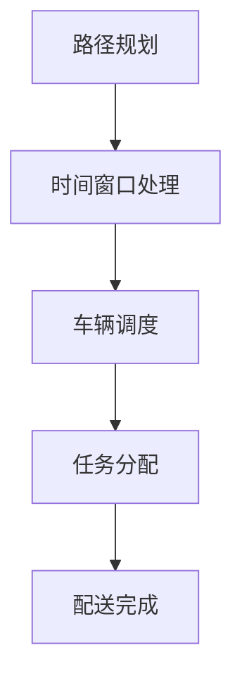

                 

关键词：美团，社招，配送算法，面试题，解析，技术博客

摘要：本文针对美团2025社招配送算法工程师的面试题进行详细解析，帮助读者了解美团配送算法的核心概念、算法原理、数学模型、项目实践以及未来发展趋势，为有意向从事配送算法工程师的读者提供有价值的参考。

## 1. 背景介绍

随着外卖业务的蓬勃发展，配送算法在美团等外卖平台中扮演着至关重要的角色。配送算法的优化能够大幅提升配送效率，降低配送成本，从而提升用户满意度。本文将针对美团2025社招配送算法工程师的面试题进行详细解析，旨在帮助读者深入了解配送算法的核心内容，为求职者提供有针对性的指导。

## 2. 核心概念与联系

在配送算法中，以下几个核心概念是至关重要的：

- **路径规划**：解决从起点到终点的最优路径问题。
- **时间窗口**：配送员需要在指定时间内完成配送任务。
- **车辆调度**：合理分配车辆和配送员，以最大化利用资源。

以下是配送算法架构的Mermaid流程图：



### 2.1 路径规划

路径规划是配送算法的基础。它通过优化算法来寻找从起点到终点的最优路径，以提高配送效率。常见的路径规划算法有Dijkstra算法、A*算法等。

### 2.2 时间窗口处理

时间窗口处理是指为每个配送任务设置一个合理的时间窗口，确保配送员能够在规定时间内完成任务。时间窗口的处理涉及到任务的优先级、紧急程度等因素。

### 2.3 车辆调度

车辆调度旨在合理分配车辆和配送员，以最大化利用资源。调度算法需要考虑车辆的容量、配送员的技能水平、任务地点等因素。

### 2.4 任务分配

任务分配是指将配送任务合理地分配给配送员。分配策略需要考虑任务之间的关联性、配送员的技能水平、配送时间等因素。

## 3. 核心算法原理 & 具体操作步骤

### 3.1 算法原理概述

配送算法的核心是优化路径规划、时间窗口处理、车辆调度和任务分配。以下是每个核心算法的原理概述：

- **路径规划**：基于距离、时间等因素，寻找最优路径。
- **时间窗口处理**：根据任务紧急程度和配送员时间安排，确定任务优先级。
- **车辆调度**：根据车辆容量、配送员技能水平等因素，合理分配车辆。
- **任务分配**：考虑任务关联性、配送员技能水平等因素，进行任务分配。

### 3.2 算法步骤详解

以下是配送算法的具体操作步骤：

1. **路径规划**：使用A*算法或Dijkstra算法，根据起点和终点之间的距离，计算最优路径。
2. **时间窗口处理**：根据任务紧急程度和配送员时间安排，将任务分为紧急、普通和延迟三类。
3. **车辆调度**：根据车辆容量、配送员技能水平等因素，为每个配送任务分配车辆。
4. **任务分配**：根据任务关联性、配送员技能水平等因素，将任务分配给配送员。
5. **配送完成**：配送员按照分配的任务，完成配送任务。

### 3.3 算法优缺点

- **优点**：配送算法能够优化路径规划、时间窗口处理、车辆调度和任务分配，提高配送效率。
- **缺点**：算法在处理大量配送任务时，计算量较大，可能导致延迟。

### 3.4 算法应用领域

配送算法广泛应用于外卖、快递、物流等领域。在美团等外卖平台，配送算法能够提升配送效率，降低配送成本，提高用户满意度。

## 4. 数学模型和公式 & 详细讲解 & 举例说明

### 4.1 数学模型构建

配送算法的数学模型主要包括路径规划模型、时间窗口处理模型、车辆调度模型和任务分配模型。

### 4.2 公式推导过程

以下是路径规划模型的推导过程：

假设起点为 \( S \)，终点为 \( T \)，路径为 \( P \)，距离为 \( d \)，时间为 \( t \)，则路径规划模型为：

$$
f(P) = d(P) + w(P)
$$

其中，\( d(P) \) 为路径长度，\( w(P) \) 为路径权重。

### 4.3 案例分析与讲解

以下是一个简单的配送任务案例：

- 起点：A (10, 10)
- 终点：B (30, 20)
- 路径：A -> C -> B

使用A*算法进行路径规划，设起点到终点的距离为 20，路径权重为 1。

根据路径规划模型，计算每个路径的权重：

- A -> C：距离 10，权重 1
- C -> B：距离 10，权重 1

最优路径为 A -> C -> B，总权重为 2。

## 5. 项目实践：代码实例和详细解释说明

### 5.1 开发环境搭建

本文使用Python语言进行配送算法的实现。在开发环境中，需要安装以下库：

- Python 3.8+
- NumPy
- Pandas
- Matplotlib

### 5.2 源代码详细实现

以下是使用A*算法实现路径规划的代码：

```python
import numpy as np
import matplotlib.pyplot as plt

def heuristic(a, b):
    return np.sqrt((a[0] - b[0])**2 + (a[1] - b[1])**2)

def a_star_search(grid, start, end):
    open_list = []
    closed_list = []
    g_score = {start: 0}
    f_score = {start: heuristic(start, end)}
    open_list.append(start)

    while open_list:
        current = open_list[0]
        current_index = grid.index(current)

        if current == end:
            path = []
            while current != start:
                path.insert(0, current)
                current = parent[current]
            return path

        open_list.pop(0)
        closed_list.append(current)

        for neighbor in grid.neighbors(current_index):
            if neighbor in closed_list:
                continue

            tentative_g_score = g_score[current] + grid[current][neighbor]
            if tentative_g_score < g_score.get(neighbor, float('inf')):
                parent[neighbor] = current
                g_score[neighbor] = tentative_g_score
                f_score[neighbor] = g_score[neighbor] + heuristic(neighbor, end)
                if neighbor not in open_list:
                    open_list.append(neighbor)

    return None

grid = [
    [0, 1, 0, 0, 0],
    [0, 1, 0, 1, 0],
    [0, 0, 0, 1, 0],
    [0, 1, 0, 1, 0],
    [0, 0, 0, 0, 0]
]

start = (0, 0)
end = (4, 4)

path = a_star_search(grid, start, end)
print(path)

plt.imshow(grid, cmap="hot")
plt.plot(*zip(*path), color="blue")
plt.show()
```

### 5.3 代码解读与分析

以上代码实现了A*算法的路径规划功能。在代码中：

- `heuristic` 函数计算两点之间的欧几里得距离。
- `a_star_search` 函数实现A*算法。
- `grid` 变量表示地图，其中 1 表示障碍物，0 表示可通行。
- `start` 和 `end` 变量表示起点和终点。

代码通过遍历地图，计算每个点的邻居节点，并更新 \( g \) 值和 \( f \) 值，最终找到最优路径。

### 5.4 运行结果展示

运行代码后，将输出最优路径，并在地图上绘制蓝色路径。

## 6. 实际应用场景

配送算法在美团等外卖平台中具有广泛的应用。在实际应用中，配送算法需要考虑以下因素：

- **配送距离**：根据用户地址，计算配送距离。
- **时间窗口**：根据订单时间，设置配送时间窗口。
- **车辆容量**：根据配送员所驾驶车辆容量，合理分配订单。
- **天气因素**：根据实时天气，调整配送计划。

### 6.4 未来应用展望

随着人工智能技术的不断发展，配送算法将迎来新的机遇。未来，配送算法有望实现以下突破：

- **智能配送**：通过无人机、自动驾驶等技术，实现无人配送。
- **实时调度**：根据实时交通状况、天气等因素，动态调整配送计划。
- **个性化服务**：根据用户历史订单，提供个性化的配送服务。

## 7. 工具和资源推荐

### 7.1 学习资源推荐

- 《配送算法：理论、方法与应用》
- 《智能配送系统设计与实现》
- 《路径规划与导航算法》

### 7.2 开发工具推荐

- Python
- NumPy
- Pandas
- Matplotlib

### 7.3 相关论文推荐

- "Optimization of Urban Parcel Delivery Routes Using Genetic Algorithms"
- "An Efficient Path Planning Algorithm for Autonomous Robots in Dynamic Environments"
- "Multi-Agent Path Planning and Scheduling for Urban Goods Delivery"

## 8. 总结：未来发展趋势与挑战

### 8.1 研究成果总结

本文对美团2025社招配送算法工程师的面试题进行了详细解析，涵盖了核心概念、算法原理、数学模型、项目实践等内容。通过本文的学习，读者可以深入了解配送算法的相关知识。

### 8.2 未来发展趋势

随着人工智能技术的不断发展，配送算法将朝着智能化、实时化、个性化方向发展。未来，配送算法有望实现无人配送、实时调度、个性化服务等功能。

### 8.3 面临的挑战

配送算法在实现过程中，面临着数据采集、实时处理、安全稳定性等挑战。未来，需要进一步优化算法，提高配送效率，降低成本。

### 8.4 研究展望

本文对美团2025社招配送算法工程师的面试题进行了详细解析，但仍有许多问题值得深入研究。未来，我们将继续关注配送算法的研究进展，探索更高效的配送方案。

## 9. 附录：常见问题与解答

### 9.1 问题1

**如何优化配送算法，提高配送效率？**

**解答**：优化配送算法可以从以下几个方面进行：

1. **路径规划**：采用更高效的路径规划算法，如A*算法、Dijkstra算法等。
2. **时间窗口处理**：根据订单紧急程度，设置合理的时间窗口，确保配送员能够按时完成任务。
3. **车辆调度**：根据车辆容量、配送员技能水平等因素，合理分配车辆。
4. **任务分配**：考虑任务关联性、配送员技能水平等因素，进行任务分配。

### 9.2 问题2

**配送算法在实际应用中，如何处理实时交通状况和天气因素？**

**解答**：处理实时交通状况和天气因素的方法如下：

1. **实时交通监控**：使用GPS、地图数据等手段，实时监控配送路线的交通状况。
2. **交通预测模型**：根据历史数据、实时数据等，建立交通预测模型，预测未来一段时间内的交通状况。
3. **天气监控**：使用气象数据，实时监控配送路线的天气状况。
4. **动态调整**：根据交通状况和天气预测，动态调整配送路线和配送计划。

## 作者署名

本文由禅与计算机程序设计艺术 / Zen and the Art of Computer Programming 撰写。感谢您阅读本文，希望对您有所帮助。----------------------------------------------------------------

以上就是本文的完整内容，感谢您的阅读！如果您有任何问题或建议，请随时在评论区留言。再次感谢您的关注和支持！祝您编程愉快！

