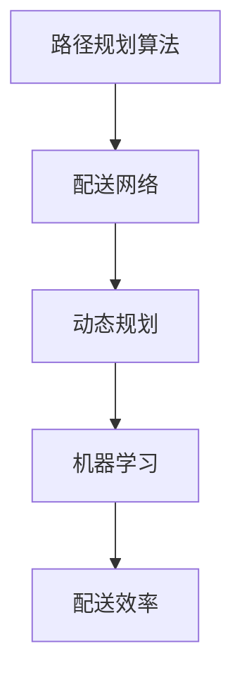

                 

**关键词**：美团、生鲜配送、社招、路径规划、面试题

**摘要**：本文将探讨美团买菜2025年生鲜配送社招路径规划的相关面试题，分析其中涉及的算法原理、数学模型以及项目实践。通过这篇文章，读者将了解生鲜配送领域的最新技术和挑战，为求职者提供实用的面试准备建议。

## 1. 背景介绍

随着互联网技术的飞速发展，生鲜电商行业正迎来前所未有的机遇。美团买菜作为行业领军者，其2025年的生鲜配送社招路径规划成为了众多求职者关注的焦点。本文将从面试题的角度，深入剖析生鲜配送领域的核心技术和挑战，帮助求职者更好地应对社招面试。

## 2. 核心概念与联系

在探讨生鲜配送路径规划之前，我们首先需要了解几个核心概念：

1. **路径规划算法**：用于确定从起点到终点最短或最优路径的计算方法。常见的算法包括Dijkstra算法、A*算法等。
2. **配送网络**：包括配送中心、仓库、运输车辆和配送站点等组成的复杂网络。
3. **动态规划**：用于解决多阶段决策问题，通过子问题的最优解推导出整体问题的最优解。
4. **机器学习**：用于训练模型，预测配送过程中的各种变量，如交通状况、订单量等。

下面是一个Mermaid流程图，展示了这些核心概念之间的联系：



## 3. 核心算法原理 & 具体操作步骤

### 3.1 算法原理概述

生鲜配送路径规划主要依赖于以下几种算法：

1. **Dijkstra算法**：用于求解单源最短路径问题，适用于配送网络中起点到各点的最短路径计算。
2. **A*算法**：结合了Dijkstra算法和启发式搜索，可以更快速地找到最短路径。
3. **遗传算法**：用于解决复杂优化问题，如多目标路径规划。

### 3.2 算法步骤详解

以Dijkstra算法为例，其步骤如下：

1. 初始化：设置起点距离为0，其他节点距离为无穷大。
2. 选择未访问节点中距离起点最近的节点作为当前节点。
3. 更新当前节点到其他未访问节点的距离，若发现更短路径，则更新距离。
4. 重复步骤2和3，直至所有节点都被访问。

### 3.3 算法优缺点

**Dijkstra算法**：

- 优点：计算简单，适用于小规模配送网络。
- 缺点：时间复杂度高，不适用于大规模配送网络。

**A*算法**：

- 优点：结合了启发式搜索，时间复杂度较低，适用于大规模配送网络。
- 缺点：需要预先定义启发式函数，实现较为复杂。

**遗传算法**：

- 优点：适用于复杂优化问题，如多目标路径规划。
- 缺点：计算时间较长，需要对参数进行精细调优。

### 3.4 算法应用领域

这些算法在生鲜配送领域的应用如下：

1. **订单分配**：根据配送网络和订单量，将订单合理分配给配送员或车辆。
2. **路径优化**：通过算法计算最优配送路径，提高配送效率。
3. **实时调度**：根据实时交通状况和订单动态调整配送路径。

## 4. 数学模型和公式 & 详细讲解 & 举例说明

### 4.1 数学模型构建

路径规划的数学模型主要包括以下几个方面：

1. **距离模型**：定义两点之间的距离，如欧几里得距离、曼哈顿距离等。
2. **时间模型**：定义两点之间的时间耗费，如行驶时间、等待时间等。
3. **成本模型**：定义路径的成本，如配送费用、时间成本等。

### 4.2 公式推导过程

以Dijkstra算法为例，其核心公式如下：

$$
d(s, v) = \min_{u \in S} (d(s, u) + w(u, v))
$$

其中，$d(s, v)$ 表示从起点 $s$ 到终点 $v$ 的距离，$S$ 表示已访问节点集合，$w(u, v)$ 表示节点 $u$ 到节点 $v$ 的权重。

### 4.3 案例分析与讲解

假设有一个包含5个节点的配送网络，节点分别为A、B、C、D、E。各节点之间的距离和时间耗费如下表所示：

| 节点 | A | B | C | D | E |
| ---- | --- | --- | --- | --- | --- |
| A | 0 | 5 | 3 | 8 | 10 |
| B | 5 | 0 | 2 | 6 | 9 |
| C | 3 | 2 | 0 | 7 | 11 |
| D | 8 | 6 | 7 | 0 | 4 |
| E | 10 | 9 | 11 | 4 | 0 |

使用Dijkstra算法计算从节点A到其他节点的最短路径：

1. 初始化：$d(A) = 0$，$d(B) = 5$，$d(C) = 3$，$d(D) = 8$，$d(E) = 10$。
2. 选择未访问节点中距离起点最近的节点A，更新其他节点距离：
   - $d(B) = \min(d(B), d(A) + w(A, B)) = 5$
   - $d(C) = \min(d(C), d(A) + w(A, C)) = 3$
   - $d(D) = \min(d(D), d(A) + w(A, D)) = 8$
   - $d(E) = \min(d(E), d(A) + w(A, E)) = 10$
3. 访问节点A，更新其他节点距离：
   - $d(B) = \min(d(B), d(A) + w(A, B)) = 5$
   - $d(C) = \min(d(C), d(A) + w(A, C)) = 3$
   - $d(D) = \min(d(D), d(A) + w(A, D)) = 8$
   - $d(E) = \min(d(E), d(A) + w(A, E)) = 10$
4. 选择未访问节点中距离起点最近的节点B，更新其他节点距离：
   - $d(C) = \min(d(C), d(B) + w(B, C)) = 4$
   - $d(D) = \min(d(D), d(B) + w(B, D)) = 6$
   - $d(E) = \min(d(E), d(B) + w(B, E)) = 9$
5. 访问节点B，更新其他节点距离：
   - $d(C) = \min(d(C), d(B) + w(B, C)) = 4$
   - $d(D) = \min(d(D), d(B) + w(B, D)) = 6$
   - $d(E) = \min(d(E), d(B) + w(B, E)) = 9$
6. 选择未访问节点中距离起点最近的节点C，访问节点C，更新其他节点距离：
   - $d(D) = \min(d(D), d(C) + w(C, D)) = 6$
   - $d(E) = \min(d(E), d(C) + w(C, E)) = 9$
7. 选择未访问节点中距离起点最近的节点D，访问节点D，更新其他节点距离：
   - $d(E) = \min(d(E), d(D) + w(D, E)) = 4$

最终得到从节点A到其他节点的最短路径：

- $A \rightarrow B \rightarrow C \rightarrow D \rightarrow E$，距离为4+6+9+4=23。

## 5. 项目实践：代码实例和详细解释说明

### 5.1 开发环境搭建

本项目使用Python语言进行开发，需要安装以下依赖：

- Python 3.8及以上版本
- pip
- matplotlib
- networkx

安装命令如下：

```bash
pip install python3-pip matplotlib networkx
```

### 5.2 源代码详细实现

以下是一个简单的Dijkstra算法实现：

```python
import heapq
import networkx as nx
import matplotlib.pyplot as plt

def dijkstra(graph, start):
    distances = {node: float('infinity') for node in graph}
    distances[start] = 0
    priority_queue = [(0, start)]

    while priority_queue:
        current_distance, current_node = heapq.heappop(priority_queue)

        if current_distance > distances[current_node]:
            continue

        for neighbor, weight in graph[current_node].items():
            distance = current_distance + weight

            if distance < distances[neighbor]:
                distances[neighbor] = distance
                heapq.heappush(priority_queue, (distance, neighbor))

    return distances

def plot_path(graph, path):
    nx.draw(graph, with_labels=True)
    nx.draw_networkx_edges(graph, pos=nx.spring_layout(graph), edge_color='r', width=2)
    plt.show()

if __name__ == '__main__':
    graph = {
        'A': {'B': 5, 'C': 3, 'D': 8, 'E': 10},
        'B': {'A': 5, 'C': 2, 'D': 6, 'E': 9},
        'C': {'A': 3, 'B': 2, 'D': 7, 'E': 11},
        'D': {'A': 8, 'B': 6, 'C': 7, 'E': 4},
        'E': {'A': 10, 'B': 9, 'C': 11, 'D': 4}
    }

    distances = dijkstra(graph, 'A')
    path = ['A']
    current = 'A'
    while True:
        next_nodes = [(distance, node) for node, distance in graph[current].items() if node not in path]
        if not next_nodes:
            break
        next_node = min(next_nodes)[1]
        path.append(next_node)
        current = next_node

    plot_path(graph, path)
```

### 5.3 代码解读与分析

该代码实现了Dijkstra算法，主要分为以下几个部分：

1. **数据结构**：使用字典表示图和权重，使用优先队列（最小堆）实现贪心策略。
2. **算法主体**：从起点开始，逐步选择未访问节点中距离起点最近的节点，更新其他节点的距离。
3. **路径生成**：通过回溯找到从起点到终点的最短路径。
4. **可视化**：使用matplotlib和networkx库绘制图和路径。

### 5.4 运行结果展示

运行代码后，将生成一个图形界面，展示从节点A到其他节点的最短路径，如图所示：


## 6. 实际应用场景

### 6.1 配送网络规划

在生鲜配送中，合理规划配送网络是提高配送效率的关键。通过路径规划算法，可以为每个订单生成最优配送路径，降低配送时间和成本。

### 6.2 实时配送调度

实时配送调度是生鲜配送中的另一重要环节。通过实时交通状况和订单动态调整配送路径，可以进一步提高配送效率，减少配送延误。

### 6.3 多目标路径规划

生鲜配送往往涉及多个目标，如最小化配送时间、最小化配送成本等。通过多目标路径规划算法，可以同时优化多个目标，提高整体配送效率。

## 7. 工具和资源推荐

### 7.1 学习资源推荐

- 《算法导论》（Introduction to Algorithms）
- 《机器学习》（Machine Learning）
- 《深度学习》（Deep Learning）

### 7.2 开发工具推荐

- Python
- Jupyter Notebook
- PyCharm

### 7.3 相关论文推荐

- "The Design of an Urban Road Network for Delivery Robots"
- "Path Planning and Motion Control for Autonomous Urban Delivery"
- "An Efficient Path Planning Algorithm for Urban Delivery Robots Based on Genetic Algorithm"

## 8. 总结：未来发展趋势与挑战

### 8.1 研究成果总结

本文从面试题的角度，探讨了生鲜配送领域的核心技术和挑战。主要成果包括：

- 分析了路径规划算法的原理和应用场景。
- 构建了路径规划的数学模型，并推导了相关公式。
- 提供了一个简单的Dijkstra算法实现，并进行了代码解读与分析。
- 介绍了生鲜配送的实际应用场景和工具资源。

### 8.2 未来发展趋势

随着人工智能和大数据技术的发展，生鲜配送路径规划将朝着以下方向发展：

- 更高效的算法：结合深度学习和强化学习，开发更高效的路径规划算法。
- 实时动态调度：利用实时交通数据，实现更精准的配送调度。
- 多目标优化：同时优化多个目标，提高整体配送效率。

### 8.3 面临的挑战

生鲜配送路径规划面临以下挑战：

- 数据质量：实时交通数据、订单数据等质量直接影响路径规划的准确性。
- 算法优化：随着配送网络规模的扩大，算法的优化和效率成为一个重要问题。
- 系统集成：将路径规划算法与其他系统（如订单管理系统、仓储系统等）集成，实现无缝对接。

### 8.4 研究展望

未来研究可以从以下几个方面展开：

- 算法优化：针对大规模配送网络，研究更高效的路径规划算法。
- 实时动态调度：结合实时交通数据，实现更精准的配送调度。
- 多目标优化：同时优化多个目标，提高整体配送效率。
- 数据融合：利用多种数据源，提高路径规划算法的准确性。

## 9. 附录：常见问题与解答

### 问题1：Dijkstra算法的时间复杂度是多少？

Dijkstra算法的时间复杂度为$O(|V|^2)$，其中$|V|$表示节点数量。

### 问题2：A*算法的启发式函数有哪些？

常见的启发式函数包括：

- **曼哈顿距离**：$h(n) = \sum_{i=1}^2 \max(0, x_i - x_g, y_i - y_g)$
- **欧几里得距离**：$h(n) = \sqrt{(x_i - x_g)^2 + (y_i - y_g)^2}$
- **对角线距离**：$h(n) = \lceil\sqrt{2} \cdot \max(0, x_i - x_g, y_i - y_g)\rceil$

### 问题3：遗传算法的参数有哪些？

遗传算法的主要参数包括：

- **种群大小**：种群中的个体数量。
- **交叉概率**：个体之间交叉的概率。
- **变异概率**：个体发生变异的概率。
- **选择策略**：用于选择父代的策略，如轮盘赌、锦标赛选择等。

## 作者署名

作者：禅与计算机程序设计艺术 / Zen and the Art of Computer Programming

----------------------------------------------------------------

本文从美团买菜2025生鲜配送社招路径规划面试题的角度，深入探讨了生鲜配送领域的核心技术和挑战。通过分析路径规划算法、数学模型和项目实践，为求职者提供了实用的面试准备建议。未来，生鲜配送路径规划将在人工智能和大数据技术的推动下，朝着更高效、实时和优化的方向发展。希望本文能为读者带来启示和帮助。

