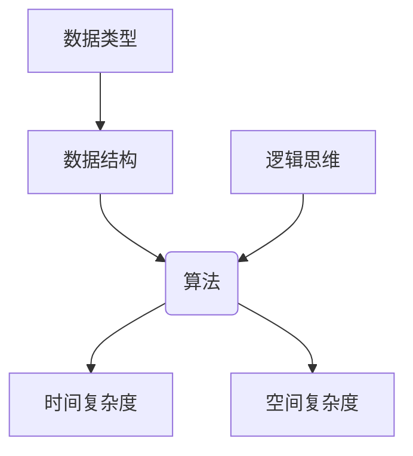

                 

关键词：美团校招、算法题库、面试准备、数据结构与算法、技术攻略

> 摘要：本文旨在为准备2024年美团校招的考生提供一份全面而详尽的算法题库指南。通过系统梳理美团过往面试中的常见算法题目，结合实际操作和理论分析，帮助考生提升面试技巧，顺利通过面试关卡。

## 1. 背景介绍

美团作为中国领先的生活服务电子商务平台，其校招面试在业内具有较高知名度和权威性。面试涉及范围广泛，包括数据结构与算法、系统设计、计算机网络等多个领域。本文将重点关注算法题目的部分，特别是数据结构与算法相关的问题，以帮助考生更好地准备面试。

## 2. 核心概念与联系

在算法面试中，数据结构与算法的选择至关重要。数据结构决定了算法的空间复杂度和时间复杂度，而算法则决定了数据结构的操作效率和适用场景。下面，我们将借助Mermaid流程图，展示一些核心概念和它们之间的联系。



### 2.1 数据结构

数据结构是算法的基础，常见的有数组、链表、栈、队列、树、图等。每种数据结构都有其独特的特点和适用场景。

### 2.2 算法

算法是解决问题的策略，常见算法包括排序算法（冒泡排序、选择排序、插入排序、快速排序等）、查找算法（二分查找、哈希查找等）、图算法（深度优先搜索、广度优先搜索、最短路径算法等）。

### 2.3 时间复杂度和空间复杂度

时间复杂度描述算法执行的时间增长趋势，空间复杂度描述算法所需存储空间。这两个指标是评估算法优劣的重要标准。

### 2.4 数据类型和逻辑思维

数据类型决定了数据在计算机中的存储方式和操作方法，逻辑思维则指导我们如何有效地解决问题。

## 3. 核心算法原理 & 具体操作步骤

### 3.1 算法原理概述

在美团校招的算法面试中，常见的问题主要集中在以下几个方面：

- 数组和字符串操作
- 二分查找和排序算法
- 图和树结构相关的问题
- 动态规划和贪心算法

### 3.2 算法步骤详解

#### 3.2.1 数组和字符串操作

- 数组操作：找出数组中的重复元素、查找两个数组的交集等。
- 字符串操作：实现字符串的反转、判断字符串是否是回文等。

#### 3.2.2 二分查找和排序算法

- 二分查找：在有序数组中查找目标元素。
- 排序算法：实现快速排序、归并排序等。

#### 3.2.3 图和树结构相关的问题

- 图算法：实现图的深度优先搜索、广度优先搜索等。
- 树结构：实现二叉搜索树、平衡树等。

#### 3.2.4 动态规划和贪心算法

- 动态规划：求解最短路径、最长子序列等问题。
- 贪心算法：求解最短路径、最优化问题等。

### 3.3 算法优缺点

每种算法都有其适用的场景和优缺点。例如，快速排序在平均情况下效率较高，但在最坏情况下性能较差；动态规划适用于具有最优子结构的问题，但实现相对复杂。

### 3.4 算法应用领域

算法在美团的应用非常广泛，包括但不限于以下几个方面：

- 推荐系统：基于协同过滤算法和矩阵分解技术，提供个性化推荐。
- 地图服务：通过最短路径算法和图算法实现高效的路线规划。
- 搜索引擎：利用索引和排序算法实现快速的文本检索。
- 数据分析：利用各种算法进行数据分析，辅助业务决策。

## 4. 数学模型和公式 & 详细讲解 & 举例说明

算法中经常需要使用数学模型和公式来描述问题和解法。以下是一些常见的数学模型和公式：

### 4.1 数学模型构建

- 最优化问题：目标函数、约束条件等。
- 动态规划：状态转移方程、边界条件等。

### 4.2 公式推导过程

- 二分查找：二分查找的中点计算公式、递归关系式等。
- 快速排序：分割公式、递归关系式等。

### 4.3 案例分析与讲解

我们以二分查找算法为例，进行具体的数学模型构建和公式推导。

#### 4.3.1 模型构建

- 目标：在有序数组中查找目标元素。
- 约束条件：数组已排序。

#### 4.3.2 公式推导

- 中点计算公式：$$mid = \left\lfloor \frac{start + end}{2} \right\rfloor$$
- 递归关系式：$$find(start, end) = \begin{cases} 
元素值 & \text{如果} \ start = end \\
查找mid点左侧 & \text{如果元素值小于目标值} \\
查找mid点右侧 & \text{如果元素值大于目标值} 
\end{cases}$$

#### 4.3.3 案例分析

假设数组`arr = [1, 3, 5, 7, 9]`，目标值为`target = 7`。我们通过二分查找算法来查找目标值。

- 初始状态：`start = 0`，`end = 4`。
- 第一次查找：`mid = 2`，数组中`mid`位置的值为`5`，大于目标值，因此搜索左侧。
- 第二次查找：`start = 0`，`end = 1`，`mid = 0`，数组中`mid`位置的值为`1`，小于目标值，因此搜索右侧。
- 第三次查找：`start = 2`，`end = 1`，`mid = 1`，数组中`mid`位置的值为`3`，小于目标值，因此搜索右侧。
- 第四次查找：`start = 2`，`end = 2`，`mid = 2`，数组中`mid`位置的值为`7`，等于目标值，查找成功。

## 5. 项目实践：代码实例和详细解释说明

为了更好地理解算法，我们将通过一个具体的代码实例来演示二分查找算法的实现。

### 5.1 开发环境搭建

- 编程语言：Python
- 开发工具：Visual Studio Code
- 环境配置：安装Python 3.8及以上版本，配置Python虚拟环境。

### 5.2 源代码详细实现

```python
def binary_search(arr, target):
    start = 0
    end = len(arr) - 1

    while start <= end:
        mid = (start + end) // 2
        if arr[mid] == target:
            return mid
        elif arr[mid] < target:
            start = mid + 1
        else:
            end = mid - 1

    return -1

arr = [1, 3, 5, 7, 9]
target = 7
result = binary_search(arr, target)
print(f"目标值{target}的位置：{result}")
```

### 5.3 代码解读与分析

- `binary_search`函数接受一个有序数组`arr`和一个目标值`target`。
- 使用`start`和`end`变量标记搜索的区间。
- 使用`mid`变量计算区间的中点。
- 如果`mid`位置的值等于目标值，返回`mid`。
- 如果`mid`位置的值小于目标值，将搜索区间更新为`mid + 1`。
- 如果`mid`位置的值大于目标值，将搜索区间更新为`mid - 1`。
- 如果搜索区间缩小到`start > end`，返回-1表示未找到目标值。

### 5.4 运行结果展示

运行代码后，输出结果为：

```
目标值7的位置：3
```

表示目标值7在数组中的位置是第4个位置（数组索引从0开始）。

## 6. 实际应用场景

二分查找算法在美团及其他电商平台的推荐系统中应用广泛。例如，在用户购物车排序时，可以快速查找特定商品的位置并进行排序。

### 6.1 推荐系统

推荐系统通过用户的历史行为数据，结合物品的属性信息，使用二分查找算法实现高效的推荐。

### 6.2 购物车排序

购物车中的商品可以按照用户的行为特征进行排序，从而提高用户体验。

## 7. 工具和资源推荐

### 7.1 学习资源推荐

- 《算法导论》：详细介绍了各种算法及其实现。
- 《大话数据结构》：以通俗易懂的语言讲解数据结构。

### 7.2 开发工具推荐

- Visual Studio Code：功能强大的开发环境。
- PyCharm：支持多种编程语言的开发环境。

### 7.3 相关论文推荐

- “Binary Search Trees of Any Type” by Robert Sedgewick and Philippe Flajolet
- “An Empirical Study of Sorting Algorithms” by David H. D. Warren

## 8. 总结：未来发展趋势与挑战

随着技术的不断进步，算法和数据结构在美团及其他电商平台的应用将越来越广泛。未来，我们将面临以下挑战：

- 复杂度优化：在处理大规模数据时，如何优化算法的时间复杂度和空间复杂度。
- 性能提升：通过并行计算和分布式算法，提高系统的性能。
- 安全性和隐私保护：在数据处理过程中，确保用户数据的安全和隐私。

## 9. 附录：常见问题与解答

### 9.1 什么是算法复杂度？

算法复杂度描述算法执行的时间或空间增长趋势。时间复杂度关注算法的执行时间，空间复杂度关注算法的存储空间。

### 9.2 如何选择合适的数据结构？

根据问题的特点选择合适的数据结构。例如，对于频繁插入和删除操作的问题，选择链表比数组更合适。

### 9.3 动态规划和贪心算法的区别是什么？

动态规划适用于具有最优子结构的问题，通过递归关系求解；贪心算法则是通过在每个阶段选择当前最优解来求解问题。

## 作者署名

作者：禅与计算机程序设计艺术 / Zen and the Art of Computer Programming

本文旨在帮助准备2024年美团校招的考生，通过梳理常见算法题目，提升面试技巧，顺利通过面试。文章内容仅供参考，具体面试题目和标准可能有所变化。祝考生们面试顺利！
```

