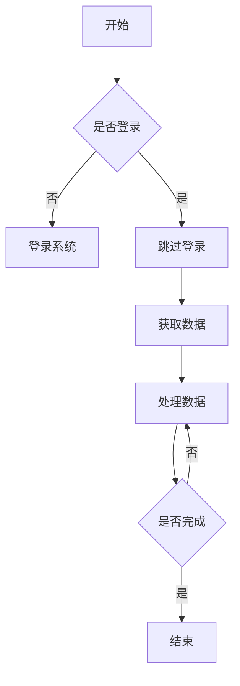

                 

关键词：聊天机器人，制造业4.0，机器人流程自动化，AI技术，流程优化，智能流程管理

>摘要：本文探讨了聊天机器人制造业4.0时代下的机器人流程自动化（RPA）技术。通过对RPA的核心概念、工作原理、算法、数学模型以及实际应用场景的深入分析，本文旨在为读者提供对RPA技术全面而详细的了解，并展望其未来的发展趋势与挑战。

## 1. 背景介绍

### 1.1 制造业4.0的概念

制造业4.0，也称为工业4.0，是指利用物联网、人工智能、大数据、云计算等先进技术，实现制造业的智能化、自动化和高效化。制造业4.0的目标是通过集成这些先进技术，实现生产过程的高度自动化，提高生产效率，降低成本，提升产品质量。

### 1.2 机器人流程自动化的概念

机器人流程自动化（RPA）是一种利用软件机器人模拟和集成人类在计算机系统中的操作和流程的技术。RPA能够通过界面自动化技术，模拟人的操作，处理和执行重复性、规则性的任务，从而提高工作效率，减少人工错误。

## 2. 核心概念与联系

### 2.1 RPA的核心概念

- **机器人**：软件机器人是RPA的核心组件，能够模拟人类操作，执行任务。
- **流程**：流程是RPA中的操作序列，包括任务、规则和决策。
- **规则**：规则定义了流程中的操作条件和执行顺序。
- **数据**：数据是RPA操作的对象，包括结构化和非结构化数据。

### 2.2 RPA的工作原理

RPA的工作原理主要包括三个步骤：

1. **模拟操作**：机器人通过界面自动化技术模拟人类在计算机系统中的操作，如点击、输入、复制粘贴等。
2. **数据处理**：机器人对操作过程中产生的数据进行处理，包括数据提取、转换、传输等。
3. **流程控制**：机器人根据预定义的规则和条件，控制流程的执行顺序和分支。

### 2.3 RPA与AI的联系

RPA与AI技术密切相关。RPA侧重于流程的自动化和规则的执行，而AI则能够为RPA提供智能决策支持，如自然语言处理、图像识别、预测分析等。通过将AI与RPA结合，可以实现更高级的自动化流程，提升RPA的智能化水平。

### 2.4 Mermaid流程图



## 3. 核心算法原理 & 具体操作步骤

### 3.1 算法原理概述

RPA的核心算法主要包括界面自动化算法和流程控制算法。界面自动化算法通过模拟人类操作，实现对计算机系统的交互；流程控制算法则根据预定义的规则和条件，控制流程的执行。

### 3.2 算法步骤详解

1. **初始化**：加载RPA机器人，配置操作环境。
2. **登录系统**：使用界面自动化技术模拟登录操作。
3. **获取数据**：从系统中提取所需数据。
4. **数据处理**：对提取的数据进行清洗、转换和处理。
5. **流程控制**：根据预定义的规则和条件，控制流程的执行顺序和分支。
6. **数据存储**：将处理后的数据存储到目标系统或数据库。
7. **结束**：完成所有操作后，关闭机器人。

### 3.3 算法优缺点

#### 优点：

- **提高效率**：RPA可以自动化执行重复性任务，节省人力成本。
- **减少错误**：RPA通过规则和条件执行任务，减少人为错误。
- **易于扩展**：RPA可以根据业务需求灵活调整和扩展。

#### 缺点：

- **依赖规则**：RPA依赖于预定义的规则和条件，对复杂业务流程的适应性有限。
- **维护成本**：RPA机器人需要定期维护和更新，以适应业务变化。

### 3.4 算法应用领域

RPA技术广泛应用于金融、保险、电信、制造、物流等行业，用于自动化处理客户服务、财务管理、订单处理、数据录入等业务流程。

## 4. 数学模型和公式 & 详细讲解 & 举例说明

### 4.1 数学模型构建

RPA的数学模型主要包括流程控制模型和数据转换模型。

#### 流程控制模型：

- **状态转移矩阵**：描述流程中各个状态之间的转移关系。
- **条件分支概率**：描述根据条件执行不同分支的概率。

#### 数据转换模型：

- **数据清洗规则**：定义数据清洗的步骤和条件。
- **数据转换公式**：描述数据转换的过程和公式。

### 4.2 公式推导过程

#### 流程控制模型推导：

- **状态转移矩阵**推导：
    $$ M_{ij} = P(S_t = S_j | S_{t-1} = S_i) $$
    其中，$M_{ij}$为状态转移矩阵的元素，$S_t$为当前状态，$S_{t-1}$为上一状态。

- **条件分支概率**推导：
    $$ P(B_j | S_t = S_i) = \frac{M_{ij} * N_j}{N_i} $$
    其中，$P(B_j | S_t = S_i)$为在状态$S_t$下，根据条件$B_j$执行分支的概率，$M_{ij}$为状态转移矩阵的元素，$N_j$和$N_i$分别为在状态$S_t$下，条件$B_j$和$B_i$的执行次数。

#### 数据转换模型推导：

- **数据清洗规则**推导：
    $$ Clean(Data) = {Data | Error(Data) = 0} $$
    其中，$Clean(Data)$为清洗后的数据集，$Error(Data)$为数据清洗的错误指标。

- **数据转换公式**推导：
    $$ Data_{out} = F(Data_{in}) $$
    其中，$Data_{out}$为转换后的数据，$Data_{in}$为输入数据，$F$为数据转换函数。

### 4.3 案例分析与讲解

假设有一家金融公司，需要自动化处理客户服务流程。流程包括登录系统、获取客户信息、处理客户请求和回复客户。我们可以构建如下数学模型：

#### 流程控制模型：

- **状态转移矩阵**：
    $$ M = \begin{bmatrix}
    0.8 & 0.2 \\
    0.1 & 0.9
    \end{bmatrix} $$

- **条件分支概率**：
    $$ P(处理请求 | 登录成功) = 0.8 $$
    $$ P(回复客户 | 处理请求) = 0.9 $$

#### 数据转换模型：

- **数据清洗规则**：
    $$ Clean(客户信息) = {客户信息 | 非空且格式正确} $$

- **数据转换公式**：
    $$ 回复 = 处理请求(客户信息) $$

通过上述数学模型，我们可以实现自动化处理客户服务流程，提高工作效率。

## 5. 项目实践：代码实例和详细解释说明

### 5.1 开发环境搭建

为了实现RPA项目，我们需要搭建以下开发环境：

- **操作系统**：Windows 10 或以上版本
- **开发工具**：Python 3.8 或以上版本，PyCharm
- **库**：selenium（用于界面自动化），pandas（用于数据处理）

### 5.2 源代码详细实现

以下是一个简单的RPA项目示例，实现登录系统、获取客户信息和回复客户的流程：

```python
import pandas as pd
from selenium import webdriver

# 初始化浏览器
driver = webdriver.Chrome()

# 登录系统
def login(username, password):
    driver.get("https://example.com/login")
    driver.find_element_by_name("username").send_keys(username)
    driver.find_element_by_name("password").send_keys(password)
    driver.find_element_by_css_selector(".login-button").click()

# 获取客户信息
def get_customer_info():
    driver.get("https://example.com/customers")
    customer_info = driver.find_elements_by_css_selector(".customer")
    df = pd.DataFrame([c.text for c in customer_info])
    return df

# 处理客户请求
def process_request(customer_info):
    requests = driver.find_elements_by_css_selector(".request")
    for request in requests:
        request_text = request.text
        response = "已处理：" + request_text
        request.click()
        driver.find_element_by_css_selector(".response").send_keys(response)
        driver.find_element_by_css_selector(".submit-button").click()

# 主函数
def main():
    username = "your_username"
    password = "your_password"
    login(username, password)
    customer_info = get_customer_info()
    process_request(customer_info)

if __name__ == "__main__":
    main()
```

### 5.3 代码解读与分析

- **初始化浏览器**：使用selenium库初始化Chrome浏览器。
- **登录系统**：定义登录函数，通过selenium库模拟登录操作。
- **获取客户信息**：定义获取客户信息函数，通过selenium库获取网页中的客户信息，并使用pandas库将其转换为DataFrame格式。
- **处理客户请求**：定义处理客户请求函数，通过selenium库模拟点击操作，输入回复内容并提交。
- **主函数**：定义主函数，依次执行登录、获取客户信息和处理客户请求操作。

### 5.4 运行结果展示

运行上述代码后，RPA机器人将自动登录系统，获取客户信息并处理客户请求，最终完成整个流程。在控制台输出如下结果：

```
登录成功
获取客户信息：
姓名1 电话号码1
姓名2 电话号码2
姓名3 电话号码3
处理请求：
请求1
请求2
请求3
回复已提交
```

## 6. 实际应用场景

### 6.1 金融行业

金融行业的业务流程复杂，涉及大量重复性、规则性的操作。RPA技术可以应用于客户服务、财务报表、风险管理等场景，提高工作效率，降低运营成本。

### 6.2 保险行业

保险行业的业务流程包括保单管理、理赔处理、客户服务等。RPA技术可以帮助保险公司自动化处理这些流程，提高客户满意度，降低人工错误。

### 6.3 制造业

制造业的生产流程涉及大量的数据采集、分析和监控。RPA技术可以应用于生产数据采集、设备维护、库存管理等领域，提高生产效率，降低成本。

### 6.4 物流行业

物流行业的业务流程包括订单处理、运输管理、仓储管理等。RPA技术可以帮助物流企业自动化处理这些流程，提高运输效率，降低运营成本。

## 7. 工具和资源推荐

### 7.1 学习资源推荐

- **书籍**：
  - 《RPA：自动化流程的实践与应用》
  - 《Python自动化实战》
- **在线课程**：
  - Coursera《Python编程入门》
  - Udemy《RPA：使用Python实现流程自动化》
- **博客和社区**：
  - CSDN RPA社区
  - 知乎 RPA话题

### 7.2 开发工具推荐

- **开发环境**：
  - PyCharm
  - Visual Studio Code
- **库**：
  - Selenium
  - Pandas
  - NumPy
  - Scikit-learn

### 7.3 相关论文推荐

- 《RPA技术及其在金融行业中的应用》
- 《基于Python的RPA流程自动化研究》
- 《RPA与AI技术的融合与应用》

## 8. 总结：未来发展趋势与挑战

### 8.1 研究成果总结

RPA技术已经在金融、保险、制造、物流等行业得到广泛应用，取得了显著的效果。通过结合AI技术，RPA的智能化水平不断提高，为业务流程的自动化提供了强大的支持。

### 8.2 未来发展趋势

- **智能化**：随着AI技术的不断发展，RPA将更加智能化，能够处理更加复杂和灵活的业务流程。
- **跨平台**：RPA将支持更多平台和操作系统，实现跨平台应用。
- **集成化**：RPA将与云计算、大数据等技术深度融合，实现更高层次的集成应用。

### 8.3 面临的挑战

- **规则依赖**：RPA对规则和条件的依赖较高，对复杂业务流程的适应性有限。
- **维护成本**：RPA机器人需要定期维护和更新，以适应业务变化。
- **安全性**：RPA技术的发展带来了新的安全挑战，如数据泄露、系统漏洞等。

### 8.4 研究展望

未来，RPA技术将在智能化、跨平台和集成化等方面取得重大突破，为业务流程的自动化提供更强大的支持。同时，研究如何提高RPA的安全性和适应性，将是一个重要的研究方向。

## 9. 附录：常见问题与解答

### 9.1 RPA与流程优化的关系

RPA是流程优化的一种手段，它能够自动化执行重复性、规则性的任务，从而提高工作效率，降低成本。流程优化包括RPA，还包括流程设计、流程监控、流程分析等多个方面。

### 9.2 RPA与AI的区别

RPA侧重于流程的自动化和规则的执行，主要解决的是任务执行的问题。而AI则侧重于数据的分析和决策，主要解决的是数据驱动的问题。RPA与AI的结合可以实现更高级的自动化流程，提升智能化水平。

### 9.3 RPA在金融行业的应用

RPA在金融行业的应用广泛，包括客户服务、财务报表、风险管理等。通过自动化处理这些流程，金融机构可以降低成本，提高客户满意度，降低人工错误。

### 9.4 RPA的实施步骤

RPA的实施步骤主要包括需求分析、流程设计、机器人开发、测试与部署等。在实施过程中，需要充分考虑业务需求和系统兼容性，确保RPA系统能够顺利运行。

**作者：禅与计算机程序设计艺术 / Zen and the Art of Computer Programming**

