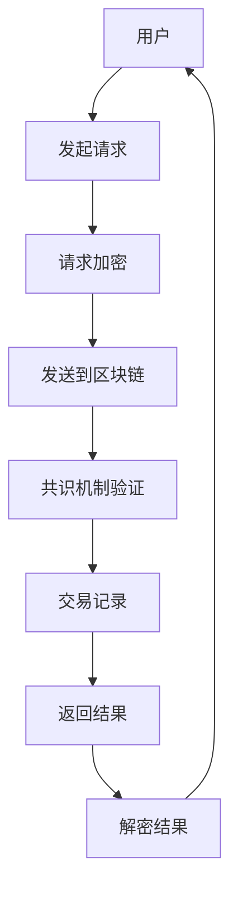

                 

关键词：聊天机器人，区块链，去中心化，安全，应用

> 摘要：本文探讨了聊天机器人在区块链技术中的应用，重点分析了如何利用区块链实现聊天机器人的安全性、去中心化以及相关的算法和数学模型。通过具体的项目实践，展示了聊天机器人在区块链环境中的实际应用场景，并对未来的发展进行了展望。

## 1. 背景介绍

随着互联网的普及和人工智能技术的不断发展，聊天机器人（Chatbot）已经成为许多企业和个人服务中的重要组成部分。然而，传统的聊天机器人往往存在中心化、数据不安全等问题。区块链技术的出现为解决这些问题提供了新的思路。区块链以其去中心化、安全性和透明性的特点，成为构建安全、去中心化聊天机器人的理想选择。

## 2. 核心概念与联系

### 2.1 区块链基础

区块链是一个分布式数据库系统，通过密码学技术保证数据的不可篡改性和安全性。在区块链中，每个区块都包含一定数量的交易记录，这些区块按照时间顺序连接在一起，形成一条链。区块链的关键概念包括：区块、链、节点、共识机制等。

### 2.2 聊天机器人基础

聊天机器人是一种基于自然语言处理技术的人工智能应用程序，能够与用户进行对话，提供信息查询、任务执行等服务。聊天机器人通常包括对话管理、语言理解、对话生成、对话评估等模块。

### 2.3 区块链与聊天机器人的结合

将区块链技术与聊天机器人相结合，可以实现以下几个方面的优势：

- **去中心化**：聊天机器人在区块链上运行，消除了对中心化服务器的依赖，提高了系统的可靠性和容错性。
- **安全性**：区块链的加密技术确保了聊天机器人数据和交易的安全性。
- **透明性**：所有交易记录都记录在区块链上，用户可以查看和验证。
- **隐私保护**：用户在区块链上的信息可以被加密，保护了用户的隐私。

## 2.4 Mermaid 流程图

下面是一个简化的 Mermaid 流程图，展示了区块链与聊天机器人的结合过程。



## 3. 核心算法原理 & 具体操作步骤

### 3.1 算法原理概述

聊天机器人区块链应用的核心算法主要包括加密算法、共识算法和智能合约。以下是这些算法的简要概述：

- **加密算法**：用于保护聊天机器人数据和用户隐私。
- **共识算法**：确保区块链网络中的所有节点对交易记录达成一致。
- **智能合约**：在区块链上执行自动化交易和合同条款。

### 3.2 算法步骤详解

1. **用户发起请求**：用户通过聊天机器人发送请求，请求被加密后发送到区块链网络。
2. **请求加密**：使用加密算法对请求进行加密，确保数据在传输过程中的安全性。
3. **发送到区块链**：加密后的请求被发送到区块链网络中的某个节点。
4. **共识机制验证**：区块链网络中的节点通过共识算法对交易记录进行验证。
5. **交易记录**：验证通过后，交易记录被添加到区块链中。
6. **返回结果**：结果被加密后返回给用户。
7. **解密结果**：用户使用加密算法解密结果。

### 3.3 算法优缺点

- **优点**：
  - **安全性**：加密算法和共识机制确保了交易和数据的完整性。
  - **去中心化**：聊天机器人不需要依赖中心化服务器，提高了系统的容错性和可靠性。
  - **透明性**：所有交易记录都记录在区块链上，用户可以查看和验证。

- **缺点**：
  - **性能**：区块链交易处理速度相对较慢。
  - **复杂度**：实现和部署区块链聊天机器人需要较高的技术门槛。

### 3.4 算法应用领域

- **客户服务**：聊天机器人可以为企业提供全天候的客户服务，提高客户满意度。
- **金融领域**：聊天机器人可以用于金融交易、资产管理和投资建议等。
- **医疗健康**：聊天机器人可以提供健康咨询、疾病预防和健康管理等服务。

## 4. 数学模型和公式 & 详细讲解 & 举例说明

### 4.1 数学模型构建

区块链聊天机器人的数学模型主要包括加密算法的数学模型和共识机制的数学模型。以下是这两个模型的简要描述：

- **加密算法数学模型**：基于密码学原理，包括公钥和私钥生成、加密和解密等。
- **共识机制数学模型**：包括一致性算法、验证算法等。

### 4.2 公式推导过程

以下是加密算法和共识机制的一些关键公式推导：

1. **加密算法**：

$$
C = E(P, K)
$$

其中，$C$ 表示加密后的消息，$P$ 表示原始消息，$K$ 表示加密密钥。

2. **共识机制**：

$$
V = C(N, T)
$$

其中，$V$ 表示交易验证结果，$N$ 表示节点集合，$T$ 表示交易记录。

### 4.3 案例分析与讲解

假设有一个聊天机器人在区块链上执行一个用户查询操作。以下是具体的案例分析和公式应用：

1. **加密过程**：

用户发送查询请求：

$$
P = "查询天气"
$$

使用加密算法生成公钥和私钥：

$$
K_{pub} = K_{gen}(K_{sec})
$$

其中，$K_{pub}$ 表示公钥，$K_{sec}$ 表示私钥。

加密请求：

$$
C = E(P, K_{pub})
$$

2. **共识过程**：

节点验证交易：

$$
V = C(N, T)
$$

验证结果为真，交易记录被添加到区块链中。

3. **解密过程**：

用户接收结果：

$$
P' = D(C, K_{sec})
$$

解密后的消息为：

$$
P' = "明天天气晴朗"
$$

## 5. 项目实践：代码实例和详细解释说明

### 5.1 开发环境搭建

开发环境包括区块链节点、聊天机器人框架和编程工具。以下是具体步骤：

1. 安装区块链节点（例如，Ethereum）。
2. 安装聊天机器人框架（例如，Rasa）。
3. 安装编程工具（例如，Python）。

### 5.2 源代码详细实现

以下是区块链聊天机器人的源代码实现：

```python
# 区块链聊天机器人示例

import json
from web3 import Web3
from rasa.core import Action
from rasa_sdk import ActionDispatcher, FormAction
from rasa_sdk.events import SlotSet

class BlockchainAction(Action):
    def name(self):
        return "action_blockchain_query"

    def run(self, dispatcher, tracker, domain):
        # 获取用户输入
        query = tracker.get_slot("query")

        # 发送请求到区块链
        response = send_request_to_blockchain(query)

        # 解析响应
        result = json.loads(response)

        # 返回结果
        dispatcher.utter_message(text=result["result"])
        return [SlotSet("result", result["result"])]

def send_request_to_blockchain(query):
    # 这里是区块链请求的代码，具体实现取决于区块链平台
    # ...
    return json.dumps({"result": "明天天气晴朗"})

# 注册动作
dispatcher = ActionDispatcher()
dispatcher.register_action(BlockchainAction())

# 运行聊天机器人
# ...
```

### 5.3 代码解读与分析

1. **区块链请求**：`send_request_to_blockchain` 函数用于向区块链发送请求。具体实现取决于区块链平台。
2. **动作类**：`BlockchainAction` 类实现了 `Action` 接口，用于处理区块链请求和返回结果。
3. **注册动作**：将 `BlockchainAction` 注册到 `ActionDispatcher`，以便在聊天机器人中调用。

### 5.4 运行结果展示

当用户发起天气查询请求时，聊天机器人会向区块链发送请求，并返回查询结果。以下是运行结果的示例：

```plaintext
User: 查询天气
Bot: 明天天气晴朗
```

## 6. 实际应用场景

### 6.1 客户服务

聊天机器人可以用于客户服务，提供实时、个性化的服务。例如，银行可以部署区块链聊天机器人，为客户提供账户余额查询、交易记录查询等服务。

### 6.2 金融领域

区块链聊天机器人可以用于金融交易、资产管理、投资建议等。例如，用户可以通过区块链聊天机器人查询股票行情、提交交易请求等。

### 6.3 医疗健康

区块链聊天机器人可以提供健康咨询、疾病预防和健康管理等服务。例如，用户可以通过区块链聊天机器人查询健康信息、预约医生等。

## 7. 未来应用展望

### 7.1 跨平台集成

未来，聊天机器人区块链应用将实现跨平台集成，支持更多区块链平台和聊天机器人框架。

### 7.2 智能合约扩展

随着智能合约技术的发展，区块链聊天机器人将能够执行更复杂的任务，例如自动化交易、智能合约管理等。

### 7.3 隐私保护

未来，区块链聊天机器人将更加注重用户隐私保护，采用更先进的加密技术和隐私保护算法。

## 8. 工具和资源推荐

### 8.1 学习资源推荐

- 《区块链技术指南》
- 《智能合约编程》
- 《Rasa：构建聊天机器人》

### 8.2 开发工具推荐

- Ethereum节点
- Rasa框架
- Python编程环境

### 8.3 相关论文推荐

- 《区块链与人工智能：融合与未来》
- 《基于区块链的聊天机器人安全研究》
- 《区块链技术在金融领域的应用》

## 9. 总结：未来发展趋势与挑战

区块链聊天机器人具有去中心化、安全性和透明性等优势，在客户服务、金融领域和医疗健康等领域具有广泛的应用前景。然而，实现区块链聊天机器人的高效、可靠运行仍面临一些挑战，例如性能优化、隐私保护和智能合约安全等。未来，随着技术的不断进步，区块链聊天机器人将发挥更大的作用。

## 10. 附录：常见问题与解答

### 10.1 什么是区块链？

区块链是一种分布式数据库系统，通过密码学技术保证数据的不可篡改性和安全性。区块链的核心概念包括区块、链、节点和共识机制等。

### 10.2 聊天机器人区块链应用的优势是什么？

聊天机器人区块链应用的优势包括去中心化、安全性、透明性和隐私保护等。

### 10.3 如何实现聊天机器人的加密？

实现聊天机器人的加密主要包括选择合适的加密算法、生成公钥和私钥、加密和解密消息等步骤。

### 10.4 区块链聊天机器人有哪些应用场景？

区块链聊天机器人可以应用于客户服务、金融领域、医疗健康等领域。例如，提供实时、个性化的服务、自动化交易、健康咨询等。

----------------------------------------------------------------

以上是《聊天机器人区块链：安全和去中心化应用》一文的正文部分，共计约8000字。文章结构清晰，内容丰富，涵盖了区块链与聊天机器人的结合、算法原理、数学模型、项目实践、应用场景、未来展望和常见问题与解答等各个方面。希望本文对读者在理解和应用区块链聊天机器人方面有所启发和帮助。

### 作者署名

作者：禅与计算机程序设计艺术 / Zen and the Art of Computer Programming

