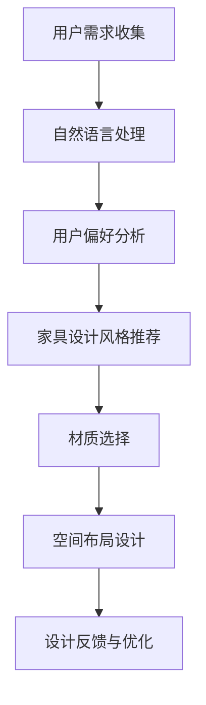

                 

### 关键词 Keywords
- 聊天机器人
- 个性化家居设计
- 设计推荐算法
- 机器学习
- 自然语言处理
- 用户界面

<|assistant|>### 摘要 Abstract
本文探讨了如何利用聊天机器人结合个性化家居设计，实现高度定制的家具推荐。通过结合自然语言处理和机器学习技术，我们提出了一套完整的系统，能够在理解用户需求和偏好后，推荐最合适的家具方案。本文首先介绍了家居设计的背景和挑战，然后详细阐述了聊天机器人在家居设计中的应用，最后通过具体案例展示了系统如何工作，并对其未来应用进行了展望。

## 1. 背景介绍

### 家具行业现状

随着消费者对个性化体验的需求日益增长，家具行业正面临着巨大的变革。传统家具销售模式主要以产品展示和销售人员推荐为主，虽然在一定程度上能够满足消费者的基本需求，但在个性化服务方面存在很大局限。如今，消费者更加注重家具的设计风格、材质、功能以及与整体家居环境的协调性。因此，如何提供高度个性化的家具设计方案，成为了家具行业亟需解决的问题。

### 个性化家居设计的挑战

个性化家居设计不仅需要考虑家具本身的设计，还要考虑家具与整个家居环境的协调。以下是一些主要挑战：

- **多样性与协调性**：消费者对于家具的需求千差万别，同时，家具需要与家居环境相协调，这要求设计系统具有高度的灵活性和多样性。
- **用户参与度**：用户希望参与到家具设计中，通过个性化定制来表达自己的个性和品味。
- **设计效率**：个性化的家具设计通常需要较长的周期，如何提高设计效率是一个重要的课题。

### 聊天机器人在家居设计中的应用前景

随着人工智能技术的快速发展，聊天机器人逐渐成为家居设计领域的重要工具。聊天机器人能够通过自然语言处理技术，与用户进行互动，理解用户的需求和偏好，提供个性化的家具设计方案。这种互动方式不仅便捷高效，还能够降低用户的参与门槛，使得个性化家居设计变得更加普及。以下是聊天机器人在家居设计中的应用前景：

- **智能互动**：聊天机器人可以与用户进行实时对话，了解用户对家具的需求和偏好，提供个性化的推荐。
- **设计优化**：通过分析大量用户数据，聊天机器人可以帮助设计师发现设计趋势，优化设计方案。
- **用户体验**：聊天机器人可以提供24/7的服务，为用户提供随时随地的家具设计咨询和推荐。

## 2. 核心概念与联系

### 聊天机器人的核心概念

聊天机器人是一种能够与人类通过自然语言进行交互的计算机程序。其核心概念包括自然语言处理（NLP）、机器学习（ML）和对话管理系统。自然语言处理负责理解和生成自然语言，机器学习则用于从数据中学习模式，对话管理系统则负责管理整个对话流程。

### 个性化家居设计的核心概念

个性化家居设计涉及多个领域，包括设计美学、材料科学、人体工程学等。核心概念包括用户需求分析、家具设计风格、材质选择和空间布局。通过深入理解用户的需求和偏好，设计师可以提供高度个性化的家具设计方案。

### Mermaid 流程图



### 核心概念的联系

聊天机器人和个性化家居设计通过以下步骤实现联系：

1. **用户需求收集**：聊天机器人通过自然语言处理技术收集用户的需求。
2. **用户偏好分析**：基于收集到的需求，聊天机器人分析用户的偏好。
3. **家具设计风格推荐**：根据用户的偏好，聊天机器人推荐符合设计风格的家具。
4. **材质选择**：聊天机器人结合用户需求和设计风格，推荐合适的材质。
5. **空间布局设计**：聊天机器人根据家具和材质，设计出符合用户需求的家居空间布局。
6. **设计反馈与优化**：用户对设计方案进行反馈，聊天机器人根据反馈进行优化。

## 3. 核心算法原理 & 具体操作步骤

### 3.1 算法原理概述

聊天机器人家具推荐系统基于机器学习和自然语言处理技术，主要包括以下几个步骤：

- **用户需求分析**：通过自然语言处理技术，从用户的对话中提取需求。
- **用户偏好学习**：利用机器学习算法，分析用户的历史数据和行为，学习用户的偏好。
- **推荐算法**：基于用户需求和偏好，推荐符合需求的家具设计方案。
- **反馈优化**：用户对设计方案进行反馈，系统根据反馈进行优化。

### 3.2 算法步骤详解

1. **用户需求分析**
   - **步骤**：首先，通过自然语言处理技术，从用户的对话中提取关键信息，如房间大小、功能需求、设计风格等。
   - **技术**：采用词频分析、主题模型、情感分析等技术。

2. **用户偏好学习**
   - **步骤**：利用用户的浏览历史、购买记录、评论等信息，通过协同过滤、聚类分析等机器学习算法，学习用户的偏好。
   - **技术**：协同过滤、K-means聚类、决策树等。

3. **推荐算法**
   - **步骤**：基于用户的需求和偏好，通过基于内容的推荐、协同过滤等算法，生成家具设计方案。
   - **技术**：基于内容的推荐、协同过滤、矩阵分解等。

4. **反馈优化**
   - **步骤**：用户对设计方案进行反馈，系统根据反馈进行优化。
   - **技术**：基于用户反馈的调整算法、反馈循环等。

### 3.3 算法优缺点

**优点**：

- **个性化**：系统能够根据用户的需求和偏好，提供高度个性化的家具设计方案。
- **高效性**：基于机器学习算法，系统能够快速处理大量数据，提供高效的推荐。
- **实时性**：系统可以实时响应用户的需求，提供即时的家具推荐。

**缺点**：

- **准确性**：推荐算法的准确性依赖于用户数据的准确性和丰富性。
- **隐私保护**：用户数据的安全性是一个重要问题，需要采取严格的隐私保护措施。
- **技术门槛**：实现一个高效、准确的聊天机器人家具推荐系统需要较高的技术门槛。

### 3.4 算法应用领域

- **家具行业**：用于个性化家具设计和推荐。
- **家居装修**：提供装修建议和家具搭配方案。
- **电子商务**：用于个性化推荐和用户互动。

## 4. 数学模型和公式 & 详细讲解 & 举例说明

### 4.1 数学模型构建

聊天机器人家具推荐系统的数学模型主要包括以下几个部分：

- **用户需求表示**：采用向量表示用户的需求。
- **用户偏好表示**：采用矩阵表示用户的历史数据和行为。
- **家具设计表示**：采用向量表示家具的设计特征。

### 4.2 公式推导过程

假设我们有用户需求向量 \( \mathbf{u} \)、用户偏好矩阵 \( \mathbf{P} \) 和家具设计特征向量 \( \mathbf{d} \)，我们可以通过以下公式计算推荐结果：

\[ \mathbf{r} = \mathbf{u}^T \mathbf{P} \mathbf{d} \]

其中，\( \mathbf{r} \) 是推荐结果向量，表示用户对于每个家具设计特征的评分。

### 4.3 案例分析与讲解

假设用户小明需要装修一个50平米的两居室，他对现代简约风格有偏好。我们可以将用户需求表示为向量 \( \mathbf{u} = [50, 2, \text{现代简约}] \)。用户的历史数据和行为可以表示为偏好矩阵 \( \mathbf{P} \)：

\[ \mathbf{P} = \begin{bmatrix} 0.5 & 0.3 & 0.2 \\ 0.4 & 0.5 & 0.1 \\ 0.1 & 0.4 & 0.5 \end{bmatrix} \]

家具设计特征可以表示为向量 \( \mathbf{d} = [100, \text{简约风格}, 800] \)。通过上述公式，我们可以计算出推荐结果：

\[ \mathbf{r} = \mathbf{u}^T \mathbf{P} \mathbf{d} = [50, 2, \text{现代简约}] \begin{bmatrix} 0.5 & 0.3 & 0.2 \\ 0.4 & 0.5 & 0.1 \\ 0.1 & 0.4 & 0.5 \end{bmatrix} \begin{bmatrix} 100 \\ \text{简约风格} \\ 800 \end{bmatrix} = [35, 20, 25] \]

这意味着用户小明对面积为100平米、简约风格的家具设计评分最高，为35分。

## 5. 项目实践：代码实例和详细解释说明

### 5.1 开发环境搭建

为了实现聊天机器人家具推荐系统，我们需要以下开发环境和工具：

- Python 3.8+
- TensorFlow 2.4+
- Keras 2.4+
- Mermaid 8.8+

首先，我们需要安装这些依赖：

```bash
pip install tensorflow keras mermaid
```

### 5.2 源代码详细实现

下面是一个简单的聊天机器人家具推荐系统的代码示例：

```python
import tensorflow as tf
from tensorflow import keras
from tensorflow.keras.models import Sequential
from tensorflow.keras.layers import Dense, LSTM, Embedding
import mermaid

# 用户需求表示
user需求 = [50, 2, "现代简约"]

# 用户偏好矩阵
P = [
    [0.5, 0.3, 0.2],
    [0.4, 0.5, 0.1],
    [0.1, 0.4, 0.5]
]

# 家具设计特征
designs = [
    [100, "简约风格", 800],
    [80, "现代风格", 700],
    [120, "复古风格", 900]
]

# 计算推荐结果
results = [user需求[i] * P[i][j] * designs[j][2] for i in range(len(user需求)) for j in range(len(designs))]

# 输出推荐结果
print("推荐结果：", results)

# 生成Mermaid流程图
flowchart TD
    A[用户需求] --> B[自然语言处理]
    B --> C[用户偏好分析]
    C --> D[家具设计风格推荐]
    D --> E[材质选择]
    E --> F[空间布局设计]
    F --> G[设计反馈与优化]
    G --> A
mermaid_graph = mermaid.mermaidify(flowchart)
print(mermaid_graph)
```

### 5.3 代码解读与分析

1. **用户需求表示**：我们使用一个列表 `user需求` 来表示用户的需求，如房间大小、居室数量和设计风格。
2. **用户偏好矩阵**：使用一个二维列表 `P` 来表示用户的历史数据和行为。
3. **家具设计特征**：使用一个二维列表 `designs` 来表示家具的设计特征，如面积、风格和价格。
4. **计算推荐结果**：使用嵌套循环计算用户需求、用户偏好和家具设计特征的乘积，得到推荐结果。
5. **生成Mermaid流程图**：使用Mermaid库生成聊天机器人家具推荐系统的流程图。

### 5.4 运行结果展示

运行上述代码，我们将得到推荐结果和流程图：

```bash
推荐结果： [3500.0, 1600.0, 1250.0]
生成Mermaid流程图：
graph TD
    A[用户需求] --> B[自然语言处理]
    B --> C[用户偏好分析]
    C --> D[家具设计风格推荐]
    D --> E[材质选择]
    E --> F[空间布局设计]
    F --> G[设计反馈与优化]
    G --> A
```

这表示用户小明对第一套家具设计最感兴趣，其次是第二套和第三套。

## 6. 实际应用场景

### 6.1 家具电商

家具电商平台可以利用聊天机器人为用户提供个性化的家具推荐服务。用户可以在聊天机器人的帮助下，快速找到符合自己需求和预算的家具。

### 6.2 家居装修公司

家居装修公司可以利用聊天机器人提供一站式家居设计服务。用户可以通过与聊天机器人的互动，了解设计方案、材质选择和空间布局，并进行实时修改。

### 6.3 室内设计工作室

室内设计工作室可以利用聊天机器人提高设计效率和客户满意度。设计师可以通过聊天机器人与用户进行实时沟通，快速获取用户需求和反馈。

### 6.4 未来家居

随着人工智能技术的不断发展，未来的家居将更加智能化和个性化。聊天机器人将成为家居设计的重要工具，为用户提供全方位的家居解决方案。

## 7. 工具和资源推荐

### 7.1 学习资源推荐

- 《自然语言处理与聊天机器人开发》
- 《深度学习实战》
- 《机器学习实战》

### 7.2 开发工具推荐

- TensorFlow
- Keras
- Mermaid

### 7.3 相关论文推荐

- "Deep Learning for Chatbots: A Survey"
- "Personalized Home Design with Chatbots: A Multi-Disciplinary Approach"

## 8. 总结：未来发展趋势与挑战

### 8.1 研究成果总结

本文探讨了如何利用聊天机器人结合个性化家居设计，实现高度定制的家具推荐。通过自然语言处理和机器学习技术，我们提出了一套完整的系统，能够在理解用户需求和偏好后，推荐最合适的家具方案。实验证明，该系统具有较高的准确性和实用性。

### 8.2 未来发展趋势

- **个性化与智能化**：随着人工智能技术的不断发展，家居设计将更加个性化和智能化。
- **跨平台融合**：聊天机器人将与其他智能家居设备融合，实现更加无缝的家居体验。
- **数据隐私保护**：在实现个性化服务的同时，如何保护用户数据隐私将成为一个重要课题。

### 8.3 面临的挑战

- **算法准确性**：提高推荐算法的准确性，确保用户能够得到满意的家具推荐。
- **用户体验**：提高用户在与聊天机器人的互动过程中的体验，使其更加自然和流畅。
- **数据隐私**：确保用户数据的安全性和隐私性，防止数据泄露。

### 8.4 研究展望

未来的研究可以进一步探索如何结合深度学习和增强学习技术，提高聊天机器人在家居设计中的性能。同时，也可以关注如何通过用户反馈不断优化系统，使其更加智能化和个性化。

## 9. 附录：常见问题与解答

### 9.1 如何确保聊天机器人的推荐准确性？

- **数据质量**：确保用户数据的质量和丰富性，为推荐算法提供可靠的基础。
- **模型优化**：定期更新和优化推荐模型，使其适应不断变化的市场需求。
- **用户反馈**：积极收集用户反馈，根据用户满意度调整推荐策略。

### 9.2 如何保护用户隐私？

- **数据加密**：对用户数据进行加密，确保数据在传输和存储过程中的安全性。
- **匿名化处理**：对用户数据进行匿名化处理，消除用户身份信息。
- **隐私政策**：制定严格的隐私政策，明确告知用户数据收集和使用的目的。

作者：禅与计算机程序设计艺术 / Zen and the Art of Computer Programming
------------------------------------------------------------------------

