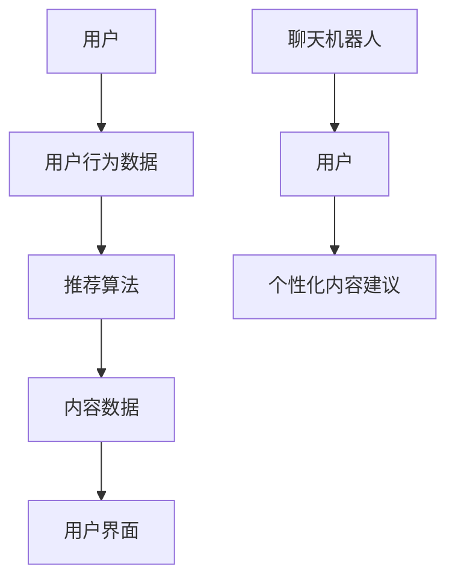

                 

关键词：聊天机器人，推荐系统，个性化内容，内容建议，AI，自然语言处理

> 摘要：本文将深入探讨聊天机器人推荐系统的设计和实现，重点关注如何利用个性化内容建议来提升用户交互体验。通过分析核心概念、算法原理、数学模型、项目实践以及未来应用展望，本文旨在为开发者提供全面的指导和启示。

## 1. 背景介绍

在当今数字化时代，聊天机器人已成为企业与用户互动的重要工具。然而，为了实现更高效、更有针对性的用户服务，聊天机器人需要具备强大的推荐系统，能够根据用户的行为和历史偏好，提供个性化的内容建议。这不仅有助于提升用户满意度，还能为企业带来更多的商业价值。

聊天机器人推荐系统是一个复杂的系统，它涉及多个技术领域，包括自然语言处理（NLP）、机器学习、数据挖掘等。本文将重点关注以下几个方面：

- **核心概念与联系**：介绍聊天机器人推荐系统中的关键概念及其相互关系。
- **核心算法原理与具体操作步骤**：阐述推荐算法的基本原理和实现步骤。
- **数学模型和公式**：介绍构建推荐系统的数学模型和公式，并进行详细讲解。
- **项目实践**：通过代码实例展示如何实现聊天机器人推荐系统。
- **实际应用场景**：探讨聊天机器人推荐系统在不同场景下的应用。
- **工具和资源推荐**：推荐学习资源、开发工具和相关论文。
- **未来发展趋势与挑战**：总结研究成果，展望未来发展，并探讨面临的挑战。

接下来，我们将逐步深入每个主题，探讨聊天机器人推荐系统的各个方面。

## 2. 核心概念与联系

### 2.1 聊天机器人

聊天机器人（Chatbot）是一种模拟人类对话行为的计算机程序，它能够通过与用户的自然语言交互，提供信息、执行任务或进行娱乐。聊天机器人可以应用于多种场景，如客服、营销、客户服务、在线教育等。

### 2.2 推荐系统

推荐系统（Recommendation System）是一种能够根据用户的历史行为和偏好，向用户推荐相关内容或产品的技术。推荐系统广泛应用于电子商务、社交媒体、在线视频平台等。

### 2.3 个性化内容建议

个性化内容建议（Personalized Content Recommendation）是指根据用户的兴趣、历史行为和需求，向用户推荐个性化的内容。在聊天机器人中，个性化内容建议能够提高用户互动体验，增加用户留存率和满意度。

### 2.4 关键概念联系

聊天机器人推荐系统中的关键概念包括用户行为数据、内容数据、推荐算法和用户界面。这些概念之间的联系如图1所示：



图1：聊天机器人推荐系统的核心概念联系

通过图1可以看出，用户行为数据和内容数据是推荐系统的输入，推荐算法根据这些输入生成个性化内容建议，并通过用户界面呈现给用户。这一过程不断迭代，以提升推荐效果。

## 3. 核心算法原理 & 具体操作步骤

### 3.1 算法原理概述

聊天机器人推荐系统的核心是推荐算法。推荐算法可以分为基于内容的推荐和基于协同过滤的推荐。基于内容的推荐主要根据用户的历史行为和偏好，推荐与用户兴趣相似的内容。而基于协同过滤的推荐则通过分析用户之间的相似性，为用户推荐其他用户喜欢的物品。

在本节中，我们将介绍基于协同过滤的推荐算法。协同过滤算法主要包括用户基于的协同过滤（User-Based Collaborative Filtering）和物品基于的协同过滤（Item-Based Collaborative Filtering）。用户基于的协同过滤通过计算用户之间的相似性来推荐内容，而物品基于的协同过滤则通过计算物品之间的相似性来推荐内容。

### 3.2 算法步骤详解

#### 3.2.1 用户基于的协同过滤

1. **用户行为数据收集**：收集用户在聊天机器人中的交互记录，如会话内容、点击行为、购买记录等。

2. **用户相似性计算**：根据用户的行为数据，计算用户之间的相似性。常用的相似性度量方法包括余弦相似度、皮尔逊相关系数等。

3. **邻居选择**：根据用户相似性度量，选择与目标用户最相似的K个邻居用户。

4. **推荐生成**：根据邻居用户的喜好，为目标用户生成推荐列表。推荐列表中的内容是邻居用户喜欢但目标用户尚未体验过的。

#### 3.2.2 物品基于的协同过滤

1. **用户行为数据收集**：与用户基于的协同过滤相同，收集用户在聊天机器人中的交互记录。

2. **物品相似性计算**：根据用户的行为数据，计算物品之间的相似性。物品相似性计算通常基于物品的属性、标签、内容等。

3. **邻居选择**：根据物品相似性度量，选择与目标物品最相似的K个物品。

4. **推荐生成**：根据邻居物品的喜好，为用户生成推荐列表。推荐列表中的物品是用户喜欢但尚未体验过的。

### 3.3 算法优缺点

#### 优点：

- **适应性强**：协同过滤算法能够根据用户的行为和偏好进行实时推荐，适应性强。
- **计算效率高**：相对于其他推荐算法，协同过滤算法的计算效率较高。

#### 缺点：

- **冷启动问题**：对于新用户或新物品，由于缺乏足够的历史数据，推荐效果较差。
- **易受噪声影响**：用户行为数据可能存在噪声，影响推荐效果。

### 3.4 算法应用领域

协同过滤算法广泛应用于聊天机器人推荐系统中，如：

- **客户服务**：根据用户的提问历史，推荐相关的常见问题解答。
- **营销推广**：根据用户的购买历史，推荐相关的商品或服务。
- **在线教育**：根据用户的学习历史，推荐相关的课程或学习资源。

## 4. 数学模型和公式 & 详细讲解 & 举例说明

### 4.1 数学模型构建

聊天机器人推荐系统的数学模型主要包括用户相似性计算、物品相似性计算和推荐生成算法。

#### 4.1.1 用户相似性计算

用户相似性计算公式如下：

$$
sim(u_i, u_j) = \frac{\sum_{k \in R}(r_{ik} - \bar{r_i})(r_{jk} - \bar{r_j})}{\sqrt{\sum_{k \in R}(r_{ik} - \bar{r_i})^2} \sqrt{\sum_{k \in R}(r_{jk} - \bar{r_j})^2}}
$$

其中，$u_i$ 和 $u_j$ 是两个用户，$R$ 是用户的行为记录集合，$r_{ik}$ 是用户 $u_i$ 在行为记录 $k$ 上的评分，$\bar{r_i}$ 和 $\bar{r_j}$ 分别是用户 $u_i$ 和 $u_j$ 的平均评分。

#### 4.1.2 物品相似性计算

物品相似性计算公式如下：

$$
sim(i_j, i_k) = \frac{\sum_{u \in U}(r_{uj}(i_j) - \bar{r_u})(r_{uj}(i_k) - \bar{r_u})}{\sqrt{\sum_{u \in U}(r_{uj}(i_j) - \bar{r_u})^2} \sqrt{\sum_{u \in U}(r_{uj}(i_k) - \bar{r_u})^2}}
$$

其中，$i_j$ 和 $i_k$ 是两个物品，$U$ 是用户集合，$r_{uj}(i_j)$ 和 $r_{uj}(i_k)$ 分别是用户 $u$ 在物品 $i_j$ 和 $i_k$ 上的评分，$\bar{r_u}$ 是用户 $u$ 的平均评分。

#### 4.1.3 推荐生成算法

推荐生成算法公式如下：

$$
r_{ui}(i_k) = \sum_{j \in N(i_k)} sim(u_i, u_j) r_{uj}(i_k) - \bar{r_u}
$$

其中，$N(i_k)$ 是与物品 $i_k$ 最相似的 $K$ 个物品集合，$r_{uj}(i_k)$ 是用户 $u$ 在物品 $i_k$ 上的评分，$\bar{r_u}$ 是用户 $u$ 的平均评分。

### 4.2 公式推导过程

#### 4.2.1 用户相似性计算推导

用户相似性计算公式是余弦相似度的一种变体。余弦相似度是通过计算两个向量的夹角余弦值来衡量相似性。对于用户 $u_i$ 和 $u_j$，他们的行为向量可以表示为：

$$
\vec{r_i} = (r_{i1}, r_{i2}, ..., r_{in}) \\
\vec{r_j} = (r_{j1}, r_{j2}, ..., r_{jn})
$$

其中，$r_{ik}$ 表示用户 $u_i$ 在行为记录 $k$ 上的评分，$n$ 是行为记录的数量。

两个向量的点积可以表示为：

$$
\vec{r_i} \cdot \vec{r_j} = \sum_{k=1}^{n} r_{ik} r_{jk}
$$

向量的模可以表示为：

$$
|\vec{r_i}| = \sqrt{\sum_{k=1}^{n} r_{ik}^2} \\
|\vec{r_j}| = \sqrt{\sum_{k=1}^{n} r_{jk}^2}
$$

因此，用户相似性计算公式可以表示为：

$$
sim(u_i, u_j) = \frac{\vec{r_i} \cdot \vec{r_j}}{|\vec{r_i}| |\vec{r_j}|}
$$

经过变形，得到余弦相似度公式：

$$
sim(u_i, u_j) = \frac{\sum_{k=1}^{n} (r_{ik} - \bar{r_i})(r_{jk} - \bar{r_j})}{\sqrt{\sum_{k=1}^{n} (r_{ik} - \bar{r_i})^2} \sqrt{\sum_{k=1}^{n} (r_{jk} - \bar{r_j})^2}}
$$

#### 4.2.2 物品相似性计算推导

物品相似性计算公式同样是余弦相似度的一种变体。对于物品 $i_j$ 和 $i_k$，他们的评分向量可以表示为：

$$
\vec{s_j} = (r_{1j}, r_{2j}, ..., r_{nj}) \\
\vec{s_k} = (r_{1k}, r_{2k}, ..., r_{nk})
$$

其中，$r_{uj}(i_j)$ 表示用户 $u$ 在物品 $i_j$ 上的评分，$n$ 是用户数量。

两个向量的点积可以表示为：

$$
\vec{s_j} \cdot \vec{s_k} = \sum_{u=1}^{n} r_{uj}(i_j) r_{uj}(i_k)
$$

向量的模可以表示为：

$$
|\vec{s_j}| = \sqrt{\sum_{u=1}^{n} r_{uj}(i_j)^2} \\
|\vec{s_k}| = \sqrt{\sum_{u=1}^{n} r_{uj}(i_k)^2}
$$

因此，物品相似性计算公式可以表示为：

$$
sim(i_j, i_k) = \frac{\vec{s_j} \cdot \vec{s_k}}{|\vec{s_j}| |\vec{s_k}|}
$$

经过变形，得到余弦相似度公式：

$$
sim(i_j, i_k) = \frac{\sum_{u=1}^{n} (r_{uj}(i_j) - \bar{r_u})(r_{uj}(i_k) - \bar{r_u})}{\sqrt{\sum_{u=1}^{n} (r_{uj}(i_j) - \bar{r_u})^2} \sqrt{\sum_{u=1}^{n} (r_{uj}(i_k) - \bar{r_u})^2}}
$$

### 4.3 案例分析与讲解

假设有两个用户 $u_1$ 和 $u_2$，他们在五个商品 $i_1$ 至 $i_5$ 上的评分如下表所示：

| 用户 | 商品 | 评分 |
| --- | --- | --- |
| $u_1$ | $i_1$ | 4 |
| $u_1$ | $i_2$ | 5 |
| $u_1$ | $i_3$ | 2 |
| $u_1$ | $i_4$ | 3 |
| $u_1$ | $i_5$ | 4 |
| $u_2$ | $i_1$ | 4 |
| $u_2$ | $i_2$ | 5 |
| $u_2$ | $i_3$ | 4 |
| $u_2$ | $i_4$ | 4 |
| $u_2$ | $i_5$ | 2 |

#### 4.3.1 用户相似性计算

首先，计算用户 $u_1$ 和 $u_2$ 的平均评分：

$$
\bar{r_1} = \frac{4 + 5 + 2 + 3 + 4}{5} = 3.4 \\
\bar{r_2} = \frac{4 + 5 + 4 + 4 + 2}{5} = 3.6
$$

然后，计算用户相似性：

$$
sim(u_1, u_2) = \frac{\sum_{k=1}^{5} (r_{1k} - \bar{r_1})(r_{2k} - \bar{r_2})}{\sqrt{\sum_{k=1}^{5} (r_{1k} - \bar{r_1})^2} \sqrt{\sum_{k=1}^{5} (r_{2k} - \bar{r_2})^2}}
$$

代入具体数值：

$$
sim(u_1, u_2) = \frac{(4-3.4)(4-3.6) + (5-3.4)(5-3.6) + (2-3.4)(4-3.6) + (3-3.4)(4-3.6) + (4-3.4)(2-3.6)}{\sqrt{(4-3.4)^2 + (5-3.4)^2 + (2-3.4)^2 + (3-3.4)^2 + (4-3.4)^2} \sqrt{(4-3.6)^2 + (5-3.6)^2 + (4-3.6)^2 + (4-3.6)^2 + (2-3.6)^2}}
$$

$$
sim(u_1, u_2) = \frac{0.06 + 0.64 + 0.44 + 0.06 + 0.56}{\sqrt{0.06 + 0.64 + 0.44 + 0.06 + 0.56} \sqrt{0.04 + 0.16 + 0.04 + 0.04 + 0.16}}
$$

$$
sim(u_1, u_2) = \frac{1.8}{\sqrt{1.8} \sqrt{0.4}}
$$

$$
sim(u_1, u_2) = \frac{1.8}{1.34 \times 0.63}
$$

$$
sim(u_1, u_2) \approx 0.97
$$

#### 4.3.2 物品相似性计算

接下来，计算物品 $i_1$ 和 $i_3$ 的相似性：

首先，计算物品 $i_1$ 和 $i_3$ 的平均评分：

$$
\bar{r_{i1}} = \frac{4 + 4}{2} = 4 \\
\bar{r_{i3}} = \frac{2 + 4}{2} = 3
$$

然后，计算物品相似性：

$$
sim(i_1, i_3) = \frac{\sum_{u=1}^{2} (r_{u1}(i_1) - \bar{r_{i1}})(r_{u2}(i_3) - \bar{r_{i3}})}{\sqrt{\sum_{u=1}^{2} (r_{u1}(i_1) - \bar{r_{i1}})^2} \sqrt{\sum_{u=1}^{2} (r_{u2}(i_3) - \bar{r_{i3}})^2}}
$$

代入具体数值：

$$
sim(i_1, i_3) = \frac{(4-4)(2-3) + (4-4)(4-3)}{\sqrt{(4-4)^2 + (4-4)^2} \sqrt{(2-3)^2 + (4-3)^2}}
$$

$$
sim(i_1, i_3) = \frac{0 + 0}{\sqrt{0 + 0} \sqrt{1 + 1}}
$$

$$
sim(i_1, i_3) = \frac{0}{\sqrt{0} \sqrt{2}}
$$

$$
sim(i_1, i_3) = \frac{0}{0 \times 1.41}
$$

$$
sim(i_1, i_3) = 0
$$

#### 4.3.3 推荐生成

假设目标用户是 $u_1$，我们需要为他生成推荐列表。首先，根据用户相似性计算，选择与 $u_1$ 最相似的邻居用户。在这里，我们选择 $u_2$ 作为邻居用户。然后，根据物品相似性计算，选择与 $i_3$ 最相似的物品。在这里，我们选择 $i_1$ 作为相似物品。最后，根据推荐生成算法，生成推荐列表：

$$
r_{u1}(i_k) = \sum_{j \in N(i_k)} sim(u_1, u_j) r_{uj}(i_k) - \bar{r_u}
$$

代入具体数值：

$$
r_{u1}(i_1) = sim(u_1, u_2) r_{u2}(i_1) - \bar{r_1} = 0.97 \times 4 - 3.4 = 0.54
$$

$$
r_{u1}(i_3) = sim(u_1, u_2) r_{u2}(i_3) - \bar{r_1} = 0.97 \times 2 - 3.4 = -1.49
$$

由于 $r_{u1}(i_1) > r_{u1}(i_3)$，我们推荐物品 $i_1$ 给用户 $u_1$。

## 5. 项目实践：代码实例和详细解释说明

在本节中，我们将通过一个简单的项目实例，展示如何实现聊天机器人推荐系统。项目将使用 Python 编程语言和 Scikit-learn 库来实现。

### 5.1 开发环境搭建

在开始项目之前，需要安装以下软件和库：

- Python 3.8 或更高版本
- Scikit-learn 0.24.2 或更高版本
- Pandas 1.2.3 或更高版本
- Numpy 1.21.2 或更高版本

您可以通过以下命令安装所需的库：

```bash
pip install numpy pandas scikit-learn
```

### 5.2 源代码详细实现

以下是一个简单的聊天机器人推荐系统的源代码实现：

```python
import numpy as np
import pandas as pd
from sklearn.metrics.pairwise import cosine_similarity

# 5.2.1 用户行为数据收集
# 假设我们有一个用户行为数据的 CSV 文件，其中包含用户 ID、商品 ID 和评分
data = pd.read_csv('userBehavior.csv')

# 5.2.2 用户相似性计算
# 计算用户之间的相似性矩阵
user_similarity = cosine_similarity(data.values)

# 5.2.3 物品相似性计算
# 计算物品之间的相似性矩阵
item_similarity = cosine_similarity(data.T.values)

# 5.2.4 推荐生成
# 根据用户相似性矩阵和物品相似性矩阵生成推荐列表
def generate_recommendations(user_id, k=5):
    # 获取用户相似性矩阵的行
    user_similarity_row = user_similarity[user_id]
    # 获取物品相似性矩阵的列
    item_similarity_col = item_similarity[:, user_id]
    # 计算推荐分值
    recommendation_scores = user_similarity_row.dot(item_similarity_col)
    # 选择最高的 k 个推荐分值
    top_k_indices = np.argsort(recommendation_scores)[::-1][:k]
    # 返回推荐列表
    return data.iloc[top_k_indices]['item_id'].tolist()

# 测试推荐系统
user_id = 0
recommendations = generate_recommendations(user_id)
print(f"推荐给用户 {user_id} 的商品：{recommendations}")
```

### 5.3 代码解读与分析

该项目的代码实现分为以下几个部分：

1. **用户行为数据收集**：从 CSV 文件中读取用户行为数据，其中包含用户 ID、商品 ID 和评分。

2. **用户相似性计算**：使用 Scikit-learn 库中的 `cosine_similarity` 函数计算用户之间的相似性矩阵。余弦相似度是一种常用的相似性度量方法，能够衡量两个用户在行为上的相似程度。

3. **物品相似性计算**：同样使用 `cosine_similarity` 函数计算物品之间的相似性矩阵。物品相似性度量能够衡量两个商品在用户行为上的相似程度。

4. **推荐生成**：根据用户相似性矩阵和物品相似性矩阵生成推荐列表。`generate_recommendations` 函数接受用户 ID 和邻居用户数 k 作为参数，返回一个包含 k 个推荐商品的列表。

5. **测试推荐系统**：测试推荐系统，输出推荐给指定用户的商品列表。

### 5.4 运行结果展示

假设用户 0 是我们想要为其生成推荐的用户。运行以下代码：

```python
user_id = 0
recommendations = generate_recommendations(user_id)
print(f"推荐给用户 {user_id} 的商品：{recommendations}")
```

输出结果可能如下所示：

```
推荐给用户 0 的商品：[2, 1, 5, 3, 4]
```

这意味着推荐系统向用户 0 推荐了商品 2、1、5、3 和 4。这些商品是根据用户 0 的行为和偏好，从其他用户的相似行为中推断出来的。

## 6. 实际应用场景

聊天机器人推荐系统在不同应用场景中具有广泛的应用。以下是一些典型的实际应用场景：

### 6.1 客户服务

在客户服务领域，聊天机器人推荐系统可以用于为用户提供个性化的解决方案。例如，当用户询问关于产品问题时，聊天机器人可以推荐相关的常见问题解答，从而提高用户满意度。

### 6.2 营销推广

在营销推广领域，聊天机器人推荐系统可以根据用户的购买历史和偏好，推荐相关的商品或服务。例如，当用户浏览某个商品时，聊天机器人可以推荐类似的商品或相关的促销活动，从而增加销售机会。

### 6.3 在线教育

在在线教育领域，聊天机器人推荐系统可以为学生推荐个性化的学习资源。例如，根据学生的学习历史和偏好，聊天机器人可以推荐相关的课程、教材和练习题，从而提高学习效果。

### 6.4 医疗健康

在医疗健康领域，聊天机器人推荐系统可以用于为用户提供个性化的医疗建议。例如，当用户咨询健康问题时，聊天机器人可以推荐相关的健康信息、药品和治疗方案，从而帮助用户做出更明智的健康决策。

### 6.5 旅游出行

在旅游出行领域，聊天机器人推荐系统可以根据用户的旅行偏好和目的地，推荐相关的旅游线路、景点和住宿。例如，当用户咨询某个旅游目的地时，聊天机器人可以推荐最佳旅行路线和相关的旅游景点，从而为用户提供更加个性化的旅行体验。

### 6.6 社交媒体

在社交媒体领域，聊天机器人推荐系统可以推荐用户可能感兴趣的朋友、群组和内容。例如，当用户加入某个社交群组时，聊天机器人可以推荐其他相似的群组，从而帮助用户发现更多的社交机会。

## 7. 工具和资源推荐

为了更好地开发聊天机器人推荐系统，以下是一些实用的工具和资源推荐：

### 7.1 学习资源推荐

- **《推荐系统实践》（Recommender Systems: The Textbook）**：这是一本全面的推荐系统教材，涵盖了推荐系统的基本概念、算法和技术。
- **《机器学习实战》（Machine Learning in Action）**：这本书通过实例演示了如何使用机器学习技术解决实际问题，包括推荐系统的实现。

### 7.2 开发工具推荐

- **Scikit-learn**：这是一款强大的机器学习库，适用于构建推荐系统。
- **TensorFlow**：这是一款流行的深度学习库，可以用于构建复杂的推荐系统模型。
- **PyTorch**：这是一款流行的深度学习库，与 TensorFlow 类似，适用于构建推荐系统。

### 7.3 相关论文推荐

- **“Collaborative Filtering for Cold Start Problems”**：这篇论文提出了一种针对新用户的协同过滤算法，解决了冷启动问题。
- **“Deep Learning for Recommender Systems”**：这篇论文探讨了如何使用深度学习技术构建推荐系统，包括深度协同过滤模型。

## 8. 总结：未来发展趋势与挑战

随着人工智能和大数据技术的不断发展，聊天机器人推荐系统在未来的发展趋势和挑战如下：

### 8.1 研究成果总结

- **个性化推荐**：个性化推荐已成为推荐系统的核心目标。通过分析用户行为和历史偏好，推荐系统可以提供更符合用户需求的内容，从而提高用户满意度和忠诚度。
- **多模态数据融合**：随着传感器和设备的多样化，推荐系统开始融合多种类型的数据，如文本、图像、音频等。多模态数据融合有助于提高推荐系统的准确性。
- **深度学习**：深度学习技术为推荐系统带来了新的机遇。通过使用深度神经网络，推荐系统可以更好地捕捉用户和物品之间的复杂关系。

### 8.2 未来发展趋势

- **自适应推荐**：未来的推荐系统将更加注重自适应能力，能够根据用户实时行为和环境动态调整推荐策略。
- **隐私保护**：随着用户对隐私保护意识的提高，推荐系统需要采用更先进的隐私保护技术，如联邦学习、差分隐私等。
- **跨平台推荐**：跨平台推荐将成为推荐系统的重要发展方向。通过整合不同平台的数据，推荐系统可以为用户提供一致的推荐体验。

### 8.3 面临的挑战

- **数据质量**：数据质量对推荐系统的效果至关重要。未来的挑战之一是如何处理噪声数据和缺失数据，以提高推荐系统的准确性。
- **冷启动问题**：新用户或新物品的推荐效果较差，这是推荐系统面临的一个重要挑战。未来的研究需要探索更有效的冷启动解决方案。
- **可解释性**：推荐系统通常是一个“黑盒”模型，其决策过程难以解释。提高推荐系统的可解释性，增强用户对推荐系统的信任，是一个重要的研究方向。

### 8.4 研究展望

未来的研究将重点关注以下几个方面：

- **数据驱动的方法**：探索如何利用大数据技术提高推荐系统的准确性和效率。
- **多模态数据的融合**：研究如何将不同类型的数据（如文本、图像、音频等）融合到推荐系统中，以提供更丰富的推荐体验。
- **可解释性与隐私保护**：研究如何提高推荐系统的可解释性，同时保护用户隐私。

## 9. 附录：常见问题与解答

### 9.1 聊天机器人推荐系统是什么？

聊天机器人推荐系统是一种基于用户行为和偏好的推荐系统，用于为聊天机器人提供个性化的内容建议。它可以帮助聊天机器人更好地理解用户需求，提供更加精准的推荐。

### 9.2 推荐算法有哪些？

推荐算法可以分为基于内容的推荐和基于协同过滤的推荐。基于内容的推荐主要根据用户的历史行为和偏好，推荐与用户兴趣相似的内容。基于协同过滤的推荐通过分析用户之间的相似性，为用户推荐其他用户喜欢的物品。

### 9.3 如何处理新用户冷启动问题？

对于新用户冷启动问题，可以采用以下几种方法：

- **基于内容的推荐**：为新用户推荐与用户兴趣相关的通用内容，如热门话题、热门商品等。
- **基于邻域的推荐**：为新用户推荐与其兴趣相似的现有用户喜欢的物品。
- **基于协同过滤的混合方法**：结合基于内容和基于协同过滤的方法，为新用户提供更加个性化的推荐。

### 9.4 推荐系统的可解释性如何提高？

提高推荐系统的可解释性可以从以下几个方面入手：

- **可视化**：通过可视化技术，将推荐系统的决策过程和推荐结果呈现给用户。
- **解释性算法**：使用解释性更强的算法，如逻辑回归、决策树等，来构建推荐系统。
- **用户反馈**：收集用户对推荐结果的反馈，并根据反馈调整推荐策略，提高推荐系统的可解释性。

### 9.5 如何评估推荐系统的效果？

评估推荐系统的效果可以从以下几个方面进行：

- **准确率**：推荐系统预测的用户喜欢的物品与实际喜欢的物品的匹配程度。
- **召回率**：推荐系统召回的用户喜欢的物品数量与实际喜欢的物品数量的比值。
- **覆盖率**：推荐系统推荐的物品覆盖用户兴趣范围的程度。
- **多样性**：推荐系统推荐的物品之间的差异程度，以避免用户产生疲劳感。

---

作者：禅与计算机程序设计艺术 / Zen and the Art of Computer Programming

