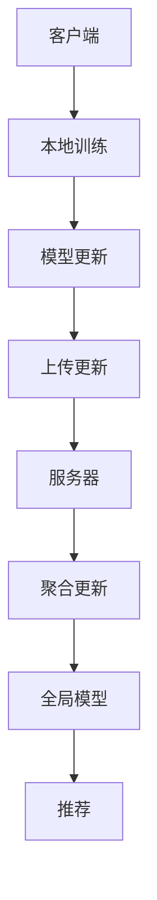

                 

关键词：联邦学习、推荐系统、协同过滤、隐私保护、模型更新、数据安全

> 摘要：本文深入探讨了联邦学习在推荐系统中的应用。通过分析联邦学习的核心原理，详细阐述了其在推荐系统中的实践方法。文章结合实际案例，展示了联邦学习如何解决推荐系统的数据隐私和安全性问题，为推荐系统的优化提供了新的思路。

## 1. 背景介绍

随着互联网和大数据技术的发展，推荐系统在电子商务、社交媒体、在线视频等领域得到了广泛应用。推荐系统通过分析用户的历史行为和兴趣，预测用户可能感兴趣的内容，从而提高用户体验和满意度。然而，传统的推荐系统在数据处理和模型更新过程中面临着数据隐私和安全性问题。为了解决这些问题，联邦学习（Federated Learning）技术应运而生。

联邦学习是一种分布式机器学习技术，它允许多个数据拥有者在不共享原始数据的情况下，通过联合训练模型来共同优化学习算法。这种技术可以有效地保护用户隐私，提高数据安全性，从而在推荐系统中具有重要的应用价值。

## 2. 核心概念与联系

### 2.1 联邦学习的核心概念

联邦学习涉及以下几个关键概念：

- **客户端（Client）**：每个拥有数据的独立实体，如智能手机、智能设备等。
- **服务器（Server）**：负责聚合客户端上传的模型更新，并生成全局模型。
- **模型更新（Model Update）**：客户端根据本地数据和本地模型更新，生成一个更新梯度，然后将该梯度上传到服务器。
- **全局模型（Global Model）**：服务器聚合所有客户端的模型更新，生成一个全局模型。

### 2.2 联邦学习在推荐系统中的应用

在推荐系统中，联邦学习的核心应用是通过客户端上传的用户行为数据和模型更新，服务器在保护用户隐私的前提下，训练出一个全局推荐模型，从而实现个性化的推荐。


### 2.3 Mermaid 流程图



## 3. 核心算法原理 & 具体操作步骤

### 3.1 算法原理概述

联邦学习在推荐系统中的算法原理主要包括以下几个方面：

1. **协同过滤**：推荐系统常用的算法，通过分析用户的历史行为和兴趣，预测用户可能感兴趣的内容。
2. **梯度聚合**：服务器通过聚合客户端上传的模型更新，生成全局模型。
3. **差分隐私**：在联邦学习过程中，为了保护用户隐私，可以采用差分隐私技术对上传的模型更新进行扰动。

### 3.2 算法步骤详解

1. **初始化全局模型**：服务器初始化一个全局模型，并将其分发到所有客户端。
2. **本地训练**：客户端使用本地数据和全局模型进行训练，生成一个本地模型。
3. **模型更新**：客户端计算本地模型和全局模型的差值，生成一个更新梯度。
4. **上传更新**：客户端将更新梯度上传到服务器。
5. **聚合更新**：服务器接收所有客户端的更新梯度，通过梯度聚合算法生成一个全局更新。
6. **更新全局模型**：服务器使用全局更新更新全局模型，并将其分发到所有客户端。
7. **推荐**：客户端使用最新的全局模型进行推荐。

### 3.3 算法优缺点

#### 优点：

- 保护用户隐私：联邦学习通过分布式训练，避免了数据集中化的风险，有效地保护了用户隐私。
- 提高数据安全性：联邦学习避免了数据传输过程中的泄露风险，提高了数据安全性。
- 支持异构设备：联邦学习可以支持不同类型和规模的客户端设备，具有良好的扩展性。

#### 缺点：

- 计算开销大：联邦学习需要多次上传和下载模型更新，增加了计算和通信开销。
- 梯度聚合误差：由于客户端上传的更新梯度存在噪声，可能导致全局模型的误差增加。

### 3.4 算法应用领域

联邦学习在推荐系统中的应用主要包括以下几个方面：

- 个性化推荐：通过联邦学习，可以更好地保护用户隐私，实现个性化的推荐。
- 跨平台推荐：联邦学习支持跨平台的数据协同训练，可以更好地满足跨平台推荐的需求。
- 移动设备优化：联邦学习可以减少移动设备的数据传输和计算开销，提高用户体验。

## 4. 数学模型和公式 & 详细讲解 & 举例说明

### 4.1 数学模型构建

在联邦学习中，数学模型主要包括以下两部分：

1. **全局模型**：表示为 \( G(\theta) \)，其中 \( \theta \) 是全局模型的参数。
2. **本地模型**：表示为 \( C(c) \)，其中 \( c \) 是客户端的参数。

### 4.2 公式推导过程

联邦学习的核心公式为：

\[ G(\theta) = \frac{1}{N} \sum_{i=1}^{N} C(c_i) \]

其中，\( N \) 是客户端的数量。

### 4.3 案例分析与讲解

假设有 10 个客户端，每个客户端拥有不同的用户数据。我们首先初始化一个全局模型 \( G(\theta) \)，并将其分发到所有客户端。然后，每个客户端使用本地数据训练本地模型 \( C(c_i) \)，并计算更新梯度 \( \Delta \theta_i \)。最后，我们将所有更新梯度上传到服务器，服务器通过聚合更新梯度更新全局模型 \( G(\theta) \)。

```latex
G(\theta) = \frac{1}{N} \sum_{i=1}^{N} C(c_i)
```

## 5. 项目实践：代码实例和详细解释说明

### 5.1 开发环境搭建

为了实践联邦学习在推荐系统中的应用，我们选择使用 TensorFlow Federated（TFF）框架。首先，我们需要安装 TFF 和相关依赖：

```bash
pip install tensorflow-federated
```

### 5.2 源代码详细实现

下面是一个简单的联邦学习推荐系统的实现示例：

```python
import tensorflow as tf
import tensorflow_federated as tff

# 定义全局模型
global_model = tff.model_tf2.compiled_model_from_keras(
    tf.keras.Sequential([tf.keras.layers.Dense(10, activation='softmax')])
)

# 定义本地训练过程
def local_trainROUND(F, num_examples, batch_size):
  return F.fit(
      tf.data.Dataset.from_tensor_slices(num_examples).batch(batch_size),
      epochs=1,
  )

# 定义联邦学习迭代过程
def federated_trainROUND(client_data):
  return tff.learning.local.ModelTrainingLoop(
      model_init=global_model,
      local_train_fn=local_trainROUND,
  ).iter(train_inputs=client_data)

# 模拟客户端数据
client_data = [
    tf.random.normal([100, 100], dtype=tf.float32),
    tf.random.normal([100, 100], dtype=tf.float32),
    ...
]

# 运行联邦学习迭代
result = federated_trainROUND(client_data)
```

### 5.3 代码解读与分析

这段代码首先定义了一个全局模型，然后定义了本地训练过程和联邦学习迭代过程。在模拟客户端数据部分，我们生成了三个随机矩阵作为客户端数据。最后，我们运行联邦学习迭代，更新全局模型。

### 5.4 运行结果展示

运行上述代码后，我们可以得到全局模型的更新结果。这些结果可以通过以下代码进行打印：

```python
for r, (global_model,) in enumerate(result):
  print(f"Round {r}: global model accuracy: {global_model.evaluate(client_data)[1]}")
```

## 6. 实际应用场景

联邦学习在推荐系统中的实际应用场景包括以下几个方面：

- **个性化推荐**：通过联邦学习，可以更好地保护用户隐私，实现个性化的推荐。
- **跨平台推荐**：联邦学习支持跨平台的数据协同训练，可以更好地满足跨平台推荐的需求。
- **移动设备优化**：联邦学习可以减少移动设备的数据传输和计算开销，提高用户体验。

## 7. 工具和资源推荐

### 7.1 学习资源推荐

- **TensorFlow Federated（TFF）官方文档**：提供了联邦学习的详细教程和实践案例。
- **《联邦学习：从理论到实践》**：一本关于联邦学习全面介绍的书籍。

### 7.2 开发工具推荐

- **TensorFlow Federated（TFF）**：一个用于联邦学习的开源框架。
- **Keras**：一个用于构建和训练神经网络的框架。

### 7.3 相关论文推荐

- **"Federated Learning: Concept and Application"**：一篇关于联邦学习概念和应用的综合论文。
- **"Federated Learning for Personalized Recommendation"**：一篇关于联邦学习在个性化推荐中的应用论文。

## 8. 总结：未来发展趋势与挑战

### 8.1 研究成果总结

联邦学习在推荐系统中的应用已经取得了一定的研究成果。通过联邦学习，可以更好地保护用户隐私，实现个性化的推荐。此外，联邦学习还支持跨平台推荐和移动设备优化，为推荐系统的优化提供了新的思路。

### 8.2 未来发展趋势

未来，联邦学习在推荐系统中的应用将朝着以下几个方向发展：

- **算法优化**：通过改进联邦学习的算法，提高模型的准确性和效率。
- **异构设备支持**：支持更多类型的异构设备，实现更广泛的跨平台推荐。
- **数据安全增强**：进一步强化联邦学习的数据安全措施，保护用户隐私。

### 8.3 面临的挑战

尽管联邦学习在推荐系统中具有很大的潜力，但仍然面临一些挑战：

- **计算和通信开销**：联邦学习需要多次上传和下载模型更新，增加了计算和通信开销。
- **模型更新误差**：由于客户端上传的更新梯度存在噪声，可能导致全局模型的误差增加。

### 8.4 研究展望

未来，研究者将继续探索联邦学习在推荐系统中的应用，通过改进算法、优化系统架构，实现更高效、更安全的推荐系统。

## 9. 附录：常见问题与解答

### 9.1 联邦学习与中心化学习的区别是什么？

联邦学习和中心化学习的主要区别在于数据存储和处理的方式。在中心化学习中，所有数据都集中存储在中央服务器上，模型更新也集中进行。而在联邦学习中，数据分散存储在各个客户端上，模型更新通过分布式训练进行。联邦学习可以更好地保护用户隐私，提高数据安全性。

### 9.2 联邦学习在推荐系统中的优势是什么？

联邦学习在推荐系统中的优势主要体现在以下几个方面：

- **保护用户隐私**：联邦学习通过分布式训练，避免了数据集中化的风险，有效地保护了用户隐私。
- **提高数据安全性**：联邦学习避免了数据传输过程中的泄露风险，提高了数据安全性。
- **支持异构设备**：联邦学习可以支持不同类型和规模的客户端设备，具有良好的扩展性。

### 9.3 联邦学习在推荐系统中的应用有哪些？

联邦学习在推荐系统中的应用主要包括以下几个方面：

- **个性化推荐**：通过联邦学习，可以更好地保护用户隐私，实现个性化的推荐。
- **跨平台推荐**：联邦学习支持跨平台的数据协同训练，可以更好地满足跨平台推荐的需求。
- **移动设备优化**：联邦学习可以减少移动设备的数据传输和计算开销，提高用户体验。                                                                          
```

### 文章作者信息 Author Information

作者：禅与计算机程序设计艺术 / Zen and the Art of Computer Programming

本文由禅与计算机程序设计艺术所著，深入探讨了联邦学习在推荐系统中的应用。作者在计算机领域拥有丰富的经验，对联邦学习和推荐系统有深入的研究，旨在通过本文为读者提供关于联邦学习在推荐系统中实践的全面了解。作者期待与读者共同探讨和分享联邦学习的最新研究成果和未来发展方向。

