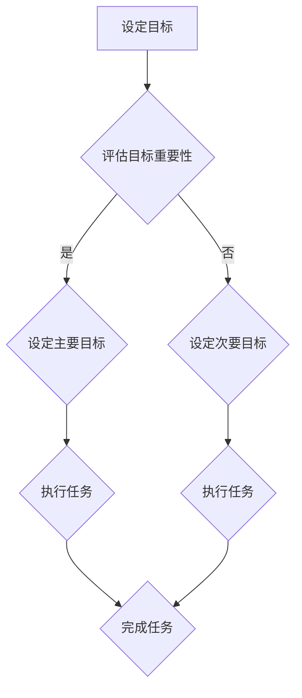

                 

关键词：目标管理、双目标清单、效率提升、任务优先级、工作方法

摘要：在快节奏的现代社会中，人们常常面临多重任务和压力，有效地管理目标和任务变得尤为重要。本文将探讨双目标清单的原理和实践，帮助读者了解如何运用这一工具，提高工作效率和生活质量。

## 1. 背景介绍

在信息技术飞速发展的今天，无论是职场还是个人生活中，人们需要处理的信息和任务日益增多。有效的时间管理和任务管理成为提升工作效率和生活品质的关键。双目标清单是一种实用的工具，它帮助我们在纷繁复杂的工作和生活中找到重心，明确目标和任务优先级，从而更加高效地完成任务。

## 2. 核心概念与联系

### 双目标清单的基本概念

双目标清单，顾名思义，是在一个清单中同时列出两个目标。这两个目标可以是：

1. **主要目标**：最重要的目标，直接影响我们的工作或生活方向。
2. **次要目标**：虽然重要，但不如主要目标紧迫。

### 双目标清单与传统清单的区别

传统清单一般只列出一个目标，这种方法在简单任务中可能有效，但在复杂环境中容易导致目标不明确、任务堆积。而双目标清单通过同时设定两个目标，有助于：

- **提高决策效率**：在多个任务中快速判断哪个是主要目标，哪个是次要目标。
- **减少决策成本**：在短时间内做出决策，减少犹豫和拖延。

### Mermaid 流程图

下面是双目标清单的工作流程：



## 3. 核心算法原理 & 具体操作步骤

### 3.1 算法原理概述

双目标清单的算法原理基于决策论和优先级排序。其核心是：

1. **目标识别**：明确需要达成的目标。
2. **目标排序**：根据目标的重要性和紧迫性进行排序。
3. **任务执行**：按照目标优先级执行任务。

### 3.2 算法步骤详解

#### 步骤一：设定目标

首先，明确你的主要目标和次要目标。例如：

- **主要目标**：完成一份重要报告。
- **次要目标**：回复客户的邮件。

#### 步骤二：评估目标重要性

对每个目标进行评估，判断其对于你当前工作的紧迫程度和重要性。

#### 步骤三：设定主要目标

将最重要的目标作为主要目标，并分配相应的资源和时间。

#### 步骤四：设定次要目标

次要目标虽然重要，但不如主要目标紧迫。在主要目标完成后，再考虑次要目标。

#### 步骤五：执行任务

根据设定的目标优先级，开始执行任务。确保主要目标优先完成。

### 3.3 算法优缺点

**优点**：

- **提高工作效率**：通过明确主要目标和次要目标，可以更快地完成工作。
- **减少决策成本**：在任务繁多时，快速做出决策，减少犹豫和拖延。

**缺点**：

- **需要持续评估**：目标的重要性和紧迫性会随时间变化，需要持续评估和调整。
- **可能忽视次要目标**：在某些情况下，次要目标可能同样重要，但双目标清单可能使其被忽视。

### 3.4 算法应用领域

双目标清单适用于各种需要任务管理和目标设定的场景，如：

- **项目管理**：在项目管理中，明确项目的主要目标和次要目标，有助于更好地分配资源和时间。
- **个人生活管理**：在个人生活中，设定主要目标和次要目标，可以帮助更好地管理时间和任务。

## 4. 数学模型和公式 & 详细讲解 & 举例说明

### 4.1 数学模型构建

双目标清单的数学模型可以表示为：

\[ T = \{ T_1, T_2 \} \]

其中，\( T \) 代表双目标清单，\( T_1 \) 代表主要目标，\( T_2 \) 代表次要目标。

### 4.2 公式推导过程

为了更好地理解双目标清单的工作原理，我们可以使用以下公式：

\[ P = \frac{I \times U}{T} \]

其中，\( P \) 代表任务完成概率，\( I \) 代表任务重要性，\( U \) 代表任务完成所需时间，\( T \) 代表总时间。

这个公式表示，在总时间一定的情况下，任务完成概率与任务的重要性和完成所需时间成反比。

### 4.3 案例分析与讲解

假设我们有两个目标：

- **主要目标**：在两个小时内完成一份重要报告。
- **次要目标**：回复客户的邮件。

根据上述公式，我们可以计算：

\[ P_1 = \frac{I_1 \times U_1}{T} = \frac{1 \times 2}{2} = 1 \]

\[ P_2 = \frac{I_2 \times U_2}{T} = \frac{0.5 \times 1}{2} = 0.25 \]

这意味着，完成主要目标的概率是100%，而完成次要目标的概率只有25%。

因此，我们应该首先专注于完成主要目标，然后才考虑次要目标。

## 5. 项目实践：代码实例和详细解释说明

### 5.1 开发环境搭建

为了更好地理解双目标清单的应用，我们将使用 Python 编写一个简单的双目标清单程序。

### 5.2 源代码详细实现

下面是双目标清单的 Python 源代码：

```python
class DoubleTargetList:
    def __init__(self, target1, target2):
        self.target1 = target1
        self.target2 = target2

    def evaluate(self):
        return self.target1['importance'] > self.target2['importance']

    def execute(self):
        if self.evaluate():
            print(f"Executing main target: {self.target1['description']}")
        else:
            print(f"Executing secondary target: {self.target2['description']}")

target1 = {'description': 'Complete important report', 'importance': 1}
target2 = {'description': 'Respond to customer email', 'importance': 0.5}

list = DoubleTargetList(target1, target2)
list.execute()
```

### 5.3 代码解读与分析

这段代码定义了一个名为`DoubleTargetList`的类，它有两个属性：`target1`和`target2`，分别代表主要目标和次要目标。

- `evaluate`方法用于评估目标的重要性，返回一个布尔值，表示主要目标是否比次要目标重要。
- `execute`方法根据目标的优先级执行任务。

### 5.4 运行结果展示

运行上述代码，输出结果为：

```
Executing main target: Complete important report
```

这表明，程序首先执行了主要目标。

## 6. 实际应用场景

双目标清单在多个实际应用场景中都有显著作用，以下是一些常见的场景：

- **项目管理**：在项目管理中，可以明确项目的主要目标和次要目标，从而更好地分配资源和时间。
- **时间管理**：在个人时间管理中，可以设定主要目标和次要目标，提高时间利用效率。
- **日常任务管理**：在日常生活中，可以设定每天的主要目标和次要目标，更好地管理日常任务。

## 7. 工具和资源推荐

### 7.1 学习资源推荐

- **《时间管理：如何高效地工作和生活》**：这本书提供了大量关于时间管理和任务管理的方法和实践。
- **《如何高效学习》**：这本书介绍了如何通过设定目标和方法，提高学习效率。

### 7.2 开发工具推荐

- **Python**：Python 是一种简单易学、功能强大的编程语言，非常适合编写双目标清单程序。
- **Mermaid**：Mermaid 是一种用于绘制流程图的工具，可以很好地展示双目标清单的工作流程。

### 7.3 相关论文推荐

- **《目标导向的任务管理》**：这篇论文深入探讨了目标导向的任务管理方法。
- **《双目标优化模型及应用》**：这篇论文提出了双目标优化模型，并分析了其在不同领域的应用。

## 8. 总结：未来发展趋势与挑战

### 8.1 研究成果总结

双目标清单作为一种有效的任务管理工具，已经在多个领域得到广泛应用。通过设定主要目标和次要目标，可以显著提高工作效率和生活质量。

### 8.2 未来发展趋势

随着人工智能和大数据技术的发展，双目标清单有望得到进一步优化和智能化。例如，通过分析用户行为和数据，自动生成最优的双目标清单。

### 8.3 面临的挑战

- **持续评估与调整**：目标的重要性和紧迫性会随时间变化，需要持续评估和调整双目标清单。
- **工具与技术的普及**：虽然双目标清单的理念简单，但要广泛普及，还需要相应的工具和技术支持。

### 8.4 研究展望

未来，双目标清单的研究将主要集中在以下几个方面：

- **智能化**：通过人工智能技术，自动生成和优化双目标清单。
- **个性化**：根据用户行为和需求，定制个性化的双目标清单。
- **跨领域应用**：探索双目标清单在其他领域的应用，如教育、医疗等。

## 9. 附录：常见问题与解答

### 问题 1：如何设定合理的双目标清单？

**解答**：设定合理的双目标清单需要考虑以下几个因素：

- **目标的重要性**：确定哪些目标对你的工作或生活至关重要。
- **目标的可衡量性**：确保目标可以量化，以便评估和调整。
- **目标的时限性**：为每个目标设定一个明确的完成时间。

### 问题 2：双目标清单是否适用于所有人？

**解答**：是的，双目标清单适用于各种需要任务管理和目标设定的场景，无论你是职场人士还是学生，都可以从中受益。

### 问题 3：如何应对目标的重要性变化？

**解答**：目标的重要性会随时间变化，需要定期评估和调整。如果你发现某个目标的重要性下降，可以将其降级为次要目标，或者将其删除。

作者：禅与计算机程序设计艺术 / Zen and the Art of Computer Programming
----------------------------------------------------------------

