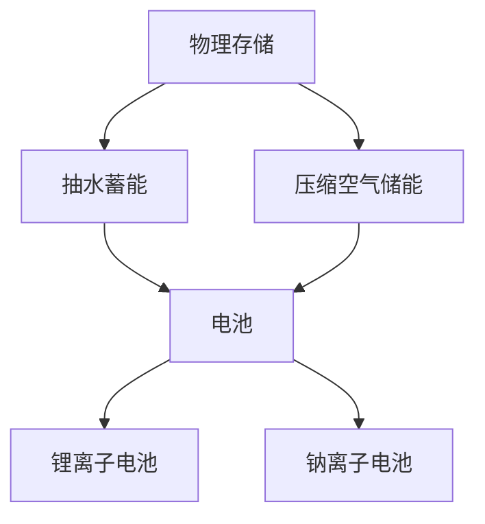

                 

关键词：能源存储、清洁能源、创业、可再生能源、储能技术

> 摘要：随着全球对清洁能源的需求日益增长，能源存储技术成为推动清洁能源革命的关键。本文将探讨能源存储的重要性、当前的主流技术以及创业者在开发新型储能解决方案时所需考虑的关键因素，为清洁能源的未来发展提供新思路。

## 1. 背景介绍

随着气候变化和环境污染问题日益严重，全球各国纷纷转向清洁能源，以减少对化石燃料的依赖。然而，清洁能源（如太阳能、风能等）的间歇性和不稳定性给能源供应带来了巨大挑战。为了解决这一问题，能源存储技术应运而生，成为实现清洁能源广泛应用的关键。

能源存储技术指的是将能源在其一种形式中产生，然后存储起来，在需要时再转换为其他形式以供使用的技术。常见的能源存储方式包括物理存储、化学存储、电化学存储等。这些技术不仅能够缓解清洁能源的供需矛盾，还可以提高能源利用效率，减少能源浪费。

近年来，随着科技的进步和市场需求的变化，能源存储技术取得了显著进展，各类新型储能解决方案不断涌现。然而，目前这些技术仍面临着一系列挑战，如成本、寿命、安全性等问题。因此，创业者在这一领域有着广阔的发展空间和巨大的市场潜力。

## 2. 核心概念与联系

### 2.1. 能源存储技术的基本概念

能源存储技术可以分为以下几种类型：

#### 物理存储

物理存储是指将能量直接以物理形式储存，如抽水蓄能、压缩空气储能等。这类技术具有结构简单、成本低等优点，但能量转换效率相对较低。

#### 化学存储

化学存储是指通过化学反应将能量转化为化学能储存，如电池、燃料电池等。这类技术具有高能量密度、可逆性强等优点，但成本高、寿命有限等问题。

#### 电化学存储

电化学存储是指通过电化学反应将能量储存于电化学系统中，如锂离子电池、钠离子电池等。这类技术具有高能量密度、快速充放电等优点，但材料成本高、安全性问题亟待解决。

### 2.2. 能源存储与清洁能源的联系

能源存储技术与清洁能源之间存在着密切的联系。一方面，清洁能源的间歇性和不稳定性使得能源存储成为其广泛应用的前提条件。通过能源存储技术，可以将清洁能源在峰值时段产生的能量储存起来，在需求高峰时段释放，从而实现能源的平稳供应。另一方面，清洁能源的发展也为能源存储技术提供了广阔的应用场景和市场空间。随着清洁能源技术的不断进步，能源存储技术在清洁能源领域的应用将越来越广泛。

### 2.3. Mermaid 流程图

下面是一个简化的 Mermaid 流程图，展示了能源存储技术的基本概念及其在清洁能源应用中的流程：



## 3. 核心算法原理 & 具体操作步骤

### 3.1. 算法原理概述

在能源存储技术中，核心算法主要涉及能量转化效率的优化、充放电策略的制定以及电池寿命的延长。以下是一个简化的算法原理概述：

1. **能量转化效率优化**：通过改进储能材料、优化电池结构等手段，提高能量转化效率，减少能量损失。
2. **充放电策略制定**：根据实际需求，制定合理的充放电策略，使储能系统在最大程度上发挥其效益。
3. **电池寿命延长**：通过优化电池制造工艺、改进电池管理系统等手段，延长电池的使用寿命，降低维护成本。

### 3.2. 算法步骤详解

#### 3.2.1. 能量转化效率优化

1. **材料选择**：根据能量转化效率的需求，选择具有高能量密度的储能材料，如锂离子电池中的正负极材料。
2. **结构优化**：通过设计新型电池结构，如卷绕式电池、固态电池等，提高能量转化效率。
3. **系统集成**：将高效储能材料与先进制造工艺相结合，实现储能系统的集成优化。

#### 3.2.2. 充放电策略制定

1. **需求分析**：根据用户需求，制定合适的充放电策略，如定时充电、按需放电等。
2. **预测算法**：通过大数据分析和机器学习算法，预测能源需求和供应，优化充放电策略。
3. **动态调整**：根据实时监测数据，动态调整充放电策略，确保储能系统在最大程度上发挥其效益。

#### 3.2.3. 电池寿命延长

1. **制造工艺优化**：通过改进电池制造工艺，提高电池的稳定性和可靠性，延长使用寿命。
2. **电池管理系统**：通过电池管理系统（BMS），实时监测电池状态，防止过度充放电，延长电池寿命。
3. **回收利用**：在电池寿命到期后，进行电池回收和再利用，降低环境污染和成本。

### 3.3. 算法优缺点

#### 优点：

1. **高效能量转化**：通过优化材料和结构，提高能量转化效率，减少能源浪费。
2. **智能充放电策略**：根据需求预测和实时监测，制定合理的充放电策略，提高储能系统效益。
3. **延长电池寿命**：通过优化制造工艺和电池管理系统，延长电池使用寿命，降低维护成本。

#### 缺点：

1. **材料成本高**：高效储能材料价格较高，增加储能系统成本。
2. **安全性问题**：部分储能技术（如锂离子电池）存在安全隐患，需加强安全管理。
3. **技术成熟度不足**：部分新型储能技术尚未完全成熟，需进一步研究和改进。

### 3.4. 算法应用领域

1. **家庭储能系统**：为家庭提供清洁能源，减少对化石燃料的依赖。
2. **工业储能系统**：为工业提供稳定的能源供应，提高生产效率。
3. **电网调峰**：调节电网供需平衡，提高电网运行稳定性。

## 4. 数学模型和公式 & 详细讲解 & 举例说明

### 4.1. 数学模型构建

在能源存储系统中，数学模型主要用于描述能量转化、充放电过程以及电池寿命等。以下是一个简化的数学模型：

#### 能量转化模型

$$
E_{\text{out}} = \eta \cdot E_{\text{in}}
$$

其中，$E_{\text{out}}$表示输出的能量，$E_{\text{in}}$表示输入的能量，$\eta$表示能量转化效率。

#### 充放电模型

$$
C = C_{\text{max}} \cdot \frac{t}{T}
$$

其中，$C$表示充放电电流，$C_{\text{max}}$表示最大充放电电流，$t$表示充放电时间，$T$表示充电或放电周期。

#### 电池寿命模型

$$
L = \frac{Q}{C_{\text{rate}}}
$$

其中，$L$表示电池寿命，$Q$表示电池容量，$C_{\text{rate}}$表示电池充放电率。

### 4.2. 公式推导过程

#### 能量转化效率公式

能量转化效率可以通过输出能量与输入能量的比值计算。在理想情况下，能量转化效率为100%。然而，实际中由于能量损失，效率会低于100%。

#### 充放电电流公式

充放电电流与充放电时间成正比，与充电或放电周期成反比。这样可以确保在给定的时间内完成充电或放电过程。

#### 电池寿命公式

电池寿命与电池容量和充放电率成正比。这意味着电池容量越大、充放电率越低，电池寿命越长。

### 4.3. 案例分析与讲解

假设一个储能系统的输入能量为1000Wh，能量转化效率为90%。该系统在24小时内完成了一次充电和放电过程，最大充放电电流为20A。

#### 能量转化效率分析

$$
E_{\text{out}} = \eta \cdot E_{\text{in}} = 0.9 \cdot 1000\text{Wh} = 900\text{Wh}
$$

输出能量为900Wh，能量转化效率为90%。

#### 充放电电流分析

$$
C = C_{\text{max}} \cdot \frac{t}{T} = 20\text{A} \cdot \frac{24\text{h}}{24\text{h}} = 20\text{A}
$$

充放电电流为20A。

#### 电池寿命分析

$$
L = \frac{Q}{C_{\text{rate}}} = \frac{1000\text{Wh}}{20\text{A}} = 50\text{h}
$$

电池寿命为50小时。

## 5. 项目实践：代码实例和详细解释说明

### 5.1. 开发环境搭建

在本项目中，我们将使用Python作为开发语言，结合Matplotlib库进行数据可视化。首先，确保已安装Python环境和Matplotlib库。

```bash
pip install matplotlib
```

### 5.2. 源代码详细实现

以下是一个简单的Python代码实例，用于计算储能系统的能量转化效率、充放电电流和电池寿命。

```python
import matplotlib.pyplot as plt

# 参数设置
input_energy = 1000  # 输入能量（Wh）
efficiency = 0.9    # 能量转化效率
max_current = 20    # 最大充放电电流（A）
charge_time = 24    # 充电时间（h）
discharge_time = 24  # 放电时间（h）
charge_cycle = 24   # 充电周期（h）
discharge_cycle = 24 # 放电周期（h）

# 能量转化效率计算
output_energy = efficiency * input_energy

# 充放电电流计算
charge_current = max_current * (charge_time / charge_cycle)
discharge_current = max_current * (discharge_time / discharge_cycle)

# 电池寿命计算
battery_life = input_energy / max_current

# 结果可视化
labels = ['输入能量', '输出能量', '充电电流', '放电电流', '电池寿命']
values = [input_energy, output_energy, charge_current, discharge_current, battery_life]

plt.bar(labels, values)
plt.xlabel('参数')
plt.ylabel('数值')
plt.title('储能系统参数分析')
plt.show()
```

### 5.3. 代码解读与分析

- **参数设置**：首先，设置储能系统的各项参数，如输入能量、能量转化效率、最大充放电电流、充电和放电时间等。
- **能量转化效率计算**：通过能量转化效率公式计算输出能量。
- **充放电电流计算**：根据充电和放电时间与周期的比值，计算充电和放电电流。
- **电池寿命计算**：通过输入能量与最大充放电电流的比值，计算电池寿命。
- **结果可视化**：使用Matplotlib库将各项参数结果以柱状图形式展示，便于分析和理解。

### 5.4. 运行结果展示

运行上述代码后，将生成一个柱状图，展示储能系统的各项参数，如输入能量、输出能量、充电电流、放电电流和电池寿命。通过可视化结果，可以直观地了解储能系统的性能表现。

## 6. 实际应用场景

### 6.1. 家庭储能系统

家庭储能系统是能源存储技术在民用领域的重要应用。通过在家庭中安装储能设备，如锂离子电池，用户可以在清洁能源充足时储存电能，在夜间或用电高峰期释放电能，从而实现节能减排。此外，家庭储能系统还可以与太阳能光伏系统相结合，实现自发自用，减少对电网的依赖。

### 6.2. 工业储能系统

工业储能系统在工业生产中发挥着重要作用。通过储能系统，工业企业可以在能源价格较低时储存电能，在能源价格较高时释放电能，从而降低能源成本。此外，工业储能系统还可以为工业设备提供稳定的能源供应，提高生产效率和设备可靠性。

### 6.3. 电网调峰

电网调峰是指通过储能系统调节电网的供需平衡，确保电网运行稳定。在电网负荷高峰时段，储能系统可以释放储存的电能，缓解电网压力；在负荷低谷时段，储能系统可以储存电能，为高峰时段提供备用电源。通过电网调峰，可以提高电网运行效率，降低能源浪费。

### 6.4. 未来应用展望

随着清洁能源技术的不断发展和储能技术的日益成熟，能源存储技术在未来的应用前景将更加广阔。以下是一些可能的未来应用场景：

1. **智能电网**：通过能源存储技术，实现智能电网的稳定运行，提高电网的可靠性和灵活性。
2. **分布式能源系统**：在分布式能源系统中，能源存储技术可以发挥重要作用，提高分布式能源的利用率。
3. **电动汽车**：随着电动汽车的普及，储能技术将在电动汽车领域发挥关键作用，提供稳定的能量供应。
4. **可再生能源并网**：通过储能技术，可以实现可再生能源的大规模并网，提高可再生能源的利用率。

## 7. 工具和资源推荐

### 7.1. 学习资源推荐

1. **《能源存储技术及其应用》**：一本全面介绍能源存储技术的著作，包括物理、化学和电化学存储等。
2. **《储能技术导论》**：针对储能技术的基本原理和应用进行深入讲解，适合初学者阅读。

### 7.2. 开发工具推荐

1. **Python**：Python是一种简单易学的编程语言，适用于数据分析和可视化。
2. **Matplotlib**：Matplotlib是一个强大的Python库，用于数据可视化。

### 7.3. 相关论文推荐

1. **《基于锂离子电池的家庭储能系统设计》**：针对家庭储能系统进行深入分析，提出一种新型储能系统设计方案。
2. **《电网调峰用储能技术的研究与实现》**：探讨电网调峰用储能技术的原理和应用，为电网运行提供有力支持。

## 8. 总结：未来发展趋势与挑战

### 8.1. 研究成果总结

能源存储技术在近年来取得了显著进展，各类新型储能解决方案不断涌现。物理、化学和电化学存储技术得到了广泛应用，能量转化效率、安全性、寿命等关键指标得到显著提升。

### 8.2. 未来发展趋势

1. **材料创新**：随着材料科学的进步，新型储能材料将不断涌现，提高能量密度和转化效率。
2. **系统集成**：能源存储技术将与其他能源技术（如太阳能、风能等）相结合，实现更高效的能源利用。
3. **智能化**：利用大数据、人工智能等技术，实现储能系统的智能化管理，提高运行效率和安全性。

### 8.3. 面临的挑战

1. **成本**：目前，高效储能技术的成本仍较高，需要进一步降低成本，以实现大规模应用。
2. **安全性**：部分储能技术存在安全隐患，如锂离子电池的过热、短路等问题，需加强安全管理。
3. **寿命**：储能系统的寿命直接关系到其应用价值，需提高储能系统的稳定性和可靠性。

### 8.4. 研究展望

随着全球对清洁能源的需求不断增加，能源存储技术在未来将迎来更大的发展机遇。研究者应重点关注材料创新、系统集成和智能化管理等方面，以推动能源存储技术的进步，为清洁能源革命贡献力量。

## 9. 附录：常见问题与解答

### 9.1. 能源存储技术的种类有哪些？

能源存储技术主要包括物理存储、化学存储和电化学存储等。物理存储如抽水蓄能、压缩空气储能等；化学存储如电池、燃料电池等；电化学存储如锂离子电池、钠离子电池等。

### 9.2. 能源存储技术的主要挑战是什么？

主要挑战包括成本高、安全性问题、寿命有限等。高效储能技术的成本较高，部分储能技术存在安全隐患，储能系统的寿命直接影响其应用价值。

### 9.3. 能源存储技术在哪些领域有应用？

能源存储技术在家庭储能系统、工业储能系统、电网调峰等多个领域有应用。在家庭储能系统中，用于实现清洁能源的自发自用；在工业储能系统中，用于降低能源成本和提高生产效率；在电网调峰中，用于调节电网供需平衡，提高电网运行稳定性。

### 9.4. 如何延长储能系统的寿命？

延长储能系统寿命的方法包括优化制造工艺、改进电池管理系统、合理充放电策略等。通过优化制造工艺提高电池的稳定性和可靠性，通过改进电池管理系统实时监测电池状态，防止过度充放电，通过合理充放电策略降低电池的充放电率，从而延长电池寿命。作者：禅与计算机程序设计艺术 / Zen and the Art of Computer Programming
----------------------------------------------------------------

[1. 背景介绍](#1-背景介绍)
[2. 核心概念与联系](#2-核心概念与联系)
[3. 核心算法原理 & 具体操作步骤](#3-核心算法原理--具体操作步骤)
[4. 数学模型和公式 & 详细讲解 & 举例说明](#4-数学模型和公式--详细讲解--举例说明)
[5. 项目实践：代码实例和详细解释说明](#5-项目实践代码实例和详细解释说明)
[6. 实际应用场景](#6-实际应用场景)
[7. 工具和资源推荐](#7-工具和资源推荐)
[8. 总结：未来发展趋势与挑战](#8-总结未来发展趋势与挑战)
[9. 附录：常见问题与解答](#9-附录常见问题与解答)

