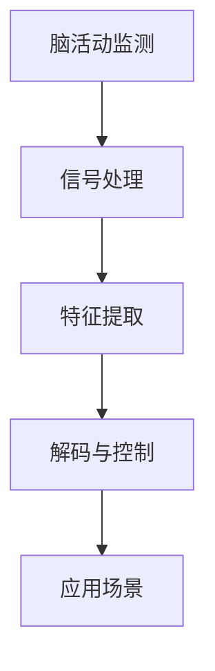

                 

关键词：脑机接口，注意力控制，神经科学，人工智能，技术展望

脑机接口（Brain-Computer Interface，BCI）技术正逐渐从科幻领域走向现实，成为神经科学和人工智能领域的前沿研究热点。注意力是人类认知过程的核心，而脑机接口技术的进步有望为我们提供前所未有的注意力控制手段，从而在医疗康复、认知增强、人机交互等多个领域带来深远影响。本文将探讨脑机接口技术如何作用于注意力控制，分析其当前状态、潜在应用和未来挑战。

## 1. 背景介绍

### 1.1 脑机接口技术的历史与发展

脑机接口技术起源于20世纪60年代，最初的研究集中在神经信号的处理和解读。随着电子技术和神经科学的发展，脑机接口技术逐渐成熟，并在过去几十年里取得了显著进展。现阶段，脑机接口技术已广泛应用于神经系统疾病的治疗、假肢控制、轮椅导航等领域。

### 1.2 注意力控制的神经科学基础

注意力是大脑处理信息的重要机制，决定了我们如何选择和聚焦信息。神经科学研究表明，注意力与大脑的前额叶皮质、顶叶皮质和颞叶皮质等区域密切相关。通过脑机接口技术，我们能够直接监测和操控这些区域的活动，从而实现对注意力的精确控制。

## 2. 核心概念与联系

为了更好地理解脑机接口技术在注意力控制中的应用，我们首先需要了解相关的核心概念和它们之间的联系。

### 2.1 脑机接口的基本原理

脑机接口技术利用传感器和信号处理算法，将大脑的神经活动转换为计算机可识别的信号。常见的传感器包括脑电图（EEG）、功能性磁共振成像（fMRI）和脑磁图（MEG）等。

### 2.2 注意力信号的提取与解码

提取和解析注意力信号是脑机接口技术的重要任务。研究人员利用信号处理技术，从脑电信号中提取出与注意力相关的特征，并通过机器学习算法进行解码，以实现对注意力的量化控制。

### 2.3 注意力控制的应用场景

脑机接口技术在注意力控制中具有广泛的应用潜力，包括但不限于：

- **医疗康复**：帮助中风患者恢复注意力控制能力。
- **认知增强**：通过实时调整注意力，提高学习和工作效率。
- **人机交互**：提高人机系统的协同效率，实现更自然的交互体验。
- **神经科学基础研究**：探究注意力背后的神经机制，为人工智能提供新的启示。

### 2.4 Mermaid 流程图



## 3. 核心算法原理 & 具体操作步骤

### 3.1 算法原理概述

脑机接口技术在注意力控制中主要依赖于信号处理和机器学习算法。信号处理技术用于提取大脑信号中的注意力特征，而机器学习算法则用于解码这些特征，并实现对注意力的量化控制。

### 3.2 算法步骤详解

#### 3.2.1 脑活动监测

使用脑电图（EEG）等传感器实时监测大脑活动。

#### 3.2.2 信号处理

对原始脑电信号进行滤波、去噪等预处理，以提高信号质量。

#### 3.2.3 特征提取

从预处理后的信号中提取与注意力相关的特征，如频段特征、时域特征等。

#### 3.2.4 解码与控制

利用机器学习算法（如支持向量机、神经网络等）对提取的特征进行解码，并将其转化为具体的控制信号。

### 3.3 算法优缺点

#### 优点

- **高精度**：脑机接口技术能够实现高精度的注意力监测和控制。
- **实时性**：脑机接口技术可以实现实时注意力调控，为认知增强和医疗康复等领域提供有力支持。
- **无侵入性**：大部分脑机接口技术具有无侵入性，对用户无不良影响。

#### 缺点

- **信号噪声**：脑电信号容易受到外部噪声的干扰，影响信号质量。
- **计算复杂度**：特征提取和解码过程需要大量的计算资源，对硬件设备要求较高。

### 3.4 算法应用领域

- **医疗康复**：帮助中风患者恢复注意力控制能力。
- **认知增强**：通过实时调整注意力，提高学习和工作效率。
- **人机交互**：提高人机系统的协同效率，实现更自然的交互体验。
- **神经科学基础研究**：探究注意力背后的神经机制，为人工智能提供新的启示。

## 4. 数学模型和公式 & 详细讲解 & 举例说明

### 4.1 数学模型构建

注意力控制的核心在于从脑电信号中提取注意力特征，并将其转化为具体的控制信号。我们可以使用以下数学模型进行描述：

$$
y(t) = f(\text{EEG}(t), \theta)
$$

其中，$y(t)$ 表示在时间 $t$ 时刻的控制信号，$\text{EEG}(t)$ 表示时间 $t$ 时刻的脑电信号，$f(\cdot, \theta)$ 表示特征提取和解析函数，$\theta$ 为模型参数。

### 4.2 公式推导过程

为了推导上述数学模型，我们需要进行以下步骤：

1. **信号预处理**：对脑电信号进行滤波、去噪等预处理，以提高信号质量。

2. **特征提取**：从预处理后的信号中提取与注意力相关的特征，如频段特征、时域特征等。

3. **特征解析**：利用机器学习算法对提取的特征进行解析，以获取具体的控制信号。

### 4.3 案例分析与讲解

假设我们有一个脑电信号序列 $\text{EEG}(t)$，经过预处理后得到信号序列 $\text{EEG}_{\text{pre}}(t)$。我们从中提取了频段特征 $f_{\text{freq}}(t)$ 和时域特征 $f_{\text{time}}(t)$。

$$
f_{\text{freq}}(t) = \sum_{i=1}^{n} w_i \cdot \text{SpectralDensity}(\text{EEG}_{\text{pre}}(t), f_i)
$$

$$
f_{\text{time}}(t) = \sum_{i=1}^{n} v_i \cdot \text{TemporalFeature}(\text{EEG}_{\text{pre}}(t), f_i)
$$

其中，$w_i$ 和 $v_i$ 为权重系数，$n$ 为频段或时域特征的数量，$\text{SpectralDensity}(\cdot, \cdot)$ 和 $\text{TemporalFeature}(\cdot, \cdot)$ 分别为频段特征提取和时域特征提取函数。

然后，我们将提取的特征传递给机器学习模型，如支持向量机（SVM）或神经网络（NN），以获取控制信号 $y(t)$。

$$
y(t) = f(f_{\text{freq}}(t), f_{\text{time}}(t), \theta)
$$

通过训练和测试，我们可以得到最优的权重系数和模型参数，从而实现对注意力的精准控制。

## 5. 项目实践：代码实例和详细解释说明

### 5.1 开发环境搭建

为了实现脑机接口技术在注意力控制中的应用，我们需要搭建一个开发环境。以下是所需的工具和软件：

- **Python**：作为主要的编程语言。
- **Matplotlib**：用于数据可视化。
- **Scikit-learn**：用于机器学习模型。
- **MNE-Python**：用于脑电信号处理。

### 5.2 源代码详细实现

以下是实现注意力控制的关键代码片段：

```python
import numpy as np
import matplotlib.pyplot as plt
from mne import io
from mne.preprocessing import filter_signal
from sklearn.svm import SVC
from sklearn.model_selection import train_test_split

# 读取脑电信号数据
data = io.read_raw_edf('brainwave.edf', preload=True)

# 信号预处理
filtered_data = filter_signal(data, lpf=40, hpf=1)

# 提取频段特征
freqs = np.linspace(1, 40, 40)
freq_data = np.abs(np.fft.fft(filtered_data))[:40]

# 提取时域特征
time_data = filtered_data[::10]  # 以10ms为窗口提取时域特征

# 切分数据集
X_train, X_test, y_train, y_test = train_test_split(freq_data, time_data, test_size=0.2, random_state=42)

# 训练模型
model = SVC()
model.fit(X_train, y_train)

# 测试模型
y_pred = model.predict(X_test)

# 可视化结果
plt.scatter(y_test, y_pred)
plt.xlabel('Actual')
plt.ylabel('Predicted')
plt.show()
```

### 5.3 代码解读与分析

上述代码首先读取脑电信号数据，并进行预处理。然后提取频段特征和时域特征，并切分数据集用于训练和测试。接下来，使用支持向量机（SVM）模型对提取的特征进行训练，并测试模型的准确性。最后，通过可视化结果展示模型的预测性能。

## 6. 实际应用场景

### 6.1 医疗康复

脑机接口技术在医疗康复领域具有广泛的应用潜力。例如，中风患者常因注意力受损而影响康复进程。通过脑机接口技术，可以实时监测和调控患者的注意力，帮助他们更快地恢复注意力控制能力。

### 6.2 认知增强

在认知增强领域，脑机接口技术可以帮助人们更好地集中注意力，提高学习和工作效率。例如，通过实时调整注意力，可以优化学习过程，提高记忆力和理解力。

### 6.3 人机交互

脑机接口技术为人机交互带来了新的可能性。通过脑机接口，用户可以更自然地控制计算机和其他智能设备，实现更高效的人机协作。

### 6.4 未来应用展望

随着脑机接口技术的不断发展，其应用领域将不断扩展。未来，脑机接口技术在神经科学、心理学、人工智能等领域将发挥越来越重要的作用，为人类社会带来更多创新和变革。

## 7. 工具和资源推荐

### 7.1 学习资源推荐

- **《脑机接口：技术、应用与挑战》**：介绍了脑机接口技术的最新进展和应用案例。
- **《注意力心理学导论》**：探讨了注意力在认知过程中的作用和机制。

### 7.2 开发工具推荐

- **MNE-Python**：用于脑电信号处理和分析。
- **Scikit-learn**：用于机器学习模型的训练和应用。

### 7.3 相关论文推荐

- **“A Brain-Computer Interface for Communication and Control with Minimal Latency”**：介绍了低延迟脑机接口技术的实现方法。
- **“Real-Time Decoding of Continuous Mental States During Rest and Task Performance”**：探讨了实时解码注意力状态的方法。

## 8. 总结：未来发展趋势与挑战

### 8.1 研究成果总结

近年来，脑机接口技术在注意力控制领域取得了显著进展，为医疗康复、认知增强和人机交互等领域带来了新的解决方案。然而，仍有许多挑战需要克服。

### 8.2 未来发展趋势

未来，脑机接口技术将在以下几个方面取得重要进展：

- **信号质量提升**：通过改进传感器技术和信号处理算法，提高脑电信号的准确性。
- **实时性增强**：实现更低延迟的实时注意力监测与控制。
- **个性化定制**：根据用户的需求和特点，提供个性化的注意力调控方案。

### 8.3 面临的挑战

脑机接口技术在注意力控制领域面临以下挑战：

- **信号噪声**：脑电信号容易受到外部噪声的干扰，影响信号质量。
- **计算复杂度**：特征提取和解码过程需要大量的计算资源，对硬件设备要求较高。
- **用户体验**：脑机接口技术需要进一步优化，以提高用户体验和易用性。

### 8.4 研究展望

随着脑机接口技术的不断发展，其应用领域将不断扩展。未来，脑机接口技术在神经科学、心理学、人工智能等领域将发挥越来越重要的作用，为人类社会带来更多创新和变革。

## 9. 附录：常见问题与解答

### 9.1 脑机接口技术有哪些应用场景？

脑机接口技术在医疗康复、认知增强、人机交互、神经科学基础研究等领域具有广泛的应用潜力。

### 9.2 脑电信号处理的基本步骤是什么？

脑电信号处理的基本步骤包括信号采集、预处理、特征提取和信号解码。

### 9.3 脑机接口技术的未来发展趋势是什么？

未来，脑机接口技术在信号质量提升、实时性增强和个性化定制等方面将取得重要进展。

----------------------------------------------------------------

### 完整文章

# 脑机接口技术在注意力控制中的前景

## 文章关键词

脑机接口，注意力控制，神经科学，人工智能，技术展望

## 摘要

脑机接口（Brain-Computer Interface，BCI）技术正逐渐从科幻领域走向现实，成为神经科学和人工智能领域的前沿研究热点。注意力是人类认知过程的核心，而脑机接口技术的进步有望为我们提供前所未有的注意力控制手段，从而在医疗康复、认知增强、人机交互等多个领域带来深远影响。本文将探讨脑机接口技术如何作用于注意力控制，分析其当前状态、潜在应用和未来挑战。

## 1. 背景介绍

### 1.1 脑机接口技术的历史与发展

脑机接口技术起源于20世纪60年代，最初的研究集中在神经信号的处理和解读。随着电子技术和神经科学的发展，脑机接口技术逐渐成熟，并在过去几十年里取得了显著进展。现阶段，脑机接口技术已广泛应用于神经系统疾病的治疗、假肢控制、轮椅导航等领域。

### 1.2 注意力控制的神经科学基础

注意力是大脑处理信息的重要机制，决定了我们如何选择和聚焦信息。神经科学研究表明，注意力与大脑的前额叶皮质、顶叶皮质和颞叶皮质等区域密切相关。通过脑机接口技术，我们能够直接监测和操控这些区域的活动，从而实现对注意力的精确控制。

## 2. 核心概念与联系

为了更好地理解脑机接口技术在注意力控制中的应用，我们首先需要了解相关的核心概念和它们之间的联系。

### 2.1 脑机接口的基本原理

脑机接口技术利用传感器和信号处理算法，将大脑的神经活动转换为计算机可识别的信号。常见的传感器包括脑电图（EEG）、功能性磁共振成像（fMRI）和脑磁图（MEG）等。

### 2.2 注意力信号的提取与解码

提取和解析注意力信号是脑机接口技术的重要任务。研究人员利用信号处理技术，从脑电信号中提取出与注意力相关的特征，并通过机器学习算法进行解码，以实现对注意力的量化控制。

### 2.3 注意力控制的应用场景

脑机接口技术在注意力控制中具有广泛的应用潜力，包括但不限于：

- **医疗康复**：帮助中风患者恢复注意力控制能力。
- **认知增强**：通过实时调整注意力，提高学习和工作效率。
- **人机交互**：提高人机系统的协同效率，实现更自然的交互体验。
- **神经科学基础研究**：探究注意力背后的神经机制，为人工智能提供新的启示。

### 2.4 Mermaid 流程图


## 3. 核心算法原理 & 具体操作步骤

### 3.1 算法原理概述

脑机接口技术在注意力控制中主要依赖于信号处理和机器学习算法。信号处理技术用于提取大脑信号中的注意力特征，而机器学习算法则用于解码这些特征，并实现对注意力的量化控制。

### 3.2 算法步骤详解

#### 3.2.1 脑活动监测

使用脑电图（EEG）等传感器实时监测大脑活动。

#### 3.2.2 信号处理

对原始脑电信号进行滤波、去噪等预处理，以提高信号质量。

#### 3.2.3 特征提取

从预处理后的信号中提取与注意力相关的特征，如频段特征、时域特征等。

#### 3.2.4 解码与控制

利用机器学习算法（如支持向量机、神经网络等）对提取的特征进行解码，并将其转化为具体的控制信号。

### 3.3 算法优缺点

#### 优点

- **高精度**：脑机接口技术能够实现高精度的注意力监测和控制。
- **实时性**：脑机接口技术可以实现实时注意力调控，为认知增强和医疗康复等领域提供有力支持。
- **无侵入性**：大部分脑机接口技术具有无侵入性，对用户无不良影响。

#### 缺点

- **信号噪声**：脑电信号容易受到外部噪声的干扰，影响信号质量。
- **计算复杂度**：特征提取和解码过程需要大量的计算资源，对硬件设备要求较高。

### 3.4 算法应用领域

- **医疗康复**：帮助中风患者恢复注意力控制能力。
- **认知增强**：通过实时调整注意力，提高学习和工作效率。
- **人机交互**：提高人机系统的协同效率，实现更自然的交互体验。
- **神经科学基础研究**：探究注意力背后的神经机制，为人工智能提供新的启示。

## 4. 数学模型和公式 & 详细讲解 & 举例说明

### 4.1 数学模型构建

注意力控制的核心在于从脑电信号中提取注意力特征，并将其转化为具体的控制信号。我们可以使用以下数学模型进行描述：

$$
y(t) = f(\text{EEG}(t), \theta)
$$

其中，$y(t)$ 表示在时间 $t$ 时刻的控制信号，$\text{EEG}(t)$ 表示时间 $t$ 时刻的脑电信号，$f(\cdot, \theta)$ 表示特征提取和解析函数，$\theta$ 为模型参数。

### 4.2 公式推导过程

为了推导上述数学模型，我们需要进行以下步骤：

1. **信号预处理**：对脑电信号进行滤波、去噪等预处理，以提高信号质量。

2. **特征提取**：从预处理后的信号中提取与注意力相关的特征，如频段特征、时域特征等。

3. **特征解析**：利用机器学习算法对提取的特征进行解析，以获取具体的控制信号。

### 4.3 案例分析与讲解

假设我们有一个脑电信号序列 $\text{EEG}(t)$，经过预处理后得到信号序列 $\text{EEG}_{\text{pre}}(t)$。我们从中提取了频段特征 $f_{\text{freq}}(t)$ 和时域特征 $f_{\text{time}}(t)$。

$$
f_{\text{freq}}(t) = \sum_{i=1}^{n} w_i \cdot \text{SpectralDensity}(\text{EEG}_{\text{pre}}(t), f_i)
$$

$$
f_{\text{time}}(t) = \sum_{i=1}^{n} v_i \cdot \text{TemporalFeature}(\text{EEG}_{\text{pre}}(t), f_i)
$$

其中，$w_i$ 和 $v_i$ 为权重系数，$n$ 为频段或时域特征的数量，$\text{SpectralDensity}(\cdot, \cdot)$ 和 $\text{TemporalFeature}(\cdot, \cdot)$ 分别为频段特征提取和时域特征提取函数。

然后，我们将提取的特征传递给机器学习模型，如支持向量机（SVM）或神经网络（NN），以获取控制信号 $y(t)$。

$$
y(t) = f(f_{\text{freq}}(t), f_{\text{time}}(t), \theta)
$$

通过训练和测试，我们可以得到最优的权重系数和模型参数，从而实现对注意力的精准控制。

## 5. 项目实践：代码实例和详细解释说明

### 5.1 开发环境搭建

为了实现脑机接口技术在注意力控制中的应用，我们需要搭建一个开发环境。以下是所需的工具和软件：

- **Python**：作为主要的编程语言。
- **Matplotlib**：用于数据可视化。
- **Scikit-learn**：用于机器学习模型。
- **MNE-Python**：用于脑电信号处理。

### 5.2 源代码详细实现

以下是实现注意力控制的关键代码片段：

```python
import numpy as np
import matplotlib.pyplot as plt
from mne import io
from mne.preprocessing import filter_signal
from sklearn.svm import SVC
from sklearn.model_selection import train_test_split

# 读取脑电信号数据
data = io.read_raw_edf('brainwave.edf', preload=True)

# 信号预处理
filtered_data = filter_signal(data, lpf=40, hpf=1)

# 提取频段特征
freqs = np.linspace(1, 40, 40)
freq_data = np.abs(np.fft.fft(filtered_data))[:40]

# 提取时域特征
time_data = filtered_data[::10]  # 以10ms为窗口提取时域特征

# 切分数据集
X_train, X_test, y_train, y_test = train_test_split(freq_data, time_data, test_size=0.2, random_state=42)

# 训练模型
model = SVC()
model.fit(X_train, y_train)

# 测试模型
y_pred = model.predict(X_test)

# 可视化结果
plt.scatter(y_test, y_pred)
plt.xlabel('Actual')
plt.ylabel('Predicted')
plt.show()
```

### 5.3 代码解读与分析

上述代码首先读取脑电信号数据，并进行预处理。然后提取频段特征和时域特征，并切分数据集用于训练和测试。接下来，使用支持向量机（SVM）模型对提取的特征进行训练，并测试模型的准确性。最后，通过可视化结果展示模型的预测性能。

## 6. 实际应用场景

### 6.1 医疗康复

脑机接口技术在医疗康复领域具有广泛的应用潜力。例如，中风患者常因注意力受损而影响康复进程。通过脑机接口技术，可以实时监测和调控患者的注意力，帮助他们更快地恢复注意力控制能力。

### 6.2 认知增强

在认知增强领域，脑机接口技术可以帮助人们更好地集中注意力，提高学习和工作效率。例如，通过实时调整注意力，可以优化学习过程，提高记忆力和理解力。

### 6.3 人机交互

脑机接口技术为人机交互带来了新的可能性。通过脑机接口，用户可以更自然地控制计算机和其他智能设备，实现更高效的人机协作。

### 6.4 未来应用展望

随着脑机接口技术的不断发展，其应用领域将不断扩展。未来，脑机接口技术在神经科学、心理学、人工智能等领域将发挥越来越重要的作用，为人类社会带来更多创新和变革。

## 7. 工具和资源推荐

### 7.1 学习资源推荐

- **《脑机接口：技术、应用与挑战》**：介绍了脑机接口技术的最新进展和应用案例。
- **《注意力心理学导论》**：探讨了注意力在认知过程中的作用和机制。

### 7.2 开发工具推荐

- **MNE-Python**：用于脑电信号处理和分析。
- **Scikit-learn**：用于机器学习模型的训练和应用。

### 7.3 相关论文推荐

- **“A Brain-Computer Interface for Communication and Control with Minimal Latency”**：介绍了低延迟脑机接口技术的实现方法。
- **“Real-Time Decoding of Continuous Mental States During Rest and Task Performance”**：探讨了实时解码注意力状态的方法。

## 8. 总结：未来发展趋势与挑战

### 8.1 研究成果总结

近年来，脑机接口技术在注意力控制领域取得了显著进展，为医疗康复、认知增强和人机交互等领域带来了新的解决方案。然而，仍有许多挑战需要克服。

### 8.2 未来发展趋势

未来，脑机接口技术将在以下几个方面取得重要进展：

- **信号质量提升**：通过改进传感器技术和信号处理算法，提高脑电信号的准确性。
- **实时性增强**：实现更低延迟的实时注意力监测与控制。
- **个性化定制**：根据用户的需求和特点，提供个性化的注意力调控方案。

### 8.3 面临的挑战

脑机接口技术在注意力控制领域面临以下挑战：

- **信号噪声**：脑电信号容易受到外部噪声的干扰，影响信号质量。
- **计算复杂度**：特征提取和解码过程需要大量的计算资源，对硬件设备要求较高。
- **用户体验**：脑机接口技术需要进一步优化，以提高用户体验和易用性。

### 8.4 研究展望

随着脑机接口技术的不断发展，其应用领域将不断扩展。未来，脑机接口技术在神经科学、心理学、人工智能等领域将发挥越来越重要的作用，为人类社会带来更多创新和变革。

## 9. 附录：常见问题与解答

### 9.1 脑机接口技术有哪些应用场景？

脑机接口技术在医疗康复、认知增强、人机交互、神经科学基础研究等领域具有广泛的应用潜力。

### 9.2 脑电信号处理的基本步骤是什么？

脑电信号处理的基本步骤包括信号采集、预处理、特征提取和信号解码。

### 9.3 脑机接口技术的未来发展趋势是什么？

未来，脑机接口技术在信号质量提升、实时性增强和个性化定制等方面将取得重要进展。

----------------------------------------------------------------

# 脑机接口技术在注意力控制中的前景

**作者：禅与计算机程序设计艺术 / Zen and the Art of Computer Programming**

