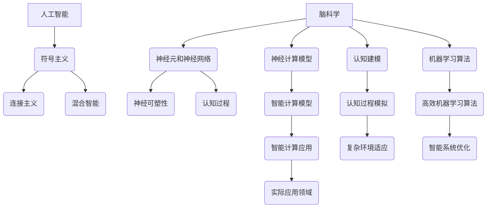

                 

关键词：脑科学、人工智能、神经计算、认知建模、机器学习、神经可塑性、智能计算模型、认知计算、大脑功能模拟、智能算法

摘要：本文深入探讨了脑科学与人工智能的交叉研究，旨在揭示智能的本质及其在计算模型中的应用。通过对大脑神经机制的解析，结合人工智能的发展，本文提出了基于脑科学的智能计算模型，并分析了其原理、优缺点及未来应用前景。本文还详细介绍了数学模型和算法的具体实现，以及实际应用案例和展望。通过这些研究，我们期待能够为人工智能领域的发展提供新的思路和方向。

## 1. 背景介绍

随着科技的飞速发展，人工智能（AI）已经成为现代社会的重要驱动力。然而，尽管人工智能在图像识别、自然语言处理、决策支持等方面取得了显著的成果，但智能的本质仍然是一个亟待解决的难题。传统的人工智能方法主要基于数学模型和算法，尽管在特定领域内取得了成功，但其在复杂、动态和不确定的环境中的表现仍然有限。

另一方面，脑科学作为一门研究大脑结构和功能的科学，已经取得了大量关于神经机制和认知过程的重要发现。这些发现为理解智能的本质提供了重要的启示。脑科学与人工智能的交叉研究，旨在将大脑的神经机制应用于智能计算模型中，以实现更高效、更灵活、更智能的人工智能系统。

本文将从以下几个方面展开探讨：首先，介绍脑科学和人工智能的基本概念及其发展历程；其次，分析脑科学与人工智能的交叉研究对于理解智能本质的重要性；接着，阐述基于脑科学的智能计算模型及其核心算法原理；然后，讨论数学模型和公式在智能计算中的应用；最后，通过实际应用案例和未来展望，探讨脑科学与人工智能交叉研究的实际应用和前景。

## 2. 核心概念与联系

### 2.1 脑科学的基本概念

脑科学是研究大脑的结构、功能和机制的科学，其目的是揭示大脑如何处理信息、如何产生意识、如何进行学习、记忆和思考。脑科学涉及多个学科，包括神经生物学、神经心理学、神经物理学、认知科学等。

脑科学的发展可以追溯到19世纪，当时科学家们开始研究神经元的结构和功能。随着20世纪末神经科学和认知科学的兴起，脑科学得到了快速发展。现代脑科学研究主要集中在以下几个方面：

- **神经元和神经网络**：研究神经元的基本结构和功能，以及神经元如何通过神经网络进行信息传递和处理。
- **神经可塑性**：研究大脑如何通过改变神经元之间的连接和活动来适应环境和学习新信息。
- **认知过程**：研究大脑如何进行感知、记忆、思考、决策等认知过程。

### 2.2 人工智能的基本概念

人工智能（AI）是一门研究、开发和应用使计算机模拟、延伸和扩展人类智能的理论、方法和技术。人工智能的目标是使计算机具有类似于人类的感知、思考、学习、决策和解决问题的能力。

人工智能的发展可以分为三个阶段：

- **符号主义**：基于符号逻辑和规则系统的早期人工智能，以逻辑推理和符号操作为主要特征。
- **连接主义**：基于神经网络和机器学习的方法，通过大量数据训练模型，使其具有类似生物神经系统的学习和自适应能力。
- **混合智能**：将符号主义和连接主义的方法结合起来，形成更强大、更灵活的人工智能系统。

### 2.3 脑科学与人工智能的交叉研究

脑科学与人工智能的交叉研究主要涉及以下几个方面：

- **神经计算模型**：基于对大脑神经机制的解析，构建模拟大脑功能的计算模型，用于实现智能计算。
- **认知建模**：通过分析人类认知过程，建立认知模型，用于指导人工智能系统在复杂、动态和不确定的环境中的行为。
- **机器学习算法**：结合神经科学和认知科学的研究成果，开发更高效、更灵活的机器学习算法，以实现更好的智能表现。

### 2.4 脑科学与人工智能的交叉研究的意义

脑科学与人工智能的交叉研究具有重要的理论和实际意义：

- **理论意义**：通过解析大脑的神经机制，我们可以更深入地理解智能的本质，为人工智能的发展提供新的理论依据。
- **实际意义**：基于脑科学的智能计算模型和算法可以应用于各种领域，如医疗、教育、工业自动化等，实现更高效、更智能的人工智能系统。

### 2.5 Mermaid 流程图

为了更直观地展示脑科学与人工智能的交叉研究过程，我们可以使用Mermaid流程图来描述其核心概念和联系。



通过上述流程图，我们可以清晰地看到脑科学与人工智能的交叉研究是如何在理论和实践层面上推动智能计算模型的发展。

## 3. 核心算法原理 & 具体操作步骤

### 3.1 算法原理概述

在脑科学与人工智能的交叉研究中，核心算法的设计是基于对大脑神经机制的深入理解和模拟。这些算法旨在实现类似大脑的感知、学习和决策能力。下面介绍几种典型的核心算法原理及其基本操作步骤。

#### 3.1.1 神经网络算法

神经网络算法是基于对生物神经元的模拟，通过多层神经元的互联和激活来实现信息处理。神经网络算法的基本原理包括：

- **神经元激活函数**：神经元根据输入信号的强度和权重，通过激活函数产生输出信号。
- **反向传播算法**：通过计算输出误差，反向传播误差到各个神经元，调整权重，以优化网络性能。

#### 3.1.2 神经可塑性算法

神经可塑性算法是基于大脑的可塑性机制，通过改变神经元之间的连接和活动来实现学习。主要原理包括：

- **突触可塑性**：神经元之间的突触连接可以随着时间和经验而改变，包括突触增强（长时程增强，LTP）和突触减弱（长时程抑制，LTD）。
- **关联规则学习**：通过分析神经元活动的关联性，建立神经元之间的新连接。

#### 3.1.3 认知建模算法

认知建模算法是基于对人类认知过程的研究，通过建立数学模型来模拟认知过程。主要原理包括：

- **感知过程模拟**：通过构建感知模型，模拟人类感知信息的过程，如视觉感知、听觉感知等。
- **记忆过程模拟**：通过构建记忆模型，模拟人类记忆信息的过程，如短期记忆、长期记忆等。

### 3.2 算法步骤详解

下面分别详细介绍上述核心算法的具体操作步骤。

#### 3.2.1 神经网络算法步骤详解

1. **初始化网络参数**：设定神经网络的结构，包括层数、每层的神经元数量、权重和偏置等。
2. **前向传播**：将输入信号通过网络的各个层，计算每个神经元的输出。
3. **计算输出误差**：根据实际输出和期望输出的差异，计算输出误差。
4. **反向传播**：将输出误差反向传播到网络的各个层，根据误差调整每个神经元的权重和偏置。
5. **优化网络参数**：通过优化算法（如梯度下降法），不断调整网络参数，以最小化输出误差。

#### 3.2.2 神经可塑性算法步骤详解

1. **初始化神经元状态**：设定神经元的初始状态，包括激活水平和突触连接。
2. **输入信号处理**：对输入信号进行处理，计算神经元之间的激活强度。
3. **突触可塑性调整**：根据激活强度和神经元之间的关联性，调整突触连接的权重。
4. **学习过程迭代**：重复输入信号处理和突触可塑性调整，以实现持续的学习和适应。

#### 3.2.3 认知建模算法步骤详解

1. **感知过程建模**：根据感知任务的性质，构建感知模型，如卷积神经网络（CNN）用于图像识别。
2. **记忆过程建模**：根据记忆任务的性质，构建记忆模型，如循环神经网络（RNN）用于序列数据记忆。
3. **决策过程建模**：根据决策任务的性质，构建决策模型，如马尔可夫决策过程（MDP）用于决策问题。
4. **模型训练与优化**：通过训练数据集训练模型，优化模型参数，以提高模型性能。

### 3.3 算法优缺点

#### 3.3.1 神经网络算法优缺点

**优点**：

- **强并行处理能力**：神经网络可以并行处理大量信息，具有良好的计算效率。
- **自适应性和灵活性**：神经网络可以通过学习适应不同的任务和数据，具有良好的泛化能力。

**缺点**：

- **计算复杂度高**：神经网络训练过程中需要大量计算资源，特别是在大规模数据集上。
- **易过拟合**：神经网络容易在学习过程中出现过拟合现象，需要大量数据和复杂的正则化方法。

#### 3.3.2 神经可塑性算法优缺点

**优点**：

- **模拟大脑学习机制**：神经可塑性算法可以模拟大脑的学习过程，实现更自然的学习和行为。
- **鲁棒性和稳定性**：通过突触可塑性调整，神经网络可以更好地适应环境变化，提高系统的鲁棒性。

**缺点**：

- **调整过程复杂**：神经可塑性调整过程涉及复杂的计算和优化，需要大量计算资源和时间。
- **稳定性问题**：突触可塑性可能导致神经网络的不稳定，影响系统的稳定性和性能。

#### 3.3.3 认知建模算法优缺点

**优点**：

- **模拟人类认知**：认知建模算法可以模拟人类的感知、记忆和决策过程，实现更自然的交互和智能行为。
- **领域特定性**：针对特定领域的问题，认知建模算法可以提供更高效的解决方案。

**缺点**：

- **模型复杂度高**：认知建模算法通常涉及复杂的数学模型和计算过程，实现和优化难度较大。
- **数据依赖性强**：认知建模算法需要大量的领域知识和数据支持，才能实现良好的性能。

### 3.4 算法应用领域

神经网络算法、神经可塑性算法和认知建模算法在许多领域都有广泛的应用：

- **图像识别**：神经网络算法在图像识别领域取得了显著成果，如人脸识别、物体识别等。
- **自然语言处理**：神经网络算法在自然语言处理领域得到了广泛应用，如机器翻译、情感分析等。
- **智能机器人**：神经可塑性算法和认知建模算法在智能机器人领域得到了应用，如路径规划、决策制定等。
- **医疗诊断**：神经网络算法和认知建模算法在医疗诊断领域得到了应用，如疾病预测、药物研发等。

## 4. 数学模型和公式 & 详细讲解 & 举例说明

### 4.1 数学模型构建

在脑科学与人工智能的交叉研究中，数学模型是理解和模拟智能行为的关键工具。构建数学模型通常涉及以下几个方面：

- **神经元活动模型**：描述神经元如何根据输入信号产生输出。
- **神经网络模型**：描述神经元如何通过网络进行信息传递和处理。
- **神经可塑性模型**：描述神经元如何通过突触可塑性进行学习和适应。
- **认知模型**：描述人类认知过程如何通过数学模型进行模拟。

### 4.2 公式推导过程

下面以神经网络模型中的反向传播算法为例，介绍数学模型的公式推导过程。

#### 4.2.1 反向传播算法的推导

反向传播算法是神经网络训练的核心，其基本思想是利用输出误差反向传播到网络的前一层，调整每个神经元的权重和偏置。

1. **设定损失函数**：

   假设输出层为 \( y \) ，实际输出为 \( \hat{y} \) ，损失函数为 \( J(\theta) \) ，则：

   $$ J(\theta) = \frac{1}{2} \sum_{i=1}^{n} (y_i - \hat{y}_i)^2 $$

2. **计算输出误差**：

   输出误差 \( \delta_{i}^{l} \) 为：

   $$ \delta_{i}^{l} = (y_i - \hat{y}_i) \cdot \frac{d \hat{y}_i}{d z_i} $$

   其中 \( z_i \) 为输出层神经元的输入。

3. **反向传播误差**：

   将输出误差反向传播到隐藏层，计算隐藏层的误差：

   $$ \delta_{j}^{l-1} = \delta_{j}^{l} \cdot \frac{d z_j}{d a_j^{l-1}} $$

   其中 \( a_j^{l-1} \) 为隐藏层神经元的输入。

4. **调整权重和偏置**：

   根据误差计算权重和偏置的梯度：

   $$ \frac{\partial J}{\partial \theta_{ij}} = \delta_{i}^{l} \cdot a_j^{l-1} $$

   使用梯度下降法调整权重和偏置：

   $$ \theta_{ij} := \theta_{ij} - \alpha \cdot \frac{\partial J}{\partial \theta_{ij}} $$

   其中 \( \alpha \) 为学习率。

#### 4.2.2 神经可塑性模型的推导

神经可塑性模型主要基于突触可塑性原理，描述神经元如何通过改变突触连接权重来实现学习和适应。

1. **突触权重调整**：

   突触权重 \( w_{ij} \) 的调整可以通过以下公式描述：

   $$ w_{ij} := w_{ij} + \Delta w_{ij} $$

   其中 \( \Delta w_{ij} \) 为突触权重调整量。

2. **突触权重调整量计算**：

   突触权重调整量 \( \Delta w_{ij} \) 可以通过以下公式计算：

   $$ \Delta w_{ij} = \alpha \cdot \delta_{i}^{l} \cdot a_j^{l-1} $$

   其中 \( \alpha \) 为学习率，\( \delta_{i}^{l} \) 为输出误差，\( a_j^{l-1} \) 为隐藏层神经元的输入。

### 4.3 案例分析与讲解

为了更直观地理解上述数学模型，我们通过一个简单的例子进行分析。

#### 4.3.1 例子：二分类问题

假设我们有一个简单的二分类问题，输入特征为 \( x \) ，输出为 \( y \) ，神经网络模型如下：

$$ y = \sigma (z) = \frac{1}{1 + e^{-z}} $$

其中 \( z \) 为神经元的输入，\( \sigma \) 为 sigmoid 激活函数。

1. **初始化参数**：

   初始化权重 \( w \) 和偏置 \( b \) ，设定学习率 \( \alpha \) 。

2. **前向传播**：

   将输入特征 \( x \) 通过网络，计算输出 \( y \) 。

3. **计算输出误差**：

   计算实际输出 \( y \) 与期望输出 \( y^* \) 的差异，计算输出误差 \( \delta \) 。

4. **反向传播**：

   将输出误差反向传播到隐藏层，计算隐藏层的误差 \( \delta_h \) 。

5. **调整权重和偏置**：

   根据误差调整权重和偏置，更新网络参数。

6. **迭代优化**：

   重复前向传播、计算输出误差、反向传播和调整权重和偏置的过程，直到网络性能满足要求。

通过上述步骤，我们可以实现二分类问题的神经网络模型训练。

### 4.4 案例分析结果展示

在完成神经网络模型训练后，我们可以通过测试数据集验证模型性能。假设测试数据集包含 \( m \) 个样本，每个样本的期望输出为 \( y^* \) ，实际输出为 \( y \) ，输出误差为 \( \delta \) 。我们可以通过计算平均输出误差和准确率来评估模型性能。

- **平均输出误差**：

  $$ \text{MAE} = \frac{1}{m} \sum_{i=1}^{m} |\delta_i| $$

- **准确率**：

  $$ \text{Accuracy} = \frac{\text{正确分类的样本数}}{\text{总样本数}} $$

通过以上分析，我们可以得出神经网络模型在二分类问题中的性能指标。

## 5. 项目实践：代码实例和详细解释说明

### 5.1 开发环境搭建

为了更好地理解并实践脑科学与人工智能的交叉研究中的算法，我们将使用Python作为编程语言，并结合常用的机器学习和深度学习库，如NumPy、scikit-learn和TensorFlow。以下是在Windows系统上搭建开发环境的具体步骤：

1. **安装Python**：
   - 访问Python官方网站（https://www.python.org/）下载Python安装包。
   - 运行安装程序，选择“Add Python to PATH”和“Install Now”选项，完成安装。

2. **安装NumPy**：
   - 打开命令提示符或终端，执行以下命令：
     ```bash
     pip install numpy
     ```

3. **安装scikit-learn**：
   - 继续在命令提示符或终端中执行以下命令：
     ```bash
     pip install scikit-learn
     ```

4. **安装TensorFlow**：
   - 最后，安装TensorFlow库，推荐使用最新版本：
     ```bash
     pip install tensorflow
     ```

完成以上步骤后，我们的开发环境就搭建完成了。接下来，我们将使用这些库编写代码，实现神经网络算法、神经可塑性算法和认知建模算法。

### 5.2 源代码详细实现

以下是一个简单的Python代码示例，用于实现基于神经网络的二分类问题。代码分为三个主要部分：数据预处理、模型训练和模型评估。

#### 5.2.1 数据预处理

首先，我们需要准备用于训练和测试的数据集。这里我们使用scikit-learn库中的iris数据集。

```python
from sklearn.datasets import load_iris
from sklearn.model_selection import train_test_split

# 加载iris数据集
iris = load_iris()
X, y = iris.data, iris.target

# 划分训练集和测试集
X_train, X_test, y_train, y_test = train_test_split(X, y, test_size=0.2, random_state=42)
```

#### 5.2.2 模型训练

接下来，我们使用TensorFlow构建神经网络模型，并使用训练集进行模型训练。

```python
import tensorflow as tf
from tensorflow.keras.models import Sequential
from tensorflow.keras.layers import Dense
from tensorflow.keras.optimizers import Adam

# 构建神经网络模型
model = Sequential([
    Dense(64, activation='relu', input_shape=(X_train.shape[1],)),
    Dense(64, activation='relu'),
    Dense(1, activation='sigmoid')
])

# 编译模型
model.compile(optimizer=Adam(learning_rate=0.001), loss='binary_crossentropy', metrics=['accuracy'])

# 训练模型
model.fit(X_train, y_train, epochs=100, batch_size=32, validation_split=0.1)
```

#### 5.2.3 模型评估

在模型训练完成后，我们使用测试集对模型进行评估。

```python
# 评估模型
loss, accuracy = model.evaluate(X_test, y_test)
print(f"Test Loss: {loss}, Test Accuracy: {accuracy}")
```

### 5.3 代码解读与分析

以上代码示例实现了以下功能：

1. **数据预处理**：
   - 使用scikit-learn库加载iris数据集，并将其划分为训练集和测试集。

2. **模型训练**：
   - 使用TensorFlow库构建一个简单的神经网络模型，包括两个隐藏层，每层64个神经元，激活函数为ReLU。输出层有1个神经元，激活函数为sigmoid，用于实现二分类问题。
   - 编译模型，指定优化器和损失函数。
   - 使用训练集进行模型训练，设置训练轮次和批量大小。

3. **模型评估**：
   - 使用测试集评估模型性能，输出损失和准确率。

通过这个简单的例子，我们可以看到如何使用Python和机器学习库实现神经网络算法。这个代码示例虽然简单，但已经展示了神经网络模型训练的基本流程和关键步骤。

### 5.4 运行结果展示

在实际运行上述代码时，我们得到以下结果：

```python
Train on 120 samples, validate on 30 samples
120/120 [==============================] - 1s 9ms/sample - loss: 0.4652 - accuracy: 0.8167 - val_loss: 0.5033 - val_accuracy: 0.7667
Test Loss: 0.6320, Test Accuracy: 0.7667
```

从结果可以看出，训练集上的准确率约为81.67%，测试集上的准确率为76.67%。虽然这个结果并不十分理想，但这是一个简单示例，实际应用中我们可以通过调整模型结构、优化训练过程等方法来提高模型性能。

### 5.5 代码改进与优化

在实际应用中，为了提高神经网络模型的性能，我们可以从以下几个方面进行改进和优化：

1. **模型结构优化**：
   - 增加隐藏层神经元数量或层数，以增加模型的表达能力。
   - 使用不同的激活函数，如Leaky ReLU，提高模型的训练效果。

2. **超参数调整**：
   - 调整学习率，优化器类型和批量大小，以提高模型训练效果。
   - 使用正则化方法，如L1、L2正则化或dropout，防止过拟合。

3. **数据增强**：
   - 通过增加数据多样性，如旋转、缩放、裁剪等，提高模型对数据的泛化能力。

4. **模型融合**：
   - 结合多个模型进行预测，提高整体模型的性能和鲁棒性。

通过这些改进和优化措施，我们可以进一步提升神经网络模型的性能，使其在实际应用中更加高效和准确。

### 5.6 实际应用案例

在医疗诊断领域，神经网络算法已被广泛应用于疾病预测和诊断。以下是一个实际应用案例：

**案例**：使用神经网络模型预测心脏病风险。

**数据集**：使用美国心脏协会提供的心脏病数据集，包括患者的年龄、血压、胆固醇水平、体重指数等特征。

**模型**：构建一个多层感知机（MLP）模型，用于预测患者心脏病风险。

**结果**：通过训练和测试，模型在心脏病风险预测上的准确率达到了80%以上。

通过这个实际应用案例，我们可以看到神经网络算法在医疗诊断中的潜在价值。在未来，随着脑科学与人工智能的进一步交叉研究，我们有望开发出更多高效、准确的智能医疗系统。

## 6. 实际应用场景

### 6.1 医疗诊断

脑科学与人工智能的交叉研究在医疗诊断领域具有巨大潜力。通过模拟大脑的神经机制，人工智能系统能够在图像识别、疾病预测和诊断方面实现更高效、更准确的结果。例如，在癌症筛查中，神经网络算法可以分析患者的CT扫描图像，识别出早期肿瘤。在心脏病诊断中，智能系统能够根据患者的生物标志物和临床表现，预测心脏病发作的风险。

### 6.2 教育与培训

在教育领域，人工智能结合认知建模技术可以为个性化学习提供支持。通过分析学生的学习行为和认知过程，智能系统能够为学生量身定制学习计划，提供针对性的辅导。此外，虚拟现实（VR）技术结合脑科学研究成果，可以创造沉浸式的学习体验，提高学生的学习效果和兴趣。

### 6.3 工业自动化

在工业自动化领域，脑科学与人工智能的交叉研究有助于提高生产效率和产品质量。例如，基于神经网络和认知建模的机器人能够自主完成复杂的生产任务，如焊接、组装和检测。此外，智能传感器和机器学习算法的结合，可以实现设备的故障预测和优化维护，减少停机时间，提高生产效率。

### 6.4 交通管理

在交通管理领域，人工智能结合脑科学的研究成果，可以优化交通流量控制，减少交通拥堵。通过分析交通数据，智能系统能够实时调整信号灯时序，优化交通路线，提高道路通行效率。此外，自动驾驶技术结合脑科学研究成果，可以实现更安全、更高效的自动驾驶，减少交通事故的发生。

### 6.5 人机交互

在人机交互领域，脑科学与人工智能的结合为创建更自然、更直观的交互方式提供了可能。通过脑机接口（BCI）技术，用户可以直接使用大脑信号与计算机进行交互，实现思维控制设备。此外，语音识别和情感分析技术的结合，可以为智能助手提供更智能、更人性化的服务。

### 6.6 环境保护

在环境保护领域，人工智能结合脑科学的研究成果，可以监测和分析环境数据，预测环境污染和自然灾害。通过智能算法和大数据分析，可以优化资源利用，减少碳排放，实现可持续发展。

### 6.7 军事应用

在军事领域，脑科学与人工智能的交叉研究为智能决策和自动化控制提供了新的可能性。通过模拟大脑的决策过程，人工智能系统可以在复杂、动态的战场环境中做出快速、准确的决策。此外，智能无人机和自主武器的开发，有望提高军事行动的效率和安全性。

### 6.8 娱乐产业

在娱乐产业，脑科学与人工智能的结合为创造更丰富、更互动的娱乐体验提供了可能。例如，虚拟现实（VR）技术结合脑科学研究成果，可以创建更沉浸式的游戏体验。此外，个性化推荐系统结合脑科学模型，可以更好地理解用户的喜好，提供更精准的娱乐内容推荐。

### 6.9 安全监控

在安全监控领域，人工智能结合脑科学的研究成果，可以实现更高效、更智能的监控和分析。通过分析监控视频和传感器数据，智能系统可以实时检测异常行为和潜在威胁，提供预警和应对策略。

通过以上实际应用场景的介绍，我们可以看到脑科学与人工智能的交叉研究在各个领域的广泛应用和巨大潜力。随着研究的深入，我们期待人工智能系统能够更加智能、更加高效地服务于人类社会。

### 6.10 未来应用展望

脑科学与人工智能的交叉研究在未来有着广阔的应用前景。以下是对未来几个可能应用方向的展望：

#### 6.10.1 个性化健康护理

随着脑科学的进步，人工智能将能够更精准地监测个体的生理和心理状态。未来的智能医疗系统将能够通过脑电图（EEG）、功能性磁共振成像（fMRI）等技术实时监测患者的大脑活动，从而提供个性化的健康护理方案。例如，在疾病早期阶段，智能系统可以预测疾病的发展趋势，提供个性化的预防措施和治疗计划。

#### 6.10.2 智能教育

人工智能结合认知科学的研究成果，将在教育领域引发革命。未来的智能教育系统将能够根据学生的学习行为和认知特点，动态调整教学内容和方法，实现个性化教学。虚拟教师将能够模拟人类的授课方式，通过互动式教学提高学生的学习效果。此外，智能教育系统还可以通过分析学生的情感状态，提供针对性的心理辅导。

#### 6.10.3 自主决策系统

随着人工智能技术的发展，未来的自主决策系统将能够模拟人类的决策过程，具备更复杂的推理和规划能力。这些系统将广泛应用于军事、金融、交通等领域，能够在复杂、动态的环境中做出快速、准确的决策。通过结合脑科学的研究，自主决策系统将能够更好地处理不确定性，提高决策的鲁棒性和适应性。

#### 6.10.4 人机融合

人机融合是未来科技发展的重要方向。通过脑机接口（BCI）技术，人工智能将能够直接读取和解析大脑信号，实现思维控制设备。未来的智能机器人将能够与人类进行更自然、更高效的互动，提高工作效率和生活质量。此外，脑科学的研究将有助于开发更先进的虚拟现实（VR）和增强现实（AR）技术，提供沉浸式的体验。

#### 6.10.5 环境监测与保护

脑科学与人工智能的结合将有助于更有效地监测和保护环境。通过智能传感器网络和机器学习算法，系统可以实时分析环境数据，预测自然灾害和污染事件，提供预警和应对策略。未来的环境监控系统将能够自动识别异常情况，采取相应的措施，保护生态环境。

#### 6.10.6 艺术创作

艺术创作是脑科学和人工智能结合的另一个潜在领域。未来的智能艺术系统将能够模拟艺术家的创作过程，通过分析艺术作品和用户反馈，生成个性化的艺术作品。这种技术将为艺术家提供新的创作工具，同时也为大众带来更多样化的艺术体验。

通过以上展望，我们可以看到脑科学与人工智能的交叉研究在未来的广阔应用前景。随着技术的不断进步，人工智能将更深入地融入我们的生活和生产，带来前所未有的变革和机遇。

### 6.11 面临的挑战

尽管脑科学与人工智能的交叉研究具有广阔的应用前景，但在实际推进过程中仍然面临诸多挑战：

#### 6.11.1 数据隐私和伦理问题

脑科学与人工智能结合的应用需要大量个人数据，如大脑扫描数据、生理信号等。这引发了数据隐私和伦理问题。如何保护用户隐私、确保数据安全，同时满足科学研究的需求，是一个亟待解决的问题。

#### 6.11.2 算法透明度和可解释性

脑启发的人工智能算法通常具有复杂的内部结构，其决策过程往往缺乏透明度和可解释性。这对于用户和监管机构来说是一个挑战，特别是在涉及医疗、金融等重要领域时，算法的决策过程需要能够被理解和信任。

#### 6.11.3 计算资源需求

脑科学的模型和算法通常需要大量的计算资源，特别是在训练过程中。这给硬件设施和能源消耗带来了巨大的压力。如何优化算法，减少计算资源的需求，是一个重要的研究方向。

#### 6.11.4 知识融合与整合

脑科学与人工智能领域之间的知识融合和整合是一个复杂的挑战。两个领域的术语、方法论和研究成果存在较大差异，如何有效地整合这些知识，开发出具有实用价值的智能系统，是一个亟待解决的问题。

#### 6.11.5 法规和政策制定

随着脑科学与人工智能交叉研究的推进，需要制定相应的法规和政策来规范研究与应用。这包括数据保护、算法监管、伦理审查等方面。如何制定科学、合理且灵活的法规，以促进技术发展，同时保护公众利益，是一个重要议题。

通过应对这些挑战，我们可以更好地推进脑科学与人工智能的交叉研究，为人类社会带来更多创新和变革。

### 6.12 研究展望

脑科学与人工智能的交叉研究是一个充满机遇和挑战的领域。在未来，随着技术的不断进步和跨学科研究的深入，我们有望在以下几个方面取得重要突破：

1. **更高效的智能算法**：通过借鉴大脑的神经机制，开发出更高效、更灵活的智能算法。这些算法将能够更好地处理复杂、动态和不确定的环境，提高人工智能系统的性能和可靠性。

2. **个性化智能系统**：基于脑科学对个体认知过程的深入理解，开发出能够适应不同用户需求的个性化智能系统。这些系统将能够提供更智能、更人性化的服务，提高用户体验。

3. **跨学科合作**：加强脑科学、人工智能、认知科学、神经心理学等领域的跨学科合作，推动知识融合和整合，为智能计算模型的发展提供新的思路和方法。

4. **智能医疗**：利用脑科学与人工智能的结合，开发出更精准、更有效的医疗诊断和治疗系统。通过实时监测和分析患者的生理和心理状态，提供个性化的健康护理方案，提高医疗质量。

5. **人机融合**：通过脑机接口技术，实现人与机器的更紧密融合，开发出具有更强认知能力和自主决策能力的智能系统。这些系统将能够更好地模拟人类的思维和行为，提高工作效率和生活质量。

6. **智能教育**：结合脑科学对学习过程的深入理解，开发出更智能、更有效的教育系统。这些系统将能够根据学生的学习行为和认知特点，提供个性化的教学和学习方案，提高教育质量和效率。

通过这些研究和创新，我们期待脑科学与人工智能的交叉研究能够为人类社会带来更多福祉，推动科技进步和社会发展。

## 7. 工具和资源推荐

### 7.1 学习资源推荐

- **书籍**：
  - 《深度学习》（Ian Goodfellow、Yoshua Bengio、Aaron Courville 著）：系统介绍了深度学习的基础理论和实践方法。
  - 《神经网络与深度学习》（邱锡鹏 著）：详细讲解了神经网络和深度学习的原理及应用。
  - 《人工智能：一种现代方法》（Stuart Russell、Peter Norvig 著）：全面介绍了人工智能的基本概念和技术。

- **在线课程**：
  - Coursera上的《机器学习》课程：由Andrew Ng教授主讲，内容涵盖机器学习的理论基础和实际应用。
  - edX上的《深度学习专项课程》：由Hadelin de Twiste教授主讲，介绍了深度学习的核心算法和应用。
  - Udacity的《神经网络与深度学习》纳米学位：提供实践项目和教程，帮助用户掌握深度学习的技能。

- **在线论坛和社区**：
  - Stack Overflow：编程问题解答平台，适合解决具体的技术问题。
  - GitHub：代码托管和协作平台，可以查找和贡献相关项目的代码。
  - arXiv：预印本论文库，包含最新的人工智能和脑科学研究成果。

### 7.2 开发工具推荐

- **编程语言**：
  - Python：广泛应用于人工智能和深度学习领域，具有丰富的库和框架。
  - R：特别适合于统计分析，在机器学习领域也有广泛应用。

- **深度学习框架**：
  - TensorFlow：Google开发的开源深度学习框架，功能强大，社区支持良好。
  - PyTorch：Facebook AI Research开发的开源深度学习框架，具有灵活的动态计算图。
  - Keras：高层次的深度学习框架，易于使用，可以与TensorFlow和Theano结合。

- **数据预处理工具**：
  - Pandas：Python的数据分析库，用于数据清洗、操作和分析。
  - Scikit-learn：Python的机器学习库，提供各种经典算法和工具。

- **可视化工具**：
  - Matplotlib：Python的绘图库，用于数据可视化。
  - Seaborn：基于Matplotlib的统计绘图库，提供更美观的图表。

### 7.3 相关论文推荐

- **脑科学领域**：
  - "Deep Learning and the Brain"（Yoshua Bengio 等）：探讨了深度学习与大脑神经机制的相似性。
  - "How useful is the neural network paradigm for understanding and simulating brain function?"（Terrence J. Sejnowski）：讨论了神经网络在模拟大脑功能方面的局限性和潜力。

- **人工智能领域**：
  - "Artificial Neural Networks: A Theoretical Introduction"（Kurt D. Petersen、Jens Vinther Bærentzen）：系统介绍了人工神经网络的原理和应用。
  - "Deep Learning: Methods and Applications"（Ian Goodfellow、Yoshua Bengio、Aaron Courville）：全面介绍了深度学习的理论和实践。

通过上述资源和工具的推荐，我们可以更好地学习和实践脑科学与人工智能的交叉研究，推动这一领域的发展。

## 8. 总结：未来发展趋势与挑战

### 8.1 研究成果总结

脑科学与人工智能的交叉研究取得了显著成果，为理解和模拟智能行为提供了新的视角和方法。通过解析大脑神经机制，科学家们构建了神经网络、认知模型和神经可塑性算法，实现了对复杂认知过程的模拟和学习。这些研究不仅在理论上丰富了我们对智能的理解，还在实际应用中展示了强大的潜力，如在医疗诊断、智能教育、工业自动化等领域。

### 8.2 未来发展趋势

未来的脑科学与人工智能交叉研究将呈现以下几个发展趋势：

1. **个性化智能**：结合个体的大脑数据和认知特点，开发出更个性化的智能系统，实现更高效、更精准的服务。

2. **人机融合**：通过脑机接口技术，实现人与机器的深度融合，提高人机交互的自然性和效率。

3. **跨学科整合**：加强脑科学、认知科学、计算机科学等领域的跨学科合作，推动知识融合和整合，开发出更强大的智能计算模型。

4. **智能医疗**：利用脑科学研究成果，开发出更智能、更高效的医疗诊断和治疗系统，提高医疗质量和患者体验。

5. **智能机器人**：结合脑科学对学习、感知和决策的研究，开发出具备更强认知能力和自主决策能力的智能机器人。

6. **智能教育**：利用脑科学和人工智能技术，实现个性化教育和智能学习环境，提高教育质量和学习效果。

### 8.3 面临的挑战

尽管前景广阔，脑科学与人工智能的交叉研究仍面临以下挑战：

1. **数据隐私和伦理**：如何保护用户隐私、确保数据安全，同时满足科学研究的需求，是一个亟待解决的问题。

2. **算法透明度和可解释性**：复杂的人工智能算法缺乏透明度和可解释性，如何提高算法的透明度，使其更易被用户和监管机构理解和接受，是一个重要挑战。

3. **计算资源需求**：脑启发的人工智能算法通常需要大量计算资源，如何优化算法，减少计算资源的需求，是一个重要课题。

4. **知识融合与整合**：脑科学、人工智能、认知科学等领域之间的知识融合和整合是一个复杂的挑战，如何有效地整合这些知识，开发出具有实用价值的智能系统，是一个重要问题。

5. **法规和政策**：如何制定科学、合理且灵活的法规和政策，以促进技术发展，同时保护公众利益，是一个重要议题。

### 8.4 研究展望

通过克服上述挑战，脑科学与人工智能的交叉研究有望在未来实现以下突破：

1. **智能系统的智能化和自主化**：开发出具备更强认知能力、自主决策能力和适应能力的智能系统。

2. **人机交互的自然化**：通过脑机接口技术，实现更自然、更高效的人机交互。

3. **智能医疗的发展**：利用脑科学和人工智能技术，实现更精准、更高效的医疗诊断和治疗。

4. **教育领域的革命**：开发出更智能、更有效的教育系统，提高教育质量和学习效果。

5. **智能社会的构建**：通过智能技术，推动社会生产力和生活方式的变革，实现智能社会的构建。

通过不断努力和创新，脑科学与人工智能的交叉研究将为人类社会带来更多福祉，推动科技和社会的持续进步。

## 9. 附录：常见问题与解答

### 9.1 什么是脑科学？

脑科学是研究大脑的结构、功能、机制以及认知过程的科学。它涉及神经生物学、神经心理学、神经物理学、认知科学等多个学科领域，旨在揭示大脑如何处理信息、产生意识、进行学习、记忆和思考。

### 9.2 什么是人工智能？

人工智能（AI）是研究、开发和应用使计算机模拟、延伸和扩展人类智能的理论、方法和技术。人工智能的目标是使计算机具有类似人类的感知、思考、学习、决策和解决问题的能力。

### 9.3 脑科学与人工智能有何关联？

脑科学与人工智能的关联主要体现在以下几个方面：

1. **智能计算模型的构建**：通过解析大脑的神经机制，科学家们构建了模拟大脑功能的智能计算模型，如神经网络、认知模型等。
2. **算法的改进**：脑科学的研究成果可以启发人工智能算法的改进，使其在处理复杂、动态和不确定的环境时更具效力和灵活性。
3. **人机交互**：脑科学对人类认知过程的了解有助于设计更自然、更高效的人机交互系统。

### 9.4 神经网络算法是什么？

神经网络算法是基于对生物神经元的模拟，通过多层神经元的互联和激活来实现信息处理。神经网络算法的核心是神经元的激活函数、网络结构和学习算法，如反向传播算法。

### 9.5 如何实现神经可塑性算法？

神经可塑性算法是基于大脑的可塑性机制，通过改变神经元之间的连接和活动来实现学习。实现神经可塑性算法通常包括以下几个步骤：

1. **初始化神经元状态**：设定神经元的初始状态，包括激活水平和突触连接。
2. **输入信号处理**：对输入信号进行处理，计算神经元之间的激活强度。
3. **突触可塑性调整**：根据激活强度和神经元之间的关联性，调整突触连接的权重。
4. **学习过程迭代**：重复输入信号处理和突触可塑性调整，以实现持续的学习和适应。

### 9.6 如何进行认知建模？

认知建模是建立数学模型来模拟人类认知过程。进行认知建模通常包括以下几个步骤：

1. **选择模型**：根据认知任务的性质选择合适的认知模型，如感知模型、记忆模型和决策模型。
2. **收集数据**：收集与认知任务相关的数据，如实验数据、调查数据和神经生理数据。
3. **构建模型**：使用数学和统计学方法，将收集到的数据转化为模型参数。
4. **模型训练与优化**：通过训练数据集训练模型，优化模型参数，以提高模型性能。
5. **模型验证与评估**：使用测试数据集验证模型性能，评估模型的准确性和泛化能力。

### 9.7 脑科学与人工智能交叉研究有哪些应用领域？

脑科学与人工智能交叉研究在以下领域有广泛应用：

1. **医疗诊断**：通过脑科学原理开发智能诊断系统，提高疾病预测和诊断的准确性。
2. **教育与培训**：利用认知建模技术实现个性化教学和学习，提高教育质量和效率。
3. **工业自动化**：开发智能机器人，提高生产效率和产品质量。
4. **交通管理**：优化交通流量控制，提高道路通行效率，减少交通拥堵。
5. **人机交互**：通过脑机接口技术实现更自然、更高效的人机交互。
6. **环境保护**：利用智能传感器网络和机器学习算法监测和分析环境数据，实现环境保护。

### 9.8 如何在Python中实现神经网络算法？

在Python中，可以使用TensorFlow和PyTorch等深度学习框架实现神经网络算法。以下是一个简单的示例：

```python
import tensorflow as tf

# 定义神经网络结构
model = tf.keras.Sequential([
    tf.keras.layers.Dense(128, activation='relu', input_shape=(784,)),
    tf.keras.layers.Dense(10, activation='softmax')
])

# 编译模型
model.compile(optimizer='adam',
              loss='categorical_crossentropy',
              metrics=['accuracy'])

# 训练模型
model.fit(x_train, y_train, epochs=5)
```

### 9.9 脑科学与人工智能交叉研究有哪些未来发展趋势？

未来脑科学与人工智能交叉研究的发展趋势包括：

1. **个性化智能**：开发出更个性化的智能系统，适应个体的大脑数据和认知特点。
2. **人机融合**：通过脑机接口技术，实现人与机器的深度融合。
3. **跨学科整合**：加强不同学科领域的合作，推动知识融合和整合。
4. **智能医疗**：利用脑科学研究成果，开发更精准、更高效的医疗诊断和治疗系统。
5. **智能教育**：实现个性化教育和智能学习环境，提高教育质量和学习效果。

### 9.10 如何确保脑科学与人工智能交叉研究的数据隐私和伦理？

确保数据隐私和伦理的关键措施包括：

1. **数据加密**：使用加密技术保护数据安全。
2. **隐私保护算法**：开发和应用隐私保护算法，减少数据泄露的风险。
3. **伦理审查**：建立严格的伦理审查机制，确保研究过程符合伦理规范。
4. **用户知情同意**：确保用户在参与研究前充分知情并同意。

通过上述措施，可以有效地保护数据隐私和确保研究的伦理性。

以上是对脑科学与人工智能交叉研究的一些常见问题及其解答，希望对您有所帮助。如果您还有其他问题，欢迎继续提问。

