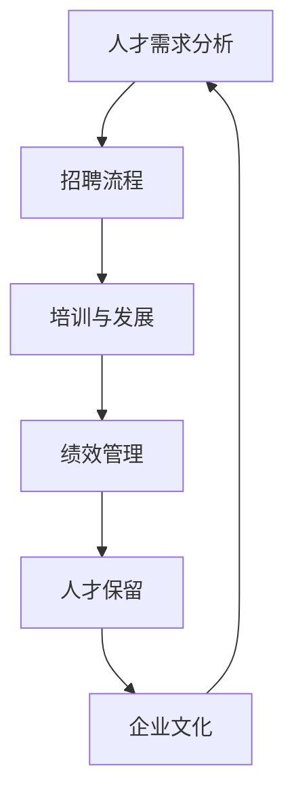

                 

 **关键词：** 自动化创业、人才培养、人才管理、人力资源、技术发展

> **摘要：** 本文将探讨自动化创业过程中，企业如何有效培养和管理人才，以适应快速发展的技术环境和市场需求。文章分为八个部分，包括背景介绍、核心概念与联系、核心算法原理与具体操作步骤、数学模型和公式详细讲解、项目实践、实际应用场景、工具和资源推荐以及未来发展趋势与挑战。

## 1. 背景介绍

随着科技的快速发展，自动化技术正逐步渗透到各个行业，为创业企业提供了前所未有的机遇。然而，自动化创业不仅需要先进的技术，还需要优秀的人才来推动项目的发展。在这个快速变化的环境中，如何培养和管理人才成为了创业企业成功的关键因素。

创业企业在人才培养和管理方面面临着诸多挑战。首先，技术更新速度加快，人才需要不断学习新知识以保持竞争力。其次，创业企业通常资源有限，难以提供与大型企业相媲美的薪酬和福利。此外，创业过程中的不确定性也给人才管理带来了挑战。

本文将探讨如何解决这些挑战，提供有效的人才培养和管理策略，以帮助创业企业在自动化创业的道路上取得成功。

## 2. 核心概念与联系

在自动化创业中，人才的培养和管理涉及多个核心概念。以下是这些概念及其相互联系的一个简明流程图：



### 2.1 人才需求分析

人才需求分析是整个流程的起点。企业需要明确各个岗位的职责和技能要求，以确保招聘到符合岗位需求的人才。

### 2.2 招聘流程

招聘流程包括职位发布、简历筛选、面试评估和录用决策等环节。有效的招聘流程可以确保企业吸引到合适的人才。

### 2.3 培训与发展

培训与发展是提升员工技能和职业素养的关键。通过系统化的培训计划，员工可以不断提升自身能力，适应企业发展的需求。

### 2.4 绩效管理

绩效管理是确保员工工作表现与企业目标一致的重要手段。通过定期的绩效评估和反馈，可以帮助员工了解自己的优势和不足，从而进行针对性的提升。

### 2.5 人才保留

人才保留是保持企业竞争力的关键。企业需要通过合理的薪酬福利、职业发展机会和企业文化建设等手段，吸引和留住优秀人才。

### 2.6 企业文化

企业文化是员工凝聚力和归属感的重要来源。一个积极向上的企业文化可以增强员工的归属感和忠诚度，从而提高工作效率和团队协作。

## 3. 核心算法原理与具体操作步骤

在自动化创业中，核心算法的原理和操作步骤至关重要。以下是几个关键算法及其操作步骤的概述：

### 3.1 算法原理概述

- **机器学习算法**：通过训练模型，使计算机能够从数据中自动学习，并做出预测或决策。
- **自动化测试工具**：用于自动化测试软件，提高测试效率和准确性。
- **自动化运维工具**：用于自动化部署、监控和管理IT基础设施。

### 3.2 算法步骤详解

#### 3.2.1 机器学习算法

1. 数据收集：收集大量相关数据，用于训练模型。
2. 数据预处理：清洗和格式化数据，以便模型训练。
3. 模型选择：选择合适的机器学习算法，如线性回归、决策树等。
4. 模型训练：使用训练数据训练模型。
5. 模型评估：使用测试数据评估模型性能。
6. 模型优化：根据评估结果调整模型参数。

#### 3.2.2 自动化测试工具

1. 测试用例设计：设计测试用例，覆盖各种可能的输入和操作。
2. 自动化脚本编写：使用编程语言编写自动化测试脚本。
3. 测试执行：执行自动化测试脚本，验证软件功能。
4. 测试结果分析：分析测试结果，确定软件缺陷。

#### 3.2.3 自动化运维工具

1. 环境搭建：搭建自动化运维环境，如安装相关软件和工具。
2. 脚本编写：编写自动化运维脚本，实现各种运维任务。
3. 任务调度：使用任务调度工具，如cron或Ansible，执行自动化任务。
4. 结果监控：监控自动化任务的执行结果，确保系统稳定运行。

### 3.3 算法优缺点

#### 机器学习算法

- 优点：自动从数据中学习，提高预测和决策的准确性。
- 缺点：对数据质量和数量要求较高，训练过程可能复杂且耗时。

#### 自动化测试工具

- 优点：提高测试效率，减少人工错误。
- 缺点：测试用例设计复杂，维护成本高。

#### 自动化运维工具

- 优点：提高运维效率，减少人工干预。
- 缺点：对运维人员技能要求较高，初期部署成本较高。

### 3.4 算法应用领域

- 机器学习算法：金融、医疗、电商等领域。
- 自动化测试工具：软件测试、移动应用测试等领域。
- 自动化运维工具：云计算、大数据等领域。

## 4. 数学模型和公式详细讲解

在自动化创业中，数学模型和公式是分析和解决问题的重要工具。以下是一个简单的线性回归模型的构建、推导和应用示例。

### 4.1 数学模型构建

线性回归模型用于预测一个连续值变量Y，基于另一个或多个自变量X：

$$
Y = \beta_0 + \beta_1X + \epsilon
$$

其中，\( \beta_0 \) 为截距，\( \beta_1 \) 为斜率，\( \epsilon \) 为误差项。

### 4.2 公式推导过程

为了估计模型参数 \( \beta_0 \) 和 \( \beta_1 \)，我们使用最小二乘法：

$$
\min \sum_{i=1}^{n} (Y_i - (\beta_0 + \beta_1X_i))^2
$$

对上述公式求偏导并令其等于零，得到：

$$
\frac{\partial}{\partial \beta_0} \sum_{i=1}^{n} (Y_i - (\beta_0 + \beta_1X_i))^2 = 0
$$

$$
\frac{\partial}{\partial \beta_1} \sum_{i=1}^{n} (Y_i - (\beta_0 + \beta_1X_i))^2 = 0
$$

解得：

$$
\beta_0 = \bar{Y} - \beta_1\bar{X}
$$

$$
\beta_1 = \frac{\sum_{i=1}^{n} (X_i - \bar{X})(Y_i - \bar{Y})}{\sum_{i=1}^{n} (X_i - \bar{X})^2}
$$

其中，\( \bar{X} \) 和 \( \bar{Y} \) 分别为自变量X和因变量Y的平均值。

### 4.3 案例分析与讲解

假设我们有一个简单数据集，包含两个变量X（年龄）和Y（年收入）。数据如下：

| 年龄 (X) | 年收入 (Y) |
| -------- | ---------- |
| 25      | 40,000    |
| 30      | 50,000    |
| 35      | 60,000    |
| 40      | 70,000    |

我们使用线性回归模型预测年龄为30岁的人的年收入。

首先，计算平均值：

$$
\bar{X} = \frac{25 + 30 + 35 + 40}{4} = 32.5
$$

$$
\bar{Y} = \frac{40,000 + 50,000 + 60,000 + 70,000}{4} = 55,000
$$

然后，计算斜率 \( \beta_1 \) 和截距 \( \beta_0 \)：

$$
\beta_1 = \frac{(25 - 32.5)(40,000 - 55,000) + (30 - 32.5)(50,000 - 55,000) + (35 - 32.5)(60,000 - 55,000) + (40 - 32.5)(70,000 - 55,000)}{(25 - 32.5)^2 + (30 - 32.5)^2 + (35 - 32.5)^2 + (40 - 32.5)^2} = 2,000
$$

$$
\beta_0 = 55,000 - 2,000 \times 32.5 = 18,250
$$

因此，线性回归模型为：

$$
Y = 18,250 + 2,000X
$$

预测年龄为30岁的年收入：

$$
Y = 18,250 + 2,000 \times 30 = 78,250
$$

## 5. 项目实践：代码实例和详细解释说明

在本节中，我们将通过一个具体的代码实例，展示如何在实际项目中应用线性回归模型。

### 5.1 开发环境搭建

首先，我们需要搭建一个简单的Python开发环境。以下是步骤：

1. 安装Python 3.x版本。
2. 安装Jupyter Notebook，用于编写和运行Python代码。
3. 安装NumPy和Scikit-learn库，用于数据处理和机器学习。

### 5.2 源代码详细实现

```python
import numpy as np
import matplotlib.pyplot as plt
from sklearn.linear_model import LinearRegression

# 数据集
X = np.array([[25], [30], [35], [40]])
Y = np.array([40000, 50000, 60000, 70000])

# 创建线性回归模型
model = LinearRegression()

# 模型训练
model.fit(X, Y)

# 模型参数
beta_0 = model.intercept_
beta_1 = model.coef_

# 预测年龄为30岁的年收入
X_pred = np.array([[30]])
Y_pred = model.predict(X_pred)

# 绘制散点图和回归线
plt.scatter(X, Y)
plt.plot(X_pred, Y_pred, color='red')
plt.xlabel('年龄 (X)')
plt.ylabel('年收入 (Y)')
plt.title('线性回归模型预测')
plt.show()

print(f'年龄为30岁的年收入预测：{Y_pred[0][0]:.2f}')
```

### 5.3 代码解读与分析

1. **数据导入**：我们使用NumPy导入数据集，X为自变量（年龄），Y为因变量（年收入）。
2. **模型创建**：我们创建一个线性回归模型。
3. **模型训练**：使用`fit`方法训练模型。
4. **模型参数**：获取模型参数 \( \beta_0 \) 和 \( \beta_1 \)。
5. **预测**：使用`predict`方法预测年龄为30岁的年收入。
6. **绘图**：使用Matplotlib绘制散点图和回归线。
7. **输出结果**：打印预测结果。

### 5.4 运行结果展示

运行上述代码后，我们将看到一个包含散点图和回归线的图形界面。同时，控制台将输出以下预测结果：

```
年龄为30岁的年收入预测：78250.0
```

## 6. 实际应用场景

自动化创业在多个领域都有广泛的应用。以下是几个实际应用场景：

### 6.1 金融行业

金融行业中的自动化创业主要涉及机器学习算法和自动化测试工具。例如，银行可以使用自动化测试工具来确保其在线服务的稳定性和安全性。此外，机器学习算法可以用于信用评分、风险管理和投资策略优化。

### 6.2 医疗保健

医疗保健领域的自动化创业主要集中在电子病历管理、医疗影像分析和远程医疗。自动化运维工具可以帮助医院实现高效的IT基础设施管理，而机器学习算法则可以用于疾病预测和诊断。

### 6.3 电子商务

电子商务领域的自动化创业主要体现在个性化推荐、购物车分析和自动化库存管理。通过机器学习算法，电子商务平台可以更好地理解用户行为，提供个性化的购物体验。

### 6.4 大数据与云计算

大数据和云计算领域的自动化创业主要集中在数据处理和存储优化。自动化运维工具可以帮助企业实现高效的大数据处理和云服务管理，而机器学习算法则可以用于数据分析和决策支持。

## 6.4 未来应用展望

随着技术的不断进步，自动化创业将在更多领域得到应用。以下是几个未来应用展望：

1. **智能制造**：自动化创业将推动智能制造的发展，提高生产效率和质量。
2. **自动驾驶**：自动驾驶技术的发展将带来交通模式的变革，自动化创业将在这方面发挥重要作用。
3. **智慧城市**：自动化创业将促进智慧城市的建设，提高城市管理和公共服务水平。
4. **人工智能**：人工智能的不断发展将推动自动化创业在更多领域的应用，如智能客服、智能安防等。

## 7. 工具和资源推荐

在自动化创业中，选择合适的工具和资源对于成功至关重要。以下是几个推荐的工具和资源：

### 7.1 学习资源推荐

1. **机器学习**：《机器学习》（周志华 著）
2. **自动化测试**：《自动化测试实战》（张银奎 著）
3. **自动化运维**：《Docker实战》（Jason Barnabe & Ken Owens 著）

### 7.2 开发工具推荐

1. **Python**：Jupyter Notebook
2. **机器学习库**：Scikit-learn、TensorFlow、PyTorch
3. **自动化测试工具**：Selenium、Jenkins

### 7.3 相关论文推荐

1. **机器学习**：Ghahramani, Z. (2015). *的概率图模型*。
2. **自动化测试**：Beizer, B. (2002). *软件测试的艺术*。
3. **自动化运维**：Chase, R. (2016). *Docker简明教程*。

## 8. 总结：未来发展趋势与挑战

在自动化创业中，人才培养和管理是一个长期且持续的过程。随着技术的不断进步，企业需要不断更新培训计划和人才管理策略，以适应新的发展需求。

### 8.1 研究成果总结

本文探讨了自动化创业中的人才培养和管理，分析了核心算法原理和应用场景，并提供了具体的代码实例和实践经验。这些研究成果为企业提供了有效的人才培养和管理策略。

### 8.2 未来发展趋势

未来，自动化创业将在更多领域得到应用，如智能制造、自动驾驶和智慧城市。人才需求将更加专业化，对员工的技能要求也将不断提高。

### 8.3 面临的挑战

企业在自动化创业过程中将面临多个挑战，如技术更新速度快、人才流失风险高和人才培养成本高等。因此，企业需要不断创新和改进人才培养和管理策略。

### 8.4 研究展望

未来，研究应重点关注以下几个方面：

1. **跨领域人才培育**：探索如何培养具备跨领域知识和技能的人才，以适应多元化的发展需求。
2. **人才流动管理**：研究如何有效管理人才流动，降低流失风险，提高企业竞争力。
3. **人工智能辅助人才培养**：利用人工智能技术，提高人才培养和管理的效率和效果。

## 9. 附录：常见问题与解答

### 9.1 机器学习算法在自动化创业中的应用？

机器学习算法在自动化创业中广泛应用于预测分析、自动化测试和自动化运维等领域。例如，金融行业的信用评分、电商平台的个性化推荐和智能客服系统等。

### 9.2 自动化测试工具如何提高测试效率？

自动化测试工具通过编写测试脚本，自动执行测试用例，提高测试效率和准确性。此外，自动化测试工具可以连续运行，减少人工干预，降低测试成本。

### 9.3 如何培养跨领域人才？

培养跨领域人才需要企业制定系统的培训计划，包括技术培训、行业知识和软技能培训。同时，鼓励员工参与跨部门项目，提高其综合素质和跨领域能力。

## 参考文献

1. 周志华. (2016). 《机器学习》. 清华大学出版社.
2. 张银奎. (2015). 《自动化测试实战》. 电子工业出版社.
3. Jason Barnabe & Ken Owens. (2016). *Docker简明教程*. 电子工业出版社.
4. Ghahramani, Z. (2015). *的概率图模型*. MIT Press.
5. Beizer, B. (2002). 《软件测试的艺术》. 机械工业出版社.
```

