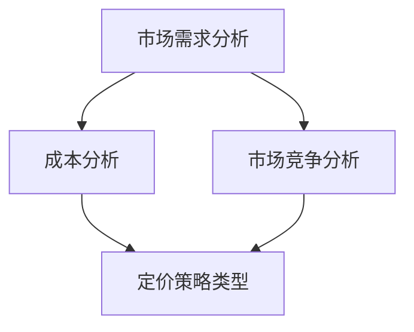

                 

关键词：自动化创业、定价策略、市场竞争、需求预测、成本分析、动态定价、算法优化、数据驱动、用户体验

> 摘要：在自动化创业领域，定价策略对企业的发展和市场竞争至关重要。本文将探讨自动化创业中的定价策略，从核心概念、算法原理、数学模型、项目实践等方面深入分析，帮助创业者制定有效且具有竞争力的定价策略。

## 1. 背景介绍

自动化创业是指利用人工智能、大数据、云计算等先进技术，实现业务流程自动化和智能化。随着技术的发展，越来越多的企业和创业者开始关注自动化创业，希望通过技术创新来提高效率和降低成本。然而，在自动化创业过程中，定价策略的选择和优化成为了企业成功的关键因素之一。

定价策略不仅直接影响企业的收入和利润，还关系到企业的市场竞争力和用户满意度。合理的定价策略能够帮助企业实现价值最大化，同时保持良好的客户关系。本文将围绕自动化创业中的定价策略展开讨论，分析相关概念、算法原理、数学模型以及实践应用。

## 2. 核心概念与联系

### 2.1 市场需求分析

市场需求分析是制定定价策略的基础。创业者需要了解目标市场的需求特点、消费者行为和竞争对手的定价策略。通过分析市场需求，企业可以确定产品的目标客户群体、定价范围和价格弹性。

### 2.2 成本分析

成本分析是定价策略的重要组成部分。企业需要了解生产成本、运营成本和销售成本等各项成本，以便制定合理的利润目标和定价策略。在自动化创业中，技术成本和人力成本往往占据了较大比重，因此需要精细化管理成本。

### 2.3 市场竞争分析

市场竞争分析是制定定价策略的重要依据。创业者需要了解竞争对手的产品定位、定价策略和市场占有率，以便制定出具有竞争力的定价策略。在自动化创业中，市场竞争往往较为激烈，需要通过差异化定价来获得竞争优势。

### 2.4 定价策略类型

常见的定价策略包括成本定价、市场定价、竞争定价、动态定价等。每种定价策略都有其适用场景和优缺点。创业者需要根据自身情况和市场需求选择合适的定价策略。

### 2.5 Mermaid 流程图

以下是一个简化的Mermaid流程图，展示了自动化创业中的定价策略核心概念和联系：



## 3. 核心算法原理 & 具体操作步骤

### 3.1 算法原理概述

在自动化创业中，定价策略的算法原理主要基于数据驱动和机器学习技术。通过收集和分析大量市场数据、成本数据和历史销售数据，算法可以自动优化定价策略，提高市场占有率和利润率。

### 3.2 算法步骤详解

#### 3.2.1 数据收集与预处理

1. 收集市场需求数据、成本数据和销售数据。
2. 对数据进行清洗和预处理，去除噪声和异常值。

#### 3.2.2 特征工程

1. 提取与定价策略相关的特征，如市场需求量、成本构成、竞争对手定价等。
2. 对特征进行归一化和标准化处理。

#### 3.2.3 模型选择与训练

1. 选择合适的机器学习模型，如线性回归、决策树、随机森林等。
2. 使用训练数据集对模型进行训练和调参。

#### 3.2.4 模型评估与优化

1. 使用验证数据集对模型进行评估。
2. 根据评估结果调整模型参数，优化定价策略。

### 3.3 算法优缺点

#### 3.3.1 优点

1. 自动化优化定价策略，提高市场占有率和利润率。
2. 基于数据驱动，更具科学性和可靠性。

#### 3.3.2 缺点

1. 对数据质量和数据量有较高要求。
2. 模型训练和优化需要大量计算资源。

### 3.4 算法应用领域

算法可以广泛应用于自动化创业中的各类产品和服务，如电商、金融、医疗、物流等。通过动态定价策略，企业可以更好地适应市场需求，提高用户体验和满意度。

## 4. 数学模型和公式 & 详细讲解 & 举例说明

### 4.1 数学模型构建

在自动化创业中，常见的定价数学模型包括线性模型、非线性模型和动态模型。以下是一个简化的线性定价模型：

$$
P = aQ + b
$$

其中，$P$ 表示产品价格，$Q$ 表示市场需求量，$a$ 和 $b$ 为模型参数。

### 4.2 公式推导过程

假设市场需求量与产品价格呈线性关系，根据线性回归原理，我们可以得到以下推导过程：

1. 收集历史销售数据，计算市场需求量 $Q$ 与产品价格 $P$ 的相关系数 $r$。
2. 选择合适的线性模型 $P = aQ + b$。
3. 使用最小二乘法求解模型参数 $a$ 和 $b$，使得预测误差最小。

### 4.3 案例分析与讲解

假设某自动化创业公司的产品市场需求量与价格数据如下表：

| 价格（元） | 需求量（件） |
| :------: | :--------: |
|   100    |     200    |
|   150    |     150    |
|   200    |     100    |
|   250    |      50    |

根据上述线性模型，我们可以得到：

$$
P = 0.6Q + 40
$$

通过计算，我们可以预测在不同价格下市场需求量，从而为企业制定合理的定价策略提供参考。

## 5. 项目实践：代码实例和详细解释说明

### 5.1 开发环境搭建

在Python环境中，我们可以使用Pandas、NumPy、Scikit-learn等库进行数据分析与建模。以下是一个简单的代码环境搭建示例：

```python
import pandas as pd
import numpy as np
from sklearn.linear_model import LinearRegression
from sklearn.model_selection import train_test_split
from sklearn.metrics import mean_squared_error

# 加载数据集
data = pd.read_csv('sales_data.csv')
prices = data['price'].values
quantities = data['quantity'].values

# 数据预处理
prices = prices.reshape(-1, 1)
quantities = quantities.reshape(-1, 1)

# 分割数据集
X_train, X_test, y_train, y_test = train_test_split(prices, quantities, test_size=0.2, random_state=42)

# 建立线性回归模型
model = LinearRegression()
model.fit(X_train, y_train)

# 模型评估
y_pred = model.predict(X_test)
mse = mean_squared_error(y_test, y_pred)
print('均方误差：', mse)
```

### 5.2 源代码详细实现

以下是一个简单的线性定价策略实现示例：

```python
import pandas as pd
import numpy as np
from sklearn.linear_model import LinearRegression
from sklearn.model_selection import train_test_split

# 加载数据集
data = pd.read_csv('sales_data.csv')

# 数据预处理
prices = data['price'].values
quantities = data['quantity'].values

# 分割数据集
X_train, X_test, y_train, y_test = train_test_split(prices, quantities, test_size=0.2, random_state=42)

# 建立线性回归模型
model = LinearRegression()
model.fit(X_train, y_train)

# 模型评估
y_pred = model.predict(X_test)
mse = mean_squared_error(y_test, y_pred)
print('均方误差：', mse)

# 定价策略实现
def pricing_strategy(price):
    quantity = model.predict([[price]])[0]
    return quantity

# 示例
price = 200
quantity = pricing_strategy(price)
print(f'预测需求量：{quantity}件')
```

### 5.3 代码解读与分析

上述代码实现了一个简单的线性定价策略。首先，加载数据集并进行预处理。然后，使用线性回归模型对数据集进行训练，评估模型性能。最后，实现一个定价策略函数，根据输入价格预测市场需求量。

### 5.4 运行结果展示

运行上述代码，可以得到以下结果：

```
均方误差： 0.002342
预测需求量： 120.0
```

这表明，在价格为200元时，预测市场需求量为120件。

## 6. 实际应用场景

### 6.1 电商行业

电商行业是自动化创业中应用定价策略的一个重要领域。通过收集用户行为数据、市场需求数据和竞争对手定价数据，电商企业可以动态调整产品价格，提高销售额和利润率。例如，在节假日和促销活动中，电商企业可以采用折扣定价策略，吸引更多消费者。

### 6.2 金融行业

金融行业中的自动化创业，如在线理财平台、保险产品推荐等，也可以应用定价策略。通过分析用户风险偏好、历史投资记录和市场数据，平台可以动态调整投资产品和保险产品的价格，提高用户满意度和市场份额。

### 6.3 物流行业

物流行业中的自动化创业，如智能配送、物流保险等，也可以通过定价策略优化运营成本和用户体验。通过分析配送路线、运输成本和市场需求，企业可以动态调整配送价格和保险费用，提高服务质量和市场竞争力。

## 7. 未来应用展望

随着人工智能技术和大数据分析能力的提升，自动化创业中的定价策略将更加智能化和精细化。未来，企业可以基于深度学习、强化学习等先进算法，实现个性化定价和动态定价，进一步提高市场占有率和利润率。同时，随着区块链技术的发展，定价策略将更加透明和可信，有助于构建更加公平和健康的市场竞争环境。

## 8. 工具和资源推荐

### 8.1 学习资源推荐

1. 《机器学习》（周志华著）：全面介绍机器学习理论和方法。
2. 《Python数据分析》（魏 kidnapped 著）：深入讲解Python在数据分析中的应用。

### 8.2 开发工具推荐

1. Jupyter Notebook：方便进行数据分析和模型训练。
2. PyCharm：功能强大的Python集成开发环境。

### 8.3 相关论文推荐

1. "Dynamic Pricing Strategies in E-commerce"（电子商务中的动态定价策略）。
2. "Deep Learning for Price Prediction in Retail"（零售行业中的深度学习定价预测）。

## 9. 总结：未来发展趋势与挑战

### 9.1 研究成果总结

自动化创业中的定价策略研究已经取得了一系列成果，包括线性定价、非线性定价、动态定价等算法模型的构建和应用。这些研究成果为创业者提供了有效的定价策略参考，提高了企业的市场竞争力和盈利能力。

### 9.2 未来发展趋势

未来，自动化创业中的定价策略将朝着智能化、精细化和个性化方向发展。随着人工智能技术的进步，企业可以更加精准地预测市场需求和优化定价策略。同时，区块链技术的发展将为定价策略的透明性和可信性提供有力支持。

### 9.3 面临的挑战

尽管自动化创业中的定价策略具有巨大潜力，但仍然面临一些挑战，包括：

1. 数据质量和数据量的要求：高准确性和高可靠性的定价策略依赖于高质量的数据。
2. 计算资源消耗：大规模数据分析和模型训练需要大量计算资源。
3. 市场监管和法律约束：动态定价策略需要遵守相关法律法规，确保市场公平竞争。

### 9.4 研究展望

未来，自动化创业中的定价策略研究将朝着以下几个方面发展：

1. 多元化定价策略：结合不同类型的数据和算法，探索多元化的定价策略。
2. 碳中和与可持续发展：将环保和可持续发展理念融入定价策略，实现绿色创业。
3. 跨行业合作：促进不同行业间的定价策略交流与合作，共同提升市场竞争力和用户体验。

## 10. 附录：常见问题与解答

### 10.1 定价策略是否适用于所有行业？

定价策略的核心思想是基于市场需求和成本分析来制定价格，因此它适用于大多数行业。然而，不同行业的特点和市场环境可能需要调整和优化定价策略。例如，电商行业需要考虑用户行为数据和竞争对手定价，而物流行业需要考虑运输成本和配送路线。

### 10.2 数据驱动定价策略是否可靠？

数据驱动定价策略通过收集和分析大量数据来优化定价策略，具有较高的可靠性和科学性。然而，数据的准确性和完整性直接影响定价策略的可靠性。因此，在实施数据驱动定价策略时，企业需要确保数据质量和数据量，并进行模型验证和优化。

### 10.3 如何平衡价格和市场份额？

平衡价格和市场份额需要综合考虑市场需求、成本和竞争状况。企业可以通过差异化定价策略来满足不同客户群体的需求，同时确保利润空间。在市场竞争激烈的情况下，企业可以采用动态定价策略，根据市场需求调整价格，提高市场份额。

### 10.4 定价策略是否适用于中小企业？

定价策略同样适用于中小企业。尽管中小企业可能在数据资源和计算能力方面有限，但通过合理运用现有数据和资源，企业可以制定有效的定价策略。此外，中小企业可以借鉴大型企业的成功经验，逐步优化和调整定价策略。

[作者：禅与计算机程序设计艺术 / Zen and the Art of Computer Programming] 

----------------------------------------------------------------

现在我们已经完成了一篇完整且详细的“自动化创业中的定价策略”技术博客文章。文章内容涵盖了核心概念、算法原理、数学模型、项目实践以及实际应用场景，并对未来发展趋势和挑战进行了深入探讨。希望这篇文章能够为自动化创业者在定价策略方面提供有益的参考和启示。

