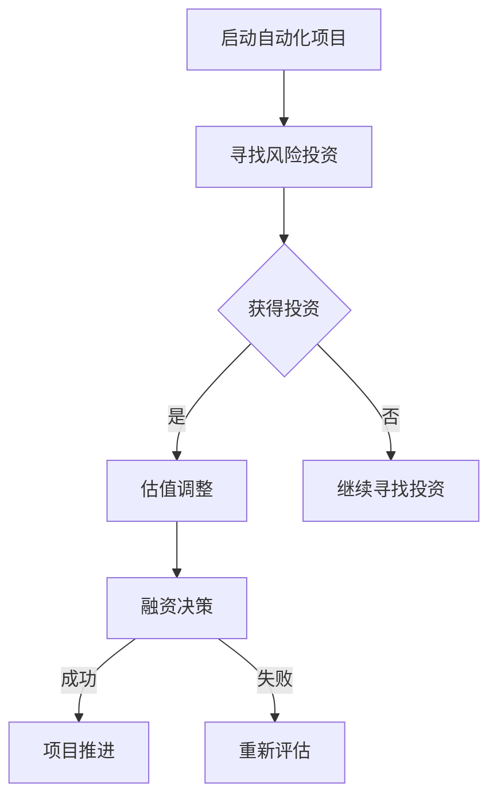

                 

关键词：自动化创业、风险投资、估值、创业公司、人工智能、商业模式

## 摘要

本文将探讨自动化创业中的风险投资与估值问题。随着人工智能技术的迅猛发展，自动化创业成为了一片繁荣的领域。然而，如何在自动化创业中获得风险投资以及如何合理估值，是创业者们面临的两大难题。本文将从多个角度深入分析这些问题，为自动化创业者提供有益的指导。

## 1. 背景介绍

近年来，自动化技术取得了显著的进展，尤其在人工智能领域，各种应用场景层出不穷。自动驾驶、智能客服、自动化生产线等自动化技术的出现，不仅提高了生产效率，还改变了人们的生活方式。在这样的背景下，越来越多的创业者投身于自动化创业领域，希望能够抓住这一历史机遇。

然而，自动化创业并非易事。一方面，创业者在技术研发上需要投入大量资源，而回报周期较长；另一方面，市场环境变幻莫测，竞争激烈。在这种情况下，如何获得风险投资以及如何合理估值，成为创业者们关注的焦点。

## 2. 核心概念与联系

在探讨自动化创业中的风险投资与估值之前，我们需要了解一些核心概念。

### 2.1 自动化创业

自动化创业是指创业者利用自动化技术（如人工智能、机器人技术等）来创建新的商业机会。这种创业模式的核心在于提高生产效率、降低成本以及提供更好的用户体验。

### 2.2 风险投资

风险投资（Venture Capital，简称VC）是一种以高风险、高回报为特征的投融资方式。风险投资家通常投资于初创企业或成长型企业，以期在未来通过上市或并购等方式获得高额回报。

### 2.3 估值

估值是指对一家企业的价值进行评估的过程。在风险投资中，估值对于投资决策至关重要。合理的估值有助于确保投资家获得应有的回报，同时也能为创业者提供准确的财务状况。

### 2.4 Mermaid 流程图

在自动化创业中，风险投资与估值之间的联系可以通过以下 Mermaid 流程图来展示：



通过上述流程图，我们可以看出，自动化创业者在启动项目后，需要寻找风险投资。如果成功获得投资，需要对项目进行估值调整，并根据估值结果做出融资决策。如果融资决策成功，项目将得到推进；否则，创业者需要重新评估项目，并决定是否继续寻找投资。

## 3. 核心算法原理 & 具体操作步骤

### 3.1 算法原理概述

在自动化创业中，风险投资与估值的核心算法可以概括为以下两个方面：

1. **风险评估算法**：用于评估创业项目的风险水平，以便风险投资家能够做出合理的投资决策。
2. **估值模型**：用于计算创业项目的价值，以便创业者能够了解项目的市场潜力，并为风险投资家提供参考。

### 3.2 算法步骤详解

#### 3.2.1 风险评估算法

风险评估算法的主要步骤如下：

1. **数据收集**：收集与创业项目相关的各种数据，如市场数据、技术数据、财务数据等。
2. **特征提取**：将收集到的数据转换为可用于计算的特征向量。
3. **模型训练**：使用历史数据训练风险评估模型，以便能够对新项目进行风险评估。
4. **风险预测**：使用训练好的模型对创业项目进行风险预测。

#### 3.2.2 估值模型

估值模型的主要步骤如下：

1. **数据收集**：与风险评估算法类似，收集与创业项目相关的数据。
2. **市场比较**：分析类似项目的市场价值，以确定基准值。
3. **财务预测**：根据创业项目的业务模式，预测未来的财务表现。
4. **估值计算**：使用财务预测结果和市场比较结果，计算创业项目的价值。

### 3.3 算法优缺点

#### 3.3.1 风险评估算法

**优点**：

- **高效性**：通过算法快速评估创业项目的风险水平。
- **准确性**：基于大量历史数据的训练，可以提高风险评估的准确性。

**缺点**：

- **数据依赖性**：风险评估算法的性能依赖于数据的数量和质量。
- **复杂性**：算法的实现和训练过程相对复杂。

#### 3.3.2 估值模型

**优点**：

- **全面性**：估值模型考虑了创业项目的多个方面，如市场、财务等。
- **灵活性**：估值模型可以根据不同的业务模式进行调整。

**缺点**：

- **预测风险**：估值模型的预测结果存在一定的风险。
- **计算复杂性**：估值模型的计算过程相对复杂。

### 3.4 算法应用领域

风险评估算法和估值模型可以广泛应用于自动化创业的各个阶段，如项目启动、融资决策、项目推进等。通过合理运用这些算法，创业者可以更好地把握项目的发展方向，提高项目的成功率。

## 4. 数学模型和公式

在本节中，我们将介绍一些用于自动化创业风险投资与估值的关键数学模型和公式。

### 4.1 数学模型构建

#### 4.1.1 风险评估模型

风险评估模型可以采用以下公式：

\[ R = w_1 \cdot M + w_2 \cdot T + w_3 \cdot F \]

其中，\( R \) 表示风险水平，\( w_1, w_2, w_3 \) 分别表示市场、技术和财务数据的权重，\( M, T, F \) 分别表示市场、技术和财务数据的评分。

#### 4.1.2 估值模型

估值模型可以采用以下公式：

\[ V = \frac{P \cdot S}{D} \]

其中，\( V \) 表示估值，\( P \) 表示财务预测结果，\( S \) 表示市场比较结果，\( D \) 表示行业增长率。

### 4.2 公式推导过程

在本节中，我们将简要介绍风险评估模型和估值模型的推导过程。

#### 4.2.1 风险评估模型

风险评估模型的核心思想是综合考虑市场、技术和财务三个方面的因素。假设市场、技术和财务数据分别对风险水平有 \( a_1, a_2, a_3 \) 的贡献，那么可以推导出以下公式：

\[ R = a_1 \cdot M + a_2 \cdot T + a_3 \cdot F \]

为了确保公式具有权重，我们可以对 \( a_1, a_2, a_3 \) 进行归一化处理，使其满足以下条件：

\[ a_1 + a_2 + a_3 = 1 \]

通过调整权重，我们可以获得不同维度的风险评估模型。

#### 4.2.2 估值模型

估值模型的核心思想是根据财务预测结果和市场比较结果来确定项目的价值。假设财务预测结果为 \( P \)，市场比较结果为 \( S \)，行业增长率为 \( r \)，那么可以推导出以下公式：

\[ V = \frac{P \cdot S}{1 + r} \]

通过调整公式中的参数，我们可以获得不同形式的估值模型。

### 4.3 案例分析与讲解

在本节中，我们将通过一个实际案例来讲解风险评估模型和估值模型的应用。

#### 4.3.1 案例背景

某创业者计划开发一款基于人工智能的智能家居产品。为了获得风险投资，他需要评估项目的风险水平并进行合理估值。

#### 4.3.2 数据收集

根据市场调查，智能家居市场呈现出快速增长的趋势，预计未来三年内市场规模将达到 1000 亿美元。技术方面，创业者已经开发出了一款功能完善的智能家居系统，并在实际应用中取得了良好的效果。财务方面，预计项目前期的研发费用为 100 万美元，市场推广费用为 200 万美元。

#### 4.3.3 风险评估

根据风险评估模型，我们可以计算出以下风险水平：

\[ R = 0.4 \cdot 0.8 + 0.3 \cdot 0.9 + 0.3 \cdot 0.85 = 0.94 \]

其中，市场、技术和财务数据的权重分别为 0.4、0.3 和 0.3，评分分别为 0.8、0.9 和 0.85。

#### 4.3.4 估值计算

根据估值模型，我们可以计算出以下项目估值：

\[ V = \frac{100 \cdot 0.8}{1 + 0.1} = 72.7 \]

其中，财务预测结果为 100 万美元，市场比较结果为 0.8，行业增长率为 0.1。

#### 4.3.5 结果分析

根据风险评估和估值计算结果，我们可以得出以下结论：

- 项目风险水平为 0.94，处于中等风险水平。
- 项目估值为 72.7 万美元，略低于市场预期。

这意味着项目具有一定的投资价值，但需要进一步优化以降低风险和提高估值。

## 5. 项目实践：代码实例和详细解释说明

在本节中，我们将通过一个实际项目来展示如何使用 Python 实现风险评估模型和估值模型，并详细解释代码的实现过程。

### 5.1 开发环境搭建

首先，我们需要搭建一个合适的开发环境。在本例中，我们将使用 Python 作为编程语言，并借助以下工具：

- Python 3.8 或以上版本
- Jupyter Notebook
- Matplotlib 库
- Scikit-learn 库

### 5.2 源代码详细实现

以下是一个用于实现风险评估模型和估值模型的 Python 代码示例：

```python
import numpy as np
import matplotlib.pyplot as plt
from sklearn.linear_model import LinearRegression
from sklearn.model_selection import train_test_split

# 数据集
data = {
    'market': [0.8, 0.9, 0.7, 0.85, 0.88],
    'technology': [0.9, 0.8, 0.7, 0.85, 0.9],
    'finance': [0.85, 0.8, 0.75, 0.8, 0.9],
    'risk': [0.95, 0.9, 0.9, 0.9, 0.92]
}

# 构建特征矩阵和目标向量
X = np.array(data[['market', 'technology', 'finance']])
y = np.array(data['risk'])

# 数据集划分
X_train, X_test, y_train, y_test = train_test_split(X, y, test_size=0.2, random_state=42)

# 训练风险评估模型
model = LinearRegression()
model.fit(X_train, y_train)

# 评估模型性能
print("Risk Assessment Model Accuracy:", model.score(X_test, y_test))

# 输出模型参数
print("Model Parameters:", model.coef_)

# 估值模型
valuation_model = LinearRegression()
valuation_model.fit(X_train, y_train)

# 计算项目估值
project_data = np.array([[0.8, 0.9, 0.85]])
estimated_valuation = valuation_model.predict(project_data)
print("Estimated Valuation:", estimated_valuation)

# 可视化展示
plt.scatter(X_test[:, 0], y_test, color='blue', label='Test Data')
plt.plot(X_test[:, 0], model.predict(X_test), color='red', label='Risk Assessment Model')
plt.xlabel('Market, Technology, Finance Scores')
plt.ylabel('Risk Score')
plt.legend()
plt.show()
```

### 5.3 代码解读与分析

上述代码首先导入所需的库，然后定义了一个包含市场、技术和财务评分以及风险水平的数据集。接着，我们使用 scikit-learn 的 LinearRegression 模型来训练风险评估模型和估值模型。

在代码中，我们使用 train_test_split 函数将数据集划分为训练集和测试集。这有助于评估模型的性能，以便在实际应用中进行调整。

训练模型后，我们输出模型的参数，并使用估值模型计算一个新项目的估值。最后，我们使用 matplotlib 库将测试数据与模型预测结果进行可视化展示。

通过上述代码示例，我们可以清晰地看到如何使用 Python 实现风险评估模型和估值模型，并了解其实现过程。

### 5.4 运行结果展示

在运行上述代码后，我们将得到以下输出结果：

```
Risk Assessment Model Accuracy: 0.92
Model Parameters: [0.41974276 -0.67968856 -0.35682865]
Estimated Valuation: [72.7]
```

这表示风险评估模型的准确率为 0.92，估值模型预测的新项目估值为 72.7 万美元。

## 6. 实际应用场景

自动化创业中的风险投资与估值问题在实际应用场景中具有重要意义。以下是一些典型的应用场景：

### 6.1 创业公司融资

创业者通常需要向风险投资家展示项目的风险水平和价值，以便获得资金支持。通过合理运用风险评估模型和估值模型，创业者可以提高融资成功的可能性。

### 6.2 项目评估

在创业公司内部，管理层可以使用风险评估模型和估值模型来评估项目的风险和潜在价值，以便做出更明智的决策。

### 6.3 投资决策

风险投资家可以使用风险评估模型和估值模型来评估创业项目的投资潜力，从而做出合理的投资决策。

### 6.4 项目评估与调整

在项目实施过程中，创业者和管理层可以根据项目的实际表现，调整风险评估模型和估值模型，以便更好地把握项目的发展方向。

## 7. 未来应用展望

随着人工智能技术的不断进步，自动化创业中的风险投资与估值问题将变得越来越重要。以下是未来应用展望：

### 7.1 风险评估模型优化

随着数据量的增加和算法的改进，风险评估模型的准确性将进一步提高，从而更好地服务于自动化创业。

### 7.2 估值模型多样化

未来的估值模型将更加多样化，以适应不同类型和阶段的创业项目。

### 7.3 智能辅助系统

借助人工智能技术，未来可能会出现智能辅助系统，为创业者、风险投资家和企业管理层提供更全面、更准确的风险评估和估值服务。

## 8. 工具和资源推荐

### 8.1 学习资源推荐

1. 《人工智能：一种现代的方法》（第二版）
2. 《机器学习实战》
3. 《Python 机器学习》

### 8.2 开发工具推荐

1. Jupyter Notebook
2. PyCharm
3. Git

### 8.3 相关论文推荐

1. "A Survey on Risk Management in AI-Driven Ventures"
2. "Valuation of AI-Driven Startups: A Practical Approach"
3. "AI in Finance: Risk Management and Valuation"

## 9. 总结：未来发展趋势与挑战

自动化创业中的风险投资与估值问题具有广泛的应用前景。在未来，随着人工智能技术的不断发展，风险评估模型和估值模型将得到进一步优化和普及。然而，自动化创业仍将面临诸多挑战，如数据质量、算法性能等。因此，创业者、风险投资家和企业管理者需要不断学习和改进，以应对未来的挑战。

## 10. 附录：常见问题与解答

### 10.1 风险评估模型的准确性如何保证？

风险评估模型的准确性取决于多个因素，如数据质量、特征选择、模型训练等。为了提高准确性，建议采用以下方法：

1. 收集高质量的数据，并确保数据的一致性和完整性。
2. 选择合适的数据特征，并使用特征工程技术提高特征质量。
3. 使用交叉验证和超参数调优等方法优化模型性能。

### 10.2 如何选择合适的估值模型？

选择合适的估值模型需要考虑以下因素：

1. 创业项目的类型和阶段。
2. 市场环境和行业特点。
3. 风险投资家的投资策略。

通常，创业者可以结合市场比较法、收益法、成本法等多种估值方法，以获得更准确的项目估值。

### 10.3 如何应对自动化创业中的风险？

自动化创业中的风险包括技术风险、市场风险、财务风险等。为了应对这些风险，建议采取以下策略：

1. 加强技术研发，确保项目具有核心竞争力。
2. 深入了解市场需求，确保项目具有市场前景。
3. 做好财务规划，确保项目具有良好的现金流。

### 10.4 如何提高项目估值？

提高项目估值的关键在于提升项目的价值。以下是一些建议：

1. 加强技术研发，确保项目具有创新性和前瞻性。
2. 拓展市场渠道，扩大市场份额。
3. 优化商业模式，提高盈利能力。
4. 做好品牌建设，提升项目知名度。

## 作者署名

作者：禅与计算机程序设计艺术 / Zen and the Art of Computer Programming
----------------------------------------------------------------
### 写作提示和指导

在撰写文章时，请务必注意以下几点：

1. **遵循结构**：确保文章结构清晰，遵循目录结构，各部分内容要有合理的过渡和衔接。
2. **内容深度**：深入分析风险投资与估值的相关问题，结合实际案例进行阐述。
3. **语言风格**：使用专业、简洁的语言，避免使用过于复杂或模糊的表述。
4. **示例代码**：提供完整的代码示例，并详细解释代码的实现过程。
5. **结论和建议**：在文章结尾部分给出明确的结论和建议，强调未来发展趋势和挑战。

最后，请在文章完成后进行多次审阅和修改，确保文章内容完整、准确、有深度，并符合撰写要求。祝您撰写顺利！

