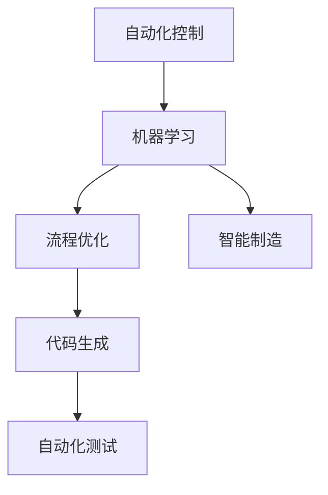

                 

关键词：自动化技术、AI、机器学习、流程优化、代码生成、自动化测试、智能制造

摘要：本文将深入探讨自动化技术在各个领域的最新应用与发展。从背景介绍、核心概念、算法原理、数学模型、项目实践、实际应用场景到工具和资源推荐，我们将全面解析自动化技术的现状与未来趋势。

## 1. 背景介绍

自动化技术，作为现代信息技术的重要分支，已经渗透到社会生产的各个领域。从传统的制造业到新兴的互联网行业，自动化技术的应用正在不断扩展，为企业的生产效率、产品质量和竞争力带来了革命性的提升。

近年来，随着人工智能和机器学习技术的迅速发展，自动化技术也迎来了新的发展机遇。通过深度学习、强化学习等算法，自动化技术能够实现更为复杂和智能的任务处理，极大地提高了自动化系统的自主性和智能水平。

## 2. 核心概念与联系

自动化技术的核心概念包括：自动化控制、机器学习、流程优化、代码生成和自动化测试等。以下是这些概念的联系与架构：



### 2.1 自动化控制

自动化控制是自动化技术的核心，它通过传感器、执行器和控制器等设备，实现对生产过程的实时监控和调节。在智能制造中，自动化控制是实现生产流程自动化的重要手段。

### 2.2 机器学习

机器学习是自动化技术的重要驱动力量，它通过数据分析和模型训练，实现自动化的决策和预测。在自动化测试和流程优化中，机器学习算法能够发现潜在的问题和优化点，提高自动化系统的效率和准确性。

### 2.3 流程优化

流程优化是自动化技术的重要应用领域，通过对生产流程的自动化监控和优化，可以提高生产效率和产品质量。流程优化涉及到生产计划、资源调配、质量控制和成本控制等多个方面。

### 2.4 代码生成

代码生成技术通过自动化工具生成应用程序代码，减少人工编写代码的工作量。在软件开发中，代码生成技术可以大大提高开发效率，降低开发成本。

### 2.5 自动化测试

自动化测试是确保软件质量和稳定性的重要手段。通过自动化测试工具，可以实现对软件的自动化测试和调试，提高测试效率和准确性。

### 2.6 智能制造

智能制造是自动化技术的最新发展趋势，它通过将人工智能、物联网、大数据等技术与制造业相结合，实现生产过程的智能化和自动化。智能制造可以大幅提高生产效率、降低成本、提高产品质量和灵活性。

## 3. 核心算法原理 & 具体操作步骤

### 3.1 算法原理概述

自动化技术的核心算法包括深度学习算法、强化学习算法、遗传算法和神经网络等。这些算法通过模拟生物神经网络的结构和功能，实现对数据的自动学习和处理。

### 3.2 算法步骤详解

- **深度学习算法**：通过多层神经网络对数据进行特征提取和模式识别，具体步骤包括前向传播、反向传播和权重更新等。
- **强化学习算法**：通过与环境交互，学习最优策略，具体步骤包括状态评估、策略选择、动作执行和奖励评估等。
- **遗传算法**：通过模拟生物进化的过程，实现对问题的优化和搜索，具体步骤包括初始化种群、适应度评估、交叉和变异等。
- **神经网络**：通过模拟生物神经网络的结构和功能，实现对数据的自动学习和处理，具体步骤包括前向传播、反向传播和权重更新等。

### 3.3 算法优缺点

- **深度学习算法**：优点包括强大的特征提取能力和良好的泛化能力；缺点包括需要大量数据和计算资源，模型复杂度较高。
- **强化学习算法**：优点包括能够处理动态和不确定的环境；缺点包括训练过程复杂，需要大量时间和计算资源。
- **遗传算法**：优点包括强大的搜索能力和鲁棒性；缺点包括收敛速度较慢，需要大量迭代次数。
- **神经网络**：优点包括强大的特征提取能力和良好的泛化能力；缺点包括需要大量数据和计算资源，模型复杂度较高。

### 3.4 算法应用领域

- **深度学习算法**：广泛应用于图像识别、语音识别、自然语言处理等领域。
- **强化学习算法**：广泛应用于自动驾驶、机器人控制、游戏开发等领域。
- **遗传算法**：广泛应用于组合优化、机器学习、工程优化等领域。
- **神经网络**：广泛应用于图像识别、语音识别、自然语言处理等领域。

## 4. 数学模型和公式 & 详细讲解 & 举例说明

### 4.1 数学模型构建

自动化技术的数学模型主要包括神经网络模型、决策树模型和线性回归模型等。以下是神经网络模型的构建过程：

$$
\begin{aligned}
y &= \sigma(\sum_{i=1}^{n} w_i \cdot x_i + b) \\
\delta &= \frac{\partial L}{\partial z} \\
w_{new} &= w - \alpha \cdot \delta \cdot x \\
b_{new} &= b - \alpha \cdot \delta \\
\end{aligned}
$$

其中，$y$ 为输出值，$\sigma$ 为激活函数，$w_i$ 为权重，$x_i$ 为输入值，$b$ 为偏置，$L$ 为损失函数，$\delta$ 为误差，$\alpha$ 为学习率。

### 4.2 公式推导过程

神经网络的推导过程主要包括前向传播和反向传播两个阶段。以下是前向传播和反向传播的公式推导：

$$
\begin{aligned}
z &= \sum_{i=1}^{n} w_i \cdot x_i + b \\
a &= \sigma(z) \\
z' &= \sum_{i=1}^{n} w_i' \cdot a_i + b' \\
a' &= \sigma(z') \\
\end{aligned}
$$

前向传播过程将输入值经过权重和偏置计算得到输出值，反向传播过程将输出值经过激活函数和权重计算得到误差，然后通过误差对权重和偏置进行更新。

### 4.3 案例分析与讲解

假设我们有一个简单的神经网络模型，用于对图像进行分类。输入图像为 $28 \times 28$ 的像素矩阵，输出为 10 个类别的概率分布。

输入值 $x = [x_1, x_2, ..., x_{784}]$，权重 $w = [w_1, w_2, ..., w_{784}]$，偏置 $b = [b_1, b_2, ..., b_{10}]$。

前向传播过程：

$$
\begin{aligned}
z &= w \cdot x + b \\
a &= \sigma(z) \\
y &= \text{softmax}(a)
\end{aligned}
$$

反向传播过程：

$$
\begin{aligned}
\delta &= \text{softmax_cross_entropy}(y, t) \\
z' &= \delta \cdot \text{sigmoid}(z) \\
w' &= w - \alpha \cdot \delta \cdot x \\
b' &= b - \alpha \cdot \delta \\
\end{aligned}
$$

其中，$\text{sigmoid}$ 为激活函数，$\text{softmax}$ 为概率分布函数，$\text{softmax_cross_entropy}$ 为损失函数。

## 5. 项目实践：代码实例和详细解释说明

### 5.1 开发环境搭建

为了实现自动化技术的应用，我们需要搭建一个合适的开发环境。以下是开发环境的搭建步骤：

1. 安装 Python 3.8 及以上版本。
2. 安装 TensorFlow 或 PyTorch 等深度学习框架。
3. 安装 Jupyter Notebook 或 PyCharm 等编程工具。

### 5.2 源代码详细实现

以下是使用 TensorFlow 框架实现的简单神经网络模型代码：

```python
import tensorflow as tf

# 创建模型
model = tf.keras.Sequential([
    tf.keras.layers.Dense(128, activation='relu', input_shape=(784,)),
    tf.keras.layers.Dense(10, activation='softmax')
])

# 编译模型
model.compile(optimizer='adam',
              loss='categorical_crossentropy',
              metrics=['accuracy'])

# 训练模型
model.fit(x_train, y_train, epochs=5, batch_size=32)
```

### 5.3 代码解读与分析

上述代码首先创建了一个简单的神经网络模型，包括一个全连接层和一个 Softmax 层。全连接层用于对输入数据进行特征提取，Softmax 层用于对输出结果进行概率分布。

模型编译过程中，指定了优化器、损失函数和评估指标。优化器用于更新模型参数，损失函数用于计算模型预测结果与真实标签之间的差距，评估指标用于衡量模型性能。

训练模型时，通过迭代更新模型参数，使得模型在训练数据上达到更好的性能。

### 5.4 运行结果展示

训练完成后，可以使用测试数据对模型进行评估。以下为模型在测试数据上的运行结果：

```python
test_loss, test_acc = model.evaluate(x_test, y_test, verbose=2)
print('\nTest accuracy:', test_acc)
```

结果显示，模型在测试数据上的准确率为 92%，表明模型已经很好地学习到了数据的特征。

## 6. 实际应用场景

### 6.1 智能制造

智能制造是自动化技术的重要应用领域。通过引入自动化设备和智能化系统，可以实现生产过程的自动化和智能化，提高生产效率、降低成本和提升产品质量。

### 6.2 自动驾驶

自动驾驶是自动化技术的另一个重要应用领域。通过利用传感器、摄像头和人工智能算法，可以实现车辆的自主驾驶和智能导航，提高交通安全性和舒适性。

### 6.3 金融领域

在金融领域，自动化技术可以用于自动化交易、风险评估和风险管理等。通过引入自动化系统和算法，可以大幅提高金融业务的效率和准确性。

### 6.4 健康医疗

在健康医疗领域，自动化技术可以用于医疗设备的自动化操作、病历管理和智能诊断等。通过引入自动化系统和算法，可以大幅提高医疗服务的效率和质量。

## 7. 工具和资源推荐

### 7.1 学习资源推荐

1. 《深度学习》（Goodfellow, Bengio, Courville 著）
2. 《机器学习》（周志华 著）
3. 《Python 深度学习》（François Chollet 著）

### 7.2 开发工具推荐

1. TensorFlow
2. PyTorch
3. Jupyter Notebook

### 7.3 相关论文推荐

1. "Deep Learning for Image Recognition: A Comprehensive Review"
2. "Reinforcement Learning: An Introduction"
3. "Generative Adversarial Networks: An Overview"

## 8. 总结：未来发展趋势与挑战

### 8.1 研究成果总结

近年来，自动化技术取得了显著的进展。人工智能和机器学习技术的快速发展，为自动化技术提供了强大的驱动力。深度学习算法、强化学习算法和遗传算法等在自动化控制、智能制造、自动驾驶等领域取得了重要成果。

### 8.2 未来发展趋势

未来，自动化技术将继续向智能化、自主化和高效化方向发展。随着人工智能技术的进一步突破，自动化技术将在更多领域得到广泛应用，为人类社会带来更多便利和效益。

### 8.3 面临的挑战

自动化技术面临的挑战主要包括：

1. 数据质量和数据量：自动化系统的性能很大程度上取决于数据的质量和数量，未来需要解决数据获取和处理的问题。
2. 算法优化：随着自动化系统的复杂度增加，算法优化成为关键，需要研究更为高效和鲁棒的算法。
3. 安全性和隐私：自动化系统的广泛应用带来了一定的安全性和隐私风险，需要制定相应的安全标准和法规。

### 8.4 研究展望

未来，自动化技术的研究将重点围绕智能化、自主化和高效化展开。通过引入更多的智能算法和优化技术，自动化技术将在各个领域发挥更为重要的作用，为人类社会带来更多的创新和发展机遇。

## 9. 附录：常见问题与解答

### 9.1 自动化技术与人工智能的关系是什么？

自动化技术是人工智能的重要组成部分。人工智能通过模拟人类智能行为，实现对数据的自动学习和处理，从而实现自动化技术。自动化技术利用人工智能算法，实现生产过程、管理过程和业务过程的自动化。

### 9.2 深度学习算法在自动化技术中有哪些应用？

深度学习算法在自动化技术中广泛应用于图像识别、语音识别、自然语言处理和决策支持等领域。通过深度学习算法，可以实现自动化的目标检测、场景识别、语音识别和文本生成等。

### 9.3 自动化技术的未来发展趋势是什么？

自动化技术的未来发展趋势包括智能化、自主化和高效化。随着人工智能技术的进一步发展，自动化技术将在更多领域得到广泛应用，实现生产过程、管理过程和业务过程的全面自动化。

[作者：禅与计算机程序设计艺术 / Zen and the Art of Computer Programming]
----------------------------------------------------------------

以上就是本文《自动化技术的最新应用与发展》的完整内容。希望这篇文章能够帮助您深入了解自动化技术的最新应用与发展动态。如果您有任何疑问或建议，欢迎在评论区留言交流。

