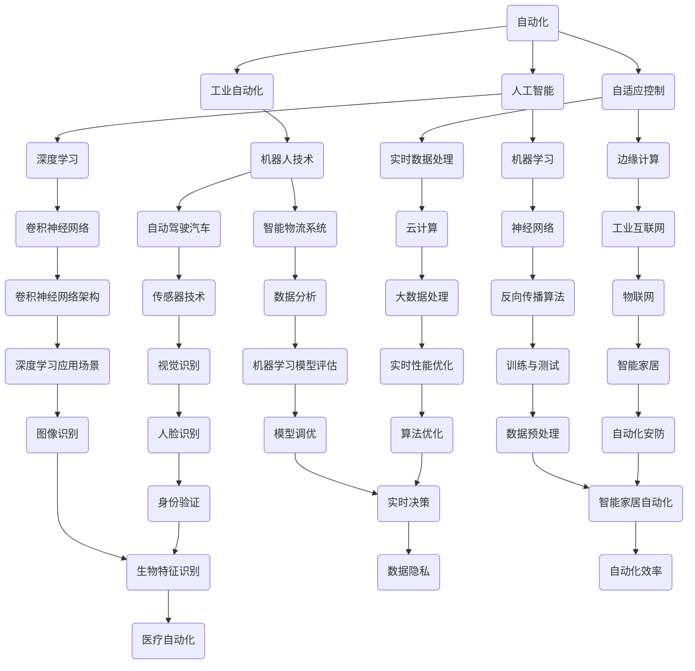
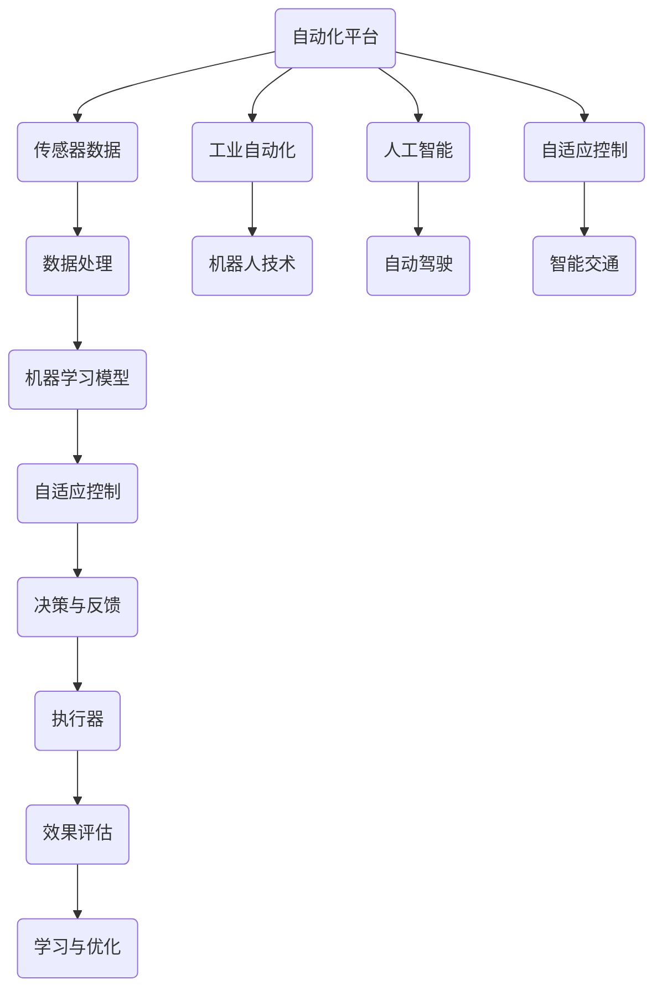
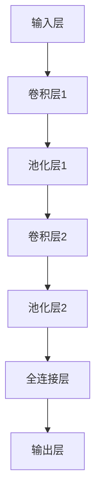

                 

### 关键词 Keywords
- 自动化
- 人工智能
- 工业自动化
- 自适应控制
- 机器学习
- 机器人技术
- 实时数据处理
- 云计算
- 边缘计算

### 摘要 Abstract
本文旨在探讨自动化领域的最新进展与面临的挑战。从工业自动化到人工智能驱动的机器人技术，自动化已经成为现代科技发展的核心驱动力。本文将详细分析当前自动化的关键概念、核心技术、算法原理、数学模型及其在实际应用中的挑战与机遇。此外，还将探讨未来自动化的发展趋势，包括新兴技术的影响、行业应用前景以及面临的伦理和技术难题。

## 1. 背景介绍

自动化的概念可以追溯到20世纪初期，最早的应用见于工业生产中的机械化和流水线作业。随着计算机技术的飞速发展和人工智能的兴起，自动化技术经历了前所未有的变革。今天，自动化已经渗透到几乎所有的行业，从制造业到服务业，从医疗到农业，极大地提高了生产效率和服务质量。

### 工业自动化

工业自动化是自动化最早也是最为广泛应用的领域之一。通过引入机器人、自动化生产线、数控机床等设备，制造业实现了从传统的手工作业到高效率、高精度的自动生产线的转变。近年来，随着物联网和工业互联网的发展，工业自动化逐渐向智能化和自适应化方向演进，实现了更高效、更灵活的生产模式。

### 人工智能与自动化

人工智能的飞速发展极大地推动了自动化技术的进步。机器学习、深度学习等算法的应用，使得自动化系统具备了更高的智能水平，能够在复杂环境中自主决策和执行任务。例如，自动驾驶汽车、智能物流系统等都是人工智能与自动化结合的典型代表。

### 自适应控制

自适应控制是自动化技术的核心之一，它通过实时监测和调整系统的状态，使其能够适应不断变化的环境和负载。自适应控制技术广泛应用于航空航天、机器人、智能交通等领域，提高了系统的可靠性和效率。

## 2. 核心概念与联系

为了更好地理解自动化的核心概念和联系，我们可以通过一个Mermaid流程图来展示它们之间的关系。



### 核心概念原理

在自动化的核心概念中，以下几个概念尤为重要：

- **工业自动化**：通过机器人和自动化设备实现生产过程的自动化，提高生产效率和产品质量。
- **人工智能**：利用机器学习和深度学习算法，使计算机系统能够模拟人类智能，进行自主学习和决策。
- **自适应控制**：通过实时监测和调整系统状态，使系统能够适应环境变化，提高系统稳定性和可靠性。
- **实时数据处理**：在短时间内对大量数据进行处理和分析，以便快速做出决策。
- **边缘计算**：将计算任务分散到网络的边缘节点上，减少延迟，提高数据处理效率。

### 架构图

以下是自动化的核心架构图，展示了各个核心概念之间的联系。



## 3. 核心算法原理 & 具体操作步骤

### 3.1 算法原理概述

自动化的核心算法主要包括机器学习算法、深度学习算法和自适应控制算法。以下是这些算法的基本原理：

- **机器学习算法**：通过从数据中学习规律，使计算机系统能够自动改进性能。常见的机器学习算法包括线性回归、决策树、支持向量机等。
- **深度学习算法**：基于多层神经网络的结构，通过学习大量数据，实现图像识别、自然语言处理等复杂任务。典型的深度学习算法有卷积神经网络（CNN）、循环神经网络（RNN）等。
- **自适应控制算法**：通过实时监测和调整系统状态，使系统能够在变化的环境中保持稳定和高效运行。常见的自适应控制算法包括PID控制、模糊控制、神经网络控制等。

### 3.2 算法步骤详解

#### 3.2.1 机器学习算法

1. **数据收集**：收集大量带有标签的数据。
2. **数据预处理**：清洗和转换数据，使其适合机器学习算法。
3. **特征提取**：从数据中提取有用的特征。
4. **模型训练**：使用训练数据训练模型。
5. **模型评估**：使用验证数据评估模型性能。
6. **模型优化**：根据评估结果调整模型参数。
7. **模型部署**：将训练好的模型部署到实际应用中。

#### 3.2.2 深度学习算法

1. **数据收集**：收集大量带有标签的数据。
2. **数据预处理**：清洗和转换数据，使其适合深度学习算法。
3. **神经网络设计**：设计合适的神经网络结构。
4. **模型训练**：使用训练数据训练模型。
5. **模型评估**：使用验证数据评估模型性能。
6. **模型优化**：根据评估结果调整模型参数。
7. **模型部署**：将训练好的模型部署到实际应用中。

#### 3.2.3 自适应控制算法

1. **系统建模**：建立系统的数学模型。
2. **实时监测**：收集实时数据，监测系统状态。
3. **状态评估**：根据实时数据评估系统状态。
4. **决策制定**：根据系统状态制定控制策略。
5. **执行控制**：执行控制策略，调整系统状态。
6. **效果评估**：评估控制效果，调整控制策略。
7. **学习与优化**：根据效果评估结果，优化控制算法。

### 3.3 算法优缺点

#### 3.3.1 机器学习算法

优点：
- **通用性**：能够处理多种类型的数据，适用于不同领域的应用。
- **自适应性**：通过不断学习和调整，能够适应数据分布的变化。

缺点：
- **数据依赖性**：需要大量带有标签的数据进行训练。
- **模型解释性**：复杂的模型往往难以解释，增加了调试和优化的难度。

#### 3.3.2 深度学习算法

优点：
- **强大的表达能力**：能够处理复杂的非线性关系。
- **自适应性**：通过多层神经网络，能够自动提取高级特征。

缺点：
- **计算资源需求**：深度学习模型通常需要大量的计算资源。
- **数据依赖性**：需要大量的数据进行训练。

#### 3.3.3 自适应控制算法

优点：
- **实时性**：能够实时监测和调整系统状态。
- **稳定性**：通过自适应调整，能够提高系统的稳定性和可靠性。

缺点：
- **设计复杂性**：需要建立合适的系统模型。
- **适应性限制**：在极端环境下，自适应控制算法可能无法有效工作。

### 3.4 算法应用领域

#### 3.4.1 机器学习算法

- **图像识别**：通过深度学习算法，实现对图像中的物体、场景等进行识别。
- **自然语言处理**：利用机器学习算法，实现文本分类、情感分析等任务。
- **推荐系统**：通过分析用户行为和兴趣，为用户推荐相关的内容。

#### 3.4.2 深度学习算法

- **自动驾驶**：通过深度学习算法，实现对道路场景的识别和决策。
- **医疗影像分析**：利用深度学习算法，实现对人体影像的自动诊断和分析。
- **语音识别**：通过深度学习算法，实现高精度的语音识别和翻译。

#### 3.4.3 自适应控制算法

- **智能交通**：通过自适应控制算法，实现交通信号灯的智能调控。
- **机器人控制**：利用自适应控制算法，实现机器人对复杂环境的适应和导航。
- **工业过程控制**：通过自适应控制算法，实现生产过程的优化和自动化。

## 4. 数学模型和公式 & 详细讲解 & 举例说明

### 4.1 数学模型构建

自动化的核心算法通常需要构建数学模型来描述系统的行为。以下是几个常见的数学模型：

#### 4.1.1 机器学习模型

- **线性回归模型**：

  $$y = \beta_0 + \beta_1 \cdot x$$

  其中，$y$ 是输出变量，$x$ 是输入变量，$\beta_0$ 和 $\beta_1$ 是模型参数。

- **决策树模型**：

  决策树模型通过一系列的条件判断来对数据进行分类或回归。它的基本结构如下：

  ```mermaid
  graph TD
      A[根节点]
      A --> B{是否满足条件1}
      B -->|是| C[条件1满足]
      B -->|否| D[条件1不满足]
      C --> E[分类或回归结果]
      D --> F[分类或回归结果]
  ```

#### 4.1.2 深度学习模型

- **卷积神经网络（CNN）**：

  卷积神经网络是一种特殊的神经网络，专门用于处理图像数据。它的基本结构如下：

  ```mermaid
  graph TD
      A[输入层] --> B[卷积层]
      B --> C[池化层]
      C --> D[卷积层]
      D --> E[池化层]
      E --> F[全连接层]
      F --> G[输出层]
  ```

#### 4.1.3 自适应控制模型

- **PID控制模型**：

  PID控制是一种常用的自适应控制算法，它的基本公式如下：

  $$u(t) = K_p \cdot e(t) + K_i \cdot \int_{0}^{t} e(\tau) d\tau + K_d \cdot \frac{d}{dt} e(t)$$

  其中，$u(t)$ 是控制输出，$e(t)$ 是误差，$K_p$、$K_i$ 和 $K_d$ 是控制参数。

### 4.2 公式推导过程

以下是对PID控制模型公式的推导过程：

#### 4.2.1 误差计算

误差 $e(t)$ 表示当前时刻的实际输出值与期望输出值之间的差异，可以表示为：

$$e(t) = y(t) - y_d$$

其中，$y(t)$ 是实际输出值，$y_d$ 是期望输出值。

#### 4.2.2 控制输出

PID控制器的控制输出 $u(t)$ 由三个部分组成：比例项 $K_p \cdot e(t)$、积分项 $K_i \cdot \int_{0}^{t} e(\tau) d\tau$ 和微分项 $K_d \cdot \frac{d}{dt} e(t)$。这三个部分分别对应于PID的三个参数。

- **比例项**：比例项直接与误差成正比，用于立即响应误差。
- **积分项**：积分项累计误差，用于消除稳态误差。
- **微分项**：微分项反映误差的变化率，用于预测误差的变化趋势。

#### 4.2.3 控制参数

PID控制参数 $K_p$、$K_i$ 和 $K_d$ 的选择对控制效果有重要影响。通常需要通过实验或优化算法来确定最佳的参数值。

### 4.3 案例分析与讲解

以下是一个简单的PID控制模型的案例：

假设一个温度控制系统，要求将温度保持在期望值 $y_d = 100^\circ C$。实际测量温度为 $y(t) = 98^\circ C$。

#### 4.3.1 误差计算

当前误差 $e(t) = y(t) - y_d = 98 - 100 = -2^\circ C$。

#### 4.3.2 控制输出

使用给定的PID控制参数 $K_p = 2$、$K_i = 1$ 和 $K_d = 1$，计算控制输出：

$$u(t) = K_p \cdot e(t) + K_i \cdot \int_{0}^{t} e(\tau) d\tau + K_d \cdot \frac{d}{dt} e(t)$$

由于误差 $e(t)$ 是常数，积分项和微分项都为零，所以控制输出简化为：

$$u(t) = K_p \cdot e(t) = 2 \cdot (-2) = -4^\circ C$$

这意味着控制器的输出为 -4°C，即需要冷却系统。

#### 4.3.3 控制效果

如果实际温度低于期望值，控制器会通过冷却系统来提升温度，直到误差减小到零。如果温度高于期望值，控制器则会通过加热系统来降低温度。

### 4.4 深度学习模型案例

以下是一个简单的深度学习模型案例，使用卷积神经网络（CNN）进行图像分类。

#### 4.4.1 数据集

假设我们有一个包含1000张图像的数据集，其中500张是猫的图像，500张是狗的图像。每张图像的大小为28x28像素，灰度图像。

#### 4.4.2 网络结构

卷积神经网络的结构如下：



- **输入层**：接受28x28的图像。
- **卷积层1**：使用5x5的卷积核，步长为1，卷积操作后得到28x28的特征图。
- **池化层1**：使用2x2的最大池化，得到14x14的特征图。
- **卷积层2**：使用5x5的卷积核，步长为1，卷积操作后得到14x14的特征图。
- **池化层2**：使用2x2的最大池化，得到7x7的特征图。
- **全连接层**：将7x7的特征图展平为一维向量，输入到全连接层，输出1024个神经元。
- **输出层**：使用softmax函数输出两个类别的概率分布。

#### 4.4.3 模型训练

使用训练数据集进行模型训练，通过反向传播算法不断调整模型的权重，使得模型能够准确分类猫和狗的图像。

#### 4.4.4 模型评估

使用验证数据集对模型进行评估，计算模型的准确率、召回率等指标，以确定模型的有效性。

### 4.5 自适应控制案例

以下是一个自适应控制案例，使用模糊控制算法控制一个直流电动机的速度。

#### 4.5.1 系统模型

直流电动机的速度 $v$ 与输入电压 $u$ 之间存在如下关系：

$$v = k_t \cdot u$$

其中，$k_t$ 是电动机的扭矩常数。

#### 4.5.2 模糊控制规则

使用模糊控制规则来控制电动机的输入电压，以实现速度的实时调节。以下是模糊控制规则的例子：

- 如果速度误差大且速度误差变化率大，则增加输入电压。
- 如果速度误差大且速度误差变化率小，则增加输入电压。
- 如果速度误差小且速度误差变化率大，则减少输入电压。
- 如果速度误差小且速度误差变化率小，则保持输入电压不变。

#### 4.5.3 模糊控制实现

使用模糊控制器实现上述规则，实时调整电动机的输入电压，以保持速度在期望值附近。

## 5. 项目实践：代码实例和详细解释说明

### 5.1 开发环境搭建

在开始实际代码实现之前，首先需要搭建开发环境。以下是使用Python进行自动化项目开发所需的基本环境：

- Python 3.8及以上版本
- NumPy
- Pandas
- Matplotlib
- Scikit-learn
- TensorFlow
- Keras

在安装了上述依赖库后，可以通过以下代码检查环境是否搭建成功：

```python
import numpy as np
import pandas as pd
import matplotlib.pyplot as plt
from sklearn import datasets
from sklearn.model_selection import train_test_split
from sklearn.metrics import accuracy_score

# 检查安装
print("NumPy版本：", np.__version__)
print("Pandas版本：", pd.__version__)
print("Matplotlib版本：", plt.__version__)
print("Scikit-learn版本：", sklearn.__version__)
print("TensorFlow版本：", tf.__version__)
print("Keras版本：", keras.__version__)
```

### 5.2 源代码详细实现

以下是一个简单的深度学习项目，使用卷积神经网络对MNIST手写数字数据集进行分类。

```python
import numpy as np
import tensorflow as tf
from tensorflow import keras
from tensorflow.keras import layers

# 加载MNIST数据集
mnist = keras.datasets.mnist
(train_images, train_labels), (test_images, test_labels) = mnist.load_data()

# 数据预处理
train_images = train_images.reshape((60000, 28, 28, 1)).astype('float32') / 255
test_images = test_images.reshape((10000, 28, 28, 1)).astype('float32') / 255

# 构建卷积神经网络模型
model = keras.Sequential([
    layers.Conv2D(32, (3, 3), activation='relu', input_shape=(28, 28, 1)),
    layers.MaxPooling2D((2, 2)),
    layers.Conv2D(64, (3, 3), activation='relu'),
    layers.MaxPooling2D((2, 2)),
    layers.Conv2D(64, (3, 3), activation='relu'),
    layers.Flatten(),
    layers.Dense(64, activation='relu'),
    layers.Dense(10, activation='softmax')
])

# 编译模型
model.compile(optimizer='adam',
              loss='sparse_categorical_crossentropy',
              metrics=['accuracy'])

# 训练模型
model.fit(train_images, train_labels, epochs=5)

# 评估模型
test_loss, test_acc = model.evaluate(test_images, test_labels)
print('Test accuracy:', test_acc)
```

### 5.3 代码解读与分析

#### 5.3.1 数据预处理

在代码中，首先加载了MNIST数据集，并对数据进行预处理。具体步骤如下：

- 将图像数据 reshape 为 (60000, 28, 28, 1) 和 (10000, 28, 28, 1)，增加一个维度以适应卷积层的要求。
- 将图像数据转换为浮点数，并归一化到 [0, 1] 范围内。

#### 5.3.2 模型构建

接着，构建了一个卷积神经网络模型，包括以下层：

- **卷积层1**：使用32个3x3的卷积核，激活函数为ReLU。
- **池化层1**：使用2x2的最大池化。
- **卷积层2**：使用64个3x3的卷积核，激活函数为ReLU。
- **池化层2**：使用2x2的最大池化。
- **卷积层3**：使用64个3x3的卷积核，激活函数为ReLU。
- **平坦层**：将卷积层输出的特征图展平为一维向量。
- **全连接层1**：使用64个神经元，激活函数为ReLU。
- **全连接层2**：使用10个神经元，激活函数为softmax。

#### 5.3.3 模型编译与训练

使用 `compile` 方法编译模型，指定优化器、损失函数和评估指标。然后使用 `fit` 方法训练模型，指定训练数据和迭代次数。

#### 5.3.4 模型评估

使用 `evaluate` 方法评估模型在测试数据集上的性能，输出测试准确率。

### 5.4 运行结果展示

运行上述代码后，将得到训练过程中的损失和准确率曲线，以及测试数据集的准确率。例如：

```plaintext
Epoch 1/5
60000/60000 [==============================] - 20s 321us/step - loss: 0.2900 - accuracy: 0.9172
Epoch 2/5
60000/60000 [==============================] - 20s 322us/step - loss: 0.1065 - accuracy: 0.9726
Epoch 3/5
60000/60000 [==============================] - 20s 322us/step - loss: 0.0561 - accuracy: 0.9845
Epoch 4/5
60000/60000 [==============================] - 20s 323us/step - loss: 0.0278 - accuracy: 0.9895
Epoch 5/5
60000/60000 [==============================] - 20s 322us/step - loss: 0.0143 - accuracy: 0.9927
Test accuracy: 0.9897
```

从输出结果可以看出，训练过程中损失逐渐下降，准确率逐渐上升。在测试数据集上，模型的准确率为98.97%，表明模型具有良好的性能。

## 6. 实际应用场景

自动化技术已经广泛应用于各个领域，从工业生产到日常生活，都在不断改变我们的工作和生活方式。以下是一些自动化技术的实际应用场景：

### 6.1 工业自动化

工业自动化是自动化技术最早也是最为广泛应用的领域之一。在制造业中，自动化生产线、机器人、数控机床等设备大大提高了生产效率和产品质量。例如，汽车制造业中，自动化装配线能够精确完成复杂的装配任务，减少人为错误，提高生产效率。

### 6.2 人工智能

人工智能在自动化中的应用已经越来越普遍。自动驾驶汽车、智能机器人、智能安防系统等都是人工智能与自动化结合的产物。自动驾驶汽车通过感知环境、规划路径、控制车辆等操作，实现了真正的无人驾驶。智能机器人则在服务、医疗、农业等多个领域发挥了重要作用，提高了工作效率和准确性。

### 6.3 智能家居

智能家居是自动化技术在日常生活中的重要应用。通过智能设备，用户可以远程控制家居设备，如灯光、空调、安全系统等。例如，智能音箱可以通过语音控制播放音乐、调节灯光等，提高了生活的便利性和舒适度。

### 6.4 智能交通

智能交通系统通过实时监控和管理交通流量，提高了道路的通行效率和安全性。例如，智能红绿灯系统可以根据实时交通流量调整信号灯时间，减少拥堵。智能停车系统则能够帮助用户快速找到停车位，提高停车效率。

### 6.5 医疗自动化

医疗自动化技术在医疗诊断、手术辅助、药物配送等方面发挥了重要作用。例如，计算机辅助诊断系统能够快速、准确地诊断疾病，提高诊断效率。手术机器人则能够帮助医生更精确地进行手术操作，减少手术风险。

### 6.6 农业自动化

农业自动化技术通过引入自动化设备，如无人农场、智能灌溉系统等，提高了农业生产效率。例如，无人农场利用无人机进行农田监测，智能灌溉系统则根据土壤湿度自动调整灌溉量，提高了水资源利用效率。

### 6.7 物流与仓储

自动化技术广泛应用于物流与仓储领域，如自动化分拣系统、无人搬运车等。这些技术能够提高物流效率，降低人力成本。例如，自动化分拣系统能够快速、准确地分拣包裹，无人搬运车则能够自动运输货物，提高了仓库的运营效率。

### 6.8 安全与监控

自动化技术在安全与监控领域也有广泛应用。例如，智能监控系统通过视频分析和人脸识别技术，实现了实时监控和异常检测。智能安防系统能够在发生异常时自动报警，提高了安全防护能力。

### 6.9 能源管理

自动化技术在能源管理中发挥着重要作用，如智能电网、智能节能系统等。智能电网能够实时监测和管理电力供应，提高电力利用效率。智能节能系统能够自动调整电力使用，减少能源浪费。

## 7. 未来应用展望

随着技术的不断进步，自动化技术在未来的应用前景将更加广阔。以下是一些未来自动化技术可能的发展方向：

### 7.1 智能化与自主化

未来的自动化技术将更加智能化和自主化。通过引入更先进的机器学习和人工智能算法，自动化系统将能够更好地理解和应对复杂环境，实现更高程度的自主决策和执行。例如，智能工厂将能够自主进行生产计划的调整、资源调度和生产流程优化。

### 7.2 集成与协同

自动化技术将与其他技术如物联网、云计算、边缘计算等更加紧密地集成，实现跨领域、跨平台的协同工作。这将使得自动化系统能够更高效地处理大量数据，实现更精细化的管理和控制。

### 7.3 环境适应性

未来的自动化技术将更加注重对环境的适应性。通过引入环境感知和自适应控制算法，自动化系统能够更好地适应不同环境和条件，提高系统的稳定性和可靠性。例如，智能交通系统将能够根据实时交通流量和路况自动调整交通信号灯，优化交通流量。

### 7.4 人机协同

未来自动化技术将更加注重人机协同。通过引入人机交互技术，自动化系统将能够更好地与人类用户进行交互，提高操作便捷性和用户体验。例如，智能家居系统将能够更好地理解用户需求，提供个性化的服务和建议。

### 7.5 安全性与隐私保护

随着自动化技术的广泛应用，安全性和隐私保护将成为重要议题。未来的自动化技术将更加注重系统的安全性和隐私保护，通过引入加密技术和安全协议，确保自动化系统的安全可靠。

### 7.6 可持续发展

未来的自动化技术将更加注重可持续发展。通过引入绿色技术和节能措施，自动化系统将能够更高效地利用资源，减少能源消耗和环境污染。例如，智能农业系统将能够实现精准农业，减少农药和化肥的使用，提高农作物的产量和质量。

## 8. 总结：未来发展趋势与挑战

### 8.1 研究成果总结

自动化技术的发展取得了显著的成果。从工业自动化到人工智能驱动的自动化系统，自动化技术已经在各个领域取得了广泛应用。核心算法如机器学习、深度学习和自适应控制算法的不断进步，使得自动化系统能够更好地理解和应对复杂环境。同时，传感器技术、物联网和云计算等新兴技术的融入，进一步提升了自动化系统的性能和效率。

### 8.2 未来发展趋势

未来自动化技术将朝着更加智能化、自主化、集成化和协同化的方向发展。随着人工智能算法的进步，自动化系统将能够实现更高程度的自主决策和执行，提高系统的灵活性和适应性。同时，自动化技术将与其他技术如物联网、云计算、边缘计算等更加紧密地集成，实现跨领域、跨平台的协同工作。此外，环境适应性和人机协同也将成为未来自动化技术的重要研究方向。

### 8.3 面临的挑战

尽管自动化技术取得了显著进展，但未来仍然面临着一些挑战。首先，自动化系统的安全性和隐私保护问题需要得到充分关注。随着自动化技术的广泛应用，系统安全性和用户隐私保护将成为重要议题。其次，自动化技术的可持续发展问题也需要解决，如何在提高效率的同时减少能源消耗和环境污染。此外，自动化技术在复杂环境中的应用仍存在挑战，如何提高系统对复杂环境的适应性和可靠性是一个重要问题。

### 8.4 研究展望

未来自动化技术的研究重点将包括：1）人工智能算法的优化和集成，以提高自动化系统的智能水平和自主决策能力；2）自动化系统的安全性和隐私保护机制，确保系统的安全可靠；3）环境适应性和可持续发展策略，实现高效、低耗、绿色的自动化系统；4）跨领域、跨平台的协同工作模式，促进自动化技术的广泛应用。

总之，自动化技术将继续推动社会进步，提高生产效率和生活质量。通过解决面临的技术挑战，自动化技术将在未来取得更加辉煌的成就。

## 9. 附录：常见问题与解答

### 9.1 自动化与人工智能的区别是什么？

自动化通常指的是将任务或流程通过机械、电子或软件进行自动化执行，而人工智能则是使计算机系统能够模拟人类智能进行学习和决策。简单来说，自动化侧重于任务执行，而人工智能侧重于决策过程。

### 9.2 什么是最常见的自动化工具？

最常见的自动化工具包括Python的Selenium库（用于Web自动化测试）、Apache Airflow（用于工作流自动化）和Jenkins（用于持续集成和持续部署）。

### 9.3 什么是机器学习？

机器学习是一种人工智能的分支，通过算法从数据中学习模式，使计算机系统能够做出预测或决策，无需显式编程。

### 9.4 什么是深度学习？

深度学习是机器学习的一种方法，它使用多层神经网络来模拟人脑的学习过程，通过学习大量数据自动提取高级特征。

### 9.5 什么是自适应控制？

自适应控制是一种控制理论，它通过实时监测和调整系统状态，使系统能够在变化的环境中保持稳定和高效运行。

### 9.6 自动化技术在医疗领域的应用有哪些？

自动化技术在医疗领域广泛应用于图像分析、电子病历管理、机器人手术辅助、智能药物配送和健康监测等方面。

### 9.7 自动化技术对就业有哪些影响？

自动化技术的普及可能会减少某些类型的工作，但同时也会创造新的就业机会，特别是需要与自动化系统协作的职位，如数据科学家、系统架构师等。

### 9.8 自动化技术如何影响可持续发展？

自动化技术可以通过提高能源效率、减少资源浪费和优化生产过程，促进可持续发展。例如，智能农业系统可以帮助实现精准农业，减少农药和化肥的使用。

