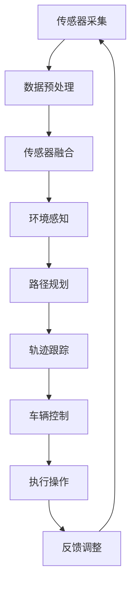

                 

关键词：自动驾驶，人工智能，商业化，技术路径，算法，应用场景

## 摘要

自动驾驶技术的商业化进程正以前所未有的速度推进。作为人工智能领域的一个重要分支，自动驾驶技术不仅在理论上具有重大突破，而且在实践应用中展现了巨大的潜力。本文旨在探讨自动驾驶AI技术的商业化路径，从技术原理、核心算法、数学模型、项目实践、应用场景等方面进行全面分析，同时展望其未来发展前景和面临的挑战。

## 1. 背景介绍

自动驾驶技术，通常定义为无需人为干预，能够自主完成车辆驾驶任务的高级驾驶辅助系统（ADAS）。自21世纪初以来，随着计算机视觉、深度学习、传感器融合、控制理论等技术的飞速发展，自动驾驶技术逐渐从实验室走向实际应用。在全球范围内，自动驾驶技术已经成为各国政府和企业竞争的焦点。

自动驾驶技术按自动化等级可分为L0至L5级，其中L5级别的完全自动驾驶被认为是最终的理想状态。尽管目前完全自动驾驶技术尚未普及，但L2和L3级别的自动驾驶系统已在不少车型上实现商业化部署。这些系统在车道保持、自适应巡航控制、自动泊车等方面已表现出较高的实用性和安全性。

## 2. 核心概念与联系

### 2.1 自动驾驶技术的核心概念

- **传感器融合**：自动驾驶系统中，多种传感器如摄像头、激光雷达、超声波雷达等协同工作，通过传感器融合技术处理多源数据，实现环境感知。
- **深度学习**：基于神经网络的结构，深度学习算法通过对大量图像和数据进行训练，能够识别道路、车辆、行人等目标，进行行为预测和决策。
- **控制算法**：包括路径规划、轨迹跟踪、车辆控制等，确保车辆按照预定的路径行驶。
- **云端服务**：自动驾驶车辆通过车载传感器收集数据，上传至云端进行分析和处理，实现车辆间的通信和协同驾驶。

### 2.2 Mermaid 流程图



## 3. 核心算法原理 & 具体操作步骤

### 3.1 算法原理概述

自动驾驶算法主要包括环境感知、路径规划、轨迹跟踪和车辆控制四个核心部分。环境感知通过传感器融合技术实现对周围环境的感知和理解；路径规划根据当前和未来道路情况，规划出最优行驶路径；轨迹跟踪则确保车辆按照规划路径行驶；车辆控制通过控制算法实现车辆的加速、减速、转向等操作。

### 3.2 算法步骤详解

1. **环境感知**：使用传感器融合技术处理多源数据，实现对道路、车辆、行人等的检测和跟踪。
2. **路径规划**：基于当前道路和交通状况，利用图论算法（如Dijkstra算法）或基于采样的RRT算法等，规划出最优行驶路径。
3. **轨迹跟踪**：使用PID控制器或模型预测控制（MPC）算法，根据实时车辆状态和路径规划结果，生成轨迹并控制车辆行驶。
4. **车辆控制**：根据轨迹跟踪结果，通过控制车辆的加速、减速、转向等操作，确保车辆按照规划路径行驶。

### 3.3 算法优缺点

- **优点**：提高了行车安全性，降低了交通事故率；提高了交通效率，减少了拥堵；实现了无人驾驶的愿景，具有巨大的社会和经济价值。
- **缺点**：技术尚未完全成熟，尤其在恶劣天气、复杂路况等情况下，自动驾驶系统的稳定性有待提高；隐私和安全问题仍需解决；法律法规和社会接受度有待提高。

### 3.4 算法应用领域

- **乘用车**：自动驾驶乘用车已经进入量产阶段，L2和L3级别的自动驾驶系统在市场上有较高的普及率。
- **商用车**：如货车、公交车等，自动驾驶技术在提高运输效率、降低运营成本方面具有显著优势。
- **特殊场景**：如无人配送车、无人出租车、无人清扫车等，自动驾驶技术在这些特殊场景中已有所应用。

## 4. 数学模型和公式 & 详细讲解 & 举例说明

### 4.1 数学模型构建

自动驾驶中的数学模型主要包括：

- **感知模型**：用于描述传感器数据的特征提取和目标检测。
- **规划模型**：用于描述路径规划和轨迹生成。
- **控制模型**：用于描述车辆的控制策略。

### 4.2 公式推导过程

以路径规划为例，使用Dijkstra算法进行路径规划的公式推导如下：

$$
Dijkstra(s, t) = \min_{x \in N} (d(s, x) + \rho(x, t))
$$

其中，$Dijkstra(s, t)$是从起点s到终点t的最短路径距离，$d(s, x)$是从起点s到节点x的边权重，$\rho(x, t)$是从节点x到终点t的剩余距离。

### 4.3 案例分析与讲解

假设有一个简单的城市交通网络，包含5个交叉路口（节点），每个路口之间的道路长度和交通状况已知。使用Dijkstra算法规划从起点A到终点E的最短路径，如下：

1. 初始化：$Dijkstra(A, E) = \infty$，除了起点A的距离为0，即$Dijkstra(A, A) = 0$。
2. 选出未访问节点中距离最短的节点B，计算$Dijkstra(B, E)$：
   $$
   Dijkstra(B, E) = \min \{Dijkstra(A, B) + Dijkstra(B, E)\} = \min \{5 + 10\} = 5
   $$
3. 访问节点B，更新未访问节点中的距离：
   $$
   Dijkstra(C, E) = \min \{Dijkstra(A, C) + Dijkstra(C, E)\} = \min \{3 + 7\} = 3
   $$
   $$
   Dijkstra(D, E) = \min \{Dijkstra(A, D) + Dijkstra(D, E)\} = \min \{2 + 8\} = 2
   $$
4. 重复上述步骤，直至到达终点E，最终路径为A->B->C->D->E，总距离为17。

## 5. 项目实践：代码实例和详细解释说明

### 5.1 开发环境搭建

为了更好地理解和实现自动驾驶算法，以下是搭建开发环境的步骤：

1. 安装Python环境，版本建议3.8及以上。
2. 安装相关库，如NumPy、Pandas、Matplotlib等。
3. 配置仿真环境，如CARLA模拟器。

### 5.2 源代码详细实现

以下是一个简单的自动驾驶算法实现，用于规划从起点到终点的最短路径：

```python
import numpy as np
import matplotlib.pyplot as plt
from scipy.sparse.csgraph import dijkstra

# 节点信息
nodes = {
    'A': [0, 0],
    'B': [5, 0],
    'C': [10, 0],
    'D': [15, 0],
    'E': [20, 0]
}

# 节点之间的权重矩阵
weights = np.array([
    [0, 5, np.inf, np.inf, np.inf],
    [5, 0, 3, 2, np.inf],
    [np.inf, 3, 0, 1, 5],
    [np.inf, 2, 1, 0, 2],
    [np.inf, np.inf, 5, 2, 0]
])

# Dijkstra算法计算最短路径
distances = dijkstra(weights, nodes='weights')

# 绘制路径
plt.figure()
plt.plot([nodes[i][0] for i in range(len(nodes))], [nodes[i][1] for i in range(len(nodes))], 'ro')
plt.plot([nodes[i][0] for i in distances[1]], [nodes[i][1] for i in distances[1]], 'b-')
plt.title('Shortest Path')
plt.xlabel('X-axis')
plt.ylabel('Y-axis')
plt.show()
```

### 5.3 代码解读与分析

- `nodes`：定义了节点的位置信息。
- `weights`：定义了节点之间的权重矩阵，表示从起点到终点的距离。
- `dijkstra`：使用SciPy库中的Dijkstra算法计算最短路径。
- `plt.plot`：使用Matplotlib库绘制路径图。

### 5.4 运行结果展示

运行代码后，将生成一个路径图，展示从起点A到终点E的最短路径。

## 6. 实际应用场景

### 6.1 乘用车

自动驾驶乘用车已经逐渐成为市场的新宠。特斯拉的Autopilot系统、百度的Apollo自动驾驶平台、Waymo的自动驾驶出租车服务等，都是自动驾驶技术在实际乘用车领域的成功应用。

### 6.2 商用车

在物流和公共交通领域，自动驾驶技术也展现出了巨大的应用潜力。亚马逊的无人配送车、京东的无人货车等，都在提高运输效率、降低成本方面取得了显著成效。

### 6.3 特殊场景

在特殊场景下，如矿山、农场等，自动驾驶技术同样有着广泛的应用。这些场景下，车辆需要在不同环境下工作，自动驾驶技术的稳定性和适应性尤为重要。

## 7. 工具和资源推荐

### 7.1 学习资源推荐

- 《深度学习》（Ian Goodfellow、Yoshua Bengio、Aaron Courville 著）
- 《Python深度学习》（François Chollet 著）
- 《机器学习》（周志华 著）

### 7.2 开发工具推荐

- CARLA模拟器：用于自动驾驶算法的开发和测试。
- PyTorch、TensorFlow：用于深度学习的框架。
- ROS（Robot Operating System）：用于机器人应用的开发。

### 7.3 相关论文推荐

- “End-to-End Learning for Autonomous Driving”（Chris Lattner et al.）
- “Autonomous Driving using Deep Learning”（Uber AI Labs）
- “Deep Neural Network for Real-time Vehicle Detection”（Tomaso Poggio et al.）

## 8. 总结：未来发展趋势与挑战

### 8.1 研究成果总结

自动驾驶技术在过去几十年中取得了显著的研究进展，从感知、规划到控制，各个环节的技术不断成熟。深度学习、传感器融合等技术的应用，使得自动驾驶系统的性能和可靠性得到了极大提升。

### 8.2 未来发展趋势

- **全自动驾驶**：L5级别全自动驾驶技术的实现，将是未来发展的主要目标。
- **智能交通系统**：与智能交通系统（ITS）的深度融合，将提高交通效率和安全性。
- **车联网**：车联网（V2X）技术的发展，将实现车辆与车辆、车辆与基础设施之间的通信和协同。

### 8.3 面临的挑战

- **技术挑战**：包括环境感知的准确性、决策的实时性、系统的稳定性等。
- **法律法规**：自动驾驶技术的普及需要完善的法律法规体系来保障。
- **社会接受度**：公众对自动驾驶技术的信任和接受度，是推广普及的重要影响因素。

### 8.4 研究展望

未来，自动驾驶技术将在提升交通安全、提高交通效率、降低交通拥堵等方面发挥重要作用。同时，随着技术的不断成熟，自动驾驶技术将逐渐从乘用车向商用车、特殊场景应用扩展。在这个充满机遇和挑战的领域，中国企业和研究机构有望在技术创新、产业应用等方面取得更大的突破。

## 9. 附录：常见问题与解答

### 9.1 自动驾驶技术的自动化等级是什么？

自动驾驶技术按照自动化等级分为L0至L5级，其中L0为无自动化，L5为完全自动驾驶，无需人为干预。

### 9.2 自动驾驶技术的核心算法有哪些？

自动驾驶技术的核心算法包括环境感知、路径规划、轨迹跟踪和车辆控制等。

### 9.3 自动驾驶技术的未来发展趋势是什么？

未来，自动驾驶技术将向全自动驾驶、智能交通系统和车联网等方向发展。

### 9.4 自动驾驶技术在特殊场景下有哪些应用？

自动驾驶技术在特殊场景下，如矿山、农场等，有广泛的应用，如无人采矿车、无人清扫车等。

---

作者：禅与计算机程序设计艺术 / Zen and the Art of Computer Programming


