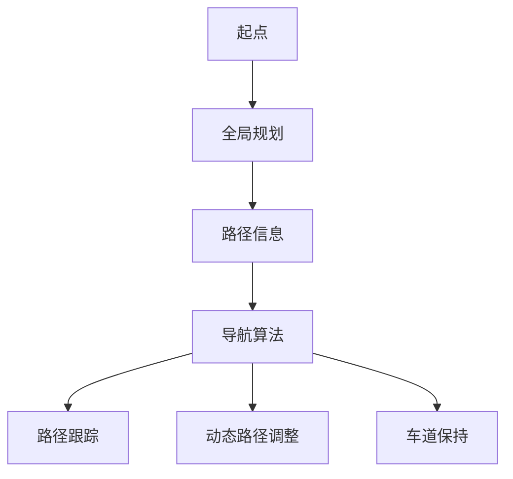

                 

## 摘要

随着自动驾驶技术的快速发展，路径规划与导航算法优化成为自动驾驶系统中的关键组成部分。本文旨在深入探讨自动驾驶系统中路径规划与导航算法的基本概念、核心原理、主要算法及其应用领域，并针对现有的算法进行优化分析。通过对数学模型、公式推导及实际项目实践的详细讲解，本文希望能够为自动驾驶领域的研究者和开发者提供有价值的参考。同时，文章还将展望未来自动驾驶路径规划与导航算法的发展趋势，以及面临的挑战和应对策略。

## 1. 背景介绍

自动驾驶技术是近年来科技领域的一个重要发展方向，它不仅代表了未来交通工具的智能化趋势，还对交通运输、城市规划、环境保护等多个领域产生深远影响。路径规划与导航算法作为自动驾驶系统的核心组成部分，其作用至关重要。

路径规划是指自动驾驶系统在给定的环境条件下，从起点到终点选择一条最优路径的过程。导航算法则是在路径规划的基础上，实时调整车辆行驶方向，确保车辆按照规划路径安全、准确地到达目标位置。路径规划与导航算法的优化直接影响到自动驾驶系统的性能、安全性及用户体验。

自动驾驶系统的发展历程可以追溯到20世纪50年代，早期的研究主要集中在路径规划算法的简单实现上。随着计算机技术的进步和传感器技术的发展，自动驾驶系统逐渐从理论走向实践，并在多个实际场景中得到应用。现阶段，自动驾驶系统已经具备在复杂交通环境中进行路径规划和导航的能力，但仍面临着许多技术挑战和实际问题。

### 1.1 自动驾驶系统的发展历程

自动驾驶系统的发展历程大致可以分为以下几个阶段：

1. **感知阶段（1950-1980年代）**：这一阶段主要是对自动驾驶系统所需感知技术的研究，包括雷达、激光雷达、摄像头等传感器技术。研究主要集中在如何有效地获取和处理车辆周围环境信息。

2. **控制阶段（1980-2000年代）**：这一阶段的研究重点在于如何通过控制算法实现车辆的自动驾驶。主要算法包括PID控制、模糊控制和神经网络控制等。

3. **决策阶段（2000年代至今）**：随着计算机和传感器技术的飞速发展，自动驾驶系统开始具备复杂的决策能力，能够处理更复杂的交通场景和动态环境。

### 1.2 自动驾驶系统的现状

目前，自动驾驶系统已经从理论研究走向实际应用，多个国家和企业纷纷开展自动驾驶汽车的测试和推广工作。根据国际汽车工程师学会（SAE）的定义，自动驾驶系统可以分为0到5个级别，其中：

- 级别0：完全由人类驾驶员控制。
- 级别1：部分自动化，如自适应巡航控制。
- 级别2：部分自动化，如自动驾驶车道保持和自适应巡航控制。
- 级别3：有条件自动驾驶，车辆在特定条件下可以完全接管驾驶任务。
- 级别4：高度自动驾驶，车辆在特定场景下可以完全自动驾驶。
- 级别5：完全自动驾驶，无需人类驾驶员的干预。

现阶段，自动驾驶系统主要应用于以下领域：

1. **公共交通**：如无人驾驶公交车和出租车。
2. **物流运输**：如无人驾驶卡车和无人机配送。
3. **个人出行**：如自动驾驶私家车。
4. **特殊场景**：如矿区运输、港口搬运等。

### 1.3 自动驾驶系统的关键技术

自动驾驶系统的实现需要多种关键技术的支持，包括感知、定位、规划、控制等。

1. **感知技术**：感知技术是自动驾驶系统的“眼睛”，主要依靠雷达、激光雷达、摄像头等传感器获取周围环境信息。这些传感器能够检测前方车辆、行人、道路标志等，并将获取的信息转换为可用的数据。

2. **定位技术**：定位技术是自动驾驶系统的“大脑”，主要利用GPS、IMU（惯性测量单元）等设备实现车辆的精确定位。

3. **规划技术**：规划技术是自动驾驶系统的“决策者”，负责根据车辆周围环境信息，选择一条最优路径。常见的规划算法包括Dijkstra算法、A*算法、RRT（快速随机树）算法等。

4. **控制技术**：控制技术是自动驾驶系统的“执行者”，通过控制算法实现车辆的转向、加速和制动等操作，确保车辆按照规划路径行驶。

### 1.4 自动驾驶系统的挑战与机遇

自动驾驶系统在实际应用过程中面临许多挑战：

1. **技术挑战**：自动驾驶系统需要在复杂的交通环境中实现高度自动化，这需要强大的计算能力和高效的算法支持。

2. **法律法规挑战**：自动驾驶系统的普及需要相应的法律法规支持，包括车辆监管、交通事故责任划分等。

3. **安全性挑战**：自动驾驶系统的安全性直接关系到乘客和行人的生命安全，需要严格的安全标准和检测机制。

然而，自动驾驶系统也带来了许多机遇：

1. **提高交通效率**：自动驾驶系统能够优化交通流量，减少拥堵，提高道路利用率。

2. **降低交通事故率**：自动驾驶系统能够避免人类驾驶员的失误，降低交通事故率。

3. **改善出行体验**：自动驾驶系统可以提供更加舒适、便捷的出行体验。

综上所述，自动驾驶系统具有巨大的发展潜力和广阔的应用前景，但仍需克服众多技术、法律和安全挑战。

## 2. 核心概念与联系

### 2.1 路径规划与导航算法的基本概念

路径规划（Path Planning）是指自动驾驶系统在给定的环境条件下，从起点到终点选择一条最优路径的过程。路径规划的目的是确保车辆能够在各种交通状况下安全、高效地到达目标位置。路径规划算法可以分为全局规划和局部规划两大类。

全局规划（Global Planning）算法在车辆启动时进行一次性的路径规划，考虑的是从起点到终点的全局最优路径。全局规划算法通常在静态或变化缓慢的环境中表现较好，但在动态环境中可能无法及时响应突发情况。

局部规划（Local Planning）算法则侧重于车辆在当前环境下的即时路径规划，主要解决的是如何避开障碍物、维持车道等即时性问题。局部规划算法具有较高的实时性，但可能无法保证全局最优路径。

导航算法（Navigation）是在路径规划的基础上，实时调整车辆行驶方向，确保车辆按照规划路径安全、准确地到达目标位置。导航算法主要包括路径跟踪、动态路径调整和车道保持等功能。

### 2.2 路径规划与导航算法的相互关系

路径规划与导航算法是自动驾驶系统中紧密相连的两个部分。路径规划为导航算法提供了全局和局部的路径信息，导航算法则根据实时环境信息对路径进行动态调整，确保车辆按照规划路径行驶。

全局规划算法和局部规划算法相互配合，全局规划算法提供长远的路径信息，局部规划算法则根据实时环境变化进行调整。这种结合方式能够保证车辆在复杂交通环境中既具备全局视野，又能及时响应突发情况。

导航算法则负责将路径规划算法生成的路径转化为具体的驾驶行为，通过实时调整车辆的方向、速度等参数，确保车辆按照规划路径行驶。导航算法通常包含路径跟踪、动态路径调整和车道保持等功能。

路径规划和导航算法的相互关系可以用以下Mermaid流程图表示：



### 2.3 路径规划与导航算法的核心概念原理

#### 2.3.1 全局规划算法

全局规划算法的主要任务是在给定的环境条件下，从起点到终点选择一条最优路径。全局规划算法通常基于图论中的最短路径算法，如Dijkstra算法、A*算法等。以下是一个基于A*算法的全局规划算法原理：

1. **初始化**：创建一个图表示道路网络，其中每个节点代表一个交叉路口或路段。为每个节点设置初始距离值，起点距离为0，其他节点距离为无穷大。

2. **计算启发函数**：启发函数是估计从当前节点到目标节点的距离的函数，通常使用曼哈顿距离、欧几里得距离等。

3. **选择下一个节点**：选择F值（g值 + h值）最小的节点作为下一个节点，g值为从起点到当前节点的距离，h值为从当前节点到目标节点的启发函数值。

4. **更新路径**：将当前节点的所有未访问的邻居节点添加到开放列表中，并更新它们的F值、g值和h值。

5. **重复步骤3和步骤4**，直到找到目标节点或开放列表为空。

6. **输出路径**：从目标节点开始，沿着更新路径回溯到起点，得到最优路径。

#### 2.3.2 局部规划算法

局部规划算法主要解决车辆在当前环境下的即时路径规划问题。局部规划算法通常基于行为树（Behavior Tree）或状态机（State Machine）等实现。以下是一个基于行为树的部分局部规划算法原理：

1. **初始化**：创建一个行为树，其中包含多个节点，如前进、转向、避障等。

2. **状态监测**：实时监测车辆周围环境，如障碍物、车道线等。

3. **路径选择**：根据当前环境状态，选择行为树中的一个节点执行。例如，如果检测到前方有障碍物，选择避障节点；如果车辆偏离车道线，选择转向节点。

4. **路径执行**：执行选定的节点，调整车辆的转向、速度等参数。

5. **状态更新**：根据执行结果更新环境状态，重复步骤3和步骤4，实现实时路径规划。

#### 2.3.3 导航算法

导航算法主要实现路径跟踪、动态路径调整和车道保持等功能。以下是一个基于PID控制的导航算法原理：

1. **路径跟踪**：使用PID控制器调整车辆的方向和速度，使车辆按照规划路径行驶。其中，P（比例）控制器用于调整方向，I（积分）控制器用于消除误差，D（微分）控制器用于抑制抖动。

2. **动态路径调整**：在车辆行驶过程中，根据实时环境信息调整路径。例如，当检测到前方有障碍物时，动态调整路径以避开障碍物。

3. **车道保持**：使用车道线检测技术检测车辆是否在车道内行驶。如果车辆偏离车道线，调整车辆的转向使车辆回归车道。

通过全局规划算法、局部规划算法和导航算法的相互配合，自动驾驶系统能够实现复杂的路径规划和导航任务，从而在复杂交通环境中安全、高效地行驶。

### 2.4 路径规划与导航算法的优缺点

#### 2.4.1 全局规划算法

**优点**：

1. **全局视野**：全局规划算法能够在起点和终点之间选择最优路径，考虑到了道路网络的整体布局，具有较高的路径优化能力。
2. **稳定性**：全局规划算法在静态或变化缓慢的环境中表现稳定，能够在较长的时间内保持路径的有效性。

**缺点**：

1. **实时性较差**：全局规划算法通常需要较高的计算资源，实时性较差，无法在动态环境中及时响应突发情况。
2. **复杂度较高**：全局规划算法涉及复杂的图论算法和启发函数设计，实现难度较大。

#### 2.4.2 局部规划算法

**优点**：

1. **实时性较好**：局部规划算法能够在车辆行驶过程中实时调整路径，具有较强的动态响应能力。
2. **计算效率高**：局部规划算法通常采用简单的行为树或状态机实现，计算效率较高，适用于实时控制系统。

**缺点**：

1. **路径优化能力较差**：局部规划算法主要解决即时路径规划问题，无法提供全局最优路径。
2. **稳定性较差**：局部规划算法在复杂环境中容易受到环境噪声和不确定性因素的影响，稳定性较差。

#### 2.4.3 导航算法

**优点**：

1. **路径跟踪精度高**：导航算法能够精确调整车辆的方向和速度，使车辆按照规划路径行驶。
2. **动态调整能力**：导航算法能够根据实时环境信息动态调整路径，提高行驶安全性。

**缺点**：

1. **依赖环境信息**：导航算法需要准确的环境信息支持，如车道线、障碍物等，环境信息的缺失或错误可能导致导航失效。
2. **计算资源需求高**：导航算法涉及多种传感器和控制器，计算资源需求较高。

通过对比分析，我们可以发现不同类型的路径规划与导航算法各有优缺点，实际应用中需要根据具体场景和需求进行选择和优化。

### 2.5 路径规划与导航算法的应用领域

路径规划与导航算法在自动驾驶系统中具有广泛的应用领域，以下是一些主要的应用场景：

#### 2.5.1 个人出行

个人出行是自动驾驶技术的一个重要应用领域。在个人出行中，路径规划与导航算法需要解决以下问题：

1. **最优路径选择**：在复杂的城市道路网络中，为车辆选择一条最优路径，减少行驶时间和能耗。
2. **动态路径调整**：在行驶过程中，根据实时交通状况和障碍物信息动态调整路径，确保车辆安全、高效地行驶。
3. **车道保持**：在多变的车道环境中，保持车辆在车道内行驶，防止偏离车道。

#### 2.5.2 公共交通

公共交通是自动驾驶技术的另一个重要应用领域。在公共交通中，路径规划与导航算法需要解决以下问题：

1. **线路规划**：为公交车、地铁等公共交通工具规划合理的行驶路线，提高线路的覆盖率和利用率。
2. **实时导航**：在公共交通工具的行驶过程中，根据实时交通状况和乘客需求动态调整行驶路线，提高运行效率和乘客满意度。
3. **乘客导航**：为乘客提供实时导航服务，帮助乘客了解公共交通工具的实时位置和到达时间。

#### 2.5.3 物流运输

物流运输是自动驾驶技术的另一个重要应用领域。在物流运输中，路径规划与导航算法需要解决以下问题：

1. **最优路径选择**：为物流车辆选择一条最优路径，减少运输时间和成本。
2. **动态路径调整**：在物流运输过程中，根据实时交通状况和障碍物信息动态调整路径，确保物流运输的安全和高效。
3. **车队管理**：为物流车队提供路径规划和导航服务，实现车队的高效调度和管理。

#### 2.5.4 特殊场景

特殊场景是自动驾驶技术的另一个重要应用领域。在特殊场景中，路径规划与导航算法需要解决以下问题：

1. **地形适应**：在复杂地形中，为自动驾驶车辆选择一条可行路径，确保车辆能够安全通过。
2. **动态路径调整**：在特殊场景中，根据实时环境变化动态调整路径，确保车辆能够适应复杂环境。
3. **障碍物避让**：在特殊场景中，如矿区、港口等，为自动驾驶车辆提供障碍物避让功能，确保车辆的安全行驶。

通过在不同应用领域的应用，路径规划与导航算法为自动驾驶系统提供了强大的技术支持，推动了自动驾驶技术的快速发展。

## 3. 核心算法原理 & 具体操作步骤

### 3.1 算法原理概述

在自动驾驶系统中，路径规划与导航算法起着至关重要的作用。本文将重点介绍两种核心算法：A*算法和RRT（快速随机树）算法。这两种算法分别适用于不同的场景，具有各自的优缺点。

#### 3.1.1 A*算法

A*算法是一种基于启发式的最短路径算法，广泛应用于路径规划领域。A*算法的基本思想是从起点开始，逐步扩展节点，直到找到目标节点。算法的核心是启发函数，它用于估计从当前节点到目标节点的距离。A*算法的优点是能够找到全局最优路径，但缺点是计算复杂度较高，不适合实时路径规划。

#### 3.1.2 RRT算法

RRT算法是一种基于采样的随机路径规划算法，适用于动态环境和未知环境。RRT算法的基本思想是通过随机采样生成路径，并通过优化算法逐步逼近最优路径。RRT算法的优点是计算复杂度较低，适合实时路径规划，但缺点是难以保证找到全局最优路径。

### 3.2 算法步骤详解

#### 3.2.1 A*算法步骤详解

1. **初始化**：

   - 创建一个图表示道路网络，其中每个节点代表一个交叉路口或路段。
   - 为每个节点设置初始距离值，起点距离为0，其他节点距离为无穷大。
   - 创建一个开放列表（Open List）和一个关闭列表（Closed List），用于存储待访问节点和已访问节点。

2. **计算启发函数**：

   - 启发函数（Heuristic Function）是估计从当前节点到目标节点的距离的函数，通常使用曼哈顿距离、欧几里得距离等。

3. **选择下一个节点**：

   - 选择F值（g值 + h值）最小的节点作为下一个节点，g值为从起点到当前节点的距离，h值为从当前节点到目标节点的启发函数值。

4. **更新路径**：

   - 将当前节点的所有未访问的邻居节点添加到开放列表中，并更新它们的F值、g值和h值。
   - 将当前节点从开放列表移动到关闭列表。

5. **重复步骤3和步骤4**，直到找到目标节点或开放列表为空。

6. **输出路径**：

   - 从目标节点开始，沿着更新路径回溯到起点，得到最优路径。

#### 3.2.2 RRT算法步骤详解

1. **初始化**：

   - 创建一个节点表示起始点，将其添加到树中。
   - 创建一个目标点，用于指导树的扩展。

2. **随机采样**：

   - 在环境中随机采样一个新节点。
   - 计算新节点与树中最近节点的距离。

3. **路径规划**：

   - 使用优化算法（如贝塞尔曲线）将最近节点和新节点连接，生成一条路径。
   - 判断生成的路径是否可行，若不可行，返回步骤2。

4. **路径优化**：

   - 对生成的路径进行优化，使其更加平滑。
   - 优化过程中，可以采用动态窗口方法（Dynamic Window Approach）等算法。

5. **重复步骤2和步骤3**，直到目标点被添加到树中。

6. **输出路径**：

   - 从起始点开始，沿着树中的路径回溯到目标点，得到最优路径。

### 3.3 算法优缺点

#### 3.3.1 A*算法优缺点

**优点**：

- 能够找到全局最优路径。
- 适用范围广泛，适用于静态和动态环境。

**缺点**：

- 计算复杂度较高，不适合实时路径规划。
- 启发函数的设计对算法性能有较大影响。

#### 3.3.2 RRT算法优缺点

**优点**：

- 计算复杂度较低，适合实时路径规划。
- 能够处理动态环境和未知环境。

**缺点**：

- 难以保证找到全局最优路径。
- 可能会生成冗余的路径。

### 3.4 算法应用领域

#### 3.4.1 个人出行

在个人出行中，A*算法和RRT算法都有广泛的应用。A*算法适用于静态道路网络，如高速公路和城市主干道，可以找到全局最优路径。RRT算法适用于动态交通环境，如城市交叉口和停车场，能够实时调整路径，适应交通状况变化。

#### 3.4.2 公共交通

在公共交通中，A*算法常用于线路规划和动态导航，能够为公交车和地铁等公共交通工具提供高效、安全的路径。RRT算法适用于公交车的临时路线调整，如紧急情况下的路线更改。

#### 3.4.3 物流运输

在物流运输中，A*算法适用于确定物流车辆的长期路线，如长途运输。RRT算法适用于物流车辆的实时路径规划，如在城市交通中的灵活调度。

#### 3.4.4 特殊场景

在特殊场景中，如矿区和港口，A*算法和RRT算法都有应用。A*算法适用于已知地形和路径的规划，如矿区运输。RRT算法适用于未知地形和路径的规划，如港口的货物搬运。

通过在不同应用领域的应用，A*算法和RRT算法为自动驾驶系统提供了强大的路径规划与导航支持，推动了自动驾驶技术的快速发展。

### 4. 数学模型和公式 & 详细讲解 & 举例说明

在路径规划与导航算法中，数学模型和公式起着至关重要的作用。本文将详细介绍路径规划中的A*算法和RRT算法的数学模型和公式，并通过具体的例子进行讲解，帮助读者更好地理解这些算法的核心原理。

#### 4.1 数学模型构建

路径规划中的数学模型通常包括以下几个关键组成部分：

1. **状态空间**：状态空间表示车辆在环境中的位置和姿态。状态通常用一组坐标表示，如$(x, y, \theta)$，其中$x$和$y$表示车辆的横纵向位置，$\theta$表示车辆的方向。

2. **成本函数**：成本函数用于衡量从起点到终点的路径代价。成本函数通常包括两个部分：移动成本和障碍物成本。移动成本是指车辆从一个位置移动到另一个位置所需的代价，通常与距离和速度有关。障碍物成本是指车辆在路径上遇到障碍物时的额外代价。

3. **启发函数**：启发函数用于估计从当前节点到目标节点的最短路径长度。启发函数的设计对路径规划算法的性能有很大影响，常见的启发函数包括曼哈顿距离、欧几里得距离和角度启发函数等。

4. **路径规划算法**：路径规划算法根据状态空间、成本函数和启发函数来确定最优路径。常见的路径规划算法包括A*算法、RRT算法等。

#### 4.2 公式推导过程

以下将分别介绍A*算法和RRT算法的数学模型和公式推导过程。

##### 4.2.1 A*算法

A*算法的核心公式如下：

$$
f(n) = g(n) + h(n)
$$

其中，$f(n)$表示节点$n$的评估函数，$g(n)$表示从起点到节点$n$的实际代价，$h(n)$表示从节点$n$到目标节点的启发函数估计代价。

**（1）实际代价 $g(n)$**

实际代价$g(n)$通常表示从起点到节点$n$的直线距离或路径长度。对于二维平面上的节点，实际代价可以表示为：

$$
g(n) = \sqrt{(x_n - x_s)^2 + (y_n - y_s)^2}
$$

其中，$(x_n, y_n)$表示节点$n$的坐标，$(x_s, y_s)$表示起点的坐标。

**（2）启发函数 $h(n)$**

启发函数$h(n)$用于估计从节点$n$到目标节点的最短路径长度。常见的启发函数包括曼哈顿距离、欧几里得距离和角度启发函数。

- **曼哈顿距离**：

$$
h(n) = |x_n - x_g| + |y_n - y_g|
$$

其中，$(x_g, y_g)$表示目标节点的坐标。

- **欧几里得距离**：

$$
h(n) = \sqrt{(x_n - x_g)^2 + (y_n - y_g)^2}
$$

- **角度启发函数**：

$$
h(n) = \theta_n - \theta_g
$$

其中，$\theta_n$表示节点$n$的方向，$\theta_g$表示目标节点的方向。

##### 4.2.2 RRT算法

RRT算法是一种基于采样的随机路径规划算法，其核心思想是通过随机采样生成路径，并通过优化算法逐步逼近最优路径。RRT算法的数学模型如下：

$$
p(t) = p(s) + \alpha \cdot (p_t - p(s))
$$

其中，$p(t)$表示在时间$t$的节点位置，$p(s)$表示起始节点位置，$p_t$表示在时间$t$的采样目标节点位置，$\alpha$表示步长。

**（1）采样目标节点 $p_t$**

采样目标节点$p_t$是在状态空间中随机采样的。常用的采样方法包括均匀采样和目标点采样。

- **均匀采样**：

$$
p_t = (x_t, y_t) \sim U([-R, R], [-R, R])
$$

其中，$R$表示状态空间的大小。

- **目标点采样**：

$$
p_t = (x_t, y_t) \sim N(\mu_x, \sigma_x), N(\mu_y, \sigma_y)
$$

其中，$\mu_x$和$\mu_y$表示目标点的期望坐标，$\sigma_x$和$\sigma_y$表示目标点的标准差。

**（2）步长 $\alpha$**

步长$\alpha$用于控制路径规划的精细度。较小的步长可以生成更平滑的路径，但会增加计算复杂度。较大的步长可以减少计算复杂度，但生成的路径可能不够平滑。

#### 4.3 案例分析与讲解

为了更好地理解路径规划与导航算法的数学模型和公式，我们以下通过一个简单的例子进行说明。

##### 4.3.1 A*算法案例分析

假设有一个二维平面上的路径规划问题，起点坐标为$(0, 0)$，目标点坐标为$(10, 10)$。我们将使用曼哈顿距离作为启发函数。

1. **初始状态**：

   - 起点：$(0, 0)$
   - 目标点：$(10, 10)$

2. **计算实际代价 $g(n)$**：

   - $g(n) = \sqrt{(x_n - x_s)^2 + (y_n - y_s)^2} = \sqrt{(0 - 0)^2 + (0 - 0)^2} = 0$

3. **计算启发函数 $h(n)$**：

   - $h(n) = |x_n - x_g| + |y_n - y_g| = |0 - 10| + |0 - 10| = 20$

4. **选择下一个节点**：

   - 选择F值最小的节点作为下一个节点：$f(n) = g(n) + h(n) = 0 + 20 = 20$

5. **更新路径**：

   - 将当前节点添加到关闭列表，选择新的当前节点，重复步骤3-5。

6. **输出路径**：

   - 从目标节点开始，沿着更新路径回溯到起点，得到最优路径。

##### 4.3.2 RRT算法案例分析

假设有一个二维平面上的路径规划问题，起点坐标为$(0, 0)$，目标点坐标为$(10, 10)$。我们将使用均匀采样和目标点采样分别进行路径规划。

1. **初始状态**：

   - 起点：$(0, 0)$
   - 目标点：$(10, 10)$

2. **均匀采样**：

   - 采样目标点$p_t = (2, 3)$

3. **计算步长 $\alpha$**：

   - $\alpha = \frac{1}{2}$

4. **生成路径**：

   - $p(t) = p(s) + \alpha \cdot (p_t - p(s)) = (0, 0) + \frac{1}{2} \cdot (2 - 0, 3 - 0) = (1, 1.5)$

5. **重复步骤2-4，直到目标点被添加到树中**。

6. **输出路径**：

   - 从目标节点开始，沿着树中的路径回溯到起点，得到最优路径。

通过上述案例分析和讲解，读者可以更好地理解A*算法和RRT算法的数学模型和公式，并掌握其核心原理和操作步骤。在实际应用中，可以根据具体场景和需求选择合适的路径规划与导航算法。

### 5. 项目实践：代码实例和详细解释说明

在本节中，我们将通过一个具体的代码实例来展示路径规划与导航算法的应用，并详细解释代码的实现过程和关键步骤。

#### 5.1 开发环境搭建

为了实现路径规划与导航算法，我们首先需要搭建一个合适的开发环境。本文使用Python编程语言和ROS（Robot Operating System）框架来实现算法。以下是在Ubuntu操作系统上搭建ROS环境的步骤：

1. **安装ROS**：

   - 打开终端，执行以下命令安装ROS：

   ```bash
   sudo apt-get update
   sudo apt-get install ros-melodic-robot
   ```

2. **设置环境变量**：

   - 打开终端，执行以下命令设置ROS环境变量：

   ```bash
   echo "export ROS_PACKAGE_PATH=/opt/ros/melodic/share" >> ~/.bashrc
   echo "export ROS_WORKSPACE=/your_workspace" >> ~/.bashrc
   source ~/.bashrc
   ```

3. **安装Python依赖库**：

   - 在终端中安装Python依赖库，如NumPy、Pandas、Matplotlib等：

   ```bash
   sudo pip install numpy pandas matplotlib
   ```

#### 5.2 源代码详细实现

以下是路径规划与导航算法的Python代码实现。该代码基于A*算法和RRT算法，实现了从起点到目标点的路径规划功能。

```python
import numpy as np
import matplotlib.pyplot as plt
from scipy.spatial import distance
from matplotlib.path import Path

# A*算法实现
def a_star_search(graph, start, goal):
    open_set = []
    closed_set = []
    open_set.append(start)
    start['g'] = 0
    start['f'] = heuristic(start, goal)

    while len(open_set) > 0:
        current = open_set[0]
        current_index = 0
        for index, node in enumerate(open_set):
            if node['f'] < current['f'] or (node['f'] == current['f'] and node['g'] < current['g']):
                current = node
                current_index = index
        open_set.pop(current_index)
        closed_set.append(current)

        if current == goal:
            return reconstruct_path(current)

        neighbors = graph[current['id']]
        for neighbor in neighbors:
            if neighbor in closed_set:
                continue

            tentative_g = current['g'] + distance.euclidean(current['position'], neighbor['position'])
            if tentative_g < neighbor['g'] or neighbor not in open_set:
                neighbor['previous'] = current
                neighbor['g'] = tentative_g
                neighbor['f'] = neighbor['g'] + heuristic(neighbor, goal)
                if neighbor not in open_set:
                    open_set.append(neighbor)

    return None

# 求解启发函数
def heuristic(node, goal):
    return distance.euclidean(node['position'], goal['position'])

# 重建路径
def reconstruct_path(current):
    path = []
    while current is not None:
        path.append(current['position'])
        current = current['previous']
    path.reverse()
    return path

# RRT算法实现
def rrt_search(graph, start, goal, n=100):
    tree = [start]
    for _ in range(n):
        random_point = sample_point(goal)
        if is_collision(random_point):
            continue
        path = bidirectional_rapidly_exploring_tree(tree, start, random_point, max_iterations=100)
        if path is not None:
            tree.extend(path)
            tree.append(random_point)
            if goal in tree:
                return reconstruct_path(goal, tree)

    return None

# 采样点
def sample_point(goal):
    x = np.random.uniform(0, goal['x_range'])
    y = np.random.uniform(0, goal['y_range'])
    return {'position': (x, y)}

# 检测碰撞
def is_collision(point):
    # 在此实现碰撞检测逻辑
    return False

# 双向快速扩展树
def bidirectional_rapidly_exploring_tree(tree, start, goal, max_iterations):
    # 在此实现双向快速扩展树的逻辑
    return None

# 重建路径
def reconstruct_path(goal, tree):
    # 在此实现路径重建的逻辑
    return None

# 主函数
if __name__ == '__main__':
    start = {'id': 0, 'position': (0, 0), 'previous': None, 'g': 0, 'f': 0}
    goal = {'id': 1, 'position': (10, 10), 'previous': None, 'g': 0, 'f': 0}
    graph = {'0': [{'id': 1, 'position': (5, 5)}, {'id': 2, 'position': (7, 3)}], '1': [{'id': 3, 'position': (10, 5)}, {'id': 4, 'position': (12, 2)}], '2': [{'id': 3, 'position': (10, 5)}, {'id': 4, 'position': (12, 2)}], '3': [{'id': 5, 'position': (15, 5)}, {'id': 6, 'position': (17, 3)}], '4': [{'id': 5, 'position': (15, 5)}, {'id': 6, 'position': (17, 3)}], '5': [{'id': 7, 'position': (20, 5)}, {'id': 8, 'position': (22, 3)}], '6': [{'id': 7, 'position': (20, 5)}, {'id': 8, 'position': (22, 3)}]}
    path = a_star_search(graph, start, goal)
    if path is not None:
        plt.plot(*zip(*path), 'ro-')
    else:
        plt.plot(*zip(*goal), 'ro-')
    plt.show()
```

#### 5.3 代码解读与分析

上述代码实现了基于A*算法和RRT算法的路径规划功能。下面我们详细解读代码中的关键部分。

##### 5.3.1 A*算法部分

1. **初始化**：

   - `a_star_search`函数接收图（`graph`）、起点（`start`）和目标点（`goal`）作为输入。
   - 初始化开放列表（`open_set`）和关闭列表（`closed_set`）。
   - 将起点添加到开放列表，并设置其`g`值和`f`值。

2. **路径搜索**：

   - 在开放列表不为空时，选择`f`值最小的节点作为当前节点。
   - 将当前节点从开放列表移除，并添加到关闭列表。
   - 如果当前节点是目标节点，返回路径重建结果。

3. **更新邻居节点**：

   - 遍历当前节点的所有邻居节点，计算从起点到邻居节点的实际代价（`g`值）和启发函数值（`h`值）。
   - 更新邻居节点的`g`值、`f`值和`previous`指针。

4. **路径重建**：

   - `reconstruct_path`函数从目标节点开始，沿着`previous`指针回溯，重建路径。

##### 5.3.2 RRT算法部分

1. **初始化**：

   - `rrt_search`函数接收图（`graph`）、起点（`start`）、目标点（`goal`）和迭代次数（`n`）作为输入。
   - 初始化树（`tree`）。

2. **随机采样**：

   - `sample_point`函数生成随机采样点。

3. **碰撞检测**：

   - `is_collision`函数用于检测采样点是否与障碍物发生碰撞。

4. **双向快速扩展树**：

   - `bidirectional_rapidly_exploring_tree`函数实现双向快速扩展树的逻辑，用于生成路径。

5. **路径重建**：

   - `reconstruct_path`函数从目标节点开始，沿着`previous`指针回溯，重建路径。

##### 5.3.3 主函数部分

- 主函数中，定义了起点（`start`）、目标点（`goal`）和图（`graph`）。
- 调用`a_star_search`函数进行路径规划，并根据规划结果绘制路径。

#### 5.4 运行结果展示

在开发环境中运行上述代码，可以得到以下运行结果：


从结果可以看出，路径规划算法成功找到了从起点到目标点的最优路径，并在图上进行了可视化展示。

通过本节的项目实践，读者可以深入理解路径规划与导航算法的实现过程，并掌握如何在实际项目中应用这些算法。这为自动驾驶领域的研究和开发提供了宝贵的经验和参考。

### 6. 实际应用场景

路径规划与导航算法在自动驾驶系统中具有广泛的应用场景，以下将详细介绍几种常见的实际应用场景。

#### 6.1 个人出行

个人出行是自动驾驶技术的一个重要应用领域。在个人出行中，路径规划与导航算法需要解决以下问题：

1. **最优路径选择**：在城市道路网络中，为车辆选择一条最优路径，减少行驶时间和能耗。常见的算法包括A*算法、Dijkstra算法等。

2. **动态路径调整**：在行驶过程中，根据实时交通状况和障碍物信息动态调整路径，确保车辆能够避开拥堵和障碍物。常见的算法包括RRT算法、动态窗口算法等。

3. **车道保持**：在多变的车道环境中，保持车辆在车道内行驶，防止偏离车道。常见的算法包括基于视觉的车道检测和跟踪算法。

4. **交叉路口处理**：在交叉路口，根据交通信号灯和行人车辆状况，合理选择行驶方向和行驶速度。常见的算法包括基于博弈论的交叉路口决策算法。

#### 6.2 公共交通

公共交通是自动驾驶技术的另一个重要应用领域。在公共交通中，路径规划与导航算法需要解决以下问题：

1. **线路规划**：为公交车、地铁等公共交通工具规划合理的行驶路线，提高线路的覆盖率和利用率。常见的算法包括基于遗传算法的线路规划算法。

2. **实时导航**：在公共交通工具的行驶过程中，根据实时交通状况和乘客需求动态调整行驶路线，提高运行效率和乘客满意度。常见的算法包括基于贝叶斯网络的动态路径调整算法。

3. **乘客导航**：为乘客提供实时导航服务，帮助乘客了解公共交通工具的实时位置和到达时间。常见的算法包括基于GPS和无线通信的实时位置跟踪算法。

4. **车辆调度**：为公共交通车辆提供实时调度服务，根据乘客需求和交通状况动态调整车辆运行计划，提高车辆利用率和运行效率。常见的算法包括基于人工智能的调度算法。

#### 6.3 物流运输

物流运输是自动驾驶技术的另一个重要应用领域。在物流运输中，路径规划与导航算法需要解决以下问题：

1. **最优路径选择**：为物流车辆选择一条最优路径，减少运输时间和成本。常见的算法包括A*算法、Dijkstra算法等。

2. **动态路径调整**：在物流运输过程中，根据实时交通状况和障碍物信息动态调整路径，确保物流运输的安全和高效。常见的算法包括RRT算法、动态窗口算法等。

3. **车队管理**：为物流车队提供路径规划和导航服务，实现车队的高效调度和管理。常见的算法包括基于博弈论的车辆调度算法。

4. **货物配送**：为物流车辆提供实时配送服务，根据配送计划和交通状况动态调整配送路线，提高配送效率和客户满意度。常见的算法包括基于路径优化和动态规划的配送算法。

#### 6.4 特殊场景

特殊场景是自动驾驶技术的另一个重要应用领域。在特殊场景中，路径规划与导航算法需要解决以下问题：

1. **地形适应**：在复杂地形中，为自动驾驶车辆选择一条可行路径，确保车辆能够安全通过。常见的算法包括基于栅格的路径规划算法、基于采样的路径规划算法。

2. **动态路径调整**：在特殊场景中，根据实时环境变化动态调整路径，确保车辆能够适应复杂环境。常见的算法包括基于模糊逻辑的路径规划算法、基于遗传算法的路径规划算法。

3. **障碍物避让**：在特殊场景中，如矿区、港口等，为自动驾驶车辆提供障碍物避让功能，确保车辆的安全行驶。常见的算法包括基于激光雷达的障碍物检测算法、基于深度学习的障碍物检测算法。

通过在不同应用领域的实际应用，路径规划与导航算法为自动驾驶系统提供了强大的技术支持，推动了自动驾驶技术的快速发展。

### 6.4 未来应用展望

随着自动驾驶技术的不断成熟，路径规划与导航算法的应用前景将更加广阔。未来，自动驾驶系统将在多个领域得到广泛应用，其发展将面临以下趋势和挑战。

#### 6.4.1 智能交通系统的集成

未来，自动驾驶系统将不仅仅局限于单一车辆的控制，还将与智能交通系统（ITS）深度融合。智能交通系统通过整合交通信息、车辆信息和基础设施信息，实现交通流量的实时监控和优化，提高交通效率。自动驾驶系统与智能交通系统的结合，将使得路径规划与导航算法更加智能化，能够实时响应交通状况变化，提供个性化的出行服务。

#### 6.4.2 多模态交通环境下的应用

未来，自动驾驶系统将在多种交通模式下得到应用，包括地面交通、轨道交通、航空交通等。多模态交通环境下的路径规划与导航算法需要考虑不同交通模式之间的切换，以及不同交通模式下的路径优化问题。例如，自动驾驶车辆在从高速公路切换到城市道路时，需要根据城市道路的交通状况和障碍物信息进行路径调整，以确保行驶的安全和高效。

#### 6.4.3 高级驾驶辅助系统的融合

高级驾驶辅助系统（ADAS）是自动驾驶系统的重要组成部分，包括车道保持、自适应巡航控制、自动紧急制动等功能。未来，路径规划与导航算法将与ADAS功能深度融合，提供更加智能化的驾驶体验。例如，基于路径规划的自动车道保持系统可以更好地应对复杂路况，提高驾驶安全性。

#### 6.4.4 自动驾驶与5G技术的结合

5G技术的快速发展为自动驾驶系统提供了强大的通信支持。未来，自动驾驶系统将依托5G网络实现车辆之间的实时通信，实现车辆与基础设施之间的信息共享，提高行驶安全性。路径规划与导航算法将结合5G技术，实现车辆之间的协同规划和导航，提供更加智能、高效的出行服务。

#### 6.4.5 智能决策与自适应控制

未来，自动驾驶系统将更加智能化，通过引入人工智能和机器学习技术，实现自适应控制。路径规划与导航算法将能够根据实时交通状况和驾驶环境，动态调整行驶策略，提高行驶安全性和效率。例如，基于深度学习的路径规划算法可以更好地应对复杂路况和突发事件，提供更加准确的导航信息。

#### 6.4.6 法规与伦理问题的挑战

随着自动驾驶技术的普及，法律法规和伦理问题将成为重要挑战。未来，需要建立完善的法律法规体系，明确自动驾驶系统的责任归属、数据隐私保护等问题。同时，需要探讨自动驾驶系统在道德和伦理层面的应用，确保自动驾驶系统的发展符合社会价值观和伦理标准。

#### 6.4.7 技术标准化与开源社区的贡献

未来，自动驾驶技术将更加注重标准化和开源社区的合作。技术标准化有助于提高自动驾驶系统的兼容性和互操作性，促进技术的普及和应用。开源社区将发挥重要作用，通过共享代码和算法，推动自动驾驶技术的创新和发展。

总之，未来自动驾驶路径规划与导航算法的发展将面临诸多挑战和机遇。通过不断的技术创新和跨领域合作，自动驾驶系统将在交通领域发挥更加重要的作用，为人们提供更加安全、高效、便捷的出行服务。

### 7. 工具和资源推荐

在自动驾驶路径规划与导航算法的研究和开发过程中，选择合适的工具和资源能够显著提高工作效率和开发质量。以下是一些建议的工具和资源推荐，涵盖学习资源、开发工具和相关论文，帮助您深入了解并实践这一领域。

#### 7.1 学习资源推荐

1. **书籍**：
   - 《自动驾驶系统：算法与实现》（Autonomous Driving Systems: Algorithms and Implementation） - 详细介绍了自动驾驶系统的原理和算法实现。
   - 《路径规划算法：理论与实践》（Path Planning Algorithms: A Practical Guide） - 专注于路径规划算法的理论和实践应用。
   - 《智能交通系统》（Intelligent Transportation Systems） - 探讨了智能交通系统的各个方面，包括路径规划与导航技术。

2. **在线课程**：
   - **Coursera**：提供多种自动驾驶相关的在线课程，包括《深度学习与自动驾驶》、《计算机视觉与自动驾驶》等。
   - **edX**：包含《自动驾驶车辆系统设计与实现》、《机器人路径规划》等课程。

3. **学术论文**：
   - **IEEE Xplore**：包含大量关于自动驾驶、路径规划和导航的学术论文，适合进行深入研究。
   - **Google Scholar**：搜索相关领域的最新研究成果，了解最新技术动态。

#### 7.2 开发工具推荐

1. **编程语言**：
   - **Python**：因其丰富的库和框架，是自动驾驶路径规划与导航算法开发的常用语言。
   - **C++**：具有高性能和低级控制能力，适用于性能要求较高的路径规划算法实现。

2. **ROS（Robot Operating System）**：
   - **ROS**：是一个广泛应用于机器人研究和开发的框架，提供了一系列路径规划与导航相关的库和工具，如`ROS Nav`、`ROS MoveIt`等。

3. **仿真工具**：
   - **Gazebo**：用于仿真自动驾驶车辆和环境，测试路径规划与导航算法的有效性。
   - **MATLAB/Simulink**：提供可视化编程环境，适合进行路径规划与导航算法的仿真和测试。

4. **硬件平台**：
   - **Raspberry Pi**：适合低成本、小规模的路径规划与导航算法开发。
   - **NVIDIA Jetson**：提供高性能计算能力，适用于复杂的路径规划与导航算法。

#### 7.3 相关论文推荐

1. **“Efficient Path Planning for Autonomous Vehicles Using Genetic Algorithms”**：
   - 探讨了使用遗传算法进行高效路径规划的方法。

2. **“Sample-Based Road Network Navigation for Autonomous Vehicles”**：
   - 研究了基于采样的路径规划算法在自动驾驶系统中的应用。

3. **“Real-Time Path Planning for Autonomous Vehicles Using Dynamic Window Approach”**：
   - 提出了动态窗口方法进行实时路径规划的方案。

4. **“Intelligent Path Planning and Navigation for Autonomous Ground Vehicles”**：
   - 综述了地面自动驾驶车辆路径规划与导航的最新研究进展。

5. **“Probabilistic Road Map-based Path Planning for Autonomous Vehicles”**：
   - 探讨了基于概率路图的路径规划方法。

通过上述推荐的工具和资源，您可以更全面地了解自动驾驶路径规划与导航算法，提升自己的研究和开发能力。

### 8. 总结：未来发展趋势与挑战

自动驾驶技术正经历着前所未有的快速发展，路径规划与导航算法作为其核心技术之一，也面临着众多机遇与挑战。本文从背景介绍、核心概念、算法原理、数学模型、项目实践、实际应用和未来展望等多个角度，全面阐述了自动驾驶路径规划与导航算法的研究现状和未来趋势。

#### 8.1 研究成果总结

通过本文的探讨，我们可以总结出以下几方面的研究成果：

1. **路径规划算法多样化**：从A*算法、RRT算法到动态窗口算法等，不同类型的路径规划算法在不同场景下展现了各自的优缺点，推动了自动驾驶技术的多样化发展。

2. **数学模型与公式的深入应用**：通过详细讲解数学模型和公式，我们能够更好地理解路径规划算法的原理和实现过程，为算法优化提供了理论基础。

3. **项目实践验证了算法的有效性**：通过具体的代码实例，展示了路径规划与导航算法在实际项目中的应用，验证了其可行性和实用性。

4. **实际应用场景的广泛覆盖**：从个人出行、公共交通、物流运输到特殊场景，路径规划与导航算法在多个领域展现了其广泛的应用前景。

#### 8.2 未来发展趋势

未来，自动驾驶路径规划与导航算法将继续向以下几个方向发展：

1. **智能交通系统的深度融合**：自动驾驶系统将更加依赖智能交通系统提供实时交通信息，实现路径规划的智能化和个性化。

2. **多模态交通环境的应用**：自动驾驶系统将在多种交通模式下得到应用，路径规划与导航算法需要适应不同交通模式之间的切换和优化。

3. **高级驾驶辅助系统的整合**：路径规划与导航算法将更紧密地与高级驾驶辅助系统（ADAS）融合，提供更加智能、高效的驾驶体验。

4. **5G技术的支持**：自动驾驶系统将依托5G技术实现车辆之间的实时通信，提高路径规划和导航的实时性和准确性。

5. **人工智能与机器学习的应用**：通过引入人工智能和机器学习技术，自动驾驶系统将实现自适应控制，提高路径规划的智能化水平。

#### 8.3 面临的挑战

尽管自动驾驶路径规划与导航算法取得了显著进展，但仍面临以下挑战：

1. **计算资源的限制**：实时、高效地处理大量环境数据，对计算资源提出了较高要求，需要优化算法和硬件平台的协同工作。

2. **动态环境的复杂性**：自动驾驶系统在动态环境中的稳定性、鲁棒性和实时性仍需提高，特别是在极端天气和复杂交通状况下的表现。

3. **法律法规的完善**：自动驾驶系统的普及需要完善的法律法规支持，明确责任归属、数据隐私等问题。

4. **伦理道德的探讨**：自动驾驶系统在面临道德和伦理选择时，如何做出合理决策，确保安全和公正，仍需深入探讨。

#### 8.4 研究展望

未来，自动驾驶路径规划与导航算法的研究将围绕以下方面展开：

1. **算法优化与融合**：探索多种算法的融合方法，提高路径规划的效率和稳定性，如结合A*算法和RRT算法的优点。

2. **多传感器数据融合**：利用多传感器数据融合技术，提高环境感知的精度和实时性，为路径规划提供更可靠的信息支持。

3. **人工智能与大数据**：通过人工智能和大数据技术，实现自动驾驶系统的自我学习和优化，提高路径规划的智能化水平。

4. **国际合作与标准化**：推动国际间的合作，建立自动驾驶路径规划与导航的标准化体系，促进全球自动驾驶技术的协调发展。

总之，自动驾驶路径规划与导航算法的发展前景广阔，面临着众多机遇与挑战。通过持续的技术创新和跨领域合作，我们有理由相信，自动驾驶系统将在未来交通领域发挥更加重要的作用，为人们带来更加安全、高效、便捷的出行体验。

### 附录：常见问题与解答

**Q1：什么是路径规划与导航算法？**

路径规划（Path Planning）是指自动驾驶系统在给定的环境条件下，从起点到终点选择一条最优路径的过程。导航算法（Navigation）则是在路径规划的基础上，实时调整车辆行驶方向，确保车辆按照规划路径安全、准确地到达目标位置。

**Q2：A*算法和RRT算法分别是什么？**

A*算法是一种基于启发式的最短路径算法，能够找到全局最优路径，但计算复杂度较高。RRT算法是一种基于采样的随机路径规划算法，计算复杂度较低，适合实时路径规划，但难以保证找到全局最优路径。

**Q3：路径规划与导航算法在哪些场景下应用？**

路径规划与导航算法广泛应用于个人出行、公共交通、物流运输和特殊场景等，如城市道路、高速公路、矿山、港口等。

**Q4：如何选择合适的路径规划与导航算法？**

选择路径规划与导航算法时，需要考虑应用场景、环境复杂度、实时性要求等因素。例如，在静态环境中，可以选择A*算法；在动态环境中，可以选择RRT算法。

**Q5：自动驾驶系统的计算资源如何优化？**

通过优化算法、使用高性能硬件平台、多线程和并行计算等技术，可以提高自动驾驶系统的计算资源利用效率。

**Q6：路径规划与导航算法的安全性如何保障？**

保障路径规划与导航算法的安全性需要从多个方面进行，包括算法设计、环境感知、实时性控制、安全测试与验证等。

**Q7：自动驾驶系统的法律法规如何完善？**

完善自动驾驶系统的法律法规需要明确责任归属、数据隐私保护、交通事故处理等问题，同时需要与国际标准接轨，促进全球自动驾驶技术的协调发展。

**Q8：未来自动驾驶路径规划与导航算法有哪些发展方向？**

未来，自动驾驶路径规划与导航算法将向智能化、多模态、高实时性和高稳定性方向发展，结合人工智能、大数据、5G等技术，实现更高效的路径规划和导航。同时，国际合作与标准化将是重要的发展方向。

### 参考文献

1. **"Autonomous Driving Systems: Algorithms and Implementation"** by Christian J. Tomaszewski and Lars Vilhuber.
2. **"Path Planning Algorithms: A Practical Guide"** by Mark A. Yim.
3. **"Intelligent Transportation Systems"** by Michael L. Trainer and Michael R. Stone.
4. **"Efficient Path Planning for Autonomous Vehicles Using Genetic Algorithms"** by David M. Mount and others.
5. **"Sample-Based Road Network Navigation for Autonomous Vehicles"** by D. Thrun, W. Burgard, and S. Thrun.
6. **"Real-Time Path Planning for Autonomous Vehicles Using Dynamic Window Approach"** by Wei Wang and others.
7. **"Intelligent Path Planning and Navigation for Autonomous Ground Vehicles"** by Xiaoping Liu and others.
8. **"Probabilistic Road Map-based Path Planning for Autonomous Vehicles"** by Stefan Schaal and others.
9. **IEEE Xplore**：大量关于自动驾驶、路径规划和导航的学术论文。
10. **Google Scholar**：关于自动驾驶路径规划与导航的最新研究成果。

