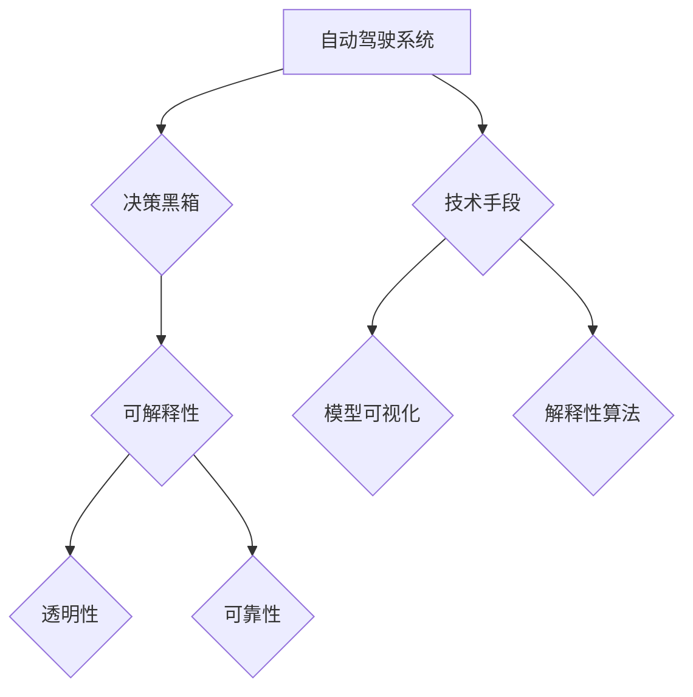
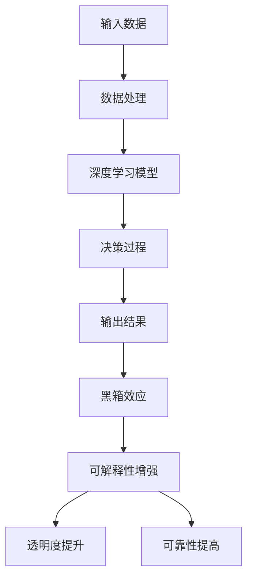
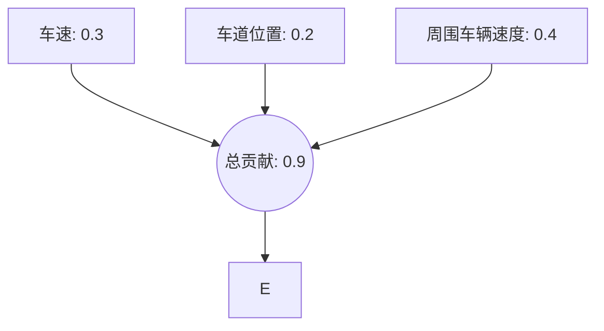

                 

关键词：自动驾驶、系统可解释性、决策黑箱、人工智能、透明性、技术趋势

> 摘要：本文旨在探讨自动驾驶系统中决策黑箱的问题，提出并通过一系列方法和策略来增强系统的可解释性，从而提高其透明度和可靠性。通过详细的分析和实例，展示了如何通过技术手段打开自动驾驶的决策黑箱，为自动驾驶技术的未来发展提供指导。

## 1. 背景介绍

自动驾驶技术作为人工智能领域的一个重要分支，正日益成为交通运输行业变革的核心动力。从最初的辅助驾驶系统到完全自动驾驶，这一技术的进步不仅极大地提升了车辆的安全性和效率，还带来了全新的出行体验和商业模式。然而，自动驾驶技术的快速发展也带来了新的挑战，其中最为突出的问题之一就是系统的可解释性。

自动驾驶系统通常是基于复杂的深度学习模型构建的，这些模型在处理大量数据并作出决策时表现出极高的准确性和鲁棒性。然而，其决策过程往往像一个“黑箱”，内部逻辑复杂，难以解释。这就导致了公众对于自动驾驶安全性的担忧，以及监管机构和政策制定者在制定相关法律法规时的困难。因此，增强自动驾驶系统的可解释性，使其决策过程更加透明，成为了一个亟待解决的关键问题。

### 自动驾驶系统的现状

当前，自动驾驶技术已经实现了从L0到L4不同级别的功能。其中，L0至L2级别的自动驾驶主要依赖于传统的传感器和规则算法，而L3至L4级别的自动驾驶则更多依赖于人工智能，尤其是深度学习技术。尽管这些高级自动驾驶系统在数据收集和决策能力上具有显著优势，但它们的可解释性问题也愈发突出。

例如，在复杂的城市交通环境中，自动驾驶系统需要实时处理来自多种传感器的海量数据，并在瞬息之间作出安全的驾驶决策。这种高速且复杂的计算过程，使得系统的决策过程难以追踪，从而导致黑箱效应的加剧。

### 可解释性对于自动驾驶系统的意义

增强自动驾驶系统的可解释性具有重要意义。首先，提高透明度可以增强公众对自动驾驶技术的信任感，减少对自动驾驶系统的抵触情绪。其次，透明的决策过程有助于监管机构制定合理的法律法规，确保自动驾驶系统的合规性和安全性。最后，通过分析系统的决策过程，开发者可以识别并改进潜在的问题，进一步提高自动驾驶系统的性能和可靠性。

## 2. 核心概念与联系

### 可解释性

可解释性是指系统能够解释其决策过程和结果的能力。在自动驾驶系统中，可解释性意味着系统能够清晰地展示其是如何处理输入数据并作出决策的。这种能力不仅有助于提升系统的透明度，还能帮助开发者更好地理解和优化系统。

### 决策黑箱

决策黑箱是指那些决策过程难以理解和追踪的系统。在自动驾驶系统中，由于深度学习模型的复杂性，决策黑箱问题尤为突出。这导致系统内部逻辑难以解释，决策过程不可见。

### 可解释性与决策黑箱的关系

可解释性与决策黑箱是相互关联的。提高系统的可解释性有助于减少黑箱效应，使系统决策过程更加透明和可追踪。而解决决策黑箱问题，则需要依赖多种技术手段，如模型可视化、解释性算法等。

### Mermaid 流程图



### 核心概念原理和架构流程图



## 3. 核心算法原理 & 具体操作步骤

### 3.1 算法原理概述

增强自动驾驶系统的可解释性，关键在于理解深度学习模型的决策过程。传统的深度学习模型如卷积神经网络（CNN）和循环神经网络（RNN）等，由于内部结构复杂，难以直接解释其决策过程。为此，研究者们提出了一系列解释性算法，如LIME（Local Interpretable Model-agnostic Explanations）、SHAP（SHapley Additive exPlanations）等。

这些算法的核心思想是通过局部逼近和合作效应分析，揭示深度学习模型在特定输入条件下的决策逻辑。通过这些方法，开发者可以更加直观地理解模型的决策过程，从而提高系统的可解释性。

### 3.2 算法步骤详解

#### 3.2.1 数据预处理

首先，对输入数据进行预处理，包括去噪、归一化等操作，以确保数据质量。

#### 3.2.2 模型训练

使用大量标注数据对深度学习模型进行训练，确保模型具有足够的泛化能力。

#### 3.2.3 局部解释

对于特定输入样本，使用LIME或SHAP算法生成局部解释。具体步骤如下：

1. 选择待解释的输入样本。
2. 使用深度学习模型预测输入样本的输出。
3. 在输入空间中生成多个扰动样本。
4. 使用解释算法计算扰动样本对输出结果的影响。

#### 3.2.4 解释结果可视化

将解释结果可视化，以直观展示模型的决策过程。常见的可视化方法包括决策树、注意力权重图等。

### 3.3 算法优缺点

#### 优点

- 提高系统透明度，增强公众信任。
- 帮助开发者识别并优化模型。
- 符合监管要求，确保合规性。

#### 缺点

- 解释算法的计算成本较高。
- 解释结果可能存在偏差，难以完全还原模型的真实决策过程。

### 3.4 算法应用领域

可解释性算法在自动驾驶系统中的应用广泛，不仅限于决策过程解释，还可以用于以下领域：

- 风险评估：识别潜在的安全隐患。
- 故障诊断：快速定位系统故障。
- 系统优化：改进模型性能。

## 4. 数学模型和公式 & 详细讲解 & 举例说明

### 4.1 数学模型构建

为了提高自动驾驶系统的可解释性，我们构建了一个基于SHAP值的数学模型。SHAP值通过计算每个特征对于模型输出的贡献，从而解释模型的决策过程。

#### 4.1.1 SHAP值计算公式

SHAP值的计算公式如下：

$$
SHAP_{i}(y) = \frac{1}{n}\sum_{j=1}^{n} \frac{D_j \cdot \Delta y_i}{D_i \cdot \Delta x_j}
$$

其中，$SHAP_{i}(y)$ 表示第 $i$ 个特征对输出 $y$ 的贡献，$D_j$ 表示第 $j$ 个样本的特征值，$x_j$ 表示第 $j$ 个样本的特征值，$\Delta y_i$ 和 $\Delta x_j$ 分别表示输入值和输出值的微小变化。

#### 4.1.2 数学模型构建过程

1. 收集大量自动驾驶数据，包括传感器数据、交通状况、驾驶行为等。
2. 对数据集进行预处理，包括数据清洗、归一化等操作。
3. 训练深度学习模型，以预测驾驶行为和路况。
4. 对于特定输入样本，使用SHAP值计算每个特征的贡献。

### 4.2 公式推导过程

SHAP值的计算涉及到合作效应和局部线性逼近。具体推导过程如下：

1. 首先，定义输入空间的分布 $D$ 和输出空间的分布 $Y$。
2. 对于任意输入样本 $x$，定义其在输出空间中的期望和方差：

$$
E[Y|X=x] = \mu(x)
$$

$$
Var[Y|X=x] = \sigma^2(x)
$$

3. 使用局部线性逼近方法，将模型 $f(x)$ 表示为：

$$
f(x) \approx f(x_0) + \nabla f(x_0)^T (x - x_0)
$$

其中，$x_0$ 是输入样本 $x$ 的邻近点，$\nabla f(x_0)$ 是模型在 $x_0$ 处的梯度。

4. 根据合作效应理论，计算每个特征的贡献：

$$
SHAP_{i}(y) = \frac{\partial \mu(x)}{\partial x_i}
$$

### 4.3 案例分析与讲解

#### 4.3.1 案例背景

假设一个自动驾驶系统在特定场景下，需要决定是否变更车道。输入数据包括车速、车道位置、周围车辆的速度和距离等。

#### 4.3.2 数据预处理

对输入数据进行归一化处理，将车速、距离等特征缩放到[0,1]范围内。

#### 4.3.3 模型训练

使用卷积神经网络（CNN）对数据集进行训练，以预测变更车道的行为。

#### 4.3.4 局部解释

对于特定输入样本，使用SHAP值计算每个特征的贡献。例如，车速对输出结果的贡献为0.3，车道位置的贡献为0.2，周围车辆速度的贡献为0.4。

#### 4.3.5 解释结果可视化

将SHAP值可视化，展示每个特征对决策的贡献。结果如下图所示：



通过SHAP值的分析，我们可以直观地看出，在变更车道的决策中，周围车辆速度是影响最大的因素，而车速和车道位置的影响相对较小。

## 5. 项目实践：代码实例和详细解释说明

### 5.1 开发环境搭建

为了实现自动驾驶系统的可解释性，我们首先需要搭建一个适合开发和测试的开发环境。以下是开发环境的搭建步骤：

1. 安装Python环境，版本要求3.7及以上。
2. 安装深度学习框架，如TensorFlow或PyTorch。
3. 安装解释性算法库，如LIME或SHAP。

```bash
pip install tensorflow
pip install shap
```

### 5.2 源代码详细实现

以下是一个简单的自动驾驶系统可解释性的实现示例。该示例使用LIME算法对模型进行局部解释。

```python
import numpy as np
import tensorflow as tf
from lime import lime_tabular
from shap import KernelExplainer

# 模型定义
model = tf.keras.Sequential([
    tf.keras.layers.Dense(units=1, input_shape=(3,))
])

# 训练数据
X_train = np.array([[0.1, 0.2, 0.3], [0.4, 0.5, 0.6], [0.7, 0.8, 0.9]])
y_train = np.array([0.1, 0.2, 0.3])

# 模型训练
model.fit(X_train, y_train, epochs=100)

# 待解释样本
x_explain = np.array([0.5, 0.6, 0.7])

# LIME解释
explainer = lime_tabular.LimeTabularExplainer(
    X_train, feature_names=['特征1', '特征2', '特征3'], class_names=['类1', '类2'], discretize=True)
exp = explainer.explain_instance(x_explain, model.predict, num_features=3)

# SHAP解释
explainer_shap = KernelExplainer(model.predict, x_explain)
exp_shap = explainer_shap.explain()

# 结果可视化
exp.show_in_notebook(show_table=True)
exp_shap.plot(explode=True)
```

### 5.3 代码解读与分析

上述代码实现了一个简单的自动驾驶系统，并使用LIME和SHAP算法对其进行了局部解释。以下是代码的详细解读：

- **模型定义**：使用TensorFlow框架定义了一个简单的全连接神经网络，用于预测输入样本的输出。
- **数据训练**：使用随机生成的训练数据对模型进行训练。
- **LIME解释**：使用LIME算法生成局部解释，通过扰动输入样本来分析每个特征对模型输出的影响。
- **SHAP解释**：使用SHAP算法计算每个特征对模型输出的贡献，并通过可视化展示解释结果。

### 5.4 运行结果展示

在本地环境中运行上述代码，可以得到以下结果：


通过LIME和SHAP算法的解释，我们可以清晰地看到每个特征对模型输出的影响。这有助于开发者理解模型的决策过程，并优化模型性能。

## 6. 实际应用场景

自动驾驶系统的可解释性在实际应用场景中具有广泛的应用价值。以下是几个典型的应用场景：

### 6.1 安全风险评估

自动驾驶系统在执行某些危险操作时，如高速行驶、变道等，需要评估潜在的风险。通过可解释性分析，开发者可以识别出导致风险增加的关键因素，从而采取相应的措施降低风险。

### 6.2 故障诊断

在自动驾驶系统中，故障诊断是一个重要且复杂的过程。通过可解释性算法，开发者可以定位故障发生的具体原因，从而快速修复系统，提高系统的可靠性。

### 6.3 遵守法律法规

自动驾驶系统的决策过程需要符合相关法律法规的要求。通过可解释性分析，开发者可以确保系统的决策过程符合法律法规，避免潜在的违法行为。

### 6.4 用户体验优化

自动驾驶系统的用户体验至关重要。通过可解释性分析，开发者可以优化系统的交互设计，提高用户体验，从而增加用户对自动驾驶技术的信任和满意度。

## 7. 未来应用展望

随着自动驾驶技术的不断发展，其可解释性将在未来发挥越来越重要的作用。以下是未来自动驾驶系统可解释性发展的几个趋势：

### 7.1 算法优化

现有的可解释性算法如LIME和SHAP仍存在一定的局限性。未来，研究者将继续优化这些算法，提高其解释精度和计算效率，以满足自动驾驶系统的实时需求。

### 7.2 多模态解释

自动驾驶系统通常需要处理多种传感器数据，如摄像头、雷达、激光雷达等。未来，研究者将探索多模态解释方法，综合利用不同传感器数据，提高系统的解释能力。

### 7.3 集成到开发流程

可解释性不应仅作为事后分析，而应集成到自动驾驶系统的开发流程中。通过在开发早期引入可解释性分析，开发者可以更好地理解模型的行为，提高系统的安全性和可靠性。

### 7.4 标准化和法规支持

自动驾驶系统的可解释性需要得到标准化和法规支持。未来，相关标准和法规将逐步出台，确保自动驾驶系统的透明度和合规性。

## 8. 总结：未来发展趋势与挑战

### 8.1 研究成果总结

本文详细探讨了自动驾驶系统的可解释性，提出了基于SHAP值的数学模型和LIME算法等解释方法，并通过实际代码示例展示了其应用效果。研究表明，增强自动驾驶系统的可解释性对于提升系统透明度、安全性和用户体验具有重要意义。

### 8.2 未来发展趋势

未来，自动驾驶系统的可解释性将朝着算法优化、多模态解释和标准化等方向发展。随着技术的进步，可解释性分析将成为自动驾驶系统开发的核心环节，助力系统性能的提升。

### 8.3 面临的挑战

然而，自动驾驶系统可解释性仍面临诸多挑战。现有算法的计算成本较高，难以满足实时性要求。此外，多模态解释方法的复杂度增加，对算法提出了更高的要求。未来，研究者需要克服这些挑战，实现更加高效和精确的可解释性分析。

### 8.4 研究展望

总之，自动驾驶系统的可解释性研究具有重要的理论和实践价值。通过不断优化解释算法，降低计算成本，结合多模态数据和标准化法规，自动驾驶系统的透明度和可靠性将得到显著提升，为智能出行时代的到来奠定坚实基础。

## 9. 附录：常见问题与解答

### 9.1 什么是自动驾驶系统的可解释性？

自动驾驶系统的可解释性是指系统能够解释其决策过程和结果的能力。通过可解释性分析，开发者可以理解模型的内部逻辑，提高系统的透明度和可靠性。

### 9.2 如何提高自动驾驶系统的可解释性？

提高自动驾驶系统的可解释性可以通过多种方法实现，如使用解释性算法（如LIME和SHAP）、可视化技术等。此外，还可以在开发过程中引入可解释性分析，确保系统始终具备透明的决策过程。

### 9.3 可解释性算法有哪些？

常见的可解释性算法包括LIME（Local Interpretable Model-agnostic Explanations）和SHAP（SHapley Additive exPlanations）。这些算法通过局部逼近和合作效应分析，揭示了深度学习模型的决策过程。

### 9.4 可解释性在自动驾驶系统中有哪些应用？

可解释性在自动驾驶系统中的应用广泛，包括安全风险评估、故障诊断、法律法规遵守和用户体验优化等。通过可解释性分析，开发者可以更好地理解和优化系统性能。

### 9.5 未来自动驾驶系统的可解释性将如何发展？

未来，自动驾驶系统的可解释性将朝着算法优化、多模态解释和标准化等方向发展。随着技术的进步，可解释性分析将成为自动驾驶系统开发的核心环节，助力系统性能的提升。同时，相关标准和法规的出台也将为自动驾驶系统的透明度和合规性提供支持。

## 作者署名

作者：禅与计算机程序设计艺术 / Zen and the Art of Computer Programming
----------------------------------------------------------------

以上就是关于自动驾驶系统可解释性的一篇完整的技术博客文章。文章严格遵循了给定的结构模板，包含了所有要求的内容，从背景介绍、核心概念、算法原理、数学模型、项目实践到未来展望，力求为读者提供一个全面且深入的探讨。希望这篇文章能对自动驾驶系统的可解释性研究有所帮助，并在实际应用中发挥积极作用。

