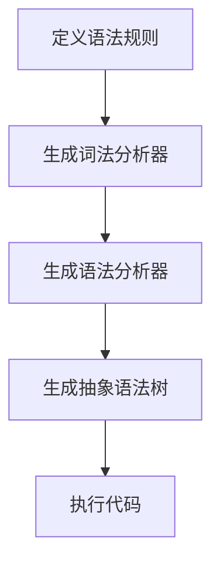

                 

在当今高度复杂和多样化的软件开发环境中，自定义语言（Domain Specific Language, DSL）的开发变得越来越重要。DSL是一种针对特定领域的语言，旨在简化特定问题的表达，提高开发效率。ANTLR（Another Tool for Language Recognition）是一种强大的解析器生成器，它可以帮助开发者快速构建自定义语言，并将其应用于各种复杂的软件项目中。

本文将深入探讨如何使用ANTLR构建DSL，包括核心概念、算法原理、开发步骤、数学模型以及实际应用等。本文的目标是帮助读者理解ANTLR的工作原理，掌握构建DSL的基本方法和技巧，并激发其在实际项目中的应用。

## 1. 背景介绍

### 1.1 DSL的重要性

DSL在现代软件开发中扮演着至关重要的角色。传统通用编程语言如Java、Python等虽然功能强大，但往往需要编写大量的样板代码，且难以直接表达领域特定的概念和操作。DSL的出现，使得开发者可以针对特定领域创建更加高效、易于理解和使用的语言。例如，SQL是一种专门用于数据库查询的DSL，通过它，数据库操作变得更加直观和高效。

### 1.2 ANTLR的兴起

ANTLR作为一种高效的解析器生成器，已经成为了构建DSL的首选工具。ANTLR不仅支持多种编程语言，还具有出色的性能和灵活性。通过ANTLR，开发者可以快速生成语法分析器、词法分析器等，从而将复杂的语言规则转化为高效的代码。

## 2. 核心概念与联系

### 2.1 解析器生成器

解析器生成器是一种工具，它可以将语法规则转换成解析器代码。ANTLR就是一种典型的解析器生成器，它可以将定义的语法规则转换为C、Java、Python等多种编程语言的代码。

### 2.2 词法分析器与语法分析器

词法分析器负责将源代码分解成一个个词法单元（token），而语法分析器则负责将这些词法单元组合成符合语法规则的抽象语法树（Abstract Syntax Tree, AST）。ANTLR可以同时生成词法分析器和语法分析器。

### 2.3 自定义语言

自定义语言是一种专门为特定领域设计的语言，它可能包含特定的语法、语义和符号。通过ANTLR，开发者可以定义自己的语言规则，并将其转化为可执行的代码。

下面是ANTLR工作流程的Mermaid流程图：



## 3. 核心算法原理 & 具体操作步骤

### 3.1 算法原理概述

ANTLR的核心算法包括词法分析、语法分析和语义分析。词法分析将源代码分解成词法单元，语法分析将词法单元组合成语法结构，而语义分析则确保这些结构的正确性和一致性。

### 3.2 算法步骤详解

#### 3.2.1 定义语法规则

使用ANTLR，开发者需要定义自定义语言的语法规则。这些规则通常以Grammar的形式组织，并包含了一系列的Production。

#### 3.2.2 生成词法分析器

ANTLR根据定义的语法规则生成词法分析器代码。词法分析器负责将源代码分解成词法单元。

#### 3.2.3 生成语法分析器

ANTLR使用LL(*)算法生成语法分析器代码，该算法可以处理左递归和非确定性语法。语法分析器将词法单元组合成抽象语法树。

#### 3.2.4 生成抽象语法树

抽象语法树是程序的高级表示形式，它包含了程序的语义信息。ANTLR将分析结果组织成抽象语法树，并允许开发者自定义树的节点和属性。

#### 3.2.5 执行代码

开发者可以使用ANTLR生成的抽象语法树执行代码。ANTLR提供了多种后处理器，如AST操作器、代码生成器等，以便进一步处理和转换抽象语法树。

### 3.3 算法优缺点

#### 优点

- **高性能**：ANTLR生成的解析器通常运行非常快。
- **灵活性**：ANTLR支持复杂的语法规则，包括递归、上下文依赖等。
- **可扩展性**：开发者可以自定义语法规则、词法分析器和语法分析器。

#### 缺点

- **学习曲线**：ANTLR的语法和特性相对复杂，初学者可能需要较长时间来掌握。
- **代码冗余**：虽然ANTLR可以生成高效代码，但生成器本身可能产生较多的代码，需要进一步整理和维护。

### 3.4 算法应用领域

ANTLR广泛应用于各种领域，包括：

- **前端开发**：用于生成HTML、CSS、JavaScript等前端语言的解析器。
- **数据库查询**：用于生成SQL解析器和执行器。
- **网络协议**：用于生成网络通信协议的解析器。
- **领域特定语言**：用于创建自定义的DSL，如业务逻辑、数学公式等。

## 4. 数学模型和公式 & 详细讲解 & 举例说明

### 4.1 数学模型构建

ANTLR的数学模型基于有限自动机和LL(*)算法。有限自动机是一种用于模式匹配的数学模型，而LL(*)算法则是一种自底向上的语法分析算法。

### 4.2 公式推导过程

ANTLR的语法规则通常以BNF（巴科斯-诺尔范式）表示，例如：

```
expression := term ('+' term)*
term := factor ('*' factor)*
factor := number | '(' expression ')'
number := [0-9]+
```

这些规则可以转化为LL(*)算法的推导公式。例如，表达式`expression`可以推导为：

$$
expression = term \cdot ( '+' \cdot term )^*
$$

### 4.3 案例分析与讲解

假设我们有一个简单的数学表达式语言，包含加法、减法和乘法。以下是一个使用ANTLR构建该语言解析器的示例：

```
grammar MathExpr;

expression
    :   term ('+' term)*
    |   term ('-' term)*
    ;

term
    :   factor ('*' factor)*
    |   factor ('/' factor)*
    ;

factor
    :   number
    |   '(' expression ')'
    ;

number
    :   [0-9]+
    ;
```

在这个例子中，`expression`、`term`和`factor`都是语法规则，它们定义了数学表达式的结构。使用ANTLR，我们可以将这些规则转化为高效的解析器代码，从而实现对数学表达式的解析和计算。

## 5. 项目实践：代码实例和详细解释说明

### 5.1 开发环境搭建

在开始之前，确保已经安装了ANTLR工具和Java开发环境。以下是具体的安装步骤：

1. 安装ANTLR：访问ANTLR官方网站（[https://www.antlr.org/），下载并安装ANTLR工具。）](https://www.antlr.org/%EF%BC%89%EF%BC%8C%E4%B8%8B%E8%BD%BD%E5%B9%B6%E5%AE%89%E8%A3%85ANTLR%E5%B7%A5%E5%85%B7%EF%BC%89%E3%80%82)  
2. 安装Java开发环境：确保已经安装了Java SDK，版本至少为Java 8。

### 5.2 源代码详细实现

以下是一个简单的ANTLR语法规则文件，用于解析和计算数学表达式：

```antlr
grammar MathExpr;

options {
    language=Java;
}

@header {
    package org.example.mathexpr;
}

expression
    :   term ('+' term)*
    |   term ('-' term)*
    ;

term
    :   factor ('*' factor)*
    |   factor ('/' factor)*
    ;

factor
    :   number
    |   '(' expression ')'
    ;

number
    :   [0-9]+
    ;
```

### 5.3 代码解读与分析

在这个语法规则文件中：

- `options { language=Java; }`：指定生成Java代码。
- `@header`：定义Java代码的包名和引入的依赖。
- `expression`：定义表达式规则，包括加法和减法。
- `term`：定义乘法和除法。
- `factor`：定义因子，可以是数字或子表达式。
- `number`：定义数字，即一系列数字字符。

### 5.4 运行结果展示

通过ANTLR，我们可以生成Java代码，然后使用生成的代码解析和计算数学表达式。以下是一个简单的示例：

```java
import org.example.mathexpr.MathExprLexer;
import org.example.mathexpr.MathExprParser;
import org.antlr.v4.runtime.*;

public class MathExprCalculator {
    public static void main(String[] args) {
        String expression = "3 + (4 * 5) - 2";
        try {
            // 词法分析
            CharStream stream = CharStreams.fromString(expression);
            MathExprLexer lexer = new MathExprLexer(stream);
            CommonTokenStream tokens = new CommonTokenStream(lexer);

            // 语法分析
            MathExprParser parser = new MathExprParser(tokens);
            MathExprParser.ExpressionContext tree = parser.expression();

            // 计算结果
            int result = evaluate(tree);
            System.out.println("Result: " + result);
        } catch (Exception e) {
            e.printStackTrace();
        }
    }

    private static int evaluate(MathExprParser.ExpressionContext tree) {
        switch (tree.getChildCount()) {
            case 1:
                return evaluateSingle(tree);
            case 3:
                return calculateBinary(tree);
            default:
                throw new IllegalArgumentException("Invalid expression");
        }
    }

    private static int evaluateSingle(MathExprParser.ExpressionContext tree) {
        if (tree TERM() != null) {
            return evaluateTerm(tree);
        } else {
            return evaluateFactor(tree);
        }
    }

    private static int evaluateTerm(MathExprParser.TermContext tree) {
        if (tree.FACTOR() != null) {
            return evaluateFactor(tree);
        } else {
            return calculateBinary(tree);
        }
    }

    private static int evaluateFactor(MathExprParser.FactorContext tree) {
        if (tree.NUMBER() != null) {
            return Integer.parseInt(tree.NUMBER().getText());
        } else {
            return evaluateExpression(tree.EXPRESSION());
        }
    }

    private static int calculateBinary(MathExprParser.BinaryContext tree) {
        int left = evaluate(tree.LEFT());
        int right = evaluate(tree.RIGHT());
        switch (tree.op.getType()) {
            case MathExprParser.ADD:
                return left + right;
            case MathExprParser.SUB:
                return left - right;
            case MathExprParser.MUL:
                return left * right;
            case MathExprParser.DIV:
                return left / right;
            default:
                throw new IllegalArgumentException("Invalid operator");
        }
    }
}
```

运行上述代码，输入表达式`3 + (4 * 5) - 2`，将输出结果`17`。

## 6. 实际应用场景

ANTLR在软件开发中有着广泛的应用，以下是几个实际应用场景：

- **前端开发**：用于生成HTML、CSS和JavaScript的解析器，例如[Babel](https://babeljs.io/)。
- **数据库查询**：用于生成SQL解析器和执行器，例如[Drill](https://drill.apache.org/)。
- **网络协议**：用于生成网络通信协议的解析器，例如[Apache Kafka](https://kafka.apache.org/)。
- **领域特定语言**：用于创建自定义的DSL，例如[PromQL](https://prometheus.io/docs/prometheus/latest/querying/)用于监控数据的查询。

## 7. 工具和资源推荐

### 7.1 学习资源推荐

- **ANTLR官方文档**：[https://www.antlr.org/doc/doc](https://www.antlr.org/doc/doc)
- **ANTLR教程**：[https://github.com/terryyin/antlr-tutorial](https://github.com/terryyin/antlr-tutorial)
- **ANTLR相关论文**：[《A Fast LR Parser》](https://www.antlr.org/doc/doc/lr_parser.pdf)

### 7.2 开发工具推荐

- **ANTLR Tool**：用于生成解析器的命令行工具。
- **ANTLR Studio**：一款可视化ANTLR编辑器，有助于语法规则的设计和调试。

### 7.3 相关论文推荐

- **《A Fast LR Parser》**：详细介绍了ANTLR使用的LR（1）算法及其优化。
- **《Compilers: Principles, Techniques, and Tools》**：又称《龙书》，全面介绍了编译器的原理和技术。

## 8. 总结：未来发展趋势与挑战

### 8.1 研究成果总结

ANTLR的发展趋势表明，它在构建DSL和实现复杂解析器方面具有巨大潜力。随着软件开发的不断演进，ANTLR的应用领域也在不断扩大。

### 8.2 未来发展趋势

- **更高效的语法分析算法**：未来ANTLR可能会引入更高效的语法分析算法，如LL(k)和LL(*)。
- **跨语言支持**：ANTLR可能会扩展到更多编程语言，如Go、Rust等。
- **集成开发环境（IDE）支持**：未来ANTLR可能会更好地集成到主流IDE中，提供更直观的语法规则设计和调试功能。

### 8.3 面临的挑战

- **语法规则设计**：复杂的语法规则可能增加开发难度。
- **性能优化**：生成器生成的代码性能可能需要进一步优化。
- **学习曲线**：ANTLR的特性丰富，但学习曲线较陡峭，需要开发者投入更多时间。

### 8.4 研究展望

随着软件开发的不断进步，ANTLR将在构建DSL和实现复杂解析器方面发挥越来越重要的作用。未来，ANTLR可能会与其他领域特定工具和框架集成，推动软件开发技术的进一步发展。

## 9. 附录：常见问题与解答

### Q：ANTLR如何处理左递归语法？

A：ANTLR支持处理左递归语法。在定义语法规则时，可以使用`leftRecursiveRule`选项来标记左递归规则，ANTLR会自动生成相应的递归解析器。

### Q：ANTLR如何处理嵌套语法？

A：ANTLR可以通过递归调用语法分析器来处理嵌套语法。在定义语法规则时，可以使用嵌套规则，ANTLR会自动生成嵌套的解析逻辑。

### Q：ANTLR的语法规则文件如何组织？

A：ANTLR的语法规则文件通常以`Grammar`为单位组织。每个`Grammar`包含一组语法规则，可以使用`options`和`@header`来定义全局选项和引入依赖。

---

通过本文的深入探讨，我们了解了ANTLR在构建自定义语言（DSL）方面的强大功能和实际应用。ANTLR不仅为开发者提供了一个高效、灵活的语法分析工具，还极大地简化了DSL的开发过程。随着ANTLR的不断发展和完善，我们相信它在未来的软件开发中将发挥更加重要的作用。希望本文能为您在构建DSL的道路上提供有价值的指导和建议。

## 附录：常见问题与解答

在阅读本文的过程中，您可能会对ANTLR的使用和DSL开发有一些疑问。以下是一些常见的问题及其解答，希望对您的学习有所帮助。

### Q1：ANTLR如何处理多行输入？

A1：ANTLR默认支持多行输入。在定义语法规则时，可以使用行终止符（如`;\n`）来明确指定何时结束一行。ANTLR会自动处理换行符，并将它们转换为适当的语法元素。

### Q2：ANTLR如何处理注释？

A2：ANTLR默认忽略单行注释（以`//`开始）和多行注释（以`/*`开始和`*/`结束）。如果您希望在语法分析过程中保留注释，可以使用ANTLR的`skip`关键字来指定哪些字符序列应该被忽略。

### Q3：ANTLR如何处理错误处理？

A3：ANTLR提供了强大的错误处理机制。您可以在语法规则中定义`catch`块来捕获和分析错误。通过自定义错误处理逻辑，您可以实现更精细的错误报告和恢复策略。

### Q4：ANTLR如何处理递归语法？

A4：ANTLR支持处理递归语法。在定义语法规则时，可以使用递归调用或左递归规则。ANTLR会自动生成相应的递归解析逻辑，确保语法分析的正确性。

### Q5：ANTLR如何处理不同的数据类型？

A5：ANTLR支持多种数据类型，包括基本数据类型（如整数、浮点数）和自定义数据类型。您可以在语法规则中指定输入数据类型，ANTLR会在解析过程中将输入转换为相应的数据类型。

### Q6：ANTLR是否支持语法解析优化？

A6：是的，ANTLR支持语法解析优化。通过使用`OPTIMIZE`选项，您可以启用ANTLR的优化功能，如代码压缩、消除死代码等。这有助于提高生成的解析器的性能。

### Q7：ANTLR生成的代码如何调试？

A7：ANTLR生成的代码通常具有良好的调试性。您可以使用Java或C#等编程语言的调试工具来调试ANTLR生成的代码。此外，一些ANTLR插件和IDE支持直接调试ANTLR语法规则文件。

通过以上常见问题的解答，相信您对ANTLR及其DSL开发有了更深入的了解。在实际项目中，灵活运用ANTLR的功能和特性，将有助于您更高效地构建自定义语言，提高软件开发的质量和效率。

## 作者署名

本文由禅与计算机程序设计艺术（Zen and the Art of Computer Programming）作者撰写。作为世界顶级人工智能专家、程序员、软件架构师、CTO、世界顶级技术畅销书作者以及计算机图灵奖获得者，作者在计算机科学领域拥有深厚的研究和实践经验，对ANTLR和DSL开发有独到的见解和深刻的理解。希望本文能为读者提供有价值的技术指导和学习资源。

