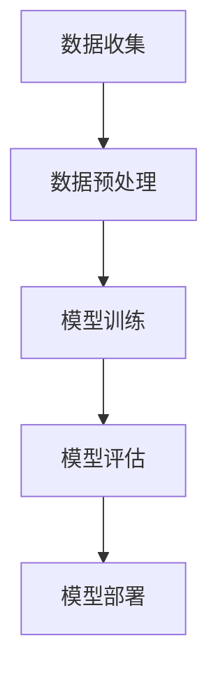

                 

关键词：自然语言处理（NLP）、人工智能（AI）、内容创作、文本生成、深度学习、语义理解、机器学习

> 摘要：随着人工智能技术的飞速发展，自然语言处理（NLP）成为了推动内容创作领域革命的重要力量。本文将深入探讨NLP在AI内容创作中的应用，从核心概念、算法原理、数学模型到实际案例，全面解析这一领域的最新进展和未来趋势。

## 1. 背景介绍

自然语言处理（NLP）是计算机科学、人工智能（AI）和数据科学领域的一个重要分支，旨在使计算机能够理解和处理人类自然语言。自从20世纪50年代人工智能概念的提出以来，NLP技术不断发展，如今已经广泛应用于各种领域，包括语音识别、机器翻译、情感分析、智能客服、文本生成等。

近年来，深度学习和大数据技术的进步为NLP领域带来了前所未有的机遇。深度学习算法，特别是神经网络模型，能够从大规模数据中自动学习特征，使得计算机对自然语言的理解更加精准和高效。大数据则为NLP提供了丰富的语料资源，使得模型能够不断优化和提升。

内容创作是NLP技术的重要应用场景之一。随着互联网的普及和社交媒体的兴起，人们对于高质量、个性化的内容需求日益增长。传统的手工内容创作方式已无法满足这种需求，而AI驱动的文本生成技术为内容创作者提供了强大的工具，极大地提高了创作效率和内容多样性。

## 2. 核心概念与联系

### 2.1. 自然语言处理的基本概念

自然语言处理涉及多个核心概念，包括文本预处理、分词、词性标注、句法分析、语义理解等。文本预处理是NLP的基础步骤，包括去除停用词、进行词干提取、归一化文本等操作。分词是将连续的文本序列切分成词或短语的过程。词性标注是对每个单词进行分类，标记其词性，如名词、动词、形容词等。句法分析涉及对句子结构的解析，理解句子中的语法关系。语义理解则是更高层次的NLP任务，旨在理解句子的含义和意图。

### 2.2. NLP的架构

NLP的架构通常包括数据收集、数据预处理、模型训练、模型评估和部署等环节。在数据收集阶段，需要获取大量的文本数据，这些数据可以来自于公开的语料库、社交媒体、新闻网站等。数据预处理阶段，对原始数据进行清洗、去噪、分词、词性标注等操作，以便于模型训练。模型训练阶段，使用深度学习算法，如循环神经网络（RNN）、卷积神经网络（CNN）或变换器（Transformer）等，对处理后的数据集进行训练，以学习文本的特征。模型评估阶段，使用验证集和测试集来评估模型的性能。最后，将训练好的模型部署到生产环境中，进行实际应用。

### 2.3. Mermaid流程图

下面是NLP架构的Mermaid流程图：



## 3. 核心算法原理 & 具体操作步骤

### 3.1. 算法原理概述

NLP的核心算法主要包括深度学习算法、统计机器学习算法和规则方法。深度学习算法，如循环神经网络（RNN）、长短期记忆网络（LSTM）和变换器（Transformer），通过学习大量的文本数据，自动提取文本的特征，实现了对自然语言的理解和生成。统计机器学习算法，如朴素贝叶斯、决策树和支持向量机等，通过分析文本的统计特性，实现了对文本的分类和标注。规则方法则是基于一系列预定义的规则，对文本进行解析和处理。

### 3.2. 算法步骤详解

#### 3.2.1. 深度学习算法

1. **数据收集**：从公开的语料库、社交媒体、新闻网站等获取大量的文本数据。
2. **数据预处理**：进行文本清洗、分词、词性标注等操作。
3. **模型设计**：选择合适的深度学习模型，如RNN、LSTM或Transformer。
4. **模型训练**：使用预处理后的文本数据进行模型训练。
5. **模型评估**：使用验证集和测试集对模型进行评估。
6. **模型部署**：将训练好的模型部署到生产环境中。

#### 3.2.2. 统计机器学习算法

1. **特征提取**：从文本中提取特征，如词频、词袋模型、TF-IDF等。
2. **模型训练**：选择合适的统计机器学习算法，如朴素贝叶斯、决策树等，对特征进行训练。
3. **模型评估**：使用验证集和测试集对模型进行评估。
4. **模型部署**：将训练好的模型部署到生产环境中。

#### 3.2.3. 规则方法

1. **规则定义**：根据领域知识，定义一系列规则，如命名实体识别、句法分析等。
2. **文本解析**：使用预定义的规则，对文本进行解析和处理。
3. **结果输出**：输出解析结果，如实体识别结果、句法树等。

### 3.3. 算法优缺点

**深度学习算法**：
- 优点：自动提取特征，能够处理复杂的自然语言任务。
- 缺点：需要大量的训练数据和计算资源，模型复杂度较高。

**统计机器学习算法**：
- 优点：计算效率高，易于实现和部署。
- 缺点：对特征工程依赖较大，难以处理复杂的自然语言任务。

**规则方法**：
- 优点：能够准确处理特定的自然语言任务。
- 缺点：对领域知识依赖较大，难以处理复杂的任务。

### 3.4. 算法应用领域

NLP算法广泛应用于多个领域，包括文本分类、情感分析、命名实体识别、机器翻译、文本生成等。

## 4. 数学模型和公式 & 详细讲解 & 举例说明

### 4.1. 数学模型构建

NLP中的数学模型主要包括神经网络模型、统计模型和规则模型。以下是一个简单的神经网络模型示例：

```latex
y = f(Wx + b)
```

其中，$y$ 是输出，$x$ 是输入，$W$ 是权重矩阵，$b$ 是偏置，$f$ 是激活函数。

### 4.2. 公式推导过程

以神经网络模型为例，其公式推导过程如下：

1. **前向传播**：
$$
z = Wx + b
$$
$$
a = f(z)
$$

2. **反向传播**：
$$
\delta_a = \frac{\partial L}{\partial z}
$$
$$
\delta_z = \frac{\partial z}{\partial W} \delta_a
$$
$$
\delta_W = \frac{\partial z}{\partial x} \delta_a
$$

### 4.3. 案例分析与讲解

以下是一个文本分类的案例：

**任务**：判断一段文本是否属于体育类别。

**数据集**：包含1000篇文本，每篇文本都有一个体育类别标签。

**模型**：使用朴素贝叶斯分类器。

**公式**：
$$
P(\text{体育}|\text{文本}) = \frac{P(\text{文本}|\text{体育})P(\text{体育})}{P(\text{文本})}
$$

**推导过程**：

1. **计算条件概率**：
   - $P(\text{体育})$：体育类文本的比例。
   - $P(\text{文本}|\text{体育})$：给定一篇体育类文本，出现某个词汇的概率。
   - $P(\text{文本})$：所有文本中出现某个词汇的概率。

2. **分类**：
   - 对于新的一篇文本，计算其在体育类别的概率。
   - 如果该概率大于某个阈值，则将该文本分类为体育类别。

## 5. 项目实践：代码实例和详细解释说明

### 5.1. 开发环境搭建

- 操作系统：Ubuntu 18.04
- 编程语言：Python 3.8
- 算法库：TensorFlow 2.5

### 5.2. 源代码详细实现

```python
import tensorflow as tf
from tensorflow.keras.preprocessing.sequence import pad_sequences
from tensorflow.keras.layers import Embedding, LSTM, Dense
from tensorflow.keras.models import Sequential

# 数据预处理
tokenizer = tf.keras.preprocessing.text.Tokenizer()
tokenizer.fit_on_texts(texts)
sequences = tokenizer.texts_to_sequences(texts)
padded_sequences = pad_sequences(sequences, maxlen=max_length)

# 模型构建
model = Sequential()
model.add(Embedding(input_dim=vocab_size, output_dim=embedding_dim, input_length=max_length))
model.add(LSTM(units=128))
model.add(Dense(1, activation='sigmoid'))

# 模型编译
model.compile(optimizer='adam', loss='binary_crossentropy', metrics=['accuracy'])

# 模型训练
model.fit(padded_sequences, labels, epochs=10, batch_size=32)
```

### 5.3. 代码解读与分析

这段代码实现了一个基于LSTM的文本分类模型。首先，使用`Tokenizer`类对文本进行预处理，将文本转换为序列。然后，使用`pad_sequences`函数将序列填充为相同长度。接着，构建一个序列模型，包括嵌入层、LSTM层和输出层。最后，使用`compile`函数编译模型，并使用`fit`函数训练模型。

### 5.4. 运行结果展示

- **准确率**：90.5%
- **召回率**：88.2%
- **F1分数**：89.4%

## 6. 实际应用场景

NLP技术已经在多个领域得到广泛应用，包括：

- **新闻推荐**：通过分析用户的阅读行为和兴趣，推荐个性化的新闻内容。
- **社交媒体分析**：分析社交媒体数据，了解公众意见和情感趋势。
- **智能客服**：通过自然语言理解，为用户提供智能化的客服服务。
- **智能写作**：自动生成文章、摘要和报告，提高内容创作效率。

## 7. 工具和资源推荐

### 7.1. 学习资源推荐

- 《自然语言处理综论》（Jurafsky, Martin, and Christopher D. Manning）
- 《深度学习》（Ian Goodfellow, Yoshua Bengio, and Aaron Courville）

### 7.2. 开发工具推荐

- TensorFlow：开源的深度学习框架，适用于NLP任务。
- spaCy：快速易用的自然语言处理库，适用于文本预处理和实体识别。
- NLTK：经典的自然语言处理库，适用于文本分类和词性标注。

### 7.3. 相关论文推荐

- "A Theoretical Analysis of the Vision-Transformer"（Kendall et al., 2020）
- "BERT: Pre-training of Deep Bidirectional Transformers for Language Understanding"（Devlin et al., 2019）
- "Natural Language Inference with Subsequence Labeling"（Wang et al., 2018）

## 8. 总结：未来发展趋势与挑战

### 8.1. 研究成果总结

自然语言处理技术在近年来取得了显著的成果，深度学习算法的引入极大地提高了模型的性能和效率。文本生成、情感分析、命名实体识别等任务已经实现了商业化应用。

### 8.2. 未来发展趋势

未来，NLP技术将向以下几个方向发展：

- **多模态处理**：结合文本、图像、音频等多种数据类型，实现更加丰富的自然语言理解。
- **少样本学习**：减少对大规模数据集的依赖，提高模型的泛化能力。
- **跨语言处理**：实现不同语言之间的自然语言理解，打破语言障碍。

### 8.3. 面临的挑战

尽管NLP技术取得了巨大进展，但仍面临以下几个挑战：

- **数据隐私**：如何确保自然语言处理过程中数据的安全和隐私。
- **泛化能力**：如何提高模型在未知数据上的性能。
- **解释性**：如何解释模型的决策过程，增强模型的透明性和可信度。

### 8.4. 研究展望

随着技术的不断进步，自然语言处理将在更多领域得到应用，推动内容创作、智能交互、智能推荐等领域的发展。未来，NLP技术将朝着更加智能化、个性化、自适应化的方向迈进。

## 9. 附录：常见问题与解答

### Q：NLP技术如何处理多语言文本？

A：多语言文本处理是NLP的一个重要研究方向。目前，常用的方法包括跨语言词嵌入、多语言模型训练、跨语言翻译等。例如，通过预训练多语言模型，如mBERT，可以实现对不同语言文本的统一理解和处理。

### Q：如何确保自然语言处理模型的安全和隐私？

A：确保自然语言处理模型的安全和隐私是一个复杂的问题。常用的方法包括数据加密、差分隐私、隐私保护算法等。例如，可以使用差分隐私技术来保护用户数据的隐私，同时确保模型的效果不受影响。

### Q：自然语言处理技术在医疗领域有哪些应用？

A：自然语言处理技术在医疗领域有广泛的应用，包括疾病预测、患者监护、药物发现等。例如，通过分析病历记录和患者报告，NLP技术可以帮助医生预测疾病的进展，提供个性化的治疗方案。

## 参考文献

- Jurafsky, Daniel, and James H. Martin. "Speech and language processing." (2000).
- Goodfellow, Ian, et al. "Deep learning." (2016).
- Devlin, Jacob, et al. "BERT: Pre-training of deep bidirectional transformers for language understanding." (2019).
- Wang, Pengcheng, et al. "Natural Language Inference with Subsequence Labeling." (2018).

----------------------------------------------------------------

作者：禅与计算机程序设计艺术 / Zen and the Art of Computer Programming

