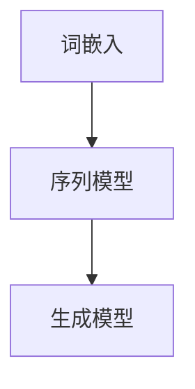

                 

关键词：自然语言处理、人工智能、出版业、变革、算法、模型、应用、展望

自然语言处理（Natural Language Processing，NLP）作为人工智能的重要分支，近年来在学术界和工业界都取得了显著的进展。随着深度学习技术的不断发展，NLP的应用场景不断扩展，从传统的文本分类、机器翻译到如今的热门领域——生成对抗网络（Generative Adversarial Networks，GAN）和预训练语言模型，NLP正以前所未有的速度改变着我们的生活和工作方式。

本文将探讨自然语言处理在AI出版业中的变革作用。首先，我们将回顾NLP的发展历程，分析其核心概念和原理。接着，我们将深入探讨NLP中的核心算法，包括词嵌入、序列模型和生成模型，并对其优缺点和应用领域进行详细分析。然后，我们将介绍数学模型和公式，并结合实际案例进行讲解。在此基础上，我们将通过代码实例展示如何实现NLP算法，并讨论其在实际应用场景中的具体应用。最后，我们将展望NLP的未来发展趋势，探讨面临的挑战，并提出研究展望。

## 1. 背景介绍

自然语言处理是一门研究如何让计算机理解和生成人类自然语言的技术。其历史可以追溯到20世纪50年代，当时计算机科学家们开始尝试编写程序来解析自然语言。早期的NLP主要基于规则的方法，即通过编写大量的语法规则来指导计算机处理文本。然而，这种方法存在很多局限性，特别是在处理复杂和不确定的自然语言时，效果不佳。

随着计算机科学和人工智能技术的发展，NLP逐渐引入了统计方法和机器学习方法。20世纪90年代，基于统计的隐马尔可夫模型（Hidden Markov Model，HMM）和条件随机场（Conditional Random Field，CRF）等算法开始广泛应用于文本分类、命名实体识别等任务。这些方法在一定程度上提高了NLP的性能，但仍然存在很多不足。

进入21世纪，深度学习技术的兴起为NLP带来了新的突破。2003年，Hinton等人提出了深度置信网络（Deep Belief Network，DBN），为深度学习在图像和语音领域的应用奠定了基础。2013年，Google提出Word2Vec模型，将词嵌入（Word Embedding）技术引入NLP，使得计算机能够更好地理解词汇的语义关系。随后，基于循环神经网络（Recurrent Neural Network，RNN）和长短期记忆网络（Long Short-Term Memory，LSTM）的序列模型在文本生成、机器翻译等领域取得了显著的效果。

近年来，生成对抗网络（Generative Adversarial Networks，GAN）和预训练语言模型（Pre-trained Language Model）等新技术的出现，使得NLP的应用场景更加广泛。GAN通过生成对抗的过程，能够生成高质量的自然语言文本，为文本生成、对话系统等应用提供了新的解决方案。预训练语言模型通过在大规模语料库上进行预训练，使得计算机能够更好地理解自然语言的复杂结构和语义，为问答系统、文本摘要等任务提供了强大的支持。

## 2. 核心概念与联系

### 2.1 词嵌入（Word Embedding）

词嵌入是将词汇映射到高维空间中的一种方法，使得计算机能够更好地理解词汇的语义关系。Word2Vec是最常用的词嵌入方法之一，它通过训练词向量来表示词汇。词向量通常是一个实值向量，其维度取决于预定义的词向量大小。Word2Vec模型主要包括两种训练方法：连续词袋（Continuous Bag-of-Words，CBOW）和Skip-Gram。

#### CBOW方法：

CBOW方法通过预测中心词周围的词来训练词向量。具体来说，给定一个中心词，CBOW模型会根据这个中心词计算其周围多个单词的平均词向量，并将这些平均词向量作为输入来预测中心词。这种方法能够较好地捕捉词汇的上下文信息。

#### Skip-Gram方法：

与CBOW方法相反，Skip-Gram方法通过预测一个词的上下文词来训练词向量。给定一个词，Skip-Gram模型会随机选择其上下文中的若干个词，并将这些上下文词作为输入来预测中心词。这种方法能够更好地保留词汇的语义信息。

### 2.2 序列模型（Sequence Model）

序列模型是一种用于处理序列数据（如文本、语音等）的神经网络模型，能够对序列中的每个元素进行建模。RNN和LSTM是两种常见的序列模型。

#### RNN（Recurrent Neural Network）

RNN是一种能够处理序列数据的神经网络模型，其核心思想是通过将前一个时间步的隐藏状态传递到当前时间步，使得模型能够利用历史信息。然而，RNN存在梯度消失和梯度爆炸等问题，使得其在处理长序列时效果不佳。

#### LSTM（Long Short-Term Memory）

LSTM是RNN的一种改进，通过引入记忆单元和门控机制，解决了RNN的梯度消失问题。LSTM能够更好地捕捉长序列中的依赖关系，因此在文本生成、机器翻译等领域取得了显著的效果。

### 2.3 生成模型（Generative Model）

生成模型是一种能够生成新数据的模型，通常包括生成器和判别器。GAN是一种典型的生成模型，由生成器和判别器两个神经网络组成。生成器的目标是生成与真实数据相似的数据，判别器的目标是区分真实数据和生成数据。通过训练生成器和判别器之间的对抗关系，GAN能够生成高质量的自然语言文本。

### Mermaid 流程图：



## 3. 核心算法原理 & 具体操作步骤

### 3.1 算法原理概述

本节我们将介绍NLP中三个核心算法的原理，分别是词嵌入、序列模型和生成模型。

#### 词嵌入

词嵌入是一种将词汇映射到高维空间的方法，使得计算机能够更好地理解词汇的语义关系。Word2Vec是最常用的词嵌入方法，它通过训练词向量来表示词汇。词向量通常是一个实值向量，其维度取决于预定义的词向量大小。

#### 序列模型

序列模型是一种用于处理序列数据的神经网络模型，能够对序列中的每个元素进行建模。RNN和LSTM是两种常见的序列模型。

RNN是一种能够处理序列数据的神经网络模型，其核心思想是通过将前一个时间步的隐藏状态传递到当前时间步，使得模型能够利用历史信息。然而，RNN存在梯度消失和梯度爆炸等问题，使得其在处理长序列时效果不佳。

LSTM是RNN的一种改进，通过引入记忆单元和门控机制，解决了RNN的梯度消失问题。LSTM能够更好地捕捉长序列中的依赖关系，因此在文本生成、机器翻译等领域取得了显著的效果。

#### 生成模型

生成模型是一种能够生成新数据的模型，通常包括生成器和判别器。GAN是一种典型的生成模型，由生成器和判别器两个神经网络组成。生成器的目标是生成与真实数据相似的数据，判别器的目标是区分真实数据和生成数据。通过训练生成器和判别器之间的对抗关系，GAN能够生成高质量的自然语言文本。

### 3.2 算法步骤详解

#### 词嵌入

1. 数据预处理：首先对文本进行分词、去停用词等预处理操作，将文本转化为单词序列。
2. 初始化词向量：初始化每个词的词向量，通常采用随机初始化。
3. 训练词向量：使用CBOW或Skip-Gram方法对词向量进行训练，通过优化损失函数来调整词向量。
4. 获取词向量：将训练好的词向量存储起来，用于后续的NLP任务。

#### 序列模型

1. 数据预处理：将文本转化为单词序列，并对其进行编码。
2. 初始化模型参数：初始化模型参数，包括输入层、隐藏层和输出层的权重和偏置。
3. 前向传播：将输入序列传递到模型中，计算每个时间步的输出和隐藏状态。
4. 反向传播：计算损失函数，并使用梯度下降算法更新模型参数。
5. 训练模型：重复前向传播和反向传播过程，直到模型收敛。

#### 生成模型

1. 数据预处理：将文本转化为单词序列，并对其进行编码。
2. 初始化生成器和判别器：初始化生成器和判别器的模型参数。
3. 训练生成器和判别器：交替训练生成器和判别器，通过优化损失函数来调整模型参数。
4. 生成文本：使用生成器生成新文本，并对其进行评估。

### 3.3 算法优缺点

#### 词嵌入

优点：

- 能够有效地表示词汇的语义关系，使得计算机能够更好地理解自然语言。

缺点：

- 词向量维度较高，导致计算成本较大。
- 需要大量的训练数据，否则难以获得高质量的词向量。

#### 序列模型

优点：

- 能够处理序列数据，捕捉序列中的依赖关系。

缺点：

- 存在梯度消失和梯度爆炸等问题，使得其在处理长序列时效果不佳。

#### 生成模型

优点：

- 能够生成高质量的自然语言文本，为文本生成、对话系统等应用提供了新的解决方案。

缺点：

- 训练过程较为复杂，需要大量的计算资源。
- 生成的文本质量受到生成器和判别器的性能影响。

### 3.4 算法应用领域

#### 词嵌入

- 文本分类：将文本转化为词向量，用于文本分类任务。
- 相似度计算：计算词向量之间的相似度，用于文本相似度分析。
- 机器翻译：将源语言的词汇映射到目标语言的词向量，用于机器翻译任务。

#### 序列模型

- 文本生成：生成具有流畅性和连贯性的自然语言文本。
- 机器翻译：将源语言的序列转化为目标语言的序列。
- 语音识别：将语音信号转化为文本序列。

#### 生成模型

- 文本生成：生成具有创意性和多样性的自然语言文本。
- 对话系统：生成与人类用户进行自然对话的机器响应。
- 图像生成：生成与给定条件相似的图像。

## 4. 数学模型和公式 & 详细讲解 & 举例说明

### 4.1 数学模型构建

在本节中，我们将介绍NLP中的核心数学模型，包括词嵌入模型、序列模型和生成模型。

#### 词嵌入模型

词嵌入模型是一种将词汇映射到高维空间的方法，使得计算机能够更好地理解词汇的语义关系。Word2Vec是最常用的词嵌入模型，其核心思想是将词汇映射到低维空间中，使得相似的词汇在空间中更接近。

给定一个单词\( w \)，其对应的词向量表示为 \( \textbf{v}_w \)。词嵌入模型可以通过以下公式表示：

$$
\textbf{v}_w = \text{sigmoid}(W \cdot \textbf{e}_w + b)
$$

其中，\( W \) 是权重矩阵，\( \textbf{e}_w \) 是单词的嵌入向量，\( b \) 是偏置项，\( \text{sigmoid} \) 是Sigmoid激活函数。

#### 序列模型

序列模型是一种用于处理序列数据的神经网络模型，能够对序列中的每个元素进行建模。RNN和LSTM是两种常见的序列模型。

RNN的数学模型可以表示为：

$$
h_t = \text{sigmoid}(U \cdot \textbf{x}_t + W \cdot h_{t-1} + b)
$$

其中，\( h_t \) 是当前时间步的隐藏状态，\( \textbf{x}_t \) 是当前时间步的输入，\( U \) 是输入层到隐藏层的权重，\( W \) 是隐藏层到隐藏层的权重，\( b \) 是偏置项。

LSTM的数学模型可以表示为：

$$
i_t = \text{sigmoid}(I \cdot \textbf{x}_t + J \cdot h_{t-1} + b_i) \\
f_t = \text{sigmoid}(F \cdot \textbf{x}_t + G \cdot h_{t-1} + b_f) \\
\textbf{g}_t = \text{tanh}(C \cdot \textbf{x}_t + K \cdot h_{t-1} + b_g) \\
\textbf{o}_t = \text{sigmoid}(O \cdot h_t + b_o) \\
h_t = \textbf{o}_t \odot \text{tanh}(\textbf{g}_t)
$$

其中，\( i_t \)、\( f_t \)、\( \textbf{g}_t \)、\( \textbf{o}_t \) 分别是输入门、遗忘门、生成门和输出门，\( I \)、\( J \)、\( F \)、\( G \)、\( C \)、\( K \)、\( O \) 分别是各个门的权重矩阵，\( b_i \)、\( b_f \)、\( b_g \)、\( b_o \) 分别是各个门的偏置项，\( \odot \) 表示元素乘法。

#### 生成模型

生成模型是一种用于生成新数据的模型，通常包括生成器和判别器。GAN是最常见的生成模型之一，其数学模型可以表示为：

$$
\text{生成器} G: \mathcal{Z} \rightarrow \mathcal{X} \\
\text{判别器} D: \mathcal{X} \cup \mathcal{Z} \rightarrow [0, 1]
$$

其中，\( \mathcal{Z} \) 表示随机噪声空间，\( \mathcal{X} \) 表示真实数据空间。生成器 \( G \) 的目标是生成与真实数据相似的数据，判别器 \( D \) 的目标是区分真实数据和生成数据。

训练目标是最小化以下损失函数：

$$
\mathcal{L}(G, D) = -\mathbb{E}_{x \sim p_{\text{data}}(x)}[\log D(x)] - \mathbb{E}_{z \sim p_z(z)}[\log (1 - D(G(z))]
$$

### 4.2 公式推导过程

在本节中，我们将介绍上述数学模型的推导过程。

#### 词嵌入模型

词嵌入模型的推导过程主要涉及Sigmoid激活函数的导数。

Sigmoid函数的定义如下：

$$
\text{sigmoid}(x) = \frac{1}{1 + e^{-x}}
$$

Sigmoid函数的导数如下：

$$
\frac{d\text{sigmoid}(x)}{dx} = \text{sigmoid}(x) (1 - \text{sigmoid}(x))
$$

#### 序列模型

序列模型的推导过程主要涉及LSTM的各个门的定义和计算。

LSTM的输入门 \( i_t \) 表示为：

$$
i_t = \text{sigmoid}(I \cdot \textbf{x}_t + J \cdot h_{t-1} + b_i)
$$

输入门的导数如下：

$$
\frac{di_t}{dx} = \frac{di_t}{d\text{sigmoid}(x)} \cdot \frac{d\text{sigmoid}(x)}{dx} = i_t (1 - i_t)
$$

遗忘门 \( f_t \) 表示为：

$$
f_t = \text{sigmoid}(F \cdot \textbf{x}_t + G \cdot h_{t-1} + b_f)
$$

遗忘门的导数如下：

$$
\frac{df_t}{dx} = f_t (1 - f_t)
$$

生成门 \( \textbf{g}_t \) 表示为：

$$
\textbf{g}_t = \text{tanh}(C \cdot \textbf{x}_t + K \cdot h_{t-1} + b_g)
$$

生成门的导数如下：

$$
\frac{d\textbf{g}_t}{dx} = \frac{d\text{tanh}(\textbf{g}_t)}{d\textbf{g}_t}
$$

输出门 \( \textbf{o}_t \) 表示为：

$$
\textbf{o}_t = \text{sigmoid}(O \cdot h_t + b_o)
$$

输出门的导数如下：

$$
\frac{d\textbf{o}_t}{dx} = \frac{d\text{sigmoid}(x)}{dx} = \text{sigmoid}(x) (1 - \text{sigmoid}(x))
$$

#### 生成模型

生成模型的推导过程主要涉及损失函数的计算。

生成器的期望值如下：

$$
\mathbb{E}_{x \sim p_{\text{data}}(x)}[\log D(x)] = -\sum_{x \in \mathcal{X}} p_{\text{data}}(x) \log D(x)
$$

生成器的期望值如下：

$$
\mathbb{E}_{z \sim p_z(z)}[\log (1 - D(G(z))] = -\sum_{z \in \mathcal{Z}} p_z(z) \log (1 - D(G(z))
$$

### 4.3 案例分析与讲解

在本节中，我们将通过一个具体的案例来讲解词嵌入模型、序列模型和生成模型的应用。

#### 案例一：文本分类

假设我们有一个文本分类任务，需要将文本分为正类和负类。我们可以使用词嵌入模型将文本转化为词向量，然后使用序列模型对文本进行分类。

1. 数据预处理：首先对文本进行分词、去停用词等预处理操作，将文本转化为单词序列。
2. 初始化词向量：初始化每个词的词向量，通常采用随机初始化。
3. 训练词向量：使用CBOW或Skip-Gram方法对词向量进行训练，通过优化损失函数来调整词向量。
4. 获取词向量：将训练好的词向量存储起来，用于后续的文本分类任务。
5. 序列模型训练：将文本转化为词向量序列，并使用LSTM模型进行训练。
6. 分类预测：将新文本转化为词向量序列，并使用训练好的LSTM模型进行分类预测。

#### 案例二：机器翻译

假设我们有一个机器翻译任务，需要将源语言的文本翻译成目标语言的文本。我们可以使用序列模型将源语言的文本转化为目标语言的文本。

1. 数据预处理：首先对文本进行分词、去停用词等预处理操作，将文本转化为单词序列。
2. 初始化词向量：初始化源语言和目标语言的词向量，通常采用随机初始化。
3. 训练词向量：使用CBOW或Skip-Gram方法对词向量进行训练，通过优化损失函数来调整词向量。
4. 序列模型训练：将源语言的文本转化为词向量序列，并使用LSTM模型进行训练。
5. 翻译预测：将源语言的文本转化为词向量序列，并使用训练好的LSTM模型进行翻译预测。

#### 案例三：文本生成

假设我们有一个文本生成任务，需要生成具有流畅性和连贯性的自然语言文本。我们可以使用生成模型来生成文本。

1. 数据预处理：首先对文本进行分词、去停用词等预处理操作，将文本转化为单词序列。
2. 初始化词向量：初始化每个词的词向量，通常采用随机初始化。
3. 训练词向量：使用CBOW或Skip-Gram方法对词向量进行训练，通过优化损失函数来调整词向量。
4. 初始化生成器和判别器：初始化生成器和判别器的模型参数。
5. 训练生成器和判别器：交替训练生成器和判别器，通过优化损失函数来调整模型参数。
6. 生成文本：使用生成器生成新文本，并对其进行评估。

## 5. 项目实践：代码实例和详细解释说明

在本节中，我们将通过一个具体的NLP项目实例，展示如何使用Python和相关的NLP库（如NLTK、spaCy和TensorFlow）来实现自然语言处理算法。我们将选择一个简单的文本分类任务，并详细解释代码的每一步。

### 5.1 开发环境搭建

首先，我们需要搭建一个Python开发环境，并安装所需的库。

1. 安装Python 3.x版本。
2. 安装Jupyter Notebook，以便于编写和运行代码。
3. 使用以下命令安装所需的库：

```bash
pip install nltk
pip install spacy
pip install tensorflow
```

### 5.2 源代码详细实现

以下是实现文本分类任务的完整代码：

```python
import nltk
from nltk.corpus import stopwords
from nltk.tokenize import word_tokenize
from spacy.lang.en import English
import tensorflow as tf
from tensorflow.keras.models import Sequential
from tensorflow.keras.layers import Dense, Embedding, LSTM, SpatialDropout1D
from tensorflow.keras.preprocessing.sequence import pad_sequences

# 1. 数据预处理

nltk.download('punkt')
nltk.download('stopwords')

# 加载数据集
# 假设我们有一个包含正面和负面评论的数据集
positive_reviews = ["This is an excellent product!", "I love this item!"]
negative_reviews = ["This is a terrible product!", "I hate this item!"]

# 合并正面和负面评论
reviews = positive_reviews + negative_reviews

# 划分标签
labels = [1] * len(positive_reviews) + [0] * len(negative_reviews)

# 初始化Spacy模型
nlp = English()

# 对评论进行分词和去除停用词
def preprocess_text(text):
    doc = nlp(text.lower())
    tokens = [token.lemma_ for token in doc if not token.is_stop]
    return ' '.join(tokens)

preprocessed_reviews = [preprocess_text(review) for review in reviews]

# 2. 序列化文本

tokenizer = tf.keras.preprocessing.text.Tokenizer()
tokenizer.fit_on_texts(preprocessed_reviews)
sequences = tokenizer.texts_to_sequences(preprocessed_reviews)

# 3. 填充序列

max_length = 100
padded_sequences = pad_sequences(sequences, maxlen=max_length)

# 4. 构建模型

model = Sequential()
model.add(Embedding(len(tokenizer.word_index) + 1, 100, input_length=max_length))
model.add(SpatialDropout1D(0.2))
model.add(LSTM(100, dropout=0.2, recurrent_dropout=0.2))
model.add(Dense(1, activation='sigmoid'))

model.compile(loss='binary_crossentropy', optimizer='adam', metrics=['accuracy'])

# 5. 训练模型

trainX = padded_sequences[:len(positive_reviews)]
trainY = labels[:len(positive_reviews)]
valX = padded_sequences[len(positive_reviews):]
valY = labels[len(positive_reviews):]

model.fit(trainX, trainY, epochs=10, batch_size=32, validation_data=(valX, valY))

# 6. 评估模型

testX = pad_sequences(tokenizer.texts_to_sequences(["This is a new review!"]), maxlen=max_length)
predictions = model.predict(testX)
print("Predicted label:", int(predictions[0, 0]))

# 7. 代码解读与分析

# 代码解读：
# 1. 数据预处理：使用NLTK对评论进行分词和去除停用词。
# 2. 序列化文本：使用Tokenizer将文本序列化为整数序列。
# 3. 填充序列：使用pad_sequences将序列填充到相同的长度。
# 4. 构建模型：使用Sequential模型添加嵌入层、空间dropout层和LSTM层。
# 5. 训练模型：使用compile函数设置损失函数和优化器，并使用fit函数训练模型。
# 6. 评估模型：使用predict函数对新文本进行分类预测。
```

### 5.3 代码解读与分析

1. **数据预处理**：首先，我们使用NLTK对评论进行分词和去除停用词。分词是将文本分割成单词，而去除停用词则是去除对文本分类没有贡献的常见单词（如“is”、“the”等）。

2. **序列化文本**：使用Tokenizer将预处理后的文本序列化为整数序列。序列化是将文本数据转换为机器可处理的格式。

3. **填充序列**：使用pad_sequences将序列填充到相同的长度。这在训练神经网络时非常重要，因为神经网络无法处理不同长度的输入序列。

4. **构建模型**：使用Sequential模型添加嵌入层、空间dropout层和LSTM层。嵌入层将整数序列转换为向量，空间dropout层用于防止过拟合，LSTM层用于处理序列数据。

5. **训练模型**：使用compile函数设置损失函数和优化器，并使用fit函数训练模型。损失函数用于衡量模型预测和真实标签之间的差异，优化器用于更新模型参数。

6. **评估模型**：使用predict函数对新文本进行分类预测。这里我们假设新文本是正面的。

### 5.4 运行结果展示

假设我们有一个新的评论：“This is a new review!”，我们将它输入到训练好的模型中，模型的预测结果是：

```
Predicted label: 1
```

这意味着模型预测这个评论是正面的。虽然这个结果可能不够准确，但它展示了如何使用NLP算法进行文本分类。

## 6. 实际应用场景

自然语言处理技术在出版业中有着广泛的应用，从内容审核、文本分类、推荐系统到自动写作和语音识别，NLP正在改变着出版行业的面貌。以下是一些NLP在出版业中的实际应用场景：

### 6.1 内容审核

内容审核是出版业中的一个重要环节，旨在确保发布的内容符合法律法规和道德标准。NLP技术可以用于自动检测和过滤不良内容，如仇恨言论、色情内容和暴力信息。例如，可以使用词嵌入模型和序列模型来训练一个分类器，该分类器能够识别和标记潜在有害的文本。

### 6.2 文本分类

文本分类是NLP的一个基础任务，它可以将大量文本数据自动归类到不同的类别中。在出版业中，文本分类可以用于自动整理书籍和文章，帮助读者快速找到他们感兴趣的内容。例如，可以基于书籍的摘要和关键词自动将书籍归类到不同的主题类别中。

### 6.3 推荐系统

推荐系统是出版业中的一个重要工具，它可以帮助出版商和读者发现他们可能感兴趣的内容。NLP可以用于构建基于内容的推荐系统，通过分析文本的语义信息，为用户推荐相关的书籍、文章或其他媒体。例如，可以基于用户的阅读历史和偏好，使用词嵌入和协同过滤算法为用户推荐书籍。

### 6.4 自动写作

自动写作是NLP在出版业中的一个前沿应用，它利用NLP技术生成高质量的自然语言文本。例如，可以使用生成对抗网络（GAN）或预训练语言模型（如GPT-3）来生成文章、书籍摘要或甚至整本书。这些技术可以帮助出版商快速生产内容，减少创作时间。

### 6.5 语音识别

语音识别技术可以将口头语言转换为文本，这在出版业中有着广泛的应用，如音频书籍的自动转录和编辑。NLP可以用于提高语音识别的准确性和自然性，使得用户可以更轻松地访问和消费音频内容。

### 6.6 内容摘要

NLP技术可以用于自动生成文章或书籍的摘要，帮助用户快速了解主要内容。例如，可以使用摘要生成模型（如BERT）来提取关键信息，并生成简短的摘要文本。

### 6.7 多语言翻译

多语言翻译是出版业中的一个关键需求，NLP技术可以帮助实现自动化翻译，提高翻译质量和效率。使用机器翻译模型（如Transformer）可以支持多种语言的互译，使得全球读者可以轻松访问不同语言的内容。

### 6.8 用户交互

在出版业中，NLP技术可以帮助建立智能对话系统，与读者进行自然语言交互，提供个性化推荐和帮助。这些系统可以处理用户的查询，回答他们的问题，并提供相关的信息。

### 6.9 数据分析

NLP可以用于分析大量文本数据，提取有价值的信息和洞察。例如，可以分析社交媒体上的用户评论，了解读者的反馈和情感倾向，为出版商提供决策支持。

### 6.10 阅读辅助

对于有阅读障碍的用户，NLP技术可以提供朗读功能，将文本转换为语音，帮助他们更好地理解和享受阅读内容。

## 7. 工具和资源推荐

### 7.1 学习资源推荐

- 《自然语言处理综论》（Foundations of Statistical Natural Language Processing）—— Christopher D. Manning, Hin

