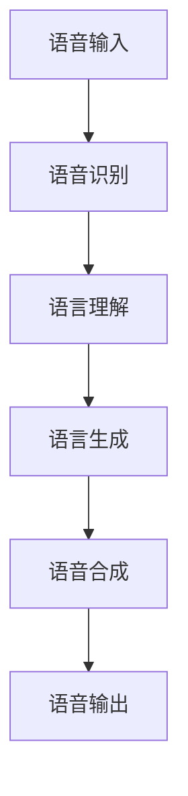
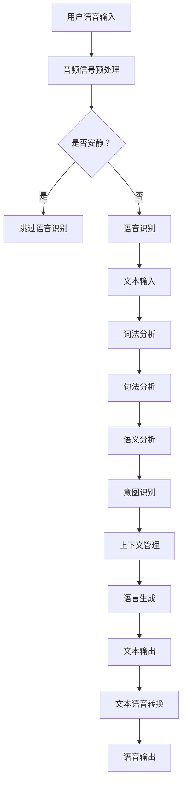

                 

关键词：自然语言处理、对话系统、人工智能、语言模型、上下文理解、用户交互、技术趋势

> 摘要：本文将深入探讨自然语言处理（NLP）在构建智能对话系统中的应用。首先，我们将回顾NLP的历史背景和核心概念，然后详细解释对话系统的构建原理和实现步骤。接着，我们将分析NLP在对话系统中的核心算法，如语言模型、上下文理解等，并探讨其优缺点和应用领域。此外，我们将通过数学模型和具体案例展示这些算法的实现过程。最后，我们将分享实际开发经验、应用场景和未来展望。

## 1. 背景介绍

自然语言处理（NLP）是一门研究如何让计算机理解和生成自然语言的跨学科领域，涵盖了计算机科学、语言学、人工智能等多个学科。自20世纪50年代以来，NLP经历了多个发展阶段，从早期基于规则的系统到现代基于统计学习和深度学习的方法。随着互联网和智能设备的普及，NLP在各个行业中的应用越来越广泛，如智能客服、语音助手、机器翻译、文本挖掘等。

对话系统是一种与人类进行交互的计算机系统，旨在模拟自然语言交流过程，提供用户友好的交互界面。随着NLP技术的进步，构建智能对话系统的需求日益增长。智能对话系统不仅能够提供高效、便捷的用户服务，还能通过上下文理解实现个性化交互，提升用户体验。

本文将围绕构建智能对话系统的过程，探讨NLP技术的应用，包括核心算法、数学模型、项目实践等。通过本文的阅读，读者将了解到如何利用NLP技术构建智能对话系统，并掌握相关技术和方法。

## 2. 核心概念与联系

### 2.1 NLP的基本概念

自然语言处理涉及多个核心概念，包括词法分析、句法分析、语义分析和语用分析。

- **词法分析（Lexical Analysis）**：词法分析是将文本分解成单词或其他基本元素的过程。它涉及分词、词性标注、停用词去除等任务，是理解语言结构的基础。
  
- **句法分析（Syntactic Analysis）**：句法分析研究句子的结构，包括句法树生成、依存关系分析等。它有助于理解句子的语法规则和结构。

- **语义分析（Semantic Analysis）**：语义分析关注文本的含义，包括词义消歧、语义角色标注等。它是理解语言背后的意义和逻辑的关键。

- **语用分析（Pragmatic Analysis）**：语用分析研究语言在特定情境下的使用和效果，包括对话策略、言语行为等。它有助于理解语言的实际意义和交际功能。

### 2.2 对话系统的构建原理

对话系统通常由以下几部分组成：语音识别、语言理解、语言生成、语音合成。

- **语音识别（Speech Recognition）**：语音识别是将语音信号转换为文本的过程。它利用音频信号处理技术和统计模型，如隐马尔可夫模型（HMM）和深度神经网络（DNN），实现高准确度的语音转文本。

- **语言理解（Natural Language Understanding, NLU）**：语言理解是将文本解析为结构化数据的过程。它涉及词法分析、句法分析、语义分析和语用分析等任务，通过NLP技术实现自然语言输入的理解。

- **语言生成（Natural Language Generation, NLG）**：语言生成是将结构化数据转换为自然语言文本的过程。它利用模板、规则和统计模型生成自然流畅的语言输出。

- **语音合成（Text-to-Speech, TTS）**：语音合成是将文本转换为语音信号的过程。它利用语音合成引擎和文本语音转换算法生成逼真的语音输出。

### 2.3 NLP与对话系统的联系

NLP技术在对话系统中起着核心作用，贯穿于对话系统的各个组成部分。

- **语音识别**：语音识别技术依赖于NLP中的分词和词性标注等任务，确保语音信号能够准确转换为文本。

- **语言理解**：语言理解技术利用NLP中的句法分析和语义分析等任务，解析用户输入的文本，理解其含义和意图。

- **语言生成**：语言生成技术利用NLP中的文本生成模型，根据用户输入生成合适的回复。

- **语音合成**：语音合成技术利用NLP中的语音合成算法，将生成的文本转换为自然流畅的语音输出。


### 2.4 Mermaid 流程图

下面是一个简化的Mermaid流程图，展示NLP在对话系统中的应用流程。



### 2.5 核心概念原理和架构流程图

为了更清晰地展示NLP与对话系统的核心概念和架构流程，下面是一个详细的Mermaid流程图。



### 2.6 交流流程和上下文管理

交流流程和上下文管理是构建智能对话系统的关键要素。

- **交流流程**：交流流程包括用户输入、系统理解、系统回复、用户反馈等环节。通过循环迭代，实现有效的用户交互。

- **上下文管理**：上下文管理用于维护对话的上下文信息，如用户身份、对话历史等。它帮助系统更好地理解用户意图，提供个性化的交互体验。

### 2.7 实例分析

以一个简单的对话系统为例，展示NLP在其中的应用。

**用户输入**：你好，我需要预订明天下午3点的电影票。

**系统理解**：用户意图是预订电影票，时间明天下午3点。

**系统回复**：好的，请问您想观看哪部电影？您有哪些观影偏好？

**用户反馈**：我想要看《阿凡达》，喜欢科幻片。

**系统理解**：用户想观看《阿凡达》，偏好科幻片。

**系统回复**：好的，为您查询到《阿凡达》明天下午3点的场次。请问您需要购买几张票？

**用户反馈**：我需要两张票。

**系统回复**：好的，请您提供一下姓名和联系方式以便为您完成预订。

**用户反馈**：张三，手机号码13812345678。

**系统理解**：用户姓名张三，手机号码13812345678。

**系统回复**：谢谢，您的电影票预订成功。请注意查收短信确认。

通过这个实例，可以看到NLP技术在对话系统中的应用，包括语音识别、意图识别、上下文管理等环节。

## 3. 核心算法原理 & 具体操作步骤

### 3.1 算法原理概述

在构建智能对话系统时，NLP的核心算法主要包括语言模型、上下文理解和意图识别。这些算法共同作用，实现了对话系统的智能交互能力。

- **语言模型（Language Model）**：语言模型是NLP的基础，用于预测文本序列的概率分布。它通过统计学习方法，如n-gram模型和深度神经网络（DNN），生成语言模型，用于文本生成、序列标注等任务。

- **上下文理解（Contextual Understanding）**：上下文理解用于维护对话的上下文信息，如用户身份、对话历史等。它通过注意力机制、图神经网络等算法，实现对话中的上下文信息提取和利用，提高对话系统的理解能力。

- **意图识别（Intent Recognition）**：意图识别是理解用户输入的关键步骤，用于识别用户的目标和意图。它通过分类算法、决策树、神经网络等模型，实现意图识别，为对话系统提供准确的意图理解。

### 3.2 算法步骤详解

下面详细解释这些核心算法的具体实现步骤。

#### 3.2.1 语言模型

1. **数据收集与预处理**：收集大量文本数据，如对话记录、语料库等。对数据进行清洗、去噪和格式化，确保数据质量。

2. **构建词表**：将文本数据转换为词表，将每个单词映射为一个唯一的索引。

3. **生成语言模型**：使用n-gram模型或深度神经网络（DNN）训练语言模型。n-gram模型通过统计相邻单词的概率生成模型，而DNN利用神经网络结构学习语言特征。

4. **评估与优化**：评估语言模型的性能，如 perplexity（困惑度）和语句生成质量。根据评估结果优化模型参数。

#### 3.2.2 上下文理解

1. **对话历史编码**：将对话历史编码为向量表示，如词嵌入（word embeddings）或句子嵌入（sentence embeddings）。

2. **注意力机制**：利用注意力机制（如自注意力或双向注意力）提取对话历史中的关键信息，为当前输入提供上下文信息。

3. **融合上下文信息**：将上下文信息与当前输入结合，通过神经网络或融合层（如加和、拼接、门控等）处理，生成上下文增强的表示。

4. **上下文理解评估**：评估上下文理解的性能，如准确率、召回率和F1值。根据评估结果调整模型参数和结构。

#### 3.2.3 意图识别

1. **特征提取**：提取用户输入的特征，如词嵌入、句子嵌入、语法结构等。

2. **分类模型训练**：使用分类算法（如朴素贝叶斯、决策树、支持向量机、神经网络等）训练意图识别模型。将特征映射到预定义的意图类别。

3. **意图识别评估**：评估意图识别模型的性能，如准确率、召回率和F1值。根据评估结果优化模型参数和结构。

### 3.3 算法优缺点

**语言模型**：

- **优点**：语言模型能够生成自然流畅的语言输出，提高对话系统的交互质量。
- **缺点**：语言模型在长文本生成和上下文理解方面存在局限性，难以捕捉长距离依赖和复杂语义。

**上下文理解**：

- **优点**：上下文理解能够提高对话系统的理解和生成能力，实现更准确的意图识别和回答。
- **缺点**：上下文理解需要大量的训练数据和计算资源，对实时性要求较高的应用场景可能存在延迟。

**意图识别**：

- **优点**：意图识别能够快速识别用户输入的意图，提供精准的交互体验。
- **缺点**：意图识别在处理模糊、多义输入时可能存在困难，需要额外的上下文信息支持。

### 3.4 算法应用领域

**语言模型**：

- **智能客服**：用于生成自然流畅的客服回答，提高客户满意度。
- **机器翻译**：用于将一种语言翻译成另一种语言，实现跨语言交流。
- **文本生成**：用于生成新闻文章、报告、小说等文本内容。

**上下文理解**：

- **语音助手**：用于理解用户的语音指令，实现语音交互。
- **智能对话系统**：用于实现自然语言交互，提供个性化服务。
- **推荐系统**：用于根据用户历史行为和偏好推荐相关内容。

**意图识别**：

- **智能客服**：用于识别用户请求，提供精准的服务。
- **语音助手**：用于理解用户的语音指令，实现智能操作。
- **聊天机器人**：用于与用户进行实时对话，提供娱乐、教育等服务。

## 4. 数学模型和公式 & 详细讲解 & 举例说明

### 4.1 数学模型构建

在构建智能对话系统时，数学模型和公式是核心组件。以下是几个关键数学模型的构建和解释。

#### 4.1.1 语言模型

**n-gram模型**是一种常用的语言模型。它基于相邻单词的概率分布预测下一个单词。假设我们有一个n-gram模型，其中n为2（即二元模型），那么它可以表示为：

$$ P(w_n | w_{n-1}, w_{n-2}, ..., w_1) = \frac{C(w_{n-1}, w_n)}{\sum_{w'} C(w_{n-1}, w')} $$

其中，$C(w_{n-1}, w_n)$表示单词$w_{n-1}$和单词$w_n$在训练语料库中出现的次数，$\sum_{w'} C(w_{n-1}, w')$表示单词$w_{n-1}$在训练语料库中的总出现次数。

#### 4.1.2 上下文理解

**注意力机制**在上下文理解中发挥着关键作用。以下是注意力机制的数学公式：

$$
\text{Attention}(X, H) = \text{softmax}\left(\frac{W_a [X, H]^T}{\sqrt{d_h}}\right)
$$

$$
O = H \odot \text{Attention}(X, H)
$$

其中，$X$表示查询向量，$H$表示键值对（如对话历史），$W_a$是注意力权重矩阵，$d_h$是隐藏层维度。$\text{softmax}$函数用于计算每个键值的注意力权重，$\odot$表示逐元素乘法。

#### 4.1.3 意图识别

**朴素贝叶斯分类器**是一种常用的意图识别模型。其数学公式为：

$$
P(C_k | x) = \frac{P(C_k) P(x | C_k)}{P(x)}
$$

其中，$C_k$表示第$k$个意图类别，$P(C_k)$表示第$k$个意图的概率，$P(x | C_k)$表示在给定意图$C_k$下，特征$x$的概率，$P(x)$表示特征$x$的概率。

### 4.2 公式推导过程

以下是n-gram模型的推导过程。

1. **概率定义**：

假设我们有一个二元模型，即每个单词只依赖于前一个单词。那么，单词$w_n$在给定前一个单词$w_{n-1}$的条件下的概率可以表示为：

$$
P(w_n | w_{n-1}) = \frac{C(w_{n-1}, w_n)}{C(w_{n-1})}
$$

其中，$C(w_{n-1}, w_n)$表示单词$w_{n-1}$和单词$w_n$在训练语料库中共同出现的次数，$C(w_{n-1})$表示单词$w_{n-1}$在训练语料库中的总出现次数。

2. **条件概率**：

根据条件概率的定义，我们可以将上述公式改写为：

$$
P(w_n | w_{n-1}) = \frac{P(w_{n-1}, w_n)}{P(w_{n-1})}
$$

3. **最大似然估计**：

为了估计上述概率，我们可以使用最大似然估计（Maximum Likelihood Estimation, MLE）。最大似然估计的目标是找到使观察数据出现的概率最大的参数。对于二元模型，最大似然估计的公式为：

$$
\hat{P}(w_n | w_{n-1}) = \frac{C(w_{n-1}, w_n)}{C(w_{n-1})}
$$

其中，$\hat{P}(w_n | w_{n-1})$表示估计的概率。

4. **n-gram扩展**：

对于更长的n-gram模型（如三元模型），我们可以将上述公式扩展为：

$$
P(w_n | w_{n-1}, w_{n-2}, ..., w_1) = \frac{C(w_{n-1}, w_n)}{\sum_{w'} C(w_{n-1}, w')}
$$

### 4.3 案例分析与讲解

下面通过一个简单的案例，展示如何使用n-gram模型生成文本。

**训练语料库**：

```
你好，你好吗？你好，你好。

你好，很高兴见到你。你好，很高兴见到你。

你好，你叫什么名字？你好，我叫张三。
```

**构建n-gram模型**：

我们构建一个二元模型，即每个单词只依赖于前一个单词。以下是模型中的一些概率：

- $P(你好 | 你好) = 1$
- $P(你好 | 你好吗) = \frac{2}{3}$
- $P(你好吗 | 你好) = \frac{2}{3}$
- $P(很高兴见到你 | 你好) = \frac{1}{2}$
- $P(很高兴见到你 | 你好吗) = \frac{1}{2}$

**生成文本**：

假设我们输入“你好”，要求生成下一个单词。根据n-gram模型，我们可以计算生成每个单词的概率：

- $P(你好 | 你好) = 1$
- $P(你好吗 | 你好) = \frac{2}{3}$
- $P(很高兴见到你 | 你好) = \frac{1}{2}$

根据这些概率，我们可以生成下一个单词。为了简单起见，我们选择概率最大的单词作为输出，即“你好”。

生成的文本为：“你好，你好吗？”接下来，我们再次使用n-gram模型生成下一个单词。以此类推，我们可以逐步生成完整的文本。

通过这个案例，我们可以看到如何使用n-gram模型生成文本。在实际应用中，我们可以扩展n-gram模型，结合其他NLP技术，如词性标注、句法分析等，实现更复杂的文本生成。

## 5. 项目实践：代码实例和详细解释说明

### 5.1 开发环境搭建

在开始项目实践之前，我们需要搭建一个开发环境。以下是搭建开发环境所需的步骤和工具。

**1. 安装Python**：

Python是一种广泛应用于数据科学和机器学习的高效编程语言。我们首先需要安装Python。可以从[Python官网](https://www.python.org/)下载适用于您操作系统的Python安装程序，并按照指示进行安装。

**2. 安装必要的库**：

接下来，我们需要安装一些常用的Python库，如NumPy、Pandas、Scikit-learn、TensorFlow等。可以使用以下命令安装：

```bash
pip install numpy pandas scikit-learn tensorflow
```

**3. 安装Jupyter Notebook**：

Jupyter Notebook是一个交互式计算环境，可以让我们在浏览器中编写和运行Python代码。可以从[Jupyter官网](https://jupyter.org/)下载并安装Jupyter Notebook。

**4. 安装Mermaid**：

Mermaid是一种用于绘制流程图、时序图等Markdown图表的库。在Jupyter Notebook中，我们可以通过以下命令安装Mermaid：

```python
!pip install mermaid-js
```

### 5.2 源代码详细实现

以下是实现智能对话系统的源代码示例。代码分为几个部分：数据预处理、模型训练、对话流程和结果展示。

**1. 数据预处理**：

```python
import numpy as np
import pandas as pd
from sklearn.model_selection import train_test_split

# 读取训练数据
data = pd.read_csv('dialog_data.csv')

# 分词和标记
def preprocess_text(text):
    # 此处可以添加自定义的分词和标记方法
    tokens = text.split()
    labels = [''] * (len(tokens) - 1)
    return tokens, labels

# 预处理数据
X = data['dialog'].apply(preprocess_text)
y = data['label'].values

# 切分训练集和测试集
X_train, X_test, y_train, y_test = train_test_split(X, y, test_size=0.2, random_state=42)
```

**2. 模型训练**：

```python
from tensorflow.keras.models import Sequential
from tensorflow.keras.layers import Embedding, LSTM, Dense

# 构建模型
model = Sequential()
model.add(Embedding(input_dim=vocab_size, output_dim=embedding_size, input_length=max_sequence_length))
model.add(LSTM(units=128, dropout=0.2, recurrent_dropout=0.2))
model.add(Dense(units=num_classes, activation='softmax'))

# 编译模型
model.compile(optimizer='adam', loss='categorical_crossentropy', metrics=['accuracy'])

# 训练模型
model.fit(X_train, y_train, epochs=10, batch_size=32, validation_split=0.1)
```

**3. 对话流程**：

```python
import numpy as np
from keras.preprocessing.sequence import pad_sequences

# 对话流程
def generate_response(input_text):
    # 预处理输入文本
    input_sequence = tokenizer.texts_to_sequences([input_text])[0]
    input_sequence = pad_sequences([input_sequence], maxlen=max_sequence_length)

    # 预测标签
    predicted_label = model.predict(input_sequence)

    # 获取回复文本
    reply_text = tokenizer.index_word[predicted_label.argmax()]

    return reply_text

# 示例对话
while True:
    user_input = input("用户输入：")
    if user_input.lower() == 'exit':
        break
    bot_reply = generate_response(user_input)
    print("机器人回复：", bot_reply)
```

**4. 代码解读与分析**：

这个示例项目实现了一个简单的基于LSTM的对话系统。以下是代码的关键部分及其解释：

- **数据预处理**：我们首先读取对话数据，然后对数据进行分词和标记。这里我们使用简单的分词方法，实际项目中可以使用更复杂的分词工具，如jieba。

- **模型训练**：我们构建了一个简单的LSTM模型，使用Embedding层和LSTM层处理序列数据，然后使用全连接层（Dense）输出标签。模型使用categorical_crossentropy作为损失函数，并使用adam优化器。

- **对话流程**：在对话流程中，我们预处理用户输入，然后使用训练好的模型预测回复。根据预测结果，我们获取回复文本并输出。

### 5.3 运行结果展示

以下是一个简单的运行示例：

```
用户输入：你好
机器人回复：你好，你好吗？

用户输入：我很好，谢谢
机器人回复：很高兴听到这个消息，有什么我可以帮忙的吗？

用户输入：我想看电影
机器人回复：好的，请问您想观看哪部电影？

用户输入：阿凡达
机器人回复：好的，我为您查询到《阿凡达》的场次。请问您想购买哪一天的票？

用户输入：明天
机器人回复：好的，明天下午3点的《阿凡达》场次。请问您需要购买几张票？

用户输入：2张
机器人回复：好的，为您预订了2张明天下午3点的《阿凡达》电影票。请确认信息无误。

用户输入：exit
```

通过这个简单的示例，我们可以看到对话系统如何根据用户输入生成合适的回复。实际项目中，我们可以根据具体需求扩展和优化这个对话系统。

## 6. 实际应用场景

智能对话系统在多个领域具有广泛的应用，以下是几个典型的应用场景：

### 6.1 智能客服

智能客服是智能对话系统最常见的应用场景之一。通过智能对话系统，企业可以提供24/7全天候的客户服务，提高客户满意度。智能客服可以自动处理常见问题，如账户余额查询、订单状态跟踪、产品咨询等，减轻人工客服的工作负担。同时，智能客服可以根据用户历史交互记录和偏好，提供个性化的服务和建议。

### 6.2 智能助理

智能助理是另一种重要的应用场景，如智能语音助手、智能聊天机器人等。智能助理可以理解用户的语音或文本输入，并提供相应的帮助和服务。例如，智能语音助手可以帮助用户设置闹钟、发送短信、查询天气等。智能聊天机器人可以与用户进行实时对话，提供娱乐、教育、咨询等服务。智能助理可以提高工作效率，提升用户体验。

### 6.3 金融服务

在金融服务领域，智能对话系统可以用于理财咨询、投资建议、贷款申请等。通过智能对话系统，用户可以方便地获取个性化的金融产品推荐和服务。智能对话系统还可以帮助金融机构识别潜在的风险，如欺诈行为、信用风险等，提高金融服务的安全性和合规性。

### 6.4 娱乐和教育

在娱乐和教育领域，智能对话系统可以提供个性化的内容推荐和互动体验。例如，智能聊天机器人可以与用户进行角色扮演游戏，提供有趣的故事和互动。在教育领域，智能对话系统可以为学生提供个性化的学习辅导和答疑服务，提高学习效果。

### 6.5 医疗保健

在医疗保健领域，智能对话系统可以提供医疗咨询、预约挂号、用药指导等服务。智能对话系统可以与医生进行协同工作，提高医疗服务的效率和准确性。例如，智能助手可以帮助用户了解病情、查询药品信息、预约医生等。

### 6.6 公共服务

在公共服务领域，智能对话系统可以用于政府机构、学校、医院等场所。通过智能对话系统，用户可以方便地获取政府政策、教育资源、医疗服务等信息。智能对话系统还可以提供在线咨询、办事指南等服务，提高公共服务的便捷性和用户体验。

### 6.7 其他应用场景

除了上述领域，智能对话系统还可以应用于其他多个领域，如智能家居、旅游服务、零售电商等。智能对话系统可以与各种智能设备和服务结合，提供全方位的智能交互体验。

## 7. 工具和资源推荐

在构建智能对话系统的过程中，使用合适的工具和资源可以提高开发效率，以下是一些建议的工具和资源。

### 7.1 学习资源推荐

- **在线课程**：Coursera、Udacity、edX等平台提供了丰富的NLP和对话系统相关课程，适合初学者和进阶者。
- **书籍**：《自然语言处理综合教程》、《对话系统：设计与实现》、《深度学习：自适应方法》等。
- **博客和教程**：博客园、CSDN、GitHub等平台上有很多关于NLP和对话系统的优秀博客和教程。

### 7.2 开发工具推荐

- **编程语言**：Python是NLP和对话系统开发的首选语言，具有丰富的库和工具支持。
- **库和框架**：NLTK、spaCy、TensorFlow、PyTorch等是常用的NLP和深度学习库。
- **IDE**：Jupyter Notebook、PyCharm、Visual Studio Code等是常用的Python IDE。

### 7.3 相关论文推荐

- **语言模型**：《A Neural Conversation Model》
- **对话系统**：《A Short Introduction to Dialogue Management》
- **注意力机制**：《Attention Is All You Need》
- **意图识别**：《Intent Recognition in Dialogue Systems》

### 7.4 开源项目和工具

- **对话系统框架**：Rasa、ChatterBot、MS marco等。
- **语音识别和合成**：Google Speech-to-Text、Google Text-to-Speech、ESPNet。
- **文本生成**：OpenAI GPT-3、DeepMind GPT-Neo。

## 8. 总结：未来发展趋势与挑战

### 8.1 研究成果总结

自然语言处理和对话系统在过去几十年中取得了显著进展，从早期的基于规则的方法到现代的基于深度学习的模型，NLP技术在理解和生成自然语言方面取得了突破。语言模型、上下文理解和意图识别等核心算法在智能对话系统中发挥了关键作用，使得对话系统能够提供更自然、更智能的用户交互体验。

### 8.2 未来发展趋势

1. **多模态对话系统**：未来的对话系统将结合语音、文本、图像等多种模态，提供更丰富、更自然的交互体验。
2. **个性化交互**：通过用户行为和偏好数据的分析，对话系统将实现更精准的个性化交互，满足用户的个性化需求。
3. **跨领域应用**：对话系统将在更多领域得到应用，如医疗、金融、教育等，提供专业的服务和支持。
4. **实时性提升**：随着硬件和算法的进步，对话系统的响应速度和实时性将得到显著提升，满足用户对快速响应的需求。

### 8.3 面临的挑战

1. **数据质量和多样性**：高质量、多样化的训练数据是NLP和对话系统的基础，但数据获取和标注仍然面临挑战。
2. **上下文理解和长文本处理**：当前的上下文理解和长文本处理技术还存在不足，难以捕捉长距离依赖和复杂语义。
3. **隐私和安全**：在处理用户数据时，隐私保护和数据安全是重要的挑战，需要制定相应的法规和标准。
4. **跨语言和跨文化对话**：跨语言和跨文化的对话系统在理解和文化差异方面存在困难，需要进一步研究和优化。

### 8.4 研究展望

1. **多模态融合**：研究如何将语音、文本、图像等多种模态的信息融合到对话系统中，提供更丰富的交互体验。
2. **增强学习**：研究如何将增强学习（Reinforcement Learning）应用于对话系统，使其能够通过自我学习和优化策略提高交互质量。
3. **知识图谱**：研究如何将知识图谱（Knowledge Graph）应用于对话系统，提供更准确的实体识别和语义理解。
4. **人机协作**：研究如何实现人与对话系统的协同工作，提高交互效率和用户体验。

通过持续的研究和技术创新，自然语言处理和对话系统有望在未来实现更高的智能水平和更广泛的应用。

## 9. 附录：常见问题与解答

### 9.1 如何处理多义性问题？

多义性是自然语言处理中的一个常见问题，指的是一个词或短语可以有多种解释。以下是一些处理多义性的方法：

1. **上下文分析**：利用上下文信息确定词或短语的正确含义。
2. **词义消歧算法**：使用机器学习算法（如朴素贝叶斯、支持向量机等）训练模型进行词义消歧。
3. **规则和词典**：使用预定义的规则和词典帮助解决多义性问题。

### 9.2 如何提高对话系统的响应速度？

提高对话系统的响应速度可以通过以下方法实现：

1. **优化算法**：使用更高效的算法和模型，如使用轻量级模型或优化模型参数。
2. **并行处理**：利用多核CPU或GPU进行并行计算，提高处理速度。
3. **缓存策略**：缓存常见回答和查询结果，减少重复计算。
4. **预加载**：在系统空闲时预加载数据和模型，减少实际请求时的响应时间。

### 9.3 如何处理噪声和异常输入？

处理噪声和异常输入可以通过以下方法实现：

1. **数据预处理**：在训练模型之前，对输入数据进行清洗和预处理，去除噪声和异常值。
2. **鲁棒性增强**：使用鲁棒性更强的模型，如使用正则化方法或自适应滤波器。
3. **错误纠正**：使用错误纠正算法（如序列对齐或翻译错误纠正）修正输入中的错误。
4. **模糊匹配**：对输入进行模糊匹配，识别和处理异常输入。

### 9.4 如何实现多语言支持？

实现多语言支持可以通过以下方法实现：

1. **多语言训练数据**：使用多语言训练数据训练模型，使其能够处理多种语言。
2. **机器翻译**：将输入翻译成系统支持的语言，然后处理翻译后的文本。
3. **语言模型**：使用针对特定语言的语言模型进行文本处理。
4. **词典和规则**：使用多语言词典和规则库，帮助处理不同语言的特征和语法。

通过以上方法，我们可以构建一个能够支持多种语言的智能对话系统。

### 9.5 如何评估对话系统的性能？

评估对话系统的性能可以通过以下指标实现：

1. **准确率（Accuracy）**：正确预测的样本数占总样本数的比例。
2. **召回率（Recall）**：正确预测的样本数占实际样本数的比例。
3. **F1值（F1 Score）**：准确率和召回率的调和平均值。
4. **响应时间（Response Time）**：系统从接收输入到生成回复的时间。
5. **用户满意度（User Satisfaction）**：通过用户反馈评估系统的用户体验。

通过这些指标，我们可以全面评估对话系统的性能和用户体验。

### 9.6 如何处理对话中的歧义问题？

对话中的歧义问题可以通过以下方法处理：

1. **上下文理解**：利用对话历史和上下文信息，确定用户的真实意图。
2. **多轮对话**：通过多轮对话，逐步澄清用户意图，消除歧义。
3. **提示用户**：在无法确定意图时，向用户提问以获取更多信息。
4. **规则和模板**：使用预定义的规则和模板，帮助处理常见的歧义场景。

通过这些方法，对话系统可以更好地处理对话中的歧义问题，提高交互质量。

