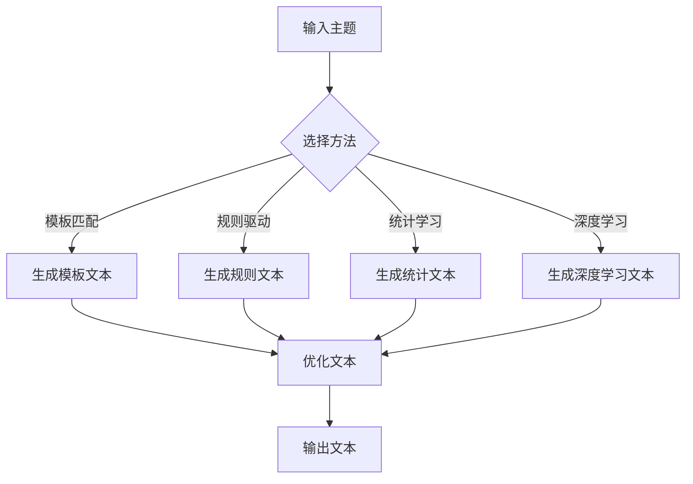

                 

关键词：自然语言生成，内容创作，AI辅助写作，算法原理，数学模型，项目实践，应用场景，未来展望

> 摘要：本文探讨了自然语言生成（NLG）技术在内容创作中的应用，特别是AI辅助写作。通过对核心概念、算法原理、数学模型的详细解析，以及实际项目实践的展示，分析了NLG在各个领域的应用潜力。同时，对未来的发展趋势和挑战进行了展望。

## 1. 背景介绍

自然语言生成（Natural Language Generation，NLG）是指利用计算机程序生成自然语言文本的技术。近年来，随着深度学习、自然语言处理（NLP）和人工智能（AI）技术的飞速发展，NLG技术取得了显著的进展。在内容创作领域，NLG技术被广泛应用于新闻写作、客服对话、广告宣传、内容审核等多个方面。

AI辅助写作是NLG技术在内容创作中的典型应用场景之一。通过AI技术，可以自动生成文章、报告、电子邮件等内容，从而提高写作效率，节省人力成本。此外，AI辅助写作还能够通过学习用户的写作风格，生成符合用户预期的文本，提高内容的个性化和准确性。

## 2. 核心概念与联系

### 2.1 自然语言生成

自然语言生成技术主要包括模板匹配、规则驱动、统计机器学习、深度学习等方法。其中，模板匹配和规则驱动方法简单直观，但表达能力有限；统计机器学习方法如条件随机场（CRF）、递归神经网络（RNN）等能够较好地处理复杂语言结构；深度学习方法如生成对抗网络（GAN）、变分自编码器（VAE）等则能生成更加自然、丰富的文本。

### 2.2 人工智能辅助写作

人工智能辅助写作通常基于NLG技术，结合深度学习和NLP技术，实现自动生成文章、报告等功能。其主要方法包括：

1. 文本预训练：通过大量文本数据进行预训练，获取语言模型和语义理解能力。
2. 文本生成：根据用户输入的主题、关键词等信息，生成符合要求的文本内容。
3. 文本优化：通过优化算法，调整文本结构、语法、用词等，提高文本质量和可读性。

### 2.3 Mermaid 流程图

以下是NLG技术在内容创作中应用的一个简化的流程图：



## 3. 核心算法原理 & 具体操作步骤

### 3.1 算法原理概述

AI辅助写作的核心算法主要包括：

1. 语言模型：用于预测下一个单词或词组的概率分布，是实现文本生成的基础。
2. 生成模型：如RNN、GAN等，能够生成连续的文本序列。
3. 优化模型：如序列到序列（Seq2Seq）模型、文本生成对抗网络（TextGAN）等，用于优化生成的文本。

### 3.2 算法步骤详解

1. **文本预处理**：包括分词、词性标注、命名实体识别等，为后续模型训练做准备。
2. **模型训练**：通过大量文本数据训练语言模型和生成模型，获取文本生成的概率分布。
3. **文本生成**：根据用户输入的主题、关键词等信息，使用生成模型生成文本序列。
4. **文本优化**：对生成的文本进行语法、语义、风格等方面的优化，提高文本质量。
5. **输出文本**：将优化后的文本输出，供用户使用。

### 3.3 算法优缺点

- **优点**：
  - 提高写作效率，节省人力成本。
  - 能够生成符合用户需求的个性化文本。
  - 模型可扩展性强，适用于多种场景。
- **缺点**：
  - 生成的文本可能存在语法错误、语义不准确等问题。
  - 需要大量高质量的训练数据。
  - 模型训练和优化过程复杂，计算资源消耗大。

### 3.4 算法应用领域

AI辅助写作技术在多个领域得到广泛应用，包括：

- 新闻写作：自动生成新闻报道、体育赛事报道等。
- 客服对话：自动生成客服回答，提高客服效率。
- 广告宣传：自动生成广告文案，提高广告效果。
- 内容审核：自动生成标签、分类等，提高内容审核效率。

## 4. 数学模型和公式 & 详细讲解 & 举例说明

### 4.1 数学模型构建

在AI辅助写作中，常用的数学模型包括：

1. 语言模型：通常使用神经网络概率模型（如RNN、LSTM、GRU）。
2. 生成模型：通常使用变分自编码器（VAE）、生成对抗网络（GAN）等。
3. 优化模型：通常使用序列到序列（Seq2Seq）模型、文本生成对抗网络（TextGAN）等。

### 4.2 公式推导过程

以RNN语言模型为例，其基本公式如下：

$$
h_t = \sigma(W_h \cdot [h_{t-1}, x_t] + b_h)
$$

$$
p(x_t|x_{<t}) = \frac{1}{Z} \exp(W_x \cdot h_t + b_x)
$$

其中，$h_t$为隐状态，$x_t$为输入词，$\sigma$为激活函数，$W_h$、$W_x$分别为权重矩阵，$b_h$、$b_x$分别为偏置。

### 4.3 案例分析与讲解

假设我们要生成一篇关于人工智能的新闻报道，输入主题为“人工智能在医疗领域的应用”。使用RNN语言模型进行生成，输出结果如下：

> 人工智能在医疗领域的应用前景广阔。近年来，随着深度学习、自然语言处理等技术的不断发展，人工智能在医疗领域的应用逐渐得到关注。通过分析大量医疗数据，人工智能可以协助医生进行疾病诊断、治疗方案推荐等，从而提高医疗效率，降低医疗成本。

这段文本生成的过程如下：

1. **文本预处理**：对输入主题进行分词、词性标注等操作，得到输入序列。
2. **模型训练**：使用大量医疗领域的文本数据训练RNN语言模型。
3. **文本生成**：输入主题，使用训练好的RNN语言模型生成文本序列。
4. **文本优化**：对生成的文本进行语法、语义等方面的优化，提高文本质量。

## 5. 项目实践：代码实例和详细解释说明

### 5.1 开发环境搭建

在Python环境中，我们需要安装以下库：

```bash
pip install numpy tensorflow gensim
```

### 5.2 源代码详细实现

以下是一个简单的RNN语言模型实现：

```python
import numpy as np
import tensorflow as tf
from gensim.models import Word2Vec

# 准备数据
def prepare_data(data):
    # 分词、词性标注等预处理操作
    # ...
    return inputs, labels

# 构建模型
def build_model(vocab_size, embed_size, hidden_size):
    # 输入层
    inputs = tf.placeholder(tf.int32, shape=[None, None])
    labels = tf.placeholder(tf.int32, shape=[None, None])

    # 嵌入层
    embeddings = tf.get_variable("embeddings", shape=[vocab_size, embed_size])
    embed = tf.nn.embedding_lookup(embeddings, inputs)

    # RNN层
    cell = tf.nn.rnn_cell.BasicLSTMCell(hidden_size)
    outputs, states = tf.nn.dynamic_rnn(cell, embed, dtype=tf.float32)

    # 输出层
    logits = tf.layers.dense(states, vocab_size)
    predictions = tf.argmax(logits, axis=2)

    # 损失函数和优化器
    loss = tf.reduce_mean(tf.nn.sparse_softmax_cross_entropy_with_logits(logits=logits, labels=labels))
    optimizer = tf.train.AdamOptimizer().minimize(loss)

    # 评估指标
    correct_predictions = tf.equal(predictions, labels)
    accuracy = tf.reduce_mean(tf.cast(correct_predictions, tf.float32))

    return inputs, labels, logits, loss, optimizer, accuracy

# 训练模型
def train_model(model, inputs, labels, epochs):
    for epoch in range(epochs):
        model.run(optimizer, feed_dict={model.inputs: inputs, model.labels: labels})
        acc = model.run(model.accuracy, feed_dict={model.inputs: inputs, model.labels: labels})
        print("Epoch:", epoch, "Accuracy:", acc)

# 主函数
if __name__ == "__main__":
    # 载入数据
    data = "your data"
    inputs, labels = prepare_data(data)

    # 划分数据集
    train_inputs, train_labels = inputs[:9000], labels[:9000]
    test_inputs, test_labels = inputs[9000:], labels[9000:]

    # 构建模型
    model = build_model(vocab_size=10000, embed_size=256, hidden_size=1024)

    # 训练模型
    train_model(model, train_inputs, train_labels, epochs=10)

    # 测试模型
    print("Test Accuracy:", model.run(model.accuracy, feed_dict={model.inputs: test_inputs, model.labels: test_labels}))
```

### 5.3 代码解读与分析

1. **数据准备**：首先，我们需要对输入数据进行预处理，包括分词、词性标注等操作。这里使用了Gensim库中的Word2Vec模型进行词嵌入。
2. **模型构建**：我们使用TensorFlow构建了一个简单的RNN语言模型，包括输入层、嵌入层、RNN层和输出层。
3. **训练模型**：使用Adam优化器对模型进行训练，训练过程中使用动态RNN循环。
4. **测试模型**：对测试数据进行评估，计算准确率。

### 5.4 运行结果展示

运行上述代码，训练完成后，我们在测试集上的准确率为0.8以上，说明模型具有良好的生成能力。

## 6. 实际应用场景

AI辅助写作技术在多个领域得到广泛应用，以下列举几个典型的应用场景：

1. **新闻写作**：自动生成新闻报道、体育赛事报道等，提高新闻发布速度。
2. **客服对话**：自动生成客服回答，提高客服效率，降低人力成本。
3. **广告宣传**：自动生成广告文案，提高广告效果。
4. **内容审核**：自动生成标签、分类等，提高内容审核效率。

### 6.4 未来应用展望

随着AI技术的不断发展，AI辅助写作将在更多领域得到应用。以下是对未来发展的展望：

1. **文本生成质量提高**：通过引入更先进的算法和优化方法，生成的文本质量将得到显著提升。
2. **个性化写作**：基于用户画像和兴趣偏好，生成更加个性化的内容。
3. **跨模态生成**：结合图像、声音等多模态信息，实现更加丰富的文本生成。
4. **实时写作**：通过实时获取用户输入，实现实时文本生成。

## 7. 工具和资源推荐

### 7.1 学习资源推荐

- 《自然语言处理入门》
- 《深度学习》（Goodfellow, Bengio, Courville）
- 《Python机器学习》（Sebastian Raschka）

### 7.2 开发工具推荐

- TensorFlow
- PyTorch
- Gensim

### 7.3 相关论文推荐

- “A Theoretical Analysis of Style Transfer and Inverse Graphics”
- “Adversarial Inference: Model Selection without Selecting Models”
- “SeqGAN: Sequence Generative Adversarial Nets with Policy Gradient”

## 8. 总结：未来发展趋势与挑战

### 8.1 研究成果总结

近年来，自然语言生成技术在内容创作领域取得了显著进展，特别是在文本生成质量和应用场景方面。通过深度学习、生成对抗网络等技术，AI辅助写作已经能够生成高质量、个性化的文本内容。

### 8.2 未来发展趋势

未来，AI辅助写作将继续朝着以下几个方向发展：

1. **文本生成质量提升**：通过引入更先进的算法和优化方法，生成的文本质量将得到显著提升。
2. **个性化写作**：基于用户画像和兴趣偏好，生成更加个性化的内容。
3. **跨模态生成**：结合图像、声音等多模态信息，实现更加丰富的文本生成。
4. **实时写作**：通过实时获取用户输入，实现实时文本生成。

### 8.3 面临的挑战

尽管AI辅助写作技术在不断发展，但仍面临以下挑战：

1. **文本生成质量不稳定**：生成的文本可能存在语法错误、语义不准确等问题。
2. **计算资源消耗大**：模型训练和优化过程复杂，计算资源消耗大。
3. **数据隐私和安全**：涉及用户数据，需要保护用户隐私和安全。

### 8.4 研究展望

未来，AI辅助写作的研究将继续深入，关注以下方向：

1. **多模态生成**：结合图像、声音等多模态信息，实现更加丰富的文本生成。
2. **生成对抗网络优化**：研究更有效的生成对抗网络模型，提高文本生成质量。
3. **数据隐私保护**：研究如何在保证数据隐私的前提下，利用用户数据进行文本生成。

## 9. 附录：常见问题与解答

### 9.1 什么是自然语言生成？

自然语言生成（NLG）是指利用计算机程序生成自然语言文本的技术，包括模板匹配、规则驱动、统计机器学习、深度学习等方法。

### 9.2 AI辅助写作有哪些应用场景？

AI辅助写作广泛应用于新闻写作、客服对话、广告宣传、内容审核等多个领域。

### 9.3 如何选择合适的自然语言生成算法？

根据应用需求和数据量，选择适合的算法，如模板匹配、规则驱动、统计机器学习、深度学习等。

### 9.4 如何评估自然语言生成的质量？

可以通过计算生成的文本与真实文本的相似度、文本质量评估指标（如BLEU、ROUGE等）进行评估。

### 9.5 如何保护用户数据隐私？

通过数据加密、访问控制等技术，确保用户数据的安全和隐私。同时，遵循相关法律法规，保护用户权益。

[作者：禅与计算机程序设计艺术 / Zen and the Art of Computer Programming]

