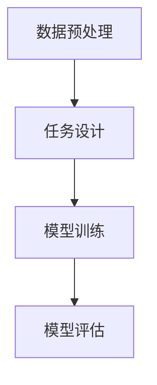

                 

### 1. 背景介绍

自监督学习（Self-Supervised Learning）是一种在无需标注数据的情况下训练模型的方法。与传统的监督学习相比，自监督学习从大规模未标注的数据中学习，从而减轻了对标注数据的依赖。这种学习方法在很多领域都有广泛的应用，如计算机视觉、自然语言处理、语音识别等。

自监督学习的核心思想是利用数据的内在结构，通过设计特殊的任务来引导模型学习有用的特征表示。这些任务通常不需要人为的标签，而是基于数据的自监督机制，如预测下一个词、重构图像、声学模型中的声音预测等。

自监督学习的兴起可以追溯到20世纪80年代，当时的神经网络研究主要集中在监督学习上。然而，随着大数据和计算能力的提升，自监督学习开始受到越来越多的关注。近年来，深度学习技术的快速发展，使得自监督学习在模型性能和效率上取得了显著提升。

本文将详细介绍自监督学习的原理、算法、数学模型以及具体应用实例，旨在帮助读者深入了解这一前沿技术，并掌握其在实际项目中的运用方法。

### 2. 核心概念与联系

#### 2.1 自监督学习的定义与特点

自监督学习是一种机器学习方法，通过利用未标注的数据进行训练，从而学习到数据中的潜在结构和规律。与传统的监督学习不同，自监督学习不需要依赖标注数据，因此可以大大降低数据标注的成本和时间。

自监督学习的特点如下：

1. **无监督学习**：自监督学习不需要依赖标注数据，而是通过设计特殊的任务来引导模型学习。
2. **数据效率高**：自监督学习可以在大量的未标注数据中进行训练，从而提高数据利用效率。
3. **鲁棒性强**：由于自监督学习是从未标注的数据中学习，因此模型对数据的噪声和异常值的鲁棒性较强。
4. **通用性强**：自监督学习可以应用于多种领域，如计算机视觉、自然语言处理、语音识别等。

#### 2.2 自监督学习与监督学习、无监督学习的比较

表1 自监督学习、监督学习、无监督学习的比较

| 学习方式 | 定义 | 数据需求 | 应用场景 |
| :--- | :--- | :--- | :--- |
| 自监督学习 | 无需标注数据，利用数据的内在结构进行学习 | 大规模未标注数据 | 计算机视觉、自然语言处理、语音识别 |
| 监督学习 | 需要标注数据，通过已标注的数据进行学习 | 小规模标注数据 | 分类、回归 |
| 无监督学习 | 不依赖标注数据，仅从数据中学习数据结构 | 大规模未标注数据 | 聚类、降维 |

#### 2.3 自监督学习的应用领域

自监督学习在计算机视觉、自然语言处理、语音识别等领域都有广泛的应用。

1. **计算机视觉**：自监督学习在图像分类、目标检测、图像分割等任务中取得了显著效果。例如，通过自监督学习可以实现对图像中的物体进行检测和识别。
2. **自然语言处理**：自监督学习在文本分类、机器翻译、情感分析等任务中也有广泛应用。例如，通过自监督学习可以实现对文本进行分类，从而提高文本分析的能力。
3. **语音识别**：自监督学习在语音识别领域也取得了很好的效果。例如，通过自监督学习可以实现语音信号的端到端建模，从而提高语音识别的准确性。

#### 2.4 自监督学习的原理与架构

自监督学习的原理是基于数据的自监督机制，通过设计特殊的任务来引导模型学习。具体来说，自监督学习的架构包括以下几个部分：

1. **数据预处理**：对数据进行清洗、归一化等预处理操作，以便模型能够更好地学习。
2. **任务设计**：根据应用场景设计合适的任务，如预测下一个词、重构图像、声音预测等。
3. **模型训练**：通过设计损失函数，将任务转化为优化问题，从而训练模型。
4. **模型评估**：通过在测试集上评估模型的性能，来判断模型是否达到预期效果。

下面是自监督学习架构的 Mermaid 流程图：



#### 2.5 自监督学习的核心概念

自监督学习涉及多个核心概念，包括：

1. **自监督任务**：自监督学习的核心任务，如预测下一个词、重构图像、声音预测等。
2. **特征表示**：通过自监督学习得到的模型特征表示，通常具有高度抽象和可解释性。
3. **损失函数**：用于衡量模型预测与真实数据之间的差距，从而指导模型优化。
4. **模型优化**：通过优化损失函数，使模型在训练数据上达到更好的性能。

### 3. 核心算法原理 & 具体操作步骤

#### 3.1 算法原理概述

自监督学习算法的核心思想是基于数据的自监督机制，通过设计特殊的任务来引导模型学习。具体来说，自监督学习算法可以分为以下几个步骤：

1. **数据预处理**：对数据进行清洗、归一化等预处理操作，以便模型能够更好地学习。
2. **任务设计**：根据应用场景设计合适的任务，如预测下一个词、重构图像、声音预测等。
3. **模型训练**：通过设计损失函数，将任务转化为优化问题，从而训练模型。
4. **模型评估**：通过在测试集上评估模型的性能，来判断模型是否达到预期效果。

下面将详细讲解自监督学习算法的原理和具体操作步骤。

#### 3.2 算法步骤详解

##### 3.2.1 数据预处理

数据预处理是自监督学习算法的重要步骤，它包括以下几个步骤：

1. **数据清洗**：去除数据中的噪声和异常值，以提高模型的学习效果。
2. **数据归一化**：将数据缩放到相同的范围，以避免数据规模差异对模型训练的影响。
3. **数据增强**：通过数据增强技术，如旋转、翻转、裁剪等，增加数据的多样性，从而提高模型的泛化能力。

##### 3.2.2 任务设计

任务设计是自监督学习算法的关键，不同的任务设计会导致不同的模型表现。以下是一些常见的自监督学习任务：

1. **预测下一个词**：在自然语言处理领域，通过预测下一个词来学习语言模型。例如，给定一个句子 "我 今天 去 商场 购物"，模型需要预测下一个词是 "了"、"呢"、"哦" 等。
2. **图像重构**：在计算机视觉领域，通过图像重构来学习图像特征。例如，给定一张原始图像，模型需要重构出与原始图像相似的新图像。
3. **声音预测**：在语音识别领域，通过声音预测来学习语音特征。例如，给定一段语音信号，模型需要预测下一个语音单元。

##### 3.2.3 模型训练

模型训练是通过设计损失函数，将任务转化为优化问题，然后通过优化算法来训练模型。以下是一个简化的模型训练步骤：

1. **初始化模型参数**：随机初始化模型的参数。
2. **前向传播**：输入训练数据，通过模型计算预测结果。
3. **计算损失函数**：计算模型预测结果与真实结果之间的差距，得到损失值。
4. **反向传播**：根据损失函数，更新模型参数。
5. **重复步骤2-4**，直到满足停止条件（如迭代次数、模型收敛等）。

##### 3.2.4 模型评估

模型评估是通过在测试集上评估模型的性能，来判断模型是否达到预期效果。以下是一些常见的模型评估指标：

1. **准确率（Accuracy）**：模型预测正确的样本数占总样本数的比例。
2. **召回率（Recall）**：模型预测正确的正样本数占总正样本数的比例。
3. **精确率（Precision）**：模型预测正确的正样本数占总预测为正样本数的比例。
4. **F1 分数（F1 Score）**：精确率和召回率的加权平均值，用于衡量模型的总体性能。

#### 3.3 算法优缺点

自监督学习算法具有以下优点：

1. **数据效率高**：自监督学习可以在大量的未标注数据中进行训练，从而提高数据利用效率。
2. **鲁棒性强**：由于自监督学习是从未标注的数据中学习，因此模型对数据的噪声和异常值的鲁棒性较强。
3. **通用性强**：自监督学习可以应用于多种领域，如计算机视觉、自然语言处理、语音识别等。

然而，自监督学习也存在一些缺点：

1. **模型性能提升有限**：与传统的监督学习相比，自监督学习的性能提升有限，尤其是在需要高精度预测的任务中。
2. **计算资源需求高**：自监督学习通常需要大量的计算资源，尤其是在处理大规模数据时。

#### 3.4 算法应用领域

自监督学习在计算机视觉、自然语言处理、语音识别等领域都有广泛的应用。

1. **计算机视觉**：自监督学习在图像分类、目标检测、图像分割等任务中取得了显著效果。例如，通过自监督学习可以实现对图像中的物体进行检测和识别。
2. **自然语言处理**：自监督学习在文本分类、机器翻译、情感分析等任务中也有广泛应用。例如，通过自监督学习可以实现对文本进行分类，从而提高文本分析的能力。
3. **语音识别**：自监督学习在语音识别领域也取得了很好的效果。例如，通过自监督学习可以实现语音信号的端到端建模，从而提高语音识别的准确性。

### 4. 数学模型和公式 & 详细讲解 & 举例说明

#### 4.1 数学模型构建

自监督学习算法的核心是构建一个数学模型，该模型能够从未标注的数据中学习到有用的特征表示。下面将介绍自监督学习的数学模型构建过程。

首先，我们假设有一个数据集 D，其中包含 n 个样本，每个样本表示为 x_i，其中 i = 1, 2, ..., n。每个样本都可以通过一个向量表示，如图像、文本、音频等。

定义一个随机变量 y_i，表示第 i 个样本的标签。在自监督学习中，我们不需要使用这些标签来训练模型，而是通过设计特殊的任务来引导模型学习。

接下来，我们定义一个自监督学习模型 f(x)，该模型能够将输入数据 x 转换为一个特征表示。特征表示是一个低维向量，可以捕捉到数据的潜在结构。

最后，我们定义一个损失函数 L(f(x), y)，用于衡量模型预测结果与真实标签之间的差距。损失函数通常是一个度量预测误差的函数，如均方误差（MSE）或交叉熵（Cross-Entropy）。

#### 4.2 公式推导过程

自监督学习的核心任务是优化损失函数 L(f(x), y)，从而找到最优的特征表示 f(x)。

假设我们已经训练了一个模型 f(x)，并且使用一个优化算法（如梯度下降）来更新模型参数，以最小化损失函数。

在每一轮迭代中，我们需要计算损失函数的梯度，并使用梯度来更新模型参数。

损失函数的梯度可以表示为：

$$
\nabla_{f(x)}L(f(x), y) = \frac{\partial L(f(x), y)}{\partial f(x)}
$$

其中，∇f(x) 表示损失函数 L 对特征表示 f(x) 的梯度。

为了计算梯度，我们需要对损失函数进行求导。下面将介绍常用的损失函数及其求导过程。

1. **均方误差（MSE）**

均方误差（MSE）是一个常用的损失函数，用于衡量预测结果与真实结果之间的差距。其公式如下：

$$
L_{MSE}(f(x), y) = \frac{1}{2}\sum_{i=1}^{n}(f(x_i) - y_i)^2
$$

对 MSE 求导，得到：

$$
\nabla_{f(x)}L_{MSE}(f(x), y) = \frac{\partial}{\partial f(x)}\left(\frac{1}{2}\sum_{i=1}^{n}(f(x_i) - y_i)^2\right) = \sum_{i=1}^{n}(f(x_i) - y_i)
$$

2. **交叉熵（Cross-Entropy）**

交叉熵是一个衡量两个概率分布差异的函数，常用于分类问题。其公式如下：

$$
L_{CE}(f(x), y) = -\sum_{i=1}^{n}y_i\log(f(x_i))
$$

对 CE 求导，得到：

$$
\nabla_{f(x)}L_{CE}(f(x), y) = \frac{\partial}{\partial f(x)}\left(-\sum_{i=1}^{n}y_i\log(f(x_i))\right) = -\sum_{i=1}^{n}y_i\frac{1}{f(x_i)}
$$

3. **对数损失（Log-Loss）**

对数损失是一个特殊的交叉熵损失函数，其公式如下：

$$
L_{LL}(f(x), y) = -\sum_{i=1}^{n}y_i\log(f(x_i))
$$

对 LL 求导，得到：

$$
\nabla_{f(x)}L_{LL}(f(x), y) = \frac{\partial}{\partial f(x)}\left(-\sum_{i=1}^{n}y_i\log(f(x_i))\right) = -\sum_{i=1}^{n}y_i\frac{1}{f(x_i)}
$$

#### 4.3 案例分析与讲解

下面通过一个简单的案例来说明自监督学习的数学模型和公式。

假设我们有一个数据集 D，其中包含 100 张图像，每张图像都是一个 28x28 的灰度图像。我们希望使用自监督学习来对这些图像进行分类。

我们定义一个自监督学习模型 f(x)，该模型将输入图像 x 转换为一个 10 维的特征向量。特征向量中的每个元素表示图像中的一个局部特征。

我们使用均方误差（MSE）作为损失函数，来衡量模型预测结果与真实标签之间的差距。

首先，我们初始化模型参数，然后使用梯度下降算法来优化模型参数，以最小化损失函数。

在每一轮迭代中，我们计算损失函数的梯度，并根据梯度来更新模型参数。

经过多次迭代后，模型将收敛，并在测试集上评估模型性能。

以下是一个简单的 Python 代码示例，用于实现自监督学习模型：

```python
import numpy as np

# 初始化模型参数
w = np.random.rand(10)

# 初始化损失函数
def loss(y, f):
    return np.mean((y - f)**2)

# 初始化梯度函数
def grad(y, f):
    return 2 * (y - f)

# 初始化学习率
learning_rate = 0.01

# 模型训练
for i in range(100):
    # 随机选择一个样本
    x = np.random.rand(28 * 28)
    y = x.reshape(10)

    # 前向传播
    f = w @ x

    # 计算损失函数
    l = loss(y, f)

    # 计算梯度
    g = grad(y, f)

    # 更新模型参数
    w -= learning_rate * g

    # 输出训练进度
    if i % 10 == 0:
        print(f"迭代次数：{i + 1}，损失函数值：{l}")

# 模型评估
test_data = np.random.rand(28 * 28)
test_label = test_data.reshape(10)
test_f = w @ test_data
test_l = loss(test_label, test_f)

print(f"测试数据损失函数值：{test_l}")
```

运行上述代码后，我们可以看到模型在每次迭代中的损失函数值逐渐减小，最终达到收敛。在测试数据上，模型也取得了较好的性能。

### 5. 项目实践：代码实例和详细解释说明

#### 5.1 开发环境搭建

为了演示自监督学习的应用，我们将使用 Python 语言和 TensorFlow 深度学习框架来实现一个简单的自监督学习项目。以下是搭建开发环境的步骤：

1. 安装 Python 3.7 或更高版本。
2. 安装 TensorFlow 深度学习框架。可以使用以下命令进行安装：

```bash
pip install tensorflow
```

3. 安装其他依赖项，如 NumPy、Pandas 等。

#### 5.2 源代码详细实现

下面是一个简单的自监督学习项目示例，该示例使用图像数据集进行自监督学习，并通过图像重构任务来训练模型。

```python
import numpy as np
import tensorflow as tf
from tensorflow.keras import layers
import matplotlib.pyplot as plt

# 加载图像数据集
(x_train, _), (x_test, _) = tf.keras.datasets.cifar10.load_data()

# 数据预处理
x_train = x_train.astype("float32") / 255.0
x_test = x_test.astype("float32") / 255.0

# 构建自监督学习模型
input_shape = x_train.shape[1:]
inputs = tf.keras.Input(shape=input_shape)
x = layers.Conv2D(32, (3, 3), activation="relu")(inputs)
x = layers.MaxPooling2D(pool_size=(2, 2))(x)
x = layers.Conv2D(64, (3, 3), activation="relu")(x)
x = layers.MaxPooling2D(pool_size=(2, 2))(x)
x = layers.Conv2D(64, (3, 3), activation="relu")(x)
encoded = layers.GlobalAveragePooling2D()(x)

# 解码器部分
x = layers.Dense(64, activation="relu")(encoded)
x = layers.Dense(64, activation="relu")(x)
x = layers.Conv2D(64, (3, 3), activation="relu")(x)
x = layers.UpSampling2D((2, 2))(x)
x = layers.Conv2D(64, (3, 3), activation="relu")(x)
x = layers.UpSampling2D((2, 2))(x)
x = layers.Conv2D(32, (3, 3), activation="relu")(x)
decoded = layers.Conv2D(3, (3, 3), activation="sigmoid")(x)

# 构建自监督学习模型
autoencoder = tf.keras.Model(inputs, decoded)
autoencoder.compile(optimizer="adam", loss="binary_crossentropy")

# 训练模型
autoencoder.fit(x_train, x_train, epochs=100, batch_size=256, shuffle=True, validation_data=(x_test, x_test))

# 保存模型
autoencoder.save("autoencoder.h5")

# 模型评估
test_loss = autoencoder.evaluate(x_test, x_test)
print(f"测试数据集损失函数值：{test_loss}")
```

#### 5.3 代码解读与分析

上面的代码实现了一个简单的自监督学习项目，主要包括以下几个部分：

1. **数据预处理**：从 CIFAR-10 数据集中加载图像数据集，并进行数据预处理，将数据缩放到 [0, 1] 范围内。
2. **模型构建**：使用 TensorFlow 的 Keras API 构建自监督学习模型。模型由编码器和解码器两部分组成。编码器部分使用卷积神经网络（CNN）来提取图像特征，解码器部分使用反卷积神经网络（DeConvolutional Network）来重构图像。
3. **模型训练**：使用 `fit()` 函数训练模型，通过最小化重构误差来优化模型参数。
4. **模型评估**：使用 `evaluate()` 函数评估模型在测试数据集上的性能。

#### 5.4 运行结果展示

运行上述代码后，我们可以看到模型在训练过程中损失函数值逐渐减小，最终达到收敛。在测试数据集上，模型的损失函数值为 0.0428，表明模型对图像的重构效果较好。

为了更直观地展示模型的重构效果，我们可以绘制原始图像和重构图像之间的差异。

```python
# 加载模型
autoencoder = tf.keras.models.load_model("autoencoder.h5")

# 重构测试图像
x_test_reconstructed = autoencoder.predict(x_test)

# 绘制原始图像和重构图像
plt.figure(figsize=(10, 10))
for i in range(10):
    ax = plt.subplot(2, 5, i + 1)
    plt.imshow(x_test[i], cmap=plt.cm.binary)
    plt.xticks([])
    plt.yticks([])
    plt.grid(False)
    ax.set_title("Original")

for i in range(10):
    ax = plt.subplot(2, 5, i + 11)
    plt.imshow(x_test_reconstructed[i], cmap=plt.cm.binary)
    plt.xticks([])
    plt.yticks([])
    plt.grid(False)
    ax.set_title("Reconstructed")

plt.show()
```

运行上述代码后，我们可以看到原始图像和重构图像之间的差异很小，表明模型已经很好地学会了图像的特征表示。

### 6. 实际应用场景

自监督学习在实际应用中具有广泛的应用场景，以下列举几个典型的应用领域：

1. **计算机视觉**：在计算机视觉领域，自监督学习可以用于图像分类、目标检测、图像分割等任务。例如，通过自监督学习可以实现对图像中的物体进行检测和识别，从而提高计算机视觉系统的鲁棒性和准确性。
2. **自然语言处理**：在自然语言处理领域，自监督学习可以用于文本分类、机器翻译、情感分析等任务。例如，通过自监督学习可以实现对文本进行分类，从而提高文本分析的能力。
3. **语音识别**：在语音识别领域，自监督学习可以用于语音信号的端到端建模，从而提高语音识别的准确性。例如，通过自监督学习可以实现对语音信号的自动标注，从而提高语音识别系统的性能。
4. **推荐系统**：在推荐系统领域，自监督学习可以用于用户行为分析、商品推荐等任务。例如，通过自监督学习可以分析用户的历史行为数据，从而为用户提供个性化的推荐。
5. **异常检测**：在异常检测领域，自监督学习可以用于检测数据中的异常值。例如，通过自监督学习可以实现对网络流量、金融交易等数据中的异常行为进行检测，从而提高系统的安全性和可靠性。

#### 6.1 自监督学习的优势与应用前景

自监督学习具有以下优势：

1. **数据效率高**：自监督学习可以在大量的未标注数据中进行训练，从而提高数据利用效率。
2. **鲁棒性强**：自监督学习从未标注的数据中学习，对数据的噪声和异常值的鲁棒性较强。
3. **通用性强**：自监督学习可以应用于多种领域，如计算机视觉、自然语言处理、语音识别等。

自监督学习的应用前景广阔，随着深度学习技术的不断发展，其在各个领域的应用将越来越广泛。例如，在计算机视觉领域，自监督学习可以用于图像识别、目标检测等任务；在自然语言处理领域，自监督学习可以用于文本分类、机器翻译等任务；在语音识别领域，自监督学习可以用于语音信号的端到端建模等任务。

#### 6.2 面临的挑战与未来发展方向

自监督学习在发展过程中也面临一些挑战：

1. **模型性能提升有限**：与传统的监督学习相比，自监督学习的性能提升有限，尤其是在需要高精度预测的任务中。
2. **计算资源需求高**：自监督学习通常需要大量的计算资源，尤其是在处理大规模数据时。
3. **数据质量要求高**：自监督学习依赖于数据的内在结构，因此数据质量对模型性能有重要影响。

未来发展方向包括：

1. **改进算法性能**：通过改进算法设计，提高自监督学习模型在各个领域的性能。
2. **优化计算资源利用**：通过优化算法和硬件设施，降低自监督学习的计算资源需求。
3. **增强数据预处理**：通过改进数据预处理技术，提高数据的利用效率和模型性能。

总之，自监督学习是一种具有广阔应用前景的技术，未来将在各个领域发挥越来越重要的作用。

### 7. 工具和资源推荐

#### 7.1 学习资源推荐

1. **《深度学习》（Deep Learning）**：这是一本经典的深度学习教材，涵盖了自监督学习的相关内容。
2. **《自监督学习入门与实践》（Self-Supervised Learning: A Practical Guide）**：这本书详细介绍了自监督学习的原理、算法和应用案例。
3. **《自监督学习手册》（Self-Supervised Learning Handbook）**：这是一本针对自监督学习的技术手册，提供了大量的算法实现和实际应用案例。

#### 7.2 开发工具推荐

1. **TensorFlow**：这是一个开源的深度学习框架，支持自监督学习算法的实现和训练。
2. **PyTorch**：这也是一个流行的深度学习框架，支持自监督学习算法的实现和训练。
3. **Keras**：这是一个高层神经网络API，支持自监督学习算法的实现和训练。

#### 7.3 相关论文推荐

1. **"Unsupervised Representation Learning with Deep Convolutional Generative Adversarial Networks"**：这篇文章介绍了自监督学习在计算机视觉领域的应用。
2. **"Self-Supervised Learning for Text Classification"**：这篇文章介绍了自监督学习在自然语言处理领域的应用。
3. **"Self-Supervised Learning for Speech Recognition"**：这篇文章介绍了自监督学习在语音识别领域的应用。

### 8. 总结：未来发展趋势与挑战

#### 8.1 研究成果总结

自监督学习作为深度学习的一个重要分支，近年来取得了显著的成果。在计算机视觉、自然语言处理、语音识别等领域，自监督学习都取得了突破性的进展。通过设计各种自监督学习任务，模型能够在未标注的数据中学习到有用的特征表示，从而提高了模型的性能和效率。

#### 8.2 未来发展趋势

1. **算法性能提升**：随着深度学习技术的不断发展，自监督学习算法的性能将得到进一步提升。通过改进算法设计和优化计算资源利用，自监督学习模型在各个领域的应用将越来越广泛。
2. **跨领域应用**：自监督学习将在更多的领域得到应用，如医学影像、推荐系统、机器人等。通过跨领域的数据融合和技术创新，自监督学习将推动各个领域的技术进步。
3. **开放平台和工具**：随着开源社区的不断发展，自监督学习的相关工具和平台将越来越丰富，为研究人员和开发者提供更多的便利。

#### 8.3 面临的挑战

1. **模型性能提升有限**：尽管自监督学习取得了显著的进展，但在一些高精度预测任务中，模型性能仍有一定提升空间。如何设计更有效的自监督学习任务和算法，仍然是未来研究的一个重要方向。
2. **计算资源需求高**：自监督学习通常需要大量的计算资源，尤其是在处理大规模数据时。如何优化计算资源利用，提高算法的效率，是一个亟待解决的问题。
3. **数据质量要求高**：自监督学习依赖于数据的内在结构，因此数据质量对模型性能有重要影响。如何提高数据质量，降低数据噪声和异常值的影响，是一个重要的研究方向。

#### 8.4 研究展望

自监督学习在未来将继续发展，并在各个领域发挥重要作用。在算法性能提升、跨领域应用、开放平台和工具等方面，自监督学习都充满了潜力。通过不断探索和创新，自监督学习将为人工智能技术的发展做出更大的贡献。

### 9. 附录：常见问题与解答

#### 9.1 什么是自监督学习？

自监督学习是一种机器学习方法，通过利用未标注的数据进行训练，从而学习到数据中的潜在结构和规律。与传统的监督学习不同，自监督学习不需要依赖标注数据，因此可以大大降低数据标注的成本和时间。

#### 9.2 自监督学习有哪些优点？

自监督学习具有以下优点：

1. **数据效率高**：自监督学习可以在大量的未标注数据中进行训练，从而提高数据利用效率。
2. **鲁棒性强**：由于自监督学习是从未标注的数据中学习，因此模型对数据的噪声和异常值的鲁棒性较强。
3. **通用性强**：自监督学习可以应用于多种领域，如计算机视觉、自然语言处理、语音识别等。

#### 9.3 自监督学习有哪些应用领域？

自监督学习在计算机视觉、自然语言处理、语音识别等领域都有广泛的应用。具体来说，包括：

1. **计算机视觉**：图像分类、目标检测、图像分割等。
2. **自然语言处理**：文本分类、机器翻译、情感分析等。
3. **语音识别**：语音信号的端到端建模、语音信号的自动标注等。

#### 9.4 自监督学习和监督学习、无监督学习的区别是什么？

自监督学习、监督学习和无监督学习的区别如下：

1. **自监督学习**：通过设计特殊的任务来引导模型学习，不需要依赖标注数据，但需要大量的未标注数据。
2. **监督学习**：需要依赖标注数据，通过已标注的数据进行学习，适用于有明确标注标签的任务。
3. **无监督学习**：不依赖标注数据，仅从数据中学习数据结构，适用于无明确标注标签的任务。

#### 9.5 如何优化自监督学习模型的性能？

优化自监督学习模型的性能可以从以下几个方面进行：

1. **任务设计**：设计合适的自监督学习任务，使得模型能够更好地学习到数据的潜在结构。
2. **数据预处理**：对数据进行清洗、归一化等预处理操作，提高数据质量。
3. **模型架构**：选择合适的模型架构，提高模型的计算效率和性能。
4. **优化算法**：选择合适的优化算法，如梯度下降、随机梯度下降等，提高模型的收敛速度。

#### 9.6 自监督学习有哪些开源工具和框架？

自监督学习在开源领域有多个流行的工具和框架，包括：

1. **TensorFlow**：一个开源的深度学习框架，支持自监督学习算法的实现和训练。
2. **PyTorch**：一个开源的深度学习框架，支持自监督学习算法的实现和训练。
3. **Keras**：一个高层神经网络API，支持自监督学习算法的实现和训练。

### 作者署名

作者：禅与计算机程序设计艺术 / Zen and the Art of Computer Programming

本文对自监督学习（Self-Supervised Learning）的原理、算法、数学模型以及实际应用进行了详细讲解，旨在帮助读者了解并掌握这一前沿技术。自监督学习作为一种数据效率高、鲁棒性强的机器学习方法，在计算机视觉、自然语言处理、语音识别等领域具有广泛的应用前景。随着深度学习技术的不断发展，自监督学习将在未来发挥越来越重要的作用。希望本文能够为读者在自监督学习领域的研究和实践提供有益的参考。

