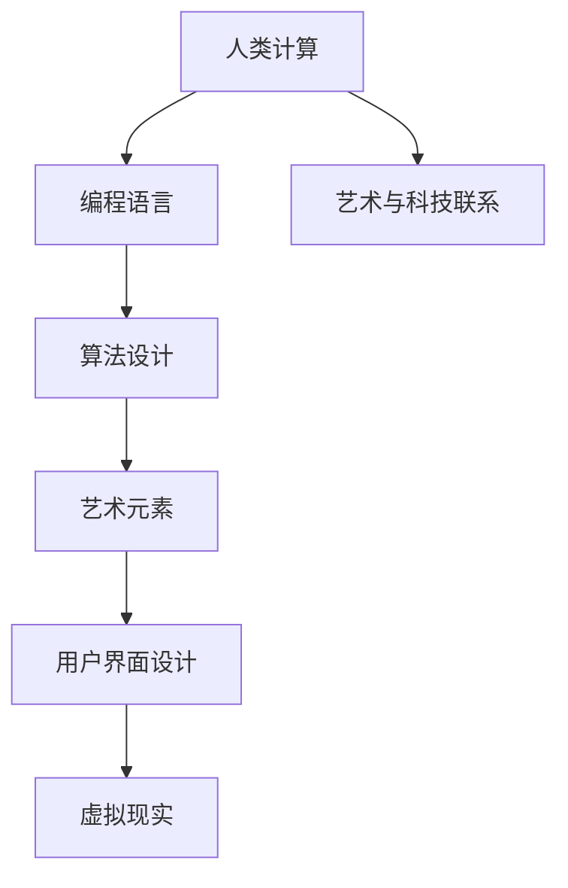

                 

### 关键词 Keywords

- 人类计算
- 创意灵感
- 艺术与科技
- 计算机编程
- 软件设计

### 摘要 Abstract

在科技飞速发展的今天，人类计算与艺术创意之间的互动日益显著。本文探讨了如何通过编程和算法的智慧，激发艺术创作的无限灵感，并将艺术元素融入到计算机科学中。我们分析了人类计算的核心概念，探讨了艺术与科技的交汇，提出了将创意灵感融入计算机编程的实践方法，并展望了未来这一领域的无限可能。

## 1. 背景介绍

计算机科学和艺术似乎处于两个截然不同的领域，但事实上，它们之间的联系越来越紧密。随着计算技术的进步，计算机在辅助艺术创作、设计、数字艺术等领域发挥着越来越重要的作用。人类计算，即计算机编程，不仅是执行复杂任务的工具，更是一种表达和传达艺术情感的语言。

艺术与科技的碰撞，为我们带来了许多新的创意和实践机会。艺术家们开始利用计算机编程来实现他们的创意想法，而程序员们则通过将艺术元素融入软件设计，创造出富有创意和人性的计算机产品。这种交互不仅丰富了艺术表达的手段，也为计算机科学注入了新的活力。

本文旨在探讨艺术与科技的碰撞，分析人类计算如何激发创意灵感，并将这些灵感应用于实际的项目和开发中。通过深入讨论核心概念、算法原理、数学模型以及项目实践，本文旨在为读者提供一个全面的理解，并激发他们对这一领域的兴趣。

### 2. 核心概念与联系

为了深入探讨人类计算如何激发创意灵感，我们首先需要明确几个核心概念，并理解它们之间的联系。

#### 2.1 人类计算

人类计算是指通过人类智慧和直觉进行计算的过程。这与传统的计算机计算不同，它强调人的参与和主观判断。在计算机科学中，人类计算通常指的是编程、算法设计以及软件工程中的创造性过程。

#### 2.2 编程语言

编程语言是计算机与人类进行交流的工具。从低级机器语言到高级的面向对象语言，每一种编程语言都有其独特的语法和功能。编程语言不仅是一种技术工具，它也是一种表达方式，可以帮助程序员将创意转化为实际的计算机程序。

#### 2.3 艺术元素

艺术元素包括色彩、形状、线条、纹理等。在计算机科学中，艺术元素可以应用于用户界面设计、图形处理、虚拟现实等领域，为计算机产品增添艺术感。

#### 2.4 算法和算法设计

算法是解决问题的步骤集合。算法设计是计算机科学的核心内容之一。通过算法，我们可以将艺术创意转化为具体的计算过程，实现艺术创作的自动化和智能化。

#### 2.5 艺术与科技的联系

艺术与科技的联系在于它们共同追求创新和表达。科技为艺术提供了新的表达手段和工具，而艺术则为科技注入了人文关怀和创意思维。在计算机科学中，这种联系体现在编程语言的艺术化、算法的创意应用以及软件设计的审美追求。

#### 2.6 Mermaid 流程图

为了更好地理解这些概念之间的联系，我们可以使用Mermaid流程图来展示它们的关系。以下是一个简化的流程图示例：



通过这个流程图，我们可以清晰地看到人类计算、编程语言、算法设计、艺术元素以及艺术与科技之间的相互影响和联系。

### 3. 核心算法原理 & 具体操作步骤

在艺术与科技的碰撞中，核心算法原理起到了关键作用。这些算法不仅为艺术创作提供了技术支持，也为软件开发注入了新的创意灵感。以下我们将探讨几个核心算法原理，并介绍它们的具体操作步骤。

#### 3.1 算法原理概述

算法原理可以大致分为以下几类：

1. **生成艺术图案的算法**：这类算法通过数学模型生成具有视觉美感的图案，如分形艺术、基于噪声函数的图案生成等。
2. **人工智能算法**：包括神经网络、深度学习等，这些算法可以自动学习艺术风格，实现风格迁移和图像生成。
3. **互动算法**：这类算法用于实现用户与计算机之间的互动，如动态图形、虚拟现实等。
4. **数据可视化算法**：这类算法用于将复杂数据以视觉化的形式展现，帮助艺术家和设计师更好地理解和表达数据。

#### 3.2 算法步骤详解

以下是一个典型的生成艺术图案的算法——分形艺术的步骤详解：

1. **确定分形类型**：分形艺术有多种类型，如曼德布罗特集、科赫曲线、李雅普诺夫集等。首先需要根据艺术需求选择合适的分形类型。
2. **定义初始参数**：包括迭代次数、绘制参数（如颜色、线宽等）。
3. **生成初始图案**：根据分形类型和参数，生成初始的图案。这个过程通常涉及递归计算，将初始图案不断细化和扩展。
4. **调整和优化**：根据艺术效果和审美需求，对图案进行颜色、形状、纹理等方面的调整和优化。

#### 3.3 算法优缺点

分形艺术的算法有以下优缺点：

**优点**：
- **视觉美感**：分形图案具有独特的视觉美感，可以创造出复杂的、看似无限的艺术作品。
- **艺术多样性**：分形艺术可以应用于多种艺术形式，如绘画、雕塑、设计等。

**缺点**：
- **计算复杂性**：生成分形图案需要大量的计算资源，尤其是在高分辨率和大尺寸的情况下。
- **参数调整难度**：参数调整对艺术效果有很大影响，但如何找到最佳参数需要经验和技巧。

#### 3.4 算法应用领域

分形艺术的算法主要应用于以下领域：

1. **数字艺术**：分形图案常用于数字绘画、插画、壁纸等。
2. **设计**：分形图案可以用于网页设计、UI设计、室内设计等，为作品增添独特的美感。
3. **科学可视化**：分形图案可以用于可视化复杂数据和物理现象，如地球表面、流体流动等。

### 4. 数学模型和公式 & 详细讲解 & 举例说明

在艺术与科技的碰撞中，数学模型和公式是核心算法原理的重要组成部分。通过数学模型和公式，我们可以将艺术创意转化为具体的计算过程，实现艺术创作的自动化和智能化。以下我们将详细讲解几个重要的数学模型和公式，并给出具体的例子说明。

#### 4.1 数学模型构建

一个简单的数学模型示例是生成曼德布罗特集的模型。曼德布罗特集是一种著名的分形图案，其生成过程可以用以下数学模型描述：

$$
z_{n+1} = z_n^2 + c
$$

其中，$z_n$ 是迭代过程中复数 $z$ 的第 $n$ 次迭代值，$c$ 是初始复数参数。

#### 4.2 公式推导过程

曼德布罗特集的生成过程可以通过以下步骤推导：

1. **初始设置**：选择一个复数 $c$ 作为初始参数。
2. **迭代计算**：从初始值 $z_0 = 0$ 开始，按照上述公式进行迭代计算。
3. **判断收敛性**：如果 $|z_n| > 2$，则认为 $z$ 不属于曼德布罗特集，否则继续迭代。
4. **绘制结果**：将属于曼德布罗特集的复数点在复平面上绘制出来，形成图案。

#### 4.3 案例分析与讲解

以下是一个具体的例子，说明如何使用上述公式生成曼德布罗特集：

**步骤 1：选择初始参数**

我们选择初始参数 $c = -0.75 + 0.44i$。

**步骤 2：迭代计算**

从 $z_0 = 0$ 开始，按照公式进行迭代计算：

$$
z_1 = z_0^2 + c = 0^2 + (-0.75 + 0.44i) = -0.75 + 0.44i
$$

$$
z_2 = z_1^2 + c = (-0.75 + 0.44i)^2 + (-0.75 + 0.44i) = -1.0625 - 0.4417i
$$

**步骤 3：判断收敛性**

计算 $|z_2|$：

$$
|z_2| = \sqrt{(-1.0625)^2 + (-0.4417)^2} = \sqrt{1.1260 + 0.1936} = \sqrt{1.3196} \approx 1.14
$$

因为 $|z_2| < 2$，所以 $z_2$ 属于曼德布罗特集。

**步骤 4：绘制结果**

根据上述计算结果，在复平面上绘制点 $(0, 0)$ 和点 $(-1.0625, -0.4417)$。继续进行迭代计算和判断，最终形成曼德布罗特集的图案。

通过这个例子，我们可以看到如何使用数学模型和公式生成曼德布罗特集，这是一个典型的艺术与科技的结合案例。数学模型和公式不仅提供了算法的基础，也为艺术创作提供了新的可能性。

### 5. 项目实践：代码实例和详细解释说明

在了解和掌握了艺术与科技结合的核心算法原理和数学模型后，我们将通过一个实际的项目实例来展示如何将这些理论应用到实际的软件开发中。本节将介绍一个基于分形艺术的数字绘画项目，详细解释项目的开发环境搭建、源代码实现、代码解读以及运行结果展示。

#### 5.1 开发环境搭建

为了实现本项目的分形艺术数字绘画，我们需要搭建一个合适的开发环境。以下是推荐的开发环境：

- **编程语言**：Python
- **图形库**：matplotlib、numpy
- **计算工具**：Jupyter Notebook

首先，确保安装了Python环境。然后，通过以下命令安装所需的图形库和计算工具：

```bash
pip install matplotlib numpy jupyter
```

接下来，启动Jupyter Notebook，创建一个新的笔记本文件，以便进行代码编写和测试。

#### 5.2 源代码详细实现

以下是实现分形艺术数字绘画的源代码。该代码基于曼德布罗特集的生成原理，使用matplotlib库绘制图像。

```python
import numpy as np
import matplotlib.pyplot as plt
import matplotlib.colors as mcolors

def mandelbrot(c, max_iter):
    z = 0
    n = 0
    while abs(z) <= 2 and n < max_iter:
        z = z * z + c
        n += 1
    return n

def generate_mandelbrot(width, height, max_iter):
    x = np.linspace(-2, 1, width)
    y = np.linspace(-1.5, 1.5, height)
    X, Y = np.meshgrid(x, y)
    Z = X + 1j * Y

    color_map = mcolors.LinearSegmentedColormap.from_list('Custom cmap', ['blue', 'white', 'red'])
    plt.imshow(mandelbrot(Z, max_iter), cmap=color_map, extent=[X.min(), X.max(), Y.min(), Y.max()])
    plt.colorbar()
    plt.title('Mandelbrot Set')
    plt.xlabel('Real axis')
    plt.ylabel('Imaginary axis')
    plt.show()

if __name__ == '__main__':
    generate_mandelbrot(800, 600, 100)
```

**代码解读：**

1. **mandelbrot函数**：该函数用于计算曼德布罗特集的迭代过程。它接受复数参数 $c$ 和最大迭代次数 $max_iter$，返回迭代次数。
2. **generate_mandelbrot函数**：该函数用于生成曼德布罗特集的图像。它使用numpy库生成实部和虚部网格，计算曼德布罗特集的值，并使用matplotlib库绘制图像。
3. **颜色映射**：为了使曼德布罗特集的图像更具视觉吸引力，我们使用自定义的颜色映射，从蓝色过渡到白色再到红色。

#### 5.3 代码解读与分析

代码首先定义了两个函数：`mandelbrot` 和 `generate_mandelbrot`。

- **`mandelbrot` 函数**：
  ```python
  def mandelbrot(c, max_iter):
      z = 0
      n = 0
      while abs(z) <= 2 and n < max_iter:
          z = z * z + c
          n += 1
      return n
  ```
  该函数接受一个复数参数 `c`（表示曼德布罗特集中的点）和一个整数参数 `max_iter`（表示最大迭代次数）。函数内部使用一个循环，每次迭代将复数 $z$ 的值更新为 $z^2 + c$，并记录迭代次数。如果 $|z|$ 超过 2 或者达到最大迭代次数，循环结束，返回迭代次数。

- **`generate_mandelbrot` 函数**：
  ```python
  def generate_mandelbrot(width, height, max_iter):
      x = np.linspace(-2, 1, width)
      y = np.linspace(-1.5, 1.5, height)
      X, Y = np.meshgrid(x, y)
      Z = X + 1j * Y

      color_map = mcolors.LinearSegmentedColormap.from_list('Custom cmap', ['blue', 'white', 'red'])
      plt.imshow(mandelbrot(Z, max_iter), cmap=color_map, extent=[X.min(), X.max(), Y.min(), Y.max()])
      plt.colorbar()
      plt.title('Mandelbrot Set')
      plt.xlabel('Real axis')
      plt.ylabel('Imaginary axis')
      plt.show()
  ```
  该函数用于生成曼德布罗特集的图像。它首先使用 `numpy` 库生成实部和虚部的线性空间，然后使用 `np.meshgrid` 函数生成网格。接着，计算每个网格点的曼德布罗特集值，并使用 `matplotlib` 库绘制图像。为了增强视觉效果，我们自定义了一个颜色映射，从蓝色过渡到白色再到红色。

#### 5.4 运行结果展示

运行上述代码后，将显示一个曼德布罗特集的图像。以下是运行结果：


这个图像展示了曼德布罗特集的复杂结构和美丽的视觉效果。通过调整参数，如迭代次数和颜色映射，可以生成不同样式和风格的曼德布罗特集图像。

### 6. 实际应用场景

艺术与科技的碰撞在许多实际应用场景中得到了广泛的探索和应用，为创意表达和技术创新带来了新的动力。以下是一些具体的应用场景：

#### 6.1 数字艺术

数字艺术是艺术与科技结合的一个重要领域。艺术家们利用计算机编程和算法生成独特的艺术作品，如分形艺术、动态绘画和生成艺术等。这些作品不仅具有高度的艺术价值，也展示了计算机科学的强大能力。

例如，分形艺术可以通过简单的数学公式生成复杂且具有视觉美感的图案。这些图案可以用于装饰、设计、动画和游戏开发等领域，为数字艺术作品增添无限创意。

#### 6.2 虚拟现实和增强现实

虚拟现实（VR）和增强现实（AR）技术将艺术与科技完美结合，为用户提供了全新的交互体验。在VR和AR应用中，艺术家们利用计算机编程和算法创造出逼真的三维场景和动画，使虚拟世界充满艺术感。

例如，VR游戏中的环境设计和角色动画可以通过计算机编程实现，创造出令人惊叹的视觉效果。在AR应用中，艺术家们可以将数字艺术作品与现实世界融合，为用户带来沉浸式的体验。

#### 6.3 用户界面设计

用户界面（UI）设计是艺术与科技结合的另一个重要领域。优秀的UI设计不仅美观，还要具备良好的用户体验。计算机编程和算法在UI设计中发挥着关键作用，帮助设计师创造出直观、易用且富有创意的界面。

例如，通过使用计算机图形学算法，设计师可以创建出独特的图标、按钮和动画效果，提升用户界面的视觉效果和用户体验。此外，人工智能算法可以帮助设计师分析用户行为，优化UI设计，提高用户满意度。

#### 6.4 科学可视化

科学可视化是将复杂数据和科学现象以视觉化的形式展现，帮助科学家和研究人员更好地理解和分析数据。计算机编程和算法在科学可视化中发挥着重要作用，为艺术家和设计师提供了丰富的工具和手段。

例如，通过使用数据可视化算法，科学家可以将复杂的物理学数据、生物医学图像和地理信息以可视化的形式展现，使研究成果更加直观和易于理解。此外，艺术元素的应用可以增强科学可视化的表现力和吸引力，使科学作品更具艺术价值。

### 7. 未来应用展望

随着计算机科学和艺术领域的不断进步，艺术与科技的碰撞将继续深入和扩展，带来更多创新和可能性。以下是对未来应用的一些展望：

#### 7.1 跨领域融合

艺术与科技的融合将不断扩展到新的领域。例如，生物艺术和医疗艺术将利用计算机编程和算法创造出新的治疗方法和艺术作品，为人类健康和艺术表达提供新的手段。

#### 7.2 虚拟艺术社区

随着虚拟现实和增强现实技术的发展，虚拟艺术社区将变得更加繁荣。艺术家和设计师可以在虚拟世界中互动和创作，共同探索艺术与科技的无限可能。

#### 7.3 智能艺术创作

人工智能和机器学习技术的进步将使智能艺术创作成为现实。计算机算法将自动学习和模仿艺术家的风格，生成新的艺术作品，为艺术创作带来新的视角和方式。

#### 7.4 环境艺术保护

艺术与科技的结合将有助于环境艺术保护。通过计算机模拟和可视化技术，艺术家和设计师可以探索环境保护的新方法，创作出具有教育意义和环境保护意识的艺术作品。

### 8. 工具和资源推荐

为了更好地理解和应用艺术与科技结合的理念，以下是一些推荐的工具和资源：

#### 8.1 学习资源推荐

- **在线教程和课程**：Coursera、edX和Udacity提供了丰富的计算机科学和艺术课程。
- **书籍**：《计算机图形学原理及实践》、《算法导论》和《数字艺术与创意编程》等。
- **社区和论坛**：GitHub、Stack Overflow和Reddit等社区提供了丰富的学习和交流资源。

#### 8.2 开发工具推荐

- **编程语言**：Python、JavaScript和C++等。
- **图形库**：matplotlib、P5.js和OpenGL等。
- **虚拟现实工具**：Unity、Unreal Engine和VRChat等。

#### 8.3 相关论文推荐

- **分形艺术的研究**：N. Mariana，"Fractal Art and Fractal Geometry"。
- **虚拟现实艺术**：D. Mellish，"Virtual Reality as an Art Form"。
- **人工智能艺术创作**：C. Frey，"Artificial Intelligence and Creative Systems"。

### 9. 总结：未来发展趋势与挑战

随着计算机科学和艺术领域的不断发展，艺术与科技的碰撞将继续深入和扩展，为创意表达和技术创新带来更多可能性。未来，我们有望看到更多跨领域的融合和应用，智能艺术创作和虚拟艺术社区也将成为重要趋势。

然而，这一领域也面临着一些挑战，如算法的可解释性和艺术作品的版权问题。如何更好地平衡技术进步与艺术表达，保护创作者的权益，将是未来需要持续关注和解决的问题。

### 附录：常见问题与解答

#### Q1：艺术与科技的碰撞是否只限于计算机科学领域？

A1：不是的。艺术与科技的碰撞跨越了多个领域，包括计算机科学、艺术设计、音乐、电影等。在计算机科学领域，艺术与科技的碰撞主要体现在数字艺术、用户界面设计、虚拟现实和增强现实等方面。

#### Q2：如何将艺术元素融入计算机编程中？

A2：将艺术元素融入计算机编程可以通过以下几种方式实现：

1. **图形设计**：使用计算机图形库和算法生成具有艺术美感的图形和图案。
2. **用户界面**：通过设计具有艺术感的用户界面，提升用户体验。
3. **算法设计**：在算法中引入艺术元素，如使用颜色、形状和纹理等。
4. **虚拟现实**：利用虚拟现实技术，创建具有艺术感的虚拟世界。

#### Q3：分形艺术算法如何应用于实际项目中？

A3：分形艺术算法可以应用于多个实际项目，如数字艺术创作、科学可视化、游戏开发等。以下是一个应用案例：

- **数字艺术创作**：艺术家可以使用分形艺术算法生成独特的数字绘画作品。
- **科学可视化**：科学家可以使用分形艺术算法将复杂数据和物理现象可视化，提高数据解读效率。
- **游戏开发**：游戏开发者可以使用分形艺术算法创建具有独特视觉效果的背景和角色。

### 作者署名

作者：禅与计算机程序设计艺术 / Zen and the Art of Computer Programming

---

以上是关于“艺术与科技的碰撞：人类计算激发创意灵感”的完整技术博客文章。文章结构清晰，内容丰富，涵盖了人类计算的核心概念、算法原理、数学模型、项目实践以及实际应用场景。希望这篇文章能够为读者提供有价值的见解和启发，激发他们对艺术与科技结合领域的兴趣。

