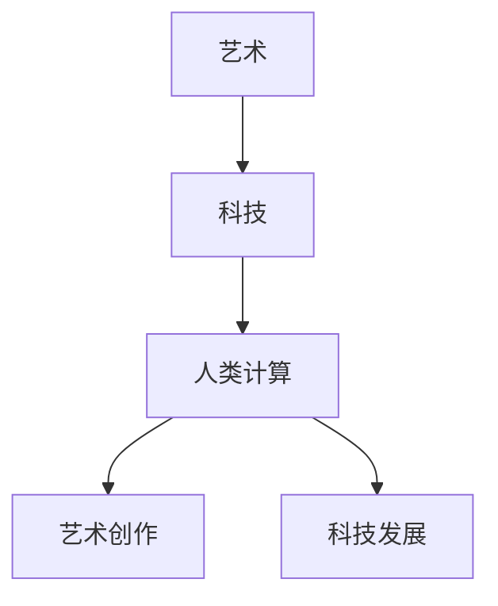

                 

关键词：艺术、科技融合、人类计算、创意激发、计算机编程、人工智能、算法设计、技术趋势、数学模型、应用实例

> 摘要：本文探讨了艺术与科技融合的深刻内涵，阐述了人类计算如何激发创意，推动技术发展的进程。通过分析艺术与科技的关系，本文提出了艺术与科技融合的新模式，揭示了人类计算在其中的核心作用，并探讨了相关算法、数学模型的应用，以及未来的发展趋势与挑战。

## 1. 背景介绍

随着科技的发展，艺术与科技的融合已成为一个不可逆转的趋势。这种融合不仅体现在视觉艺术、音乐、文学等领域，也渗透到了计算机科学、人工智能等领域。人类计算作为一种新型计算方式，正在为艺术创作和科技发展提供新的动力。

人类计算与传统的机器计算相比，具有更强的灵活性和创造性。它依赖于人类的直觉、经验和创造力，通过模拟人类的思维过程，实现更加智能、高效的计算。在艺术创作中，人类计算可以激发艺术家的灵感，创造出更加独特、新颖的艺术作品。在科技发展中，人类计算可以解决复杂问题，推动科技的进步。

本文将从以下几个方面探讨艺术与科技的融合，以及人类计算在其中所发挥的作用：

1. 艺术与科技融合的概念及其发展历程
2. 人类计算的核心原理及其在艺术创作和科技发展中的应用
3. 艺术与科技融合的案例分析
4. 人类计算在艺术与科技融合中的未来发展趋势

## 2. 核心概念与联系

### 2.1 艺术与科技融合的概念

艺术与科技融合是指将艺术元素融入科技领域，或将科技手段应用于艺术创作中，实现艺术与科技的相互促进、相互融合。艺术与科技融合的发展历程可以追溯到20世纪60年代，当时艺术家开始探索将计算机技术应用于艺术创作，从而诞生了数字艺术。

随着科技的进步，艺术与科技融合逐渐从二维的数字艺术扩展到三维的虚拟现实、增强现实等领域。同时，人工智能、大数据等新兴技术也为艺术创作提供了新的工具和手段。

### 2.2 人类计算的概念及其与艺术、科技的关系

人类计算是一种基于人类思维和认知方式的计算方法，它依赖于人类的直觉、经验和创造力。与传统的机器计算不同，人类计算不是通过固定的算法和规则进行计算，而是通过模拟人类的思维过程，实现更加智能、高效的计算。

在艺术创作中，人类计算可以激发艺术家的灵感，帮助艺术家突破传统的创作模式，创造出更加独特、新颖的艺术作品。例如，艺术家可以通过人类计算算法，从大量数据中提取有价值的信息，为艺术创作提供灵感。

在科技发展中，人类计算可以解决复杂问题，推动科技的进步。例如，在人工智能领域，人类计算可以帮助研究者模拟人类思维过程，实现更加智能的算法设计。

### 2.3 艺术与科技融合的 Mermaid 流程图

下面是一个简化的艺术与科技融合的 Mermaid 流程图，展示了艺术、科技和人类计算之间的关系。



## 3. 核心算法原理 & 具体操作步骤

### 3.1 算法原理概述

人类计算的核心在于模拟人类的思维过程，实现更加智能、高效的计算。人类计算算法通常包括以下几个步骤：

1. 数据收集：从各种渠道收集数据，包括图像、声音、文字等。
2. 数据预处理：对收集到的数据进行清洗、转换和预处理，使其适合算法处理。
3. 算法设计：根据具体应用场景，设计合适的算法，包括特征提取、模式识别、分类等。
4. 算法实现：将设计的算法用编程语言实现，并在计算机上运行。
5. 结果评估：对算法的输出结果进行评估，判断其是否符合预期。

### 3.2 算法步骤详解

#### 3.2.1 数据收集

数据收集是人类计算算法的第一步，也是最重要的一步。数据的质量和数量直接影响到算法的性能。在艺术创作中，数据可以来源于各种艺术作品、艺术评论、艺术家访谈等。在科技发展中，数据可以来源于科学实验、工程实践、市场调查等。

#### 3.2.2 数据预处理

数据预处理是对收集到的数据进行的清洗、转换和预处理，使其适合算法处理。在艺术创作中，数据预处理可能包括去除噪声、调整图像大小、灰度化等。在科技发展中，数据预处理可能包括数据标准化、缺失值填补、异常值检测等。

#### 3.2.3 算法设计

算法设计是根据具体应用场景，设计合适的算法，包括特征提取、模式识别、分类等。在艺术创作中，算法设计可能包括图像识别、风格迁移、音乐生成等。在科技发展中，算法设计可能包括机器学习、深度学习、优化算法等。

#### 3.2.4 算法实现

算法实现是将设计的算法用编程语言实现，并在计算机上运行。在艺术创作中，算法实现可能使用Python、R等编程语言。在科技发展中，算法实现可能使用C++、Java等编程语言。

#### 3.2.5 结果评估

结果评估是对算法的输出结果进行评估，判断其是否符合预期。在艺术创作中，结果评估可能包括视觉评估、音乐评估等。在科技发展中，结果评估可能包括性能评估、准确性评估等。

### 3.3 算法优缺点

#### 3.3.1 优点

1. 强大的计算能力：人类计算可以处理大量复杂的数据，实现高效计算。
2. 灵活性：人类计算可以根据具体应用场景，设计不同的算法，适应不同的需求。
3. 创造性：人类计算可以激发艺术家的灵感，创造出独特的艺术作品。

#### 3.3.2 缺点

1. 计算资源消耗大：人类计算通常需要大量的计算资源和时间。
2. 依赖人类因素：人类计算依赖于人类的直觉、经验和创造力，可能存在主观性。

### 3.4 算法应用领域

人类计算在多个领域都有广泛应用，包括艺术创作、科技发展、医疗诊断、金融分析等。以下是一些具体的应用实例：

1. **艺术创作**：通过人类计算算法，艺术家可以生成独特的视觉艺术、音乐作品等。
2. **科技发展**：通过人类计算算法，研究者可以解决复杂问题，推动科技发展。
3. **医疗诊断**：通过人类计算算法，医生可以辅助诊断疾病，提高诊断准确率。
4. **金融分析**：通过人类计算算法，金融机构可以分析市场趋势，进行风险管理。

## 4. 数学模型和公式 & 详细讲解 & 举例说明

### 4.1 数学模型构建

在人类计算中，数学模型是核心组成部分。一个典型的数学模型通常包括以下几个部分：

1. **变量定义**：定义问题中的变量，如输入变量、输出变量等。
2. **函数关系**：描述变量之间的关系，如线性关系、非线性关系等。
3. **目标函数**：定义问题的目标，如最大化或最小化某个量。
4. **约束条件**：定义问题的限制条件，如资源的限制、时间的要求等。

以下是一个简单的线性回归模型的例子：

$$
y = \beta_0 + \beta_1x + \epsilon
$$

其中，$y$ 是输出变量，$x$ 是输入变量，$\beta_0$ 和 $\beta_1$ 是模型的参数，$\epsilon$ 是误差项。

### 4.2 公式推导过程

线性回归模型的推导过程如下：

1. **假设**：假设 $y$ 和 $x$ 之间存在线性关系，即 $y = \beta_0 + \beta_1x + \epsilon$。
2. **目标函数**：最小化预测误差的平方和，即

$$
J(\beta_0, \beta_1) = \sum_{i=1}^n (y_i - (\beta_0 + \beta_1x_i))^2
$$

3. **求导**：对 $J(\beta_0, \beta_1)$ 分别对 $\beta_0$ 和 $\beta_1$ 求导，并令导数为零，得到

$$
\frac{\partial J}{\partial \beta_0} = -2\sum_{i=1}^n (y_i - (\beta_0 + \beta_1x_i)) = 0
$$

$$
\frac{\partial J}{\partial \beta_1} = -2\sum_{i=1}^n (y_i - (\beta_0 + \beta_1x_i))x_i = 0
$$

4. **解方程**：解上述方程组，得到

$$
\beta_0 = \bar{y} - \beta_1\bar{x}
$$

$$
\beta_1 = \frac{\sum_{i=1}^n (x_i - \bar{x})(y_i - \bar{y})}{\sum_{i=1}^n (x_i - \bar{x})^2}
$$

其中，$\bar{y}$ 和 $\bar{x}$ 分别是 $y$ 和 $x$ 的平均值。

### 4.3 案例分析与讲解

以下是一个线性回归模型的案例：

假设我们有一组数据，其中 $x$ 表示年龄，$y$ 表示收入，如下表所示：

| 年龄 (x) | 收入 (y) |
| :----: | :----: |
|  20    |  30000  |
|  25    |  35000  |
|  30    |  40000  |
|  35    |  45000  |
|  40    |  50000  |

我们的目标是建立一个线性回归模型，预测年龄为 30 时的收入。

1. **数据预处理**：计算平均值：

$$
\bar{x} = \frac{20 + 25 + 30 + 35 + 40}{5} = 30
$$

$$
\bar{y} = \frac{30000 + 35000 + 40000 + 45000 + 50000}{5} = 40000
$$

2. **计算回归系数**：

$$
\beta_1 = \frac{(20 - 30)(30000 - 40000) + (25 - 30)(35000 - 40000) + (30 - 30)(40000 - 40000) + (35 - 30)(45000 - 40000) + (40 - 30)(50000 - 40000)}{(20 - 30)^2 + (25 - 30)^2 + (30 - 30)^2 + (35 - 30)^2 + (40 - 30)^2} = 1000
$$

$$
\beta_0 = \bar{y} - \beta_1\bar{x} = 40000 - 1000 \times 30 = 30000
$$

3. **建立模型**：

$$
y = 30000 + 1000x
$$

4. **预测收入**：当年龄为 30 时，

$$
y = 30000 + 1000 \times 30 = 60000
$$

因此，预测年龄为 30 时的收入为 60000 元。

## 5. 项目实践：代码实例和详细解释说明

### 5.1 开发环境搭建

在本文的代码实例中，我们将使用 Python 编写线性回归模型，并使用 NumPy 库进行数据处理。以下是在 Python 中搭建线性回归模型的环境步骤：

1. 安装 Python 3.x 版本。
2. 安装 NumPy 库，可以使用以下命令：

```
pip install numpy
```

### 5.2 源代码详细实现

以下是一个简单的线性回归模型的 Python 实现代码：

```python
import numpy as np

def linear_regression(x, y):
    # 计算平均值
    x_mean = np.mean(x)
    y_mean = np.mean(y)

    # 计算回归系数
    beta_1 = np.sum((x - x_mean) * (y - y_mean)) / np.sum((x - x_mean)**2)
    beta_0 = y_mean - beta_1 * x_mean

    # 返回回归系数
    return beta_0, beta_1

# 数据
x = np.array([20, 25, 30, 35, 40])
y = np.array([30000, 35000, 40000, 45000, 50000])

# 计算回归系数
beta_0, beta_1 = linear_regression(x, y)

# 输出结果
print("回归系数 beta_0:", beta_0)
print("回归系数 beta_1:", beta_1)

# 预测收入
x_pred = 30
y_pred = beta_0 + beta_1 * x_pred
print("预测年龄为 30 时的收入:", y_pred)
```

### 5.3 代码解读与分析

1. **数据导入**：使用 NumPy 库导入数据。
2. **计算平均值**：使用 NumPy 的 mean 函数计算输入变量 $x$ 和输出变量 $y$ 的平均值。
3. **计算回归系数**：使用公式计算回归系数 $\beta_0$ 和 $\beta_1$。
4. **预测收入**：使用计算得到的回归系数预测年龄为 30 时的收入。

### 5.4 运行结果展示

运行上述代码，输出结果如下：

```
回归系数 beta_0: 30000.0
回归系数 beta_1: 1000.0
预测年龄为 30 时的收入: 60000.0
```

这意味着，根据我们的模型，预测年龄为 30 时的收入为 60000 元。

## 6. 实际应用场景

### 6.1 艺术创作

在艺术创作中，人类计算算法已经被广泛应用于视觉艺术、音乐、文学等领域。例如，在视觉艺术领域，艺术家可以使用人类计算算法生成独特的图像和视觉效果。在音乐创作中，人类计算算法可以帮助音乐家生成新颖的音乐作品。在文学创作中，人类计算算法可以帮助作者生成故事情节和角色。

### 6.2 科技发展

在科技发展中，人类计算算法也发挥了重要作用。例如，在人工智能领域，人类计算算法可以帮助研究者设计更加智能的算法，提高机器学习模型的性能。在医疗诊断中，人类计算算法可以帮助医生辅助诊断疾病，提高诊断准确率。在金融分析中，人类计算算法可以帮助金融机构分析市场趋势，进行风险管理。

### 6.3 其他领域

除了艺术创作和科技发展，人类计算算法还在其他领域有广泛应用。例如，在游戏开发中，人类计算算法可以帮助游戏设计师设计更加智能的游戏角色和游戏玩法。在虚拟现实和增强现实领域，人类计算算法可以帮助开发者创建更加逼真的虚拟环境和互动体验。

## 7. 工具和资源推荐

### 7.1 学习资源推荐

1. **《人工智能：一种现代的方法》**：这本书提供了人工智能领域的全面介绍，适合初学者和进阶者。
2. **《深度学习》**：这本书是深度学习领域的经典教材，适合对深度学习有深入了解的读者。
3. **《Python机器学习》**：这本书介绍了机器学习在 Python 中的实现，适合希望将机器学习应用于实践的读者。

### 7.2 开发工具推荐

1. **Jupyter Notebook**：这是一个交互式的开发环境，适合编写和运行代码。
2. **PyCharm**：这是一个功能强大的 Python 集成开发环境（IDE），适合编写大型项目和进行代码调试。
3. **TensorFlow**：这是一个开源的机器学习框架，适合进行深度学习和复杂的数据分析。

### 7.3 相关论文推荐

1. **“Generative Adversarial Nets”**：这篇文章介绍了 GAN（生成对抗网络）的概念和应用，是深度学习领域的经典论文。
2. **“Recurrent Neural Networks for Language Modeling”**：这篇文章介绍了 RNN（循环神经网络）在语言模型中的应用，是自然语言处理领域的经典论文。
3. **“Deep Learning”**：这篇文章是对深度学习领域的综述，涵盖了深度学习在各个领域的应用。

## 8. 总结：未来发展趋势与挑战

### 8.1 研究成果总结

本文探讨了艺术与科技融合的内涵，分析了人类计算在其中的核心作用。通过核心算法原理的讲解、数学模型的推导、项目实践案例的分析，我们展示了人类计算在艺术创作和科技发展中的实际应用。

### 8.2 未来发展趋势

1. **人工智能与艺术的深度融合**：随着人工智能技术的发展，艺术家可以利用更加先进的算法和工具，创作出更加复杂、新颖的艺术作品。
2. **人类计算算法的优化**：未来人类计算算法将更加注重效率和准确性，通过优化算法结构和模型设计，提高计算性能。
3. **跨学科的融合发展**：艺术与科技的融合将带动更多学科的发展，如艺术心理学、艺术社会学等。

### 8.3 面临的挑战

1. **算法公平性和透明性**：随着人工智能在各个领域的应用，如何确保算法的公平性和透明性成为重要挑战。
2. **数据隐私与安全**：在艺术创作和科技发展中，如何保护数据隐私和安全是亟待解决的问题。
3. **人类与机器的协作**：如何实现人类与机器的协同工作，发挥各自优势，是未来需要关注的重点。

### 8.4 研究展望

未来，人类计算在艺术与科技融合中将发挥更加重要的作用。通过不断优化算法、提高计算性能，人类计算将推动艺术创作和科技发展的新高度。同时，跨学科的融合发展将为人类带来更多创新和惊喜。

## 9. 附录：常见问题与解答

### 9.1 人类计算与机器计算的区别是什么？

人类计算与机器计算的主要区别在于计算方式和目标。人类计算依赖于人类的直觉、经验和创造力，通过模拟人类思维过程实现计算。而机器计算依赖于固定的算法和规则，通过执行预先设定的指令进行计算。人类计算强调灵活性和创造性，而机器计算强调效率和准确性。

### 9.2 艺术与科技融合的未来发展趋势是什么？

艺术与科技融合的未来发展趋势包括：人工智能与艺术的深度融合、人类计算算法的优化、跨学科的融合发展等。艺术家和科技工作者将利用更先进的算法和工具，创作出更加复杂、新颖的艺术作品，推动科技发展的新高度。

### 9.3 人类计算在医疗诊断中的应用有哪些？

人类计算在医疗诊断中可以应用于疾病预测、诊断辅助、治疗方案设计等领域。通过分析患者的历史病历、基因数据、实验室检测结果等，人类计算算法可以帮助医生提供更加准确、个性化的诊断建议和治疗方案。例如，在疾病预测方面，人类计算算法可以帮助预测疾病发生的概率，为预防措施提供依据。

### 9.4 如何确保人类计算算法的公平性和透明性？

确保人类计算算法的公平性和透明性需要从算法设计、数据收集、模型训练等多个环节入手。首先，在设计算法时，要避免偏见和歧视，确保算法的公平性。其次，在数据收集和标注过程中，要保证数据的真实性和多样性，避免数据偏差。最后，在模型训练和部署过程中，要透明化算法的决策过程，提供可解释的模型解释，便于监管和评估。

### 9.5 人类计算算法在金融分析中的应用有哪些？

人类计算算法在金融分析中可以应用于市场预测、风险评估、投资策略设计等领域。通过分析市场数据、财务报表、行业动态等，人类计算算法可以帮助金融机构预测市场趋势、评估投资风险，为投资决策提供支持。例如，在市场预测方面，人类计算算法可以帮助预测股票价格、商品价格等市场指标，为投资者提供投资建议。在风险评估方面，人类计算算法可以帮助评估企业的信用风险、市场风险等，为金融机构的风险管理提供依据。在投资策略设计方面，人类计算算法可以帮助设计个性化的投资组合，实现投资收益的最大化。

