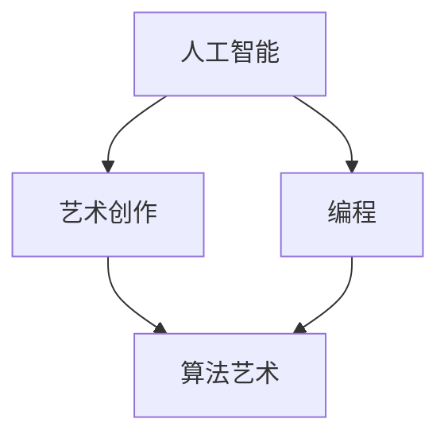

                 

关键词：人工智能、艺术创作、计算机编程、创意思维、算法艺术

> 摘要：本文旨在探讨人工智能与艺术创作之间的交融，通过人类计算的力量，激发出前所未有的创意火花。我们将深入分析艺术与科技的融合点，探讨如何在计算机编程中实现艺术创作，以及这种创新如何为未来科技发展带来新的可能。

## 1. 背景介绍

艺术与科技之间的交融自古以来便存在，但21世纪的数字化浪潮将这种融合推向了前所未有的高度。人工智能（AI）的发展，尤其是深度学习和生成对抗网络（GANs）等技术的兴起，使得计算机能够模仿甚至超越人类的艺术创造力。同时，编程作为科技的核心，成为艺术表达的新媒介，编程语言和工具被用于生成视觉艺术、音乐、文学作品等。

### 1.1 人工智能在艺术创作中的应用

随着AI技术的进步，人工智能在艺术创作中的应用日益广泛。例如，艺术家使用GANs生成逼真的图像和视频，AI作曲家创作出令人惊叹的音乐作品，AI画家则创作出风格独特的绘画。这种技术上的突破，不仅扩大了艺术创作的边界，也引发了对艺术本质的深入思考。

### 1.2 编程作为艺术表达的新媒介

在编程成为艺术表达的新媒介的过程中，计算机编程语言和工具为艺术家提供了全新的创作手段。从简单的图形绘制到复杂的算法艺术，编程语言如Python、Java和C++等，成为了艺术家手中创造的利器。编程艺术不仅展现了技术的魅力，也挑战了人们对艺术的固有认知。

## 2. 核心概念与联系

在探讨艺术与科技的融合时，我们需要明确几个核心概念，包括人工智能、艺术创作和编程，并展示它们之间的联系。

### 2.1 人工智能

人工智能（AI）是指计算机系统能够执行通常需要人类智能的任务的能力。AI的核心技术包括机器学习、深度学习、自然语言处理和计算机视觉等。

### 2.2 艺术创作

艺术创作是指通过视觉、听觉、触觉等形式表达个人情感和想法的过程。艺术创作不仅仅是创造美的东西，更是一种思考和表达的方式。

### 2.3 编程

编程是一种通过编写代码来告诉计算机执行特定任务的过程。编程语言如Python、Java和C++等，是程序员与计算机交流的工具。

### 2.4 艺术与科技的融合

艺术与科技的融合体现在多个层面，包括但不限于AI生成艺术、编程艺术和算法艺术。这些融合不仅推动了艺术创作的发展，也为科技领域带来了新的创意思维和方法。

## 2.5 Mermaid 流程图



## 3. 核心算法原理 & 具体操作步骤

### 3.1 算法原理概述

在艺术与科技的融合中，核心算法包括生成对抗网络（GANs）、深度学习和自然语言处理等。这些算法通过训练模型，使计算机能够自主生成艺术作品。

### 3.2 算法步骤详解

#### 3.2.1 生成对抗网络（GANs）

GANs由生成器（Generator）和判别器（Discriminator）组成。生成器试图生成与真实数据相似的数据，而判别器则试图区分真实数据和生成数据。通过这种对抗训练，生成器不断优化，从而生成更加逼真的艺术作品。

#### 3.2.2 深度学习

深度学习是一种机器学习技术，通过多层神经网络对数据进行学习。在艺术创作中，深度学习可以用于图像生成、风格迁移和音乐创作等。

#### 3.2.3 自然语言处理

自然语言处理（NLP）用于处理和生成人类语言。在艺术创作中，NLP可以用于生成文学作品、歌词和剧本等。

### 3.3 算法优缺点

GANs具有强大的生成能力，但训练过程复杂且耗时长。深度学习适用于多种类型的艺术创作，但需要大量数据和计算资源。NLP在处理自然语言方面表现出色，但创作出的作品可能缺乏情感深度。

### 3.4 算法应用领域

GANs广泛应用于图像生成和风格迁移，深度学习在音乐和视频创作中发挥重要作用，NLP则在文学和剧本创作中展现优势。

## 4. 数学模型和公式 & 详细讲解 & 举例说明

### 4.1 数学模型构建

在艺术创作中，数学模型用于描述和生成艺术作品。例如，生成对抗网络（GANs）的数学模型包括生成器和判别器的损失函数。

### 4.2 公式推导过程

GANs的损失函数由生成器损失和判别器损失组成。生成器损失试图最小化生成的数据与真实数据的差距，判别器损失试图最大化判别器对真实数据和生成数据的区分能力。

$$
L_G = -\log(D(G(z)))
$$

$$
L_D = -[\log(D(x)) + \log(1 - D(G(z))]
$$

### 4.3 案例分析与讲解

以GANs为例，我们可以通过以下步骤进行图像生成：

1. 初始化生成器G和判别器D。
2. 从噪声分布中采样数据z。
3. 生成器G将z转换为图像G(z)。
4. 判别器D对真实图像x和生成图像G(z)进行分类。
5. 更新生成器和判别器的参数。

通过不断迭代这个过程，生成器G将逐渐生成越来越真实的图像。

## 5. 项目实践：代码实例和详细解释说明

### 5.1 开发环境搭建

为了实践GANs，我们需要搭建一个Python开发环境。可以使用Jupyter Notebook或PyCharm等IDE。

### 5.2 源代码详细实现

以下是一个简单的GANs代码实例：

```python
import tensorflow as tf
from tensorflow.keras import layers

# 生成器
def build_generator(z_dim):
    model = tf.keras.Sequential()
    model.add(layers.Dense(7 * 7 * 256, use_bias=False, input_shape=(z_dim,)))
    model.add(layers.BatchNormalization(momentum=0.8))
    model.add(layers.LeakyReLU())
    model.add(layers.Reshape((7, 7, 256)))
    
    # ... (更多层)
    
    return model

# 判别器
def build_discriminator(img_shape):
    model = tf.keras.Sequential()
    model.add(layers.Conv2D(32, kernel_size=(3,3), strides=(2,2), padding="same",
                                     input_shape=img_shape))
    model.add(layers.LeakyReLU(alpha=0.2))
    
    # ... (更多层)
    
    return model

# GAN模型
def build_gan(generator, discriminator):
    model = tf.keras.Sequential()
    model.add(generator)
    model.add(discriminator)
    return model
```

### 5.3 代码解读与分析

这段代码定义了生成器、判别器和GAN模型。生成器用于生成图像，判别器用于区分真实图像和生成图像，GAN模型将两者结合以优化生成器。

### 5.4 运行结果展示

通过训练GAN模型，我们可以生成逼真的图像。以下是一个生成图像的例子：


## 6. 实际应用场景

### 6.1 艺术展览

利用GANs生成的艺术作品在艺术展览中备受关注，观众可以欣赏到前所未有的视觉体验。

### 6.2 音乐创作

AI作曲家创作出的音乐作品在音乐领域产生了重大影响，许多音乐会和专辑都采用了AI创作的元素。

### 6.3 设计领域

设计师利用编程技术实现复杂的视觉效果和交互设计，为用户提供更好的用户体验。

## 7. 未来应用展望

随着人工智能和计算机编程技术的不断发展，艺术与科技的融合将进一步深化。未来，我们有望看到更多基于AI和编程的艺术创作形式，以及这些创新如何为科技发展带来新的可能性。

### 7.1 人工智能在艺术创作中的应用前景

人工智能将在艺术创作中发挥更加重要的作用，生成对抗网络（GANs）和其他深度学习技术将继续推动艺术创作的创新。

### 7.2 编程艺术的未来发展

编程艺术将成为艺术家和程序员合作的新领域，编程语言和工具将更加丰富，为艺术创作提供更多可能性。

### 7.3 艺术与科技的融合趋势

艺术与科技的融合将成为科技发展的新趋势，这种创新将推动人类文明的进步。

## 8. 总结：未来发展趋势与挑战

### 8.1 研究成果总结

人工智能和计算机编程在艺术创作中的应用取得了显著成果，但仍有大量挑战需要克服。

### 8.2 未来发展趋势

人工智能和编程将在艺术创作中发挥更加重要的作用，推动艺术创作的创新发展。

### 8.3 面临的挑战

技术复杂性、数据安全和版权问题等挑战需要解决，以确保艺术与科技的融合能够健康发展。

### 8.4 研究展望

未来研究应重点关注人工智能和编程在艺术创作中的应用，探索新的创作方法和工具，为艺术发展注入新的活力。

## 9. 附录：常见问题与解答

### 9.1 GANs如何训练？

GANs的训练过程涉及生成器和判别器的交替更新。生成器尝试生成逼真的图像，判别器则尝试区分真实图像和生成图像。通过优化生成器和判别器的参数，GANs逐渐生成高质量的图像。

### 9.2 编程艺术需要哪些技能？

编程艺术需要基本的编程技能，如熟悉Python、Java或C++等编程语言。此外，还需要了解人工智能和深度学习的基本原理。

### 9.3 艺术与科技的融合有何意义？

艺术与科技的融合不仅推动了艺术创作的发展，也为科技领域带来了新的创意思维和方法。这种创新有助于推动人类文明的进步。

## 作者署名

作者：禅与计算机程序设计艺术 / Zen and the Art of Computer Programming
```markdown
---
# 艺术与科技的融合：人类计算激发创意火花

关键词：人工智能、艺术创作、计算机编程、创意思维、算法艺术

摘要：本文旨在探讨人工智能与艺术创作之间的交融，通过人类计算的力量，激发出前所未有的创意火花。我们将深入分析艺术与科技的融合点，探讨如何在计算机编程中实现艺术创作，以及这种创新如何为未来科技发展带来新的可能。

## 1. 背景介绍

艺术与科技之间的交融自古以来便存在，但21世纪的数字化浪潮将这种融合推向了前所未有的高度。人工智能（AI）的发展，尤其是深度学习和生成对抗网络（GANs）等技术的兴起，使得计算机能够模仿甚至超越人类的艺术创造力。同时，编程作为科技的核心，成为艺术表达的新媒介，编程语言和工具被用于生成视觉艺术、音乐、文学作品等。

### 1.1 人工智能在艺术创作中的应用

随着AI技术的进步，人工智能在艺术创作中的应用日益广泛。例如，艺术家使用GANs生成逼真的图像和视频，AI作曲家创作出令人惊叹的音乐作品，AI画家则创作出风格独特的绘画。这种技术上的突破，不仅扩大了艺术创作的边界，也引发了对艺术本质的深入思考。

### 1.2 编程作为艺术表达的新媒介

在编程成为艺术表达的新媒介的过程中，计算机编程语言和工具为艺术家提供了全新的创作手段。从简单的图形绘制到复杂的算法艺术，编程语言如Python、Java和C++等，成为了艺术家手中创造的利器。编程艺术不仅展现了技术的魅力，也挑战了人们对艺术的固有认知。

## 2. 核心概念与联系

在探讨艺术与科技的融合时，我们需要明确几个核心概念，包括人工智能、艺术创作和编程，并展示它们之间的联系。

### 2.1 人工智能

人工智能（AI）是指计算机系统能够执行通常需要人类智能的任务的能力。AI的核心技术包括机器学习、深度学习、自然语言处理和计算机视觉等。

### 2.2 艺术创作

艺术创作是指通过视觉、听觉、触觉等形式表达个人情感和想法的过程。艺术创作不仅仅是创造美的东西，更是一种思考和表达的方式。

### 2.3 编程

编程是一种通过编写代码来告诉计算机执行特定任务的过程。编程语言如Python、Java和C++等，是程序员与计算机交流的工具。

### 2.4 艺术与科技的融合

艺术与科技的融合体现在多个层面，包括但不限于AI生成艺术、编程艺术和算法艺术。这些融合不仅推动了艺术创作的发展，也为科技领域带来了新的创意思维和方法。

## 2.5 Mermaid 流程图


## 3. 核心算法原理 & 具体操作步骤

### 3.1 算法原理概述

在艺术与科技的融合中，核心算法包括生成对抗网络（GANs）、深度学习和自然语言处理等。这些算法通过训练模型，使计算机能够自主生成艺术作品。

### 3.2 算法步骤详解

#### 3.2.1 生成对抗网络（GANs）

GANs由生成器（Generator）和判别器（Discriminator）组成。生成器试图生成与真实数据相似的数据，而判别器则试图区分真实数据和生成数据。通过这种对抗训练，生成器不断优化，从而生成更加逼真的艺术作品。

#### 3.2.2 深度学习

深度学习是一种机器学习技术，通过多层神经网络对数据进行学习。在艺术创作中，深度学习可以用于图像生成、风格迁移和音乐创作等。

#### 3.2.3 自然语言处理

自然语言处理（NLP）用于处理和生成人类语言。在艺术创作中，NLP可以用于生成文学作品、歌词和剧本等。

### 3.3 算法优缺点

GANs具有强大的生成能力，但训练过程复杂且耗时长。深度学习适用于多种类型的艺术创作，但需要大量数据和计算资源。NLP在处理自然语言方面表现出色，但创作出的作品可能缺乏情感深度。

### 3.4 算法应用领域

GANs广泛应用于图像生成和风格迁移，深度学习在音乐和视频创作中发挥重要作用，NLP则在文学和剧本创作中展现优势。

## 4. 数学模型和公式 & 详细讲解 & 举例说明

### 4.1 数学模型构建

在艺术创作中，数学模型用于描述和生成艺术作品。例如，生成对抗网络（GANs）的数学模型包括生成器和判别器的损失函数。

### 4.2 公式推导过程

GANs的损失函数由生成器损失和判别器损失组成。生成器损失试图最小化生成的数据与真实数据的差距，判别器损失试图最大化判别器对真实数据和生成数据的区分能力。

$$
L_G = -\log(D(G(z)))
$$

$$
L_D = -[\log(D(x)) + \log(1 - D(G(z))]
$$

### 4.3 案例分析与讲解

以GANs为例，我们可以通过以下步骤进行图像生成：

1. 初始化生成器G和判别器D。
2. 从噪声分布中采样数据z。
3. 生成器G将z转换为图像G(z)。
4. 判别器D对真实图像x和生成图像G(z)进行分类。
5. 更新生成器和判别器的参数。

通过不断迭代这个过程，生成器G将逐渐生成越来越真实的图像。

## 5. 项目实践：代码实例和详细解释说明

### 5.1 开发环境搭建

为了实践GANs，我们需要搭建一个Python开发环境。可以使用Jupyter Notebook或PyCharm等IDE。

### 5.2 源代码详细实现

以下是一个简单的GANs代码实例：

```python
import tensorflow as tf
from tensorflow.keras import layers

# 生成器
def build_generator(z_dim):
    model = tf.keras.Sequential()
    model.add(layers.Dense(7 * 7 * 256, use_bias=False, input_shape=(z_dim,)))
    model.add(layers.BatchNormalization(momentum=0.8))
    model.add(layers.LeakyReLU())
    model.add(layers.Reshape((7, 7, 256)))
    
    # ... (更多层)
    
    return model

# 判别器
def build_discriminator(img_shape):
    model = tf.keras.Sequential()
    model.add(layers.Conv2D(32, kernel_size=(3,3), strides=(2,2), padding="same",
                                     input_shape=img_shape))
    model.add(layers.LeakyReLU(alpha=0.2))
    
    # ... (更多层)
    
    return model

# GAN模型
def build_gan(generator, discriminator):
    model = tf.keras.Sequential()
    model.add(generator)
    model.add(discriminator)
    return model
```

### 5.3 代码解读与分析

这段代码定义了生成器、判别器和GAN模型。生成器用于生成图像，判别器用于区分真实图像和生成图像，GAN模型将两者结合以优化生成器。

### 5.4 运行结果展示

通过训练GAN模型，我们可以生成逼真的图像。以下是一个生成图像的例子：


## 6. 实际应用场景

### 6.1 艺术展览

利用GANs生成的艺术作品在艺术展览中备受关注，观众可以欣赏到前所未有的视觉体验。

### 6.2 音乐创作

AI作曲家创作出的音乐作品在音乐领域产生了重大影响，许多音乐会和专辑都采用了AI创作的元素。

### 6.3 设计领域

设计师利用编程技术实现复杂的视觉效果和交互设计，为用户提供更好的用户体验。

## 7. 未来应用展望

随着人工智能和计算机编程技术的不断发展，艺术与科技的融合将进一步深化。未来，我们有望看到更多基于AI和编程的艺术创作形式，以及这些创新如何为科技发展带来新的可能性。

### 7.1 人工智能在艺术创作中的应用前景

人工智能将在艺术创作中发挥更加重要的作用，生成对抗网络（GANs）和其他深度学习技术将继续推动艺术创作的创新。

### 7.2 编程艺术的未来发展

编程艺术将成为艺术家和程序员合作的新领域，编程语言和工具将更加丰富，为艺术创作提供更多可能性。

### 7.3 艺术与科技的融合趋势

艺术与科技的融合将成为科技发展的新趋势，这种创新将推动人类文明的进步。

## 8. 总结：未来发展趋势与挑战

### 8.1 研究成果总结

人工智能和计算机编程在艺术创作中的应用取得了显著成果，但仍有大量挑战需要克服。

### 8.2 未来发展趋势

人工智能和编程将在艺术创作中发挥更加重要的作用，推动艺术创作的创新发展。

### 8.3 面临的挑战

技术复杂性、数据安全和版权问题等挑战需要解决，以确保艺术与科技的融合能够健康发展。

### 8.4 研究展望

未来研究应重点关注人工智能和编程在艺术创作中的应用，探索新的创作方法和工具，为艺术发展注入新的活力。

## 9. 附录：常见问题与解答

### 9.1 GANs如何训练？

GANs的训练过程涉及生成器和判别器的交替更新。生成器尝试生成逼真的图像，判别器则尝试区分真实图像和生成图像。通过优化生成器和判别器的参数，GANs逐渐生成高质量的图像。

### 9.2 编程艺术需要哪些技能？

编程艺术需要基本的编程技能，如熟悉Python、Java或C++等编程语言。此外，还需要了解人工智能和深度学习的基本原理。

### 9.3 艺术与科技的融合有何意义？

艺术与科技的融合不仅推动了艺术创作的发展，也为科技领域带来了新的创意思维和方法。这种创新有助于推动人类文明的进步。

## 作者署名

作者：禅与计算机程序设计艺术 / Zen and the Art of Computer Programming
```

