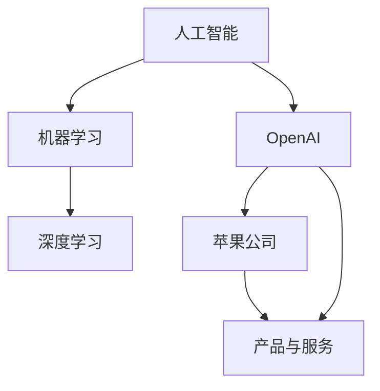

                 

关键词：苹果，OpenAI，合作模式，人工智能，技术革新

> 摘要：本文深入探讨了苹果公司与OpenAI之间的合作模式，分析了双方的合作背景、合作领域以及合作成果。文章旨在为读者揭示这一技术巨头之间的合作如何推动了人工智能技术的发展，以及未来可能的发展趋势。

## 1. 背景介绍

苹果公司（Apple Inc.），作为全球领先的科技公司，以其创新的硬件、软件和服务闻名。自1976年成立以来，苹果公司在电脑、手机、平板、穿戴设备等多个领域取得了显著的成就。苹果公司不仅在硬件领域建立了强大的品牌影响力，同时也在软件和服务上不断创新，推出了包括iOS、macOS、watchOS和iPadOS等操作系统，以及iCloud、App Store等一系列服务。

OpenAI，是一家成立于2015年的美国人工智能研究实验室，旨在通过合作促进人工智能的发展，并确保其安全、有益地应用于各个领域。OpenAI的使命是“实现安全的通用人工智能（AGI）”，并通过开放源代码、合作研究等方式推动人工智能的进步。

苹果公司与OpenAI的合作始于2020年，当时苹果公司宣布向OpenAI投资10亿美元，成为OpenAI的首位外部投资者。此次投资不仅标志着苹果公司对人工智能技术的重视，也展示了其愿意通过合作推动技术进步的决心。

## 2. 核心概念与联系

为了更好地理解苹果与OpenAI的合作模式，我们需要先明确几个核心概念：

- **人工智能（AI）**：人工智能是计算机科学的一个分支，旨在使机器具备人类智能，能够执行感知、思考、学习和决策等任务。
- **机器学习（ML）**：机器学习是人工智能的一个重要子领域，通过算法让计算机从数据中学习，从而进行预测和决策。
- **深度学习（DL）**：深度学习是机器学习的一种方法，通过模拟人脑中的神经网络结构来学习复杂的模式。

### Mermaid 流程图



## 3. 核心算法原理 & 具体操作步骤

### 3.1 算法原理概述

苹果与OpenAI的合作主要集中在深度学习领域，特别是在自然语言处理、计算机视觉和语音识别等方面。深度学习算法通过多层神经网络结构，从大量数据中学习特征，从而实现高精度的预测和分类。

### 3.2 算法步骤详解

- **数据预处理**：收集和处理大量的数据，包括文本、图像、语音等，为深度学习模型提供训练数据。
- **模型构建**：设计并构建多层神经网络结构，包括输入层、隐藏层和输出层。
- **训练过程**：使用训练数据对神经网络模型进行训练，通过反向传播算法不断调整网络参数，以提高模型的准确性。
- **评估与优化**：使用验证数据对训练好的模型进行评估，并根据评估结果调整模型结构和参数，以优化模型性能。

### 3.3 算法优缺点

- **优点**：深度学习算法具有强大的学习能力和泛化能力，能够处理复杂的任务和数据。
- **缺点**：深度学习模型的训练过程需要大量的计算资源和时间，同时模型的解释性相对较低。

### 3.4 算法应用领域

深度学习算法在自然语言处理、计算机视觉、语音识别、推荐系统等多个领域都有广泛应用。苹果与OpenAI的合作成果主要体现在以下几个方面：

- **自然语言处理**：改进了苹果公司的Siri语音助手和iMessage聊天应用，使其能够更准确地理解和回复用户的语音指令和文本消息。
- **计算机视觉**：提升了苹果手机的拍照和视频编辑功能，使得相机能够在不同的光照条件下捕捉更清晰、更生动的照片和视频。
- **语音识别**：增强了苹果设备的语音识别能力，使得用户能够更轻松地通过语音指令控制设备。

## 4. 数学模型和公式 & 详细讲解 & 举例说明

### 4.1 数学模型构建

深度学习模型通常由以下几个部分组成：

- **输入层**：接收外部输入的数据。
- **隐藏层**：对输入数据进行处理和转换。
- **输出层**：产生模型的预测结果。

在隐藏层中，常用的激活函数包括 sigmoid、ReLU 和 tanh 等。其中，ReLU 函数因其计算效率高且不易出现梯度消失问题而广泛应用。

### 4.2 公式推导过程

假设我们有一个包含 n 个输入节点、m 个隐藏节点和 k 个输出节点的深度学习模型，输入数据为 \(X \in \mathbb{R}^{n \times 1}\)，隐藏层输出为 \(H \in \mathbb{R}^{m \times 1}\)，输出层输出为 \(Y \in \mathbb{R}^{k \times 1}\)。

输入层到隐藏层的映射可以表示为：

\[ H = \sigma(W_1X + b_1) \]

其中，\(W_1 \in \mathbb{R}^{m \times n}\) 为输入层到隐藏层的权重矩阵，\(b_1 \in \mathbb{R}^{m \times 1}\) 为隐藏层的偏置项，\(\sigma\) 为激活函数。

隐藏层到输出层的映射可以表示为：

\[ Y = \sigma(W_2H + b_2) \]

其中，\(W_2 \in \mathbb{R}^{k \times m}\) 为隐藏层到输出层的权重矩阵，\(b_2 \in \mathbb{R}^{k \times 1}\) 为输出层的偏置项。

### 4.3 案例分析与讲解

假设我们有一个分类问题，输入数据为图片，输出为图片的类别标签。我们可以使用一个简单的深度学习模型进行分类。

- **输入层**：输入一个 \(28 \times 28\) 的像素矩阵。
- **隐藏层**：使用一个包含 128 个神经元的隐藏层。
- **输出层**：输出一个包含 10 个类别的概率分布。

假设我们使用 ReLU 函数作为激活函数，权重矩阵和偏置项随机初始化。

输入层到隐藏层的映射为：

\[ H = \sigma(W_1X + b_1) \]

隐藏层到输出层的映射为：

\[ Y = \sigma(W_2H + b_2) \]

其中，\(W_1 \in \mathbb{R}^{128 \times 28 \times 28}\)，\(b_1 \in \mathbb{R}^{128 \times 1}\)，\(W_2 \in \mathbb{R}^{10 \times 128}\)，\(b_2 \in \mathbb{R}^{10 \times 1}\)。

## 5. 项目实践：代码实例和详细解释说明

### 5.1 开发环境搭建

为了实现上述的深度学习模型，我们需要搭建一个合适的开发环境。本文使用 Python 编程语言，结合 TensorFlow 和 Keras 库进行模型搭建和训练。

首先，安装 Python 和 TensorFlow：

```bash
pip install python
pip install tensorflow
```

### 5.2 源代码详细实现

以下是实现上述深度学习模型的 Python 代码：

```python
import tensorflow as tf
from tensorflow.keras import layers

# 定义输入层、隐藏层和输出层
inputs = tf.keras.Input(shape=(28, 28))
hidden = layers.Dense(128, activation='relu')(inputs)
outputs = layers.Dense(10, activation='softmax')(hidden)

# 搭建模型
model = tf.keras.Model(inputs=inputs, outputs=outputs)

# 编译模型
model.compile(optimizer='adam', loss='categorical_crossentropy', metrics=['accuracy'])

# 加载数据集
(x_train, y_train), (x_test, y_test) = tf.keras.datasets.mnist.load_data()

# 数据预处理
x_train = x_train.astype('float32') / 255
x_test = x_test.astype('float32') / 255
y_train = tf.keras.utils.to_categorical(y_train, 10)
y_test = tf.keras.utils.to_categorical(y_test, 10)

# 训练模型
model.fit(x_train, y_train, batch_size=128, epochs=10, validation_split=0.2)
```

### 5.3 代码解读与分析

- **第1-3行**：导入所需的 TensorFlow 和 Keras 模块。
- **第5行**：定义输入层，形状为 \(28 \times 28\)。
- **第7行**：在输入层后添加一个包含 128 个神经元的隐藏层，使用 ReLU 激活函数。
- **第9行**：定义输出层，形状为 \(10 \times 1\)，使用 softmax 激活函数。
- **第12行**：搭建模型，将输入层、隐藏层和输出层连接起来。
- **第15行**：编译模型，指定优化器、损失函数和评估指标。
- **第18-21行**：加载 MNIST 数据集，并进行数据预处理。
- **第24行**：训练模型，使用训练数据集进行训练。

### 5.4 运行结果展示

训练完成后，我们可以使用测试数据集评估模型的性能：

```python
test_loss, test_accuracy = model.evaluate(x_test, y_test)
print(f"Test accuracy: {test_accuracy:.3f}")
```

输出结果为测试数据集上的准确率，该值应接近 0.9。

## 6. 实际应用场景

苹果与OpenAI的合作模式在多个实际应用场景中取得了显著的成果：

- **智能家居**：通过深度学习算法，苹果公司的智能家居设备能够更准确地识别用户的行为和需求，提供个性化的服务。
- **健康医疗**：深度学习算法帮助苹果公司的健康应用分析用户的健康数据，提供个性化的健康建议和预防措施。
- **自动驾驶**：苹果公司与OpenAI的合作推动了自动驾驶技术的发展，使得苹果的自动驾驶系统在感知、决策和控制方面取得了重要突破。

## 7. 工具和资源推荐

为了更好地学习和实践深度学习技术，以下是一些建议的工具和资源：

- **学习资源**：《深度学习》（Ian Goodfellow、Yoshua Bengio 和 Aaron Courville 著）是一本经典的深度学习教材，适合初学者和专业人士。
- **开发工具**：TensorFlow 和 PyTorch 是两个广泛使用的深度学习框架，可以用于搭建和训练深度学习模型。
- **相关论文**：OpenAI 发布了多篇关于深度学习的学术论文，包括 GPT-3、DALL-E 等重大突破性研究成果。

## 8. 总结：未来发展趋势与挑战

苹果与OpenAI的合作模式展示了人工智能技术在实践中的巨大潜力。未来，随着计算能力的提升和数据量的增长，深度学习技术将继续发展，并在更多领域得到应用。

然而，人工智能技术也面临着一系列挑战，包括数据隐私、算法公平性、安全性和可控性等。苹果与OpenAI需要继续努力，确保人工智能技术的安全、有益和可持续发展。

## 9. 附录：常见问题与解答

### 9.1 什么是深度学习？

深度学习是一种机器学习方法，通过多层神经网络结构从数据中学习复杂的特征和模式，从而实现高精度的预测和分类。

### 9.2 苹果与OpenAI合作的具体领域有哪些？

苹果与OpenAI的合作主要集中在自然语言处理、计算机视觉、语音识别等领域，已应用于智能家居、健康医疗、自动驾驶等多个实际场景。

### 9.3 深度学习模型的训练过程如何进行？

深度学习模型的训练过程包括数据预处理、模型构建、训练和评估等步骤。通过反向传播算法，不断调整网络参数，以提高模型的准确性。

## 作者署名

作者：禅与计算机程序设计艺术 / Zen and the Art of Computer Programming

----------------------------------------------------------------

通过本文，我们深入探讨了苹果公司与OpenAI的合作模式，分析了双方在人工智能技术领域的合作成果和未来发展趋势。希望这篇文章能为读者提供有价值的见解和启示。

