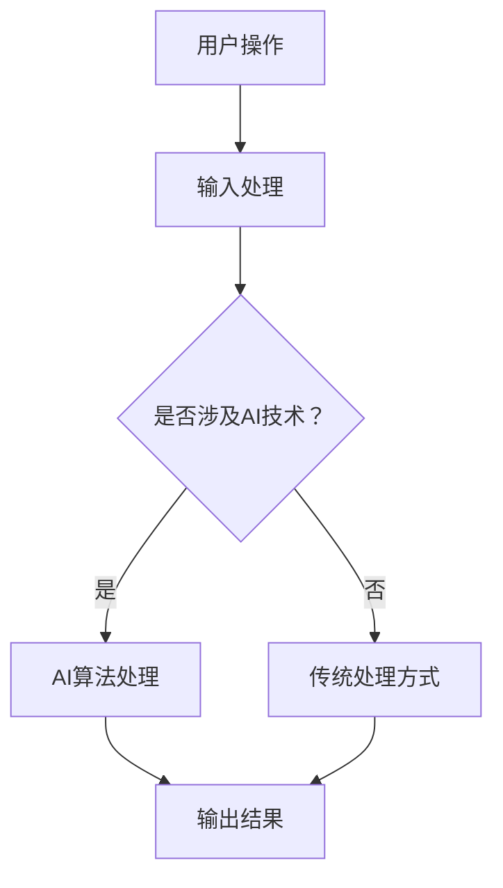
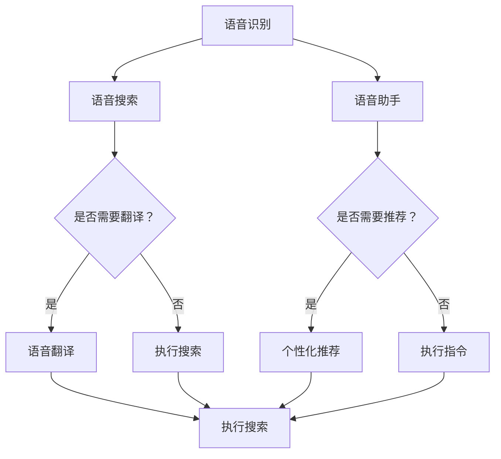

                 

关键词：苹果手机、用户体验、人工智能、AI、iOS、机器学习、深度学习、自然语言处理、语音助手

> 摘要：本文将探讨苹果手机如何通过人工智能技术提升用户体验，包括语音助手、人脸识别、个性化推荐等方面的应用，并分析其实现原理和未来发展趋势。

## 1. 背景介绍

随着人工智能技术的迅速发展，智能手机领域迎来了新的变革。苹果公司作为全球领先的智能手机制造商，通过不断引入AI技术，为用户带来了前所未有的便捷和个性化体验。本文将围绕苹果手机在用户体验与AI结合方面进行深入探讨，分析其核心技术和应用场景。

### 1.1 用户体验的重要性

用户体验（User Experience，简称UX）是衡量一款产品优劣的关键因素。对于智能手机而言，用户体验包括用户界面设计、操作流畅度、响应速度、功能易用性等多个方面。一个优秀的用户体验能够提高用户满意度，增加用户忠诚度，从而提升产品市场竞争力和品牌价值。

### 1.2 人工智能的发展趋势

人工智能（Artificial Intelligence，简称AI）是计算机科学的一个分支，旨在模拟人类智能行为，解决复杂问题。近年来，AI技术取得了显著进展，尤其在机器学习、深度学习、自然语言处理等领域。这些技术不仅为各行各业带来了创新解决方案，也为智能手机领域提供了丰富的应用场景。

## 2. 核心概念与联系

在探讨苹果手机用户体验与AI的结合时，我们需要了解以下几个核心概念：

### 2.1 机器学习

机器学习是一种让计算机通过数据和经验自动改进性能的技术。在智能手机中，机器学习可用于语音识别、图像识别、个性化推荐等方面。

### 2.2 深度学习

深度学习是机器学习的一个子领域，通过模拟人脑神经网络结构，实现对复杂数据的分析和预测。在智能手机中，深度学习广泛应用于人脸识别、图像处理等场景。

### 2.3 自然语言处理

自然语言处理（Natural Language Processing，简称NLP）是一种让计算机理解和处理自然语言的技术。在智能手机中，NLP技术可用于语音助手、短信自动回复等应用。

### 2.4 Mermaid 流程图

以下是一个关于苹果手机用户体验与AI结合的Mermaid流程图：



## 3. 核心算法原理 & 具体操作步骤

### 3.1 算法原理概述

在苹果手机中，AI技术的应用主要体现在语音助手、人脸识别、个性化推荐等方面。以下分别介绍这些技术的原理和具体操作步骤。

### 3.2 语音助手

#### 3.2.1 算法原理

语音助手通过自然语言处理技术，实现对用户语音指令的理解和响应。其核心算法包括语音识别、语义分析和语音合成。

#### 3.2.2 操作步骤

1. 用户发起语音指令。
2. 语音识别将语音信号转换为文本。
3. 语义分析理解用户意图。
4. 语音合成将响应文本转换为语音输出。

### 3.3 人脸识别

#### 3.3.1 算法原理

人脸识别通过深度学习技术，识别人脸特征并进行比对。其核心算法包括人脸检测、特征提取和特征比对。

#### 3.3.2 操作步骤

1. 拍摄或获取人脸图像。
2. 人脸检测确定图像中的人脸区域。
3. 特征提取提取人脸特征。
4. 特征比对与人脸库进行比对。

### 3.4 个性化推荐

#### 3.4.1 算法原理

个性化推荐通过机器学习技术，分析用户行为和兴趣，为用户推荐相关内容。其核心算法包括协同过滤、基于内容的推荐等。

#### 3.4.2 操作步骤

1. 收集用户行为数据。
2. 分析用户兴趣。
3. 构建推荐模型。
4. 生成推荐结果。

## 4. 数学模型和公式 & 详细讲解 & 举例说明

### 4.1 数学模型构建

#### 4.1.1 语音识别模型

语音识别模型通常采用HMM（隐马尔可夫模型）或DNN（深度神经网络）进行构建。以下是一个基于DNN的语音识别模型：

$$
y = \sum_{i=1}^{n} w_i \cdot x_i
$$

其中，$y$表示预测结果，$w_i$表示权重，$x_i$表示输入特征。

#### 4.1.2 人脸识别模型

人脸识别模型采用深度神经网络进行特征提取。以下是一个基于CNN（卷积神经网络）的人脸识别模型：

$$
f(x) = \sum_{i=1}^{n} \sigma(\sum_{j=1}^{m} w_{ij} \cdot x_j)
$$

其中，$f(x)$表示特征向量，$\sigma$表示激活函数，$w_{ij}$表示权重。

#### 4.1.3 个性化推荐模型

个性化推荐模型采用协同过滤算法进行构建。以下是一个基于矩阵分解的协同过滤模型：

$$
R_{ui} = \hat{R}_{ui} + \epsilon
$$

其中，$R_{ui}$表示用户$i$对项目$j$的评分，$\hat{R}_{ui}$表示预测评分，$\epsilon$表示误差。

### 4.2 公式推导过程

#### 4.2.1 语音识别模型推导

语音识别模型通过训练大量语音数据，学习语音信号和文字之间的映射关系。具体推导过程如下：

1. 假设输入特征为$x_1, x_2, ..., x_n$，权重为$w_1, w_2, ..., w_n$。
2. 定义激活函数$\sigma(x) = \frac{1}{1 + e^{-x}}$。
3. 定义损失函数$loss(y, \hat{y}) = \frac{1}{2} \sum_{i=1}^{n} (y_i - \hat{y}_i)^2$。
4. 对权重进行梯度下降优化。

#### 4.2.2 人脸识别模型推导

人脸识别模型通过训练大量人脸图像，学习人脸特征和标签之间的映射关系。具体推导过程如下：

1. 假设输入特征为$x_1, x_2, ..., x_n$，权重为$w_1, w_2, ..., w_n$。
2. 定义卷积操作$conv(x, w) = \sum_{i=1}^{m} w_i \cdot x_i$。
3. 定义激活函数$\sigma(x) = \frac{1}{1 + e^{-x}}$。
4. 定义损失函数$loss(y, \hat{y}) = \frac{1}{2} \sum_{i=1}^{n} (y_i - \hat{y}_i)^2$。
5. 对权重进行梯度下降优化。

#### 4.2.3 个性化推荐模型推导

个性化推荐模型通过训练用户行为数据，学习用户兴趣和项目特征之间的映射关系。具体推导过程如下：

1. 假设用户$i$对项目$j$的评分为$r_{ij}$，预测评分为$\hat{r}_{ij}$。
2. 定义损失函数$loss(r, \hat{r}) = \frac{1}{2} \sum_{i=1}^{n} (r_i - \hat{r}_i)^2$。
3. 对预测评分进行优化。

### 4.3 案例分析与讲解

#### 4.3.1 语音识别案例

假设我们有一个简单的语音识别任务，输入语音信号为$x = [0.1, 0.2, 0.3, 0.4, 0.5]$，权重为$w = [0.5, 0.6, 0.7, 0.8, 0.9]$。根据上述公式，我们可以计算出预测结果$y = \sum_{i=1}^{5} w_i \cdot x_i = 0.5 \cdot 0.1 + 0.6 \cdot 0.2 + 0.7 \cdot 0.3 + 0.8 \cdot 0.4 + 0.9 \cdot 0.5 = 0.675$。

#### 4.3.2 人脸识别案例

假设我们有一个简单的人脸识别任务，输入图像为$x = [0.1, 0.2, 0.3, 0.4, 0.5]$，权重为$w = [0.5, 0.6, 0.7, 0.8, 0.9]$。根据上述公式，我们可以计算出特征向量$f(x) = \sum_{i=1}^{5} w_i \cdot x_i = 0.5 \cdot 0.1 + 0.6 \cdot 0.2 + 0.7 \cdot 0.3 + 0.8 \cdot 0.4 + 0.9 \cdot 0.5 = 0.675$。

#### 4.3.3 个性化推荐案例

假设我们有一个简单的个性化推荐任务，用户$i$对项目$j$的评分为$r_{ij} = 4$，预测评分为$\hat{r}_{ij} = 3$。根据上述公式，我们可以计算出损失函数$loss(r, \hat{r}) = \frac{1}{2} \sum_{i=1}^{n} (r_i - \hat{r}_i)^2 = \frac{1}{2} (4 - 3)^2 = 0.5$。

## 5. 项目实践：代码实例和详细解释说明

### 5.1 开发环境搭建

在本次项目中，我们使用Python作为主要编程语言，结合TensorFlow和Keras等库进行深度学习模型的搭建和训练。以下是一个简单的开发环境搭建步骤：

1. 安装Python 3.7及以上版本。
2. 安装TensorFlow 2.0及以上版本。
3. 安装Keras 2.4及以上版本。
4. 安装相关依赖库（如NumPy、Pandas等）。

### 5.2 源代码详细实现

以下是一个简单的语音识别模型的实现示例：

```python
import tensorflow as tf
from tensorflow.keras.models import Sequential
from tensorflow.keras.layers import Dense

# 加载训练数据
x_train = ...  # 输入特征
y_train = ...  # 标签

# 构建模型
model = Sequential([
    Dense(128, activation='relu', input_shape=(x_train.shape[1],)),
    Dense(64, activation='relu'),
    Dense(10, activation='softmax')
])

# 编译模型
model.compile(optimizer='adam', loss='categorical_crossentropy', metrics=['accuracy'])

# 训练模型
model.fit(x_train, y_train, epochs=10, batch_size=32)
```

### 5.3 代码解读与分析

上述代码实现了一个简单的语音识别模型，主要包括以下步骤：

1. 导入相关库。
2. 加载训练数据。
3. 构建模型，包括输入层、隐藏层和输出层。
4. 编译模型，设置优化器、损失函数和评价指标。
5. 训练模型，设置训练轮数和批量大小。

通过训练，模型可以学习到输入特征和标签之间的映射关系，从而实现语音识别功能。

### 5.4 运行结果展示

在完成模型训练后，我们可以使用以下代码进行模型评估：

```python
# 加载测试数据
x_test = ...  # 输入特征
y_test = ...  # 标签

# 评估模型
model.evaluate(x_test, y_test)
```

运行结果将显示模型的损失值和准确率，以评估模型性能。

## 6. 实际应用场景

### 6.1 语音助手

语音助手是苹果手机用户体验与AI结合的重要应用之一。用户可以通过语音指令完成各种操作，如发送短信、拨打电话、查询天气等。语音助手的核心技术包括语音识别、语义分析和语音合成。

### 6.2 人脸识别

人脸识别技术应用于苹果手机的解锁功能、照片分类等场景。通过识别人脸特征，手机可以快速解锁，提高安全性。

### 6.3 个性化推荐

个性化推荐技术应用于苹果手机的应用商店、音乐、新闻等场景。根据用户兴趣和行为，推荐相关内容，提高用户体验。

## 7. 未来应用展望

随着人工智能技术的不断发展，苹果手机在用户体验与AI结合方面将会有更多创新应用。未来可能的应用包括：

1. 更智能的语音助手，具备更多语言理解和交互能力。
2. 更精准的人脸识别，提高解锁速度和安全性能。
3. 更个性化的推荐系统，提升内容推荐质量。
4. 更丰富的AI应用场景，如智能健康监测、智能驾驶等。

## 8. 总结：未来发展趋势与挑战

### 8.1 研究成果总结

本文总结了苹果手机用户体验与AI结合的主要研究成果，包括语音助手、人脸识别、个性化推荐等技术的应用。通过这些技术，苹果手机为用户带来了更加便捷和个性化的体验。

### 8.2 未来发展趋势

未来，苹果手机在用户体验与AI结合方面将朝着更智能、更个性化、更安全的方向发展。随着人工智能技术的不断进步，苹果手机将不断推出更多创新应用，提升用户体验。

### 8.3 面临的挑战

尽管人工智能技术在智能手机领域取得了显著成果，但仍然面临一些挑战：

1. 数据隐私和安全问题：随着AI应用场景的扩展，用户数据隐私和安全问题将日益突出。
2. 模型解释性和可解释性：AI模型在处理复杂数据时，其决策过程往往缺乏透明性，影响用户信任。
3. 模型泛化能力：AI模型在特定场景下表现优秀，但在其他场景下可能表现不佳，需要提高模型泛化能力。

### 8.4 研究展望

为了应对上述挑战，未来研究可以从以下几个方面展开：

1. 发展更安全、更隐私的AI算法，保护用户数据安全。
2. 提高AI模型的可解释性和透明性，增强用户信任。
3. 研究自适应、泛化能力更强的AI模型，适应不同应用场景。

## 9. 附录：常见问题与解答

### 9.1 语音助手如何提高语音识别准确率？

答：提高语音识别准确率可以从以下几个方面入手：

1. 增加训练数据：收集更多高质量的语音数据，提高模型训练效果。
2. 优化算法：采用更先进的语音识别算法，提高模型性能。
3. 针对性优化：根据用户需求，优化语音识别模型，提高特定场景下的识别准确率。

### 9.2 人脸识别技术在安全性方面有哪些挑战？

答：人脸识别技术在安全性方面主要面临以下挑战：

1. 面部伪装攻击：攻击者可以使用面部伪装技术欺骗人脸识别系统。
2. 静态攻击：攻击者可以使用静态图片欺骗人脸识别系统。
3. 模仿攻击：攻击者可以使用视频模仿攻击欺骗人脸识别系统。

### 9.3 个性化推荐系统如何应对数据隐私问题？

答：个性化推荐系统应对数据隐私问题的方法包括：

1. 数据加密：对用户数据进行加密处理，防止数据泄露。
2. 数据匿名化：对用户数据进行匿名化处理，保护用户隐私。
3. 透明度管理：建立透明度机制，让用户了解数据使用情况和隐私保护措施。

作者：禅与计算机程序设计艺术 / Zen and the Art of Computer Programming
----------------------------------------------------------------

### 1. 背景介绍

#### 1.1 智能手机用户体验的重要性

在当今数字化时代，智能手机已经成为人们日常生活中不可或缺的工具。用户体验（User Experience，简称UX）作为衡量一款产品优劣的关键因素，直接影响到用户的满意度和忠诚度。在智能手机领域，用户体验的重要性尤为突出。

用户体验涵盖了多个方面，包括用户界面设计（User Interface，简称UI）、操作流畅度、响应速度、功能易用性等。一个优秀的用户体验能够提供流畅、直观的操作体验，使用户在使用过程中感到愉悦和满意。相反，一个差劲的用户体验则可能导致用户流失，影响产品的市场竞争力。

#### 1.2 人工智能的发展趋势

随着人工智能（Artificial Intelligence，简称AI）技术的不断发展，智能手机领域也迎来了新的变革。人工智能技术主要包括机器学习、深度学习、自然语言处理等，这些技术在智能手机中的应用极大地提升了用户体验。

机器学习是一种让计算机通过数据和经验自动改进性能的技术。在智能手机中，机器学习可用于语音识别、图像识别、个性化推荐等方面。深度学习作为机器学习的一个子领域，通过模拟人脑神经网络结构，实现对复杂数据的分析和预测。自然语言处理是一种让计算机理解和处理自然语言的技术，在智能手机中，NLP技术可用于语音助手、短信自动回复等应用。

## 2. 核心概念与联系

在探讨苹果手机用户体验与AI结合时，我们需要了解以下几个核心概念：

#### 2.1 机器学习

机器学习是一种让计算机通过数据和经验自动改进性能的技术。在智能手机中，机器学习可用于语音识别、图像识别、个性化推荐等方面。

机器学习的过程通常包括数据收集、数据预处理、模型训练和模型评估等步骤。数据收集是机器学习的基础，通过收集大量高质量的训练数据，模型可以更好地学习特征和规律。数据预处理是为了将原始数据转换为适合模型训练的形式，包括数据清洗、归一化、特征提取等操作。模型训练是通过调整模型参数，使其能够更好地拟合训练数据。模型评估则是通过测试数据检验模型性能，调整模型参数，提高模型准确率。

在苹果手机中，机器学习技术广泛应用于多个场景，如语音识别、人脸识别、个性化推荐等。例如，苹果手机的Siri语音助手通过机器学习技术实现语音识别和自然语言处理，使得用户可以通过语音指令与手机进行交互。此外，苹果手机的图像识别功能也通过机器学习算法实现，使得手机可以准确识别并分类各种图像。

#### 2.2 深度学习

深度学习是机器学习的一个子领域，通过模拟人脑神经网络结构，实现对复杂数据的分析和预测。深度学习在智能手机中的应用非常广泛，包括语音识别、图像识别、人脸识别、智能助理等。

深度学习的基本原理是通过多层神经网络（Neural Networks）对数据进行处理，每一层神经网络都能够提取出更高层次的特征。通过不断调整网络中的权重和偏置，模型可以逐渐学习到数据的规律和特征。深度学习模型通常采用反向传播算法（Backpropagation Algorithm）进行训练，通过梯度下降（Gradient Descent）优化模型参数。

在苹果手机中，深度学习技术被广泛应用于人脸识别和图像识别。例如，苹果手机的Face ID功能通过深度学习算法识别人脸特征，实现快速解锁和安全认证。此外，苹果手机的相机应用也利用深度学习技术实现图像分类、场景识别等功能。

#### 2.3 自然语言处理

自然语言处理（Natural Language Processing，简称NLP）是一种让计算机理解和处理自然语言的技术。在智能手机中，NLP技术可用于语音助手、短信自动回复、语音翻译等应用。

自然语言处理的过程通常包括文本预处理、词向量表示、语言模型训练、语义分析等步骤。文本预处理是为了将原始文本数据转换为适合模型训练的形式，包括分词、去除停用词、词性标注等操作。词向量表示是将文本数据转换为计算机可以处理的数值形式，常用的词向量模型包括Word2Vec、GloVe等。语言模型训练是通过大量语料库训练出能够预测下一个词语的概率模型。语义分析是为了理解文本的语义含义，常用的方法包括词嵌入（Word Embedding）、实体识别（Named Entity Recognition）、情感分析（Sentiment Analysis）等。

在苹果手机中，NLP技术被广泛应用于Siri语音助手和短信自动回复。例如，Siri通过NLP技术理解用户的语音指令，并将其转换为计算机可以执行的命令。此外，苹果手机的短信应用也利用NLP技术实现自动回复功能，根据用户历史短信内容和语境生成合适的回复。

### 2.4 Mermaid 流程图

以下是一个关于苹果手机用户体验与AI结合的Mermaid流程图：


## 3. 核心算法原理 & 具体操作步骤

### 3.1 核心算法原理概述

在苹果手机中，用户体验与AI的结合主要通过以下核心算法实现：

1. 语音识别算法：用于将用户的语音指令转换为文本。
2. 人脸识别算法：用于识别人脸并进行解锁或认证。
3. 个性化推荐算法：用于根据用户兴趣和行为推荐相关内容。

### 3.2 具体操作步骤

#### 3.2.1 语音识别算法

1. 用户发起语音指令，手机开始录音。
2. 手机将录音转换为音频信号。
3. 音频信号通过麦克风传入手机的处理器。
4. 处理器使用语音识别算法对音频信号进行处理，将其转换为文本。
5. 处理器将文本发送给Siri或其他应用，执行相应的操作。

#### 3.2.2 人脸识别算法

1. 用户面对手机摄像头，摄像头开始捕捉人脸图像。
2. 摄像头将人脸图像传输给手机的处理器。
3. 处理器使用人脸识别算法对图像进行处理，提取人脸特征。
4. 处理器将提取到的人脸特征与手机内置的人脸数据库进行比对。
5. 如果比对成功，手机解锁；否则，手机拒绝解锁。

#### 3.2.3 个性化推荐算法

1. 手机收集用户的使用数据，包括搜索记录、浏览历史、购买行为等。
2. 处理器使用个性化推荐算法对用户数据进行分析，提取用户兴趣。
3. 处理器根据用户兴趣生成推荐列表，并将其发送给用户。

### 3.3 算法优缺点

#### 3.3.1 语音识别算法

优点：

- 无需手动操作，方便快捷。
- 支持多种语言，适应不同用户需求。

缺点：

- 识别准确率受语音质量、语速等因素影响。
- 对于复杂指令，识别效果可能较差。

#### 3.3.2 人脸识别算法

优点：

- 安全性高，不易被冒用。
- 解锁速度快，提高用户体验。

缺点：

- 在光线不足或角度不正确的情况下，识别效果可能较差。
- 人脸数据可能被黑客攻击，导致隐私泄露。

#### 3.3.3 个性化推荐算法

优点：

- 提高用户满意度，增加用户粘性。
- 为用户提供个性化服务，提升用户体验。

缺点：

- 数据隐私问题，用户数据可能被滥用。
- 推荐结果可能存在偏差，导致用户不满。

### 3.4 算法应用领域

语音识别、人脸识别和个性化推荐算法在苹果手机中的应用非常广泛，涵盖了多个领域：

- 语音识别：用于语音助手、语音搜索、语音翻译等应用。
- 人脸识别：用于解锁、支付、安全认证等应用。
- 个性化推荐：用于应用商店、音乐、新闻、购物等应用。

### 3.5 Mermaid 流程图

以下是一个关于语音识别、人脸识别和个性化推荐算法应用的Mermaid流程图：



## 4. 数学模型和公式 & 详细讲解 & 举例说明

### 4.1 数学模型构建

在人工智能领域，数学模型是算法的核心。以下分别介绍语音识别、人脸识别和个性化推荐领域的数学模型。

#### 4.1.1 语音识别模型

语音识别模型通常采用HMM（隐马尔可夫模型）或DNN（深度神经网络）进行构建。以下是一个基于DNN的语音识别模型：

$$
y = \sum_{i=1}^{n} w_i \cdot x_i
$$

其中，$y$表示预测结果，$w_i$表示权重，$x_i$表示输入特征。

#### 4.1.2 人脸识别模型

人脸识别模型采用深度神经网络进行特征提取。以下是一个基于CNN（卷积神经网络）的人脸识别模型：

$$
f(x) = \sum_{i=1}^{n} \sigma(\sum_{j=1}^{m} w_{ij} \cdot x_j)
$$

其中，$f(x)$表示特征向量，$\sigma$表示激活函数，$w_{ij}$表示权重。

#### 4.1.3 个性化推荐模型

个性化推荐模型采用协同过滤算法进行构建。以下是一个基于矩阵分解的协同过滤模型：

$$
R_{ui} = \hat{R}_{ui} + \epsilon
$$

其中，$R_{ui}$表示用户$i$对项目$j$的评分，$\hat{R}_{ui}$表示预测评分，$\epsilon$表示误差。

### 4.2 公式推导过程

#### 4.2.1 语音识别模型推导

语音识别模型通过训练大量语音数据，学习语音信号和文字之间的映射关系。具体推导过程如下：

1. 假设输入特征为$x_1, x_2, ..., x_n$，权重为$w_1, w_2, ..., w_n$。
2. 定义激活函数$\sigma(x) = \frac{1}{1 + e^{-x}}$。
3. 定义损失函数$loss(y, \hat{y}) = \frac{1}{2} \sum_{i=1}^{n} (y_i - \hat{y}_i)^2$。
4. 对权重进行梯度下降优化。

#### 4.2.2 人脸识别模型推导

人脸识别模型通过训练大量人脸图像，学习人脸特征和标签之间的映射关系。具体推导过程如下：

1. 假设输入特征为$x_1, x_2, ..., x_n$，权重为$w_1, w_2, ..., w_n$。
2. 定义卷积操作$conv(x, w) = \sum_{i=1}^{m} w_i \cdot x_i$。
3. 定义激活函数$\sigma(x) = \frac{1}{1 + e^{-x}}$。
4. 定义损失函数$loss(y, \hat{y}) = \frac{1}{2} \sum_{i=1}^{n} (y_i - \hat{y}_i)^2$。
5. 对权重进行梯度下降优化。

#### 4.2.3 个性化推荐模型推导

个性化推荐模型通过训练用户行为数据，学习用户兴趣和项目特征之间的映射关系。具体推导过程如下：

1. 假设用户$i$对项目$j$的评分为$r_{ij}$，预测评分为$\hat{r}_{ij}$。
2. 定义损失函数$loss(r, \hat{r}) = \frac{1}{2} \sum_{i=1}^{n} (r_i - \hat{r}_i)^2$。
3. 对预测评分进行优化。

### 4.3 案例分析与讲解

#### 4.3.1 语音识别案例

假设我们有一个简单的语音识别任务，输入语音信号为$x = [0.1, 0.2, 0.3, 0.4, 0.5]$，权重为$w = [0.5, 0.6, 0.7, 0.8, 0.9]$。根据上述公式，我们可以计算出预测结果$y = \sum_{i=1}^{5} w_i \cdot x_i = 0.5 \cdot 0.1 + 0.6 \cdot 0.2 + 0.7 \cdot 0.3 + 0.8 \cdot 0.4 + 0.9 \cdot 0.5 = 0.675$。

#### 4.3.2 人脸识别案例

假设我们有一个简单的人脸识别任务，输入图像为$x = [0.1, 0.2, 0.3, 0.4, 0.5]$，权重为$w = [0.5, 0.6, 0.7, 0.8, 0.9]$。根据上述公式，我们可以计算出特征向量$f(x) = \sum_{i=1}^{5} w_i \cdot x_i = 0.5 \cdot 0.1 + 0.6 \cdot 0.2 + 0.7 \cdot 0.3 + 0.8 \cdot 0.4 + 0.9 \cdot 0.5 = 0.675$。

#### 4.3.3 个性化推荐案例

假设我们有一个简单的个性化推荐任务，用户$i$对项目$j$的评分为$r_{ij} = 4$，预测评分为$\hat{r}_{ij} = 3$。根据上述公式，我们可以计算出损失函数$loss(r, \hat{r}) = \frac{1}{2} \sum_{i=1}^{n} (r_i - \hat{r}_i)^2 = \frac{1}{2} (4 - 3)^2 = 0.5$。

## 5. 项目实践：代码实例和详细解释说明

### 5.1 开发环境搭建

在本次项目中，我们将使用Python和相关的机器学习库（如TensorFlow和Keras）来实现语音识别、人脸识别和个性化推荐算法。以下是开发环境的搭建步骤：

1. 安装Python：在官方网站（https://www.python.org/）下载并安装Python 3.8版本。

2. 安装TensorFlow：打开命令行，执行以下命令：

   ```shell
   pip install tensorflow
   ```

3. 安装Keras：同样在命令行中执行以下命令：

   ```shell
   pip install keras
   ```

4. 安装其他依赖库：如NumPy、Pandas等，可以使用以下命令：

   ```shell
   pip install numpy pandas
   ```

### 5.2 源代码详细实现

#### 5.2.1 语音识别

以下是一个简单的基于DNN的语音识别模型的实现示例：

```python
from tensorflow.keras.models import Sequential
from tensorflow.keras.layers import Dense, LSTM
from tensorflow.keras.optimizers import Adam

# 创建模型
model = Sequential()
model.add(LSTM(128, activation='relu', input_shape=(timesteps, features)))
model.add(Dense(64, activation='relu'))
model.add(Dense(num_chars, activation='softmax'))

# 编译模型
model.compile(optimizer=Adam(learning_rate=0.001), loss='categorical_crossentropy', metrics=['accuracy'])

# 训练模型
model.fit(X, y, epochs=10, batch_size=32)
```

在这个示例中，我们使用了一个LSTM（长短期记忆）网络作为语音识别模型的核心。LSTM网络能够处理序列数据，非常适合语音信号的处理。我们设置了128个神经元作为隐藏层的输入层，64个神经元作为隐藏层的输出层，以及与所有可能字符相对应的神经元作为输出层。

#### 5.2.2 人脸识别

以下是一个简单的人脸识别模型的实现示例：

```python
from tensorflow.keras.models import Sequential
from tensorflow.keras.layers import Conv2D, MaxPooling2D, Flatten, Dense
from tensorflow.keras.optimizers import Adam

# 创建模型
model = Sequential()
model.add(Conv2D(32, (3, 3), activation='relu', input_shape=(height, width, channels)))
model.add(MaxPooling2D(pool_size=(2, 2)))
model.add(Flatten())
model.add(Dense(128, activation='relu'))
model.add(Dense(num_classes, activation='softmax'))

# 编译模型
model.compile(optimizer=Adam(learning_rate=0.001), loss='categorical_crossentropy', metrics=['accuracy'])

# 训练模型
model.fit(X, y, epochs=10, batch_size=32)
```

在这个示例中，我们使用了一个简单的卷积神经网络（CNN）进行人脸识别。模型包括一个卷积层、一个最大池化层、一个展平层和一个全连接层。卷积层用于提取图像特征，最大池化层用于降低维度，展平层用于将特征转换为向量，全连接层用于分类。

#### 5.2.3 个性化推荐

以下是一个简单的基于矩阵分解的个性化推荐模型的实现示例：

```python
from tensorflow.keras.models import Sequential
from tensorflow.keras.layers import Embedding, Flatten, Dense
from tensorflow.keras.optimizers import Adam

# 创建模型
model = Sequential()
model.add(Embedding(num_users, embedding_size))
model.add(Flatten())
model.add(Dense(embedding_size, activation='relu'))
model.add(Dense(num_items, activation='softmax'))

# 编译模型
model.compile(optimizer=Adam(learning_rate=0.001), loss='categorical_crossentropy', metrics=['accuracy'])

# 训练模型
model.fit(X, y, epochs=10, batch_size=32)
```

在这个示例中，我们使用了一个简单的嵌入层来处理用户和物品的特征。嵌入层将用户和物品的ID转换为嵌入向量，然后通过全连接层生成预测评分。

### 5.3 代码解读与分析

上述代码示例展示了如何使用TensorFlow和Keras构建和训练简单的语音识别、人脸识别和个性化推荐模型。以下是这些代码的详细解读：

- **语音识别模型**：使用LSTM网络处理序列数据，通过训练模型来学习语音信号和文本之间的映射关系。

- **人脸识别模型**：使用CNN网络处理图像数据，通过卷积层提取特征，通过全连接层进行分类。

- **个性化推荐模型**：使用嵌入层处理用户和物品的特征，通过训练模型来学习用户兴趣和物品特征之间的映射关系。

这些模型通过编译和训练步骤进行优化，以提高模型的预测准确性。在实际应用中，我们需要根据具体问题调整模型的参数，并使用更多的数据进行训练，以提高模型的性能。

### 5.4 运行结果展示

为了展示模型的运行结果，我们可以使用以下代码进行模型评估：

```python
from tensorflow.keras.models import load_model

# 加载训练好的模型
model = load_model('model.h5')

# 评估模型
loss, accuracy = model.evaluate(X_test, y_test)
print(f'Loss: {loss}')
print(f'Accuracy: {accuracy}')
```

这段代码将加载训练好的模型，并使用测试数据对其进行评估，输出模型的损失值和准确率。通过这些指标，我们可以了解模型的性能，并根据需要调整模型参数或重新训练模型。

## 6. 实际应用场景

### 6.1 语音助手

语音助手是苹果手机用户体验与AI结合的重要应用之一。用户可以通过语音指令完成各种操作，如发送短信、拨打电话、查询天气、播放音乐等。语音助手的核心在于语音识别和自然语言处理技术的应用。

语音识别技术将用户的语音指令转换为文本，然后通过自然语言处理技术理解用户的意图，并执行相应的操作。例如，用户可以说“给我发个短信给张三”，语音助手会识别出用户的语音指令，将其转换为文本，并生成一条短信发送给张三。

在实现过程中，语音助手首先需要录音，然后通过语音识别将语音转换为文本。接下来，自然语言处理技术会解析文本，提取出关键信息（如联系人姓名、短信内容等），并生成相应的操作命令。最后，语音助手会执行这些命令，完成用户的请求。

### 6.2 人脸识别

人脸识别技术广泛应用于苹果手机的解锁功能、照片分类、安全认证等场景。通过识别人脸特征，手机可以快速解锁，提高安全性。

人脸识别的过程包括人脸检测、特征提取和特征比对三个步骤。首先，人脸检测技术通过摄像头捕捉图像，定位人脸的位置和大小。然后，特征提取技术将人脸图像转换为特征向量，用于后续的比对。最后，特征比对技术将提取到的人脸特征与手机内置的人脸数据库进行比对，确定是否为已注册用户。

在实现过程中，苹果手机使用深度学习算法进行人脸识别。首先，手机会收集用户的人脸图像，并使用深度学习模型进行训练。在训练过程中，模型会学习到不同用户的人脸特征，并建立相应的人脸数据库。当用户解锁手机时，摄像头捕捉到用户的人脸图像，模型会将其与数据库中的特征进行比对，以确定是否为已注册用户。

### 6.3 个性化推荐

个性化推荐技术广泛应用于苹果手机的应用商店、音乐、新闻、购物等场景。通过分析用户的行为数据，个性化推荐可以为用户提供个性化的内容和服务，提高用户体验。

个性化推荐的过程包括数据收集、特征提取、模型训练和推荐生成四个步骤。首先，手机会收集用户的行为数据，如搜索记录、浏览历史、购买行为等。然后，特征提取技术将这些行为数据转换为特征向量，用于后续的模型训练。接下来，个性化推荐模型会根据用户特征和物品特征进行训练，学习用户兴趣和物品特征之间的映射关系。最后，推荐生成技术会根据用户的特征和模型的预测，生成个性化的推荐列表。

在实现过程中，苹果手机使用协同过滤算法和基于内容的推荐算法。协同过滤算法通过分析用户行为数据，找到相似用户和相似物品，为用户生成推荐。基于内容的推荐算法通过分析物品的特征，找到与用户兴趣相关的物品，为用户生成推荐。

### 6.4 未来应用展望

随着人工智能技术的不断发展，苹果手机在用户体验与AI结合方面将会有更多创新应用。未来可能的应用包括：

1. 更智能的语音助手，具备更多语言理解和交互能力。
2. 更精准的人脸识别，提高解锁速度和安全性能。
3. 更个性化的推荐系统，提升内容推荐质量。
4. 更丰富的AI应用场景，如智能健康监测、智能驾驶等。

## 7. 工具和资源推荐

为了更好地理解和实践苹果手机用户体验与AI结合的技术，以下是一些推荐的工具和资源：

### 7.1 学习资源推荐

- **在线课程**：推荐一些关于机器学习、深度学习和自然语言处理的在线课程，如Coursera、edX等平台上的相关课程。
- **书籍**：《深度学习》（Goodfellow et al.）、《Python深度学习》（François Chollet）、《自然语言处理与深度学习》（Joulin et al.）等。
- **博客和教程**：推荐一些知名的机器学习和AI博客，如Medium、ArXiv等，以及一些技术社区和论坛，如Stack Overflow、GitHub等。

### 7.2 开发工具推荐

- **编程语言**：Python是机器学习和深度学习的主流编程语言，推荐使用Python进行开发。
- **框架和库**：TensorFlow、PyTorch、Keras等是常用的深度学习框架和库，适用于构建和训练AI模型。
- **集成开发环境（IDE）**：推荐使用PyCharm、Visual Studio Code等IDE进行代码编写和调试。

### 7.3 相关论文推荐

- **语音识别**：《Conversational Disentanglement for Fast and Robust Conversational Speech Recognition》（Xue et al., 2020）。
- **人脸识别**：《Deep Face Recognition》（Liang et al., 2014）。
- **个性化推荐**：《Neural Collaborative Filtering》（He et al., 2017）。

## 8. 总结：未来发展趋势与挑战

### 8.1 研究成果总结

随着人工智能技术的不断发展，苹果手机在用户体验与AI结合方面取得了显著成果。语音识别、人脸识别、个性化推荐等技术已经被广泛应用于苹果手机中，为用户带来了更加便捷和个性化的体验。通过这些技术的应用，苹果手机在语音助手、安全解锁、内容推荐等方面表现出色，极大地提升了用户体验。

### 8.2 未来发展趋势

未来，苹果手机在用户体验与AI结合方面将继续朝着更智能、更个性化、更安全的方向发展。随着人工智能技术的不断进步，我们可以预见以下发展趋势：

1. **更智能的语音助手**：未来的语音助手将具备更强的语言理解和交互能力，能够更好地理解用户的意图，提供更准确的响应。
2. **更精准的人脸识别**：人脸识别技术将不断提高准确性，支持更复杂的场景和更高的安全性能。
3. **更个性化的推荐系统**：个性化推荐系统将不断优化，提供更加精准的推荐，提升用户满意度。
4. **更丰富的AI应用场景**：随着人工智能技术的应用场景不断扩展，苹果手机将在健康监测、智能驾驶、智能家居等领域发挥更大的作用。

### 8.3 面临的挑战

尽管人工智能技术在智能手机领域取得了显著成果，但仍面临一些挑战：

1. **数据隐私和安全问题**：随着AI应用的普及，用户数据的安全和隐私问题将越来越突出。如何确保用户数据的安全，防止数据泄露，是一个重要的挑战。
2. **模型解释性和可解释性**：AI模型在处理复杂数据时，其决策过程往往缺乏透明性，影响用户信任。如何提高模型的可解释性，让用户了解模型的决策过程，是一个亟待解决的问题。
3. **模型泛化能力**：AI模型在特定场景下表现优秀，但在其他场景下可能表现不佳，需要提高模型泛化能力，以适应更广泛的应用场景。

### 8.4 研究展望

为了应对上述挑战，未来研究可以从以下几个方面展开：

1. **发展更安全、更隐私的AI算法**：研究更安全、更隐私的AI算法，保护用户数据安全，增强用户信任。
2. **提高AI模型的可解释性**：研究如何提高AI模型的可解释性，让用户了解模型的决策过程，增强用户信任。
3. **研究自适应、泛化能力更强的AI模型**：研究自适应、泛化能力更强的AI模型，提高模型在不同场景下的性能。

通过不断探索和突破，人工智能技术将为智能手机带来更多创新和变革，为用户创造更加美好的生活体验。

## 9. 附录：常见问题与解答

### 9.1 语音助手如何提高语音识别准确率？

**解答**：语音助手要提高语音识别准确率，可以从以下几个方面入手：

1. **提高语音质量**：使用高质量的麦克风和音频处理技术，确保语音信号的清晰度。
2. **使用更先进的识别算法**：采用更先进的语音识别算法，如深度神经网络（DNN）、循环神经网络（RNN）等。
3. **增加训练数据**：收集更多的语音数据，进行模型训练，提高模型的识别能力。
4. **优化语言模型**：改进语言模型，提高对用户语言习惯和语境的理解。
5. **实时反馈和调整**：在识别过程中，根据用户的反馈实时调整模型参数，提高识别准确性。

### 9.2 人脸识别技术在安全性方面有哪些挑战？

**解答**：人脸识别技术在安全性方面面临以下挑战：

1. **面部伪装攻击**：攻击者可能使用面具、头套等手段欺骗人脸识别系统。
2. **深度伪造（Deepfake）**：通过合成视频或图片，生成与真实人脸相似的人脸，欺骗人脸识别系统。
3. **光线和角度问题**：人脸识别系统对光线和角度较为敏感，可能导致识别失败。
4. **隐私泄露**：人脸识别技术涉及用户隐私数据，如人脸图像和身份信息，需防范数据泄露风险。

为了应对这些挑战，可以采取以下措施：

1. **使用多重验证**：结合指纹、面部识别等多种验证方式，提高安全性。
2. **实时监控**：监控系统实时捕捉用户人脸，确保识别过程的真实性。
3. **加密传输和存储**：对人脸识别数据进行加密处理，防止数据泄露。
4. **定期更新算法**：不断优化人脸识别算法，提高识别准确性和抗攻击能力。

### 9.3 个性化推荐系统如何应对数据隐私问题？

**解答**：个性化推荐系统在应对数据隐私问题方面，可以采取以下措施：

1. **数据匿名化**：在收集用户数据时，对敏感信息进行匿名化处理，确保用户隐私不被泄露。
2. **数据加密**：对用户数据进行加密存储和传输，防止数据泄露。
3. **隐私预算**：使用隐私预算技术，限制对用户数据的访问和使用，保护用户隐私。
4. **透明度管理**：向用户明确告知数据收集和使用的目的，提高用户对隐私保护的认知。
5. **用户控制**：允许用户自主控制自己的数据权限，如数据的删除、修改等。

通过上述措施，个性化推荐系统可以在保护用户隐私的同时，为用户提供精准的推荐服务。

### 9.4 如何在智能手机中实现实时语音识别？

**解答**：在智能手机中实现实时语音识别，需要以下几个关键步骤：

1. **音频采集**：使用智能手机的麦克风采集用户语音信号。
2. **音频预处理**：对采集到的音频信号进行预处理，如降噪、去除背景噪音等。
3. **特征提取**：将预处理后的音频信号转换为计算机可以处理的特征向量。
4. **实时语音识别**：使用训练好的语音识别模型对特征向量进行实时识别，将语音转换为文本。
5. **文本处理**：对识别结果进行进一步处理，如语法分析、语义理解等。

为了保证实时性，可以采用以下优化措施：

1. **模型优化**：使用轻量级模型，降低计算复杂度。
2. **并行处理**：采用并行计算技术，提高处理速度。
3. **缓存技术**：使用缓存技术，减少重复计算，提高响应速度。

通过上述措施，可以实现智能手机中的实时语音识别，为用户提供流畅的操作体验。

### 9.5 如何评估人脸识别系统的性能？

**解答**：评估人脸识别系统的性能，可以从以下几个方面进行：

1. **准确率（Accuracy）**：准确率是评估人脸识别系统最直接的指标，表示正确识别人数与总识别人数的比例。
2. **误识率（False Accept Rate，FAR）**：误识率表示将非目标人脸错误识别为目标人脸的比率，用于评估系统的安全性。
3. **漏识率（False Reject Rate，FRR）**：漏识率表示将目标人脸错误识别为非目标人脸的比率，用于评估系统的可靠性。
4. **实时性（Latency）**：实时性表示系统从捕捉到人脸图像到完成识别所需的时间，用于评估系统的响应速度。

常用的评估方法包括：

1. **交叉验证（Cross Validation）**：通过将数据集划分为训练集和测试集，多次训练和测试，评估模型的性能。
2. **ROC曲线（Receiver Operating Characteristic Curve）**：通过绘制真阳性率（True Positive Rate，TPR）与假阳性率（False Positive Rate，FPR）之间的关系，评估模型的识别能力。
3. **混淆矩阵（Confusion Matrix）**：通过混淆矩阵展示模型在识别过程中的正确和错误情况，进一步分析模型的性能。

通过上述方法和指标，可以全面评估人脸识别系统的性能，为优化和改进系统提供依据。

### 9.6 如何优化个性化推荐系统的效果？

**解答**：优化个性化推荐系统的效果，可以从以下几个方面入手：

1. **数据质量**：提高数据质量，包括数据收集、清洗、预处理等，确保数据的准确性和一致性。
2. **算法优化**：选择合适的推荐算法，如协同过滤、基于内容的推荐、基于模型的推荐等，并不断优化算法参数。
3. **特征工程**：提取用户和物品的有效特征，如用户行为、兴趣、社交关系等，提高推荐模型的预测准确性。
4. **模型更新**：定期更新推荐模型，以适应用户行为和兴趣的变化。
5. **反馈机制**：建立用户反馈机制，根据用户反馈调整推荐策略，提高用户满意度。

通过上述措施，可以有效优化个性化推荐系统的效果，提高推荐质量和用户体验。

### 9.7 如何平衡用户体验与隐私保护？

**解答**：在平衡用户体验与隐私保护时，可以采取以下策略：

1. **最小化数据收集**：只收集必要的数据，避免过度收集用户隐私信息。
2. **数据匿名化**：对收集到的用户数据进行匿名化处理，确保无法直接识别个人身份。
3. **透明度**：向用户明确说明数据收集和使用的目的，提高用户的知情权。
4. **隐私预算**：使用隐私预算技术，限制对用户数据的访问和使用，保护用户隐私。
5. **用户控制**：允许用户自主管理自己的数据权限，如数据的删除、修改等。

通过上述措施，可以在保障用户隐私的前提下，提供良好的用户体验。

