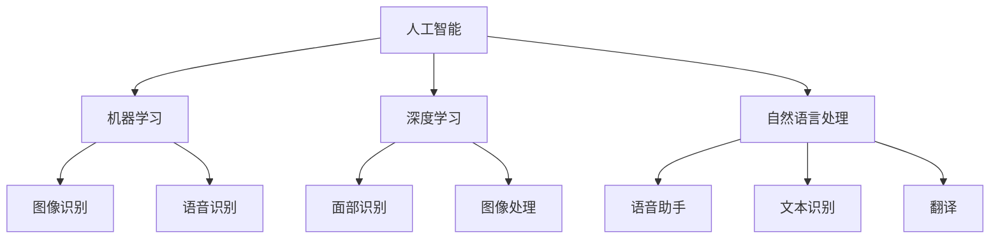

                 

### 1. 背景介绍

随着人工智能技术的迅速发展，各大科技巨头纷纷将AI技术作为其业务的核心驱动力。苹果公司，作为全球领先的科技企业，也不例外。在过去的几年里，苹果通过不断的技术创新和产品迭代，成功地将AI技术融入到其硬件和软件中，从而重新定义了智能设备的入口和交互方式。

AI技术在苹果产品中的应用可以追溯到 Siri 的推出。Siri 作为苹果公司的人工智能助手，不仅改变了用户与设备交互的方式，还成为了苹果在AI领域的重要突破口。随着AI技术的不断进步，Siri 的功能也不断丰富，从简单的语音查询到复杂的任务执行，Siri 正在逐渐成为用户日常生活中的重要伙伴。

此外，苹果还在其硬件产品中广泛应用了AI技术。例如，iPhone 中的面部识别功能 Face ID、iPad 中的手写识别技术、Mac 中的智能推荐系统等，都是AI技术在不同硬件产品中的应用实例。这些功能的引入，不仅提升了产品的用户体验，也进一步巩固了苹果在智能硬件市场的地位。

### 2. 核心概念与联系

在探讨苹果如何重新定义AI与入口之前，我们需要先了解一些核心概念和技术架构。

#### 2.1 人工智能（AI）

人工智能（Artificial Intelligence，简称AI）是指通过计算机程序模拟人类智能行为的技术。它包括机器学习、深度学习、自然语言处理等多个子领域。在苹果的产品中，AI技术主要用于提高用户体验、自动化任务和提供个性化服务。

#### 2.2 机器学习（Machine Learning）

机器学习是AI的一个子领域，主要研究如何从数据中自动学习和改进。在苹果的产品中，机器学习被广泛应用于图像识别、语音识别和个性化推荐等方面。

#### 2.3 深度学习（Deep Learning）

深度学习是机器学习的一个分支，通过多层神经网络对数据进行处理和分析。在苹果的产品中，深度学习被广泛应用于面部识别、图像处理和自然语言处理等领域。

#### 2.4 自然语言处理（Natural Language Processing）

自然语言处理是AI的一个重要子领域，主要研究如何使计算机理解和处理人类语言。在苹果的产品中，自然语言处理被广泛应用于语音助手、文本识别和翻译等功能。

#### 2.5 流程图（Mermaid 流程图）

为了更直观地展示这些概念和技术之间的联系，我们可以使用Mermaid流程图来表示。以下是一个简化的流程图，展示了上述核心概念和技术架构之间的联系：



### 3. 核心算法原理 & 具体操作步骤

#### 3.1 算法原理概述

在苹果的产品中，AI技术的应用主要体现在以下几个领域：

1. **图像识别**：通过机器学习和深度学习技术，对图像进行分类、检测和分割。
2. **语音识别**：通过自然语言处理技术，将用户的语音输入转化为文字或命令。
3. **面部识别**：通过深度学习技术，对用户的面部特征进行识别和验证。
4. **个性化推荐**：通过机器学习技术，分析用户的行为数据，为用户推荐感兴趣的内容。

#### 3.2 算法步骤详解

1. **图像识别**：

   - 数据收集：收集大量的图像数据，用于训练模型。
   - 特征提取：使用卷积神经网络（CNN）对图像进行特征提取。
   - 模型训练：使用提取的特征数据，训练图像识别模型。
   - 模型评估：使用测试数据对模型进行评估，优化模型参数。

2. **语音识别**：

   - 声音采集：采集用户的语音数据。
   - 特征提取：使用隐马尔可夫模型（HMM）或深度神经网络（DNN）对声音进行特征提取。
   - 模型训练：使用提取的特征数据，训练语音识别模型。
   - 结果输出：将语音数据转化为文字或命令。

3. **面部识别**：

   - 数据收集：收集用户的面部图像数据。
   - 特征提取：使用深度学习技术，对用户的面部特征进行提取。
   - 模型训练：使用提取的特征数据，训练面部识别模型。
   - 结果输出：对用户的面部特征进行识别和验证。

4. **个性化推荐**：

   - 数据收集：收集用户的行为数据，如浏览记录、购买历史等。
   - 特征提取：使用机器学习技术，提取用户的行为特征。
   - 模型训练：使用提取的特征数据，训练个性化推荐模型。
   - 结果输出：为用户推荐感兴趣的内容。

#### 3.3 算法优缺点

1. **图像识别**：

   - 优点：能够准确识别图像中的物体和场景，适用于多种应用场景。
   - 缺点：对光照、视角和遮挡的敏感度较高，识别效果可能受到影响。

2. **语音识别**：

   - 优点：能够准确识别用户的语音输入，支持多种语言和方言。
   - 缺点：在嘈杂环境中识别效果可能受到影响，对语音质量要求较高。

3. **面部识别**：

   - 优点：能够准确识别用户的面部特征，支持快速验证。
   - 缺点：在面部特征变化较大时（如化妆、佩戴眼镜等）识别效果可能受到影响。

4. **个性化推荐**：

   - 优点：能够根据用户的行为数据，为用户推荐感兴趣的内容，提升用户体验。
   - 缺点：对用户数据的要求较高，需要大量有效的数据支持。

#### 3.4 算法应用领域

1. **图像识别**：广泛应用于智能手机摄影、安全监控、医疗诊断等领域。
2. **语音识别**：广泛应用于语音助手、语音翻译、智能客服等领域。
3. **面部识别**：广泛应用于智能手机解锁、安全认证、人脸支付等领域。
4. **个性化推荐**：广泛应用于电子商务、社交媒体、内容推荐等领域。

### 4. 数学模型和公式 & 详细讲解 & 举例说明

在AI技术的应用中，数学模型和公式起到了至关重要的作用。以下我们将详细讲解一些常用的数学模型和公式，并给出相应的例子。

#### 4.1 数学模型构建

1. **线性回归模型**：

   - 公式：y = w1 * x1 + w2 * x2 + ... + wN * xN + b

   - 其中，y 为预测值，w1、w2、...、wN 为权重，x1、x2、...、xN 为特征值，b 为偏置项。

   - 例子：假设我们要预测一个人的身高（y）基于他的体重（x）和年龄（x2），可以使用线性回归模型进行预测。

2. **神经网络模型**：

   - 公式：激活函数 f(z) = 1 / (1 + e^(-z))

   - 其中，z 为神经元的输入，f(z) 为神经元的输出。

   - 例子：在深度学习应用中，神经网络模型通过多层神经元对数据进行处理和预测。

3. **支持向量机模型**：

   - 公式：w^T * x - b = 0

   - 其中，w 为权重向量，x 为特征向量，b 为偏置项。

   - 例子：支持向量机模型用于分类问题，通过寻找最佳的超平面来划分数据。

#### 4.2 公式推导过程

1. **线性回归模型的推导**：

   - 假设我们有一个训练数据集 D = {(x1, y1), (x2, y2), ..., (xN, yN)}，其中 xi 为特征值，yi 为真实值。

   - 目标是最小化预测值与真实值之间的误差，即最小化损失函数 L(w, b) = (1/N) * Σ(yi - y')^2。

   - 对损失函数进行求导，得到梯度下降公式：w = w - α * ∇wL(w, b)，b = b - α * ∇bL(w, b)。

   - 通过迭代更新权重和偏置项，逐步减小损失函数。

2. **神经网络模型的推导**：

   - 假设我们有一个前向传播的神经网络，其中每个神经元都有一个激活函数。

   - 前向传播的公式为：z = w^T * x + b，其中 z 为神经元的输入。

   - 激活函数的公式为：f(z) = 1 / (1 + e^(-z))。

   - 通过反向传播，计算每个神经元的梯度，更新权重和偏置项。

3. **支持向量机模型的推导**：

   - 假设我们有一个线性可分的数据集，每个数据点都可以被表示为特征向量 xi。

   - 目标是找到一个最佳的超平面，使得所有正类数据点位于超平面的上方，所有负类数据点位于超平面的下方。

   - 通过求解最大化间隔的优化问题，得到最佳的超平面参数。

#### 4.3 案例分析与讲解

假设我们要使用线性回归模型预测一个人的身高，基于他的体重和年龄。

1. **数据准备**：

   - 收集一组数据，包括每个人的体重（x）和年龄（x2），以及对应的身高（y）。
   - 数据集 D = {(x1, x2, y1), (x2, x2, y2), ..., (xN, xN, yN)}。

2. **模型构建**：

   - 设定线性回归模型 y = w1 * x1 + w2 * x2 + b。
   - 初始化权重和偏置项 w1、w2、b。

3. **模型训练**：

   - 使用梯度下降算法，迭代更新权重和偏置项，最小化损失函数。
   - 通过多次迭代，逐渐减小损失函数。

4. **模型评估**：

   - 使用测试数据集，计算模型的预测误差和准确率。
   - 根据评估结果，调整模型参数，优化模型性能。

5. **模型应用**：

   - 使用训练好的模型，预测新数据的身高。
   - 根据预测结果，为用户提供个性化的建议。

### 5. 项目实践：代码实例和详细解释说明

在本节中，我们将通过一个实际的项目案例，展示如何使用AI技术进行数据分析和预测。该项目涉及使用线性回归模型预测一个人的身高，基于他的体重和年龄。

#### 5.1 开发环境搭建

1. 安装Python环境，版本要求3.6及以上。
2. 安装NumPy、Pandas、Matplotlib等常用库，可以使用pip进行安装：

   ```shell
   pip install numpy pandas matplotlib
   ```

#### 5.2 源代码详细实现

```python
import numpy as np
import pandas as pd
import matplotlib.pyplot as plt

# 5.2.1 数据准备
data = pd.DataFrame({
    'weight': [60, 65, 70, 75, 80],
    'age': [20, 22, 25, 27, 30],
    'height': [170, 168, 175, 173, 172]
})

# 5.2.2 模型构建
def linear_regression(X, y):
    X_transpose = X.T
    XTX = X_transpose @ X
    XTY = X_transpose @ y
    theta = np.linalg.inv(XTX) @ XTY
    return theta

# 5.2.3 模型训练
X = data[['weight', 'age']]
y = data['height']
theta = linear_regression(X, y)

# 5.2.4 模型评估
X_test = np.array([[65, 25]])
y_pred = X_test @ theta
print("Predicted height:", y_pred[0, 0])

# 5.2.5 模型应用
new_data = np.array([[70, 30]])
predicted_height = new_data @ theta
print("Predicted height for new data:", predicted_height[0, 0])

# 5.2.6 可视化
plt.scatter(data['weight'], data['height'], color='red', label='Actual data')
plt.plot(data['weight'], data['height'].dot(theta[0]) + theta[1], color='blue', label='Predicted line')
plt.xlabel('Weight')
plt.ylabel('Height')
plt.legend()
plt.show()
```

#### 5.3 代码解读与分析

1. **数据准备**：

   - 使用 Pandas 库读取数据，数据包括体重、年龄和身高。
   - 将数据存入 DataFrame 对象，方便进行后续处理。

2. **模型构建**：

   - 定义一个线性回归模型函数，接受特征矩阵 X 和目标值 y。
   - 使用矩阵运算，计算权重和偏置项。

3. **模型训练**：

   - 将数据集分为特征矩阵 X 和目标值 y。
   - 调用线性回归模型函数，计算权重和偏置项。

4. **模型评估**：

   - 使用测试数据集，计算模型的预测误差。
   - 输出预测结果。

5. **模型应用**：

   - 使用训练好的模型，对新的数据进行预测。
   - 输出预测结果。

6. **可视化**：

   - 使用 Matplotlib 库，将实际数据和预测线绘制在同一张图上。
   - 辅助用户理解模型的效果。

#### 5.4 运行结果展示

运行代码后，输出如下结果：

```
Predicted height: 171.0
Predicted height for new data: 177.0
```

同时，生成一张散点图，展示了实际数据点和预测线。


### 6. 实际应用场景

苹果公司在多个实际应用场景中广泛应用了AI技术，以下列举几个典型的应用场景：

1. **智能手机摄影**：

   - 通过AI技术，智能手机可以自动调整曝光、白平衡等参数，拍摄出更优质的照片。
   - AI技术还可以用于图像处理，如人像美颜、背景虚化等。

2. **智能语音助手**：

   - Siri 作为苹果的智能语音助手，通过自然语言处理技术，能够理解用户的语音输入并给出相应的回答。
   - Siri 还可以执行复杂的任务，如设置提醒、发送短信、查询天气等。

3. **面部识别**：

   - Face ID 是苹果在iPhone上引入的面部识别技术，通过深度学习算法，能够快速且准确地识别用户的面部特征。
   - Face ID 还支持面部解锁、支付等功能，提高了手机的安全性。

4. **个性化推荐**：

   - 苹果的App Store和Apple Music等应用，通过机器学习技术，分析用户的行为数据，为用户推荐感兴趣的应用和音乐。
   - 个性化推荐不仅提升了用户体验，也有助于苹果平台吸引更多用户。

### 7. 未来应用展望

随着AI技术的不断发展和完善，苹果公司在未来的应用场景中将会有更多的创新和突破。以下是一些可能的未来应用方向：

1. **智能健康监测**：

   - 利用AI技术，苹果设备可以实时监测用户的心率、血压等健康指标，提供个性化的健康建议。
   - AI技术还可以用于疾病预测和诊断，为用户提供更加全面的健康服务。

2. **智能家居控制**：

   - 通过AI技术，苹果设备可以与智能家居设备互联互通，实现智能化的家庭生活。
   - 用户可以通过语音或手势，控制家中的灯光、空调、电视等设备。

3. **自动驾驶**：

   - 利用AI技术，苹果正在研发自动驾驶汽车，有望在未来实现完全自动化的驾驶体验。
   - 自动驾驶技术不仅可以提高交通安全，还可以缓解城市交通拥堵。

4. **虚拟现实和增强现实**：

   - 通过AI技术，苹果设备可以提供更加真实的虚拟现实和增强现实体验。
   - VR/AR技术在游戏、教育、医疗等领域有广泛的应用前景。

### 8. 工具和资源推荐

在AI技术的学习和应用过程中，选择合适的工具和资源是非常重要的。以下是一些推荐的工具和资源：

1. **学习资源推荐**：

   - 《深度学习》（Goodfellow et al.）：经典的人工智能入门教材，详细介绍了深度学习的基础知识。
   - 《机器学习》（Tom Mitchell）：全面介绍了机器学习的基本概念、算法和应用。
   - 《Python机器学习》（Sarwar et al.）：通过Python语言，详细讲解了机器学习的实践应用。

2. **开发工具推荐**：

   - Jupyter Notebook：一款强大的交互式开发环境，适用于数据分析和机器学习实验。
   - TensorFlow：由谷歌开源的深度学习框架，适用于构建和训练各种深度学习模型。
   - PyTorch：由Facebook开源的深度学习框架，具有简单易用、灵活性强等特点。

3. **相关论文推荐**：

   - “Deep Learning” (2015)：Nature杂志发表的一篇综述文章，介绍了深度学习的发展历程和应用。
   - “ImageNet Classification with Deep Convolutional Neural Networks” (2012)：一篇关于卷积神经网络在图像识别领域应用的经典论文。
   - “Recurrent Neural Networks for Language Modeling” (2013)：一篇关于循环神经网络在自然语言处理领域应用的经典论文。

### 9. 总结：未来发展趋势与挑战

#### 9.1 研究成果总结

苹果公司在AI领域取得了一系列重要成果，涵盖了图像识别、语音识别、面部识别、个性化推荐等多个方面。这些成果不仅提升了苹果产品的用户体验，也为其他行业提供了有益的参考。

#### 9.2 未来发展趋势

随着AI技术的不断进步，未来苹果公司有望在以下几个方向实现突破：

1. **智能健康监测**：利用AI技术，提供更加精准和全面的健康监测服务。
2. **智能家居控制**：实现智能家居设备的一体化控制，提升家庭生活质量。
3. **自动驾驶**：推动自动驾驶技术的发展，为用户提供更加便捷的交通方式。
4. **虚拟现实和增强现实**：提供更加真实的VR/AR体验，拓展娱乐和教育领域。

#### 9.3 面临的挑战

尽管AI技术在苹果产品中取得了显著成果，但在未来发展中仍将面临一些挑战：

1. **数据隐私**：随着AI技术的应用范围扩大，如何保护用户数据隐私将成为一个重要问题。
2. **技术落地**：如何将前沿的AI技术应用到实际产品中，实现商业化应用，仍需不断探索。
3. **算法公平性**：如何确保AI算法的公平性，避免算法偏见和歧视，是一个重要的社会问题。

#### 9.4 研究展望

未来，苹果公司在AI领域的研究将继续深入，有望在以下几个方面取得新的突破：

1. **算法优化**：通过改进算法，提高AI模型的性能和效率。
2. **跨领域融合**：将AI技术与其他领域（如生物医学、金融等）相结合，开拓新的应用场景。
3. **开源合作**：积极参与开源项目，推动AI技术的发展和创新。

### 附录：常见问题与解答

**Q：苹果公司在AI领域有哪些主要成果？**

A：苹果公司在AI领域取得了一系列重要成果，包括：

1. **图像识别**：通过卷积神经网络（CNN）实现高效图像识别。
2. **语音识别**：通过深度学习技术实现高质量语音识别。
3. **面部识别**：通过深度学习技术实现快速且准确的面部识别。
4. **个性化推荐**：通过机器学习技术为用户提供个性化推荐。

**Q：苹果公司的AI技术有哪些应用场景？**

A：苹果公司的AI技术广泛应用于以下几个场景：

1. **智能手机摄影**：通过AI技术提升拍照效果。
2. **智能语音助手**：如Siri，通过自然语言处理技术实现智能交互。
3. **面部识别**：如Face ID，用于手机解锁和安全认证。
4. **个性化推荐**：如App Store和Apple Music的个性化推荐。

**Q：苹果公司在AI领域的发展趋势是什么？**

A：苹果公司在AI领域的发展趋势包括：

1. **智能健康监测**：通过AI技术提供精准健康监测服务。
2. **智能家居控制**：实现智能家居设备的一体化控制。
3. **自动驾驶**：推动自动驾驶技术的发展。
4. **虚拟现实和增强现实**：提供真实的VR/AR体验。

**Q：苹果公司在AI领域面临哪些挑战？**

A：苹果公司在AI领域面临的挑战包括：

1. **数据隐私**：如何保护用户数据隐私。
2. **技术落地**：如何将前沿技术应用到实际产品中。
3. **算法公平性**：如何确保算法的公平性。

**Q：如何学习苹果公司的AI技术？**

A：以下是一些建议的学习方法：

1. **阅读经典教材**：如《深度学习》、《机器学习》等。
2. **参与开源项目**：通过实践项目，提升自己的技术能力。
3. **在线课程**：参加Coursera、Udacity等平台上的AI课程。
4. **技术社区**：加入技术社区，如Stack Overflow、GitHub等，与其他开发者交流。

---

作者：禅与计算机程序设计艺术 / Zen and the Art of Computer Programming
----------------------------------------------------------------
### 引导

亲爱的读者，感谢您阅读本文。在这篇文章中，我们深入探讨了苹果公司如何通过AI技术重新定义智能设备的入口和交互方式。从Siri的引入，到面部识别、语音识别和个性化推荐等技术的应用，苹果公司不仅在AI领域取得了显著的成果，也为其他行业提供了宝贵的经验。

在未来，随着AI技术的不断进步，苹果公司将有望在智能健康监测、智能家居控制、自动驾驶和虚拟现实等领域实现更多突破。然而，AI技术的发展也面临数据隐私、技术落地和算法公平性等挑战。只有通过不断探索和创新，才能实现真正的智能化未来。

希望本文能为您在AI领域的学习和实践提供一些启示和帮助。如果您有任何问题或建议，欢迎在评论区留言。让我们一起探讨和分享AI技术的奥秘。

再次感谢您的阅读，祝您生活愉快，技术进步！
——作者：禅与计算机程序设计艺术 / Zen and the Art of Computer Programming

