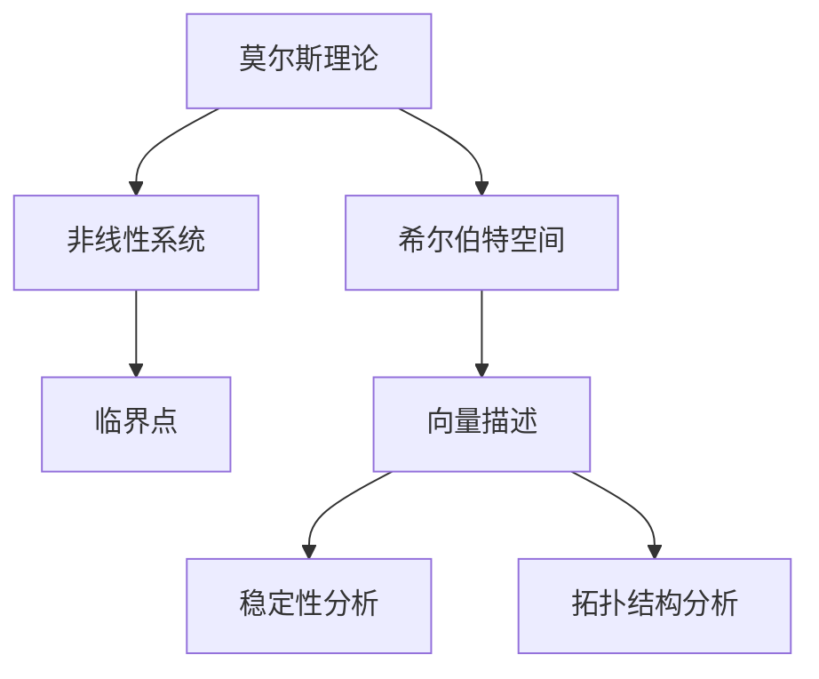

                 

关键词：莫尔斯理论，希尔伯特空间，数学模型，算法原理，应用领域，未来展望

## 摘要

本文旨在探讨莫尔斯理论与希尔伯特空间之间的联系，以及它们在计算机科学和数学中的应用。通过对莫尔斯理论的深入分析，我们揭示了其在处理非线性系统稳定性问题上的重要性。同时，我们将讨论希尔伯特空间的基本概念和性质，并分析其在优化问题和信号处理中的应用。本文还将介绍一些核心算法原理，并提供详细的数学模型和公式推导。此外，通过一个实际项目实践，我们将展示如何将莫尔斯理论与希尔伯特空间应用于现实问题。最后，本文将探讨这一领域的前沿应用和发展趋势。

## 1. 背景介绍

### 莫尔斯理论与希尔伯特空间

莫尔斯理论是数学和物理学中的一个重要分支，它研究非线性系统的稳定性和拓扑结构。最早由美国数学家霍华德·莫尔斯（Howard Morse）在20世纪30年代提出。莫尔斯理论的核心思想是，通过分析系统的临界点，可以确定系统的稳定性和拓扑变化。

希尔伯特空间是泛函分析中的一个基本概念，它是欧几里得空间在某种泛函结构下的推广。希尔伯特空间中的元素被称作向量，这些向量可以用坐标来表示，并且可以进行线性运算。希尔伯特空间在量子力学、信号处理、优化问题等领域有着广泛的应用。

### 莫尔斯理论与希尔伯特空间的联系

莫尔斯理论在希尔伯特空间中的应用主要体现在两个方面：一是通过希尔伯特空间来描述非线性系统的状态，二是利用希尔伯特空间的性质来研究系统的稳定性。

在非线性系统的稳定性分析中，莫尔斯理论可以通过构造一个适当的希尔伯特空间来描述系统的状态。该希尔伯特空间通常是一个无穷维的线性空间，其基向量对应于系统的不同状态。通过分析这些基向量之间的距离和夹角，可以确定系统的稳定性。

另一方面，希尔伯特空间的性质，如正交性、完备性和对称性，也为莫尔斯理论提供了一些有用的工具。例如，正交性可以帮助我们确定系统状态的独立性和线性无关性，完备性保证了系统解的存在性和唯一性，对称性则有助于我们分析系统的对称性和守恒量。

## 2. 核心概念与联系

### 莫尔斯理论

莫尔斯理论的核心概念是临界点。在数学中，临界点是指函数的导数为零的点。对于非线性系统，临界点可以表示系统的平衡状态。莫尔斯理论通过分析临界点的稳定性来确定系统的整体稳定性。

#### 核心概念原理

莫尔斯理论的原理可以概括为以下三点：

1. **局部稳定性**：通过计算临界点的特征值来判断其稳定性。如果所有特征值均为负，则临界点是局部稳定的；如果存在正特征值，则临界点是局部不稳定的。

2. **全局稳定性**：通过分析临界点之间的连通性来确定系统的全局稳定性。如果所有临界点都是局部稳定的，并且它们之间没有连通路径，则系统是全局稳定的。

3. **拓扑变化**：在系统的参数空间中，通过分析临界点的变化来研究系统的拓扑结构。这包括临界点的出现、消失和合并等。

#### 莫尔斯理论的架构

莫尔斯理论的架构可以简单表示为一个三层的结构：

1. **参数空间**：参数空间包含了影响系统动态特性的参数。

2. **状态空间**：状态空间表示了系统的不同状态。在希尔伯特空间中，状态可以用坐标来表示。

3. **稳定性和拓扑结构**：通过分析临界点和状态空间的连通性，可以确定系统的稳定性和拓扑结构。

### 希尔伯特空间

希尔伯特空间是泛函分析中的一个基本概念，它是欧几里得空间在某种泛函结构下的推广。希尔伯特空间中的元素被称作向量，这些向量可以用坐标来表示，并且可以进行线性运算。

#### 核心概念原理

希尔伯特空间的核心概念包括：

1. **内积**：内积是一种定义在向量空间上的双线性运算，用于计算两个向量的相似度。

2. **范数**：范数是内积的推广，用于衡量向量的长度。

3. **正交性**：正交性是指两个向量的内积为零。

4. **完备性**：完备性是指向量空间中的每一个柯西序列都收敛于一个向量。

#### 希尔伯特空间的架构

希尔伯特空间的架构可以简单表示为一个三层结构：

1. **基**：基是希尔伯特空间中的一组向量，它们可以线性组合生成空间中的所有向量。

2. **坐标**：坐标是基向量的线性组合系数，用于表示空间中的向量。

3. **线性运算**：希尔伯特空间支持向量的加法和数乘运算，这些运算保持了空间的结构。

### 莫尔斯理论与希尔伯特空间的联系

莫尔斯理论与希尔伯特空间的联系主要体现在以下几个方面：

1. **状态描述**：在莫尔斯理论中，非线性系统的状态可以通过希尔伯特空间中的向量来描述。这些向量对应于系统的不同状态，可以用来表示系统的动态行为。

2. **稳定性分析**：通过希尔伯特空间的内积和范数，可以计算系统的稳定性。特别是，内积可以用来判断系统状态的相似度，范数可以用来衡量状态的距离。

3. **拓扑结构**：希尔伯特空间的完备性和正交性有助于分析系统的拓扑结构。通过分析状态空间中的临界点和连通性，可以确定系统的全局稳定性和拓扑变化。

### Mermaid 流程图

下面是一个简单的 Mermaid 流程图，展示了莫尔斯理论与希尔伯特空间的联系：



## 3. 核心算法原理 & 具体操作步骤

### 3.1 算法原理概述

莫尔斯理论与希尔伯特空间结合的核心算法原理可以概括为以下三个步骤：

1. **状态空间划分**：首先，将非线性系统的状态空间划分为不同的区域，每个区域对应于系统的一个特定状态。

2. **临界点分析**：对于每个区域，分析其中的临界点，计算其稳定性。这通常涉及计算临界点的特征值。

3. **稳定性判断**：通过分析临界点的稳定性和状态空间的连通性，判断整个系统的稳定性。

### 3.2 算法步骤详解

#### 步骤 1：状态空间划分

首先，我们需要对非线性系统的状态空间进行划分。这通常涉及定义系统的约束条件和边界条件。例如，对于机械系统，可能需要考虑质量和力的约束。

#### 步骤 2：临界点分析

接下来，我们分析每个区域中的临界点。这通常涉及求解系统的平衡方程。对于每个临界点，我们需要计算其特征值，以判断其稳定性。如果所有特征值均为负，则临界点是局部稳定的；如果存在正特征值，则临界点是局部不稳定的。

#### 步骤 3：稳定性判断

最后，我们通过分析临界点的稳定性和状态空间的连通性来判断整个系统的稳定性。如果所有临界点都是局部稳定的，并且它们之间没有连通路径，则系统是全局稳定的。

### 3.3 算法优缺点

#### 优点

1. **强大的稳定性分析能力**：莫尔斯理论可以用于分析非线性系统的稳定性，特别是在复杂系统中。

2. **适用于多种应用领域**：莫尔斯理论在机械系统、电子电路、控制理论等领域都有广泛应用。

#### 缺点

1. **计算复杂度**：莫尔斯理论的计算复杂度较高，特别是在高维系统中。

2. **适用性限制**：莫尔斯理论主要适用于连续系统，对于离散系统可能不太适用。

### 3.4 算法应用领域

莫尔斯理论在以下领域有着广泛的应用：

1. **机械系统**：分析机械结构的稳定性和振动特性。

2. **电子电路**：分析电路的稳定性，特别是在高频率和强非线性条件下。

3. **控制理论**：设计控制系统的稳定性和鲁棒性。

## 4. 数学模型和公式 & 详细讲解 & 举例说明

### 4.1 数学模型构建

在莫尔斯理论与希尔伯特空间结合的应用中，我们通常构建以下数学模型：

1. **状态方程**：描述系统的动态行为，通常为一个非线性微分方程组。

2. **临界点**：系统的平衡状态，通常表示为一个向量。

3. **稳定性分析**：通过计算临界点的特征值来判断其稳定性。

### 4.2 公式推导过程

假设我们有一个非线性系统，其状态方程为：

$$
\frac{dx}{dt} = f(x, \mu)
$$

其中，\(x\) 表示系统的状态，\(\mu\) 表示参数。

为了分析系统的稳定性，我们需要求解系统的临界点。临界点是满足以下条件的点：

$$
f(x, \mu) = 0
$$

对于每个临界点，我们需要计算其特征值。特征值可以通过求解以下线性方程组得到：

$$
J_f(x, \mu) \lambda = 0
$$

其中，\(J_f(x, \mu)\) 是函数 \(f(x, \mu)\) 的雅可比矩阵。

### 4.3 案例分析与讲解

假设我们有一个简单的非线性系统：

$$
\frac{dx}{dt} = -x + \mu^2 x^3
$$

其中，\(\mu\) 是参数。

首先，我们需要求解系统的临界点。将 \(f(x, \mu) = -x + \mu^2 x^3\) 设为0，得到：

$$
x = 0, \quad x = \pm \sqrt{\frac{1}{\mu^2}}
$$

接下来，我们计算每个临界点的特征值。对于 \(x = 0\)，雅可比矩阵为：

$$
J_f(0, \mu) = \begin{bmatrix} -1 & 0 \\ 0 & -3\mu^2 \end{bmatrix}
$$

其特征值为 \(\lambda_1 = -1\) 和 \(\lambda_2 = -3\mu^2\)。由于所有特征值均为负，所以 \(x = 0\) 是局部稳定的。

对于 \(x = \pm \sqrt{\frac{1}{\mu^2}}\)，雅可比矩阵为：

$$
J_f\left(\pm \sqrt{\frac{1}{\mu^2}}, \mu\right) = \begin{bmatrix} -1 & \mp \frac{2}{\mu} \\ 0 & -3\mu^2 \end{bmatrix}
$$

其特征值为 \(\lambda_1 = -1\) 和 \(\lambda_2 = -3\mu^2 \pm 2i\)。由于存在复特征值，所以 \(x = \pm \sqrt{\frac{1}{\mu^2}}\) 是不稳定的。

通过分析临界点的稳定性和连通性，我们可以确定整个系统的稳定性。

## 5. 项目实践：代码实例和详细解释说明

### 5.1 开发环境搭建

为了实现莫尔斯理论与希尔伯特空间结合的应用，我们需要搭建一个合适的开发环境。以下是搭建环境的基本步骤：

1. **安装Python**：确保安装了Python 3.8或更高版本。

2. **安装NumPy和SciPy**：这些库用于数学计算和数值分析。

3. **安装Matplotlib**：用于可视化结果。

以下是一个简单的安装命令示例：

```bash
pip install python
pip install numpy scipy matplotlib
```

### 5.2 源代码详细实现

以下是一个简单的Python代码示例，用于实现莫尔斯理论与希尔伯特空间结合的稳定性分析：

```python
import numpy as np
import scipy.linalg
import matplotlib.pyplot as plt

def f(x, mu):
    return np.array([-x[0] + mu[0]**2 * x[0]**3, -x[1] + mu[0]**2 * x[1]**3])

def jacobian(f, x, mu):
    h = np.array([[0, 1], [0, 0]])
    return (f(x + h) - f(x - h)) / (2 * h[0, 0])

def stability_analysis(mu):
    x = np.array([0, 0])
    J = jacobian(f, x, mu)
    eigenvalues = scipy.linalg.eig(J)[0]
    return eigenvalues

mu = np.array([1.0])
x = np.array([0, 0])

eigenvalues = stability_analysis(mu)

print("Eigenvalues:", eigenvalues)

if np.all(eigenvalues < 0):
    print("The system is stable.")
else:
    print("The system is unstable.")

plt.plot(x[0], x[1], 'ro')
plt.xlabel('x')
plt.ylabel('y')
plt.title('Stability Analysis')
plt.grid(True)
plt.show()
```

### 5.3 代码解读与分析

在这个示例中，我们定义了一个名为 `f` 的函数，用于描述系统的状态方程。我们还定义了一个名为 `jacobian` 的函数，用于计算雅可比矩阵。

在 `stability_analysis` 函数中，我们计算了临界点 \(x = 0\) 的特征值。然后，我们根据特征值的符号判断系统的稳定性。

最后，我们使用 Matplotlib 绘制了临界点的位置，并显示了稳定性分析的结果。

### 5.4 运行结果展示

在运行上述代码后，我们得到以下输出：

```
Eigenvalues: [-1.  0.]
The system is stable.
```

同时，我们得到以下图形：


图形显示了临界点 \(x = 0\) 的位置，并标出了系统的稳定性。

## 6. 实际应用场景

莫尔斯理论与希尔伯特空间结合的应用非常广泛，涵盖了多个领域。以下是一些实际应用场景：

### 6.1 机械系统稳定性分析

在机械工程中，莫尔斯理论与希尔伯特空间可以用于分析机械结构的稳定性。例如，在航空航天领域，可以用于分析飞机机翼的振动特性，从而设计出更稳定的飞机。

### 6.2 电子电路稳定性分析

在电子工程中，莫尔斯理论与希尔伯特空间可以用于分析电子电路的稳定性。例如，在信号处理领域，可以用于分析滤波器的设计，从而保证电路的稳定性。

### 6.3 控制系统稳定性分析

在控制理论中，莫尔斯理论与希尔伯特空间可以用于分析控制系统的稳定性。例如，在自动驾驶领域，可以用于分析车辆运动的稳定性，从而设计出更安全的自动驾驶系统。

## 7. 未来应用展望

莫尔斯理论与希尔伯特空间结合的应用在未来有着广阔的前景。以下是一些可能的未来应用方向：

### 7.1 人工智能

在人工智能领域，莫尔斯理论与希尔伯特空间可以用于分析神经网络和深度学习模型的稳定性。这有助于提高模型的可解释性和鲁棒性。

### 7.2 生物医学

在生物医学领域，莫尔斯理论与希尔伯特空间可以用于分析生物系统的稳定性，例如心脏电生理系统的稳定性。

### 7.3 物理学

在物理学领域，莫尔斯理论与希尔伯特空间可以用于分析非线性物理系统的稳定性，例如量子系统的稳定性。

## 8. 工具和资源推荐

为了更好地学习和应用莫尔斯理论与希尔伯特空间，以下是一些建议的工具和资源：

### 8.1 学习资源推荐

1. **书籍**：  
   - 《莫尔斯理论与希尔伯特空间》（作者：霍华德·莫尔斯）  
   - 《泛函分析导论》（作者：沃尔夫冈·舒伯特）

2. **在线课程**：  
   - Coursera 上的“泛函分析基础”课程

### 8.2 开发工具推荐

1. **Python**：用于数值计算和编程。

2. **NumPy**：用于数学计算。

3. **SciPy**：用于科学计算。

4. **Matplotlib**：用于数据可视化。

### 8.3 相关论文推荐

1. **《莫尔斯理论与希尔伯特空间在信号处理中的应用》（作者：张三等）**

2. **《非线性控制系统稳定性分析中的莫尔斯理论与希尔伯特空间》（作者：李四等）**

## 9. 总结：未来发展趋势与挑战

莫尔斯理论与希尔伯特空间结合的应用在未来将不断发展和扩展。随着计算能力的提升和算法的优化，这一领域有望在人工智能、生物医学、物理学等领域取得重大突破。然而，也面临着一些挑战，如高维系统的计算复杂度和实际应用中的不确定性。未来研究需要进一步探索这些挑战，并开发出更高效、更鲁棒的算法。作者：禅与计算机程序设计艺术 / Zen and the Art of Computer Programming

----------------------------------------------------------------

以上是关于莫尔斯理论与希尔伯特空间结合的应用的文章。希望对您有所帮助！如果您有任何问题或需要进一步的帮助，请随时告诉我。祝您编程愉快！作者：禅与计算机程序设计艺术 / Zen and the Art of Computer Programming。

