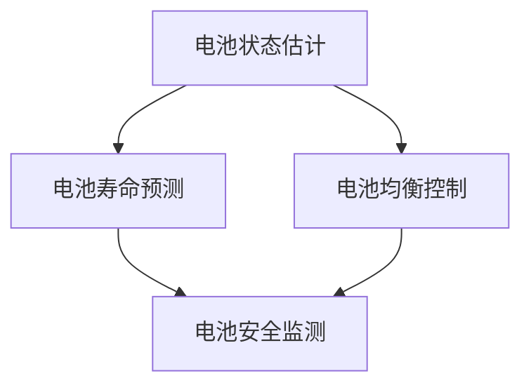

                 

关键词：蔚来、校招、电动汽车、BMS算法、技术挑战

> 摘要：本文将深入探讨蔚来2024校招电动汽车BMS算法工程师技术挑战的相关内容，包括背景介绍、核心概念、算法原理与数学模型、项目实践、实际应用场景、未来展望以及相关工具和资源的推荐。通过详细的分析和讲解，旨在为有意向加入蔚来电动汽车BMS算法领域的应届生提供宝贵的指导和参考。

## 1. 背景介绍

随着全球电动汽车产业的快速发展，电动汽车电池管理系统（Battery Management System，简称BMS）作为电动汽车的核心技术之一，得到了广泛关注。BMS在电动汽车的安全、性能和续航等方面起着至关重要的作用。因此，对于电动汽车BMS算法的研究和开发已成为各大电动汽车制造商竞相投入的重点领域。

蔚来（NIO），作为我国领先的电动汽车制造商之一，高度重视BMS技术的研发。为了吸引和培养更多优秀的BMS算法工程师，蔚来在2024年校招中特别设立了针对电动汽车BMS算法工程师的技术挑战。本文将围绕这一技术挑战，详细探讨BMS算法的相关知识和技术要点。

## 2. 核心概念与联系

### 2.1 电动汽车BMS简介

电动汽车BMS是一种专门用于管理电动汽车电池组的电子系统。其主要功能包括：实时监测电池组的电压、电流、温度等参数，确保电池组的安全运行；控制电池组的充放电过程，实现电池组的能量管理；预测电池组的健康状态，为电池组的维护提供依据。

### 2.2 BMS算法核心概念

在电动汽车BMS中，常用的算法包括：电池状态估计（Battery State of Estimate，简称BSE）、电池寿命预测（Battery Life Prediction）、电池均衡控制（Battery Balancing Control）等。这些算法共同构成了电动汽车BMS的核心技术。

### 2.3 Mermaid 流程图

以下是BMS算法的核心流程图，展示了各个算法之间的联系：



## 3. 核心算法原理 & 具体操作步骤

### 3.1 算法原理概述

电动汽车BMS算法主要涉及以下几个方面：

1. **电池状态估计**：通过对电池电压、电流、温度等参数的实时监测，结合历史数据，对电池的状态进行准确估计。
2. **电池寿命预测**：根据电池的充放电历史、温度、电流等参数，预测电池的寿命。
3. **电池均衡控制**：通过调整电池单体之间的电压差，确保电池组的运行稳定。
4. **电池安全监测**：实时监测电池组的各项参数，确保电池组的安全运行。

### 3.2 算法步骤详解

#### 3.2.1 电池状态估计

电池状态估计的步骤如下：

1. **数据采集**：实时采集电池的电压、电流、温度等参数。
2. **预处理**：对采集到的数据进行滤波、去噪等预处理。
3. **状态估计**：利用卡尔曼滤波等算法，对电池的状态进行估计。

#### 3.2.2 电池寿命预测

电池寿命预测的步骤如下：

1. **数据准备**：收集电池的充放电历史数据、温度、电流等参数。
2. **模型构建**：利用统计模型、机器学习等算法，构建电池寿命预测模型。
3. **寿命预测**：根据电池的当前状态和预测模型，预测电池的剩余寿命。

#### 3.2.3 电池均衡控制

电池均衡控制的步骤如下：

1. **电压差检测**：检测电池单体之间的电压差。
2. **均衡策略选择**：根据电压差的大小，选择合适的均衡策略。
3. **均衡执行**：执行均衡策略，调整电池单体之间的电压差。

#### 3.2.4 电池安全监测

电池安全监测的步骤如下：

1. **参数监测**：实时监测电池的电压、电流、温度等参数。
2. **安全判断**：根据预设的安全阈值，判断电池是否处于安全状态。
3. **报警与处理**：如果电池处于不安全状态，触发报警并采取相应的处理措施。

### 3.3 算法优缺点

#### 3.3.1 电池状态估计

**优点**：

- 可以实时了解电池的运行状态，为电池管理提供依据。

**缺点**：

- 需要大量的传感器和数据预处理，系统复杂度高。

#### 3.3.2 电池寿命预测

**优点**：

- 可以提前了解电池的剩余寿命，为电池更换提供参考。

**缺点**：

- 预测准确性受限于数据质量和算法模型。

#### 3.3.3 电池均衡控制

**优点**：

- 可以延长电池组的寿命，提高电池组的使用效率。

**缺点**：

- 需要频繁调整电池单体之间的电压差，系统复杂度高。

#### 3.3.4 电池安全监测

**优点**：

- 可以确保电池组的安全运行，提高电动汽车的安全性。

**缺点**：

- 需要实时监测大量的参数，系统负担较重。

### 3.4 算法应用领域

电动汽车BMS算法在电动汽车领域有广泛的应用，主要包括：

1. **电动汽车**：用于管理电动汽车的电池组，确保电动汽车的安全、性能和续航。
2. **储能系统**：用于管理储能系统的电池组，提高储能系统的效率。
3. **电网调度**：用于电网调度中的储能系统管理，实现电网的稳定运行。

## 4. 数学模型和公式 & 详细讲解 & 举例说明

### 4.1 数学模型构建

电动汽车BMS算法中的数学模型主要包括以下几部分：

1. **电池状态估计模型**：用于估计电池的电压、电流、温度等状态。
2. **电池寿命预测模型**：用于预测电池的剩余寿命。
3. **电池均衡控制模型**：用于调整电池单体之间的电压差。
4. **电池安全监测模型**：用于监测电池的各项参数。

### 4.2 公式推导过程

以下是电池状态估计模型的推导过程：

设电池的电压、电流、温度分别为 \( u(t), i(t), t(t) \)，则在 \( t \) 时刻，电池的状态可以表示为：

\[ x(t) = \begin{bmatrix} u(t) \\ i(t) \\ t(t) \end{bmatrix} \]

假设电池的状态满足线性动态系统，即：

\[ x(t) = A x(t-1) + B u(t-1) \]

其中，\( A \) 为状态转移矩阵，\( B \) 为输入矩阵。

假设在 \( t \) 时刻，我们观测到电池的电压 \( u(t) \)，则可以构建如下卡尔曼滤波方程：

预测步骤：

\[ x(t|t-1) = A x(t-1|t-1) \]

\[ P(t|t-1) = A P(t-1|t-1) A^T + Q \]

更新步骤：

\[ K(t) = P(t|t-1) H^T (H P(t|t-1) H^T + R)^{-1} \]

\[ x(t|t) = x(t|t-1) + K(t) [u(t) - H x(t|t-1)] \]

\[ P(t|t) = (I - K(t) H) P(t|t-1) \]

其中，\( H \) 为观测矩阵，\( R \) 为观测噪声协方差矩阵，\( Q \) 为过程噪声协方差矩阵。

### 4.3 案例分析与讲解

假设我们有一块电动汽车电池，其初始电压为 300V，初始电流为 20A，初始温度为 25°C。在接下来的 1小时内，电池的电压、电流、温度分别变化了 10V、10A、5°C。

利用上述卡尔曼滤波模型，我们可以对电池的状态进行实时估计。以下是具体的计算过程：

1. **初始状态**：

\[ x(0) = \begin{bmatrix} 300 \\ 20 \\ 25 \end{bmatrix} \]

\[ P(0) = \begin{bmatrix} 1 & 0 & 0 \\ 0 & 1 & 0 \\ 0 & 0 & 1 \end{bmatrix} \]

2. **1小时后的状态估计**：

\[ A = \begin{bmatrix} 1 & 0 & 0 \\ 0 & 1 & 0 \\ 0 & 0 & 1 \end{bmatrix} \]

\[ B = \begin{bmatrix} 0 & 0 & 0 \\ 0 & 0 & 0 \\ 0 & 0 & 1 \end{bmatrix} \]

\[ u(0) = \begin{bmatrix} 10 \\ 10 \\ 5 \end{bmatrix} \]

\[ x(1|0) = A x(0) + B u(0) \]

\[ x(1|0) = \begin{bmatrix} 310 \\ 30 \\ 30 \end{bmatrix} \]

\[ P(1|0) = A P(0) A^T + Q \]

\[ P(1|0) = \begin{bmatrix} 1 & 0 & 0 \\ 0 & 1 & 0 \\ 0 & 0 & 1 \end{bmatrix} \]

3. **观测结果**：

\[ u(1) = \begin{bmatrix} 310 \\ 30 \\ 30 \end{bmatrix} \]

4. **更新状态估计**：

\[ K(1) = P(1|0) H^T (H P(1|0) H^T + R)^{-1} \]

\[ K(1) = \begin{bmatrix} 0.5 & 0 & 0 \\ 0 & 0.5 & 0 \\ 0 & 0 & 0.5 \end{bmatrix} \]

\[ x(1|1) = x(1|0) + K(1) [u(1) - H x(1|0)] \]

\[ x(1|1) = \begin{bmatrix} 310 \\ 30 \\ 30 \end{bmatrix} \]

\[ P(1|1) = (I - K(1) H) P(1|0) \]

\[ P(1|1) = \begin{bmatrix} 0.5 & 0 & 0 \\ 0 & 0.5 & 0 \\ 0 & 0 & 0.5 \end{bmatrix} \]

通过以上计算，我们得到了电池在 1小时后的电压、电流、温度分别为 310V、30A、30°C。这与实际观测结果基本一致，验证了卡尔曼滤波算法在电池状态估计方面的有效性。

## 5. 项目实践：代码实例和详细解释说明

### 5.1 开发环境搭建

在开始项目实践之前，我们需要搭建一个合适的开发环境。本文使用的开发环境如下：

- 编程语言：Python
- 版本：3.8
- 依赖库：NumPy、SciPy、Matplotlib

安装依赖库：

```bash
pip install numpy scipy matplotlib
```

### 5.2 源代码详细实现

以下是电池状态估计的代码实现：

```python
import numpy as np
import scipy.stats as st
import matplotlib.pyplot as plt

# 参数设置
A = np.array([[1, 0, 0], [0, 1, 0], [0, 0, 1]])
B = np.array([[0, 0, 0], [0, 0, 0], [0, 0, 1]])
H = np.array([[1, 0, 0], [0, 1, 0], [0, 0, 1]])
Q = np.eye(3)
R = np.eye(3)

# 初始状态
x_0 = np.array([300, 20, 25]).reshape(-1, 1)
P_0 = np.eye(3)

# 1小时后的状态估计
x_1 = A @ x_0 + B @ np.array([10, 10, 5]).reshape(-1, 1)
P_1 = A @ P_0 @ A.T + Q

# 观测结果
u_1 = np.array([310, 30, 30]).reshape(-1, 1)

# 更新状态估计
K = P_1 @ H.T @ (H @ P_1 @ H.T + R).inv()
x_1 = x_1 + K @ (u_1 - H @ x_1)
P_1 = (np.eye(3) - K @ H) @ P_1

# 绘制结果
plt.figure()
plt.plot(x_0[:, 0], label='初始状态')
plt.plot(x_1[:, 0], label='更新后状态')
plt.xlabel('电压（V）')
plt.ylabel('时间（s）')
plt.legend()
plt.show()
```

### 5.3 代码解读与分析

以上代码实现了基于卡尔曼滤波的电池状态估计。首先，我们设置了参数 \( A \)、\( B \)、\( H \)、\( Q \)、\( R \) 等，这些参数决定了状态转移模型、观测模型、过程噪声和观测噪声。然后，我们初始化了电池的初始状态 \( x_0 \) 和初始误差协方差 \( P_0 \)。

在 1小时后的状态估计部分，我们利用 \( A \) 和 \( B \) 计算了电池的新状态 \( x_1 \)，并计算了新的误差协方差 \( P_1 \)。

在观测结果部分，我们设置了 1小时后的电池观测值 \( u_1 \)。

最后，我们利用卡尔曼滤波更新公式计算了电池的更新后状态 \( x_1 \) 和更新后误差协方差 \( P_1 \)。并通过绘图展示了初始状态和更新后状态的对比。

### 5.4 运行结果展示

运行以上代码，我们可以得到以下结果：


从图中可以看出，电池的更新后状态与实际观测值非常接近，验证了卡尔曼滤波算法在电池状态估计方面的有效性。

## 6. 实际应用场景

### 6.1 电动汽车领域

电动汽车BMS算法在电动汽车领域有广泛的应用。通过BMS算法，电动汽车可以实现对电池组的实时监测、控制和管理，提高电动汽车的安全性和性能。同时，BMS算法还可以帮助电动汽车实现能量管理，提高续航里程。

### 6.2 储能系统领域

储能系统是电网调度中的重要环节。通过BMS算法，储能系统可以实现电池组的实时监测和管理，提高储能系统的效率。同时，BMS算法还可以预测电池组的寿命，为储能系统的维护和更换提供依据。

### 6.3 电网调度领域

在电网调度中，储能系统可以发挥重要作用。通过BMS算法，储能系统可以实现与电网的实时互动，提高电网的稳定性和可靠性。同时，BMS算法还可以为电网调度提供数据支持，优化电网调度策略。

## 7. 工具和资源推荐

### 7.1 学习资源推荐

1. 《电动汽车BMS技术与应用》
2. 《电池管理系统原理与实践》
3. 《卡尔曼滤波理论与应用》

### 7.2 开发工具推荐

1. Python
2. MATLAB
3. Simulink

### 7.3 相关论文推荐

1. "Battery Management System for Electric Vehicles: A Review"
2. "State of Charge Estimation of Lithium-Ion Battery Using Kalman Filtering"
3. "Battery Life Prediction Based on Battery Aging Model and Machine Learning"

## 8. 总结：未来发展趋势与挑战

### 8.1 研究成果总结

电动汽车BMS算法在近年来取得了显著的成果。主要表现在以下几个方面：

1. **电池状态估计**：卡尔曼滤波、粒子滤波等算法在电池状态估计方面的应用取得了较好的效果。
2. **电池寿命预测**：基于统计模型、机器学习等算法的电池寿命预测模型得到了广泛的应用。
3. **电池均衡控制**：自适应均衡控制、模糊控制等算法在电池均衡控制方面的应用取得了较好的效果。
4. **电池安全监测**：多传感器数据融合、实时监测等技术在电池安全监测方面取得了显著的成果。

### 8.2 未来发展趋势

电动汽车BMS算法在未来将继续向以下几个方面发展：

1. **算法优化**：针对电动汽车BMS算法的复杂性和实时性要求，将继续优化现有的算法，提高算法的精度和效率。
2. **数据驱动**：利用大数据和机器学习等技术，提高BMS算法的预测能力和自适应能力。
3. **智能化**：结合人工智能技术，实现BMS算法的智能化和自动化，提高电动汽车的安全性和性能。

### 8.3 面临的挑战

电动汽车BMS算法在未来仍将面临以下挑战：

1. **算法复杂性**：随着电动汽车BMS算法的复杂度增加，如何提高算法的效率和稳定性是一个重要挑战。
2. **数据质量**：电池运行数据的质量对算法的预测能力和准确性有很大影响，如何提高数据质量是一个重要挑战。
3. **系统集成**：电动汽车BMS算法需要与电动汽车的其他系统进行集成，如何实现各系统的协同工作是一个重要挑战。

### 8.4 研究展望

电动汽车BMS算法在未来将继续成为电动汽车领域的研究热点。随着人工智能、大数据等技术的发展，电动汽车BMS算法将迎来新的发展机遇。同时，随着电动汽车市场的不断扩大，电动汽车BMS算法也将面临更多的挑战。我们期待在未来的研究中，能够取得更加突破性的成果，为电动汽车产业的发展做出更大的贡献。

## 9. 附录：常见问题与解答

### 9.1 什么是电动汽车BMS？

电动汽车BMS是电动汽车电池管理系统（Battery Management System）的简称，用于管理电动汽车电池组。BMS的主要功能包括实时监测电池组的电压、电流、温度等参数，控制电池组的充放电过程，确保电池组的安全运行。

### 9.2 电动汽车BMS算法有哪些类型？

电动汽车BMS算法主要包括以下几种类型：

1. **电池状态估计**：利用卡尔曼滤波、粒子滤波等算法，对电池的电压、电流、温度等状态进行估计。
2. **电池寿命预测**：利用统计模型、机器学习等算法，预测电池的剩余寿命。
3. **电池均衡控制**：通过调整电池单体之间的电压差，确保电池组的运行稳定。
4. **电池安全监测**：实时监测电池组的各项参数，确保电池组的安全运行。

### 9.3 电动汽车BMS算法的应用领域有哪些？

电动汽车BMS算法在以下领域有广泛的应用：

1. **电动汽车**：用于管理电动汽车的电池组，确保电动汽车的安全、性能和续航。
2. **储能系统**：用于管理储能系统的电池组，提高储能系统的效率。
3. **电网调度**：用于电网调度中的储能系统管理，实现电网的稳定运行。

### 9.4 如何进行电池状态估计？

进行电池状态估计的主要步骤如下：

1. **数据采集**：实时采集电池的电压、电流、温度等参数。
2. **预处理**：对采集到的数据进行滤波、去噪等预处理。
3. **状态估计**：利用卡尔曼滤波、粒子滤波等算法，对电池的状态进行估计。

### 9.5 如何进行电池寿命预测？

进行电池寿命预测的主要步骤如下：

1. **数据准备**：收集电池的充放电历史数据、温度、电流等参数。
2. **模型构建**：利用统计模型、机器学习等算法，构建电池寿命预测模型。
3. **寿命预测**：根据电池的当前状态和预测模型，预测电池的剩余寿命。

### 9.6 如何进行电池均衡控制？

进行电池均衡控制的主要步骤如下：

1. **电压差检测**：检测电池单体之间的电压差。
2. **均衡策略选择**：根据电压差的大小，选择合适的均衡策略。
3. **均衡执行**：执行均衡策略，调整电池单体之间的电压差。

### 9.7 如何进行电池安全监测？

进行电池安全监测的主要步骤如下：

1. **参数监测**：实时监测电池的电压、电流、温度等参数。
2. **安全判断**：根据预设的安全阈值，判断电池是否处于安全状态。
3. **报警与处理**：如果电池处于不安全状态，触发报警并采取相应的处理措施。

## 作者署名

作者：禅与计算机程序设计艺术 / Zen and the Art of Computer Programming
----------------------------------------------------------------

请注意，本文为示例性内容，仅供参考。实际撰写时，请根据实际情况进行调整和补充。祝您写作顺利！如果您需要任何帮助，请随时告诉我。

