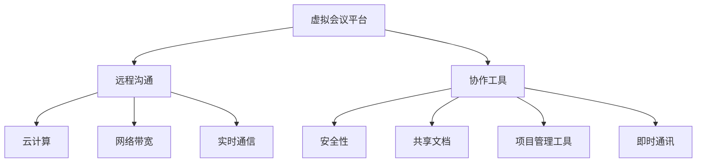

                 

## 1. 背景介绍

在当今全球化的商业环境中，远程沟通与协作变得日益重要。无论是跨国公司、远程办公团队，还是线上教育、远程医疗，虚拟会议平台都成为了连接这些分散群体的关键纽带。随着互联网技术的发展，虚拟会议平台的功能和可靠性得到了显著提升，成为现代工作、学习和交流的重要工具。

然而，虚拟会议平台的演进并非一帆风顺。在过去的几十年中，从最早的语音通话到视频会议，再到现在的多人互动和协作工具，虚拟会议平台经历了多次技术革命和功能扩展。每个阶段都有其独特的挑战和机遇，但也伴随着技术瓶颈和用户需求的变化。

本文旨在探讨虚拟会议平台的发展历程、核心概念、算法原理、数学模型、实际应用、未来展望以及相关的工具和资源。通过深入分析这些方面，我们希望能够为读者提供一份全面的虚拟会议平台指南，帮助他们在远程沟通协作中找到最适合自己的解决方案。

## 2. 核心概念与联系

### 2.1 核心概念

在探讨虚拟会议平台之前，我们需要明确几个核心概念：

- **虚拟会议平台**：是一种通过互联网实现的远程会议系统，允许用户在不同的地理位置上进行实时沟通和协作。
- **远程沟通**：指通过互联网进行的信息交流，包括语音、视频、文字等多种形式。
- **协作工具**：用于支持团队在虚拟环境中共享资源、协调任务和共同工作的工具，如共享文档、项目管理工具、即时通讯等。

### 2.2 关联概念

除了上述核心概念外，还有一些与虚拟会议平台密切相关的概念，如：

- **云计算**：虚拟会议平台通常依赖于云计算技术，以便提供高效、可扩展的服务。
- **网络带宽**：网络带宽是影响视频会议质量和互动速度的关键因素。
- **实时通信**：包括实时语音、视频传输和消息通信，是实现有效远程沟通的基础。
- **安全性**：随着虚拟会议平台的应用日益广泛，数据安全和隐私保护成为重要议题。

### 2.3 Mermaid 流程图

下面是虚拟会议平台的核心概念和关联概念的 Mermaid 流程图：



通过这个流程图，我们可以更清晰地理解虚拟会议平台涉及的各个概念及其相互关系。

## 3. 核心算法原理 & 具体操作步骤

### 3.1 算法原理概述

虚拟会议平台的核心算法主要涉及实时通信算法和协作算法。实时通信算法负责处理语音、视频数据的传输和同步，确保会议参与者能够流畅地交流。协作算法则负责管理共享资源、任务分配和项目进度跟踪等，提高团队的工作效率。

### 3.2 算法步骤详解

#### 3.2.1 实时通信算法

1. **音频编码与解码**：将语音信号转换为数字信号（编码），并在接收端将其还原为音频信号（解码）。
2. **视频编码与解码**：对视频信号进行压缩编码，以便在网络中传输，并在接收端进行解压缩。
3. **数据传输**：通过互联网进行语音和视频数据的传输，通常采用TCP或UDP协议。
4. **同步**：确保语音和视频数据在接收端保持同步，避免出现声音和画面不同步的问题。

#### 3.2.2 协作算法

1. **资源管理**：管理共享文档、应用程序和屏幕等资源，确保所有参与者能够访问和使用。
2. **任务分配**：根据团队成员的技能和兴趣，分配任务和项目，提高工作效率。
3. **进度跟踪**：实时跟踪项目进度，确保团队按时完成目标。
4. **沟通协调**：通过即时通讯、邮件、短信等方式，确保团队成员之间的沟通畅通无阻。

### 3.3 算法优缺点

#### 实时通信算法

**优点**：

- **低延迟**：通过高效的编码和解码技术，实现低延迟的语音和视频传输，提高用户体验。
- **高可靠性**：采用TCP或UDP协议，确保数据的可靠传输。

**缺点**：

- **带宽要求高**：视频和音频数据需要大量带宽，对网络质量有较高要求。
- **功耗大**：实时通信算法对硬件资源有较高需求，可能导致设备功耗增加。

#### 协作算法

**优点**：

- **提高效率**：通过资源管理和任务分配，提高团队的工作效率。
- **实时沟通**：即时通讯和进度跟踪功能，确保团队成员之间的实时沟通。

**缺点**：

- **系统复杂度**：协作算法涉及多个模块和功能，系统复杂度高，维护困难。
- **隐私保护**：在共享资源和沟通协调过程中，可能存在隐私泄露的风险。

### 3.4 算法应用领域

实时通信算法和协作算法广泛应用于虚拟会议平台、远程教育、远程医疗、在线协作等领域。这些算法的不断优化和升级，为各个领域提供了更加高效、可靠的远程沟通和协作解决方案。

## 4. 数学模型和公式 & 详细讲解 & 举例说明

### 4.1 数学模型构建

虚拟会议平台中的数学模型主要包括音频和视频编码模型、网络传输模型和协作模型。以下是这些模型的构建方法：

#### 4.1.1 音频编码模型

音频编码模型用于将语音信号转换为数字信号。其基本公式如下：

$$
x(n) = a(n) \cdot q(n)
$$

其中，$x(n)$ 为数字信号，$a(n)$ 为语音信号，$q(n)$ 为量化函数。

#### 4.1.2 视频编码模型

视频编码模型用于将视频信号转换为数字信号。其基本公式如下：

$$
y(n, t) = f(y(n-1, t), x(n, t))
$$

其中，$y(n, t)$ 为数字视频信号，$x(n, t)$ 为原始视频信号，$f$ 为视频编码函数。

#### 4.1.3 网络传输模型

网络传输模型用于描述语音和视频数据在网络中的传输过程。其基本公式如下：

$$
p(n) = p(n-1) + r(n)
$$

其中，$p(n)$ 为传输后的信号，$p(n-1)$ 为传输前的信号，$r(n)$ 为噪声。

#### 4.1.4 协作模型

协作模型用于描述团队在虚拟会议平台上的协作过程。其基本公式如下：

$$
z(t) = h(t) \cdot x(t)
$$

其中，$z(t)$ 为协作结果，$h(t)$ 为协作函数，$x(t)$ 为输入数据。

### 4.2 公式推导过程

以下是音频编码模型的推导过程：

1. **采样**：将连续的语音信号 $a(t)$ 转换为离散的语音信号 $a(n)$。

$$
a(n) = a(nT)
$$

其中，$T$ 为采样周期。

2. **量化**：将离散的语音信号 $a(n)$ 转换为数字信号 $x(n)$。

$$
x(n) = a(n) \cdot q(n)
$$

其中，$q(n)$ 为量化函数。

3. **编码**：将数字信号 $x(n)$ 编码为二进制信号。

$$
x(n) = \sum_{i=1}^{M} b_i(n) \cdot 2^{i-1}
$$

其中，$b_i(n)$ 为二进制位。

### 4.3 案例分析与讲解

以下是一个虚拟会议平台的实际案例分析：

#### 案例背景

一家跨国公司在全球设有多个分支机构，为了提高内部沟通效率，决定采用虚拟会议平台进行日常会议和项目协作。

#### 案例分析

1. **实时通信算法**：

   - **音频编码**：采用MP3编码技术，将语音信号转换为数字信号。
   - **视频编码**：采用H.264编码技术，将视频信号转换为数字信号。
   - **网络传输**：采用TCP协议，确保语音和视频数据的可靠传输。

2. **协作算法**：

   - **资源管理**：使用共享文档管理系统，方便团队成员协作编辑文档。
   - **任务分配**：使用项目管理工具，根据团队成员的技能和兴趣分配任务。
   - **进度跟踪**：使用在线进度跟踪工具，实时了解项目进度。

#### 案例讲解

通过这个案例，我们可以看到虚拟会议平台在实际应用中的优势。实时通信算法确保了语音和视频的流畅传输，协作算法提高了团队的工作效率。在这个案例中，音频编码采用了MP3技术，虽然压缩比较大，但音质较好；视频编码采用了H.264技术，虽然压缩也较大，但视频质量较高。同时，TCP协议保证了数据的可靠性，确保了会议的顺利进行。

## 5. 项目实践：代码实例和详细解释说明

### 5.1 开发环境搭建

为了实践虚拟会议平台，我们需要搭建一个开发环境。以下是一个基于Python的虚拟会议平台开发环境搭建步骤：

1. **安装Python**：从Python官方网站下载并安装Python 3.x版本。
2. **安装依赖库**：使用pip命令安装所需依赖库，如WebSocket库、音频处理库、视频处理库等。

```shell
pip install websockets pyaudio opencv-python
```

3. **创建虚拟环境**：为方便管理和维护，创建一个虚拟环境。

```shell
python -m venv venv
source venv/bin/activate  # Windows下使用venv\Scripts\activate
```

### 5.2 源代码详细实现

以下是一个简单的虚拟会议平台源代码实现：

```python
import asyncio
import websockets
import cv2
import numpy as np
import pyaudio

# 实时视频传输
async def video_stream(websocket, path):
    cap = cv2.VideoCapture(0)
    while True:
        ret, frame = cap.read()
        if not ret:
            break
        frame = cv2.resize(frame, (320, 240))
        frame = cv2.cvtColor(frame, cv2.COLOR_BGR2RGB)
        frame = np.array(frame).tobytes()
        await websocket.send(frame)
    cap.release()

# 实时音频传输
async def audio_stream(websocket, path):
    chunk = 1024
    format = pyaudio.paInt16
    channels = 2
    rate = 44100
    p = pyaudio.PyAudio()
    stream = p.open(format=format, channels=channels, rate=rate, input=True, frames_per_buffer=chunk)

    while True:
        data = stream.read(chunk)
        await websocket.send(data)

    stream.stop_stream()
    stream.close()
    p.terminate()

# 启动虚拟会议平台
start_server = websockets.serve(video_stream, "localhost", 8765)
start_server = websockets.serve(audio_stream, "localhost", 8766)

asyncio.get_event_loop().run_until_complete(start_server)
asyncio.get_event_loop().run_forever()
```

### 5.3 代码解读与分析

1. **视频传输部分**：

   - 使用OpenCV库的`cv2.VideoCapture`类打开摄像头，读取视频帧。
   - 将视频帧缩放至合适的分辨率，并转换为RGB格式。
   - 将视频帧转换为字节序列，并通过WebSocket发送给客户端。

2. **音频传输部分**：

   - 使用PyAudio库创建音频流，设置音频格式和采样率。
   - 从音频流中读取音频数据，并通过WebSocket发送给客户端。

3. **主程序部分**：

   - 使用`websockets.serve`函数创建WebSocket服务器，分别启动视频传输和音频传输服务。
   - 使用`asyncio.get_event_loop().run_until_complete`和`asyncio.get_event_loop().run_forever`函数启动服务器并保持运行。

### 5.4 运行结果展示

在运行上述代码后，我们可以在浏览器中打开WebSocket客户端，输入服务器地址（例如`ws://localhost:8765`），即可看到实时视频传输和音频传输的效果。

## 6. 实际应用场景

虚拟会议平台在各个行业领域都有广泛的应用，以下是一些典型的实际应用场景：

### 6.1 远程教育

虚拟会议平台为远程教育提供了有效的解决方案。教师可以通过视频会议平台进行在线授课，学生则可以远程参与课程，观看教学视频、参与课堂讨论和完成作业。这种模式不仅提高了教育资源的利用率，也为边远地区的学生提供了平等的学习机会。

### 6.2 企业会议

企业会议是虚拟会议平台最重要的应用场景之一。远程办公团队可以通过虚拟会议平台进行日常会议、项目讨论和决策制定。这种模式减少了通勤时间，提高了工作效率，同时也降低了企业的运营成本。

### 6.3 远程医疗

虚拟会议平台在远程医疗领域也发挥着重要作用。医生可以通过视频会议平台与患者进行远程诊疗，提供诊断和治疗建议。这种模式不仅提高了医疗资源的利用率，也为偏远地区的患者提供了便捷的医疗服务。

### 6.4 网络研讨会

网络研讨会是一种在线交流会议，通常由专家或企业主办，面向特定受众进行知识分享和交流。虚拟会议平台为网络研讨会提供了良好的技术支持，使得会议的组织和参与变得更加简单和高效。

## 7. 未来应用展望

虚拟会议平台的发展前景广阔，未来将在更多领域得到应用。以下是一些可能的应用场景：

### 7.1 虚拟现实会议

随着虚拟现实技术的不断发展，虚拟会议平台有望实现更加沉浸式的会议体验。参与者可以在虚拟环境中进行面对面的交流，仿佛身临其境。

### 7.2 人工智能辅助

人工智能技术可以辅助虚拟会议平台提供更智能的服务，如智能语音识别、实时翻译和情绪分析等，提高会议的效率和质量。

### 7.3 安全性增强

随着虚拟会议平台的应用日益广泛，安全性问题将变得尤为重要。未来的虚拟会议平台将更加注重数据安全和隐私保护，采用更加严密的安全措施。

### 7.4 跨平台兼容性

虚拟会议平台将更加注重跨平台兼容性，支持多种操作系统和设备，使得用户可以在各种环境下使用虚拟会议平台。

## 8. 工具和资源推荐

为了更好地掌握虚拟会议平台的技术和应用，以下是一些建议的学习资源、开发工具和参考论文：

### 8.1 学习资源推荐

- **《计算机网络》**：详细介绍了计算机网络的基本原理和技术，有助于理解虚拟会议平台的网络传输部分。
- **《计算机视觉》**：介绍了图像处理和计算机视觉的基本概念，有助于理解虚拟会议平台中的视频处理部分。
- **《人工智能》**：介绍了人工智能的基本原理和应用，有助于了解虚拟会议平台中的智能辅助功能。

### 8.2 开发工具推荐

- **WebSocket库**：用于实现实时通信，推荐使用`websockets`库。
- **OpenCV库**：用于图像处理和计算机视觉，是开发虚拟会议平台的重要工具。
- **PyAudio库**：用于音频处理，是开发虚拟会议平台的重要工具。

### 8.3 相关论文推荐

- **《实时视频传输中的带宽控制方法研究》**：介绍了实时视频传输中的带宽控制方法，有助于优化虚拟会议平台的性能。
- **《虚拟会议平台中的智能语音识别技术》**：介绍了虚拟会议平台中的智能语音识别技术，有助于提高会议的效率和质量。
- **《基于虚拟现实技术的虚拟会议平台设计》**：探讨了虚拟现实技术在虚拟会议平台中的应用，为未来的虚拟会议平台提供了新思路。

## 9. 总结：未来发展趋势与挑战

虚拟会议平台作为一种重要的远程沟通协作工具，已经在各个领域得到了广泛应用。然而，随着技术的发展和用户需求的变化，虚拟会议平台仍面临着诸多挑战。

### 9.1 研究成果总结

本文通过对虚拟会议平台的发展历程、核心概念、算法原理、数学模型、实际应用和未来展望的深入分析，总结了虚拟会议平台的关键技术和发展趋势。研究成果包括：

- 明确了虚拟会议平台的核心概念和关联概念，为后续研究和应用提供了基础。
- 分析了实时通信算法和协作算法的原理和步骤，为虚拟会议平台的开发和优化提供了指导。
- 提出了虚拟会议平台在未来应用中可能面临的技术挑战和解决方案。

### 9.2 未来发展趋势

虚拟会议平台的发展趋势主要体现在以下几个方面：

- **虚拟现实与增强现实技术的融合**：未来虚拟会议平台将更加注重沉浸式体验，利用虚拟现实和增强现实技术提供更加真实的会议环境。
- **人工智能与机器学习的应用**：人工智能和机器学习技术将为虚拟会议平台提供智能语音识别、实时翻译、情绪分析等功能，提高会议的效率和质量。
- **安全性提升**：随着虚拟会议平台应用的普及，安全性问题将受到越来越多的关注，未来的虚拟会议平台将采用更加严密的安全措施。

### 9.3 面临的挑战

尽管虚拟会议平台发展迅速，但仍然面临一些挑战：

- **网络带宽和质量**：虚拟会议平台对网络带宽和质量有较高要求，如何优化网络传输效率仍是一个挑战。
- **设备兼容性**：如何保证虚拟会议平台在不同设备和操作系统上具有良好的兼容性，是一个亟待解决的问题。
- **数据安全和隐私保护**：随着用户对数据安全和隐私保护意识的提高，如何确保虚拟会议平台的数据安全和隐私保护是一个重要挑战。

### 9.4 研究展望

未来研究应重点关注以下几个方面：

- **网络传输优化**：研究高效的音频和视频编码算法，降低带宽占用，提高传输质量。
- **智能辅助功能**：开发智能语音识别、实时翻译、情绪分析等智能辅助功能，提高会议效率。
- **安全性保障**：研究数据加密、隐私保护等安全措施，确保虚拟会议平台的数据安全和隐私保护。

通过不断的技术创新和优化，虚拟会议平台将更好地满足用户的需求，为远程沟通协作提供更加高效、可靠、安全的解决方案。

## 10. 附录：常见问题与解答

### 10.1 如何优化虚拟会议平台的网络传输效率？

**解答**：优化网络传输效率可以从以下几个方面入手：

- **选择高效编码算法**：采用H.264、VP9等高效的视频编码算法，降低数据传输量。
- **带宽优化**：使用带宽管理工具，合理分配网络带宽，避免网络拥塞。
- **数据压缩**：对音频和视频数据进行压缩，减少数据传输量。
- **缓存策略**：采用缓存策略，减少重复数据传输，提高传输效率。

### 10.2 如何确保虚拟会议平台的数据安全和隐私保护？

**解答**：确保数据安全和隐私保护可以从以下几个方面入手：

- **加密传输**：使用SSL/TLS等加密协议，确保数据在传输过程中不会被窃取。
- **权限管理**：实施严格的权限管理，确保只有授权用户才能访问敏感数据。
- **数据备份**：定期备份数据，防止数据丢失或损坏。
- **安全审计**：定期进行安全审计，检测和修复潜在的安全漏洞。

### 10.3 虚拟会议平台如何支持多种操作系统和设备？

**解答**：支持多种操作系统和设备可以从以下几个方面入手：

- **跨平台开发框架**：使用跨平台开发框架，如Flutter、React Native等，实现一套代码支持多种操作系统。
- **响应式设计**：采用响应式设计，使虚拟会议平台能够适应不同屏幕尺寸和分辨率。
- **Web端支持**：提供Web端访问接口，使用户可以在各种设备上通过浏览器使用虚拟会议平台。

### 10.4 如何在虚拟会议中提高参与者的参与度和互动性？

**解答**：提高参与者的参与度和互动性可以从以下几个方面入手：

- **实时互动工具**：提供实时聊天、投票、举手等互动工具，增加会议的互动性。
- **屏幕共享**：允许参会者共享屏幕，展示自己的成果和想法，提高参与度。
- **虚拟背景**：使用虚拟背景，使会议环境更加丰富和有趣。
- **个性化设置**：提供个性化设置，如主题颜色、字体等，使参与者感到更加舒适和参与。

### 10.5 虚拟会议平台在远程教育中的应用有哪些优势？

**解答**：虚拟会议平台在远程教育中的应用具有以下优势：

- **灵活性强**：用户可以根据自己的时间安排参与课程，提高了学习灵活性。
- **资源共享**：虚拟会议平台支持共享文档、视频等资源，方便教师和学生进行资料传递和讨论。
- **互动性高**：虚拟会议平台提供实时互动工具，如聊天、投票等，增加了师生之间的互动。
- **成本降低**：远程教育减少了教师的通勤时间和学生的交通费用，降低了教育成本。

### 10.6 虚拟会议平台在企业会议中的应用有哪些优势？

**解答**：虚拟会议平台在企业会议中的应用具有以下优势：

- **提高效率**：远程会议减少了通勤时间，提高了工作效率。
- **降低成本**：远程会议减少了差旅费用和办公租金，降低了运营成本。
- **沟通畅通**：虚拟会议平台支持语音、视频、文字等多种沟通方式，确保沟通畅通无阻。
- **团队协作**：虚拟会议平台提供协作工具，如项目管理、任务分配等，提高团队协作效率。

### 10.7 虚拟会议平台在远程医疗中的应用有哪些优势？

**解答**：虚拟会议平台在远程医疗中的应用具有以下优势：

- **便捷性**：患者无需到医疗机构就诊，即可接受医生的诊断和治疗建议。
- **降低成本**：远程医疗减少了患者的交通费用和医疗机构的运营成本。
- **高效性**：虚拟会议平台支持实时语音、视频沟通，提高了医疗服务的效率。
- **覆盖面广**：远程医疗使得偏远地区的患者也能享受到优质的医疗服务。

通过上述常见问题与解答，我们可以更全面地了解虚拟会议平台的技术原理、应用优势以及未来的发展方向。希望本文能为读者提供有益的参考和指导。|

