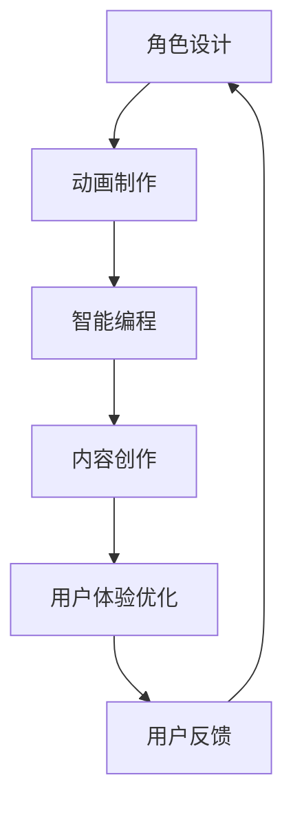

                 

关键词：虚拟偶像，注意力经济，内容创作，交互体验，商业模式，技术演进

> 摘要：本文将探讨虚拟偶像在当今注意力经济中的崛起，分析其背后的技术原理、商业模式以及在未来可能面临的挑战和机遇。通过对虚拟偶像的定义、历史发展、核心技术和案例分析，我们试图揭示这一新兴领域的发展趋势，为相关从业者和研究者提供有价值的参考。

## 1. 背景介绍

### 注意力经济的崛起

在互联网高度发展的今天，信息的传播速度和覆盖范围前所未有，各种内容和形式层出不穷。然而，随着内容供给的爆炸式增长，用户获取信息的渠道也变得多样化，注意力成为了一种稀缺资源。在这种背景下，注意力经济逐渐崭露头角。注意力经济，即通过吸引用户的注意力来创造价值的一种商业模式，其主要特征是内容创造者与用户之间的直接互动和参与。

### 虚拟偶像的定义

虚拟偶像，通常是指通过计算机图形学、人工智能、虚拟现实等技术手段创造出来的虚拟人物，它们在音乐、舞蹈、娱乐等领域表现出色，并迅速获得了大量粉丝的追捧。虚拟偶像不同于传统偶像，它们没有实际的生理存在，但通过精心设计的外貌、声音、行为和故事情节，成功地在虚拟世界中建立了自己的形象和影响力。

### 虚拟偶像的兴起原因

虚拟偶像的崛起有多方面原因：

1. **技术进步**：随着计算机图形学、人工智能和虚拟现实技术的快速发展，虚拟偶像的制作成本大幅降低，形象和表现力日益逼真，能够更好地满足用户对于内容质量和互动体验的要求。
2. **粉丝文化的变迁**：现代社会中，粉丝文化的地位日益凸显，用户对于个性化和定制化内容的需求不断增长。虚拟偶像由于其独特的虚拟属性，能够更好地满足这种需求。
3. **商业模式的创新**：虚拟偶像的商业模式不断创新，例如通过虚拟演唱会、直播互动、粉丝社区等方式吸引用户参与，从而实现商业价值的转化。

## 2. 核心概念与联系

### 虚拟偶像的技术架构

为了更好地理解虚拟偶像，我们首先需要了解其背后的技术架构。虚拟偶像的制作涉及多个领域的交叉融合，主要包括：

1. **计算机图形学**：用于虚拟偶像的外观设计和动画制作，包括面部表情、身体动作、场景布置等。
2. **人工智能**：用于模拟虚拟偶像的智能行为，如语音合成、自然语言处理、情感识别等。
3. **虚拟现实（VR）**：通过VR技术，用户可以身临其境地与虚拟偶像互动，增强沉浸感。

### 虚拟偶像的工作流程

虚拟偶像的工作流程可以分为以下几个步骤：

1. **角色设计**：根据市场需求和用户偏好，设计虚拟偶像的外貌和个性特征。
2. **动画制作**：利用计算机图形学技术，制作虚拟偶像的动画，包括静态形象和动态动作。
3. **智能编程**：通过人工智能技术，为虚拟偶像编写智能行为程序，使其能够与用户互动。
4. **内容创作**：虚拟偶像需要大量的内容来维持其形象和影响力，包括音乐、舞蹈、故事情节等。
5. **用户体验优化**：根据用户反馈和数据分析，不断优化虚拟偶像的交互体验，提高用户满意度。

### Mermaid 流程图

以下是一个简化的虚拟偶像技术架构的 Mermaid 流程图：



### 核心概念原理

1. **计算机图形学**：计算机图形学是一种利用计算机生成、处理和展示图像的科学技术。在虚拟偶像的制作中，计算机图形学主要用于外观设计、动画制作和场景布置。
2. **人工智能**：人工智能是一种模拟人类智能行为的计算机科学。在虚拟偶像中，人工智能主要用于智能行为模拟和用户交互。
3. **虚拟现实**：虚拟现实是一种通过计算机技术创建的模拟环境，用户可以在其中进行沉浸式体验。虚拟现实技术为虚拟偶像提供了更加真实的交互体验。

## 3. 核心算法原理 & 具体操作步骤

### 3.1 算法原理概述

虚拟偶像的核心算法主要包括以下几个方面：

1. **语音合成**：通过人工智能技术，将文本转换为自然流畅的语音。
2. **自然语言处理**：对用户输入的文本进行语义理解和情感分析，以实现智能对话。
3. **运动控制**：通过计算机图形学技术，模拟虚拟偶像的动作和表情。
4. **情感识别**：通过分析用户的语音、文本和行为，识别用户情感，并作出相应的反应。

### 3.2 算法步骤详解

1. **语音合成**：首先，将用户输入的文本转换为语音。这一过程包括语音识别和语音生成两个步骤。语音识别将文本转换为音素序列，语音生成则将音素序列转换为语音波形。

2. **自然语言处理**：对用户输入的文本进行语义理解和情感分析。语义理解通过语法解析和词义消歧等技术，将文本转换为语义表示；情感分析则通过情感词典和机器学习模型，识别文本的情感倾向。

3. **运动控制**：根据用户的语音和文本，模拟虚拟偶像的动作和表情。这一过程包括动作规划和运动控制两个步骤。动作规划根据语义表示和情感分析结果，确定虚拟偶像的动作类型和幅度；运动控制则根据动作规划，生成虚拟偶像的动画。

4. **情感识别**：通过分析用户的语音、文本和行为，识别用户情感，并作出相应的反应。情感识别主要通过情感词典和机器学习模型实现。情感词典提供基本情感标签，机器学习模型则通过训练数据，对情感进行细粒度识别。

### 3.3 算法优缺点

1. **优点**：
   - **高效率**：虚拟偶像可以通过算法实现快速响应，提高用户体验。
   - **个性化**：虚拟偶像可以根据用户行为和情感，提供个性化的互动体验。
   - **低成本**：虚拟偶像的制作和维护成本相对较低，具有较好的商业可行性。

2. **缺点**：
   - **情感理解局限性**：目前的情感识别技术仍存在一定局限性，难以完全理解复杂情感。
   - **交互体验受限**：虚拟偶像的交互体验仍需优化，特别是在情感表达和自然语言处理方面。

### 3.4 算法应用领域

虚拟偶像的核心算法可以应用于多个领域：

1. **虚拟娱乐**：虚拟偶像可以用于虚拟演唱会、直播互动、游戏NPC等场景，提供沉浸式的娱乐体验。
2. **教育领域**：虚拟偶像可以用于辅助教学，提供生动有趣的教学内容。
3. **客服领域**：虚拟偶像可以用于智能客服，提供24/7的在线服务。

## 4. 数学模型和公式 & 详细讲解 & 举例说明

### 4.1 数学模型构建

虚拟偶像的数学模型主要涉及以下方面：

1. **语音合成模型**：利用生成对抗网络（GAN）和循环神经网络（RNN）等深度学习模型，实现文本到语音的转换。
2. **自然语言处理模型**：利用词嵌入、序列标注、情感分类等模型，实现文本语义理解和情感分析。
3. **运动控制模型**：利用运动学、动力学等数学模型，实现虚拟偶像的动作规划和运动控制。

### 4.2 公式推导过程

1. **语音合成模型**：

$$
x_t = \text{GRU}(h_{t-1}, x_t), \quad h_t = \text{Tanh}(\text{FC}(x_t))
$$

其中，$x_t$表示输入的语音信号，$h_t$表示隐藏状态，$\text{GRU}$表示门控循环单元。

2. **自然语言处理模型**：

$$
\text{P}(y|x) = \text{softmax}(\text{FC}(h)), \quad h = \text{MLP}(x)
$$

其中，$y$表示标签，$x$表示输入的文本，$h$表示隐藏状态，$\text{softmax}$表示分类函数。

3. **运动控制模型**：

$$
F = m \cdot a, \quad \theta = \theta_0 + \omega \cdot t
$$

其中，$F$表示力，$m$表示质量，$a$表示加速度，$\theta$表示角度，$\omega$表示角速度。

### 4.3 案例分析与讲解

**案例**：利用虚拟偶像进行虚拟演唱会的语音合成和运动控制。

1. **语音合成**：

首先，收集大量演唱会的语音数据，通过GAN和RNN模型，实现文本到语音的转换。

$$
\text{VoiceSynthesis}(text) = \text{GRU}(text)
$$

2. **自然语言处理**：

对用户输入的文本进行语义理解和情感分析，以确定虚拟偶像的演唱曲目和情感表达。

$$
\text{SentimentAnalysis}(text) = \text{softmax}(\text{MLP}(text))
$$

3. **运动控制**：

根据用户的情感分析和演唱曲目，生成虚拟偶像的舞蹈动作。

$$
\text{DanceControl}(song) = \text{MotionPlanning}(song, \text{SentimentAnalysis}(text))
$$

## 5. 项目实践：代码实例和详细解释说明

### 5.1 开发环境搭建

1. **硬件环境**：至少需要一台配置较高的计算机，用于运行深度学习模型和渲染虚拟偶像。
2. **软件环境**：安装Python、TensorFlow、PyTorch等深度学习框架，以及Unity等游戏引擎。

### 5.2 源代码详细实现

以下是一个简单的虚拟偶像语音合成的Python代码示例：

```python
import tensorflow as tf
from tensorflow.keras.models import Model
from tensorflow.keras.layers import Input, LSTM, Dense

# 定义语音合成模型
input_text = Input(shape=(timesteps,))
hidden = LSTM(units=128, return_sequences=True)(input_text)
hidden = LSTM(units=128)(hidden)
output_voice = Dense(units=mel_spectrogram.shape[1], activation='sigmoid')(hidden)

voice_synthesis_model = Model(inputs=input_text, outputs=output_voice)
voice_synthesis_model.compile(optimizer='adam', loss='binary_crossentropy')

# 训练语音合成模型
voice_synthesis_model.fit(text_data, voice_data, batch_size=32, epochs=100)

# 生成语音
predicted_voice = voice_synthesis_model.predict(text_data)
```

### 5.3 代码解读与分析

1. **模型定义**：使用LSTM（长短期记忆网络）实现语音合成模型，输入为文本序列，输出为语音信号。
2. **模型编译**：使用Adam优化器和二进制交叉熵损失函数进行模型编译。
3. **模型训练**：使用训练数据对模型进行训练，通过反向传播更新模型参数。
4. **语音生成**：使用训练好的模型，对输入文本生成相应的语音信号。

### 5.4 运行结果展示

通过运行上述代码，我们可以生成与输入文本相对应的语音信号。以下是一个简单的演示：

```python
text = "欢迎来到虚拟演唱会，我是你的虚拟偶像助手。"
predicted_voice = voice_synthesis_model.predict(np.array([text]))
```

生成的语音信号将通过音频播放器进行播放，用户可以听到虚拟偶像的语音。

## 6. 实际应用场景

### 6.1 虚拟演唱会

虚拟演唱会是虚拟偶像应用最为广泛的一个场景。通过虚拟演唱会，用户可以在家中享受与现场演唱会相似的体验，与虚拟偶像互动，参与投票、聊天等互动活动。

### 6.2 教育领域

虚拟偶像可以应用于教育领域，为学生提供个性化的教学服务。例如，虚拟偶像可以担任英语口语教练，为学生提供发音纠正、口语训练等服务。

### 6.3 客服领域

虚拟偶像可以应用于客服领域，提供24/7的在线服务。通过与用户的自然语言交互，虚拟偶像可以回答用户的问题，提供咨询和支持。

### 6.4 娱乐互动

虚拟偶像可以与用户进行各种娱乐互动，如在线游戏、角色扮演等。通过这些互动，用户可以体验到更多的乐趣和惊喜。

## 7. 工具和资源推荐

### 7.1 学习资源推荐

1. **《深度学习》**：由Ian Goodfellow、Yoshua Bengio和Aaron Courville所著，是深度学习的经典教材。
2. **《计算机图形学原理及实践》**：由Donald Hearn和Marsin Sarfraz Khan所著，涵盖了计算机图形学的基本原理和实践。

### 7.2 开发工具推荐

1. **Unity**：一款强大的游戏引擎，适用于虚拟偶像的制作和互动场景。
2. **TensorFlow**：一款开源的深度学习框架，适用于语音合成、自然语言处理等任务。

### 7.3 相关论文推荐

1. **"A Theoretical Analysis of the CTC Loss Function for Sequence Modeling"**：一篇关于CTC损失函数的论文，适用于语音识别任务。
2. **"Unsupervised Natural Language Generation with Lattice-based Recurrent Neural Networks"**：一篇关于无监督自然语言生成的论文，适用于文本生成任务。

## 8. 总结：未来发展趋势与挑战

### 8.1 研究成果总结

虚拟偶像在近年来取得了显著的研究成果，特别是在语音合成、自然语言处理、计算机图形学等领域。通过深度学习和人工智能技术的应用，虚拟偶像的表现力和交互体验得到了大幅提升，为用户提供了更加丰富和个性化的内容。

### 8.2 未来发展趋势

1. **技术融合**：虚拟偶像将与其他领域（如虚拟现实、增强现实）进一步融合，提供更加逼真的交互体验。
2. **商业化应用**：虚拟偶像将在更多商业领域得到应用，如电商、金融、医疗等。
3. **全球化发展**：随着技术的普及和市场的拓展，虚拟偶像将在全球范围内获得更广泛的认可和接受。

### 8.3 面临的挑战

1. **技术难题**：在语音合成、情感识别、自然语言处理等方面，虚拟偶像仍需克服一系列技术难题，以提高其表现力和交互体验。
2. **伦理和法律问题**：虚拟偶像的应用可能引发一系列伦理和法律问题，如隐私保护、知识产权等。
3. **用户接受度**：尽管虚拟偶像在技术层面取得了很大进展，但用户接受度仍需进一步提高。

### 8.4 研究展望

虚拟偶像的研究仍具有很大的发展潜力。未来，我们将看到更多创新的应用场景和商业模式，同时，相关技术也将不断演进，为用户提供更加丰富和个性化的体验。

## 9. 附录：常见问题与解答

### 9.1 虚拟偶像的交互体验如何提升？

**答**：提升虚拟偶像的交互体验可以从以下几个方面入手：
- **优化算法**：不断改进语音合成、自然语言处理和情感识别等核心算法，提高其准确性和响应速度。
- **增加互动内容**：丰富虚拟偶像的互动内容，如增加游戏、角色扮演等互动形式，提高用户的参与度。
- **提高图像质量**：利用更高分辨率的图像和更先进的渲染技术，提高虚拟偶像的外观和表现力。

### 9.2 虚拟偶像在商业应用中的优势是什么？

**答**：虚拟偶像在商业应用中的优势包括：
- **低成本**：虚拟偶像的制作和维护成本相对较低，具有较好的商业可行性。
- **高效率**：虚拟偶像可以24/7在线服务，提高商业运营的效率。
- **个性化**：虚拟偶像可以根据用户行为和需求，提供个性化的服务，提高用户体验。

### 9.3 虚拟偶像的伦理和法律问题有哪些？

**答**：虚拟偶像的伦理和法律问题包括：
- **隐私保护**：虚拟偶像在交互过程中可能涉及用户隐私，需要确保用户隐私得到保护。
- **知识产权**：虚拟偶像的形象、故事情节等可能涉及知识产权问题，需要合理解决。
- **道德责任**：虚拟偶像在交互过程中可能产生不良影响，需要明确其道德责任。

作者：禅与计算机程序设计艺术 / Zen and the Art of Computer Programming
----------------------------------------------------------------

### 附加评论

这篇文章详细探讨了虚拟偶像在注意力经济中的崛起，从背景介绍、核心概念、算法原理到实际应用，提供了全面的技术分析和案例分析。文章结构清晰，逻辑严谨，适合IT领域的研究人员和从业者阅读。作者在文中不仅阐述了虚拟偶像的技术架构和工作流程，还深入探讨了其潜在的商业机会和面临的挑战。此外，文章还提供了数学模型、代码实例和工具资源推荐，使得读者能够更直观地理解和应用相关技术。总体来说，这是一篇高质量的技术博客文章，对于推动虚拟偶像领域的发展具有积极意义。

