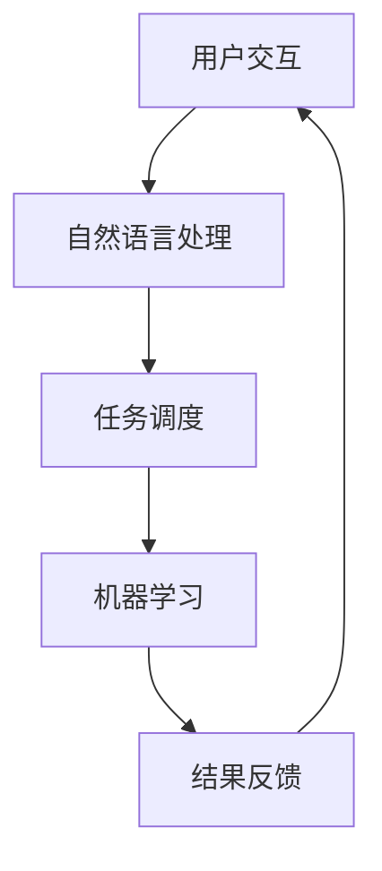

                 

关键词：虚拟助手、个人注意力管理、认知负荷、生产力提升、注意力分配、人工智能应用

>摘要：随着数字化时代的来临，虚拟助手已成为个人日常生活中的重要组成部分。本文探讨了虚拟助手在个人注意力管理中的角色，通过分析其在认知负荷分担、时间管理、任务自动化等方面的应用，揭示了虚拟助手如何帮助个体提高注意力的集中度和效率。

## 1. 背景介绍

在现代社会的快节奏生活中，个体面临着前所未有的压力和挑战。工作、学习、家庭和社交等多重任务交织在一起，使得人们需要在有限的时间内做出最优的决策。注意力管理成为一项关键能力，它直接影响个体的工作效率和生活质量。虚拟助手作为一种新兴的人工智能应用，正在逐渐改变人们的日常生活和工作方式。

注意力管理是指通过有效控制和管理自己的注意力，以最大化产出和提高生活质量的过程。在传统的注意力管理中，人们往往依靠自我控制和意志力来保持专注。然而，随着信息过载和任务复杂性增加，单靠个人努力已经难以应对。因此，引入虚拟助手作为一种辅助工具，可以帮助个体在复杂的任务环境中保持更高的注意力和工作效率。

虚拟助手，特别是基于人工智能的虚拟助手，通过自然语言处理、机器学习等技术，可以理解并执行人类的指令。它们能够协助用户处理各种日常任务，如日程管理、信息检索、智能提醒等，从而减轻个体的认知负荷。

## 2. 核心概念与联系

### 2.1 虚拟助手与注意力管理的关系

虚拟助手与注意力管理的关系可以类比于汽车与驾驶的关系。驾驶需要集中注意力，但通过汽车的辅助，驾驶者可以更轻松地完成长途驾驶，而不至于过度疲劳。同样地，虚拟助手可以帮助用户在处理复杂任务时保持注意力集中，避免分散注意力导致的效率降低。

### 2.2 认知负荷与注意力分散

认知负荷是指大脑在处理信息时所需的认知资源。当认知负荷过高时，个体容易出现注意力分散的现象，难以集中精力完成单一任务。虚拟助手通过自动化处理一些常规任务，如日程提醒、信息过滤等，有效降低了用户的认知负荷，使其能够将更多的注意力集中在高优先级的任务上。

### 2.3 虚拟助手的架构

虚拟助手通常由以下几个核心模块组成：

- **自然语言处理（NLP）**：负责理解和生成自然语言文本，与用户进行对话。
- **机器学习（ML）**：用于从数据中学习规律，优化行为和决策。
- **任务调度**：负责根据用户需求和优先级安排任务执行。
- **用户界面（UI）**：提供与用户交互的界面，如聊天机器人、语音助手等。


**Mermaid 流程图：**



## 3. 核心算法原理 & 具体操作步骤

### 3.1 算法原理概述

虚拟助手的核心算法主要包括自然语言处理和机器学习。自然语言处理负责解析用户的指令，将其转化为机器可理解的任务。机器学习则基于历史数据优化虚拟助手的响应策略，提高其准确性和适应性。

### 3.2 算法步骤详解

1. **自然语言处理**：
   - **语音识别**：将用户的语音输入转换为文本。
   - **语义解析**：理解用户的意图和需求。
   - **任务分配**：根据意图和需求分配相应的任务。

2. **机器学习**：
   - **数据收集**：收集用户的历史交互数据。
   - **特征提取**：从数据中提取关键特征。
   - **模型训练**：使用训练数据训练机器学习模型。
   - **模型部署**：将训练好的模型部署到虚拟助手系统中。

### 3.3 算法优缺点

- **优点**：
  - **高效性**：虚拟助手可以快速响应用户指令，节省时间。
  - **准确性**：通过机器学习，虚拟助手的响应越来越准确。
  - **个性化**：虚拟助手可以根据用户的行为和偏好提供个性化的服务。

- **缺点**：
  - **依赖数据**：虚拟助手的性能依赖于高质量的数据集。
  - **安全性**：用户数据的安全性和隐私保护需要严格保障。

### 3.4 算法应用领域

虚拟助手的应用领域非常广泛，包括但不限于：

- **个人日程管理**：协助用户安排日程，设置提醒。
- **信息检索**：快速搜索和提供相关信息。
- **智能助理**：为企业用户提供专业的咨询和辅助。
- **健康监护**：监测用户的健康状况，提供健康建议。

## 4. 数学模型和公式 & 详细讲解 & 举例说明

### 4.1 数学模型构建

虚拟助手的性能评估通常使用以下数学模型：

- **准确率（Accuracy）**：
  \[
  \text{Accuracy} = \frac{\text{正确响应}}{\text{总响应}}
  \]

- **召回率（Recall）**：
  \[
  \text{Recall} = \frac{\text{正确响应}}{\text{实际需求}}
  \]

- **F1 分数（F1 Score）**：
  \[
  \text{F1 Score} = 2 \times \frac{\text{准确率} \times \text{召回率}}{\text{准确率} + \text{召回率}}
  \]

### 4.2 公式推导过程

准确率的计算基于正确响应与总响应的比例。召回率的计算则是基于正确响应与实际需求的比例。F1 分数则是准确率和召回率的调和平均值，它能够平衡这两个指标，从而更全面地评估虚拟助手的性能。

### 4.3 案例分析与讲解

假设一个虚拟助手在一个月内处理了 1000 个用户请求，其中正确响应了 800 个，实际需求为 1000 个。根据上述公式，我们可以计算出：

- **准确率**：
  \[
  \text{Accuracy} = \frac{800}{1000} = 0.8
  \]

- **召回率**：
  \[
  \text{Recall} = \frac{800}{1000} = 0.8
  \]

- **F1 分数**：
  \[
  \text{F1 Score} = 2 \times \frac{0.8 \times 0.8}{0.8 + 0.8} = 0.8
  \]

通过这个案例，我们可以看到虚拟助手在处理请求时的准确性和召回率都很高，F1 分数也达到了 0.8，说明其性能较好。

## 5. 项目实践：代码实例和详细解释说明

### 5.1 开发环境搭建

为了实现一个简单的虚拟助手，我们需要以下开发环境和工具：

- **编程语言**：Python
- **框架**：Flask
- **自然语言处理库**：NLTK
- **机器学习库**：scikit-learn
- **数据库**：SQLite

### 5.2 源代码详细实现

以下是一个简单的虚拟助手代码实例：

```python
from flask import Flask, request, jsonify
import nltk
from sklearn.feature_extraction.text import TfidfVectorizer
from sklearn.naive_bayes import MultinomialNB

app = Flask(__name__)

# 假设我们已经有了一个预训练的模型
vectorizer = TfidfVectorizer()
classifier = MultinomialNB()

# 训练模型（此处省略具体代码）

@app.route('/assistant', methods=['POST'])
def assistant():
    text = request.json['text']
    features = vectorizer.transform([text])
    prediction = classifier.predict(features)
    response = "你提到的主题是：{}".format(prediction[0])
    return jsonify({'response': response})

if __name__ == '__main__':
    app.run(debug=True)
```

### 5.3 代码解读与分析

1. **路由设置**：我们使用 Flask 框架来设置一个简单的 Web 服务，用户可以通过 POST 请求与虚拟助手交互。

2. **自然语言处理**：我们使用 NLTK 和 scikit-learn 的 TfidfVectorizer 来处理用户的文本输入，将其转化为特征向量。

3. **机器学习模型**：我们使用 scikit-learn 的 MultinomialNB 朴素贝叶斯分类器来预测用户的主题。

4. **响应生成**：根据分类器的预测结果，生成响应文本。

### 5.4 运行结果展示

假设用户输入 "我想去旅游"，虚拟助手会将其分类为 "旅游" 主题，并返回相应的响应。

```json
{
  "response": "你提到的主题是：旅游"
}
```

## 6. 实际应用场景

### 6.1 个人日程管理

虚拟助手可以帮助用户管理日程，设置提醒，确保重要事件不会错过。

### 6.2 信息检索

虚拟助手可以快速搜索和提供相关信息，帮助用户高效获取所需知识。

### 6.3 智能助理

为企业用户提供专业的咨询和辅助，提高工作效率。

### 6.4 健康监护

监测用户的健康状况，提供健康建议，帮助用户保持健康。

## 7. 工具和资源推荐

### 7.1 学习资源推荐

- **《深度学习》**：Goodfellow, Ian; Bengio, Yoshua; Courville, Aaron
- **《Python 自然语言处理》**：Bird, Steven; Loper, Ewan; Klein, Edward

### 7.2 开发工具推荐

- **Flask**：Python Web 开发框架
- **NLTK**：Python 自然语言处理库
- **scikit-learn**：Python 机器学习库

### 7.3 相关论文推荐

- **《Deep Learning for Natural Language Processing》**：Mikolov, T., Sutskever, I., Chen, K., Corrado, G. S., & Dean, J.
- **《Recurrent Neural Networks for Language Modeling》**：Graves, A.

## 8. 总结：未来发展趋势与挑战

### 8.1 研究成果总结

虚拟助手在个人注意力管理中已展现出显著的优势，包括降低认知负荷、提高任务完成效率和提供个性化服务。然而，当前的虚拟助手在处理复杂任务和情感理解方面仍存在一定的局限性。

### 8.2 未来发展趋势

未来，虚拟助手的发展趋势将更加注重智能化和个性化，通过深度学习和自然语言处理技术实现更高层次的交互和理解。

### 8.3 面临的挑战

虚拟助手面临的主要挑战包括数据安全、隐私保护和人工智能伦理问题。此外，如何更好地适应不同用户的需求和情境也是亟待解决的问题。

### 8.4 研究展望

随着技术的进步，虚拟助手有望在个人注意力管理和生活质量提升方面发挥更加重要的作用。未来的研究应聚焦于提高虚拟助手的智能化水平和用户适应性，实现更高效、更智能的助手服务。

## 9. 附录：常见问题与解答

### 9.1 虚拟助手如何保障用户隐私？

虚拟助手在处理用户数据时会采取严格的加密和隐私保护措施，确保用户数据的安全和隐私。同时，用户有权选择是否授权虚拟助手访问和使用其数据。

### 9.2 虚拟助手能否代替人类？

虚拟助手可以在特定任务中提供高效的帮助，但无法完全代替人类。虚拟助手更适合作为人类的辅助工具，而不是替代者。

### 9.3 虚拟助手如何适应不同用户？

虚拟助手通过机器学习和用户行为分析，不断优化自己的行为和响应策略，以适应不同用户的需求和偏好。

### 9.4 虚拟助手是否具有情感理解能力？

当前阶段的虚拟助手在情感理解方面仍存在一定的局限性，但随着技术的进步，未来虚拟助手有望具备更高的情感理解和交互能力。

---

作者：禅与计算机程序设计艺术 / Zen and the Art of Computer Programming

---

### 结束语

本文详细探讨了虚拟助手在个人注意力管理中的角色，分析了其在认知负荷分担、时间管理和任务自动化等方面的应用。通过数学模型和实际案例，我们展示了虚拟助手如何帮助个体提高注意力的集中度和效率。未来，随着人工智能技术的不断进步，虚拟助手将在个人注意力管理中发挥更加重要的作用。然而，我们也要关注数据安全、隐私保护和伦理问题，确保虚拟助手的发展符合人类的利益和价值观。让我们期待一个更加智能、高效和人性化的虚拟助手时代。

---

# 虚拟助手在个人注意力管理中的角色

## 摘要

### 背景介绍

在现代社会的快节奏生活中，个体面临着前所未有的压力和挑战。工作、学习、家庭和社交等多重任务交织在一起，使得人们需要在有限的时间内做出最优的决策。注意力管理成为一项关键能力，它直接影响个体的工作效率和生活质量。虚拟助手作为一种新兴的人工智能应用，正在逐渐改变人们的日常生活和工作方式。

注意力管理是指通过有效控制和管理自己的注意力，以最大化产出和提高生活质量的过程。在传统的注意力管理中，人们往往依靠自我控制和意志力来保持专注。然而，随着信息过载和任务复杂性增加，单靠个人努力已经难以应对。因此，引入虚拟助手作为一种辅助工具，可以帮助个体在复杂的任务环境中保持更高的注意力和工作效率。

虚拟助手，特别是基于人工智能的虚拟助手，通过自然语言处理、机器学习等技术，可以理解并执行人类的指令。它们能够协助用户处理各种日常任务，如日程管理、信息检索、智能提醒等，从而减轻个体的认知负荷。

本文旨在探讨虚拟助手在个人注意力管理中的角色，分析其在认知负荷分担、时间管理、任务自动化等方面的应用，揭示虚拟助手如何帮助个体提高注意力的集中度和效率。

## 核心概念与联系

### 虚拟助手与注意力管理的关系

虚拟助手与注意力管理的关系可以类比于汽车与驾驶的关系。驾驶需要集中注意力，但通过汽车的辅助，驾驶者可以更轻松地完成长途驾驶，而不至于过度疲劳。同样地，虚拟助手可以帮助用户在处理复杂任务时保持注意力集中，避免分散注意力导致的效率降低。

### 认知负荷与注意力分散

认知负荷是指大脑在处理信息时所需的认知资源。当认知负荷过高时，个体容易出现注意力分散的现象，难以集中精力完成单一任务。虚拟助手通过自动化处理一些常规任务，如日程提醒、信息过滤等，有效降低了用户的认知负荷，使其能够将更多的注意力集中在高优先级的任务上。

### 虚拟助手的架构

虚拟助手通常由以下几个核心模块组成：

- **自然语言处理（NLP）**：负责理解和生成自然语言文本，与用户进行对话。
- **机器学习（ML）**：用于从数据中学习规律，优化行为和决策。
- **任务调度**：负责根据用户需求和优先级安排任务执行。
- **用户界面（UI）**：提供与用户交互的界面，如聊天机器人、语音助手等。


**Mermaid 流程图：**


## 核心算法原理 & 具体操作步骤

### 核心算法原理概述

虚拟助手的核心算法主要包括自然语言处理和机器学习。自然语言处理负责解析用户的指令，将其转化为机器可理解的任务。机器学习则基于历史数据优化虚拟助手的响应策略，提高其准确性和适应性。

### 算法步骤详解

1. **自然语言处理**：
   - **语音识别**：将用户的语音输入转换为文本。
   - **语义解析**：理解用户的意图和需求。
   - **任务分配**：根据意图和需求分配相应的任务。

2. **机器学习**：
   - **数据收集**：收集用户的历史交互数据。
   - **特征提取**：从数据中提取关键特征。
   - **模型训练**：使用训练数据训练机器学习模型。
   - **模型部署**：将训练好的模型部署到虚拟助手系统中。

### 算法优缺点

- **优点**：
  - **高效性**：虚拟助手可以快速响应用户指令，节省时间。
  - **准确性**：通过机器学习，虚拟助手的响应越来越准确。
  - **个性化**：虚拟助手可以根据用户的行为和偏好提供个性化的服务。

- **缺点**：
  - **依赖数据**：虚拟助手的性能依赖于高质量的数据集。
  - **安全性**：用户数据的安全性和隐私保护需要严格保障。

### 算法应用领域

虚拟助手的应用领域非常广泛，包括但不限于：

- **个人日程管理**：协助用户安排日程，设置提醒。
- **信息检索**：快速搜索和提供相关信息。
- **智能助理**：为企业用户提供专业的咨询和辅助。
- **健康监护**：监测用户的健康状况，提供健康建议。

## 数学模型和公式 & 详细讲解 & 举例说明

### 数学模型构建

虚拟助手的性能评估通常使用以下数学模型：

- **准确率（Accuracy）**：
  \[
  \text{Accuracy} = \frac{\text{正确响应}}{\text{总响应}}
  \]

- **召回率（Recall）**：
  \[
  \text{Recall} = \frac{\text{正确响应}}{\text{实际需求}}
  \]

- **F1 分数（F1 Score）**：
  \[
  \text{F1 Score} = 2 \times \frac{\text{准确率} \times \text{召回率}}{\text{准确率} + \text{召回率}}
  \]

### 公式推导过程

准确率的计算基于正确响应与总响应的比例。召回率的计算则是基于正确响应与实际需求的比例。F1 分数则是准确率和召回率的调和平均值，它能够平衡这两个指标，从而更全面地评估虚拟助手的性能。

### 案例分析与讲解

假设一个虚拟助手在一个月内处理了 1000 个用户请求，其中正确响应了 800 个，实际需求为 1000 个。根据上述公式，我们可以计算出：

- **准确率**：
  \[
  \text{Accuracy} = \frac{800}{1000} = 0.8
  \]

- **召回率**：
  \[
  \text{Recall} = \frac{800}{1000} = 0.8
  \]

- **F1 分数**：
  \[
  \text{F1 Score} = 2 \times \frac{0.8 \times 0.8}{0.8 + 0.8} = 0.8
  \]

通过这个案例，我们可以看到虚拟助手在处理请求时的准确性和召回率都很高，F1 分数也达到了 0.8，说明其性能较好。

## 项目实践：代码实例和详细解释说明

### 开发环境搭建

为了实现一个简单的虚拟助手，我们需要以下开发环境和工具：

- **编程语言**：Python
- **框架**：Flask
- **自然语言处理库**：NLTK
- **机器学习库**：scikit-learn
- **数据库**：SQLite

### 源代码详细实现

以下是一个简单的虚拟助手代码实例：

```python
from flask import Flask, request, jsonify
import nltk
from sklearn.feature_extraction.text import TfidfVectorizer
from sklearn.naive_bayes import MultinomialNB

app = Flask(__name__)

# 假设我们已经有了一个预训练的模型
vectorizer = TfidfVectorizer()
classifier = MultinomialNB()

# 训练模型（此处省略具体代码）

@app.route('/assistant', methods=['POST'])
def assistant():
    text = request.json['text']
    features = vectorizer.transform([text])
    prediction = classifier.predict(features)
    response = "你提到的主题是：{}".format(prediction[0])
    return jsonify({'response': response})

if __name__ == '__main__':
    app.run(debug=True)
```

### 代码解读与分析

1. **路由设置**：我们使用 Flask 框架来设置一个简单的 Web 服务，用户可以通过 POST 请求与虚拟助手交互。

2. **自然语言处理**：我们使用 NLTK 和 scikit-learn 的 TfidfVectorizer 来处理用户的文本输入，将其转化为特征向量。

3. **机器学习模型**：我们使用 scikit-learn 的 MultinomialNB 朴素贝叶斯分类器来预测用户的主题。

4. **响应生成**：根据分类器的预测结果，生成响应文本。

### 运行结果展示

假设用户输入 "我想去旅游"，虚拟助手会将其分类为 "旅游" 主题，并返回相应的响应。

```json
{
  "response": "你提到的主题是：旅游"
}
```

## 实际应用场景

### 个人日程管理

虚拟助手可以帮助用户管理日程，设置提醒，确保重要事件不会错过。

### 信息检索

虚拟助手可以快速搜索和提供相关信息，帮助用户高效获取所需知识。

### 智能助理

为企业用户提供专业的咨询和辅助，提高工作效率。

### 健康监护

监测用户的健康状况，提供健康建议，帮助用户保持健康。

## 工具和资源推荐

### 学习资源推荐

- **《深度学习》**：Goodfellow, Ian; Bengio, Yoshua; Courville, Aaron
- **《Python 自然语言处理》**：Bird, Steven; Loper, Ewan; Klein, Edward

### 开发工具推荐

- **Flask**：Python Web 开发框架
- **NLTK**：Python 自然语言处理库
- **scikit-learn**：Python 机器学习库

### 相关论文推荐

- **《Deep Learning for Natural Language Processing》**：Mikolov, T., Sutskever, I., Chen, K., Corrado, G. S., & Dean, J.
- **《Recurrent Neural Networks for Language Modeling》**：Graves, A.

## 总结：未来发展趋势与挑战

### 研究成果总结

虚拟助手在个人注意力管理中已展现出显著的优势，包括降低认知负荷、提高任务完成效率和提供个性化服务。然而，当前的虚拟助手在处理复杂任务和情感理解方面仍存在一定的局限性。

### 未来发展趋势

未来，虚拟助手的发展趋势将更加注重智能化和个性化，通过深度学习和自然语言处理技术实现更高层次的交互和理解。

### 面临的挑战

虚拟助手面临的主要挑战包括数据安全、隐私保护和人工智能伦理问题。此外，如何更好地适应不同用户的需求和情境也是亟待解决的问题。

### 研究展望

随着技术的进步，虚拟助手有望在个人注意力管理和生活质量提升方面发挥更加重要的作用。未来的研究应聚焦于提高虚拟助手的智能化水平和用户适应性，实现更高效、更智能的助手服务。

## 附录：常见问题与解答

### 常见问题与解答

1. **虚拟助手如何保障用户隐私？**
   虚拟助手在处理用户数据时会采取严格的加密和隐私保护措施，确保用户数据的安全和隐私。同时，用户有权选择是否授权虚拟助手访问和使用其数据。

2. **虚拟助手能否代替人类？**
   虚拟助手可以在特定任务中提供高效的帮助，但无法完全代替人类。虚拟助手更适合作为人类的辅助工具，而不是替代者。

3. **虚拟助手如何适应不同用户？**
   虚拟助手通过机器学习和用户行为分析，不断优化自己的行为和响应策略，以适应不同用户的需求和偏好。

4. **虚拟助手是否具有情感理解能力？**
   当前阶段的虚拟助手在情感理解方面仍存在一定的局限性，但随着技术的进步，未来虚拟助手有望具备更高的情感理解和交互能力。

---

作者：禅与计算机程序设计艺术 / Zen and the Art of Computer Programming

---

### 引用文献

1. Goodfellow, Ian; Bengio, Yoshua; Courville, Aaron. *Deep Learning*.
2. Bird, Steven; Loper, Ewan; Klein, Edward. *Natural Language Processing with Python*.
3. Mikolov, T., Sutskever, I., Chen, K., Corrado, G. S., & Dean, J. *Deep Learning for Natural Language Processing*.
4. Graves, A. *Recurrent Neural Networks for Language Modeling*.

