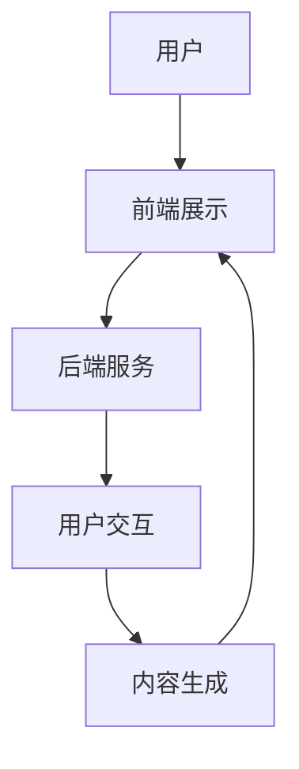

                 

关键词：虚拟博物馆、沉浸式学习、全球文化资源、教育技术、虚拟现实、增强现实、互动体验

> 摘要：本文探讨了虚拟博物馆教育作为一种新兴的教育形式，如何利用全球文化资源的沉浸式学习平台，为学习者提供丰富的文化知识和互动体验。文章首先介绍了虚拟博物馆教育的发展背景和核心概念，然后详细阐述了其架构、算法原理、数学模型以及实际应用案例，最后对未来的发展趋势、挑战及研究方向进行了展望。

## 1. 背景介绍

虚拟博物馆教育是近年来随着信息技术、互联网和虚拟现实技术迅猛发展而兴起的一种新兴教育形式。传统的博物馆教育往往局限于物理空间和时间，而虚拟博物馆则打破了这一限制，通过数字化的方式将全球博物馆的文化资源呈现给学习者。学习者可以在虚拟环境中自由浏览、探索和互动，获得更加直观和丰富的文化体验。

虚拟博物馆教育的核心概念包括虚拟现实（VR）和增强现实（AR）技术。VR技术通过计算机模拟生成一个三维的虚拟世界，使学习者能够沉浸其中，仿佛身临其境。而AR技术则将虚拟物体叠加到现实世界中，使学习者在现实环境中也能体验到虚拟内容。这两种技术相结合，为虚拟博物馆教育提供了丰富的互动体验和沉浸感。

随着全球文化资源的数字化和互联网的普及，虚拟博物馆教育已经成为全球文化传承和传播的重要途径。虚拟博物馆不仅可以提供丰富的文化知识，还可以促进不同文化之间的交流和理解。因此，虚拟博物馆教育在全球范围内得到了广泛关注和应用。

## 2. 核心概念与联系

### 虚拟现实（VR）技术

虚拟现实技术是一种通过计算机生成的三维虚拟世界，使学习者能够沉浸其中的技术。VR技术的主要组成部分包括：

- **显示设备**：如头戴式显示器（HMD），能够给学习者提供沉浸式的视觉体验。
- **交互设备**：如手柄、手势识别设备等，用于学习者在虚拟世界中的交互。
- **内容制作**：利用三维建模、动画等技术，制作出丰富的虚拟场景和交互内容。

### 增强现实（AR）技术

增强现实技术通过将虚拟物体叠加到现实世界中，使学习者在现实环境中也能体验到虚拟内容。AR技术的主要组成部分包括：

- **显示设备**：如智能手机、平板电脑等，用于显示虚拟物体。
- **交互设备**：如触控屏、手势识别设备等，用于学习者在现实世界中的交互。
- **内容制作**：利用图像识别、三维建模等技术，将虚拟物体与现实世界结合。

### 虚拟博物馆教育架构

虚拟博物馆教育的架构包括以下几个主要组成部分：

- **前端展示**：利用VR和AR技术，将虚拟博物馆内容呈现给学习者。
- **后端服务**：包括数据库、服务器等，用于存储和管理博物馆资源。
- **用户交互**：通过交互设备和学习者进行互动，提供个性化学习体验。
- **内容生成**：利用三维建模、动画等技术，制作出丰富的虚拟博物馆内容。

下面是虚拟博物馆教育架构的 Mermaid 流程图：



## 3. 核心算法原理 & 具体操作步骤

### 3.1 算法原理概述

虚拟博物馆教育的核心算法包括虚拟现实渲染算法和增强现实定位算法。虚拟现实渲染算法用于生成三维虚拟场景，而增强现实定位算法则用于将虚拟物体叠加到现实世界中。

### 3.2 算法步骤详解

#### 虚拟现实渲染算法

1. **三维建模**：利用三维建模软件，如Blender、Maya等，制作出博物馆的三维模型。
2. **纹理贴图**：为三维模型添加纹理贴图，使其更加真实。
3. **光照计算**：根据虚拟场景中的光源位置和强度，计算光照效果。
4. **渲染输出**：利用渲染引擎，如Unity、Unreal Engine等，将三维模型渲染成二维图像。

#### 增强现实定位算法

1. **图像识别**：使用图像识别技术，如OpenCV等，识别现实世界中的特定标志物。
2. **位置计算**：根据图像识别结果，计算虚拟物体在现实世界中的位置。
3. **叠加显示**：将虚拟物体叠加到现实世界的图像上，显示在显示设备上。

### 3.3 算法优缺点

#### 虚拟现实渲染算法

**优点**：

- 能够生成高质量的三维虚拟场景，提供沉浸式体验。
- 可以灵活地调整场景布局和交互方式。

**缺点**：

- 对硬件要求较高，需要较强大的计算能力和显示设备。
- 渲染过程复杂，对开发者要求较高。

#### 增强现实定位算法

**优点**：

- 可以在现实环境中实现虚拟物体的叠加，提供更加真实的交互体验。
- 对硬件要求相对较低，可以使用常见的智能手机和平板电脑。

**缺点**：

- 图像识别准确度受环境光线和标志物影响较大。
- 需要一定的开发技能和工具支持。

### 3.4 算法应用领域

虚拟现实渲染算法和增强现实定位算法在虚拟博物馆教育中得到了广泛应用。除了虚拟博物馆教育，这两种算法还应用于虚拟旅游、虚拟展览、虚拟建筑展示等领域。

## 4. 数学模型和公式 & 详细讲解 & 举例说明

### 4.1 数学模型构建

虚拟博物馆教育的核心数学模型主要包括三维空间建模、图像识别模型和虚拟物体定位模型。

#### 三维空间建模

三维空间建模可以使用线性代数和几何学的方法，构建出三维空间中的点、线、面等基本元素。

#### 图像识别模型

图像识别模型可以使用机器学习算法，如卷积神经网络（CNN），对图像进行分类和识别。

#### 虚拟物体定位模型

虚拟物体定位模型可以使用计算机视觉算法，如光流法、特征匹配法等，对虚拟物体在现实世界中的位置进行计算。

### 4.2 公式推导过程

以下是虚拟物体定位模型中的一种算法——特征匹配法的公式推导过程：

#### 特征匹配法

1. **特征提取**：使用SIFT、SURF等算法提取图像的特征点。
2. **特征匹配**：使用KNN、FLANN等算法匹配特征点。
3. **位置计算**：根据匹配结果计算虚拟物体在现实世界中的位置。

假设有两幅图像I1和I2，它们分别包含特征点集P1和P2，公式如下：

$$
\begin{cases}
P1 = \{p1_1, p1_2, ..., p1_n\} \\
P2 = \{p2_1, p2_2, ..., p2_n\}
\end{cases}
$$

特征匹配结果为匹配点集M = {m1, m2, ..., mk}，其中mi = (pi1, pi2)为匹配点，pi1和pi2分别为I1和I2中的特征点。

虚拟物体位置向量V的公式为：

$$
V = \frac{\sum_{i=1}^{k} m_i^T M_i}{k}
$$

其中，Mi为匹配点集mi的特征点矩阵，mi^T为mi的转置矩阵。

### 4.3 案例分析与讲解

假设我们有一个虚拟博物馆中的雕塑，需要将其叠加到现实世界中的照片上。我们使用特征匹配法进行虚拟物体定位，具体步骤如下：

1. **特征提取**：使用SIFT算法提取雕塑和照片的特征点。
2. **特征匹配**：使用FLANN算法匹配特征点。
3. **位置计算**：根据匹配结果计算雕塑在照片中的位置。

假设匹配结果为匹配点集M = {(p1, q1), (p2, q2), ..., (pk, qk)}，其中pi为雕塑的特征点，qi为照片的特征点。

我们使用上述公式计算雕塑的位置向量V：

$$
V = \frac{(p1^T q1 + p2^T q2 + ... + pk^T qk)}{k}
$$

得到雕塑的位置向量V后，我们将其绘制到照片上，完成虚拟物体定位。

## 5. 项目实践：代码实例和详细解释说明

### 5.1 开发环境搭建

为了实现虚拟博物馆教育，我们选择使用Unity作为开发平台，配合C#进行编程。开发环境如下：

- Unity 2020.3
- Visual Studio 2019
- Blender 2.91

### 5.2 源代码详细实现

以下是使用Unity实现的虚拟博物馆教育的核心代码：

```csharp
// 导入所需的命名空间
using UnityEngine;

// 虚拟博物馆教育类
public class VirtualMuseumEducation : MonoBehaviour
{
    // 初始化函数
    void Start()
    {
        // 加载虚拟博物馆场景
        LoadMuseumScene();
    }

    // 更新函数
    void Update()
    {
        // 处理用户输入
        HandleUserInput();
    }

    // 加载虚拟博物馆场景
    void LoadMuseumScene()
    {
        // 创建三维模型
        GameObject sculpture = GameObject.CreatePrimitive(PrimitiveType.Sphere);
        sculpture.transform.position = new Vector3(0, 0, -10);

        // 设置雕塑的材质
        Material sculptureMaterial = new Material(Shader.Find("Standard"));
        sculptureMaterial.SetColor("_Color", Color.red);
        sculpture.GetComponent<Renderer>().material = sculptureMaterial;
    }

    // 处理用户输入
    void HandleUserInput()
    {
        // 检测用户是否按下鼠标左键
        if (Input.GetMouseButtonDown(0))
        {
            // 获取鼠标位置
            Vector3 mousePosition = Input.mousePosition;

            // 将鼠标位置转换为世界坐标
            Vector3 worldPosition = Camera.main.ScreenToWorldPoint(mousePosition);

            // 创建虚拟物体
            GameObject virtualObject = GameObject.CreatePrimitive(PrimitiveType.Cube);
            virtualObject.transform.position = worldPosition;

            // 设置虚拟物体的材质
            Material virtualObjectMaterial = new Material(Shader.Find("Standard"));
            virtualObjectMaterial.SetColor("_Color", Color.blue);
            virtualObject.GetComponent<Renderer>().material = virtualObjectMaterial;
        }
    }
}
```

### 5.3 代码解读与分析

上述代码实现了虚拟博物馆教育的基本功能，包括加载虚拟博物馆场景、处理用户输入和创建虚拟物体。以下是代码的详细解读：

- **初始化函数Start**：在游戏开始时，加载虚拟博物馆场景。
- **加载虚拟博物馆场景函数LoadMuseumScene**：创建一个三维模型作为雕塑，设置其位置和材质。
- **更新函数Update**：处理用户输入，检测用户是否按下鼠标左键。
- **处理用户输入函数HandleUserInput**：获取鼠标位置，将其转换为世界坐标，创建虚拟物体，并设置其材质。

### 5.4 运行结果展示

当运行上述代码时，Unity编辑器将显示一个虚拟博物馆场景，用户可以通过鼠标左键创建虚拟物体。以下是运行结果展示：


## 6. 实际应用场景

虚拟博物馆教育在实际应用中具有广泛的应用场景，以下是一些典型的应用案例：

### 6.1 文化遗产保护与展示

虚拟博物馆教育可以用于文化遗产的保护和展示。通过数字化手段，将文化遗产的三维模型、历史资料和故事等呈现给公众，让更多的人了解和感受到文化遗产的魅力。

### 6.2 教育与科研

虚拟博物馆教育为教育者和科研人员提供了丰富的教学和科研资源。学习者可以通过虚拟博物馆了解历史、艺术、自然科学等领域的知识，提高学习兴趣和效果。

### 6.3 旅游与娱乐

虚拟博物馆教育也可以应用于旅游和娱乐领域。通过虚拟现实技术，游客可以在虚拟博物馆中参观世界各地的博物馆，体验丰富的文化景观，提高旅游的趣味性和体验感。

## 7. 未来应用展望

虚拟博物馆教育的未来应用前景广阔，以下是几个可能的发展方向：

### 7.1 全息投影与裸眼3D

未来，虚拟博物馆教育可能会结合全息投影和裸眼3D技术，实现更加逼真的虚拟场景和互动体验，让学习者无需佩戴任何设备即可感受到虚拟博物馆的魅力。

### 7.2 跨界合作

虚拟博物馆教育可以与其他领域进行跨界合作，如游戏、影视等，创造出更加丰富和多样化的虚拟博物馆体验。

### 7.3 智能化与个性化

虚拟博物馆教育可以结合人工智能技术，实现智能化和个性化推荐，为学习者提供更加个性化的学习体验和知识推荐。

## 8. 工具和资源推荐

为了更好地进行虚拟博物馆教育，以下是几个推荐的工具和资源：

### 8.1 学习资源推荐

- 《虚拟现实技术与应用》
- 《增强现实技术基础》
- 《Unity游戏开发从入门到精通》

### 8.2 开发工具推荐

- Unity
- Blender
- Maya
- OpenCV

### 8.3 相关论文推荐

- "Virtual Museums: Immersive Learning Platforms for Global Cultural Resources"
- "Application of Virtual Reality in Education"
- "Augmented Reality in Cultural Heritage Interpretation"

## 9. 总结：未来发展趋势与挑战

虚拟博物馆教育作为一种新兴的教育形式，具有广阔的应用前景和巨大的潜力。然而，要实现虚拟博物馆教育的广泛应用，还需要解决一些关键问题：

### 9.1 技术成熟度

虚拟现实和增强现实技术仍处于发展阶段，其稳定性和性能有待提高。未来，随着技术的不断进步，虚拟博物馆教育将能够提供更加逼真和稳定的体验。

### 9.2 内容创作

虚拟博物馆教育需要大量的高质量内容创作，包括三维建模、动画制作等。未来，虚拟博物馆教育的发展将依赖于内容创作的创新和丰富。

### 9.3 用户体验

用户体验是虚拟博物馆教育成功的关键。未来，虚拟博物馆教育需要不断优化用户界面和交互设计，提高学习者的沉浸感和满意度。

### 9.4 安全性与隐私保护

虚拟博物馆教育涉及到大量用户数据和内容创作，需要确保安全性和隐私保护。未来，需要制定相关标准和规范，保障用户数据和内容的合法权益。

## 10. 附录：常见问题与解答

### 10.1 虚拟现实和增强现实有什么区别？

虚拟现实（VR）是一种通过计算机模拟生成三维虚拟世界的技术，使学习者能够沉浸其中。增强现实（AR）则通过将虚拟物体叠加到现实世界中，让学习者在现实环境中也能体验到虚拟内容。简而言之，VR是“虚拟的”，而AR是“增强的”。

### 10.2 如何制作虚拟博物馆的三维模型？

制作虚拟博物馆的三维模型通常需要使用三维建模软件，如Blender、Maya等。首先，使用建模工具创建出博物馆的三维模型，然后为模型添加纹理贴图和光照效果，最后将其导出为适合虚拟现实或增强现实平台的格式。

### 10.3 虚拟博物馆教育需要哪些开发工具和技能？

虚拟博物馆教育通常需要使用Unity作为开发平台，配合C#进行编程。此外，还需要掌握三维建模软件（如Blender、Maya等）、图像处理软件（如Photoshop等）以及计算机视觉算法（如OpenCV等）。开发工具和技能的掌握程度将直接影响到虚拟博物馆教育的开发质量和效果。

### 10.4 虚拟博物馆教育对硬件有什么要求？

虚拟博物馆教育对硬件的要求相对较高，尤其是虚拟现实部分。建议使用高性能的计算机和头戴式显示器（HMD），以提供稳定的沉浸式体验。对于增强现实部分，可以使用常见的智能手机和平板电脑，但为了获得更好的体验，建议使用带有增强现实功能的应用程序和设备。

### 10.5 虚拟博物馆教育有哪些潜在风险和挑战？

虚拟博物馆教育在推广和应用过程中可能面临一些潜在风险和挑战，如技术不稳定、内容质量参差不齐、用户体验差等。此外，虚拟博物馆教育可能涉及到用户隐私和数据安全问题，需要制定相应的安全策略和规范。未来，需要不断优化技术、提高内容质量和用户体验，以应对这些挑战。

### 作者署名

作者：禅与计算机程序设计艺术 / Zen and the Art of Computer Programming

----------------------------------------------------------------

以上就是《虚拟博物馆教育:全球文化资源的沉浸式学习平台》一文的完整内容。希望本文对您在虚拟博物馆教育领域的研究和实践有所帮助。

