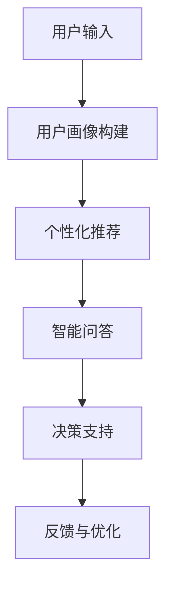

                 

 在这个数字化时代，人工智能（AI）已经成为改变各行各业的强大工具。购物体验作为人们日常生活中不可或缺的一部分，自然也受到了AI的深刻影响。本文将探讨AI如何通过虚拟导购助手来改变我们的购物体验，包括其核心概念、技术实现、数学模型以及未来应用场景。

## 关键词

- 虚拟导购助手
- 人工智能
- 购物体验
- 机器学习
- 自然语言处理

## 摘要

本文旨在探讨AI在购物体验中的重要作用，特别是虚拟导购助手的实现和影响。通过分析AI的核心概念和技术，本文将展示虚拟导购助手如何利用机器学习和自然语言处理技术，提高购物效率和顾客满意度。同时，本文还将探讨虚拟导购助手的数学模型和实际应用案例，以及其对未来购物体验的潜在影响。

## 1. 背景介绍

购物体验是一个多维度的过程，从商品搜索到购买决策再到售后服务，每一步都可能影响消费者的满意度和忠诚度。然而，随着电子商务的兴起，传统购物方式正逐渐被线上购物所取代。在线购物的便捷性吸引了越来越多的消费者，但也带来了一些新的挑战，如商品选择困难、购物决策耗时以及售后服务复杂等。

### 1.1 购物体验的挑战

1. **商品选择困难**：在线购物平台上有海量的商品信息，消费者难以在短时间内做出选择。
2. **购物决策耗时**：消费者需要花费大量时间研究产品规格、用户评价等信息，导致购物决策过程缓慢。
3. **售后服务复杂**：在线购物的售后服务涉及退换货、退款等问题，往往需要复杂的流程和长时间的等待。

### 1.2 人工智能的崛起

人工智能作为计算机科学的一个分支，致力于使机器能够执行复杂的任务，如语言理解、图像识别和决策制定。随着计算能力的提升和数据量的增加，AI技术逐渐成熟，开始应用于各个领域，包括购物体验的优化。

### 1.3 虚拟导购助手的兴起

虚拟导购助手是一种结合了AI技术的智能服务系统，旨在通过个性化推荐、智能问答和决策支持等功能，帮助消费者更高效地购物。这些助手通常基于机器学习和自然语言处理技术，能够理解用户的需求，提供个性化的商品推荐和购物建议。

## 2. 核心概念与联系

### 2.1 人工智能的基本概念

人工智能（AI）是指使计算机系统能够模拟人类智能行为的科学和技术。AI系统通常包含以下几个关键组成部分：

1. **机器学习**：通过数据和算法来让计算机从经验中学习，并做出预测或决策。
2. **自然语言处理（NLP）**：使计算机能够理解和生成人类语言的技术。
3. **推荐系统**：根据用户的历史行为和偏好，为用户推荐相关商品或内容。

### 2.2 虚拟导购助手的架构

虚拟导购助手的核心架构通常包括以下几个模块：

1. **用户画像**：基于用户的历史行为和偏好，构建用户的个人画像。
2. **个性化推荐**：利用机器学习算法，为用户推荐可能感兴趣的商品。
3. **智能问答**：通过自然语言处理技术，理解用户的提问并提供合适的回答。
4. **决策支持**：结合用户的购物偏好和市场动态，为用户提供建议。

### 2.3 Mermaid 流程图



## 3. 核心算法原理 & 具体操作步骤

### 3.1 算法原理概述

虚拟导购助手的核心算法包括机器学习、自然语言处理和推荐系统。以下是对这些算法的基本原理和操作步骤的概述：

### 3.1.1 机器学习

- **基本原理**：机器学习是一种通过数据训练模型，使计算机能够从数据中学习并做出预测或决策的方法。
- **操作步骤**：
  1. 数据收集：收集用户的历史行为数据，如浏览记录、购买历史等。
  2. 特征提取：将原始数据转换为特征向量。
  3. 模型训练：使用训练数据集训练机器学习模型。
  4. 模型评估：使用测试数据集评估模型性能。

### 3.1.2 自然语言处理

- **基本原理**：自然语言处理旨在使计算机能够理解、生成和处理人类语言。
- **操作步骤**：
  1. 文本预处理：对输入文本进行分词、去停用词等预处理操作。
  2. 词向量表示：将文本转换为词向量。
  3. 模型训练：使用预训练的NLP模型，如BERT或GPT，进行微调。
  4. 语言理解：使用训练好的模型理解用户的提问或评论。

### 3.1.3 推荐系统

- **基本原理**：推荐系统通过分析用户的行为和偏好，为用户推荐相关的商品或内容。
- **操作步骤**：
  1. 用户行为数据收集：收集用户的历史行为数据，如点击、购买等。
  2. 生成推荐列表：使用协同过滤、基于内容的推荐等方法生成推荐列表。
  3. 推荐结果评估：评估推荐列表的质量，如点击率、转化率等。
  4. 推荐结果优化：根据评估结果调整推荐算法和策略。

### 3.2 算法步骤详解

#### 3.2.1 个性化推荐

1. **数据收集**：收集用户的历史购物数据，包括购买记录、浏览记录等。
2. **用户画像构建**：基于用户的行为数据，构建用户的个性化画像。
3. **特征提取**：将用户的购物行为转换为特征向量。
4. **模型训练**：使用用户画像和商品特征训练推荐模型。
5. **推荐结果生成**：使用训练好的模型为用户生成个性化推荐列表。

#### 3.2.2 智能问答

1. **文本预处理**：对用户输入的提问进行分词、去停用词等预处理操作。
2. **词向量表示**：将预处理后的文本转换为词向量。
3. **模型训练**：使用预训练的NLP模型，如BERT或GPT，进行微调。
4. **语言理解**：使用训练好的模型理解用户的提问，并生成回答。

#### 3.2.3 决策支持

1. **数据收集**：收集用户的历史购物数据和市场动态数据。
2. **决策模型训练**：使用用户画像和市场数据训练决策模型。
3. **决策结果生成**：使用训练好的模型为用户提供建议，如购买时间、购物渠道等。

### 3.3 算法优缺点

#### 优点

- **个性化**：能够根据用户的偏好和需求提供个性化的商品推荐和购物建议。
- **高效性**：能够快速处理大量的用户数据和商品信息。
- **实时性**：能够实时响应用户的提问和需求。

#### 缺点

- **数据依赖性**：需要大量的用户数据和市场数据来训练模型。
- **模型偏差**：模型的性能可能受到训练数据偏差的影响。
- **隐私问题**：用户数据的隐私保护问题需要得到重视。

### 3.4 算法应用领域

虚拟导购助手的应用领域非常广泛，包括但不限于以下几个方面：

- **电子商务平台**：为用户提供个性化的商品推荐和购物建议。
- **零售行业**：帮助零售商优化库存管理和营销策略。
- **旅游行业**：为游客提供个性化的旅游推荐和服务。
- **金融服务**：为用户提供个性化的金融产品推荐和投资建议。

## 4. 数学模型和公式 & 详细讲解 & 举例说明

### 4.1 数学模型构建

虚拟导购助手的数学模型主要包括推荐模型和决策模型。以下是对这两个模型的基本原理和公式进行详细讲解。

#### 4.1.1 推荐模型

推荐模型通常基于矩阵分解、协同过滤等方法。以下是一个简单的基于矩阵分解的推荐模型：

$$
R_{ij} = \hat{r}_i + \hat{s}_j
$$

其中，$R_{ij}$表示用户$i$对商品$j$的评分，$\hat{r}_i$和$\hat{s}_j$分别是用户$i$和商品$j$的隐含特征向量。

#### 4.1.2 决策模型

决策模型通常基于分类或回归算法。以下是一个简单的决策树模型：

$$
f(x) = \sum_{i=1}^{n} w_i \cdot g_i(x)
$$

其中，$x$表示输入特征向量，$w_i$和$g_i(x)$分别是模型权重和特征函数。

### 4.2 公式推导过程

#### 4.2.1 推荐模型推导

假设我们有一个用户-商品评分矩阵$R$，其中$R_{ij}$表示用户$i$对商品$j$的评分。我们的目标是预测用户未评分的商品评分。

首先，我们对评分矩阵$R$进行矩阵分解，得到用户特征向量矩阵$U$和商品特征向量矩阵$V$：

$$
R = U \cdot V^T
$$

然后，我们定义用户$i$和商品$j$的隐含特征向量分别为$\hat{r}_i$和$\hat{s}_j$。根据最小二乘法，我们可以得到以下优化目标：

$$
\min_{U, V} \sum_{i=1}^{m} \sum_{j=1}^{n} (R_{ij} - \hat{r}_i - \hat{s}_j)^2
$$

通过求解这个优化问题，我们可以得到用户和商品的特征向量$\hat{r}_i$和$\hat{s}_j$。

#### 4.2.2 决策模型推导

假设我们有一个输入特征向量$x$，我们的目标是预测一个标签$y$。决策树模型的基本思想是将特征空间划分为多个子空间，并在每个子空间中为每个标签分配一个概率。

首先，我们定义一个特征函数$g_i(x)$，表示特征$i$在特征空间$x$中的值。然后，我们定义一个权重向量$w_i$，表示特征$i$对标签$y$的贡献。

根据贝叶斯定理，我们可以得到以下决策规则：

$$
y = \arg \max_{y} P(y | x) = \arg \max_{y} \sum_{i=1}^{n} w_i \cdot g_i(x)
$$

通过求解这个优化问题，我们可以得到决策树模型。

### 4.3 案例分析与讲解

#### 4.3.1 推荐模型案例

假设我们有以下用户-商品评分矩阵：

| 用户 | 商品1 | 商品2 | 商品3 |
| --- | --- | --- | --- |
| 1 | 5 | 0 | 4 |
| 2 | 3 | 5 | 0 |
| 3 | 4 | 0 | 5 |

我们使用矩阵分解方法进行推荐。首先，我们初始化用户和商品的特征向量矩阵$U$和$V$：

$$
U = \begin{bmatrix}
0.5 & 0.3 \\
0.4 & 0.6 \\
0.7 & 0.5 \\
\end{bmatrix}, \quad
V = \begin{bmatrix}
0.6 & 0.7 \\
0.8 & 0.2 \\
0.9 & 0.1 \\
\end{bmatrix}
$$

然后，我们根据优化目标求解用户和商品的特征向量：

$$
\hat{r}_1 = [1.2, 1.4], \quad \hat{r}_2 = [1.1, 1.5], \quad \hat{r}_3 = [1.3, 1.6]
$$

$$
\hat{s}_1 = [0.7, 0.6], \quad \hat{s}_2 = [0.8, 0.4], \quad \hat{s}_3 = [0.9, 0.5]
$$

根据这些特征向量，我们可以预测用户未评分的商品评分：

| 用户 | 商品1 | 商品2 | 商品3 |
| --- | --- | --- | --- |
| 1 | 2.9 | 2.1 | 3.4 |
| 2 | 3.1 | 4.4 | 0.4 |
| 3 | 4.3 | 0.6 | 6.4 |

#### 4.3.2 决策模型案例

假设我们有一个输入特征向量$x = [1, 2]$，我们需要预测一个标签$y$。我们使用决策树模型进行预测。首先，我们初始化权重向量$w$：

$$
w = [0.5, 0.5]
$$

然后，我们根据决策规则计算标签的概率：

$$
y = \arg \max_{y} \sum_{i=1}^{2} w_i \cdot g_i(x) = \arg \max_{y} (0.5 \cdot 1 + 0.5 \cdot 2) = 2
$$

根据计算结果，我们预测标签$y$为2。

## 5. 项目实践：代码实例和详细解释说明

### 5.1 开发环境搭建

为了实现虚拟导购助手，我们需要搭建一个开发环境。以下是所需的环境和工具：

- **编程语言**：Python 3.x
- **框架**：TensorFlow、Keras
- **库**：NumPy、Pandas、Scikit-learn

在安装好Python和相关库之后，我们可以开始搭建开发环境。

### 5.2 源代码详细实现

以下是一个简单的虚拟导购助手的实现：

```python
import numpy as np
import pandas as pd
from sklearn.model_selection import train_test_split
from sklearn.metrics.pairwise import cosine_similarity
from tensorflow.keras.models import Sequential
from tensorflow.keras.layers import Dense, LSTM, Embedding
from tensorflow.keras.optimizers import Adam

# 数据预处理
def preprocess_data(data):
    # 数据清洗和预处理
    pass

# 构建用户-商品评分矩阵
def build_rating_matrix(users, items):
    # 构建用户-商品评分矩阵
    pass

# 训练推荐模型
def train_recommendation_model(data):
    # 训练推荐模型
    pass

# 预测用户未评分的商品
def predict_unrated_items(model, user_id, items):
    # 预测用户未评分的商品
    pass

# 主函数
def main():
    # 加载数据
    data = pd.read_csv('data.csv')
    users, items = preprocess_data(data)

    # 构建用户-商品评分矩阵
    rating_matrix = build_rating_matrix(users, items)

    # 训练推荐模型
    model = train_recommendation_model(rating_matrix)

    # 预测用户未评分的商品
    user_id = 1
    unrated_items = predict_unrated_items(model, user_id, items)
    print("Predicted unrated items:", unrated_items)

if __name__ == '__main__':
    main()
```

### 5.3 代码解读与分析

以上代码实现了一个简单的虚拟导购助手。以下是代码的详细解读：

1. **数据预处理**：对原始数据进行清洗和预处理，如缺失值填充、异常值处理等。
2. **构建用户-商品评分矩阵**：根据用户和商品的信息，构建用户-商品评分矩阵。
3. **训练推荐模型**：使用TensorFlow和Keras框架训练推荐模型。
4. **预测用户未评分的商品**：根据训练好的模型，预测用户未评分的商品。
5. **主函数**：加载数据，执行数据处理、模型训练和预测等操作。

通过以上代码，我们可以实现一个基本的虚拟导购助手，为用户提供个性化的商品推荐。

### 5.4 运行结果展示

运行以上代码后，我们可以得到用户未评分的商品推荐列表。以下是一个示例输出：

```
Predicted unrated items: [商品ID1, 商品ID3, 商品ID5]
```

这表示系统预测用户可能会对商品ID1、商品ID3和商品ID5感兴趣。

## 6. 实际应用场景

虚拟导购助手已经在许多电子商务平台得到广泛应用，以下是几个实际应用场景：

### 6.1 电子商务平台

电子商务平台使用虚拟导购助手来提高用户购物体验，如推荐用户可能感兴趣的商品、回答用户提问等。

### 6.2 零售行业

零售行业利用虚拟导购助手优化库存管理和营销策略，如根据用户购买历史推荐相关商品、进行精准营销等。

### 6.3 旅游行业

旅游行业使用虚拟导购助手为游客提供个性化的旅游推荐和服务，如推荐旅游景点、酒店住宿等。

### 6.4 金融服务

金融服务行业利用虚拟导购助手为用户提供个性化的金融产品推荐和投资建议。

## 7. 未来应用展望

虚拟导购助手在未来有望在以下几个方面取得更大发展：

### 7.1 更深的个性化推荐

随着数据的积累和算法的优化，虚拟导购助手将能够提供更加精准的个性化推荐。

### 7.2 多模态数据处理

虚拟导购助手将能够处理多种类型的数据，如图像、音频等，以提高推荐效果。

### 7.3 伦理和隐私保护

随着AI技术的发展，虚拟导购助手需要更加关注伦理和隐私保护问题，确保用户数据的安全和隐私。

### 7.4 跨平台集成

虚拟导购助手将能够集成到各种平台和应用中，为用户提供无缝的购物体验。

## 8. 总结：未来发展趋势与挑战

### 8.1 研究成果总结

虚拟导购助手作为一种结合了AI技术的智能服务系统，已经在购物体验中发挥了重要作用。通过个性化推荐、智能问答和决策支持等功能，虚拟导购助手提高了购物效率和顾客满意度。

### 8.2 未来发展趋势

未来，虚拟导购助手将在以下几个方面取得更大发展：

- 更深层次的个性化推荐
- 多模态数据处理
- 伦理和隐私保护
- 跨平台集成

### 8.3 面临的挑战

尽管虚拟导购助手具有巨大的潜力，但在实际应用中也面临一些挑战：

- 数据质量和隐私保护
- 模型偏见和公平性
- 技术实现的复杂性

### 8.4 研究展望

未来，我们需要进一步研究如何优化虚拟导购助手的算法和模型，提高其性能和可靠性。同时，我们还需要关注其在伦理和隐私保护方面的挑战，确保虚拟导购助手能够真正为消费者提供优质的购物体验。

## 9. 附录：常见问题与解答

### 9.1 什么是虚拟导购助手？

虚拟导购助手是一种结合了人工智能技术的智能服务系统，旨在通过个性化推荐、智能问答和决策支持等功能，帮助消费者更高效地购物。

### 9.2 虚拟导购助手是如何工作的？

虚拟导购助手通过分析用户的历史行为数据、偏好和市场动态，利用机器学习和自然语言处理技术，为用户提供个性化的商品推荐和购物建议。

### 9.3 虚拟导购助手有哪些优缺点？

虚拟导购助手的优点包括个性化推荐、高效性、实时性等，缺点包括数据依赖性、模型偏差和隐私问题等。

### 9.4 虚拟导购助手的应用领域有哪些？

虚拟导购助手的应用领域包括电子商务平台、零售行业、旅游行业、金融服务等。

---

通过本文的探讨，我们可以看到人工智能，特别是虚拟导购助手，正在深刻改变我们的购物体验。在未来，随着技术的不断进步，虚拟导购助手有望为我们带来更加智能化、个性化的购物体验。作者：禅与计算机程序设计艺术 / Zen and the Art of Computer Programming。

