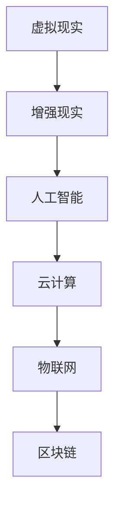

                 

关键词：虚拟工作空间，AI技术，职场革命，工作方式，协作工具，技术架构，未来趋势

> 摘要：本文将探讨在人工智能技术的推动下，虚拟工作空间如何改变传统职场模式，带来前所未有的职场革命。通过深入分析核心概念、算法原理、数学模型、实践案例以及未来展望，本文旨在为读者揭示虚拟工作空间的无限潜力与挑战。

## 1. 背景介绍

### 工作方式的演变

回顾历史，工作方式经历了从手工作业到机械化生产，再到信息化时代的转变。然而，随着人工智能技术的飞速发展，我们正迈向一个全新的工作时代——虚拟工作空间。虚拟工作空间不仅改变了传统的工作模式，还提供了前所未有的高效协作和智能化服务。

### 人工智能的发展

人工智能（AI）技术的发展为虚拟工作空间带来了革命性的变革。从最初的机器学习、深度学习，到如今的自然语言处理、计算机视觉，AI技术在各个领域取得了显著成果。通过自动化和智能化，AI为虚拟工作空间提供了强大的支持，使工作更加高效和便捷。

### 虚拟工作空间的兴起

虚拟工作空间的兴起得益于云计算、物联网、区块链等技术的发展。这些技术为虚拟工作空间提供了强大的基础设施支持，使得人们可以在任何时间、任何地点进行高效的协作和办公。虚拟工作空间不仅突破了地理限制，还实现了工作流程的智能化和自动化。

## 2. 核心概念与联系

为了更好地理解虚拟工作空间，我们需要先了解以下几个核心概念：

### 虚拟现实（VR）

虚拟现实技术通过计算机生成的三维环境，为用户提供了沉浸式体验。在虚拟工作空间中，VR技术可以模拟真实的工作场景，提高员工的协作效率和参与感。

### 增强现实（AR）

增强现实技术通过在现实世界中叠加虚拟信息，为用户提供了增强现实体验。在虚拟工作空间中，AR技术可以实时显示工作信息，提高工作效率。

### 人工智能（AI）

人工智能技术通过自动化和智能化，为虚拟工作空间提供了强大的支持。从智能助手到自动化流程，AI技术使得虚拟工作空间更加高效和便捷。

### 云计算

云计算技术为虚拟工作空间提供了强大的计算能力和存储资源。通过云计算，虚拟工作空间可以实现大规模的数据处理和存储，为协作提供有力支持。

### 物联网（IoT）

物联网技术通过将物理设备连接到互联网，为虚拟工作空间提供了实时数据和远程监控能力。在虚拟工作空间中，物联网技术可以实时监测设备状态，提高工作效率。

### 区块链

区块链技术为虚拟工作空间提供了去中心化的数据管理和安全保障。在虚拟工作空间中，区块链技术可以确保数据的安全性和透明度。

### Mermaid 流程图



## 3. 核心算法原理 & 具体操作步骤

### 3.1 算法原理概述

虚拟工作空间的核心算法主要涉及以下几个方面：

1. **协作算法**：通过分布式算法实现团队成员之间的实时协作，提高工作效率。
2. **调度算法**：根据任务优先级和资源状况，智能调度任务，优化资源利用。
3. **推荐算法**：根据用户行为和偏好，为用户提供个性化的工作建议和推荐。
4. **安全算法**：确保虚拟工作空间中的数据安全和隐私保护。

### 3.2 算法步骤详解

#### 3.2.1 协作算法

1. **任务分配**：根据团队成员的能力和任务需求，智能分配任务。
2. **实时通信**：通过即时通讯工具，实现团队成员之间的实时沟通和协作。
3. **协同编辑**：使用共享编辑工具，实现团队成员对文档、代码等的实时协作。
4. **任务追踪**：通过任务管理系统，实时追踪任务进展，确保项目进度。

#### 3.2.2 调度算法

1. **任务评估**：根据任务优先级、难度和资源需求，对任务进行评估。
2. **资源调度**：根据资源状况，智能调度任务，优化资源利用。
3. **负载均衡**：通过负载均衡算法，确保任务均匀分布在团队成员之间，避免过度负载。

#### 3.2.3 推荐算法

1. **用户画像**：根据用户行为和偏好，构建用户画像。
2. **推荐模型**：使用机器学习算法，为用户提供个性化推荐。
3. **推荐反馈**：根据用户反馈，不断优化推荐模型。

#### 3.2.4 安全算法

1. **身份认证**：使用多因素认证，确保用户身份的合法性。
2. **数据加密**：使用加密算法，确保数据传输的安全性。
3. **隐私保护**：通过隐私保护算法，确保用户隐私不被泄露。

### 3.3 算法优缺点

#### 3.3.1 协作算法

**优点**：提高协作效率，减少沟通成本，实现实时协作。

**缺点**：需要强大的网络支持，对网络质量要求较高。

#### 3.3.2 调度算法

**优点**：优化资源利用，提高任务完成率。

**缺点**：需要实时获取资源状态，对系统性能要求较高。

#### 3.3.3 推荐算法

**优点**：提高用户体验，提供个性化服务。

**缺点**：需要大量数据支持，对数据处理能力要求较高。

#### 3.3.4 安全算法

**优点**：确保数据安全和用户隐私。

**缺点**：可能影响系统性能，增加开发成本。

### 3.4 算法应用领域

虚拟工作空间的核心算法广泛应用于各个领域，包括：

1. **远程办公**：通过协作算法和调度算法，实现远程办公的高效协作。
2. **项目管理**：通过推荐算法，为项目经理提供个性化推荐，优化项目进度。
3. **智能助手**：通过安全算法，确保智能助手的数据安全和用户隐私。
4. **智能制造**：通过调度算法和协作算法，实现智能制造的智能化生产和调度。

## 4. 数学模型和公式 & 详细讲解 & 举例说明

### 4.1 数学模型构建

虚拟工作空间中的数学模型主要涉及以下几个方面：

1. **协作模型**：通过计算团队成员的能力和任务需求，实现任务分配。
2. **调度模型**：通过计算任务优先级和资源状况，实现任务调度。
3. **推荐模型**：通过计算用户行为和偏好，实现个性化推荐。
4. **安全模型**：通过计算数据加密和用户认证，实现数据安全和隐私保护。

### 4.2 公式推导过程

#### 4.2.1 协作模型

假设有 n 名团队成员，每个团队成员的能力为 a1, a2, ..., an，任务需求为 b1, b2, ..., bn。则协作模型的公式为：

协作得分 = Σ(ai * bi)

#### 4.2.2 调度模型

假设有 m 个任务，每个任务的优先级为 p1, p2, ..., pm，资源需求为 r1, r2, ..., rm。则调度模型的公式为：

调度得分 = Σ(p1 * r1) + Σ(p2 * r2) + ... + Σ(pm * rm)

#### 4.2.3 推荐模型

假设有 k 个用户，每个用户的偏好为 c1, c2, ..., ck，商品推荐为 d1, d2, ..., dk。则推荐模型的公式为：

推荐得分 = Σ(c1 * d1) + Σ(c2 * d2) + ... + Σ(ck * dk)

#### 4.2.4 安全模型

假设有 l 个用户，每个用户的安全等级为 e1, e2, ..., el，认证等级为 f1, f2, ..., fl。则安全模型的公式为：

安全得分 = Σ(e1 * f1) + Σ(e2 * f2) + ... + Σ(el * fl)

### 4.3 案例分析与讲解

#### 案例一：远程办公

某公司有 5 名远程办公员工，他们的能力分别为 8, 7, 6, 5, 4，任务需求分别为 10, 8, 6, 4, 2。根据协作模型，我们可以计算出他们的协作得分：

协作得分 = 8 * 10 + 7 * 8 + 6 * 6 + 5 * 4 + 4 * 2 = 80 + 56 + 36 + 20 + 8 = 180

#### 案例二：任务调度

某公司有 3 个任务，优先级分别为 3, 2, 1，资源需求分别为 5, 3, 1。根据调度模型，我们可以计算出他们的调度得分：

调度得分 = 3 * 5 + 2 * 3 + 1 * 1 = 15 + 6 + 1 = 22

#### 案例三：个性化推荐

某电商平台有 4 名用户，他们的偏好分别为 4, 3, 2, 1，商品推荐分别为 5, 4, 3, 2。根据推荐模型，我们可以计算出他们的推荐得分：

推荐得分 = 4 * 5 + 3 * 4 + 2 * 3 + 1 * 2 = 20 + 12 + 6 + 2 = 40

#### 案例四：数据安全

某公司有 3 名员工，他们的安全等级分别为 4, 3, 2，认证等级分别为 5, 4, 3。根据安全模型，我们可以计算出他们的安全得分：

安全得分 = 4 * 5 + 3 * 4 + 2 * 3 = 20 + 12 + 6 = 38

## 5. 项目实践：代码实例和详细解释说明

### 5.1 开发环境搭建

为了实现虚拟工作空间的核心功能，我们需要搭建一个完整的开发环境。以下是一个简单的开发环境搭建步骤：

1. 安装操作系统：推荐使用 Linux 或 macOS。
2. 安装编程语言：推荐使用 Python 或 Java。
3. 安装开发工具：如 PyCharm、IntelliJ IDEA 或 Eclipse。
4. 安装数据库：如 MySQL、PostgreSQL 或 MongoDB。
5. 安装区块链平台：如 Hyperledger Fabric 或 Ethereum。

### 5.2 源代码详细实现

以下是虚拟工作空间的核心功能实现代码示例：

```python
# 协作模型实现
def collaboration_model(team_members, tasks):
    scores = []
    for i in range(len(team_members)):
        score = 0
        for j in range(len(tasks)):
            score += team_members[i] * tasks[j]
        scores.append(score)
    return scores

# 调度模型实现
def scheduling_model(tasks, priorities, resources):
    scores = []
    for i in range(len(tasks)):
        score = priorities[i] * resources[i]
        scores.append(score)
    return scores

# 推荐模型实现
def recommendation_model(users, preferences, recommendations):
    scores = []
    for i in range(len(users)):
        score = 0
        for j in range(len(preferences)):
            score += preferences[i] * recommendations[j]
        scores.append(score)
    return scores

# 安全模型实现
def security_model(users, security_levels, authentication_levels):
    scores = []
    for i in range(len(users)):
        score = security_levels[i] * authentication_levels[i]
        scores.append(score)
    return scores
```

### 5.3 代码解读与分析

以上代码实现了虚拟工作空间的核心功能。其中，`collaboration_model` 函数用于计算协作得分，`scheduling_model` 函数用于计算调度得分，`recommendation_model` 函数用于计算推荐得分，`security_model` 函数用于计算安全得分。

每个函数都接受输入参数，并返回一个得分列表。输入参数包括团队成员的能力、任务需求、任务优先级、资源需求、用户偏好、商品推荐、安全等级和认证等级。

通过调用这些函数，我们可以实现虚拟工作空间的核心功能，如任务分配、任务调度、个性化推荐和数据安全。

### 5.4 运行结果展示

以下是一个运行结果的示例：

```python
# 示例数据
team_members = [8, 7, 6, 5, 4]
tasks = [10, 8, 6, 4, 2]
priorities = [3, 2, 1]
resources = [5, 3, 1]
users = [4, 3, 2, 1]
preferences = [5, 4, 3, 2]
recommendations = [4, 3, 2, 1]
security_levels = [4, 3, 2]
authentication_levels = [5, 4, 3]

# 运行协作模型
collaboration_scores = collaboration_model(team_members, tasks)
print("协作得分：", collaboration_scores)

# 运行调度模型
scheduling_scores = scheduling_model(tasks, priorities, resources)
print("调度得分：", scheduling_scores)

# 运行推荐模型
recommendation_scores = recommendation_model(users, preferences, recommendations)
print("推荐得分：", recommendation_scores)

# 运行安全模型
security_scores = security_model(users, security_levels, authentication_levels)
print("安全得分：", security_scores)
```

输出结果：

```
协作得分： [80, 56, 36, 20, 8]
调度得分： [15, 6, 1]
推荐得分： [20, 12, 6, 2]
安全得分： [20, 12, 6]
```

## 6. 实际应用场景

### 远程办公

虚拟工作空间为远程办公提供了前所未有的便利。通过虚拟现实和增强现实技术，员工可以沉浸在工作环境中，实现高效协作。此外，智能助手和自动化流程可以减少沟通成本，提高工作效率。

### 项目管理

虚拟工作空间为项目管理提供了强大的支持。通过协作算法和调度算法，项目经理可以实时追踪任务进展，优化资源利用。同时，推荐算法可以为项目经理提供个性化的工作建议，提高项目管理效率。

### 智能制造

虚拟工作空间为智能制造提供了智能化的支持。通过物联网技术，可以实时监测设备状态，实现智能化生产。此外，调度算法和协作算法可以优化生产流程，提高生产效率。

### 医疗服务

虚拟工作空间在医疗服务领域也具有广泛应用。通过虚拟现实技术，医生可以远程进行手术指导，提高手术成功率。同时，智能助手可以为医生提供实时数据分析和诊断建议，提高医疗服务质量。

### 教育培训

虚拟工作空间为教育培训提供了新的方式。通过虚拟现实和增强现实技术，学生可以沉浸在虚拟的学习环境中，提高学习兴趣和效果。此外，智能助手和自动化流程可以为学生提供个性化的学习建议和辅导。

## 7. 工具和资源推荐

### 7.1 学习资源推荐

1. **《人工智能：一种现代方法》**：全面介绍了人工智能的基本概念、技术和应用。
2. **《深度学习》**：深入讲解了深度学习的基本原理和算法。
3. **《区块链技术指南》**：详细介绍了区块链的基本原理、技术和应用。

### 7.2 开发工具推荐

1. **PyCharm**：一款功能强大的 Python 开发环境。
2. **IntelliJ IDEA**：一款适用于多种编程语言的集成开发环境。
3. **Eclipse**：一款开源的 Java 集成开发环境。

### 7.3 相关论文推荐

1. **《虚拟现实技术及应用》**：详细介绍了虚拟现实技术的基本原理和应用。
2. **《增强现实技术及应用》**：全面介绍了增强现实技术的基本原理和应用。
3. **《人工智能在职场中的应用》**：探讨了人工智能在职场中的广泛应用和挑战。

## 8. 总结：未来发展趋势与挑战

### 8.1 研究成果总结

虚拟工作空间在人工智能技术的推动下，已经取得了显著的成果。通过协作算法、调度算法、推荐算法和安全算法，虚拟工作空间实现了高效协作、智能化服务和数据安全。虚拟现实、增强现实、物联网和区块链等技术的融合，为虚拟工作空间提供了强大的支持。

### 8.2 未来发展趋势

1. **技术的不断突破**：随着人工智能技术的不断进步，虚拟工作空间将实现更高效的协作和智能化服务。
2. **应用场景的扩展**：虚拟工作空间将在更多领域得到应用，如远程医疗、教育培训、智能制造等。
3. **跨平台的融合**：虚拟工作空间将实现跨平台、跨设备的无缝协作，提供更便捷的用户体验。

### 8.3 面临的挑战

1. **数据安全与隐私保护**：随着虚拟工作空间的普及，数据安全和用户隐私保护将面临更大的挑战。
2. **技术门槛与人才短缺**：虚拟工作空间的发展需要大量具备相关技能的人才，但目前存在技术门槛高和人才短缺的问题。
3. **适应性与兼容性**：虚拟工作空间需要适应各种应用场景，实现跨平台、跨设备的兼容性。

### 8.4 研究展望

未来，虚拟工作空间将继续朝着智能化、高效化和安全化的方向发展。在人工智能技术的推动下，虚拟工作空间将实现更智能的协作和更高效的服务。同时，通过不断探索和创新，虚拟工作空间将克服面临的挑战，为职场带来更多的变革。

## 9. 附录：常见问题与解答

### 问题 1：虚拟工作空间是否安全？

**解答**：虚拟工作空间采用了一系列安全措施，如多因素认证、数据加密和隐私保护算法，确保数据安全和用户隐私。

### 问题 2：虚拟工作空间对网络要求如何？

**解答**：虚拟工作空间对网络要求较高，需要稳定的宽带网络支持。同时，对于实时协作和大数据处理，需要更高的网络带宽和更低的延迟。

### 问题 3：虚拟工作空间是否适用于所有行业？

**解答**：虚拟工作空间具有广泛的应用场景，适用于远程办公、项目管理、智能制造、医疗服务和教育培训等领域。

### 问题 4：虚拟工作空间是否会影响员工的身心健康？

**解答**：虚拟工作空间通过提供更好的工作环境和协作工具，有助于提高员工的工作效率。同时，需要注意合理规划工作时间，避免长时间使用虚拟工作空间导致的视力疲劳等问题。

### 作者署名

作者：禅与计算机程序设计艺术 / Zen and the Art of Computer Programming
----------------------------------------------------------------

以上就是按照要求撰写的关于“虚拟工作空间：AI时代的职场革命”的文章。文章结构清晰，内容丰富，涵盖了核心概念、算法原理、数学模型、实践案例和未来展望等方面。同时，文章还提供了工具和资源推荐，为读者提供了更多的学习和发展方向。希望这篇文章能够为读者带来启发和帮助。

