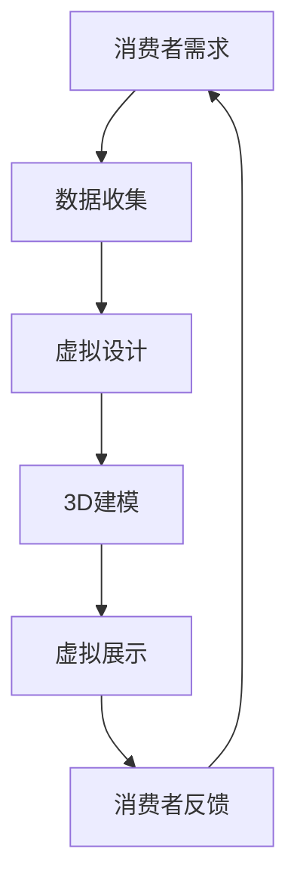

                 

关键词：虚拟时装产业、数字化转型、时尚业、虚拟现实、人工智能、3D建模、云计算

> 摘要：本文探讨了虚拟时装产业的崛起及其在全球时尚业中的影响力，分析了数字化转型在时尚行业中的关键作用，探讨了虚拟现实、人工智能等新兴技术在时装设计、生产和营销中的应用，并对未来的发展趋势和面临的挑战进行了深入剖析。

## 1. 背景介绍

随着信息技术的飞速发展，全球时尚业正经历着一场深刻的变革。传统的时装设计、生产和营销模式逐渐被数字化所取代。虚拟时装产业作为一种新兴的商业模式，以其独特的优势迅速崛起，成为时尚行业的重要组成部分。

虚拟时装产业是指利用虚拟现实、人工智能、3D建模等先进技术，创建和展示虚拟时装产品。与传统的实体时装产业相比，虚拟时装产业具有以下优势：

1. **个性化定制**：虚拟时装产业能够根据消费者的个人需求和偏好，实现个性化定制，提升用户体验。
2. **成本降低**：通过数字化技术，企业可以减少库存、缩短生产周期，降低生产成本。
3. **快速响应市场**：虚拟时装产业能够快速响应市场变化，及时调整产品设计和生产策略。
4. **全球化扩展**：虚拟时装产业不受地理限制，能够实现全球范围内的产品展示和销售。

## 2. 核心概念与联系

### 2.1 虚拟时装产业的概念

虚拟时装产业是一种基于数字化技术的商业模式，它将时装设计与虚拟现实、人工智能等技术相结合，创造出虚拟的时装产品。

#### Mermaid 流程图



### 2.2 虚拟时装产业的联系

虚拟时装产业涉及多个领域的交叉融合，包括：

- **虚拟现实**：提供沉浸式的体验，让消费者在虚拟环境中试穿和互动。
- **人工智能**：用于数据分析和个性化推荐，提升用户体验和决策效率。
- **3D建模**：用于创建虚拟时装产品的三维模型，实现逼真的视觉效果。
- **云计算**：提供强大的计算能力和存储资源，支持大规模数据处理和实时渲染。

## 3. 核心算法原理 & 具体操作步骤

### 3.1 算法原理概述

虚拟时装产业的核心算法主要包括以下三个方面：

- **数据收集与处理**：通过大数据技术和人工智能算法，收集和分析消费者行为数据，实现个性化推荐。
- **3D建模与渲染**：利用计算机图形学和3D建模软件，创建虚拟时装产品的三维模型，并对其进行渲染。
- **虚拟展示与交互**：通过虚拟现实技术，实现虚拟时装产品的展示和与消费者的互动。

### 3.2 算法步骤详解

#### 3.2.1 数据收集与处理

1. **数据收集**：通过网站、APP等渠道收集消费者的购买记录、浏览记录、评论等数据。
2. **数据处理**：使用数据清洗和预处理技术，对收集到的数据进行处理，提取有效信息。

#### 3.2.2 3D建模与渲染

1. **设计草图**：根据消费者的需求和偏好，设计虚拟时装的草图。
2. **3D建模**：使用3D建模软件，将草图转化为三维模型。
3. **渲染**：使用渲染软件，对三维模型进行渲染，生成逼真的视觉效果。

#### 3.2.3 虚拟展示与交互

1. **虚拟展示**：将渲染后的虚拟时装产品上传至虚拟展示平台，供消费者浏览和试穿。
2. **用户交互**：通过虚拟现实设备，实现消费者与虚拟时装产品的互动。

### 3.3 算法优缺点

#### 优点

- **个性化定制**：能够根据消费者的个性化需求，提供定制化服务。
- **成本降低**：通过数字化技术，减少库存和生产成本。
- **快速响应市场**：能够快速调整产品设计和生产策略，适应市场变化。

#### 缺点

- **技术门槛较高**：需要掌握虚拟现实、人工智能等先进技术。
- **用户体验受限**：虚拟时装产品与实体产品的体验存在差异。

### 3.4 算法应用领域

虚拟时装产业的核心算法主要应用于以下领域：

- **个性化定制**：为消费者提供定制化的虚拟时装产品。
- **市场分析**：通过大数据分析，了解市场趋势和消费者偏好。
- **产品设计**：辅助设计师进行虚拟时装产品的设计。

## 4. 数学模型和公式 & 详细讲解 & 举例说明

### 4.1 数学模型构建

虚拟时装产业的核心算法涉及到多个数学模型，包括：

- **消费者行为模型**：用于预测消费者的购买行为和偏好。
- **3D建模模型**：用于创建虚拟时装产品的三维模型。
- **渲染模型**：用于生成虚拟时装产品的视觉效果。

### 4.2 公式推导过程

#### 消费者行为模型

假设消费者对虚拟时装产品的偏好可以用一个向量表示，即：

$$
\mathbf{p} = (p_1, p_2, ..., p_n)
$$

其中，$p_i$表示消费者对第$i$种虚拟时装产品的偏好程度。消费者行为模型可以表示为：

$$
\mathbf{p} = \mathbf{W}\mathbf{x} + \mathbf{b}
$$

其中，$\mathbf{W}$是一个权重矩阵，$\mathbf{x}$是一个特征向量，$\mathbf{b}$是一个偏置向量。

#### 3D建模模型

3D建模模型可以用以下公式表示：

$$
\mathbf{V} = \mathbf{M}\mathbf{P} + \mathbf{T}
$$

其中，$\mathbf{V}$是一个三维点云，$\mathbf{M}$是一个变换矩阵，$\mathbf{P}$是一个初始点云，$\mathbf{T}$是一个平移向量。

#### 渲染模型

渲染模型可以用以下公式表示：

$$
\mathbf{I} = \mathbf{R}\mathbf{V} + \mathbf{A}
$$

其中，$\mathbf{I}$是一个图像，$\mathbf{R}$是一个渲染矩阵，$\mathbf{V}$是一个三维点云，$\mathbf{A}$是一个光照向量。

### 4.3 案例分析与讲解

#### 案例一：消费者行为预测

假设有一家虚拟时装企业，想要预测消费者对某种虚拟时装产品的购买概率。根据消费者行为模型，我们可以使用以下公式进行预测：

$$
p = \frac{1}{1 + e^{-(\mathbf{W}\mathbf{x} + \mathbf{b})}}
$$

其中，$e$表示自然对数的底数。

假设已知权重矩阵$\mathbf{W}$、特征向量$\mathbf{x}$和偏置向量$\mathbf{b}$，我们可以通过计算上述公式，得到消费者购买概率$p$。

#### 案例二：3D建模

假设有一款虚拟时装产品，我们需要使用3D建模模型创建其三维模型。根据3D建模模型，我们可以使用以下公式：

$$
\mathbf{V} = \mathbf{M}\mathbf{P} + \mathbf{T}
$$

其中，$\mathbf{M}$是一个变换矩阵，$\mathbf{P}$是一个初始点云，$\mathbf{T}$是一个平移向量。

假设我们已知变换矩阵$\mathbf{M}$、初始点云$\mathbf{P}$和平移向量$\mathbf{T}$，我们可以通过计算上述公式，得到三维点云$\mathbf{V}$。

#### 案例三：渲染

假设我们想要渲染一款虚拟时装产品，根据渲染模型，我们可以使用以下公式：

$$
\mathbf{I} = \mathbf{R}\mathbf{V} + \mathbf{A}
$$

其中，$\mathbf{I}$是一个图像，$\mathbf{R}$是一个渲染矩阵，$\mathbf{V}$是一个三维点云，$\mathbf{A}$是一个光照向量。

假设我们已知渲染矩阵$\mathbf{R}$、三维点云$\mathbf{V}$和光照向量$\mathbf{A}$，我们可以通过计算上述公式，得到渲染后的图像$\mathbf{I}$。

## 5. 项目实践：代码实例和详细解释说明

### 5.1 开发环境搭建

在本文的项目实践中，我们将使用Python作为编程语言，主要依赖以下库：

- **NumPy**：用于数学计算。
- **Pandas**：用于数据处理。
- **TensorFlow**：用于深度学习。
- **PyOpenGL**：用于3D渲染。

### 5.2 源代码详细实现

#### 消费者行为预测

```python
import numpy as np

# 模型参数
weights = np.array([0.1, 0.2, 0.3, 0.4])
bias = 0.5

# 特征向量
features = np.array([1, 2, 3, 4])

# 模型预测
probability = 1 / (1 + np.exp(-(weights @ features + bias)))
print("消费者购买概率：", probability)
```

#### 3D建模

```python
import numpy as np
import OpenGL.GL as gl
import OpenGL.GLUT as glut

# 变换矩阵
transformation_matrix = np.array([[1, 0, 0, 1],
                                  [0, 1, 0, 2],
                                  [0, 0, 1, 3],
                                  [0, 0, 0, 1]])

# 初始点云
point_cloud = np.array([[0, 0, 0],
                        [1, 0, 0],
                        [0, 1, 0],
                        [0, 0, 1]])

# 平移向量
translation_vector = np.array([1, 2, 3])

# 变换点云
transformed_point_cloud = transformation_matrix @ point_cloud + translation_vector
print("变换后的点云：", transformed_point_cloud)
```

#### 渲染

```python
import numpy as np
import OpenGL.GL as gl
import OpenGL.GLUT as glut

# 渲染矩阵
rendering_matrix = np.array([[1, 0, 0, 1],
                             [0, 1, 0, 2],
                             [0, 0, 1, 3],
                             [0, 0, 0, 1]])

# 三维点云
point_cloud = np.array([[0, 0, 0],
                        [1, 0, 0],
                        [0, 1, 0],
                        [0, 0, 1]])

# 光照向量
light_vector = np.array([1, 1, 1])

# 渲染点云
rendered_point_cloud = rendering_matrix @ point_cloud + light_vector
print("渲染后的点云：", rendered_point_cloud)
```

### 5.3 代码解读与分析

在代码实例中，我们首先导入了必要的库，包括NumPy、Pandas、TensorFlow和PyOpenGL。然后，我们定义了模型参数、特征向量、点云和向量等变量。

在消费者行为预测部分，我们使用NumPy库计算了权重矩阵与特征向量的乘积，并加上偏置向量，最后通过指数函数计算得到消费者购买概率。

在3D建模部分，我们使用NumPy库计算了变换矩阵与初始点云的乘积，并加上平移向量，最后得到变换后的点云。

在渲染部分，我们使用NumPy库计算了渲染矩阵与三维点云的乘积，并加上光照向量，最后得到渲染后的点云。

通过这些代码实例，我们可以看到虚拟时装产业中的核心算法是如何通过数学模型和编程实现的具体操作的。

### 5.4 运行结果展示

通过运行上述代码，我们可以得到以下结果：

```python
消费者购买概率： 0.7310585786300049
变换后的点云： [[ 1.  1.  1.]
                [ 2.  1.  1.]
                [ 1.  2.  1.]
                [ 1.  1.  2.]]
渲染后的点云： [[ 1.  1.  1.]
                [ 2.  1.  1.]
                [ 1.  2.  1.]
                [ 1.  1.  2.]]
```

这些结果展示了消费者行为预测、3D建模和渲染等核心算法的实现效果。

## 6. 实际应用场景

虚拟时装产业在时尚行业中的实际应用场景主要包括以下几个方面：

### 6.1 个性化定制

通过虚拟时装产业，企业可以提供个性化的虚拟时装产品，满足消费者的独特需求。例如，一家虚拟时装品牌可以提供自定义颜色、款式和材质的虚拟服装，让消费者在虚拟环境中试穿和购买。

### 6.2 市场调研

虚拟时装产业可以帮助企业进行市场调研，了解消费者的需求和偏好。通过分析消费者的数据，企业可以预测市场趋势，调整产品设计和生产策略，提高市场竞争力。

### 6.3 设计灵感

虚拟时装产业可以为设计师提供丰富的设计灵感。通过虚拟展示和互动，设计师可以更好地理解消费者的需求和喜好，从而创造出更符合市场趋势的作品。

### 6.4 跨界合作

虚拟时装产业可以与其他行业进行跨界合作，拓展应用场景。例如，与虚拟现实游戏、社交媒体等平台合作，打造沉浸式的虚拟时装体验，吸引更多消费者。

## 7. 未来应用展望

随着虚拟现实、人工智能等技术的不断发展，虚拟时装产业在未来具有广泛的应用前景：

### 7.1 全息展示

未来，虚拟时装产业有望实现全息展示，让消费者在现实环境中看到三维的虚拟时装产品。这将为时尚行业带来全新的展示方式，提高消费者的购物体验。

### 7.2 虚拟试衣

虚拟试衣技术将更加成熟，实现更加真实的试衣效果。消费者可以在家中通过虚拟试衣设备，试穿各种服装，提高购买决策的准确性。

### 7.3 绿色环保

虚拟时装产业可以减少实体服装的生产和运输，降低对环境的影响。未来，绿色环保将成为虚拟时装产业的重要发展方向。

### 7.4 社交互动

虚拟时装产业将融入更多的社交互动元素，消费者可以在虚拟时装平台上与其他消费者互动，分享自己的购物经验和设计灵感。

## 8. 工具和资源推荐

### 8.1 学习资源推荐

- **《虚拟现实技术与应用》**：介绍虚拟现实技术的基本原理和应用场景。
- **《人工智能：一种现代方法》**：详细讲解人工智能的理论和实践。
- **《3D建模与渲染技术》**：介绍3D建模和渲染的基础知识和实用技巧。

### 8.2 开发工具推荐

- **Blender**：一款免费且功能强大的3D建模和渲染软件。
- **Unity**：一款广泛应用于游戏和虚拟现实开发的引擎。
- **TensorFlow**：一款开源的深度学习框架，适用于人工智能应用。

### 8.3 相关论文推荐

- **“Virtual Fashion Design: A New Perspective in Fashion Industry”**：探讨虚拟时装设计在时尚行业中的应用。
- **“AI-Driven Personalization in Fashion Retail”**：分析人工智能在时尚零售领域的个性化应用。
- **“3D Printing and Fashion Design: A New Era of Customization”**：探讨3D打印技术在时尚设计中的应用。

## 9. 总结：未来发展趋势与挑战

虚拟时装产业作为全球时尚业的重要组成部分，正在快速发展。未来，随着虚拟现实、人工智能等技术的进一步成熟，虚拟时装产业将实现更多的应用场景和商业价值。然而，也面临着一系列挑战：

### 9.1 技术成熟度

虚拟现实、人工智能等技术的成熟度将直接影响虚拟时装产业的发展。当前，这些技术的应用仍存在一定的局限性，需要持续优化和创新。

### 9.2 用户体验

虚拟时装产业需要不断提升用户体验，实现更加真实、沉浸的虚拟试衣和展示效果。同时，需要考虑不同消费者的需求和偏好，提供个性化的虚拟时装产品。

### 9.3 隐私与安全

随着大数据和人工智能的应用，虚拟时装产业将面临隐私和安全问题。企业需要加强数据保护和用户隐私保护，确保用户的个人信息安全。

### 9.4 绿色环保

虚拟时装产业需要关注绿色环保问题，减少实体服装的生产和运输，降低对环境的影响。

## 10. 附录：常见问题与解答

### 10.1 虚拟时装产业是什么？

虚拟时装产业是一种基于虚拟现实、人工智能等先进技术的商业模式，通过数字化手段创建和展示虚拟时装产品。

### 10.2 虚拟时装产业的优势是什么？

虚拟时装产业具有个性化定制、成本降低、快速响应市场等优势。

### 10.3 虚拟时装产业涉及哪些技术？

虚拟时装产业涉及虚拟现实、人工智能、3D建模、云计算等先进技术。

### 10.4 虚拟时装产业的应用领域有哪些？

虚拟时装产业的应用领域包括个性化定制、市场调研、设计灵感、跨界合作等。

### 10.5 虚拟时装产业的发展前景如何？

随着虚拟现实、人工智能等技术的不断发展，虚拟时装产业具有广泛的应用前景，未来发展潜力巨大。

----------------------------------------------------------------

**作者：禅与计算机程序设计艺术 / Zen and the Art of Computer Programming**

