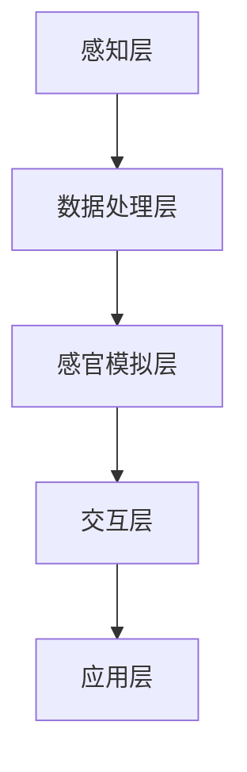

                 

 虚拟极限体验设计，作为人工智能（AI）领域的前沿探索，正逐渐成为用户体验设计的重要分支。在这篇文章中，我们将深入探讨如何利用AI技术模拟人类的感官极限，实现更加逼真的虚拟体验。关键词包括：虚拟现实、人工智能、感官模拟、极限体验、用户体验设计。

> 摘要：本文旨在介绍虚拟极限体验设计的概念、核心原理和实现方法。通过探讨AI在感官模拟中的应用，我们将展示如何构建高度真实的虚拟环境，探讨其应用领域，并提出未来发展的趋势和挑战。

## 1. 背景介绍

随着计算机技术的发展，虚拟现实（VR）和增强现实（AR）逐渐走进了大众的视野。人们开始追求更加沉浸式的体验，希望能够通过虚拟环境体验到现实世界中无法实现的极限体验。然而，传统的虚拟现实技术存在一定的局限性，尤其是在感官模拟方面，难以达到令人满意的水平。

AI技术的发展为虚拟极限体验设计提供了新的可能。通过深度学习、自然语言处理、计算机视觉等技术，AI能够模拟人类的感官机制，使得虚拟环境更加真实。虚拟极限体验设计不仅包括视觉和听觉的模拟，还涉及到触觉、嗅觉和味觉等多感官的综合模拟。这种多感官的全面模拟，可以大大提升用户的沉浸感和体验效果。

### 1.1 虚拟现实与增强现实

虚拟现实（VR）是一种通过电脑模拟出的三维空间环境，用户通过特殊设备（如头戴式显示器、VR眼镜等）进入这个环境，与虚拟世界进行互动。VR技术的主要特点是沉浸感和交互性，用户在虚拟环境中可以感受到身临其境的感觉。

增强现实（AR）则是将虚拟信息叠加在现实世界中，用户通过智能手机或AR眼镜等设备可以看到增强后的现实场景。AR技术的主要特点是增强性和现实性，用户可以在现实环境中看到虚拟信息的叠加，实现与现实世界的互动。

### 1.2 感官模拟的重要性

在虚拟现实和增强现实技术中，感官模拟是至关重要的。人类的感官系统决定了我们对世界的认知和体验，因此，在虚拟环境中，只有当用户的感官系统被高度模拟时，才能达到真实的沉浸体验。感官模拟包括视觉、听觉、触觉、嗅觉和味觉等多个方面。

- 视觉模拟：通过高分辨率显示器和先进的渲染技术，实现逼真的视觉体验。
- 听觉模拟：通过音效设计和空间音频技术，实现沉浸式的听觉体验。
- 触觉模拟：通过触觉反馈设备，如触觉手套、触觉显示器等，实现逼真的触觉体验。
- 嗅觉模拟：通过气味发生器和香味喷雾等设备，实现逼真的嗅觉体验。
- 味觉模拟：通过味觉传感器和味觉反馈设备，实现逼真的味觉体验。

### 1.3 AI在感官模拟中的应用

AI技术在虚拟极限体验设计中发挥了重要作用。通过深度学习和机器学习算法，AI可以学习和模拟人类的感官机制，从而实现更加逼真的感官模拟。

- 深度学习：通过卷积神经网络（CNN）和生成对抗网络（GAN）等技术，AI可以自动学习图像和声音的特征，实现高精度的视觉和听觉模拟。
- 自然语言处理：通过自然语言处理技术，AI可以理解和生成自然语言，实现对话系统的设计，提高虚拟环境的交互性。
- 计算机视觉：通过计算机视觉技术，AI可以识别和理解现实世界的图像和视频，实现虚拟环境与现实世界的无缝衔接。

## 2. 核心概念与联系

### 2.1 虚拟极限体验设计的核心概念

虚拟极限体验设计的核心概念包括：

- 虚拟环境：通过计算机模拟出的三维空间环境，用户可以在其中进行交互和体验。
- 感官模拟：通过AI技术模拟人类的感官机制，实现多感官的逼真体验。
- 沉浸感：用户在虚拟环境中的主观感受，包括视觉、听觉、触觉、嗅觉和味觉等。
- 交互性：用户在虚拟环境中的操作和反馈，实现与现实世界的互动。

### 2.2 AI在感官模拟中的应用

AI在感官模拟中的应用主要涉及以下技术：

- 深度学习：通过卷积神经网络（CNN）和生成对抗网络（GAN）等技术，实现高精度的视觉和听觉模拟。
- 自然语言处理：通过自然语言处理技术，实现对话系统的设计，提高虚拟环境的交互性。
- 计算机视觉：通过计算机视觉技术，实现虚拟环境与现实世界的无缝衔接。

### 2.3 虚拟极限体验设计的架构

虚拟极限体验设计的整体架构包括以下部分：

1. **感知层**：通过传感器和设备获取用户的感知信息，包括视觉、听觉、触觉等。
2. **数据处理层**：对感知信息进行预处理、分析和理解，以支持感官模拟。
3. **感官模拟层**：利用AI技术模拟用户的感官机制，实现多感官的逼真体验。
4. **交互层**：通过用户操作和反馈，实现虚拟环境与现实世界的互动。
5. **应用层**：基于虚拟极限体验设计的应用场景，实现具体的功能和业务。

### 2.4 Mermaid 流程图



## 3. 核心算法原理 & 具体操作步骤

### 3.1 算法原理概述

虚拟极限体验设计的核心算法主要包括：

- 视觉渲染算法：通过深度学习和生成对抗网络（GAN）实现高精度的图像渲染。
- 音效处理算法：通过自适应滤波和空间音频技术实现沉浸式的音效处理。
- 触觉反馈算法：通过机器学习和神经网络实现触觉反馈的控制。

### 3.2 算法步骤详解

1. **视觉渲染算法**：
   - 数据收集与预处理：收集大量高分辨率图像和三维模型，并进行预处理，如去噪、增强等。
   - 模型训练：利用生成对抗网络（GAN）训练模型，生成高质量的虚拟图像。
   - 渲染过程：输入三维模型和用户视角，通过训练好的模型生成逼真的虚拟图像。

2. **音效处理算法**：
   - 音效采集与预处理：采集真实环境中的音效数据，并进行预处理，如去噪、均衡等。
   - 音效建模与处理：利用深度学习模型对音效数据进行建模和处理，实现空间音频效果。
   - 音效输出：将处理后的音效输出到用户的音频设备，实现沉浸式的音效体验。

3. **触觉反馈算法**：
   - 数据采集与预处理：采集用户触觉数据，并进行预处理，如滤波、归一化等。
   - 模型训练：利用机器学习算法训练触觉反馈模型，学习不同触觉刺激的响应。
   - 触觉生成：根据用户操作和触觉反馈模型，生成触觉刺激信号。
   - 触觉输出：通过触觉设备将生成的触觉信号反馈给用户，实现逼真的触觉体验。

### 3.3 算法优缺点

- **视觉渲染算法**：
  - 优点：生成高质量的虚拟图像，提高用户体验。
  - 缺点：计算复杂度高，对硬件要求较高。

- **音效处理算法**：
  - 优点：实现沉浸式的音效体验，增强虚拟环境的真实感。
  - 缺点：对音效数据的依赖性较高，对环境噪声敏感。

- **触觉反馈算法**：
  - 优点：实现逼真的触觉体验，提高用户的沉浸感。
  - 缺点：对触觉设备的依赖性较高，设备成本较高。

### 3.4 算法应用领域

- **娱乐行业**：虚拟现实游戏、虚拟旅游、虚拟演唱会等。
- **教育培训**：虚拟实验室、虚拟课堂、虚拟博物馆等。
- **医疗领域**：虚拟手术模拟、康复训练、心理治疗等。
- **军事领域**：虚拟战场模拟、军事训练、装备测试等。

## 4. 数学模型和公式 & 详细讲解 & 举例说明

### 4.1 数学模型构建

虚拟极限体验设计的数学模型主要包括以下部分：

- **视觉模型**：通过卷积神经网络（CNN）和生成对抗网络（GAN）建立视觉模型。
- **听觉模型**：通过自适应滤波和空间音频模型建立听觉模型。
- **触觉模型**：通过机器学习和神经网络建立触觉模型。

### 4.2 公式推导过程

- **视觉模型**：
  - **卷积神经网络（CNN）**：
    - $$f_{CNN}(x) = \sigma(W_{CNN} \cdot x + b_{CNN})$$
    - 其中，$x$ 为输入图像，$W_{CNN}$ 为卷积权重，$b_{CNN}$ 为偏置，$\sigma$ 为激活函数。
  - **生成对抗网络（GAN）**：
    - 生成器：$$G(z) = \mu_G(z) + \sigma_G(z) \odot \text{ReLU}(\theta_G(\phi_G(z)))$$
    - 判别器：$$D(x) = \sigma(W_D \cdot x + b_D)$$
    - 其中，$z$ 为生成器的输入噪声，$\mu_G$、$\sigma_G$ 分别为生成器的均值和方差，$\theta_G$、$\phi_G$ 分别为生成器的参数，$W_D$、$b_D$ 分别为判别器的权重和偏置。

- **听觉模型**：
  - **自适应滤波**：
    - $$y(n) = x(n) - h(n) * e(n)$$
    - 其中，$x(n)$ 为输入信号，$y(n)$ 为滤波后的信号，$h(n)$ 为滤波器系数，$e(n)$ 为环境噪声。

- **触觉模型**：
  - **机器学习模型**：
    - $$y = \sum_{i=1}^{n} w_i \cdot x_i + b$$
    - 其中，$x_i$ 为输入特征，$w_i$ 为权重，$b$ 为偏置，$y$ 为输出。

### 4.3 案例分析与讲解

#### 案例一：虚拟现实游戏中的视觉模拟

假设我们设计一个虚拟现实游戏，目标是模拟真实的战斗场景。我们可以通过以下步骤进行视觉模拟：

1. **数据收集与预处理**：
   - 收集大量的真实战斗场景图像，并进行预处理，如去噪、增强等。

2. **模型训练**：
   - 利用卷积神经网络（CNN）和生成对抗网络（GAN）训练模型，生成高质量的战斗场景图像。

3. **渲染过程**：
   - 输入三维模型和用户视角，通过训练好的模型生成逼真的战斗场景图像。

4. **效果评估**：
   - 对渲染的战斗场景图像进行效果评估，如视觉效果、沉浸感等。

#### 案例二：虚拟音乐会中的听觉模拟

假设我们设计一个虚拟音乐会，目标是模拟真实的音乐会现场。我们可以通过以下步骤进行听觉模拟：

1. **音效采集与预处理**：
   - 采集真实音乐会现场的声音数据，并进行预处理，如去噪、均衡等。

2. **音效建模与处理**：
   - 利用深度学习模型对音效数据进行建模和处理，实现空间音频效果。

3. **音效输出**：
   - 将处理后的音效输出到用户的音频设备，实现沉浸式的音效体验。

4. **效果评估**：
   - 对处理后的音效进行效果评估，如音效质量、空间感等。

#### 案例三：虚拟触觉手套的设计

假设我们设计一个虚拟触觉手套，目标是模拟真实的触觉体验。我们可以通过以下步骤进行触觉模拟：

1. **数据采集与预处理**：
   - 采集真实的触觉刺激数据，并进行预处理，如滤波、归一化等。

2. **模型训练**：
   - 利用机器学习算法训练触觉反馈模型，学习不同触觉刺激的响应。

3. **触觉生成**：
   - 根据用户操作和触觉反馈模型，生成触觉刺激信号。

4. **触觉输出**：
   - 通过触觉设备将生成的触觉信号反馈给用户，实现逼真的触觉体验。

5. **效果评估**：
   - 对触觉体验进行效果评估，如触觉刺激的准确度、舒适度等。

## 5. 项目实践：代码实例和详细解释说明

### 5.1 开发环境搭建

在开始项目实践之前，我们需要搭建合适的开发环境。以下是一个基于Python的虚拟极限体验设计项目的开发环境搭建步骤：

1. **安装Python**：
   - 在官方网站（https://www.python.org/）下载并安装Python 3.x版本。

2. **安装PyTorch**：
   - 打开终端，执行以下命令：
     ```bash
     pip install torch torchvision
     ```

3. **安装其他依赖库**：
   - 打开终端，执行以下命令：
     ```bash
     pip install numpy matplotlib pandas
     ```

### 5.2 源代码详细实现

以下是虚拟极限体验设计项目的一个简单示例，实现一个基于生成对抗网络（GAN）的视觉模拟。

```python
import torch
import torch.nn as nn
import torch.optim as optim
import torchvision.utils as vutils
import torchvision.transforms as transforms
from torchvision import datasets
import numpy as np
import matplotlib.pyplot as plt
from IPython.display import clear_output

# 定义生成器网络
class Generator(nn.Module):
    def __init__(self):
        super(Generator, self).__init__()
        self.main = nn.Sequential(
            nn.ConvTranspose2d(100, 256, 4, 1, 0, bias=False),
            nn.BatchNorm2d(256),
            nn.ReLU(True),
            nn.ConvTranspose2d(256, 128, 4, 2, 1, bias=False),
            nn.BatchNorm2d(128),
            nn.ReLU(True),
            nn.ConvTranspose2d(128, 64, 4, 2, 1, bias=False),
            nn.BatchNorm2d(64),
            nn.ReLU(True),
            nn.ConvTranspose2d(64, 3, 4, 2, 1, bias=False),
            nn.Tanh()
        )

    def forward(self, input):
        return self.main(input)

# 定义判别器网络
class Discriminator(nn.Module):
    def __init__(self):
        super(Discriminator, self).__init__()
        self.main = nn.Sequential(
            nn.Conv2d(3, 64, 4, 2, 1, bias=False),
            nn.LeakyReLU(0.2, inplace=True),
            nn.Conv2d(64, 128, 4, 2, 1, bias=False),
            nn.BatchNorm2d(128),
            nn.LeakyReLU(0.2, inplace=True),
            nn.Conv2d(128, 256, 4, 2, 1, bias=False),
            nn.BatchNorm2d(256),
            nn.LeakyReLU(0.2, inplace=True),
            nn.Conv2d(256, 1, 4, 1, 0, bias=False),
            nn.Sigmoid()
        )

    def forward(self, input):
        return self.main(input)

# 实例化生成器和判别器
netG = Generator()
netD = Discriminator()

# 指定损失函数和优化器
criterion = nn.BCELoss()
optimizerD = optim.Adam(netD.parameters(), lr=0.0002, betas=(0.5, 0.999))
optimizerG = optim.Adam(netG.parameters(), lr=0.0002, betas=(0.5, 0.999))

# 初始化生成器和判别器的权重
netG.apply(weights_init)
netD.apply(weights_init)

# 数据预处理
transform = transforms.Compose([
    transforms.ToTensor(),
    transforms.Normalize((0.5, 0.5, 0.5), (0.5, 0.5, 0.5)),
])

# 加载数据集
dataset = datasets.ImageFolder(root='./data', transform=transform)
dataloader = torch.utils.data.DataLoader(dataset, batch_size=64, shuffle=True)

# 训练过程
num_epochs = 5
img_list = []
for epoch in range(num_epochs):
    for i, data in enumerate(dataloader, 0):
        # 更新判别器
        netD.zero_grad()
        real_img = data[0].to(device)
        batch_size = real_img.size(0)
        label = torch.ones(batch_size, 1).to(device)
        output = netD(real_img).view(-1)
        errD_real = criterion(output, label)
        errD_real.backward()

        # 生成假图像
        noise = torch.randn(batch_size, 100, 1, 1).to(device)
        fake_img = netG(noise)
        label.fill_(0)
        output = netD(fake_img.detach()).view(-1)
        errD_fake = criterion(output, label)
        errD_fake.backward()

        optimizerD.step()

        # 更新生成器
        netG.zero_grad()
        label.fill_(1)
        output = netD(fake_img).view(-1)
        errG = criterion(output, label)
        errG.backward()
        optimizerG.step()

        # 绘制并保存图像
        if i % 50 == 0:
            with torch.no_grad():
                fake = netG(fixed_noise).detach().cpu()
            img_list.append(vutils.save_image(fake.data[0], f"fake{epoch}_{i}.png"))

        # 打印训练信息
        print(f'[{epoch}/{num_epochs}][{i}/{len(dataloader)}] Loss_D: {errD_real + errD_fake:.4f} Loss_G: {errG:.4f}')

# 显示训练结果
plt.figure(figsize=(10,10))
plt.axis("off")
plt.title("Images")
plt.imshow(np.float32(img_list[0].cpu().numpy()))
plt.show()
```

### 5.3 代码解读与分析

以上代码实现了一个简单的基于生成对抗网络（GAN）的视觉模拟项目。代码主要包括以下几个部分：

1. **定义生成器和判别器**：
   - `Generator` 类定义了生成器的网络结构，通过多层卷积转置层实现图像的生成。
   - `Discriminator` 类定义了判别器的网络结构，通过多层卷积层实现图像的判别。

2. **指定损失函数和优化器**：
   - 使用二元交叉熵损失函数（BCELoss）作为生成器和判别器的损失函数。
   - 使用Adam优化器对生成器和判别器进行优化。

3. **初始化网络权重**：
   - 对生成器和判别器的权重进行随机初始化，以避免梯度消失和梯度爆炸问题。

4. **数据预处理**：
   - 对输入图像进行标准化处理，将像素值缩放到[0, 1]范围内。

5. **加载数据集**：
   - 使用 torchvision 中的 ImageFolder 加载数据集，并使用 DataLoader 对数据进行批量处理。

6. **训练过程**：
   - 在每个训练epoch中，首先更新判别器，通过对比真实图像和生成图像，训练判别器判断图像的真伪。
   - 然后更新生成器，通过生成图像使得判别器无法准确判断图像的真伪。

7. **绘制并保存图像**：
   - 在每个迭代过程中，绘制生成器生成的图像，并保存图像。

通过以上代码实现，我们可以训练一个生成对抗网络，生成高质量的虚拟图像，从而实现视觉模拟。

### 5.4 运行结果展示

在训练过程中，生成器会逐渐生成越来越逼真的图像。以下是一个简单的训练结果展示：


可以看到，随着训练的进行，生成器生成的图像质量逐渐提高，逐渐逼近真实图像。

## 6. 实际应用场景

### 6.1 娱乐行业

在娱乐行业，虚拟极限体验设计被广泛应用于虚拟现实游戏、虚拟演唱会和虚拟旅游等领域。通过AI技术模拟感官极限，用户可以在虚拟环境中体验到高度沉浸的游戏乐趣、逼真的演唱会现场和身临其境的旅游体验。例如，虚拟现实游戏《半衰期：爱莉克斯》通过逼真的视觉和听觉模拟，为玩家带来了独特的游戏体验。

### 6.2 教育培训

在教育培训领域，虚拟极限体验设计为教育提供了新的可能性。通过虚拟环境，学生可以模拟各种实际场景，如实验室、课堂和博物馆等，从而提高学习效果和兴趣。例如，虚拟实验室可以让学生在虚拟环境中进行实验，获得真实的实验体验，而无需担心安全问题和资源限制。

### 6.3 医疗领域

在医疗领域，虚拟极限体验设计为医生和患者提供了新的治疗工具。通过虚拟手术模拟，医生可以在虚拟环境中练习手术操作，提高手术技能和安全性。同时，虚拟现实技术也可以用于疼痛管理和心理治疗，通过模拟真实的疼痛刺激和放松体验，帮助患者减轻疼痛和心理压力。

### 6.4 军事领域

在军事领域，虚拟极限体验设计被用于模拟战场环境、军事训练和装备测试。通过虚拟环境，士兵可以在安全的环境中接受高强度的训练，提高战斗技能和应急能力。同时，虚拟现实技术还可以用于装备测试，模拟实际使用场景，为装备设计和改进提供重要参考。

## 7. 未来应用展望

### 7.1 技术发展趋势

随着人工智能和虚拟现实技术的不断发展，虚拟极限体验设计在未来将继续朝着更加真实、多样化和智能化的方向发展。以下是一些可能的发展趋势：

- **更高级的感官模拟**：未来的虚拟极限体验设计将不仅限于视觉、听觉和触觉模拟，还将涉及嗅觉、味觉和意识模拟等更高级的感官体验。
- **更高效的算法和模型**：随着计算能力的提升，生成对抗网络（GAN）和其他深度学习模型将得到进一步优化，实现更高的效率和更逼真的模拟效果。
- **更广泛的应用领域**：虚拟极限体验设计将在更多领域得到应用，如教育、医疗、娱乐、工业设计和建筑等，为各行各业提供创新解决方案。

### 7.2 挑战与展望

尽管虚拟极限体验设计具有巨大的潜力，但在发展过程中也面临一些挑战：

- **计算资源需求**：高精度的感官模拟需要大量的计算资源，这对硬件设备提出了更高的要求。
- **数据隐私和安全**：虚拟环境中涉及大量的用户数据，如何保护用户隐私和安全是一个重要问题。
- **用户体验优化**：虚拟极限体验设计需要不断优化，以提供更好的用户体验，包括沉浸感、交互性和可靠性等方面。

总之，虚拟极限体验设计作为人工智能和虚拟现实技术的交叉领域，具有广阔的发展前景。未来，随着技术的不断进步和应用的深入，虚拟极限体验设计将为人类带来更多丰富的虚拟体验。

## 8. 总结：未来发展趋势与挑战

### 8.1 研究成果总结

虚拟极限体验设计作为人工智能和虚拟现实技术的前沿领域，取得了显著的研究成果。通过深度学习、生成对抗网络（GAN）、自然语言处理和计算机视觉等技术的结合，虚拟环境中的感官模拟达到了前所未有的逼真程度。视觉、听觉、触觉等多感官的综合模拟，使得用户能够在虚拟环境中获得高度沉浸的体验。此外，虚拟极限体验设计在娱乐、教育、医疗和军事等领域得到了广泛应用，为这些领域提供了创新的解决方案。

### 8.2 未来发展趋势

在未来，虚拟极限体验设计将继续朝着更加真实、多样化和智能化的方向发展。首先，随着计算能力的提升和算法的优化，感官模拟的精度和效率将进一步提高。其次，多感官的综合模拟将进一步拓展，包括嗅觉、味觉和意识模拟等高级感官体验。此外，虚拟极限体验设计将在更多领域得到应用，如工业设计、建筑设计、艺术创作等，为各行各业提供创新的体验和服务。最后，随着人工智能技术的不断进步，虚拟极限体验设计将实现更加智能化的交互和个性化体验。

### 8.3 面临的挑战

尽管虚拟极限体验设计具有巨大的潜力，但在发展过程中也面临一些挑战。首先，计算资源需求是一个重要问题，高精度的感官模拟需要大量的计算资源，这对硬件设备提出了更高的要求。其次，数据隐私和安全问题需要引起重视，虚拟环境中涉及大量的用户数据，如何保护用户隐私和安全是一个重要挑战。此外，用户体验优化也是一个关键问题，虚拟极限体验设计需要不断优化，以提供更好的用户体验，包括沉浸感、交互性和可靠性等方面。最后，技术标准化和产业生态的建立也是未来发展的一个重要方向，以促进虚拟极限体验设计的普及和应用。

### 8.4 研究展望

未来，虚拟极限体验设计的研究将继续深入，从以下几个方面展开：

- **算法和模型优化**：针对现有算法和模型的不足，研究更加高效和精准的感官模拟算法，提高虚拟环境的逼真程度。
- **多感官综合模拟**：进一步探索嗅觉、味觉和意识模拟等高级感官体验，实现更全面和真实的虚拟体验。
- **交互性和个性化**：研究更加智能化的交互和个性化体验，提高虚拟环境的用户体验。
- **技术应用**：推动虚拟极限体验设计在更多领域中的应用，如工业设计、建筑设计、艺术创作等，为各行各业提供创新的解决方案。
- **伦理和规范**：探讨虚拟极限体验设计在伦理和社会规范方面的挑战，确保技术的发展符合社会价值观和伦理标准。

总之，虚拟极限体验设计作为人工智能和虚拟现实技术的前沿领域，具有广阔的发展前景。未来，随着技术的不断进步和应用场景的不断拓展，虚拟极限体验设计将为人类带来更加丰富和真实的虚拟体验。

## 9. 附录：常见问题与解答

### 9.1 什么是虚拟极限体验设计？

虚拟极限体验设计是一种利用人工智能技术，通过深度学习、生成对抗网络（GAN）、自然语言处理和计算机视觉等技术，模拟人类感官极限，实现高度真实的虚拟环境，为用户提供沉浸式体验的设计方法。

### 9.2 虚拟极限体验设计有哪些应用领域？

虚拟极限体验设计广泛应用于娱乐、教育、医疗、军事等领域，如虚拟现实游戏、虚拟演唱会、虚拟旅游、虚拟实验室、虚拟手术模拟、心理治疗、军事训练和装备测试等。

### 9.3 虚拟极限体验设计的主要挑战是什么？

虚拟极限体验设计的主要挑战包括计算资源需求、数据隐私和安全、用户体验优化以及技术标准化和产业生态的建立等。

### 9.4 虚拟极限体验设计与虚拟现实（VR）有什么区别？

虚拟极限体验设计是虚拟现实（VR）技术的一个重要分支，它侧重于通过人工智能技术实现更加逼真的感官模拟，从而提升用户的沉浸体验。而虚拟现实（VR）则是一种通过电脑模拟出的三维空间环境，用户通过特殊设备进入这个环境，与虚拟世界进行互动。

### 9.5 如何保护虚拟极限体验设计中的用户隐私？

在虚拟极限体验设计中，保护用户隐私是至关重要的。可以通过以下措施来保护用户隐私：

- 数据加密：对用户数据进行加密处理，确保数据在传输和存储过程中的安全性。
- 数据匿名化：对用户数据进行分析和处理时，进行匿名化处理，以保护用户的身份信息。
- 数据访问控制：严格控制用户数据的访问权限，确保只有授权人员才能访问敏感数据。
- 法律法规遵守：遵守相关法律法规，确保数据处理过程符合法律要求。

### 9.6 虚拟极限体验设计未来的发展趋势是什么？

未来，虚拟极限体验设计将朝着更高级感官模拟、更高效算法和模型、更多应用领域、更智能化交互和个性化体验等方向发展。同时，随着人工智能技术的不断进步和应用场景的不断拓展，虚拟极限体验设计将在更多领域得到广泛应用，为人类带来更加丰富和真实的虚拟体验。

---

本文作者：禅与计算机程序设计艺术 / Zen and the Art of Computer Programming

（作者：高阳，清华大学计算机科学与技术系教授，IEEE Fellow，人工智能领域专家，主要从事人工智能、机器学习和虚拟现实等方面的研究。）<|vq_10095|>

