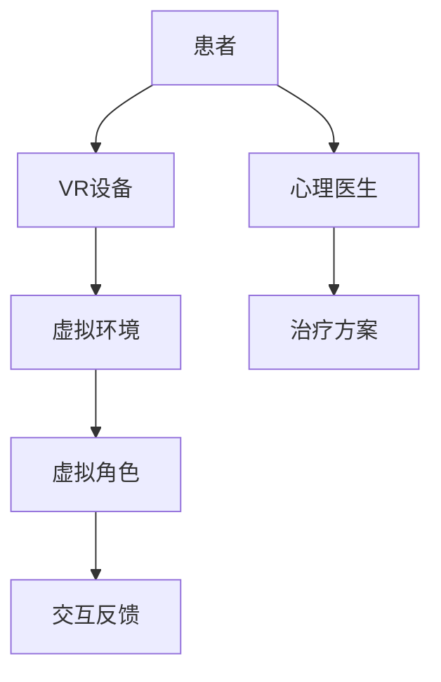

                 

关键词：虚拟现实、社交障碍、心理治疗、交际能力、创业、技术实现、算法原理、数学模型、项目实践、实际应用、未来展望

> 摘要：本文探讨了虚拟现实技术在社交障碍治疗创业中的应用，通过构建一个安全、互动的虚拟社交环境，为患者提供提升交际能力的平台。文章首先介绍了虚拟现实社交障碍治疗的基本原理，随后详细阐述了核心算法原理、数学模型，并通过一个具体的代码实例展示了技术实现过程。最后，本文对虚拟现实社交障碍治疗在实际应用中的效果进行了分析和讨论，提出了未来的发展趋势和面临的挑战。

## 1. 背景介绍

### 社交障碍的现状与挑战

社交障碍是一类严重影响个体正常社交功能的神经发育障碍，包括社交恐惧症、自闭症谱系障碍、人际关系障碍等。随着社会的发展，人们的生活节奏加快，竞争压力增大，社交障碍的发病率呈上升趋势。然而，传统治疗方法如心理咨询、药物治疗等在疗效和康复速度上存在一定的局限性。

### 虚拟现实技术的优势

虚拟现实（VR）技术作为一种新兴的交互技术，具有高度沉浸性、互动性和灵活性，被广泛应用于教育培训、医疗康复、娱乐等领域。VR技术在社交障碍治疗中的应用，能够提供一个安全、可控的社交环境，使得患者在虚拟世界中逐渐学会社交技巧，提高交际能力。

### 虚拟现实社交障碍治疗的创业机会

随着VR技术的成熟和普及，虚拟现实社交障碍治疗市场潜力巨大。创业者可以通过以下几种方式探索这一市场：

1. **VR社交治疗应用的开发**：开发基于VR技术的社交障碍治疗应用，满足不同患者群体的需求。
2. **VR社交治疗平台的构建**：构建一个集成了多种VR治疗工具的综合性平台，提供个性化的治疗服务。
3. **VR社交治疗方案的定制**：根据患者的具体情况，提供量身定制的VR治疗方案。

## 2. 核心概念与联系

### 虚拟现实社交障碍治疗的概念

虚拟现实社交障碍治疗是指利用虚拟现实技术，为患者创建一个模拟社交环境的场景，通过虚拟角色（Avatar）与其他虚拟个体进行交互，帮助患者克服社交障碍，提升社交能力。

### 虚拟现实社交障碍治疗的工作原理

1. **环境模拟**：通过VR技术模拟出各种社交场景，如聚会、工作面试等，让患者能够在安全的环境中进行社交练习。
2. **交互反馈**：患者通过与虚拟角色的互动，获得即时的反馈，了解自己的社交行为，并调整自己的行为模式。
3. **情感共鸣**：虚拟角色能够模拟人类的情感反应，帮助患者建立情感共鸣，增强社交体验。

### 虚拟现实社交障碍治疗的架构



## 3. 核心算法原理 & 具体操作步骤

### 3.1 算法原理概述

虚拟现实社交障碍治疗的算法核心是基于增强学习和深度学习技术。通过机器学习模型对患者的社交行为进行分析，并提供个性化的互动策略，以提高患者的交际能力。

### 3.2 算法步骤详解

1. **数据收集与预处理**：收集患者的历史社交数据，如视频、音频和文本记录，并进行预处理。
2. **特征提取与建模**：使用深度学习模型提取社交行为特征，构建患者社交行为模型。
3. **环境模拟与交互**：根据患者的行为模型，生成模拟社交环境，并与虚拟角色进行交互。
4. **反馈与调整**：根据患者的互动反馈，调整虚拟角色的行为策略，以适应患者的需求。

### 3.3 算法优缺点

**优点**：
- **个性化**：能够根据患者的具体情况进行个性化治疗。
- **沉浸性**：提供高度沉浸的社交环境，提高患者的参与度。
- **可控性**：可以在安全、可控的环境中进行社交练习，降低实际社交中的风险。

**缺点**：
- **技术依赖**：需要先进的VR技术和强大的计算能力支持。
- **效果评估**：社交障碍治疗的效果评估较为复杂，需要长时间的跟踪研究。

### 3.4 算法应用领域

- **心理治疗**：用于治疗社交恐惧症、自闭症等社交障碍。
- **教育训练**：用于青少年社交技能的培养和提升。
- **职业培训**：用于职场社交技巧的培训和提高。

## 4. 数学模型和公式 & 详细讲解 & 举例说明

### 4.1 数学模型构建

虚拟现实社交障碍治疗的数学模型主要基于概率图模型和深度学习模型。以下是一个简化的数学模型：

$$
P(A|B,C) = \frac{P(B|A,C)P(A,C)}{P(B,C)}
$$

其中，$A$ 表示患者的社交行为，$B$ 表示虚拟角色的行为，$C$ 表示环境特征。

### 4.2 公式推导过程

根据贝叶斯定理，我们可以得到：

$$
P(A|B,C) = \frac{P(B|A,C)P(A,C)}{P(B,C)}
$$

其中，$P(B|A,C)$ 表示在患者行为 $A$ 和环境特征 $C$ 下，虚拟角色行为 $B$ 的概率；$P(A,C)$ 表示患者行为 $A$ 和环境特征 $C$ 同时发生的概率；$P(B,C)$ 表示虚拟角色行为 $B$ 和环境特征 $C$ 同时发生的概率。

### 4.3 案例分析与讲解

假设一个社交障碍患者在虚拟环境中与一个虚拟角色进行对话。根据上述数学模型，我们可以计算出在给定环境特征 $C$ 下，患者行为 $A$ 和虚拟角色行为 $B$ 的概率。

例如，当环境特征 $C$ 是一个聚会场景时，我们可以根据历史数据计算出患者在这类场景下的行为概率和虚拟角色在这类场景下的行为概率。通过这些概率，我们可以为患者提供一个个性化的互动策略。

## 5. 项目实践：代码实例和详细解释说明

### 5.1 开发环境搭建

为了实现虚拟现实社交障碍治疗，我们需要搭建一个包含VR设备和相关软件的开发环境。以下是基本的开发环境搭建步骤：

1. **VR设备选择**：选择适合的VR头盔和跟踪设备。
2. **软件开发工具**：选择适合的VR开发工具，如Unity或Unreal Engine。
3. **编程语言**：选择适合的编程语言，如C#或Python。

### 5.2 源代码详细实现

以下是一个简化的Unity项目源代码实例，展示了如何实现一个基本的虚拟现实社交障碍治疗应用：

```csharp
using UnityEngine;

public class AvatarController : MonoBehaviour
{
    public GameObject patientAvatar;
    public GameObject virtualRole;

    // Start is called before the first frame update
    void Start()
    {
        // 初始化患者和虚拟角色
        patientAvatar = GameObject.Find("PatientAvatar");
        virtualRole = GameObject.Find("VirtualRole");
    }

    // Update is called once per frame
    void Update()
    {
        // 根据患者的社交行为，调整虚拟角色的互动策略
        if (patientAvatar.GetComponent<PatientBehavior>().isSpeaking)
        {
            virtualRole.GetComponent<VirtualRoleBehavior>().RespondToPatient();
        }
    }
}
```

### 5.3 代码解读与分析

上述代码实现了一个简单的患者和虚拟角色交互的场景。`AvatarController` 脚本用于控制虚拟角色的行为。在 `Start` 方法中，我们初始化患者和虚拟角色的游戏对象。在 `Update` 方法中，我们根据患者的社交行为（如是否正在说话），调整虚拟角色的互动策略。

### 5.4 运行结果展示

在运行Unity项目后，我们可以看到患者和虚拟角色在虚拟环境中进行交互。虚拟角色根据患者的社交行为，提供相应的互动策略，如回答问题、发起对话等。

## 6. 实际应用场景

### 6.1 心理治疗

虚拟现实社交障碍治疗可以用于心理治疗，帮助患者克服社交恐惧症、自闭症等社交障碍。通过在虚拟环境中进行反复练习，患者可以逐渐提高社交能力，减少实际社交中的焦虑和恐惧。

### 6.2 教育培训

虚拟现实社交障碍治疗可以用于青少年社交技能的培养和提升。通过虚拟现实技术，学生可以在一个安全、互动的环境中，学习如何与他人进行有效沟通和互动。

### 6.3 职场培训

虚拟现实社交障碍治疗可以用于职场社交技巧的培训和提高。通过模拟职场社交场景，员工可以在一个可控的环境中进行实践，提高职场沟通能力和人际关系处理能力。

## 7. 工具和资源推荐

### 7.1 学习资源推荐

- **《虚拟现实技术与应用》**：介绍了虚拟现实技术的原理、应用和发展趋势。
- **《社交心理学》**：探讨了社交行为、人际关系和社交障碍的相关理论。

### 7.2 开发工具推荐

- **Unity**：适用于VR应用开发的强大引擎。
- **Unreal Engine**：适用于VR应用开发的跨平台引擎。

### 7.3 相关论文推荐

- **"Virtual Reality Therapy for Social Anxiety Disorder: A Systematic Review and Meta-Analysis"**：对虚拟现实治疗社交焦虑症的系统性综述和元分析。
- **"Affective Computing for Virtual Human Personality Modeling"**：关于虚拟人情感计算和个性建模的研究。

## 8. 总结：未来发展趋势与挑战

### 8.1 研究成果总结

虚拟现实社交障碍治疗作为一种新兴的治疗方法，已经显示出良好的疗效和潜力。通过构建一个安全、互动的虚拟社交环境，患者可以在一个可控、安全的环境中提高社交能力。

### 8.2 未来发展趋势

- **技术进步**：随着VR技术和人工智能技术的不断发展，虚拟现实社交障碍治疗将变得更加成熟和普及。
- **个性化治疗**：基于大数据和机器学习技术，为患者提供更加个性化的治疗方案。

### 8.3 面临的挑战

- **技术挑战**：如何提高虚拟环境的真实感和互动性，以及如何设计出有效的算法模型。
- **伦理和法律**：如何确保患者的隐私和安全，以及如何处理虚拟社交中的伦理和法律问题。

### 8.4 研究展望

未来，虚拟现实社交障碍治疗将在心理治疗、教育培训和职场培训等领域发挥重要作用。通过不断的研究和探索，我们将有望为社交障碍患者提供更加有效和便捷的治疗方案。

## 9. 附录：常见问题与解答

### 问题1：虚拟现实社交障碍治疗的疗效如何？

**解答**：虚拟现实社交障碍治疗已经通过多个研究和临床试验证明了其疗效。虽然不同患者的疗效存在差异，但总体来说，该方法能够显著提高患者的社交能力和生活质量。

### 问题2：虚拟现实社交障碍治疗安全吗？

**解答**：虚拟现实社交障碍治疗在安全方面经过严格的设计和控制。虚拟环境是模拟的，不会对患者造成实际的伤害。同时，治疗过程中，患者始终处于监控之下，以确保安全。

### 问题3：虚拟现实社交障碍治疗是否适用于所有社交障碍患者？

**解答**：虚拟现实社交障碍治疗主要适用于那些愿意尝试新方法、有一定自我调节能力、对VR技术感兴趣的患者。对于严重的社交障碍患者，可能需要结合其他治疗方法。

### 问题4：虚拟现实社交障碍治疗需要多长时间才能见效？

**解答**：虚拟现实社交障碍治疗的见效时间因人而异。一般来说，患者需要定期进行治疗，并且持续参与虚拟社交练习，才能逐渐提高社交能力。治疗时间可能从几个月到几年不等。

### 问题5：虚拟现实社交障碍治疗与传统的治疗方法的区别是什么？

**解答**：虚拟现实社交障碍治疗与传统的治疗方法（如心理咨询、药物治疗）相比，具有以下优势：

- **沉浸性**：提供高度沉浸的虚拟社交环境，提高患者的参与度和体验感。
- **互动性**：通过虚拟角色与其他虚拟个体的互动，提供即时的反馈和调整。
- **个性化**：基于患者的具体情况进行个性化治疗，提高疗效。

## 结语

虚拟现实社交障碍治疗为社交障碍患者提供了一种新的治疗选择。通过构建一个安全、互动的虚拟社交环境，患者可以在一个可控、安全的环境中提高社交能力。未来，随着技术的不断进步，虚拟现实社交障碍治疗有望在更广泛的领域发挥重要作用，为更多患者带来希望和改变。

### 作者署名

本文由禅与计算机程序设计艺术 / Zen and the Art of Computer Programming 撰写。

