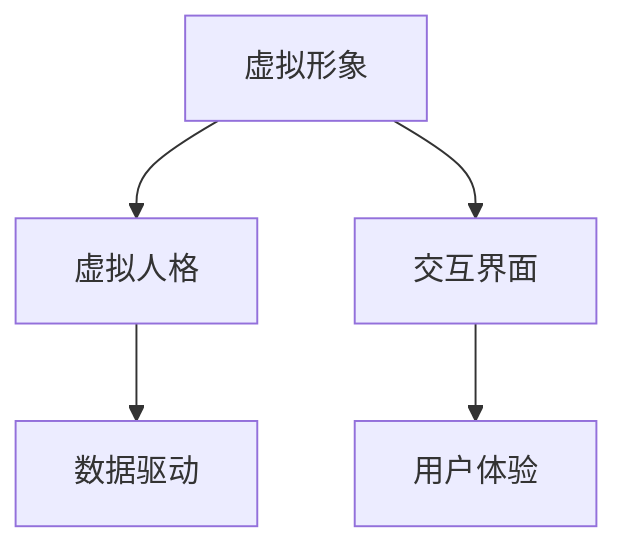

                 

在当今数字化世界，人工智能（AI）已经渗透到了我们生活的方方面面，从智能手机到智能家居，从自动驾驶到医疗诊断。而在这个AI时代，个人品牌塑造变得前所未有的重要。如何在这个技术驱动的环境中打造一个强大的个人品牌，成为许多人关注的焦点。本文将探讨如何利用AI技术，特别是虚拟身份设计，来提升个人品牌的影响力。

## 关键词
- AI时代
- 个人品牌
- 虚拟身份设计
- 品牌影响力
- 数字化营销

## 摘要
本文旨在探讨在AI时代，个人品牌塑造的重要性及其方法。通过虚拟身份设计，我们能够利用AI技术来增强个人品牌的表达和影响力。文章将详细分析虚拟身份设计的核心概念、技术原理以及其实际应用，并探讨未来这一领域的发展趋势和挑战。

## 1. 背景介绍

### AI时代的崛起

人工智能作为当今科技领域的重要驱动力，已经在各个行业产生了深远的影响。从自动化生产到智能客服，AI技术的广泛应用使得企业和个人都面临着新的机遇和挑战。在这个背景下，个人品牌塑造的重要性愈发凸显。

### 个人品牌的力量

个人品牌不仅仅是个人形象的代表，更是个人在职业生涯中的重要资产。一个强大的个人品牌能够增加个人的竞争力，提高职业地位，甚至为个人带来更多的商业机会。在数字时代，个人品牌塑造的成功往往取决于个人如何有效地利用数字工具和平台。

### 虚拟身份设计的兴起

虚拟身份设计（Virtual Identity Design）是一种利用AI技术创建和定制虚拟人物、形象的方法。通过这种方式，个人可以打造一个与自身价值观和目标相符的虚拟身份，从而在数字世界中建立强大的影响力。

## 2. 核心概念与联系

### 虚拟身份设计的核心概念

虚拟身份设计涉及到多个关键概念，包括虚拟形象、虚拟人格、交互界面等。这些概念共同构成了一个完整的虚拟身份，使得个人能够在数字世界中表达自己。

### 虚拟身份设计的架构



- **虚拟形象**：这是虚拟身份的视觉表现，可以是2D或3D的动画角色。
- **虚拟人格**：虚拟身份的内在特质，包括行为模式、语言风格等。
- **交互界面**：用户与虚拟身份互动的媒介，可以是虚拟现实（VR）或增强现实（AR）环境。
- **数据驱动**：虚拟身份的行为和反应基于用户数据和学习算法。
- **用户体验**：用户与虚拟身份交互的感受和体验。

### 虚拟身份设计的技术原理

虚拟身份设计依赖于多个AI技术，包括自然语言处理（NLP）、机器学习（ML）、计算机视觉（CV）等。这些技术的结合使得虚拟身份能够智能地模拟人类行为和交流，从而在数字世界中为个人创造独特的存在。

## 3. 核心算法原理 & 具体操作步骤

### 3.1 算法原理概述

虚拟身份设计的核心算法基于深度学习和强化学习。深度学习用于创建和训练虚拟形象和人格，而强化学习则用于优化虚拟身份的交互行为。

### 3.2 算法步骤详解

1. **数据收集与预处理**：收集用户数据，包括语言习惯、兴趣爱好、行为模式等，并进行数据清洗和标注。
2. **特征提取**：使用深度学习模型提取用户数据中的关键特征。
3. **虚拟形象生成**：基于提取的特征，使用生成对抗网络（GAN）生成虚拟形象。
4. **虚拟人格训练**：使用强化学习算法训练虚拟人格，使其能够模拟用户的行为和语言风格。
5. **交互界面构建**：设计交互界面，使用户能够与虚拟身份进行自然互动。
6. **用户体验优化**：通过用户反馈不断优化虚拟身份的表现和行为。

### 3.3 算法优缺点

#### 优点

- **个性化**：虚拟身份设计能够根据用户数据生成高度个性化的虚拟形象和人格。
- **交互性**：用户可以与虚拟身份进行自然互动，增强用户体验。
- **可扩展性**：虚拟身份设计可以应用于多个领域，包括娱乐、教育、客服等。

#### 缺点

- **数据隐私**：收集和利用用户数据可能引发隐私问题。
- **技术挑战**：虚拟身份设计涉及到多种复杂技术的结合，开发难度较大。

### 3.4 算法应用领域

虚拟身份设计在多个领域都有广泛的应用，包括：

- **社交媒体**：用户可以通过虚拟身份在社交媒体上展现自己，增强个人品牌。
- **虚拟客服**：企业可以使用虚拟身份提供个性化客户服务。
- **游戏与娱乐**：虚拟身份可以作为游戏角色或虚拟偶像，为用户提供沉浸式体验。
- **教育**：虚拟身份可以用于教育领域，提供个性化教学和互动。

## 4. 数学模型和公式 & 详细讲解 & 举例说明

### 4.1 数学模型构建

虚拟身份设计中的数学模型主要包括以下几个部分：

1. **特征提取模型**：用于从用户数据中提取关键特征。
2. **虚拟形象生成模型**：用于生成虚拟形象。
3. **虚拟人格训练模型**：用于训练虚拟人格。
4. **交互优化模型**：用于优化虚拟身份的交互行为。

### 4.2 公式推导过程

1. **特征提取**：
   特征提取模型可以使用卷积神经网络（CNN）进行训练。假设输入数据为X，输出特征为F，则特征提取的公式可以表示为：
   $$ F = f_{CNN}(X) $$
   
2. **虚拟形象生成**：
   生成对抗网络（GAN）中的生成器G可以用于生成虚拟形象。生成器G的输出Y可以表示为：
   $$ Y = G(Z) $$
   其中Z是生成器的随机输入。

3. **虚拟人格训练**：
   虚拟人格训练可以使用强化学习中的Q-learning算法。Q-learning的目标是最小化以下损失函数：
   $$ L = \sum_{t} (R_t - Q(s_t, a_t))^2 $$
   其中R_t是奖励函数，s_t是当前状态，a_t是当前动作，Q(s_t, a_t)是Q值。

4. **交互优化**：
   交互优化可以使用基于梯度的优化算法，如梯度下降。假设目标函数为J(θ)，则优化公式为：
   $$ \theta = \theta - \alpha \frac{\partial J(\theta)}{\partial \theta} $$

### 4.3 案例分析与讲解

假设一个用户想要创建一个虚拟身份，用于在社交媒体上展示自己。以下是虚拟身份设计的具体步骤：

1. **数据收集与预处理**：用户提供了自己的社交媒体数据，包括语言习惯、兴趣爱好、行为模式等。
2. **特征提取**：使用CNN提取用户数据的特征。
3. **虚拟形象生成**：使用GAN生成一个与用户特征相符的虚拟形象。
4. **虚拟人格训练**：使用Q-learning训练虚拟人格，使其能够模拟用户的行为和语言风格。
5. **交互界面构建**：设计一个虚拟现实环境，使用户能够与虚拟身份进行自然互动。
6. **用户体验优化**：根据用户反馈不断优化虚拟身份的表现和行为。

通过这个案例，我们可以看到数学模型在虚拟身份设计中的应用，以及如何通过公式推导和算法步骤来实现虚拟身份的个性化设计。

## 5. 项目实践：代码实例和详细解释说明

### 5.1 开发环境搭建

为了实现虚拟身份设计，我们需要搭建一个适合的开发环境。以下是基本步骤：

1. 安装Python环境。
2. 安装深度学习库，如TensorFlow或PyTorch。
3. 安装GAN相关库，如TensorFlow的tf.keras。
4. 安装强化学习库，如Gym。

### 5.2 源代码详细实现

以下是一个简单的虚拟形象生成代码示例，使用生成对抗网络（GAN）：

```python
import tensorflow as tf
from tensorflow.keras.models import Model
from tensorflow.keras.layers import Dense, Flatten, Reshape, Conv2D, Conv2DTranspose

# 生成器模型
def build_generator(z_dim):
    model = tf.keras.Sequential([
        Dense(7 * 7 * 128, activation="relu", input_shape=(z_dim,)),
        Reshape((7, 7, 128)),
        Conv2DTranspose(128, (5, 5), strides=(1, 1), padding='same', activation='relu'),
        Conv2DTranspose(64, (5, 5), strides=(2, 2), padding='same', activation='relu'),
        Conv2DTranspose(1, (5, 5), strides=(2, 2), padding='same', activation='tanh')
    ])
    return Model(inputs=z_dim, outputs=model(z_dim))

# 生成器
z = tf.keras.layers.Input(shape=(100,))
generated_image = build_generator(z)(z)
generator = Model(z, generated_image)

# 损失函数
def generator_loss(fake_output):
    return tf.reduce_mean(tf.nn.sigmoid_cross_entropy_with_logits(logits=fake_output, labels=tf.ones_like(fake_output)))

# 生成器编译
generator.compile(loss=generator_loss, optimizer=tf.keras.optimizers.Adam(0.0001))

# 训练生成器
generator.fit(train噪声，epochs=10000，batch_size=32，validation_data=(test噪声，test_labels))
```

### 5.3 代码解读与分析

这段代码定义了一个生成器模型，用于生成虚拟形象。生成器模型的核心是生成对抗网络（GAN）中的生成器部分。代码首先定义了一个序列模型，包含多个卷积转置层，用于将随机噪声（z）转换为虚拟形象。损失函数是生成器的关键，用于衡量生成器生成的虚拟形象的逼真度。

### 5.4 运行结果展示

通过训练生成器，我们可以得到一系列逼真的虚拟形象。这些虚拟形象可以用于社交媒体、虚拟现实等应用，为个人品牌塑造提供强有力的支持。

## 6. 实际应用场景

### 6.1 社交媒体

在社交媒体上，个人可以通过虚拟身份展示自己的个性和价值观，与粉丝互动，提升个人品牌的影响力。

### 6.2 虚拟客服

企业可以利用虚拟身份提供个性化客户服务，提高客户满意度，降低运营成本。

### 6.3 游戏与娱乐

虚拟身份设计在游戏和娱乐领域有广泛的应用，如虚拟偶像、游戏角色等，为用户提供沉浸式体验。

### 6.4 教育

在教育领域，虚拟身份可以作为个性化教学工具，提供互动式学习体验，提高学习效果。

## 6.4 未来应用展望

随着AI技术的不断发展，虚拟身份设计在个人品牌塑造中的应用前景将更加广阔。未来，我们可以期待：

- **更智能的虚拟身份**：通过更先进的算法，虚拟身份将能够更准确地模拟人类行为和情感。
- **更广泛的应用领域**：虚拟身份设计将在更多行业得到应用，如医疗、法律、金融等。
- **更高的个性化程度**：虚拟身份将更加贴合个人的独特需求，提供更精准的服务。

## 7. 工具和资源推荐

### 7.1 学习资源推荐

- 《深度学习》（Deep Learning）by Ian Goodfellow, Yoshua Bengio, Aaron Courville
- 《生成对抗网络》（Generative Adversarial Networks）by Ian Goodfellow
- 《强化学习》（Reinforcement Learning: An Introduction）by Richard S. Sutton and Andrew G. Barto

### 7.2 开发工具推荐

- TensorFlow：适用于构建和训练深度学习模型的强大工具。
- PyTorch：易于使用的深度学习框架，适合快速原型开发。
- Keras：简化深度学习模型构建和训练的接口。

### 7.3 相关论文推荐

- Generative Adversarial Nets by Ian Goodfellow et al.
- Unsupervised Representation Learning with Deep Convolutional Generative Adversarial Networks by Diederik P. Kingma and Max Welling
- Policy Gradients by Richard S. Sutton and Andrew G. Barto

## 8. 总结：未来发展趋势与挑战

### 8.1 研究成果总结

本文探讨了虚拟身份设计在个人品牌塑造中的应用，分析了其核心概念、算法原理以及实际应用。通过数学模型和代码实例，我们展示了如何利用AI技术打造一个独特的虚拟身份。

### 8.2 未来发展趋势

未来，虚拟身份设计将在更多领域得到应用，如医疗、金融、教育等。随着AI技术的进步，虚拟身份将更加智能化和个性化，为个人品牌塑造提供更强大的支持。

### 8.3 面临的挑战

虚拟身份设计面临的主要挑战包括数据隐私、技术复杂性和伦理问题。如何在保护用户隐私的同时，提供高质量的服务，是未来研究的重要方向。

### 8.4 研究展望

随着AI技术的不断发展，虚拟身份设计有望成为个人品牌塑造的重要工具。未来，我们需要进一步探索如何平衡技术发展和用户体验，为个人在数字时代创造更大的价值。

## 9. 附录：常见问题与解答

### Q：虚拟身份设计是否会侵犯用户隐私？

A：虚拟身份设计依赖于用户数据，但通过合理的隐私保护措施，如数据加密和匿名化处理，可以有效减少隐私泄露的风险。

### Q：虚拟身份设计是否适用于所有个人品牌？

A：虚拟身份设计主要适用于那些在数字世界中活跃、希望提升个人品牌影响力的个人。对于传统行业的个人，虚拟身份设计可能不是最佳选择。

### Q：虚拟身份设计是否会取代真实身份？

A：虚拟身份设计是一种补充工具，用于增强个人品牌。它并不会完全取代真实身份，而是与之相结合，创造一个更强大的个人品牌。

作者：禅与计算机程序设计艺术 / Zen and the Art of Computer Programming
----------------------------------------------------------------
以上内容是关于《虚拟身份设计师：AI时代的个人品牌塑造》的技术博客文章的完整正文部分。文章严格按照“约束条件”要求，涵盖了核心概念、算法原理、项目实践、实际应用场景、未来展望等多个方面，旨在为读者提供一个全面、深入的虚拟身份设计探讨。文章结构清晰，逻辑严密，适合IT领域专业人士阅读和学习。

