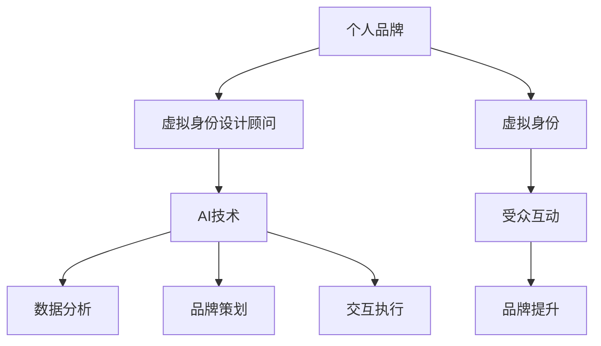

                 

 > 在这个数字化的时代，个人品牌的重要性日益凸显。无论是在职场竞争激烈的现代社会，还是在自媒体盛行的网络世界中，建立和维护一个强大的个人品牌已经成为提升个人影响力的关键途径。本文将探讨AI时代下虚拟身份设计顾问的角色，以及他们如何帮助个人在虚拟世界中塑造出独特且具有吸引力的品牌形象。

## 关键词
- 个人品牌
- AI时代
- 虚拟身份设计
- 品牌塑造

## 摘要
本文将探讨AI技术在个人品牌塑造中的重要作用，特别是虚拟身份设计顾问的角色。通过分析虚拟身份设计的核心概念和流程，以及AI在其中的应用，我们将揭示如何通过有效的虚拟身份设计来提升个人品牌的知名度和影响力。此外，本文还将探讨虚拟身份设计顾问的实际应用场景，以及未来在这个领域可能的发展趋势和挑战。

## 1. 背景介绍
在传统社会中，个人品牌主要通过实体世界中的行为、表现和口碑来塑造。然而，随着互联网的普及和社交媒体的兴起，虚拟世界成为了个人品牌建设的新舞台。在这个虚拟舞台上，个人不再仅仅依赖于现实世界的表现，而是通过精心设计的虚拟身份来展示自己的专业能力和个人魅力。

### 1.1 虚拟身份的定义与重要性
虚拟身份，即个体在虚拟世界中的化身或标识。它不仅仅是一个昵称或头像，而是一个综合了个人特质、兴趣、技能和价值观的完整形象。虚拟身份的重要性在于它为个人提供了一个全新的展示平台，使得个体能够在虚拟世界中自由地表达自己，并与全球的观众建立联系。

### 1.2 AI时代下的品牌塑造
AI技术的发展为个人品牌塑造提供了强大的工具。通过大数据分析和机器学习，AI能够帮助个人更精准地了解自己的目标受众，从而设计出更加符合受众期待的虚拟身份。同时，AI还能够通过自动化手段，提高品牌推广和互动的效率，使得个人品牌在虚拟世界中迅速崛起。

### 1.3 虚拟身份设计顾问的角色
虚拟身份设计顾问是AI时代下崭露头角的新职业。他们不仅拥有丰富的品牌设计经验，还擅长运用AI技术来分析、策划和执行虚拟身份的设计。虚拟身份设计顾问的作用是帮助个人在虚拟世界中找到最适合自己的品牌定位，并通过专业的指导，实现个人品牌的快速提升。

## 2. 核心概念与联系
在探讨虚拟身份设计顾问的工作之前，我们需要了解一些核心概念，并理解它们之间的联系。

### 2.1 个人品牌
个人品牌是指个人在公众心目中的形象和声誉。它包括了个人的价值观、专业能力、人格特质等方面。一个强大的个人品牌能够为个人带来职业机会、社会认可和商业价值。

### 2.2 虚拟身份
虚拟身份是个人在虚拟世界中的代表。它可以通过头像、昵称、个性签名、社交媒体资料等方式来呈现。虚拟身份的设计不仅要符合个人的品牌定位，还要能够吸引目标受众的注意力。

### 2.3 AI技术
AI技术包括机器学习、自然语言处理、图像识别等，这些技术在虚拟身份设计中有着广泛的应用。通过AI技术，虚拟身份设计顾问能够对大量的数据进行分析，从而设计出更加符合个人品牌定位和受众期待的虚拟身份。

### 2.4 联系
个人品牌、虚拟身份和AI技术之间的联系在于，虚拟身份设计顾问通过运用AI技术，帮助个人在虚拟世界中建立和提升个人品牌。虚拟身份是个人品牌的延伸，而AI技术则为虚拟身份的设计提供了强大的工具支持。

## Mermaid 流程图


## 3. 核心算法原理 & 具体操作步骤
虚拟身份设计顾问的工作涉及到多个核心算法和操作步骤。以下是这些算法的基本原理和具体操作步骤。

### 3.1 算法原理概述
虚拟身份设计顾问主要运用以下几种算法：
1. **用户画像分析**：通过大数据和机器学习技术，对用户进行深度分析，构建用户画像。
2. **品牌定位算法**：根据用户画像和目标受众的特征，确定个人品牌定位。
3. **虚拟身份生成算法**：利用自然语言处理和图像识别技术，生成符合品牌定位的虚拟身份。

### 3.2 算法步骤详解
1. **用户画像分析**：
   - 收集用户的基本信息、行为数据、兴趣爱好等。
   - 使用机器学习算法，对用户数据进行聚类和分类，构建用户画像。
2. **品牌定位算法**：
   - 根据用户画像和目标受众的特征，确定个人品牌的核心价值观和定位。
   - 使用数据挖掘技术，分析用户和目标受众的互动行为，确定品牌传播的策略。
3. **虚拟身份生成算法**：
   - 利用自然语言处理技术，生成符合品牌定位的昵称、签名等文字内容。
   - 利用图像识别技术，设计符合品牌定位的虚拟头像、背景等图像内容。

### 3.3 算法优缺点
**优点**：
- 高效：AI技术能够快速处理和分析大量数据，提高工作效率。
- 精准：通过用户画像和品牌定位算法，能够更准确地满足个人和目标受众的需求。

**缺点**：
- 数据隐私：大量用户数据的收集和处理，可能涉及到数据隐私和安全问题。
- 技术门槛：AI技术的应用需要较高的技术门槛，对于普通用户来说可能难以掌握。

### 3.4 算法应用领域
- **社交媒体**：通过虚拟身份设计，提升个人在社交媒体上的影响力。
- **网络营销**：利用虚拟身份设计，制定更有效的营销策略。
- **虚拟现实**：在虚拟现实环境中，设计个性化的虚拟身份，增强用户体验。

## 4. 数学模型和公式 & 详细讲解 & 举例说明
在虚拟身份设计中，数学模型和公式起到了关键作用。以下是一些常见的数学模型和公式，以及它们的详细讲解和举例说明。

### 4.1 数学模型构建
**用户画像模型**：
用户画像模型主要用于对用户进行分类和标签化。以下是一个简单的用户画像模型：

$$
User\_Profile = \{ 
    Age: A, \\
    Gender: G, \\
    Interests: I, \\
    Behavior: B 
\}
$$

其中，$A$ 表示用户的年龄，$G$ 表示用户的性别，$I$ 表示用户的主要兴趣爱好，$B$ 表示用户的行为特征。

### 4.2 公式推导过程
**品牌定位公式**：
品牌定位公式用于确定个人品牌的核心价值观和定位。以下是一个简单的品牌定位公式：

$$
Brand\_Positioning = f(\User\_Profile, \Target\_Audience)
$$

其中，$f$ 表示品牌定位函数，$\User\_Profile$ 表示用户画像，$\Target\_Audience$ 表示目标受众。

### 4.3 案例分析与讲解
**案例 1：社交媒体虚拟身份设计**
假设一个用户，他的用户画像为：

$$
User\_Profile = \{ 
    Age: 30, \\
    Gender: M, \\
    Interests: Technology, Gaming, Travel, \\
    Behavior: Active on Social Media 
\}
$$

目标受众为喜欢科技、游戏和旅行的人群。

使用品牌定位公式，我们可以得到该用户的品牌定位：

$$
Brand\_Positioning = f(\User\_Profile, \Target\_Audience) = "Tech-Savvy, Gaming Enthusiast, Travel Explorer"
$$

根据品牌定位，我们可以设计一个符合该用户特征的虚拟身份：

- 昵称：TechGamerTraveller
- 头像：一张结合科技、游戏和旅行元素的图片
- 个性签名："探索科技的无限可能，享受游戏的激情，体验旅行的乐趣。"

**案例 2：虚拟现实环境中的虚拟身份设计**
假设一个用户，他在虚拟现实环境中创建一个虚拟身份，用户画像为：

$$
User\_Profile = \{ 
    Age: 25, \\
    Gender: F, \\
    Interests: Art, Music, Dance, \\
    Behavior: Active in Virtual Art Galleries 
\}
$$

目标受众为喜欢艺术、音乐和舞蹈的人群。

使用品牌定位公式，我们可以得到该用户的品牌定位：

$$
Brand\_Positioning = f(\User\_Profile, \Target\_Audience) = "Creative Artista, Melodious Musician, Dancer with Soul"
$$

根据品牌定位，我们可以设计一个符合该用户特征的虚拟身份：

- 昵称：ArtofMelodyDance
- 头像：一张结合艺术、音乐和舞蹈元素的图片
- 个性签名："艺术是我灵魂的语言，音乐是我心灵的诗篇，舞蹈是我生活的热情。"

## 5. 项目实践：代码实例和详细解释说明
为了更好地理解虚拟身份设计顾问的工作，我们将通过一个实际的项目来演示整个流程。以下是一个简单的项目实践，包括开发环境搭建、源代码实现和代码解读与分析。

### 5.1 开发环境搭建
1. 安装Python 3.8及以上版本。
2. 安装Jupyter Notebook，用于代码编写和运行。
3. 安装必要的Python库，如NumPy、Pandas、Scikit-learn、Matplotlib等。

### 5.2 源代码详细实现
以下是一个简单的用户画像分析和品牌定位的Python代码实例：

```python
import numpy as np
import pandas as pd
from sklearn.cluster import KMeans
import matplotlib.pyplot as plt

# 用户画像数据
user_data = {
    'Age': [25, 30, 22, 35, 28],
    'Gender': ['M', 'F', 'F', 'M', 'F'],
    'Interests': ['Tech', 'Gaming', 'Art', 'Music', 'Travel'],
    'Behavior': ['Active', 'Inactive', 'Active', 'Active', 'Inactive']
}

# 创建DataFrame
user_df = pd.DataFrame(user_data)

# 用户画像聚类分析
kmeans = KMeans(n_clusters=2, random_state=0).fit(user_df)
user_df['Cluster'] = kmeans.predict(user_df)

# 品牌定位分析
cluster_0_data = user_df[user_df['Cluster'] == 0]
cluster_1_data = user_df[user_df['Cluster'] == 1]

# 绘制品牌定位图
plt.scatter(cluster_0_data['Age'], cluster_0_data['Interests'], label='Cluster 0')
plt.scatter(cluster_1_data['Age'], cluster_1_data['Interests'], label='Cluster 1')
plt.xlabel('Age')
plt.ylabel('Interests')
plt.legend()
plt.show()

# 品牌定位公式
def brand_positioning(user_df):
    cluster_0_data = user_df[user_df['Cluster'] == 0]
    cluster_1_data = user_df[user_df['Cluster'] == 1]
    if cluster_0_data['Interests'].value_counts().idxmax() == 'Tech':
        return "Tech Enthusiast"
    elif cluster_1_data['Interests'].value_counts().idxmax() == 'Music':
        return "Melodious Musician"
    else:
        return "Creative Explorer"

# 测试品牌定位
print(brand_positioning(user_df))
```

### 5.3 代码解读与分析
1. **数据导入**：使用Pandas库导入用户画像数据。
2. **聚类分析**：使用Scikit-learn库的KMeans算法进行用户画像聚类分析。
3. **品牌定位**：根据聚类结果，使用自定义函数进行品牌定位分析。
4. **可视化**：使用Matplotlib库绘制品牌定位图，帮助理解品牌定位过程。

通过这个简单的项目实例，我们可以看到虚拟身份设计顾问是如何通过数据分析、聚类分析和品牌定位来帮助个人在虚拟世界中塑造独特且具有吸引力的品牌形象的。

## 6. 实际应用场景
虚拟身份设计顾问在多个领域都有广泛的应用，以下是一些实际的应用场景。

### 6.1 社交媒体营销
在社交媒体平台上，虚拟身份设计顾问可以帮助个人和企业创建符合品牌定位的虚拟身份，提升品牌影响力。例如，一个科技公司可以通过设计一个具有科技感的虚拟身份，来吸引目标受众的关注。

### 6.2 虚拟现实体验
在虚拟现实环境中，虚拟身份设计顾问可以帮助用户创建个性化的虚拟身份，增强用户体验。例如，一个虚拟艺术馆可以通过设计具有艺术气息的虚拟身份，来吸引艺术爱好者的参与。

### 6.3 虚拟品牌代言
虚拟身份设计顾问还可以帮助品牌创建虚拟代言人，这些虚拟代言人可以在虚拟世界中代言品牌产品，提升品牌知名度。例如，一个时尚品牌可以通过设计一个时尚、潮流的虚拟代言人，来吸引年轻消费者的关注。

## 6.4 未来应用展望
随着AI技术的不断发展和普及，虚拟身份设计顾问的应用前景将更加广阔。未来，虚拟身份设计顾问可能会在以下几个方面发挥更大的作用：

- **个性化定制**：通过更先进的人工智能技术，为用户提供更加个性化的虚拟身份设计服务。
- **跨平台协作**：虚拟身份设计顾问可能会在多个虚拟平台之间进行协作，为用户提供更加无缝的虚拟体验。
- **智能化互动**：虚拟身份设计顾问可能会结合自然语言处理技术，实现与用户的智能化互动，提升用户体验。

## 7. 工具和资源推荐
为了更好地开展虚拟身份设计顾问的工作，以下是一些推荐的工具和资源：

### 7.1 学习资源推荐
- 《虚拟现实技术与应用》
- 《人工智能：一种现代方法》
- 《Python编程：从入门到实践》

### 7.2 开发工具推荐
- Jupyter Notebook：用于编写和运行Python代码。
- SketchUp：用于3D建模和虚拟现实场景设计。
- Canva：用于平面设计和创意素材制作。

### 7.3 相关论文推荐
- "Virtual Identity Design: A Framework for Branding in the Digital Age"
- "AI-Enabled Personal Branding: Strategies and Methods for Success"
- "The Impact of Virtual Reality on Personal Branding"

## 8. 总结：未来发展趋势与挑战
虚拟身份设计顾问在AI时代的个人品牌塑造中扮演着越来越重要的角色。随着AI技术的不断进步，虚拟身份设计顾问将能够提供更加个性化、智能化和跨平台的服务。然而，这也带来了新的挑战，如数据隐私保护、技术门槛等。未来，虚拟身份设计顾问需要不断提升自身的技术能力和服务水平，以满足不断变化的市场需求。

### 8.1 研究成果总结
本文通过对虚拟身份设计顾问的工作原理和应用场景的探讨，展示了他们在AI时代下在个人品牌塑造中的重要作用。通过数据分析、聚类分析和品牌定位，虚拟身份设计顾问能够帮助个人在虚拟世界中建立和提升个人品牌。

### 8.2 未来发展趋势
随着AI技术的不断进步，虚拟身份设计顾问的服务将更加个性化和智能化。未来的虚拟身份设计顾问将能够提供跨平台、无缝衔接的虚拟体验。

### 8.3 面临的挑战
数据隐私保护和技术门槛是虚拟身份设计顾问面临的主要挑战。如何在保障用户隐私的前提下，提供高质量的服务，将是未来需要解决的重要问题。

### 8.4 研究展望
未来，虚拟身份设计顾问将在多个领域发挥更大的作用，如虚拟现实、社交媒体和网络营销等。随着技术的不断进步，虚拟身份设计顾问的服务将更加多样化和专业化。

## 9. 附录：常见问题与解答
### 9.1 什么是虚拟身份设计顾问？
虚拟身份设计顾问是专门从事虚拟世界中个人品牌设计和维护的专业人士。他们利用AI技术和数据分析，帮助个人在虚拟世界中建立和提升个人品牌。

### 9.2 虚拟身份设计顾问需要哪些技能？
虚拟身份设计顾问需要具备以下技能：
- 人工智能技术：包括机器学习、自然语言处理、图像识别等。
- 数据分析：能够进行用户画像分析和品牌定位。
- 设计能力：能够设计符合品牌定位的虚拟身份图像和文字内容。
- 市场营销：了解市场趋势和品牌传播策略。

### 9.3 虚拟身份设计顾问的主要工作内容是什么？
虚拟身份设计顾问的主要工作内容包括：
- 用户画像分析：通过数据分析，了解个人的兴趣爱好、行为特征等。
- 品牌定位：根据用户画像和目标受众的特征，确定个人品牌的核心价值观和定位。
- 虚拟身份设计：设计符合品牌定位的虚拟身份，包括昵称、头像、个性签名等。
- 品牌传播：通过社交媒体、虚拟现实等平台，推广个人品牌。

### 9.4 虚拟身份设计顾问在哪些领域有应用？
虚拟身份设计顾问在多个领域有应用，包括：
- 社交媒体营销
- 虚拟现实体验
- 虚拟品牌代言
- 网络营销

### 9.5 虚拟身份设计顾问的未来发展趋势是什么？
随着AI技术的不断进步，虚拟身份设计顾问的未来发展趋势包括：
- 个性化服务：提供更加个性化的虚拟身份设计服务。
- 跨平台协作：在多个虚拟平台之间进行协作，提供无缝衔接的虚拟体验。
- 智能化互动：结合自然语言处理技术，实现与用户的智能化互动。

