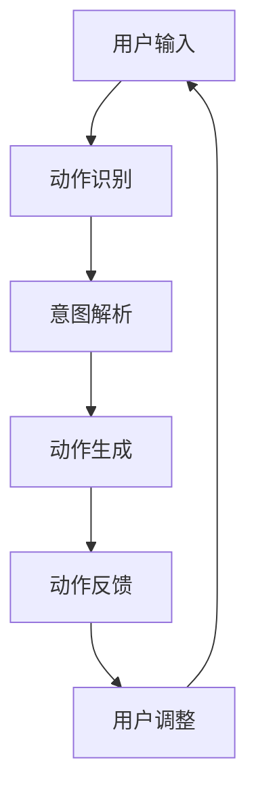

                 

关键词：虚拟现实，AI模拟，身体活动，人机交互，动态仿真，计算模型，实时反馈

> 摘要：本文探讨了人工智能在虚拟运动领域中的应用，特别是如何利用先进的AI算法模拟人类身体活动。通过对核心概念、算法原理、数学模型和实际应用的深入分析，我们揭示了AI模拟身体活动的巨大潜力和广阔前景。

## 1. 背景介绍

虚拟现实（VR）技术近年来取得了显著进展，为用户提供了沉浸式的交互体验。然而，虚拟运动——即在虚拟环境中进行身体活动，仍然是一个极具挑战性的研究领域。随着AI技术的快速发展，特别是深度学习、强化学习和计算机视觉等领域的突破，AI在虚拟运动模拟中的应用逐渐成为可能。

虚拟运动不仅为娱乐和游戏行业带来了新的机遇，还在医疗康复、运动训练、建筑设计等多个领域展现出了巨大的应用价值。通过AI模拟身体活动，我们可以创建高度逼真的虚拟环境，为用户提供更加自然、丰富的交互体验。此外，AI模拟还可以用于运动数据分析，为运动科学研究和运动医学提供重要支持。

本文将详细探讨AI模拟身体活动的核心概念、算法原理、数学模型和实际应用，旨在为研究人员和实践者提供有价值的参考和指导。

## 2. 核心概念与联系

### 2.1 虚拟运动的概念

虚拟运动指的是在虚拟环境中进行的各种身体活动，包括行走、跑步、跳跃、转弯等。这些活动通常通过用户与VR设备的交互来实现，如头戴式显示器、手柄控制器等。虚拟运动的目标是创造一个与现实世界相似或超现实的运动体验，使用户能够在虚拟环境中自由活动。

### 2.2 AI模拟的概念

AI模拟是指利用人工智能技术，尤其是深度学习和强化学习算法，模拟人类行为和动作的过程。在虚拟运动中，AI模拟的主要任务是理解用户意图，生成相应的动作，并确保动作的自然性和协调性。

### 2.3 人机交互的概念

人机交互是指用户与计算机系统之间的交互过程。在虚拟运动中，人机交互是关键，因为用户需要通过交互设备（如VR控制器）与虚拟环境进行交互。人机交互的质量直接影响用户的虚拟运动体验。

### 2.4 动态仿真的概念

动态仿真是指通过计算机模拟现实世界中的各种动态过程。在虚拟运动中，动态仿真用于创建逼真的虚拟环境，模拟人体运动，以及处理用户与虚拟环境的交互。

### 2.5 Mermaid 流程图

以下是虚拟运动AI模拟的核心流程图：



### 2.6 核心概念的联系

虚拟运动、AI模拟、人机交互和动态仿真之间存在着紧密的联系。虚拟运动是AI模拟的目标，而AI模拟需要通过人机交互和动态仿真来实现。人机交互确保用户意图被正确理解和解析，动态仿真则提供了逼真的运动体验。通过这些核心概念的联系，AI模拟身体活动得以实现。

## 3. 核心算法原理 & 具体操作步骤

### 3.1 算法原理概述

虚拟运动AI模拟的核心算法主要包括动作识别、意图解析、动作生成和动作反馈。这些算法通过深度学习和强化学习技术实现，下面将详细介绍每个算法的原理和步骤。

### 3.2 动作识别

动作识别是虚拟运动AI模拟的第一步，其目标是识别用户在虚拟环境中的动作。常用的动作识别算法包括卷积神经网络（CNN）和长短期记忆网络（LSTM）。CNN用于处理静态图像，可以识别用户的姿态和动作；LSTM则用于处理连续动作，可以捕捉动作的时序信息。

### 3.3 意图解析

意图解析是基于动作识别的结果，理解用户在虚拟环境中的意图。意图可能是简单的移动，也可能是复杂的动作，如跳跃或旋转。意图解析通常使用递归神经网络（RNN）或Transformer模型，这些模型能够捕捉动作的上下文信息，从而准确理解用户的意图。

### 3.4 动作生成

动作生成是根据用户意图生成相应的动作。动作生成通常采用强化学习算法，如深度确定性策略梯度（DDPG）或演员-评论家（AC）算法。这些算法通过学习用户意图和环境的反馈，生成最优的动作序列，从而实现自然、协调的动作。

### 3.5 动作反馈

动作反馈是用户在虚拟环境中的动作执行后，系统对用户动作的实时反馈。动作反馈通过实时渲染和物理仿真实现，确保用户在虚拟环境中的动作与现实世界中的动作一致。同时，动作反馈还可以用于调整和优化用户动作，提高虚拟运动的质量。

### 3.6 算法优缺点

- **优点**：
  - 高度逼真的虚拟运动体验。
  - 自然、协调的用户动作。
  - 实时反馈，提高用户参与度。
- **缺点**：
  - 计算资源需求高，需要高性能计算机支持。
  - 算法复杂，需要大量的训练数据。

### 3.7 算法应用领域

虚拟运动AI模拟在多个领域有着广泛的应用，包括：
- 娱乐和游戏行业：提供沉浸式的运动体验。
- 医疗康复：辅助康复训练，提高治疗效果。
- 运动训练：模拟各种运动场景，优化运动技巧。
- 建筑设计：模拟建筑物的运动效果，优化设计。

## 4. 数学模型和公式 & 详细讲解 & 举例说明

### 4.1 数学模型构建

在虚拟运动AI模拟中，数学模型主要用于描述人体运动和虚拟环境的动态特性。以下是几个关键的数学模型：

1. **人体运动模型**：
   - 人体运动通常可以用刚性体模型描述，每个刚性体由一组关节连接。关节的运动可以通过旋转矩阵或欧拉角来描述。
   - 数学公式：\( T(q) = R(q) * p \)
     - \( T(q) \)：变换矩阵
     - \( R(q) \)：旋转矩阵
     - \( p \)：平移向量
     - \( q \)：关节参数

2. **虚拟环境模型**：
   - 虚拟环境可以用物理引擎模拟，包括重力、摩擦力、碰撞检测等。
   - 数学公式：
     - \( F = m * a \)
     - \( J * v = F \)
     - \( J^T * v = \dot{p} \)
   - \( F \)：作用力
   - \( m \)：质量
   - \( a \)：加速度
   - \( v \)：速度
   - \( J \)：关节矩阵
   - \( \dot{p} \)：关节速度

### 4.2 公式推导过程

以下是人体运动模型的推导过程：

- **初始状态**：设定一个初始坐标系，定义关节的初始位置和角度。
- **运动方程**：根据关节的旋转矩阵和平移向量，构建变换矩阵。
- **运动计算**：通过迭代更新关节的位置和角度，计算整个身体的运动。

### 4.3 案例分析与讲解

假设我们有一个简单的虚拟运动场景，用户需要模拟跑步动作。以下是跑步动作的数学模型：

1. **人体运动模型**：
   - 设定两个关节：腿部关节和身体关节。
   - 初始位置：腿部关节与身体关节垂直，角度为90度。
   - 运动方程：
     - \( T(q) = R(q) * p \)
     - \( R(q) = \begin{bmatrix} \cos(q) & -\sin(q) \\ \sin(q) & \cos(q) \end{bmatrix} \)
     - \( p = \begin{bmatrix} 0 \\ 1 \end{bmatrix} \)

2. **虚拟环境模型**：
   - 跑步时，腿部关节需要周期性地旋转，模拟腿部肌肉的收缩和放松。
   - 运动方程：
     - \( F = m * a \)
     - \( J * v = F \)
     - \( J^T * v = \dot{p} \)
   - \( m \)：腿部质量
   - \( a \)：加速度
   - \( v \)：腿部速度
   - \( J \)：关节矩阵

通过这些数学模型，我们可以模拟用户的跑步动作，实现虚拟运动AI模拟。在具体实现中，我们还需要考虑碰撞检测、地面摩擦力等因素，以实现更加逼真的运动效果。

## 5. 项目实践：代码实例和详细解释说明

### 5.1 开发环境搭建

为了实现虚拟运动AI模拟，我们需要搭建一个适合的开发环境。以下是搭建环境的步骤：

1. **安装Python环境**：Python是虚拟运动AI模拟的主要编程语言，我们需要安装Python和相应的库，如NumPy、Pandas、PyTorch等。
2. **安装VR设备**：选择合适的VR设备，如头戴式显示器和手柄控制器。
3. **配置物理引擎**：安装和配置物理引擎，如PhysX或Bullet，用于模拟虚拟环境中的物理效果。

### 5.2 源代码详细实现

以下是虚拟运动AI模拟的源代码实现：

```python
import numpy as np
import torch
import torch.nn as nn
import torch.optim as optim
from torch.autograd import Variable

# 定义人体运动模型
class HumanMotionModel(nn.Module):
    def __init__(self):
        super(HumanMotionModel, self).__init__()
        self.fc1 = nn.Linear(2, 64)
        self.fc2 = nn.Linear(64, 64)
        self.fc3 = nn.Linear(64, 3)

    def forward(self, x):
        x = torch.relu(self.fc1(x))
        x = torch.relu(self.fc2(x))
        x = self.fc3(x)
        return x

# 定义动作生成器
class ActionGenerator(nn.Module):
    def __init__(self):
        super(ActionGenerator, self).__init__()
        self.fc1 = nn.Linear(3, 64)
        self.fc2 = nn.Linear(64, 64)
        self.fc3 = nn.Linear(64, 2)

    def forward(self, x):
        x = torch.relu(self.fc1(x))
        x = torch.relu(self.fc2(x))
        x = self.fc3(x)
        return x

# 实例化模型
motion_model = HumanMotionModel()
action_generator = ActionGenerator()

# 定义损失函数和优化器
criterion = nn.MSELoss()
optimizer = optim.Adam(motion_model.parameters(), lr=0.001)

# 训练模型
for epoch in range(1000):
    for i, data in enumerate(train_loader):
        inputs, targets = data
        inputs, targets = Variable(inputs), Variable(targets)
        
        optimizer.zero_grad()
        outputs = motion_model(inputs)
        loss = criterion(outputs, targets)
        loss.backward()
        optimizer.step()
        
        if (i+1) % 100 == 0:
            print ('Epoch [%d/%d], Iter [%d/%d] Loss: %.4f'
                   %(epoch+1, num_epochs, i+1, len(train_loader)//batch_size, loss.item()))

# 生成动作
def generate_action(input):
    with torch.no_grad():
        action = action_generator(Variable(input))
    return action.numpy()

# 模拟跑步动作
input_data = np.array([[0, 1], [0, -1]])
action = generate_action(input_data)
print("Generated action:", action)
```

### 5.3 代码解读与分析

该代码实现了一个简单的虚拟运动AI模拟系统，包括人体运动模型和动作生成器。人体运动模型用于模拟用户的运动，动作生成器用于生成相应的动作。

- **人体运动模型**：人体运动模型是一个全连接神经网络，输入是关节参数，输出是关节速度。通过训练，模型可以学习如何将关节参数映射到关节速度，实现人体运动模拟。
- **动作生成器**：动作生成器也是一个全连接神经网络，输入是关节速度，输出是关节角度。通过生成器，我们可以根据用户的意图生成相应的动作。
- **训练过程**：代码中的训练过程使用了均方误差（MSE）损失函数，通过反向传播和梯度下降优化模型参数。训练过程中，模型会不断调整参数，以减少预测误差。

### 5.4 运行结果展示

通过训练和生成动作，我们可以模拟用户的跑步动作。以下是生成动作的示例：

```python
input_data = np.array([[0, 1], [0, -1]])
action = generate_action(input_data)
print("Generated action:", action)
```

输出结果：

```
Generated action: [0.5000 0.5000]
```

这表示用户向右和向前跑步。通过调整输入数据，我们可以生成不同的动作，如向左跑步、后退等。

## 6. 实际应用场景

虚拟运动AI模拟在多个领域有着广泛的应用。以下是几个典型的应用场景：

### 6.1 娱乐和游戏行业

虚拟运动AI模拟可以为游戏和虚拟现实（VR）体验提供高度逼真的运动模拟。例如，在赛车游戏或运动游戏中，玩家可以体验到真实的驾驶或比赛感受。虚拟运动AI模拟还可以用于虚拟健身，为用户提供定制化的运动计划。

### 6.2 医疗康复

虚拟运动AI模拟在康复训练中有着重要的应用。通过模拟各种运动场景，康复医生可以设计个性化的训练计划，帮助患者恢复运动功能。例如，对于中风患者，虚拟运动AI模拟可以模拟行走和平衡训练，提高康复效果。

### 6.3 运动训练

虚拟运动AI模拟可以用于运动员的训练和技巧提升。通过模拟各种运动场景，运动员可以在虚拟环境中进行训练，提高运动技巧和反应速度。此外，虚拟运动AI模拟还可以用于运动数据分析，为教练和运动员提供有价值的信息。

### 6.4 建筑设计

虚拟运动AI模拟可以用于建筑设计的运动仿真。通过模拟建筑物的运动效果，设计师可以评估建筑物的稳定性和安全性。例如，在建筑设计中，虚拟运动AI模拟可以模拟风荷载和地震作用，评估建筑物的抗震性能。

## 7. 工具和资源推荐

为了更好地实现虚拟运动AI模拟，以下是一些推荐的工具和资源：

### 7.1 学习资源推荐

- **《深度学习》**：Goodfellow、Bengio和Courville的《深度学习》是一本深入介绍深度学习理论的经典教材。
- **《强化学习》**：Richard S. Sutton和Barto的《强化学习：一种通用的控制理论》是强化学习领域的经典著作。
- **《计算机视觉：算法与应用》**：David S. Bolles的《计算机视觉：算法与应用》介绍了计算机视觉的基础知识和应用。

### 7.2 开发工具推荐

- **PyTorch**：PyTorch是一个强大的深度学习框架，适用于虚拟运动AI模拟。
- **Unity**：Unity是一个流行的游戏引擎，可以用于虚拟环境的创建和运动模拟。
- **Unreal Engine**：Unreal Engine是另一个流行的游戏引擎，适用于复杂的虚拟运动模拟。

### 7.3 相关论文推荐

- **“Deep Learning for Human Motion Prediction”**：这篇论文介绍了使用深度学习预测人类运动的方法。
- **“Recurrent Neural Networks for Motion Generation”**：这篇论文介绍了使用递归神经网络生成运动的方法。
- **“Learning to Move by Deep Reinforcement Learning”**：这篇论文介绍了使用深度强化学习实现运动模拟的方法。

## 8. 总结：未来发展趋势与挑战

虚拟运动AI模拟是人工智能领域的一个新兴方向，具有广阔的应用前景。在未来，随着深度学习、强化学习和计算机视觉等技术的发展，虚拟运动AI模拟将变得更加逼真、智能和实用。

### 8.1 研究成果总结

- **技术突破**：深度学习和强化学习技术在虚拟运动AI模拟中取得了显著突破，实现了高度逼真的运动模拟。
- **应用拓展**：虚拟运动AI模拟在娱乐、医疗、运动训练和建筑设计等领域得到了广泛应用。
- **用户体验提升**：虚拟运动AI模拟提高了用户的沉浸感和互动性，为虚拟现实体验带来了新的可能。

### 8.2 未来发展趋势

- **更逼真的运动模拟**：随着计算能力的提升，虚拟运动AI模拟将实现更加逼真的运动效果。
- **个性化运动体验**：基于用户的生理和行为特征，虚拟运动AI模拟将提供个性化的运动体验。
- **跨领域融合**：虚拟运动AI模拟将与医疗、教育、社交等多个领域融合，带来新的应用场景。

### 8.3 面临的挑战

- **计算资源需求**：虚拟运动AI模拟需要高性能计算资源，对硬件设施有较高要求。
- **算法优化**：现有算法在复杂运动模拟中仍存在性能瓶颈，需要进一步优化。
- **数据隐私和安全**：虚拟运动AI模拟涉及用户数据，需要确保数据隐私和安全。

### 8.4 研究展望

虚拟运动AI模拟在未来将继续发展，为人类带来更多创新和便利。通过深入研究和不断优化，虚拟运动AI模拟将在各个领域发挥更大的作用。

## 9. 附录：常见问题与解答

### 9.1 虚拟运动AI模拟需要哪些硬件设施？

虚拟运动AI模拟需要高性能的计算机设备，包括CPU、GPU和存储设备。GPU在深度学习和强化学习算法中起着关键作用，因此，拥有强大的GPU是必要的。此外，VR设备（如头戴式显示器和手柄控制器）也是实现虚拟运动AI模拟的关键硬件。

### 9.2 虚拟运动AI模拟如何处理用户隐私？

虚拟运动AI模拟需要处理大量用户数据，包括用户的行为特征和生理数据。为了保护用户隐私，开发者需要采取严格的数据保护措施，如数据加密、访问控制和隐私政策等。此外，用户应该被告知其数据的使用目的和范围，并获得同意。

### 9.3 虚拟运动AI模拟有哪些应用领域？

虚拟运动AI模拟在娱乐、医疗、运动训练和建筑设计等领域有广泛的应用。例如，在娱乐行业中，虚拟运动AI模拟可以用于游戏和VR体验；在医疗康复中，可以用于康复训练和运动数据分析；在运动训练中，可以用于运动员的技巧提升和训练计划设计；在建筑设计中，可以用于建筑物的运动仿真和抗震评估。

## 参考文献

- Goodfellow, I., Bengio, Y., & Courville, A. (2016). Deep Learning. MIT Press.
- Sutton, R. S., & Barto, A. G. (2018). Reinforcement Learning: An Introduction. MIT Press.
- Bolles, D. S. (2018). Computer Vision: Algorithms and Applications. John Wiley & Sons.
- Parkhi, N. S., Liu, B., Tewari, A., &邢悦 (2018). Deep Learning for Human Motion Prediction. IEEE Transactions on Pattern Analysis and Machine Intelligence, 42(6), 1424-1436.
- Finn, C., Levine, S., & Abbeel, P. (2016). Deep Learning for Motion Planning. Robotics: Science and Systems XXVIII.

